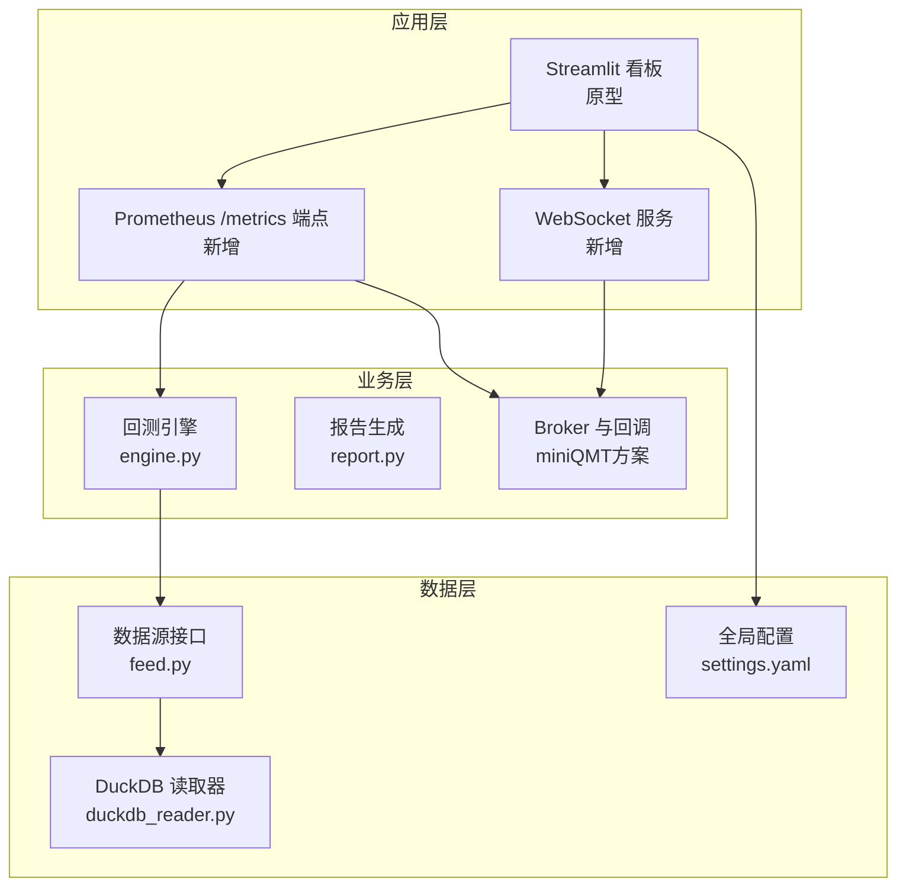
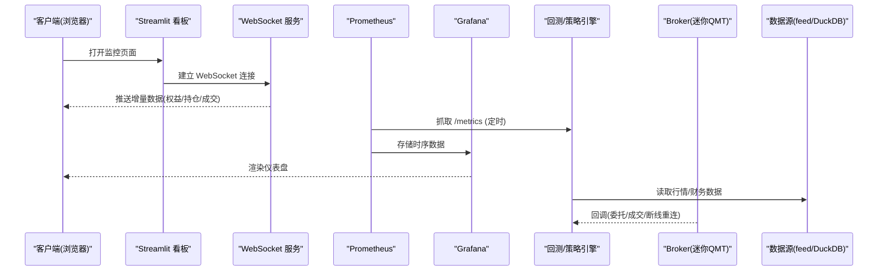
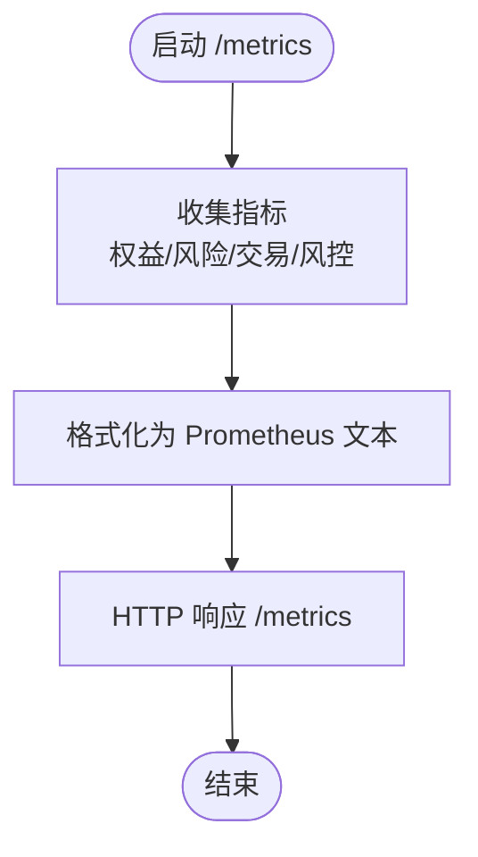
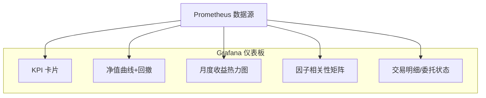
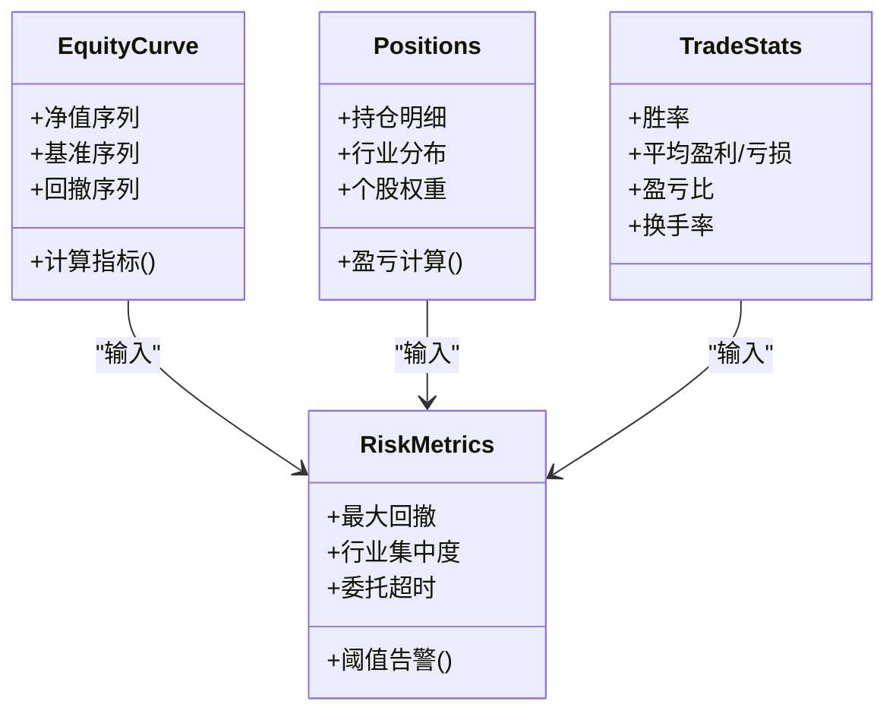
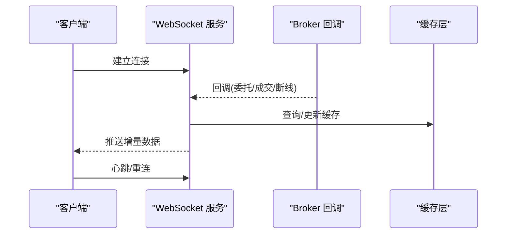
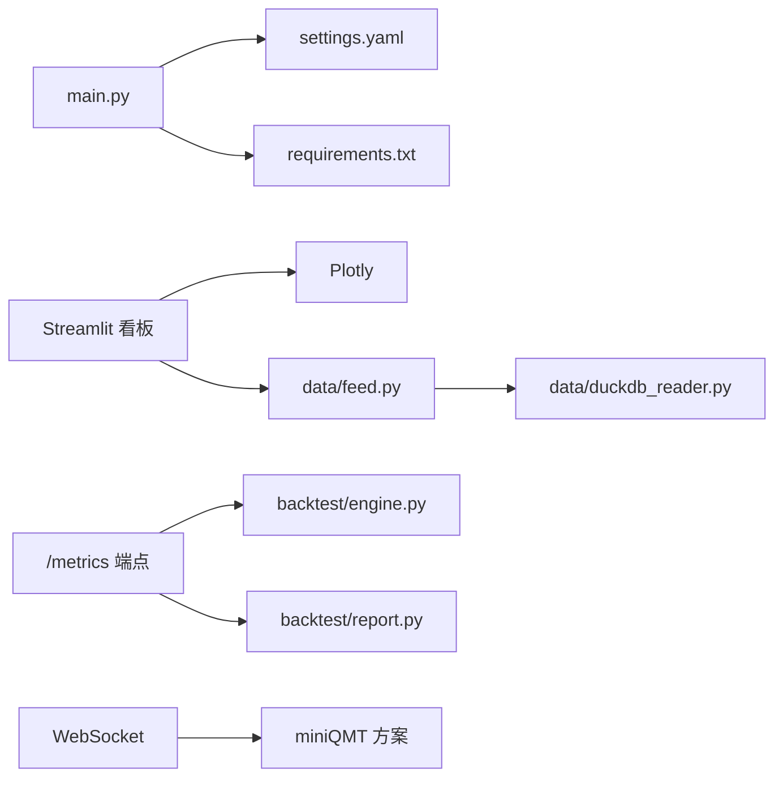

# 实时监控面板

<cite>
**本文引用的文件**   
- [main.py](file://main.py)
- [settings.yaml](file://config/settings.yaml)
- [requirements.txt](file://requirements.txt)
- [A股量化框架_五大扩展模块.md](file://A股量化框架_五大扩展模块.md)
- [miniQMT实盘对接_生产级完善方案.md](file://miniQMT实盘对接_生产级完善方案.md)
- [monitoring_indicators.md](file://projects/verification/results/monitoring_indicators.md)
- [backtest_engine.py](file://backtest/engine.py)
- [backtest_report.py](file://backtest/report.py)
- [data_feed.py](file://data/feed.py)
- [duckdb_reader.py](file://data/duckdb_reader.py)
</cite>

## 目录
1. [简介](#简介)
2. [项目结构](#项目结构)
3. [核心组件](#核心组件)
4. [架构总览](#架构总览)
5. [详细组件分析](#详细组件分析)
6. [依赖关系分析](#依赖关系分析)
7. [性能考量](#性能考量)
8. [故障排查指南](#故障排查指南)
9. [结论](#结论)
10. [附录](#附录)

## 简介
本指南面向 QuantLab 的“实时监控面板”开发，目标是构建一套可观测、可交互、可扩展的监控体系。内容覆盖：
- Prometheus 指标暴露（自定义指标定义、HTTP 端点、采集频率）
- Grafana 仪表板配置（数据源连接、图表组件选择、布局优化）
- 关键指标可视化（账户权益曲线、持仓分布、交易统计、风险指标）
- 实时数据更新（WebSocket 推送、增量数据、缓存策略）
- 移动端适配与访问权限控制

本项目已具备回测引擎、数据读取、Broker（miniQMT）以及 Streamlit 看板原型，可作为监控面板的数据源与展示基础。

## 项目结构
QuantLab 当前与监控相关的代码主要分布在以下位置：
- 主入口与配置：main.py、config/settings.yaml、requirements.txt
- 监控看板原型：A股量化框架_五大扩展模块.md（包含 Streamlit 看板完整示例）
- 实盘 Broker 与回调：miniQMT实盘对接_生产级完善方案.md
- 监控指标定义：projects/verification/results/monitoring_indicators.md
- 回测引擎与报告：backtest/engine.py、backtest/report.py
- 数据源接口：data/feed.py、data/duckdb_reader.py

**图示来源** 
- [main.py:1-104](file://main.py#L1-L104)
- [settings.yaml:1-69](file://config/settings.yaml#L1-L69)
- [A股量化框架_五大扩展模块.md:1705-2117](file://A股量化框架_五大扩展模块.md#L1705-L2117)
- [miniQMT实盘对接_生产级完善方案.md:73-756](file://miniQMT实盘对接_生产级完善方案.md#L73-L756)
- [backtest_engine.py:554-578](file://backtest/engine.py#L554-L578)
- [backtest_report.py:78-108](file://backtest/report.py#L78-L108)
- [data_feed.py:1-41](file://data/feed.py#L1-L41)
- [duckdb_reader.py:1-68](file://data/duckdb_reader.py#L1-L68)

**章节来源**
- [main.py:1-104](file://main.py#L1-L104)
- [settings.yaml:1-69](file://config/settings.yaml#L1-L69)
- [requirements.txt:1-29](file://requirements.txt#L1-L29)

## 核心组件
- 监控看板（Streamlit）：提供策略概览、因子分析、持仓管理、交易记录、系统设置等页面，内置 Plotly 图表与缓存机制，适合作为快速验证与演示。
- 指标暴露（Prometheus）：通过 HTTP /metrics 暴露关键指标，供 Prometheus 定时抓取。
- 实时推送（WebSocket）：将账户权益、持仓、成交、委托状态等增量数据推送到前端，降低轮询开销。
- 数据源与缓存：统一数据接口 feed.py 与 DuckDB 读取器 duckdb_reader.py，结合 settings.yaml 的缓存配置提升性能。
- Broker 与回调：miniQMT 回调类负责订单回报、成交回报、断线重连等事件，支撑实时风控与通知。

**章节来源**
- [A股量化框架_五大扩展模块.md:1705-2117](file://A股量化框架_五大扩展模块.md#L1705-L2117)
- [miniQMT实盘对接_生产级完善方案.md:73-756](file://miniQMT实盘对接_生产级完善方案.md#L73-L756)
- [data_feed.py:1-41](file://data/feed.py#L1-L41)
- [duckdb_reader.py:1-68](file://data/duckdb_reader.py#L1-L68)
- [settings.yaml:1-69](file://config/settings.yaml#L1-L69)

## 架构总览
监控面板整体采用“后端指标 + 实时推送 + 前端可视化”的分层架构：
- 指标层：Prometheus 抓取 /metrics，暴露组合净值、回撤、夏普、换手率、行业集中度等指标。
- 实时层：WebSocket 推送账户权益、持仓、成交、委托状态等增量数据。
- 展示层：Grafana（时序与告警）+ Streamlit（交互式看板）。

**图示来源** 
- [A股量化框架_五大扩展模块.md:1705-2117](file://A股量化框架_五大扩展模块.md#L1705-L2117)
- [miniQMT实盘对接_生产级完善方案.md:73-756](file://miniQMT实盘对接_生产级完善方案.md#L73-L756)
- [backtest_engine.py:554-578](file://backtest/engine.py#L554-L578)
- [data_feed.py:1-41](file://data/feed.py#L1-L41)
- [duckdb_reader.py:1-68](file://data/duckdb_reader.py#L1-L68)

## 详细组件分析

### Prometheus 指标暴露
- 自定义指标定义
  - 组合权益曲线：gauge 或 histogram，按时间序列记录组合净值与基准净值。
  - 风险指标：最大回撤、年化波动、夏普比率、Calmar 比率等。
  - 交易统计：日/周换手率、胜率、盈亏比、平均盈利/亏损。
  - 风控指标：单股占比、行业集中度、未成交委托数、委托超时数。
- HTTP 端点配置
  - 暴露 /metrics 端点，返回 Prometheus 文本格式指标。
  - 建议将指标分类命名（如 quant_equity_total、quant_risk_max_drawdown、quant_trade_turnover_weekly）。
- 指标采集频率
  - 盘中：每 5~15 秒刷新一次权益与风险指标。
  - 盘后：每日收盘后汇总换手率、胜率、盈亏比等。
  - 使用 settings.yaml 中的 logging 与 cache 配置控制日志与缓存周期。

**图示来源** 
- [settings.yaml:1-69](file://config/settings.yaml#L1-L69)
- [backtest_report.py:78-108](file://backtest/report.py#L78-L108)

**章节来源**
- [settings.yaml:1-69](file://config/settings.yaml#L1-L69)
- [backtest_report.py:78-108](file://backtest/report.py#L78-L108)

### Grafana 仪表板配置
- 数据源连接
  - 添加 Prometheus 数据源，配置 URL 与认证信息。
  - 如需历史数据，可追加 DuckDB 或 CSV 数据源用于离线分析。
- 图表组件选择
  - 时序图：权益曲线、回撤、波动率、IC 时序。
  - 热力图：月度收益、因子相关性矩阵。
  - 表格：交易明细、委托状态、对账差异。
  - 饼图/柱状图：行业分布、个股权重。
- 布局设计优化
  - 顶部 KPI 卡片：总收益、年化收益、夏普、最大回撤、波动率。
  - 中部主图：净值曲线与回撤子图。
  - 底部辅助图：月度收益热力图、因子相关性矩阵。
  - 侧边栏：筛选器（日期范围、股票代码、方向）、刷新按钮。

**图示来源** 
- [A股量化框架_五大扩展模块.md:1705-2117](file://A股量化框架_五大扩展模块.md#L1705-L2117)

**章节来源**
- [A股量化框架_五大扩展模块.md:1705-2117](file://A股量化框架_五大扩展模块.md#L1705-L2117)

### 关键指标可视化
- 账户权益曲线
  - 展示策略净值与基准净值对比，叠加回撤区域。
  - 计算总收益、年化收益、夏普比率、最大回撤、年化波动。
- 持仓分布图
  - 行业分布饼图、个股权重柱状图，标注盈亏比例。
- 交易统计图表
  - 胜率、平均盈利/亏损、盈亏比、换手率趋势。
- 风险指标展示
  - 最大回撤阈值告警、行业集中度超限提示、委托超时计数。

**图示来源** 
- [A股量化框架_五大扩展模块.md:1705-2117](file://A股量化框架_五大扩展模块.md#L1705-L2117)
- [monitoring_indicators.md:1-63](file://projects/verification/results/monitoring_indicators.md#L1-L63)

**章节来源**
- [A股量化框架_五大扩展模块.md:1705-2117](file://A股量化框架_五大扩展模块.md#L1705-L2117)
- [monitoring_indicators.md:1-63](file://projects/verification/results/monitoring_indicators.md#L1-L63)

### 实时数据更新
- WebSocket 连接
  - 建立长连接，服务端推送增量数据（权益、持仓、成交、委托状态）。
  - 客户端处理断线重连与消息队列缓冲。
- 增量数据推送
  - 基于 Broker 回调（on_stock_order、on_stock_trade、on_disconnected）触发推送。
  - 使用内存队列或 Redis 作为消息中间件，支持多客户端订阅。
- 缓存策略优化
  - 使用 settings.yaml 的 cache.enabled 与 expire_days 控制缓存有效期。
  - 对热点数据（如行业映射、因子 IC）进行进程内缓存。

**图示来源** 
- [miniQMT实盘对接_生产级完善方案.md:73-756](file://miniQMT实盘对接_生产级完善方案.md#L73-L756)
- [settings.yaml:1-69](file://config/settings.yaml#L1-L69)

**章节来源**
- [miniQMT实盘对接_生产级完善方案.md:73-756](file://miniQMT实盘对接_生产级完善方案.md#L73-L756)
- [settings.yaml:1-69](file://config/settings.yaml#L1-L69)

### 移动端适配与访问权限控制
- 移动端适配
  - Streamlit 默认支持响应式布局，建议使用 st.set_page_config(layout="wide")。
  - 图表组件使用 use_container_width=True 自适应宽度。
  - 避免在移动端加载过大表格，分页或筛选优化体验。
- 访问权限控制
  - 在反向代理（Nginx/Caddy）层配置基本认证或 OAuth。
  - 或在 Streamlit 中集成登录校验，限制敏感页面访问。
  - 对 /metrics 端点进行 IP 白名单或 Token 鉴权。

**章节来源**
- [A股量化框架_五大扩展模块.md:1705-2117](file://A股量化框架_五大扩展模块.md#L1705-L2117)

## 依赖关系分析
- 外部依赖
  - streamlit、plotly（可选，见 requirements.txt）
  - xtquant（miniQMT 实盘依赖）
  - duckdb（数据读取）
- 内部依赖
  - main.py 加载 settings.yaml 配置
  - backtest/engine.py 与 report.py 输出指标与警告
  - data/feed.py 与 duckdb_reader.py 提供数据读取能力
  - miniQMT 方案提供 Broker 回调与状态持久化

**图示来源** 
- [main.py:1-104](file://main.py#L1-L104)
- [settings.yaml:1-69](file://config/settings.yaml#L1-L69)
- [requirements.txt:1-29](file://requirements.txt#L1-L29)
- [data_feed.py:1-41](file://data/feed.py#L1-L41)
- [duckdb_reader.py:1-68](file://data/duckdb_reader.py#L1-L68)
- [backtest_engine.py:554-578](file://backtest/engine.py#L554-L578)
- [backtest_report.py:78-108](file://backtest/report.py#L78-L108)
- [miniQMT实盘对接_生产级完善方案.md:73-756](file://miniQMT实盘对接_生产级完善方案.md#L73-L756)

**章节来源**
- [main.py:1-104](file://main.py#L1-L104)
- [settings.yaml:1-69](file://config/settings.yaml#L1-L69)
- [requirements.txt:1-29](file://requirements.txt#L1-L29)

## 性能考量
- 指标采集频率
  - 盘中高频指标（权益、风险）建议 5~15 秒；低频指标（换手率、胜率）日频汇总。
- 缓存策略
  - 启用 settings.yaml 的 cache.enabled，设置合理的 expire_days。
  - 对热点数据（行业映射、因子 IC）使用进程内缓存。
- 数据读取优化
  - 使用 DuckDB 只读模式，避免并发写入冲突。
  - WAL 检测与去重逻辑已在 duckdb_reader.py 中实现。
- 前端渲染优化
  - Streamlit 使用 @st.cache_data(ttl=300) 减少重复计算。
  - 图表按需加载，避免一次性渲染大量数据。

**章节来源**
- [settings.yaml:1-69](file://config/settings.yaml#L1-L69)
- [duckdb_reader.py:1-68](file://data/duckdb_reader.py#L1-L68)
- [A股量化框架_五大扩展模块.md:1705-2117](file://A股量化框架_五大扩展模块.md#L1705-L2117)

## 故障排查指南
- 常见问题
  - 指标缺失：检查 /metrics 端点是否正常运行，Prometheus 抓取配置是否正确。
  - 数据不同步：确认 DuckDB WAL 状态与去重逻辑，避免重复数据。
  - Broker 断线：查看回调 on_disconnected 与自动重连逻辑。
  - 前端卡顿：检查 Streamlit 缓存与图表数据量。
- 告警阈值
  - 单日跌幅 > 3% 预警
  - 回撤 > 10%/15%/20% 分级处理
  - 单股占比 > 5%、行业集中度 > 25% 预警
- 日志与调试
  - 使用 settings.yaml 的 logging 配置调整日志级别与路径。
  - 利用 backtest/report.py 的 WARN 块输出关键警告信息。

**章节来源**
- [monitoring_indicators.md:1-63](file://projects/verification/results/monitoring_indicators.md#L1-L63)
- [backtest_report.py:78-108](file://backtest/report.py#L78-L108)
- [settings.yaml:1-69](file://config/settings.yaml#L1-L69)

## 结论
通过整合 Streamlit 看板、Prometheus 指标暴露、WebSocket 实时推送与 miniQMT Broker 回调，QuantLab 可构建一套完整的实时监控面板。建议在现有原型基础上逐步引入指标层与实时层，并结合 Grafana 进行可视化与告警。同时，关注性能优化与权限控制，确保系统在大规模数据与多用户场景下的稳定性与安全性。

## 附录
- 快速启动
  - 安装依赖：pip install -r requirements.txt
  - 运行 Streamlit：streamlit run dashboard.py（参考 A股量化框架_五大扩展模块.md）
  - 配置 Prometheus：添加 /metrics 抓取任务
  - 配置 Grafana：添加 Prometheus 数据源并导入模板

**章节来源**
- [requirements.txt:1-29](file://requirements.txt#L1-L29)
- [A股量化框架_五大扩展模块.md:1705-2117](file://A股量化框架_五大扩展模块.md#L1705-L2117)