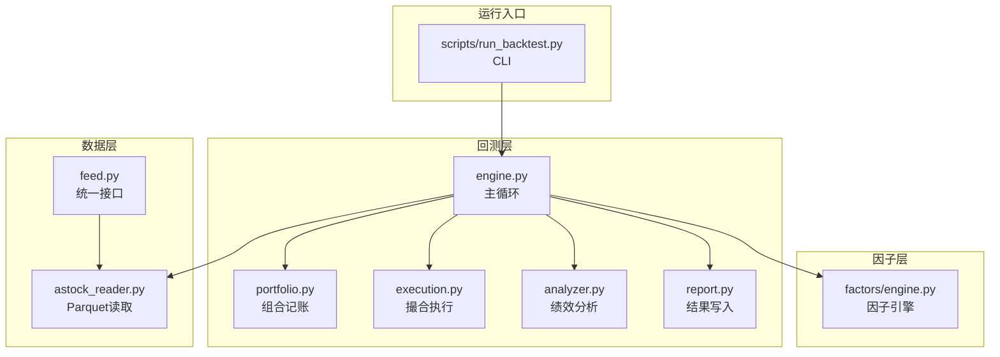
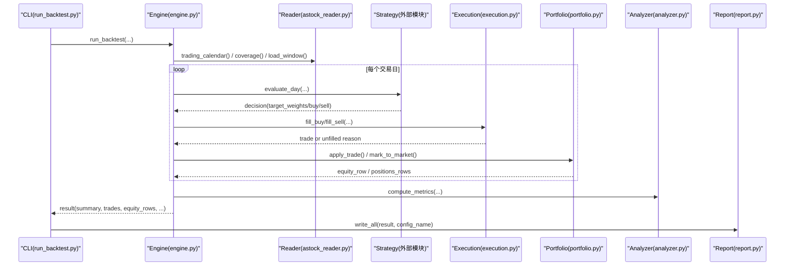
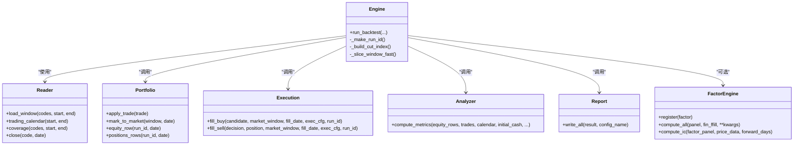
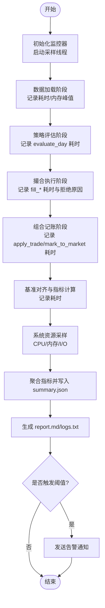

# 性能监控脚本

<cite>
**本文引用的文件**   
- [backtest/engine.py](file://backtest/engine.py)
- [backtest/analyzer.py](file://backtest/analyzer.py)
- [backtest/report.py](file://backtest/report.py)
- [backtest/portfolio.py](file://backtest/portfolio.py)
- [backtest/execution.py](file://backtest/execution.py)
- [data/astock_reader.py](file://data/astock_reader.py)
- [data/feed.py](file://data/feed.py)
- [factors/engine.py](file://factors/engine.py)
- [scripts/run_backtest.py](file://scripts/run_backtest.py)
- [projects/verification/engine_tests.py](file://projects/verification/engine_tests.py)
</cite>

## 目录
1. [引言](#引言)
2. [项目结构](#项目结构)
3. [核心组件](#核心组件)
4. [架构总览](#架构总览)
5. [详细组件分析](#详细组件分析)
6. [依赖关系分析](#依赖关系分析)
7. [性能考虑](#性能考虑)
8. [故障排查指南](#故障排查指南)
9. [结论](#结论)
10. [附录：性能监控脚本开发规范与实现要点](#附录性能监控脚本开发规范与实现要点)

## 引言
本指南面向 QuantLab 的性能监控脚本开发，目标是建立一套可落地的回测与系统级性能监控体系，覆盖以下方面：
- 回测性能指标收集：回测执行时间统计、内存峰值监控、数据处理速度分析
- 系统资源监控：CPU 使用率实时监控、内存占用趋势分析、磁盘 I/O 性能监控
- 关键性能指标定义：因子计算效率、订单执行延迟、策略响应时间
- 性能基准测试：不同数据规模下的性能对比、并发处理能力测试、内存泄漏检测
- 性能报告生成与异常告警机制

本指南基于现有回测引擎、数据读取、报告输出等模块进行设计，确保与既有代码契约兼容，便于在工程中直接集成。

## 项目结构
QuantLab 采用分层模块化组织：
- backtest：回测引擎、组合记账、撮合执行、绩效分析、报告写入
- data：数据源统一接口与具体读取器（Parquet/DuckDB）
- factors：因子注册与计算引擎
- scripts：命令行入口与批处理脚本
- projects：各策略项目与验证用例

图表来源 
- [backtest/engine.py:237-619](file://backtest/engine.py#L237-L619)
- [backtest/portfolio.py:38-189](file://backtest/portfolio.py#L38-L189)
- [backtest/execution.py:95-204](file://backtest/execution.py#L95-L204)
- [backtest/analyzer.py:96-176](file://backtest/analyzer.py#L96-L176)
- [backtest/report.py:245-264](file://backtest/report.py#L245-L264)
- [data/astock_reader.py:25-192](file://data/astock_reader.py#L25-L192)
- [data/feed.py:17-197](file://data/feed.py#L17-L197)
- [factors/engine.py:9-86](file://factors/engine.py#L9-L86)
- [scripts/run_backtest.py:42-132](file://scripts/run_backtest.py#L42-L132)

章节来源
- [backtest/engine.py:237-619](file://backtest/engine.py#L237-L619)
- [scripts/run_backtest.py:42-132](file://scripts/run_backtest.py#L42-L132)

## 核心组件
- 回测引擎（engine.py）：负责日历构建、数据窗口切片、策略调用、交易撮合、组合记账、基准对齐与汇总指标计算，并记录运行时间与摘要信息
- 组合记账（portfolio.py）：维护现金、持仓、市值、日收益快照
- 撮合执行（execution.py）：按 next_open 模型匹配买卖，处理涨跌停、停牌、滑点、佣金与印花税
- 绩效分析（analyzer.py）：计算累计收益、年化、最大回撤、夏普、Calmar、胜率、平均持仓天数、超额收益与信息比率
- 报告写入（report.py）：输出 trades.csv、equity_curve.csv、positions.csv、logs.txt、report.md、summary.json
- 数据读取（astock_reader.py / feed.py）：提供 load_window/trading_calendar/coverage/close 等统一接口
- 因子引擎（factors/engine.py）：注册与批量计算因子，支持 IC/ICIR 评估

章节来源
- [backtest/engine.py:237-619](file://backtest/engine.py#L237-L619)
- [backtest/portfolio.py:38-189](file://backtest/portfolio.py#L38-L189)
- [backtest/execution.py:95-204](file://backtest/execution.py#L95-L204)
- [backtest/analyzer.py:96-176](file://backtest/analyzer.py#L96-L176)
- [backtest/report.py:245-264](file://backtest/report.py#L245-L264)
- [data/astock_reader.py:25-192](file://data/astock_reader.py#L25-L192)
- [data/feed.py:17-197](file://data/feed.py#L17-L197)
- [factors/engine.py:9-86](file://factors/engine.py#L9-L86)

## 架构总览
下图展示从 CLI 到回测引擎、数据读取、策略执行、撮合、组合记账、绩效分析与报告输出的完整流程，以及性能监控的接入点。

图表来源 
- [scripts/run_backtest.py:42-132](file://scripts/run_backtest.py#L42-L132)
- [backtest/engine.py:237-619](file://backtest/engine.py#L237-L619)
- [backtest/execution.py:95-204](file://backtest/execution.py#L95-L204)
- [backtest/portfolio.py:38-189](file://backtest/portfolio.py#L38-L189)
- [backtest/analyzer.py:96-176](file://backtest/analyzer.py#L96-L176)
- [backtest/report.py:245-264](file://backtest/report.py#L245-L264)

## 详细组件分析

### 回测引擎与性能采集点
- 执行时间统计：引擎在入口处记录 started_at，结束时计算 runtime_seconds，并写入 summary.runtime_seconds
- 数据加载与切片：load_window 返回 dict[code] -> DataFrame；_build_cut_index/_slice_window_fast 用于 O(1) 每日切片
- 基准对齐：benchmark_closes 填充与 returns 计算，影响 IR/excess 可用性
- 诊断聚合：warnings_unique、候选数均值、未成交订单计数、strategy_specific 聚合
- 绩效指标：调用 analyzer.compute_metrics 产出 perf 字典

建议的性能采集点：
- 数据加载耗时与内存峰值（load_window）
- 每日策略 evaluate_day 耗时与内存增量
- 撮合执行 fill_buy/fill_sell 耗时与失败原因分布
- 组合记账 mark_to_market/apply_trade 耗时
- 基准对齐与指标计算耗时

章节来源
- [backtest/engine.py:237-619](file://backtest/engine.py#L237-L619)
- [backtest/analyzer.py:96-176](file://backtest/analyzer.py#L96-L176)

### 组合记账与内存行为
- Portfolio 维护 cash、positions、last_total_asset
- mark_to_market 更新 last_price 与 unrealized_pnl
- apply_trade 遵循 T+1 可用规则与成本分摊
- equity_row/positions_rows 生成 CSV 行

内存优化建议：
- 避免重复构造大对象，复用临时变量
- 及时释放不再使用的中间 DataFrame（如每日 window 视图）
- 关注 positions 字典增长对内存的影响

章节来源
- [backtest/portfolio.py:38-189](file://backtest/portfolio.py#L38-L189)

### 撮合执行与延迟
- next_open 模型：T+1 开盘价成交，考虑涨跌停、停牌、滑点、佣金与印花税
- fill_buy/fill_sell 返回 trade 或拒绝原因（suspended、limit_up/down、below_min_lot 等）

延迟采集建议：
- 记录每次撮合耗时与拒绝原因
- 统计每笔订单从决策到成交的端到端延迟（含数据获取、价格校验、费用计算）

章节来源
- [backtest/execution.py:95-204](file://backtest/execution.py#L95-L204)

### 绩效分析与基准
- 计算 total_return、annual_return、max_drawdown、sharpe、calmar、win_rate、avg_holding_days
- 若 benchmark_available 且序列有效，计算 excess_return、information_ratio、tracking_error

章节来源
- [backtest/analyzer.py:96-176](file://backtest/analyzer.py#L96-L176)

### 数据读取与吞吐
- astock_reader 仅读取必要列，降低内存占用；支持 raw/qfq/hfq 调整
- load_window 按日期与代码过滤，返回 per-code DataFrame
- coverage 提供数据范围、去重计数、数据库 mtime 等元信息

吞吐采集建议：
- 记录 load_window 耗时、返回行数、去重比例
- 监控 parquet 读取时的 IO 吞吐与缓存命中情况

章节来源
- [data/astock_reader.py:25-192](file://data/astock_reader.py#L25-L192)

### 因子计算效率
- FactorEngine.register/compute_all 支持批量计算，compute_ic 支持截面 IC/ICIR
- 建议在 compute_all 中记录每个因子的计算耗时与内存峰值

章节来源
- [factors/engine.py:9-86](file://factors/engine.py#L9-L86)

### 报告与日志
- report.write_all 输出标准六件套：trades.csv、equity_curve.csv、positions.csv、logs.txt、report.md、summary.json
- logs.txt 包含固定顺序的 WARN 块与每日日志

章节来源
- [backtest/report.py:245-264](file://backtest/report.py#L245-L264)

## 依赖关系分析
- engine.py 依赖 reader、strategy.registry、execution、portfolio、analyzer、rebalance、hashing
- astock_reader.py 与 DuckDBDailyReader 保持 duck-typed 一致接口
- report.py 仅做序列化与文件写入，不引入交易相关依赖
- factors/engine.py 与面板数据交互，独立于回测主循环

图表来源 
- [backtest/engine.py:237-619](file://backtest/engine.py#L237-L619)
- [backtest/portfolio.py:38-189](file://backtest/portfolio.py#L38-L189)
- [backtest/execution.py:95-204](file://backtest/execution.py#L95-L204)
- [backtest/analyzer.py:96-176](file://backtest/analyzer.py#L96-L176)
- [data/astock_reader.py:25-192](file://data/astock_reader.py#L25-L192)
- [backtest/report.py:245-264](file://backtest/report.py#L245-L264)
- [factors/engine.py:9-86](file://factors/engine.py#L9-L86)

## 性能考虑
- 数据读取：优先按需列读取、减少全表扫描；利用索引与分区提升查询效率
- 内存管理：控制 DataFrame 生命周期，及时释放中间结果；避免不必要的 copy
- 计算路径：将热点逻辑向 numpy/pandas 向量化迁移，减少 Python 循环
- 并发能力：I/O 密集场景（多数据源并行读取）与 CPU 密集场景（因子计算）分别采用线程池与进程池
- 存储与 I/O：合理设置 parquet 压缩与列裁剪；监控磁盘队列长度与吞吐

[本节为通用指导，不直接分析具体文件]

## 故障排查指南
- 常见警告来源：样本期过短、基准不可用、数据去重、sector_heat_mode=zero、WAL 检测
- 日志定位：logs.txt 中的 WARN/ERROR 行，结合 report.md 的关键日志摘录
- 基准问题：检查 benchmark_code 与 benchmark_db_path 配置，确认数据连续性
- 数据缺失：coverage.universe_coverage.codes_missing 列表用于定位缺失标的

章节来源
- [backtest/report.py:78-121](file://backtest/report.py#L78-L121)
- [backtest/engine.py:479-522](file://backtest/engine.py#L479-L522)

## 结论
通过在本工程的关键节点嵌入性能采集与监控，可在不改变既有契约的前提下，获得完整的回测性能画像与系统资源使用趋势。结合基准测试与告警机制，能够持续发现瓶颈、预防风险并提升整体稳定性。

[本节为总结性内容，不直接分析具体文件]

## 附录：性能监控脚本开发规范与实现要点

### 一、回测性能指标收集
- 执行时间统计
  - 在 run_backtest 入口与出口记录时间戳，计算 runtime_seconds
  - 细分阶段计时：数据加载、策略评估、撮合执行、组合记账、基准对齐、指标计算
- 内存峰值监控
  - 使用系统 API 或第三方库（如 psutil）采样进程 RSS/VSZ
  - 在关键函数前后记录峰值，输出到 summary.performance_memory
- 数据处理速度分析
  - 记录 load_window 耗时、返回行数、去重比例
  - 统计每日切片 _slice_window_fast 的平均耗时

章节来源
- [backtest/engine.py:237-619](file://backtest/engine.py#L237-L619)
- [data/astock_reader.py:25-192](file://data/astock_reader.py#L25-L192)

### 二、系统资源监控
- CPU 使用率实时监控
  - 采样频率建议 1s，记录用户态/内核态占比
  - 与交易日时间轴对齐，标注策略评估高峰
- 内存占用趋势分析
  - 记录 RSS/VSZ 曲线，识别持续增长与泄漏迹象
  - 关联垃圾回收事件（GC 触发次数与耗时）
- 磁盘 I/O 性能监控
  - 监控读写吞吐、队列长度、IOPS
  - 针对 parquet 读取与 CSV/JSON 写入分别统计

章节来源
- [backtest/report.py:245-264](file://backtest/report.py#L245-L264)

### 三、关键性能指标定义
- 因子计算效率
  - 定义：单因子平均计算耗时、峰值内存、IC/ICIR 稳定性
  - 采集点：FactorEngine.compute_all 内逐因子计时
- 订单执行延迟
  - 定义：从策略决策到撮合完成的端到端时延
  - 采集点：fill_buy/fill_sell 前后时间戳与拒绝原因分类
- 策略响应时间
  - 定义：evaluate_day 单次调用耗时
  - 采集点：engine 主循环中对策略调用的计时

章节来源
- [factors/engine.py:9-86](file://factors/engine.py#L9-L86)
- [backtest/execution.py:95-204](file://backtest/execution.py#L95-L204)
- [backtest/engine.py:237-619](file://backtest/engine.py#L237-L619)

### 四、性能基准测试
- 不同数据规模下的性能对比
  - 设计小/中/大数据集（如 100/1000/5000 只股票），对比 load_window 与 evaluate_day 耗时
- 并发处理能力测试
  - 多线程数据读取与多进程因子计算，测量吞吐与扩展性
- 内存泄漏检测
  - 长时间运行下观察 RSS 曲线，结合 GC 统计定位泄漏点

章节来源
- [projects/verification/engine_tests.py:1-309](file://projects/verification/engine_tests.py#L1-L309)

### 五、性能报告生成与异常告警
- 报告生成
  - 在 summary.json 中新增 performance 子字段，包含运行时与资源指标
  - 在 report.md 中增加“性能概览”章节，列出关键指标与趋势图链接
- 异常告警机制
  - 阈值设定：执行时间超过基线、内存峰值超阈、I/O 阻塞、撮合失败率上升
  - 告警通道：日志级别升级、邮件/IM 通知、任务失败标记

章节来源
- [backtest/report.py:245-264](file://backtest/report.py#L245-L264)
- [backtest/engine.py:479-522](file://backtest/engine.py#L479-L522)

### 六、监控数据采集流程图

[该图为概念性流程，不直接映射具体源码文件]

### 七、集成建议与最佳实践
- 最小侵入：通过装饰器或上下文管理器包裹关键函数，避免修改业务逻辑
- 异步采样：使用独立线程或协程进行资源采样，避免阻塞主流程
- 数据降采样：高频采样结果进行降采样与聚合，减少存储压力
- 可观测性：为每个 run_id 生成独立的性能快照，便于回溯与对比
- 版本化：性能指标与报告格式需版本化管理，保证向后兼容

[本节为通用指导，不直接分析具体文件]