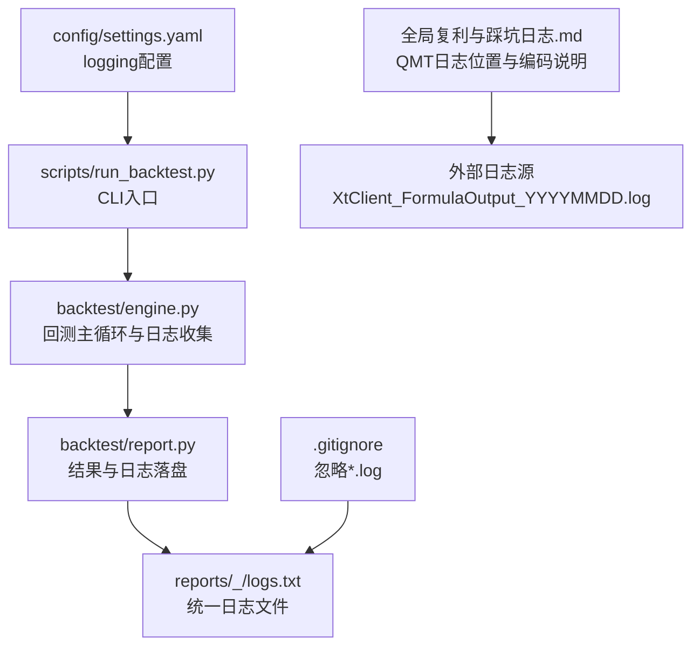
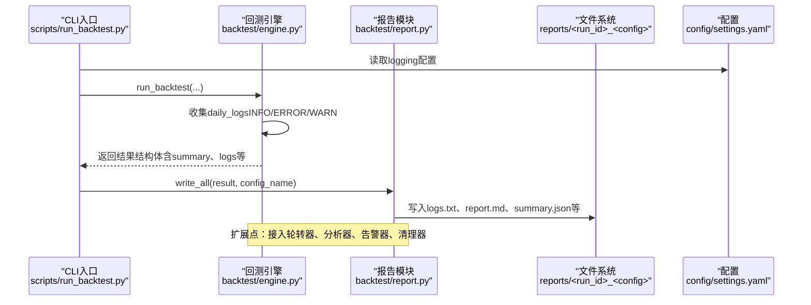
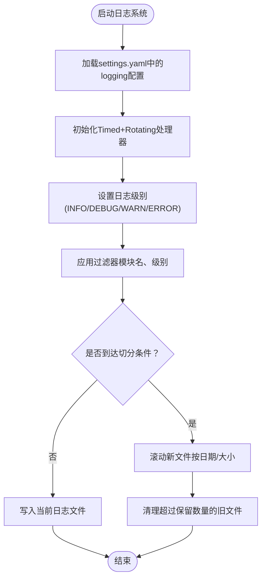
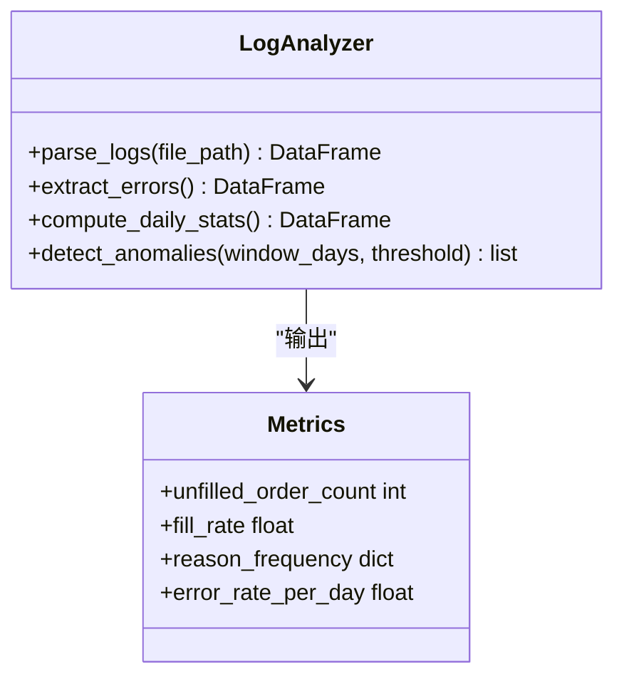
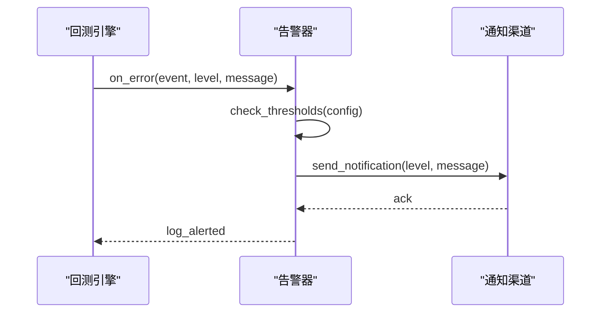
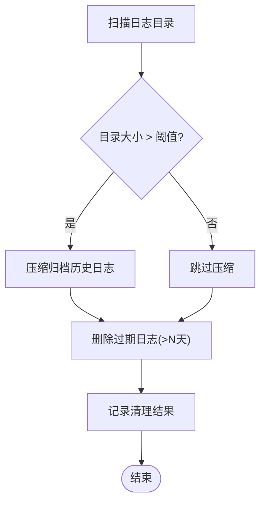
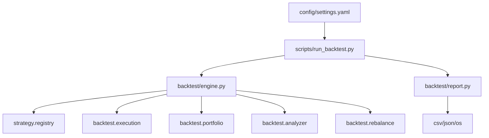

# 日志管理脚本

<cite>
**本文引用的文件**   
- [backtest/engine.py](file://backtest/engine.py)
- [backtest/report.py](file://backtest/report.py)
- [scripts/run_backtest.py](file://scripts/run_backtest.py)
- [config/settings.yaml](file://config/settings.yaml)
- [.gitignore](file://.gitignore)
- [全局复利与踩坑日志.md](file://全局复利与踩坑日志.md)
- [miniQMT实盘对接_生产级完善方案.md](file://miniQMT实盘对接_生产级完善方案.md)
- [reports/20260803_204830_513b7f_atr_lowvol_fw/logs.txt](file://reports/20260803_204830_513b7f_atr_lowvol_fw/logs.txt)
</cite>

## 目录
1. [简介](#简介)
2. [项目结构](#项目结构)
3. [核心组件](#核心组件)
4. [架构总览](#架构总览)
5. [详细组件分析](#详细组件分析)
6. [依赖关系分析](#依赖关系分析)
7. [性能考虑](#性能考虑)
8. [故障排查指南](#故障排查指南)
9. [结论](#结论)
10. [附录](#附录)

## 简介
本指南面向 QuantLab 的日志管理脚本开发，目标是建立一套可维护、可扩展、可观测的日志体系，覆盖以下关键能力：
- 日志轮转配置：按日期分割、文件大小限制、历史清理策略
- 日志分析与聚合：错误日志自动提取、交易日志统计分析、异常模式识别
- 异常告警触发：关键错误实时检测、阈值超限告警、异常频率统计
- 日志清理策略：过期日志自动删除、存储空间监控、压缩归档机制
- 日志格式标准化与结构化日志支持

当前仓库已具备基础日志输出（回测引擎生成 logs.txt、报告模块写入 WARN/ERROR 摘要），但尚未实现统一的日志轮转、集中式分析、自动化清理与告警。本指南将基于现有代码结构与约定，给出落地方案与实施步骤。

## 项目结构
QuantLab 的日志相关现状：
- 回测引擎在运行过程中收集 daily_logs，并在报告阶段统一落盘为 logs.txt
- 报告模块负责生成 summary.json、trades.csv、equity_curve.csv、positions.csv、logs.txt、report.md
- 配置文件 settings.yaml 中已有 logging 段，定义了级别、目录、最大文件大小与备份数量等
- .gitignore 忽略 *.log，避免提交日志到版本库
- 部分脚本使用 print 或简单文件追加方式记录日志，编码存在 GBK/UTF-8 混用情况
- QMT 实盘场景下，业务日志与引擎层日志分离，且编码差异需特别注意

图表来源
- [scripts/run_backtest.py:42-121](file://scripts/run_backtest.py#L42-L121)
- [backtest/engine.py:314-441](file://backtest/engine.py#L314-L441)
- [backtest/report.py:111-121](file://backtest/report.py#L111-L121)
- [config/settings.yaml:31-36](file://config/settings.yaml#L31-L36)
- [.gitignore:12-14](file://.gitignore#L12-L14)
- [全局复利与踩坑日志.md:147-152](file://全局复利与踩坑日志.md#L147-L152)

章节来源
- [scripts/run_backtest.py:42-121](file://scripts/run_backtest.py#L42-L121)
- [backtest/engine.py:314-441](file://backtest/engine.py#L314-L441)
- [backtest/report.py:111-121](file://backtest/report.py#L111-L121)
- [config/settings.yaml:31-36](file://config/settings.yaml#L31-L36)
- [.gitignore:12-14](file://.gitignore#L12-L14)
- [全局复利与踩坑日志.md:147-152](file://全局复利与踩坑日志.md#L147-L152)

## 核心组件
- 回测引擎日志收集：engine.py 在每日循环中累积 daily_logs，包含交易执行、未成交订单、策略诊断等信息
- 报告落盘：report.py 将日志与警告块写入 logs.txt，并生成 report.md 摘要
- CLI 入口：run_backtest.py 初始化 logging 并调用 engine 与 report
- 配置项：settings.yaml 提供 logging.level、dir、max_file_size、backup_count 等键

章节来源
- [backtest/engine.py:314-441](file://backtest/engine.py#L314-L441)
- [backtest/report.py:111-121](file://backtest/report.py#L111-L121)
- [scripts/run_backtest.py:42-121](file://scripts/run_backtest.py#L42-L121)
- [config/settings.yaml:31-36](file://config/settings.yaml#L31-L36)

## 架构总览
下图展示从 CLI 启动到日志落盘的完整流程，以及未来扩展点（轮转、分析、告警、清理）的位置。

图表来源
- [scripts/run_backtest.py:42-121](file://scripts/run_backtest.py#L42-L121)
- [backtest/engine.py:314-441](file://backtest/engine.py#L314-L441)
- [backtest/report.py:111-121](file://backtest/report.py#L111-L121)
- [config/settings.yaml:31-36](file://config/settings.yaml#L31-L36)

## 详细组件分析

### 日志轮转配置（按日期分割、大小限制、历史清理）
目标
- 按日期分割日志文件，便于检索与归档
- 设置单文件大小上限，防止磁盘爆满
- 制定历史日志清理策略（保留天数、空间阈值）

建议实现要点
- 使用 Python logging 的 RotatingFileHandler / TimedRotatingFileHandler 组合：
  - 按天切分：TimedRotatingFileHandler 以“midnight”为间隔
  - 大小限制：RotatingFileHandler 设置 maxBytes，达到阈值后滚动
  - 备份数量：backupCount 控制保留的历史文件数
- 多模块 logger 统一命名空间（如 quantlab.engine、quantlab.report），便于集中配置
- 通过 settings.yaml 的 logging 段驱动配置加载，避免硬编码路径与参数
- 对 QMT 外部日志（XtClient_FormulaOutput_YYYYMMDD.log）采用独立采集器，按日解析并合并到统一索引

章节来源
- [config/settings.yaml:31-36](file://config/settings.yaml#L31-L36)
- [scripts/run_backtest.py:42-44](file://scripts/run_backtest.py#L42-L44)
- [backtest/report.py:111-121](file://backtest/report.py#L111-L121)

### 日志分析与聚合（错误提取、交易统计、异常模式识别）
目标
- 自动提取 ERROR/WARN 行，生成错误摘要
- 统计交易日志（买入/卖出、未成交原因、滑点、手续费）
- 识别异常模式（例如频繁 below_min_lot、长时间未成交）

建议实现要点
- 解析 logs.txt：
  - 正则匹配 [ERROR]、[WARN] 行，提取 code、reason、时间戳
  - 统计每日未成交订单数、失败原因分布
- 构建指标：
  - unfilled_order_count（引擎已聚合）
  - reason_frequency（below_min_lot、position_gone 等）
  - fill_rate（成功成交笔数/总尝试笔数）
- 异常模式识别：
  - 滑动窗口内 ERROR 频率超过阈值触发告警
  - 特定 reason 连续出现 N 次视为异常模式

章节来源
- [backtest/engine.py:493-501](file://backtest/engine.py#L493-L501)
- [backtest/report.py:78-108](file://backtest/report.py#L78-L108)
- [reports/20260803_204830_513b7f_atr_lowvol_fw/logs.txt:5640-5652](file://reports/20260803_204830_513b7f_atr_lowvol_fw/logs.txt#L5640-L5652)

### 异常告警触发（关键错误、阈值超限、频率统计）
目标
- 关键错误实时检测（连接失败、下单失败、账户状态异常）
- 阈值超限告警（回撤、换手率、未成交比例）
- 异常频率统计（单位时间内 ERROR 数量）

建议实现要点
- 在 engine.py 的关键路径插入告警钩子：
  - 连接失败、数据读取异常、基准不可用等
  - 委托失败、撤单失败、超时未成交
- 阈值配置化：
  - 通过 settings.yaml 的 alerting 段定义阈值（如 error_rate_threshold、drawdown_threshold）
- 告警通道：
  - 本地文件告警（alerts.txt）
  - 可选集成企业微信/钉钉 webhook（参考 miniQMT 文档中的通知示例）

章节来源
- [miniQMT实盘对接_生产级完善方案.md:692-713](file://miniQMT实盘对接_生产级完善方案.md#L692-L713)
- [backtest/engine.py:434-441](file://backtest/engine.py#L434-L441)

### 日志清理策略（过期删除、空间监控、压缩归档）
目标
- 自动删除过期日志（如 >30 天）
- 监控日志目录占用空间，超阈值触发清理
- 定期压缩归档历史日志（zip/tar.gz）

建议实现要点
- 定时任务（cron/systemd timer）：
  - 扫描 logs 目录，删除早于保留期的文件
  - 计算目录大小，超过阈值则触发压缩与清理
- 压缩归档：
  - 对已滚动的日志文件进行压缩，释放空间
  - 归档文件名包含日期范围，便于检索

章节来源
- [.gitignore:12-14](file://.gitignore#L12-L14)
- [config/settings.yaml:31-36](file://config/settings.yaml#L31-L36)

### 日志格式标准化与结构化日志支持
目标
- 统一日志格式（时间戳、级别、模块名、消息）
- 支持结构化字段（code、reason、price、volume 等）
- 兼容 QMT 外部日志（GBK/UTF-8 编码处理）

建议实现要点
- 使用 JSON 格式输出结构化日志（可选）
- 文本日志保持可读性，同时嵌入关键字段（如 code=600729.SH reason=below_min_lot）
- 针对 QMT 日志，增加编码检测与转换逻辑

章节来源
- [全局复利与踩坑日志.md:147-152](file://全局复利与踩坑日志.md#L147-L152)
- [reports/20260803_204830_513b7f_atr_lowvol_fw/logs.txt:5640-5652](file://reports/20260803_204830_513b7f_atr_lowvol_fw/logs.txt#L5640-L5652)

## 依赖关系分析
- scripts/run_backtest.py 依赖 backtest.engine 与 backtest.report
- backtest.engine 依赖 strategy.registry、execution、portfolio、analyzer、rebalance
- backtest.report 依赖 csv、json、os 标准库
- 配置由 settings.yaml 提供，CLI 启动时加载

图表来源
- [scripts/run_backtest.py:26-30](file://scripts/run_backtest.py#L26-L30)
- [backtest/engine.py:20-25](file://backtest/engine.py#L20-L25)
- [backtest/report.py:17-19](file://backtest/report.py#L17-L19)
- [config/settings.yaml:1-10](file://config/settings.yaml#L1-L10)

章节来源
- [scripts/run_backtest.py:26-30](file://scripts/run_backtest.py#L26-L30)
- [backtest/engine.py:20-25](file://backtest/engine.py#L20-L25)
- [backtest/report.py:17-19](file://backtest/report.py#L17-L19)
- [config/settings.yaml:1-10](file://config/settings.yaml#L1-L10)

## 性能考虑
- 日志写入开销：高频日志可能影响回测性能，建议使用异步写入或批量写入
- 文件 I/O：避免在热路径中频繁打开/关闭文件，使用缓冲写入
- 内存占用：日志分析器应流式处理大文件，避免一次性加载
- 并发安全：多线程环境下确保日志写入线程安全

## 故障排查指南
常见问题与解决方案
- 日志编码乱码：检查 QMT 日志编码（GBK/UTF-8），在解析时进行转换
- 日志文件过大：调整轮转策略，增加 backupCount 或缩短保留期
- 未成交订单过多：分析 reason 分布，优化下单参数或市场流动性
- 基准数据不可用：检查 benchmark_db_path 与数据完整性

章节来源
- [全局复利与踩坑日志.md:147-152](file://全局复利与踩坑日志.md#L147-L152)
- [backtest/report.py:78-108](file://backtest/report.py#L78-L108)
- [reports/20260803_204830_513b7f_atr_lowvol_fw/logs.txt:5640-5652](file://reports/20260803_204830_513b7f_atr_lowvol_fw/logs.txt#L5640-L5652)

## 结论
通过本指南，QuantLab 可以建立一套完整的日志管理体系，涵盖轮转、分析、告警、清理与格式化。建议在现有 engine.py 与 report.py 基础上，逐步引入轮转器、分析器与告警器，并通过 settings.yaml 统一管理配置。对于 QMT 外部日志，需特别关注编码与路径差异，确保统一采集与分析。

## 附录
- 推荐工具：Python logging、rotating-file-handler、timed-rotating-file-handler
- 监控平台：Prometheus + Grafana（可选）
- 通知渠道：企业微信、钉钉、邮件（可选）