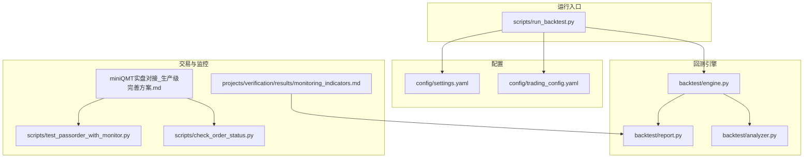
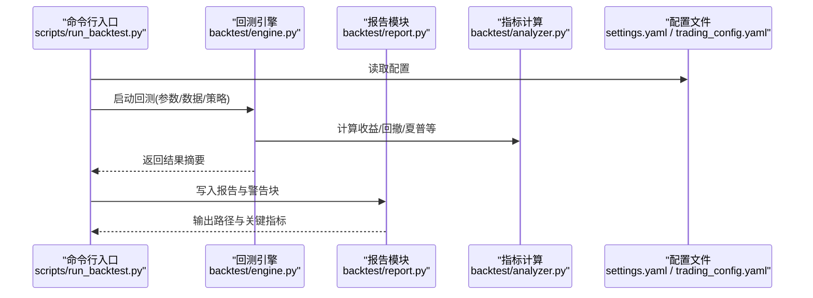
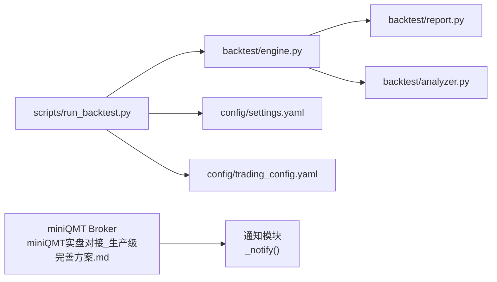

# 监控脚本编写

<cite>
**本文引用的文件**   
- [scripts/run_backtest.py](file://scripts/run_backtest.py)
- [backtest/engine.py](file://backtest/engine.py)
- [backtest/analyzer.py](file://backtest/analyzer.py)
- [backtest/report.py](file://backtest/report.py)
- [config/settings.yaml](file://config/settings.yaml)
- [config/trading_config.yaml](file://config/trading_config.yaml)
- [miniQMT实盘对接_生产级完善方案.md](file://miniQMT实盘对接_生产级完善方案.md)
- [scripts/test_passorder_with_monitor.py](file://scripts/test_passorder_with_monitor.py)
- [scripts/check_order_status.py](file://scripts/check_order_status.py)
- [projects/verification/results/monitoring_indicators.md](file://projects/verification/results/monitoring_indicators.md)
</cite>

## 目录
1. [引言](#引言)
2. [项目结构](#项目结构)
3. [核心组件](#核心组件)
4. [架构总览](#架构总览)
5. [详细组件分析](#详细组件分析)
6. [依赖关系分析](#依赖关系分析)
7. [性能考虑](#性能考虑)
8. [故障排查指南](#故障排查指南)
9. [结论](#结论)
10. [附录](#附录)

## 引言
本指南面向 QuantLab 的监控与可观测性建设，围绕健康检查、性能监控、日志管理、告警集成与实时监控面板五大主题，提供从设计到落地的完整实践。内容结合仓库中已有的回测引擎、报告模块、交易回调与通知机制、以及验证文档中的指标定义，给出可直接复用的脚本开发范式与最佳实践。

## 项目结构
QuantLab 的监控相关能力主要分布在以下位置：
- 回测与报告：scripts/run_backtest.py、backtest/engine.py、backtest/report.py、backtest/analyzer.py
- 配置：config/settings.yaml（全局）、config/trading_config.yaml（交易与通知）
- 交易与回调：miniQMT实盘对接_生产级完善方案.md（Broker、回调、重连、通知）
- 订单测试与状态检查：scripts/test_passorder_with_monitor.py、scripts/check_order_status.py
- 指标定义：projects/verification/results/monitoring_indicators.md

图表来源
- [scripts/run_backtest.py:1-132](file://scripts/run_backtest.py#L1-L132)
- [backtest/engine.py:479-522](file://backtest/engine.py#L479-L522)
- [backtest/report.py:78-108](file://backtest/report.py#L78-L108)
- [config/settings.yaml:1-69](file://config/settings.yaml#L1-L69)
- [config/trading_config.yaml:37-61](file://config/trading_config.yaml#L37-L61)
- [miniQMT实盘对接_生产级完善方案.md:26-756](file://miniQMT实盘对接_生产级完善方案.md#L26-L756)
- [scripts/test_passorder_with_monitor.py:1-75](file://scripts/test_passorder_with_monitor.py#L1-L75)
- [scripts/check_order_status.py:1-50](file://scripts/check_order_status.py#L1-L50)
- [projects/verification/results/monitoring_indicators.md:1-69](file://projects/verification/results/monitoring_indicators.md#L1-L69)

章节来源
- [scripts/run_backtest.py:1-132](file://scripts/run_backtest.py#L1-L132)
- [config/settings.yaml:1-69](file://config/settings.yaml#L1-L69)
- [config/trading_config.yaml:37-61](file://config/trading_config.yaml#L37-L61)

## 核心组件
- 回测执行器：负责加载配置、数据源、策略与执行环境，输出结果与摘要。
- 指标计算与分析：基于净值曲线与成交记录计算收益、回撤、夏普等指标。
- 报告生成：汇总关键信息并输出警告块，便于自动化解析与告警。
- 交易回调与通知：通过 miniQMT 回调处理委托/成交/错误事件，支持自动重连与 webhook 通知。
- 订单测试与状态检查：在 QMT 环境中进行下单与状态轮询，辅助定位问题。

章节来源
- [scripts/run_backtest.py:1-132](file://scripts/run_backtest.py#L1-L132)
- [backtest/analyzer.py:1-47](file://backtest/analyzer.py#L1-L47)
- [backtest/report.py:78-108](file://backtest/report.py#L78-L108)
- [miniQMT实盘对接_生产级完善方案.md:26-756](file://miniQMT实盘对接_生产级完善方案.md#L26-L756)

## 架构总览
下图展示从回测执行到报告输出的主流程，以及与交易回调和通知的关系。

图表来源
- [scripts/run_backtest.py:1-132](file://scripts/run_backtest.py#L1-L132)
- [backtest/engine.py:479-522](file://backtest/engine.py#L479-L522)
- [backtest/report.py:78-108](file://backtest/report.py#L78-L108)
- [config/settings.yaml:1-69](file://config/settings.yaml#L1-L69)
- [config/trading_config.yaml:37-61](file://config/trading_config.yaml#L37-L61)

## 详细组件分析

### 健康检查脚本开发
目标：服务状态检测、依赖服务检查、资源使用监控、端口监听验证。

- 服务状态检测
  - 通过心跳或探针接口判断进程存活；对 miniQMT Broker 连接状态进行探测（已连接/断开）。
  - 参考 Broker 的连接管理与断线重连逻辑，实现“连接可用性”探针。
- 依赖服务检查
  - 数据源连通性校验（如 astock parquet 可读性、WAL 同步提示）。
  - 基准数据可用性校验（benchmark_available=false 时禁用 IR/excess）。
- 资源使用监控
  - 采集 CPU、内存、磁盘 I/O、网络 I/O 等系统指标，设定阈值触发告警。
- 端口监听验证
  - 对 Prometheus 暴露端口、Grafana 访问端口、Webhook 端口等进行 TCP 探测。

建议实现要点
- 将健康检查封装为独立脚本或守护进程，周期性执行并输出结构化结果（JSON/CSV），供外部监控系统抓取。
- 对关键依赖设置超时与重试，避免误报。
- 将检查结果写入统一日志，并与告警系统集成。

章节来源
- [miniQMT实盘对接_生产级完善方案.md:26-756](file://miniQMT实盘对接_生产级完善方案.md#L26-L756)
- [backtest/engine.py:554-578](file://backtest/engine.py#L554-L578)

### 性能监控脚本
目标：回测性能指标收集、内存使用监控、CPU占用率统计、磁盘I/O监控。

- 回测性能指标
  - 累计收益、年化收益、最大回撤、夏普比率、换手率、样本期警告、基准可用性。
  - 指标计算参考 analyzer 模块的实现方式，确保短样本期的稳健性。
- 内存/CPU/磁盘I/O
  - 使用系统库采集进程与系统级指标，按时间序列存储（CSV/Parquet）。
  - 对异常峰值设置阈值，触发告警并附带上下文（调用栈、最近日志片段）。

建议实现要点
- 将指标采集与回测执行解耦，避免阻塞主流程。
- 对高频指标采用滑动窗口聚合，降低存储与查询压力。
- 输出标准化格式，便于后续可视化与告警规则匹配。

章节来源
- [backtest/analyzer.py:1-47](file://backtest/analyzer.py#L1-L47)
- [backtest/engine.py:479-522](file://backtest/engine.py#L479-L522)

### 日志管理脚本
目标：日志轮转配置、日志分析聚合、异常告警触发、日志清理策略。

- 日志轮转配置
  - 依据 settings.yaml 中的 logging 配置，设置文件大小上限与备份数量。
- 日志分析聚合
  - 对回测报告中的 WARN 块进行解析，提取关键问题（样本期过短、基准不可用、去重、WAL 同步等）。
- 异常告警触发
  - 当检测到特定关键字或模式（如 ERROR、CRITICAL、WAL 同步提示）时，触发告警。
- 日志清理策略
  - 定期清理过期日志与中间文件，保留必要审计记录。

建议实现要点
- 使用结构化日志（JSON），便于机器解析与检索。
- 对高频日志进行采样与压缩，控制存储成本。
- 将告警事件与业务上下文关联（策略名、账号、时间范围）。

章节来源
- [config/settings.yaml:31-36](file://config/settings.yaml#L31-L36)
- [backtest/report.py:78-108](file://backtest/report.py#L78-L108)

### 告警系统集成
目标：邮件通知、钉钉机器人、企业微信推送、短信告警。

- 现有基础
  - 交易配置文件中包含 notification.enabled、method、webhook_url 字段，用于启用与配置通知渠道。
  - Broker 层实现了 _notify 方法，通过 HTTP 请求发送文本消息至 webhook。
- 扩展建议
  - 增加邮件与短信通道，复用统一的告警模板与级别（info/warning/critical）。
  - 对通知失败进行重试与降级，确保不影响主流程。

章节来源
- [config/trading_config.yaml:37-61](file://config/trading_config.yaml#L37-L61)
- [miniQMT实盘对接_生产级完善方案.md:26-756](file://miniQMT实盘对接_生产级完善方案.md#L26-L756)

### 实时监控面板
目标：Prometheus 指标暴露、Grafana 仪表板配置、关键指标可视化。

- 指标暴露
  - 将健康检查与性能监控指标以 Prometheus 格式暴露（HTTP /metrics）。
  - 指标分类：系统资源、回测指标、订单状态、账户资产。
- Grafana 配置
  - 创建仪表盘，展示净值曲线、回撤、夏普、持仓分布、因子 IC 时序等。
  - 设置告警规则，与通知系统集成。
- 关键指标可视化
  - 净值与基准对比、月度收益热力图、行业分布、个股权重。

章节来源
- [projects/verification/results/monitoring_indicators.md:1-69](file://projects/verification/results/monitoring_indicators.md#L1-L69)

### 订单测试与状态检查
目标：在 QMT 环境中进行委托测试与状态轮询，辅助定位问题。

- 委托测试
  - 使用 test_passorder_with_monitor.py 进行下单与状态轮询，输出委托/成交/撤单结果。
- 状态检查
  - 使用 check_order_status.py 解析 QMT 日志，筛选委托相关条目，便于盘后复盘。

章节来源
- [scripts/test_passorder_with_monitor.py:1-75](file://scripts/test_passorder_with_monitor.py#L1-L75)
- [scripts/check_order_status.py:1-50](file://scripts/check_order_status.py#L1-L50)

## 依赖关系分析
- 回测执行器依赖配置与数据源，调用引擎与报告模块。
- 引擎依赖指标计算模块，输出摘要与警告信息。
- 报告模块依赖引擎摘要，生成固定顺序的 WARN 块。
- Broker 与通知模块依赖配置文件，实现 webhook 通知。

图表来源
- [scripts/run_backtest.py:1-132](file://scripts/run_backtest.py#L1-L132)
- [backtest/engine.py:479-522](file://backtest/engine.py#L479-L522)
- [backtest/report.py:78-108](file://backtest/report.py#L78-L108)
- [config/settings.yaml:1-69](file://config/settings.yaml#L1-L69)
- [config/trading_config.yaml:37-61](file://config/trading_config.yaml#L37-L61)
- [miniQMT实盘对接_生产级完善方案.md:26-756](file://miniQMT实盘对接_生产级完善方案.md#L26-L756)

章节来源
- [scripts/run_backtest.py:1-132](file://scripts/run_backtest.py#L1-L132)
- [backtest/engine.py:479-522](file://backtest/engine.py#L479-L522)
- [backtest/report.py:78-108](file://backtest/report.py#L78-L108)

## 性能考虑
- 指标采集频率与存储容量需平衡，避免过度采样导致存储压力。
- 对长周期指标采用滚动聚合，减少查询复杂度。
- 日志轮转与清理策略应定期评估，防止磁盘空间耗尽。
- 通知模块应具备幂等性与重试机制，避免重复告警与丢失。

[本节为通用指导，不直接分析具体文件]

## 故障排查指南
- 连接问题
  - 检查 Broker 连接状态与重连逻辑，确认 xtquant 库可用。
- 数据问题
  - 关注 WAL 同步提示与基准不可用情况，必要时调整数据源或时间范围。
- 订单问题
  - 使用订单测试脚本与状态检查脚本，定位委托/成交异常。
- 日志问题
  - 解析报告中的 WARN 块，快速定位样本期、去重、WAL 等问题。

章节来源
- [miniQMT实盘对接_生产级完善方案.md:26-756](file://miniQMT实盘对接_生产级完善方案.md#L26-L756)
- [backtest/report.py:78-108](file://backtest/report.py#L78-L108)
- [scripts/test_passorder_with_monitor.py:1-75](file://scripts/test_passorder_with_monitor.py#L1-L75)
- [scripts/check_order_status.py:1-50](file://scripts/check_order_status.py#L1-L50)

## 结论
通过健康检查、性能监控、日志管理、告警集成与实时监控面板的系统化建设，QuantLab 可实现端到端的可观测性与稳定性保障。建议优先落地 Broker 连接与健康探针、回测指标采集与报告解析、通知渠道扩展与 Prometheus/Grafana 集成，逐步完善监控体系。

[本节为总结，不直接分析具体文件]

## 附录
- 指标定义参考：projects/verification/results/monitoring_indicators.md
- 交易与通知配置：config/trading_config.yaml
- 全局日志配置：config/settings.yaml

[本节为参考信息，不直接分析具体文件]