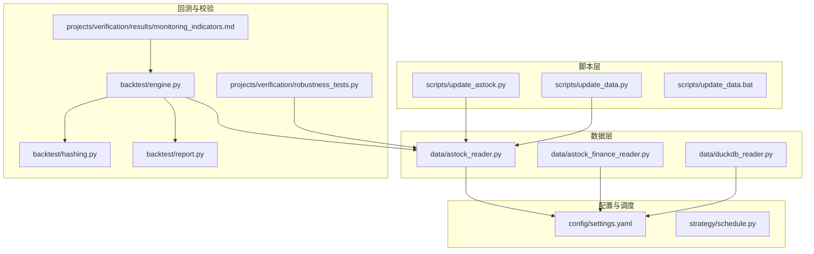
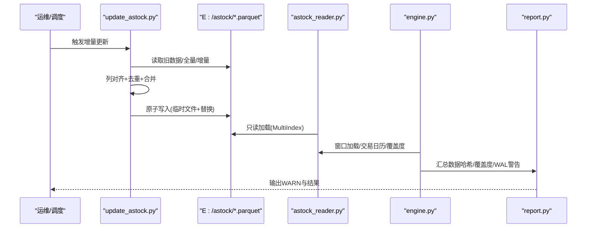
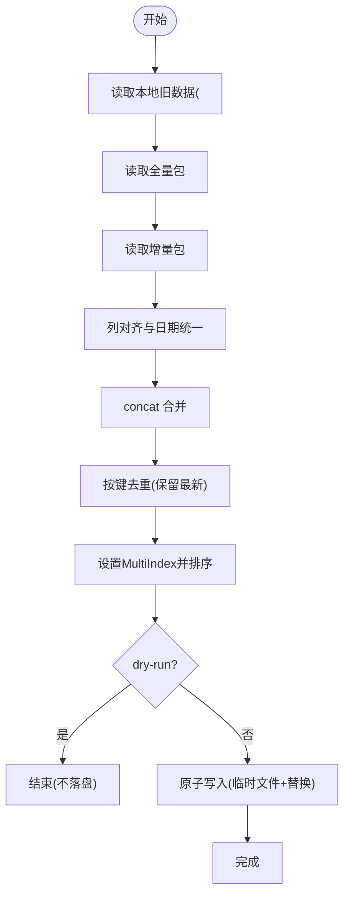
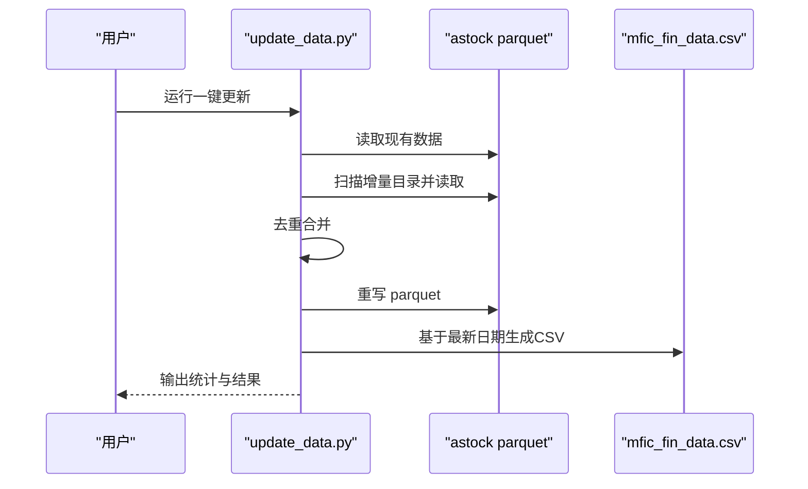
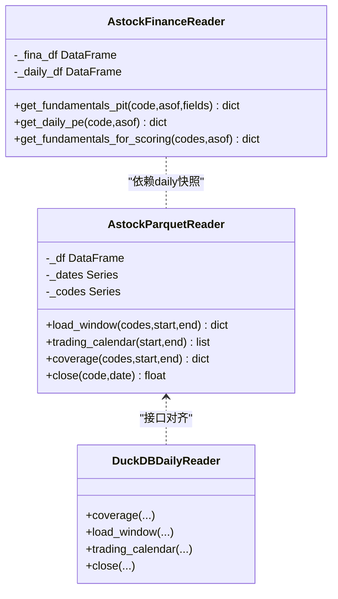
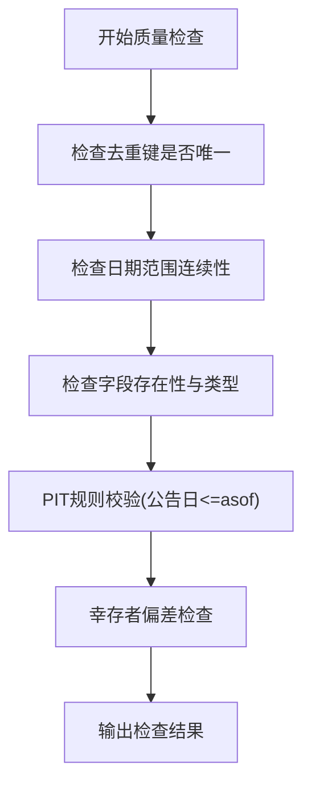
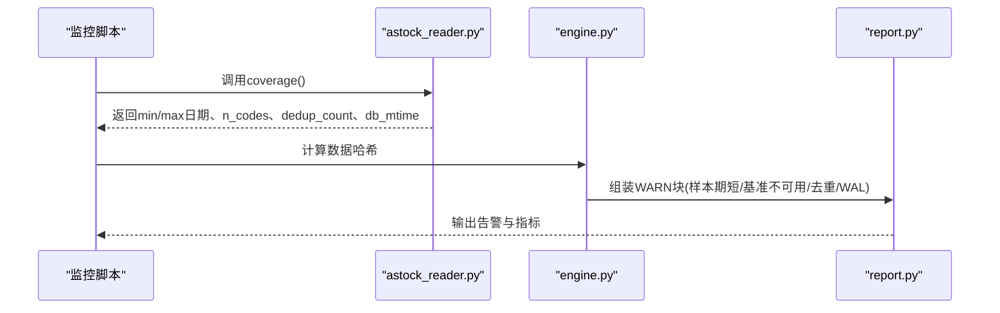
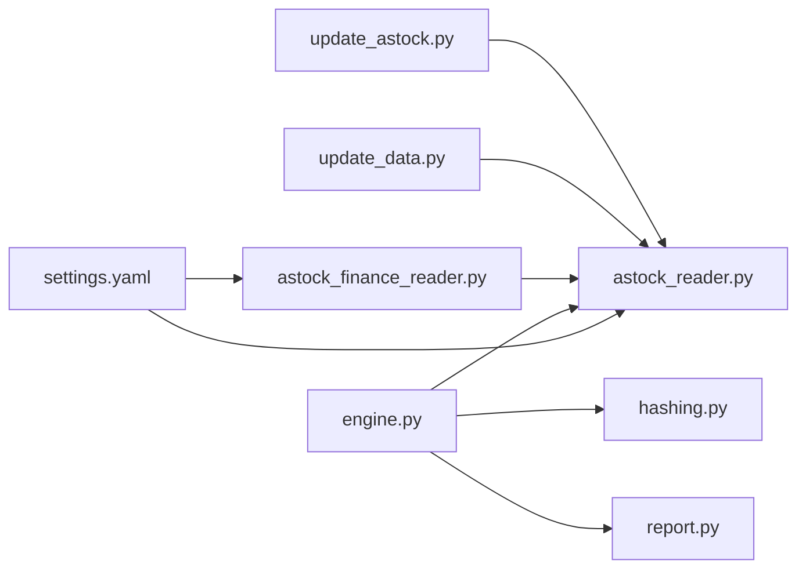

# 数据更新自动化

<cite>
**本文引用的文件**   
- [update_astock.py](file://scripts/update_astock.py)
- [update_data.py](file://scripts/update_data.py)
- [astock_reader.py](file://data/astock_reader.py)
- [astock_finance_reader.py](file://data/astock_finance_reader.py)
- [settings.yaml](file://config/settings.yaml)
- [schedule.py](file://strategy/schedule.py)
- [hashing.py](file://backtest/hashing.py)
- [engine.py](file://backtest/engine.py)
- [report.py](file://backtest/report.py)
- [duckdb_reader.py](file://data/duckdb_reader.py)
- [robustness_tests.py](file://projects/verification/robustness_tests.py)
- [monitoring_indicators.md](file://projects/verification/results/monitoring_indicators.md)
- [miniQMT实盘对接_生产级完善方案.md](file://miniQMT实盘对接_生产级完善方案.md)
- [update_data.bat](file://scripts/update_data.bat)
</cite>

## 目录
1. [简介](#简介)
2. [项目结构](#项目结构)
3. [核心组件](#核心组件)
4. [架构总览](#架构总览)
5. [详细组件分析](#详细组件分析)
6. [依赖关系分析](#依赖关系分析)
7. [性能考量](#性能考量)
8. [故障排查指南](#故障排查指南)
9. [结论](#结论)
10. [附录](#附录)

## 简介
本指南面向 QuantLab 的数据更新自动化，聚焦以下目标：
- 增量数据同步机制：astock parquet 的 daily、minute、basic 三类数据的增量合并与原子落盘。
- 历史数据校验与质量检查：去重、时间序列完整性、字段一致性、PIT 安全读取。
- 批量数据处理：多源合并、重复数据去重、时间序列完整性验证。
- 备份与恢复策略：自动备份、版本管理、灾难恢复流程。
- 监控与告警：更新状态检查、错误处理、日志记录、性能监控。
- 定时任务配置：cron（Linux）、Windows 任务计划程序、异常告警机制。

## 项目结构
与数据更新自动化直接相关的代码与脚本分布如下：
- scripts：数据更新主脚本与批处理入口
- data：数据读取器（parquet/DuckDB）与财务 PIT 读取
- config：全局配置（路径、缓存、日志等）
- backtest：数据哈希、回测引擎对数据覆盖度与 WAL 的检测
- projects/verification：稳健性测试与监控指标定义

图表来源 
- [update_astock.py](file://scripts/update_astock.py)
- [update_data.py](file://scripts/update_data.py)
- [astock_reader.py](file://data/astock_reader.py)
- [astock_finance_reader.py](file://data/astock_finance_reader.py)
- [duckdb_reader.py](file://data/duckdb_reader.py)
- [settings.yaml](file://config/settings.yaml)
- [hashing.py](file://backtest/hashing.py)
- [engine.py](file://backtest/engine.py)
- [report.py](file://backtest/report.py)
- [robustness_tests.py](file://projects/verification/robustness_tests.py)
- [monitoring_indicators.md](file://projects/verification/results/monitoring_indicators.md)

章节来源
- [settings.yaml](file://config/settings.yaml)
- [update_astock.py](file://scripts/update_astock.py)
- [update_data.py](file://scripts/update_data.py)

## 核心组件
- 增量更新脚本
  - update_astock.py：按 daily/minute/basic 三类数据执行增量合并，支持 dry-run、并行、原子写入。
  - update_data.py：一键更新 astock parquet 并重新生成 CSV（供 QMT 使用）。
- 数据读取器
  - astock_reader.py：只读 parquet 读取，提供 load_window/trading_calendar/coverage/close 接口，支持复权。
  - astock_finance_reader.py：PIT 安全的财务指标读取与每日 PE 快照读取。
  - duckdb_reader.py：DuckDB 读取与去重统计（用于对比与校验）。
- 配置与调度
  - settings.yaml：数据路径、缓存、日志、回测区间等。
  - schedule.py：调仓日历辅助函数（周/月/季首交易日判定）。
- 回测与校验
  - hashing.py：数据/配置/股票池哈希计算，便于版本追踪。
  - engine.py：回测中对数据覆盖度、去重计数、WAL 检测与警告输出。
  - report.py：报告中的 WARN 块组装（样本期短、基准不可用、去重、WAL 等）。
  - robustness_tests.py：幸存者偏差等稳健性检查示例。
  - monitoring_indicators.md：监控指标与阈值定义。

章节来源
- [update_astock.py](file://scripts/update_astock.py)
- [update_data.py](file://scripts/update_data.py)
- [astock_reader.py](file://data/astock_reader.py)
- [astock_finance_reader.py](file://data/astock_finance_reader.py)
- [duckdb_reader.py](file://data/duckdb_reader.py)
- [settings.yaml](file://config/settings.yaml)
- [schedule.py](file://strategy/schedule.py)
- [hashing.py](file://backtest/hashing.py)
- [engine.py](file://backtest/engine.py)
- [report.py](file://backtest/report.py)
- [robustness_tests.py](file://projects/verification/robustness_tests.py)
- [monitoring_indicators.md](file://projects/verification/results/monitoring_indicators.md)

## 架构总览
数据更新自动化整体流程如下：
- 增量包到达后，由 update_astock.py 或 update_data.py 触发；
- 读取本地旧数据与全量/增量包，进行列对齐、日期统一、去重合并；
- 通过原子写（临时文件 + os.replace）确保一致性；
- 读取器在回测/因子计算时以只读方式消费 parquet；
- 回测引擎采集数据覆盖度、去重计数、WAL 检测信息，并在报告中输出警告；
- 监控指标文档定义关键阈值与处置动作。

图表来源 
- [update_astock.py](file://scripts/update_astock.py)
- [astock_reader.py](file://data/astock_reader.py)
- [engine.py](file://backtest/engine.py)
- [report.py](file://backtest/report.py)

## 详细组件分析

### 增量更新组件（daily/minute/basic）
- 设计要点
  - daily：本地(<CUTOFF) + 全量包(2026) + 增量包，按 trade_date/ts_code 去重，保持 MultiIndex。
  - minute：按周期逐 code 合并，本地(<CUTOFF) + 全量包 + 增量包，按 trade_date/trade_time 去重。
  - basic：按 ts_code 去重，日期格式统一为字符串 YYYYMMDD。
  - 原子写入：先写 .tmp_update，成功后 os.replace 替换原文件，避免部分写入导致损坏。
  - 并行：minute 支持 ProcessPoolExecutor 多进程处理，提升吞吐。
- 关键流程
  - 读取旧数据与增量包，统一列与日期类型；
  - concat 合并后 drop_duplicates(keep="last")；
  - set_index 并 sort_index，保证查询效率；
  - atomic_write 落盘。

图表来源 
- [update_astock.py](file://scripts/update_astock.py)

章节来源
- [update_astock.py](file://scripts/update_astock.py)

### 一键更新脚本（astock parquet + CSV）
- 功能
  - 扫描“行情数据更新池”中增量目录，识别 stock_daily.parquet；
  - 与现有 parquet 合并，去重后重写；
  - 基于最新日期的快照生成 CSV（含 PB/PE/ROE 等），供下游系统使用。
- 适用场景
  - 快速增量更新与下游 CSV 重建的一体化流程。

图表来源 
- [update_data.py](file://scripts/update_data.py)

章节来源
- [update_data.py](file://scripts/update_data.py)

### 数据读取器（只读与 PIT 安全）
- AstockParquetReader
  - 只读 parquet，构造 (trade_date, ts_code) MultiIndex；
  - load_window 返回对齐后的 OHLCV 及衍生字段；
  - trading_calendar 返回区间内交易日；
  - coverage 返回数据范围、代码数、去重计数、文件 mtime 等；
  - close 支持单点取值与复权（qfq/hfq）。
- AstockFinanceReader
  - PIT 规则：公告日 <= asof_date 可见，取最大 end_date；
  - get_daily_pe 使用 daily 快照，天然反前视；
  - get_fundamentals_for_scoring 聚合 PE 快照供评分使用。
- DuckDBDailyReader（对比）
  - 使用 SQL 去重与统计，便于与 parquet 结果交叉验证。

图表来源 
- [astock_reader.py](file://data/astock_reader.py)
- [astock_finance_reader.py](file://data/astock_finance_reader.py)
- [duckdb_reader.py](file://data/duckdb_reader.py)

章节来源
- [astock_reader.py](file://data/astock_reader.py)
- [astock_finance_reader.py](file://data/astock_finance_reader.py)
- [duckdb_reader.py](file://data/duckdb_reader.py)

### 数据质量检查与历史校验
- 去重与完整性
  - daily：按 trade_date/ts_code 去重；
  - minute：按 trade_date/trade_time 去重；
  - basic：按 ts_code 去重。
- 时间序列完整性
  - trading_calendar 返回区间内交易日，可用于校验缺失；
  - coverage 返回 min/max 日期与行数，便于比对。
- 字段一致性
  - 读取器仅选择必要列，降低内存占用；
  - 财务字段通过 PIT 规则避免前视偏差。
- 稳健性测试
  - 幸存者偏差检查：统计初始股票数、退市标记等。

图表来源 
- [astock_reader.py](file://data/astock_reader.py)
- [astock_finance_reader.py](file://data/astock_finance_reader.py)
- [robustness_tests.py](file://projects/verification/robustness_tests.py)

章节来源
- [astock_reader.py](file://data/astock_reader.py)
- [astock_finance_reader.py](file://data/astock_finance_reader.py)
- [robustness_tests.py](file://projects/verification/robustness_tests.py)

### 数据备份与恢复策略
- 自动备份机制
  - 原子写入：所有更新均先写临时文件，成功后替换原文件，避免半写状态。
  - 建议配合外部备份工具（如 rsync/robocopy）定期快照 E:/astock 目录。
- 版本管理
  - 使用 hashing.py 计算数据哈希（包含 db_path、mtime、调整方式、区间、去重计数等），用于版本追踪与可复现性。
  - 建议在每次更新后记录哈希到元数据文件或数据库。
- 灾难恢复流程
  - 若当前 parquet 损坏，从最近一次成功快照恢复；
  - 重新运行增量更新脚本，将增量包再次合并至恢复后的基线。

章节来源
- [update_astock.py](file://scripts/update_astock.py)
- [hashing.py](file://backtest/hashing.py)

### 数据更新监控与告警
- 更新状态检查
  - 通过 coverage 获取数据范围、代码数量、去重计数；
  - 比较上次与本次的 db_mtime 与哈希值，判断是否变更。
- 错误处理
  - 脚本打印详细日志与耗时；
  - 回测引擎对 WAL 检测并发出警告（可能正在同步）。
- 日志记录
  - settings.yaml 配置日志级别、目录、轮转大小与保留数量。
- 性能监控
  - 记录各阶段耗时（读取、合并、去重、写入）；
  - minute 并行 workers 可调优吞吐。

图表来源 
- [astock_reader.py](file://data/astock_reader.py)
- [engine.py](file://backtest/engine.py)
- [report.py](file://backtest/report.py)

章节来源
- [astock_reader.py](file://data/astock_reader.py)
- [engine.py](file://backtest/engine.py)
- [report.py](file://backtest/report.py)
- [settings.yaml](file://config/settings.yaml)

### 定时任务配置
- Windows 任务计划程序
  - 使用 update_data.bat 作为入口，每天盘前或收盘后触发；
  - 可在任务计划程序中设置触发时间与运行环境。
- Linux cron
  - 可直接调用 python scripts/update_astock.py 或 update_data.py；
  - 建议结合 nohup 与日志输出。
- 异常告警机制
  - 在脚本中加入退出码与邮件/消息通知；
  - 结合监控系统（如 Prometheus/Grafana）抓取日志关键字。

章节来源
- [update_data.bat](file://scripts/update_data.bat)
- [update_astock.py](file://scripts/update_astock.py)
- [update_data.py](file://scripts/update_data.py)

## 依赖关系分析
- 脚本与读取器的耦合
  - update_astock.py 与 update_data.py 依赖 astock_reader.py 的 parquet 结构与列名；
  - astock_finance_reader.py 依赖 daily 快照与财务 parquet。
- 回测与数据质量
  - engine.py 依赖 reader.coverage 与哈希计算；
  - report.py 根据 engine 提供的摘要生成 WARN 块。
- 配置与环境
  - settings.yaml 提供数据路径、缓存、日志等；
  - schedule.py 提供调仓日历逻辑，供策略层复用。

图表来源 
- [update_astock.py](file://scripts/update_astock.py)
- [update_data.py](file://scripts/update_data.py)
- [astock_reader.py](file://data/astock_reader.py)
- [astock_finance_reader.py](file://data/astock_finance_reader.py)
- [engine.py](file://backtest/engine.py)
- [hashing.py](file://backtest/hashing.py)
- [report.py](file://backtest/report.py)
- [settings.yaml](file://config/settings.yaml)

章节来源
- [update_astock.py](file://scripts/update_astock.py)
- [update_data.py](file://scripts/update_data.py)
- [astock_reader.py](file://data/astock_reader.py)
- [astock_finance_reader.py](file://data/astock_finance_reader.py)
- [engine.py](file://backtest/engine.py)
- [hashing.py](file://backtest/hashing.py)
- [report.py](file://backtest/report.py)
- [settings.yaml](file://config/settings.yaml)

## 性能考量
- I/O 优化
  - 仅读取必要列，减少内存占用；
  - 使用 parquet 的索引与过滤能力。
- 计算优化
  - minute 并行处理（ProcessPoolExecutor）提升吞吐；
  - 去重与排序尽量在 pandas 层面完成，避免多次磁盘 IO。
- 存储优化
  - 原子写入避免锁竞争；
  - 合理设置压缩与编码（pyarrow 默认）。
- 监控优化
  - 记录关键阶段耗时与行数变化，便于定位瓶颈。

[本节为通用指导，不直接分析具体文件]

## 故障排查指南
- 常见问题
  - 数据不完整：检查 coverage 的 min/max 日期与 n_codes；
  - 去重异常：确认去重键是否正确（daily/ts_code，minute/trade_time）；
  - WAL 检测：engine.py 会发出 DATA_WAL_DETECTED 警告，表示数据可能正在同步。
- 诊断步骤
  - 运行稳健性测试（robustness_tests.py）检查幸存者偏差；
  - 使用 report.py 的 WARN 块定位问题；
  - 核对 settings.yaml 的路径与日志配置。
- 恢复措施
  - 从最近快照恢复 parquet；
  - 重新运行增量更新脚本。

章节来源
- [engine.py](file://backtest/engine.py)
- [report.py](file://backtest/report.py)
- [robustness_tests.py](file://projects/verification/robustness_tests.py)
- [settings.yaml](file://config/settings.yaml)

## 结论
QuantLab 的数据更新自动化通过增量合并、原子写入、只读读取与 PIT 安全读取，构建了稳定可靠的数据管线。结合回测引擎的数据覆盖度与 WAL 检测、监控指标与日志配置，可实现端到端的质量保障与可观测性。建议在生产环境中引入外部备份与版本管理，完善定时任务与告警机制，进一步提升鲁棒性。

[本节为总结，不直接分析具体文件]

## 附录
- 监控指标参考
  - 净值回撤、持仓集中度、行业集中度、换手率、信号质量、容量检查、策略有效性等阈值与处置动作。
- 实盘调度参考
  - 盘中/尾盘任务、风控检查频率、优雅退出与状态恢复。

章节来源
- [monitoring_indicators.md](file://projects/verification/results/monitoring_indicators.md)
- [miniQMT实盘对接_生产级完善方案.md](file://miniQMT实盘对接_生产级完善方案.md)