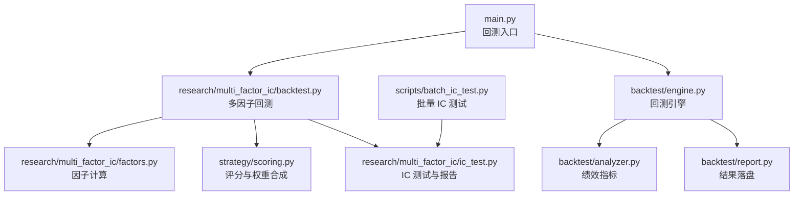
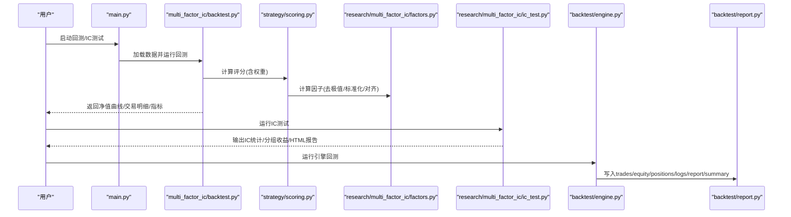
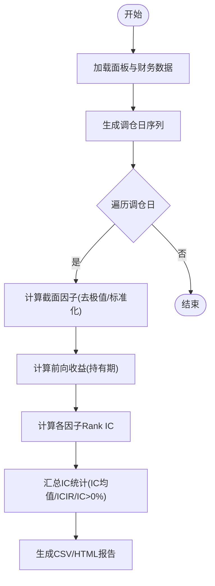
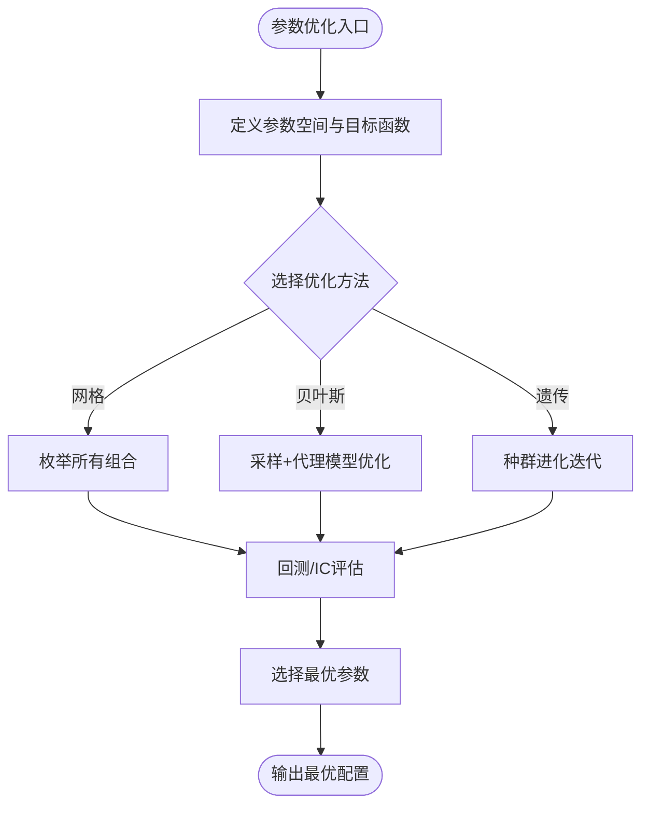
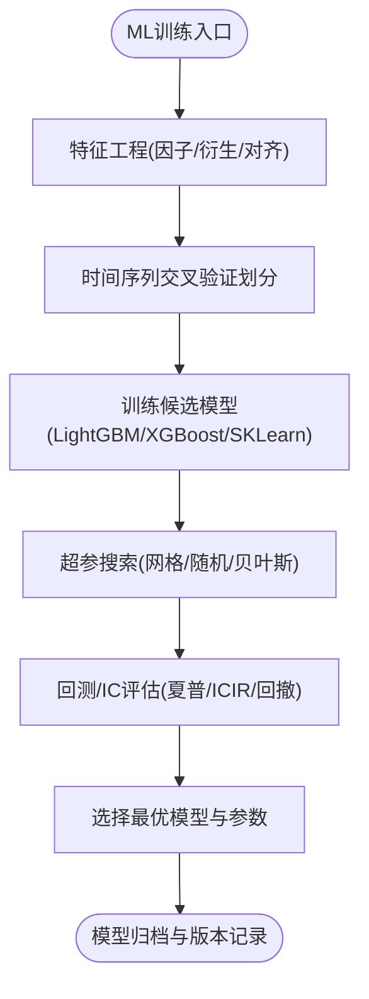
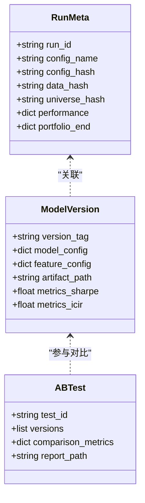
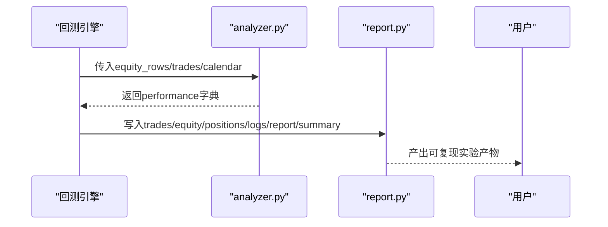
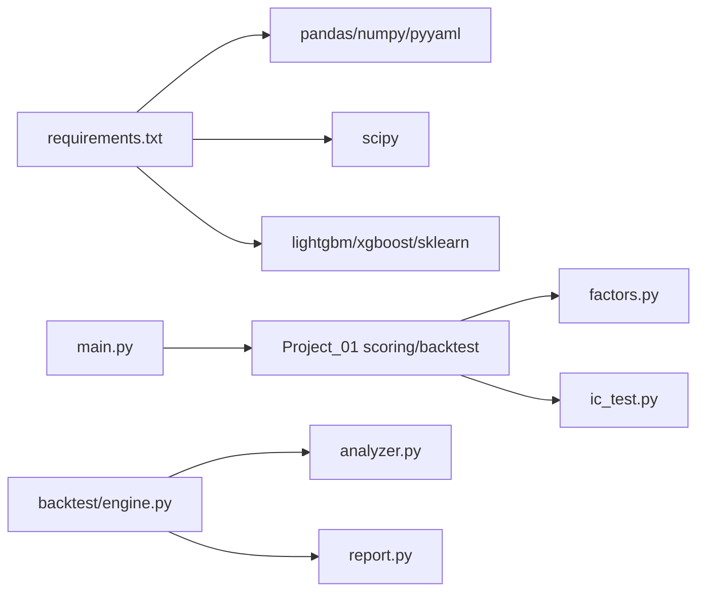

# 模型训练自动化

<cite>
**本文引用的文件**   
- [main.py](file://main.py)
- [requirements.txt](file://requirements.txt)
- [ic_test.py](file://projects/Project_01_多因子IC小盘Alpha/research/multi_factor_ic/ic_test.py)
- [factors.py](file://projects/Project_01_多因子IC小盘Alpha/research/multi_factor_ic/factors.py)
- [scoring.py](file://projects/Project_01_多因子IC小盘Alpha/strategy/scoring.py)
- [backtest.py](file://projects/Project_01_多因子IC小盘Alpha/research/multi_factor_ic/backtest.py)
- [engine.py](file://backtest/engine.py)
- [analyzer.py](file://backtest/analyzer.py)
- [report.py](file://backtest/report.py)
- [batch_ic_test.py](file://scripts/batch_ic_test.py)
</cite>

## 目录
1. [简介](#简介)
2. [项目结构](#项目结构)
3. [核心组件](#核心组件)
4. [架构总览](#架构总览)
5. [详细组件分析](#详细组件分析)
6. [依赖关系分析](#依赖关系分析)
7. [性能与可扩展性](#性能与可扩展性)
8. [故障排查指南](#故障排查指南)
9. [结论](#结论)
10. [附录：最佳实践与落地清单](#附录最佳实践与落地清单)

## 简介
本指南面向 QuantLab 的模型训练自动化，覆盖以下关键目标：
- 因子权重更新流程：IC 测试自动化、因子有效性评估、权重优化方法（网格搜索、贝叶斯优化、遗传算法）
- 策略参数优化：网格搜索、贝叶斯优化、遗传算法实现建议
- 机器学习模型训练：特征工程自动化、模型选择、超参数调优、交叉验证
- 模型版本管理：模型保存、版本控制、回滚机制、A/B 测试框架
- 训练结果分析：性能指标计算、可视化报告、回归测试

本项目已具备完善的因子计算、IC 测试、多因子评分与回测引擎、报告输出等能力，可作为“模型训练自动化”的基础设施。

## 项目结构
QuantLab 采用模块化组织，核心模块包括：
- 数据与因子：面板数据构建、财务数据对齐、因子计算与标准化
- IC 测试与报告：月度调仓日、前向收益、Rank IC、分组收益、HTML 报告
- 评分与组合：多因子评分、行业中性化、止损与频率对比
- 回测引擎：事件驱动主循环、执行器、组合管理、绩效分析、报告写入
- 脚本工具：批量 IC 测试、回测运行入口

**图表来源** 
- [main.py:28-73](file://main.py#L28-L73)
- [backtest.py:47-170](file://projects/Project_01_多因子IC小盘Alpha/research/multi_factor_ic/backtest.py#L47-L170)
- [factors.py:34-139](file://projects/Project_01_多因子IC小盘Alpha/research/multi_factor_ic/factors.py#L34-L139)
- [scoring.py:98-158](file://projects/Project_01_多因子IC小盘Alpha/strategy/scoring.py#L98-L158)
- [ic_test.py:78-162](file://projects/Project_01_多因子IC小盘Alpha/research/multi_factor_ic/ic_test.py#L78-L162)
- [engine.py:237-618](file://backtest/engine.py#L237-L618)
- [analyzer.py:96-176](file://backtest/analyzer.py#L96-L176)
- [report.py:245-264](file://backtest/report.py#L245-L264)
- [batch_ic_test.py:120-186](file://scripts/batch_ic_test.py#L120-L186)

**章节来源**
- [main.py:28-73](file://main.py#L28-L73)
- [requirements.txt:1-29](file://requirements.txt#L1-L29)

## 核心组件
- 因子计算与预处理：去极值、标准化、截面对齐、财报滞后处理、VWAP量价相关
- IC 测试框架：月度调仓日、前向收益、Spearman Rank IC、分组收益统计、HTML 报告
- 评分与权重合成：子因子归一化、方向控制、加权合成、基础安全过滤
- 多因子回测：动态 Universe、行业中性化、交易成本、频率对比、止损增强
- 回测引擎：日历驱动、执行撮合、组合记账、基准对齐、指标计算、结果落盘
- 批量 IC 测试：全量因子扫描、ICIR 筛选、Top 因子导出

**章节来源**
- [factors.py:8-31](file://projects/Project_01_多因子IC小盘Alpha/research/multi_factor_ic/factors.py#L8-L31)
- [factors.py:34-139](file://projects/Project_01_多因子IC小盘Alpha/research/multi_factor_ic/factors.py#L34-L139)
- [ic_test.py:18-114](file://projects/Project_01_多因子IC小盘Alpha/research/multi_factor_ic/ic_test.py#L18-L114)
- [scoring.py:23-32](file://projects/Project_01_多因子IC小盘Alpha/strategy/scoring.py#L23-L32)
- [scoring.py:98-158](file://projects/Project_01_多因子IC小盘Alpha/strategy/scoring.py#L98-L158)
- [backtest.py:47-170](file://projects/Project_01_多因子IC小盘Alpha/research/multi_factor_ic/backtest.py#L47-L170)
- [engine.py:237-618](file://backtest/engine.py#L237-L618)
- [analyzer.py:96-176](file://backtest/analyzer.py#L96-L176)
- [report.py:245-264](file://backtest/report.py#L245-L264)
- [batch_ic_test.py:120-186](file://scripts/batch_ic_test.py#L120-L186)

## 架构总览
下图展示从入口到因子计算、IC 测试、评分、回测与报告的端到端调用链。

**图表来源** 
- [main.py:28-73](file://main.py#L28-L73)
- [backtest.py:47-170](file://projects/Project_01_多因子IC小盘Alpha/research/multi_factor_ic/backtest.py#L47-L170)
- [scoring.py:98-158](file://projects/Project_01_多因子IC小盘Alpha/strategy/scoring.py#L98-L158)
- [factors.py:34-139](file://projects/Project_01_多因子IC小盘Alpha/research/multi_factor_ic/factors.py#L34-L139)
- [ic_test.py:78-162](file://projects/Project_01_多因子IC小盘Alpha/research/multi_factor_ic/ic_test.py#L78-L162)
- [engine.py:237-618](file://backtest/engine.py#L237-L618)
- [report.py:245-264](file://backtest/report.py#L245-L264)

## 详细组件分析

### 因子权重更新流程（IC 测试自动化、有效性评估、权重优化）
- IC 测试自动化
  - 月度调仓日生成、前向收益计算、截面因子标准化与去极值、Spearman Rank IC、分组收益统计
  - 输出 ic_statistics.csv、ic_series.csv、group_returns.csv、ic_report.html
- 因子有效性评估
  - 基于 IC均值、IC标准差、ICIR、IC>0占比、样本数进行排序与阈值判定
- 权重优化算法（建议实现）
  - 网格搜索：在 FACTOR_WEIGHTS 空间内枚举权重组合，以 ICIR 或回测夏普为优化目标
  - 贝叶斯优化：使用连续优化器对权重进行采样，最大化 ICIR/夏普，支持约束（权重和=1、非负）
  - 遗传算法：种群编码为权重向量，适应度函数为 ICIR/夏普，交叉变异后迭代收敛

**图表来源** 
- [ic_test.py:78-162](file://projects/Project_01_多因子IC小盘Alpha/research/multi_factor_ic/ic_test.py#L78-L162)
- [factors.py:8-31](file://projects/Project_01_多因子IC小盘Alpha/research/multi_factor_ic/factors.py#L8-L31)

**章节来源**
- [ic_test.py:78-162](file://projects/Project_01_多因子IC小盘Alpha/research/multi_factor_ic/ic_test.py#L78-L162)
- [factors.py:34-139](file://projects/Project_01_多因子IC小盘Alpha/research/multi_factor_ic/factors.py#L34-L139)
- [batch_ic_test.py:120-186](file://scripts/batch_ic_test.py#L120-L186)

### 策略参数优化（网格搜索、贝叶斯优化、遗传算法）
- 网格搜索
  - 针对 top_n、tx_cost、freq、stop_loss、max_weight_per_stock 等参数进行网格枚举
  - 以年化收益、夏普、最大回撤、胜率作为评估指标
- 贝叶斯优化
  - 目标函数：夏普或 ICIR；约束：权重和=1、非负；先验分布：Dirichlet
  - 采样策略：EI/PI/TB，迭代次数与并行化
- 遗传算法
  - 编码：权重向量或离散参数组合；适应度：夏普/ICIR；选择/交叉/变异策略
  - 早停条件：连续若干代无改善

[本图为概念流程图，不直接映射具体代码文件]

### 机器学习模型训练（特征工程、模型选择、超参调优、交叉验证）
- 特征工程自动化
  - 基于 factors.py 的因子计算管线，统一去极值、标准化、缺失处理、截面对齐
  - 扩展特征：行业哑变量、宏观因子、情绪指标、量价衍生特征
- 模型选择
  - LightGBM/XGBoost/SKLearn 树模型与线性模型对比；特征重要性分析
- 超参数调优
  - 网格/随机/贝叶斯搜索；早停与交叉验证（时间序列 CV）
- 交叉验证
  - 滚动窗口/扩展窗口 CV，避免未来信息泄露；按日期划分训练/验证集

[本图为概念流程图，不直接映射具体代码文件]

### 模型版本管理（保存、版本控制、回滚、A/B 测试）
- 模型保存
  - 将模型对象、特征工程配置、权重、哈希摘要持久化至固定目录
- 版本控制
  - run_id + config_hash + data_hash + universe_hash 唯一标识一次运行
  - summary.json 记录元数据，便于检索与复现
- 回滚机制
  - 通过 run_id/config_name 定位历史产物，快速切换旧版本
- A/B 测试框架
  - 并行运行新旧策略/模型，比较关键指标（夏普、回撤、ICIR），输出对比报告

[本图为概念类图，用于说明版本管理与A/B测试的结构关系]

### 训练结果分析（性能指标、可视化报告、回归测试）
- 性能指标
  - 总收益、年化收益、最大回撤、夏普比率、Calmar、胜率、平均持仓天数、超额收益、信息比率、跟踪误差
- 可视化报告
  - HTML 报告（IC 测试、回测对比、频率对比、行业中性化对比）
  - CSV 明细（净值曲线、交易明细、持仓快照）
- 回归测试
  - 固定输入与随机种子下，校验关键指标波动范围；失败则阻断发布

**图表来源** 
- [analyzer.py:96-176](file://backtest/analyzer.py#L96-L176)
- [report.py:245-264](file://backtest/report.py#L245-L264)

**章节来源**
- [analyzer.py:96-176](file://backtest/analyzer.py#L96-L176)
- [report.py:138-233](file://backtest/report.py#L138-L233)
- [backtest.py:173-230](file://projects/Project_01_多因子IC小盘Alpha/research/multi_factor_ic/backtest.py#L173-L230)

## 依赖关系分析
- 外部依赖
  - pandas/numpy/pyyaml 为核心数据处理与配置
  - scipy 用于数值计算（可选）
  - lightgbm/xgboost/sklearn（可选）用于机器学习
  - streamlit/plotly（可选）用于可视化
- 内部依赖
  - main.py 调用 Project_01 的评分与回测模块
  - backtest.engine 依赖 strategy.registry、execution、portfolio、analyzer、rebalance
  - research.multi_factor_ic 依赖 data_loader、factors、config、scoring、ic_test

**图表来源** 
- [requirements.txt:1-29](file://requirements.txt#L1-L29)
- [main.py:28-73](file://main.py#L28-L73)
- [engine.py:237-618](file://backtest/engine.py#L237-L618)

**章节来源**
- [requirements.txt:1-29](file://requirements.txt#L1-L29)
- [engine.py:237-618](file://backtest/engine.py#L237-L618)

## 性能与可扩展性
- 因子计算优化
  - 使用向量化操作与宽表 rolling corr，避免 groupby-apply 慢路径
  - 提前切片与 cut_index 加速每日窗口访问
- 回测引擎
  - O(1) 每日窗口切片、基准前向填充、日志聚合与去重
- 可扩展点
  - 新增因子：在 FACTOR_CONFIG 中注册 compute_all_factors 分支
  - 新增优化器：接入贝叶斯/遗传优化接口，统一评估函数
  - 新增模型：LightGBM/XGBoost/SKLearn 统一特征管道与交叉验证

[本节提供通用指导，不直接分析具体文件]

## 故障排查指南
- 常见问题
  - 基准数据不可用：检查 benchmark_db_path 与数据完整性
  - 数据缺失/停牌：VWAP量价相关计算时排除零成交量/金额
  - 短样本期：样本不足时年化指标不可信，需延长区间
  - WAL 检测：数据源同步中可能导致不一致，等待稳定后重跑
- 诊断输出
  - logs.txt 包含 WARN/ERROR 行，report.md 汇总关键日志与数据元信息
  - summary.json 记录 run_id、hash、coverage、benchmark 状态

**章节来源**
- [report.py:78-121](file://backtest/report.py#L78-L121)
- [report.py:138-233](file://backtest/report.py#L138-L233)
- [engine.py:237-618](file://backtest/engine.py#L237-L618)

## 结论
QuantLab 已具备因子计算、IC 测试、评分与回测、报告输出的完整基础设施。围绕“模型训练自动化”，可在现有基础上：
- 建立因子权重优化的统一流水线（网格/贝叶斯/遗传）
- 引入机器学习训练管线（特征工程、模型选择、超参调优、交叉验证）
- 完善模型版本管理与 A/B 测试框架
- 强化结果分析与回归测试，确保稳定性与可复现性

[本节总结性内容，不直接分析具体文件]

## 附录：最佳实践与落地清单
- 因子层
  - 统一去极值与标准化；严格截面对齐；财报滞后处理
  - 新增因子需在 FACTOR_CONFIG 注册，并在 compute_all_factors 中实现
- IC 测试
  - 月度调仓日；前向收益持有期一致；ICIR>0.3 作为初筛阈值
- 评分与权重
  - 子因子方向控制（反转/低波取反）；权重和归一化；基础安全过滤
- 回测引擎
  - 固定 run_id/config/data/universe hash；基准前向填充；日志与报告规范
- 优化与训练
  - 明确目标函数（夏普/ICIR）；约束条件（权重和=1、非负）；时间序列 CV
- 版本与 A/B
  - 产物目录与 summary.json 结构化；run_id 可回溯；A/B 对比报告自动化

[本节提供通用指导，不直接分析具体文件]