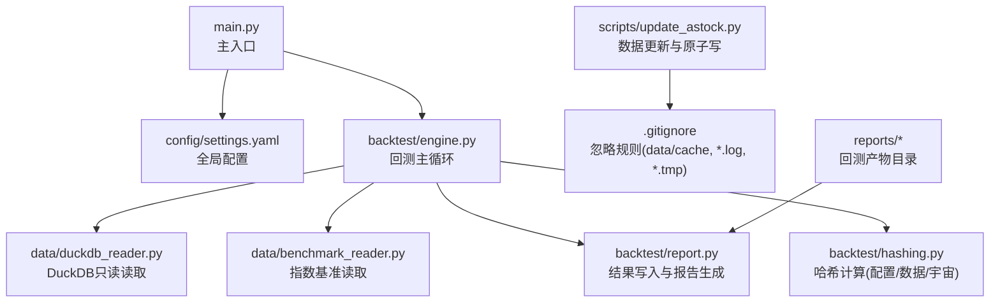
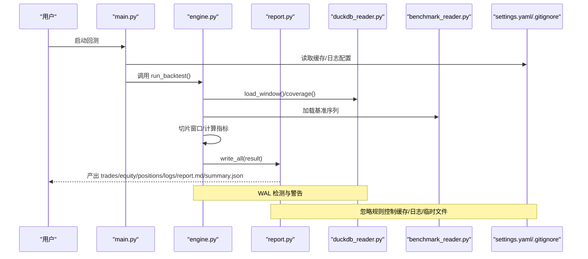
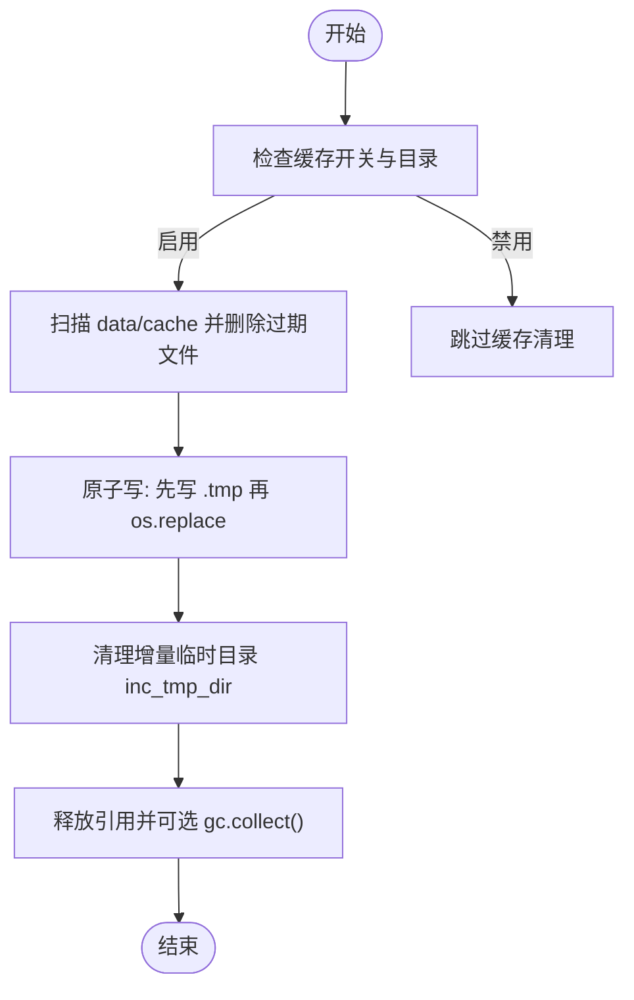
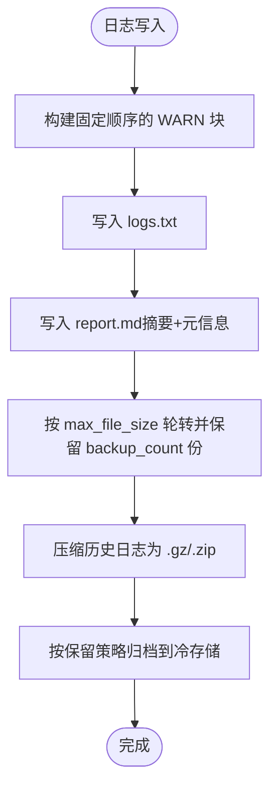
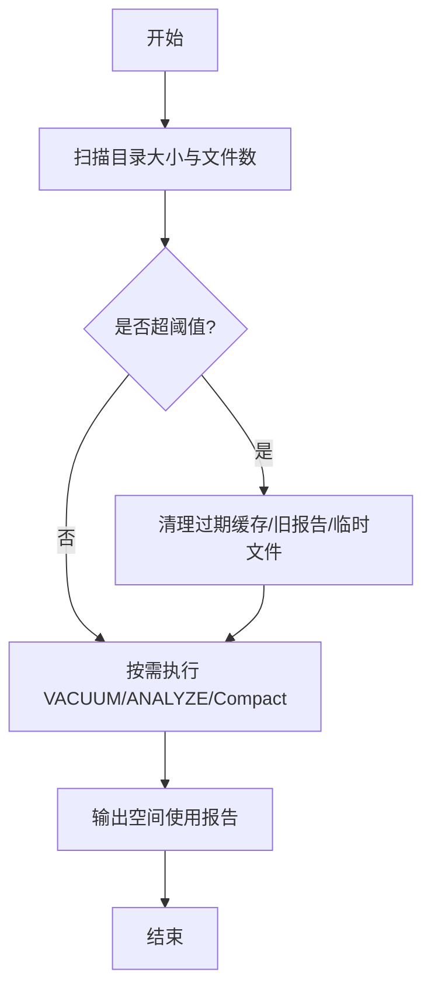
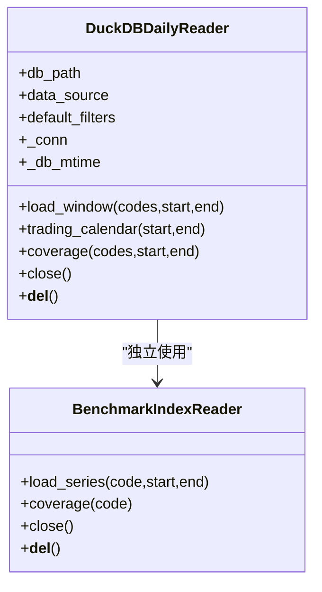
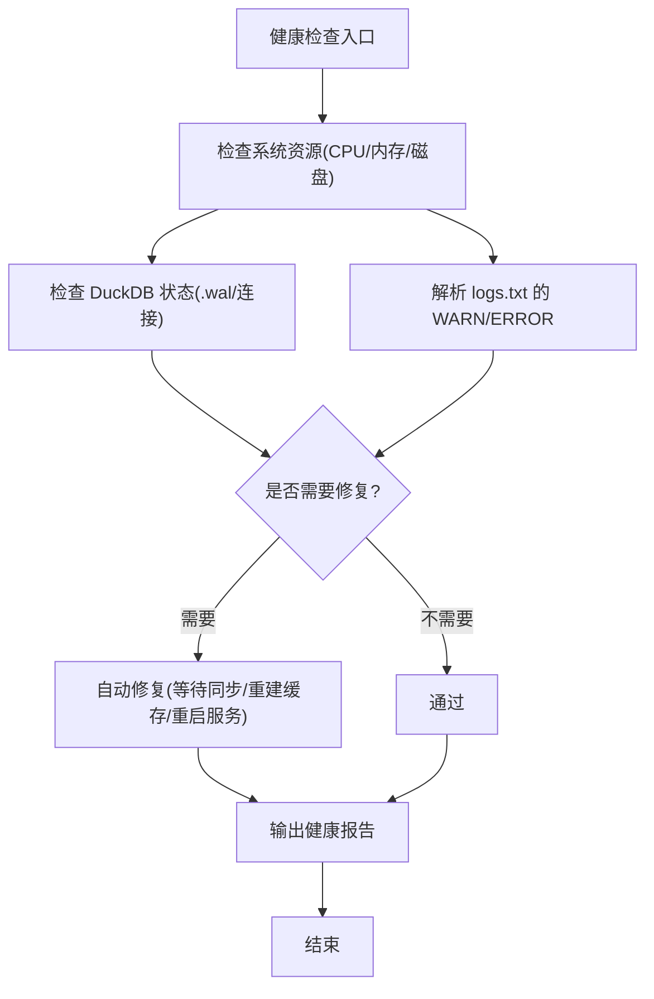
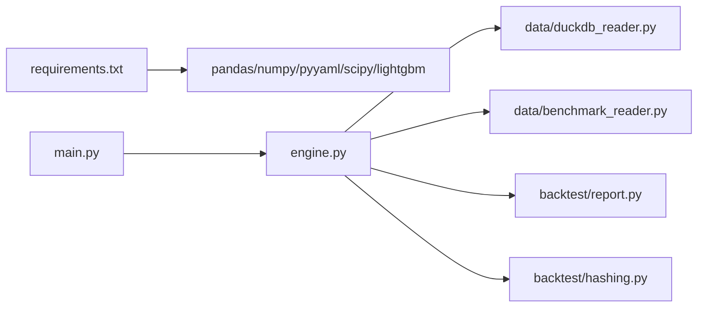

# 系统清理自动化

<cite>
**本文引用的文件**   
- [main.py](file://main.py)
- [settings.yaml](file://config\settings.yaml)
- [.gitignore](file://.gitignore)
- [update_astock.py](file://scripts\update_astock.py)
- [duckdb_reader.py](file://data\duckdb_reader.py)
- [benchmark_reader.py](file://data\benchmark_reader.py)
- [engine.py](file://backtest\engine.py)
- [report.py](file://backtest\report.py)
- [hashing.py](file://backtest\hashing.py)
- [requirements.txt](file://requirements.txt)
</cite>

## 目录
1. [简介](#简介)
2. [项目结构](#项目结构)
3. [核心组件](#核心组件)
4. [架构总览](#架构总览)
5. [详细组件分析](#详细组件分析)
6. [依赖关系分析](#依赖关系分析)
7. [性能考虑](#性能考虑)
8. [故障排查指南](#故障排查指南)
9. [结论](#结论)
10. [附录](#附录)

## 简介
本指南面向 QuantLab 的“系统清理自动化”，覆盖以下关键主题：
- 临时文件与缓存管理、中间结果清理、内存释放策略
- 日志归档机制（轮转、压缩、保留策略、检索优化）
- 存储空间优化（磁盘监控、大文件清理、索引重建、碎片整理）
- 数据库维护（表优化、索引重建、统计信息更新、垃圾回收）
- 系统健康检查（资源监控、性能基准、异常检测、自动修复）

本指南以仓库现有实现为依据，结合工程实践给出可操作的自动化方案与落地建议。

## 项目结构
QuantLab 采用按功能域划分的目录组织方式：
- backtest：回测引擎、执行、组合、报告等
- data：数据读取器（DuckDB/astock/benchmark）、行情与因子数据加载
- scripts：数据更新、批量任务脚本
- config：全局配置（含缓存、日志、回测参数）
- reports：回测产物输出目录
- projects：各策略项目隔离
- .gitignore：忽略规则（缓存、日志、临时文件）

**图表来源** 
- [main.py:1-104](file://main.py#L1-L104)
- [settings.yaml:1-69](file://config\settings.yaml#L1-L69)
- [engine.py:1-200](file://backtest\engine.py#L1-L200)
- [duckdb_reader.py:1-215](file://data\duckdb_reader.py#L1-L215)
- [benchmark_reader.py:39-72](file://data\benchmark_reader.py#L39-L72)
- [report.py:1-264](file://backtest\report.py#L1-L264)
- [hashing.py:1-23](file://backtest\hashing.py#L1-L23)
- [.gitignore:1-21](file://.gitignore#L1-L21)

**章节来源**
- [main.py:1-104](file://main.py#L1-L104)
- [settings.yaml:1-69](file://config\settings.yaml#L1-L69)
- [.gitignore:1-21](file://.gitignore#L1-L21)

## 核心组件
- 回测主循环与产物输出：engine.py 负责数据窗口切分、基准对齐、指标计算；report.py 统一落盘（trades/equity/positions/logs/report.md/summary.json）。
- 数据读取：duckdb_reader.py 提供 DuckDB 只读访问、去重与覆盖率统计；benchmark_reader.py 提供指数序列读取与连接关闭。
- 数据更新与原子写：scripts/update_astock.py 使用临时文件 + os.replace 原子替换，避免并发读写损坏。
- 配置与缓存：settings.yaml 定义缓存开关、目录、过期天数；.gitignore 忽略 data/cache、*.log、*.tmp。
- 哈希与可复现性：backtest/hashing.py 计算配置/数据/宇宙哈希，用于缓存命中与结果溯源。

**章节来源**
- [engine.py:1-200](file://backtest\engine.py#L1-L200)
- [report.py:1-264](file://backtest\report.py#L1-L264)
- [duckdb_reader.py:1-215](file://data\duckdb_reader.py#L1-L215)
- [benchmark_reader.py:39-72](file://data\benchmark_reader.py#L39-L72)
- [update_astock.py:38-118](file://scripts\update_astock.py#L38-L118)
- [settings.yaml:16-35](file://config\settings.yaml#L16-L35)
- [hashing.py:1-23](file://backtest\hashing.py#L1-L23)

## 架构总览
下图展示回测运行时的主要交互与数据流，以及清理与归档的关键节点。

**图表来源** 
- [main.py:28-92](file://main.py#L28-L92)
- [engine.py:38-100](file://backtest\engine.py#L38-L100)
- [duckdb_reader.py:90-132](file://data\duckdb_reader.py#L90-L132)
- [benchmark_reader.py:52-72](file://data\benchmark_reader.py#L52-L72)
- [report.py:245-263](file://backtest\report.py#L245-L263)
- [settings.yaml:16-35](file://config\settings.yaml#L16-L35)
- [.gitignore:11-21](file://.gitignore#L11-L21)

## 详细组件分析

### 临时文件与缓存管理
- 缓存目录与过期策略：settings.yaml 中 data.cache.enabled/dir/expire_days 控制缓存开关、路径与过期天数。建议在定时任务中扫描 data/cache，删除超过 expire_days 的文件。
- 忽略规则：.gitignore 已忽略 data/cache、*.log、*.tmp，避免污染版本库并减少误提交。
- 原子写与中间结果：update_astock.py 使用 .tmp_update 后缀写入后再 os.replace 原子替换，保证一致性；处理完成后清理增量临时目录 inc_tmp_dir。
- 内存释放策略：在读取器 close() 与析构 __del__ 中显式关闭连接；对大型 DataFrame 使用 del 引用并在必要时触发 gc.collect()。

**图表来源** 
- [settings.yaml:16-20](file://config\settings.yaml#L16-L20)
- [.gitignore:11-21](file://.gitignore#L11-L21)
- [update_astock.py:42-50](file://scripts\update_astock.py#L42-L50)
- [update_astock.py:151-178](file://scripts\update_astock.py#L151-L178)
- [duckdb_reader.py:207-215](file://data\duckdb_reader.py#L207-L215)

**章节来源**
- [settings.yaml:16-20](file://config\settings.yaml#L16-L20)
- [.gitignore:11-21](file://.gitignore#L11-L21)
- [update_astock.py:42-50](file://scripts\update_astock.py#L42-L50)
- [update_astock.py:151-178](file://scripts\update_astock.py#L151-L178)
- [duckdb_reader.py:207-215](file://data\duckdb_reader.py#L207-L215)

### 日志归档机制
- 日志位置与内容：report.py 将 logs.txt 与 report.md 写入 results_dir；logs.txt 包含固定顺序的 WARN 块与每日日志摘录。
- 轮转与保留：settings.yaml 的 logging.dir/max_file_size/backup_count 定义了日志目录、单文件大小上限与备份数量。建议配合外部工具（如 logrotate）或自定义脚本实现压缩与滚动。
- 检索优化：在 report.md 中仅保留最近若干条 WARN/ERROR 摘要，便于快速定位问题。

**图表来源** 
- [report.py:78-121](file://backtest\report.py#L78-L121)
- [report.py:138-233](file://backtest\report.py#L138-L233)
- [settings.yaml:31-35](file://config\settings.yaml#L31-L35)

**章节来源**
- [report.py:78-121](file://backtest\report.py#L78-L121)
- [report.py:138-233](file://backtest\report.py#L138-L233)
- [settings.yaml:31-35](file://config\settings.yaml#L31-L35)

### 存储空间优化
- 磁盘使用监控：定期统计 reports、data/cache、data/*.parquet、*.log 大小，设置阈值告警。
- 大文件清理：清理过期的 data/cache、旧的 reports 子目录（基于 run_id 时间戳）、无用的 .tmp 文件。
- 索引重建与碎片整理：对 DuckDB 文件进行 VACUUM/ANALYZE（若支持），或在数据更新后重建索引；对 parquet 文件定期 compact 以减少碎片。
- 增量同步后的清理：update_astock.py 在完成增量处理后删除 inc_tmp_dir，避免残留。

[此图为概念流程，不直接映射具体源码]

### 数据库维护（DuckDB）
- WAL 检测：duckdb_reader.py 检测到 .wal 时发出警告，提示上游可能正在同步，需等待同步完成以确保 data_hash 稳定。
- 只读模式：reader 以 read_only=True 打开，避免回测过程修改数据源。
- 统计与覆盖率：coverage() 返回最小/最大日期、代码数、去重计数等，供 engine 记录与报告。
- 连接管理：close() 与 __del__ 确保连接释放。

**图表来源** 
- [duckdb_reader.py:35-76](file://data\duckdb_reader.py#L35-L76)
- [duckdb_reader.py:90-132](file://data\duckdb_reader.py#L90-L132)
- [duckdb_reader.py:146-205](file://data\duckdb_reader.py#L146-L205)
- [benchmark_reader.py:39-72](file://data\benchmark_reader.py#L39-L72)

**章节来源**
- [duckdb_reader.py:35-76](file://data\duckdb_reader.py#L35-L76)
- [duckdb_reader.py:90-132](file://data\duckdb_reader.py#L90-L132)
- [duckdb_reader.py:146-205](file://data\duckdb_reader.py#L146-L205)
- [benchmark_reader.py:39-72](file://data\benchmark_reader.py#L39-L72)

### 系统健康检查
- 资源监控：监控 CPU/内存/磁盘 IO 与 DuckDB 进程占用，结合日志中的 WARN 块判断异常。
- 性能基准：通过 engine.py 的 runtime_seconds 与 metrics 评估回测耗时与稳定性。
- 异常检测：WAL 检测、样本期不足警告、基准不可用警告等。
- 自动修复：当检测到 WAL 存在时，建议暂停回测直至同步完成；当缓存过期或损坏时自动重建。

[此图为概念流程，不直接映射具体源码]

## 依赖关系分析
- 运行时依赖：pandas/numpy/pyyaml/scipy/lightgbm 等由 requirements.txt 声明。
- 模块耦合：engine.py 依赖 data.* 读取器与 backtest.* 执行/组合/报告；report.py 仅做序列化输出；duckdb_reader.py 与 benchmark_reader.py 相互独立但共同服务于 engine。
- 外部集成：QMT 相关依赖（xtquant）在 requirements.txt 中标注为可选，生产部署时需单独安装。

**图表来源** 
- [requirements.txt:1-29](file://requirements.txt#L1-L29)
- [main.py:28-92](file://main.py#L28-L92)
- [engine.py:1-200](file://backtest\engine.py#L1-L200)
- [duckdb_reader.py:1-215](file://data\duckdb_reader.py#L1-L215)
- [benchmark_reader.py:39-72](file://data\benchmark_reader.py#L39-L72)
- [report.py:1-264](file://backtest\report.py#L1-L264)
- [hashing.py:1-23](file://backtest\hashing.py#L1-L23)

**章节来源**
- [requirements.txt:1-29](file://requirements.txt#L1-L29)
- [main.py:28-92](file://main.py#L28-L92)
- [engine.py:1-200](file://backtest\engine.py#L1-L200)

## 性能考虑
- 窗口切片优化：engine.py 预计算 cut 索引，使每日切片 O(1)，降低重复搜索开销。
- 去重与覆盖率：duckdb_reader.py 针对两种 schema 的去重逻辑与覆盖率统计，避免冗余数据影响性能。
- 基准序列前向填充：engine.py 对缺失的基准数据进行前向填充，保证指标计算连续性。
- 并行与原子写：update_astock.py 使用 ProcessPoolExecutor 并行处理 code，并以原子写保障一致性。

**章节来源**
- [engine.py:121-146](file://backtest\engine.py#L121-L146)
- [duckdb_reader.py:146-205](file://data\duckdb_reader.py#L146-L205)
- [engine.py:38-100](file://backtest\engine.py#L38-L100)
- [update_astock.py:151-178](file://scripts\update_astock.py#L151-L178)

## 故障排查指南
- WAL 警告：duckdb_reader.py 检测到 .wal 时打印警告，说明上游可能在同步数据，应等待同步完成并重跑以保证 data_hash 稳定。
- 基准不可用：engine.py 在基准数据缺失或起点价格异常时给出明确警告，需检查 benchmark_index.duckdb 与代码可用性。
- 样本期不足：report.py 的 WARN 块会提示样本期较短，不建议作为最终定论。
- 日志定位：logs.txt 与 report.md 中的“关键日志摘录”帮助快速定位错误；确认编码与文件名可信度（参考全局复利与踩坑日志中的说明）。

**章节来源**
- [duckdb_reader.py:63-75](file://data\duckdb_reader.py#L63-L75)
- [engine.py:38-100](file://backtest\engine.py#L38-L100)
- [report.py:78-121](file://backtest\report.py#L78-L121)
- [report.py:138-233](file://backtest\report.py#L138-L233)

## 结论
QuantLab 在数据读取、回测执行与报告输出方面具备清晰的模块化设计。通过 settings.yaml 与 .gitignore 的约定，结合 update_astock.py 的原子写与 duckdb_reader.py 的 WAL 检测，已形成良好的临时文件与缓存治理基础。建议在此基础上引入定时任务实现：
- 缓存过期清理与压缩归档
- 日志轮转与冷热分层存储
- 磁盘监控与自动清理
- DuckDB 维护（VACUUM/ANALYZE）与索引重建
- 健康检查与自动修复（WAL 等待、缓存重建）

这些措施将显著提升系统的稳定性、可维护性与可观测性。

## 附录
- 配置项速览（节选）：
  - data.cache.enabled/dir/expire_days：缓存开关、目录、过期天数
  - logging.level/dir/max_file_size/backup_count：日志级别、目录、文件大小、备份数量
  - backtest.start_date/end_date/initial_capital/commission/slippage/benchmark：回测参数
- 产物清单（results_dir）：
  - trades.csv、equity_curve.csv、positions.csv、logs.txt、report.md、summary.json

**章节来源**
- [settings.yaml:16-35](file://config\settings.yaml#L16-L35)
- [report.py:245-263](file://backtest\report.py#L245-L263)