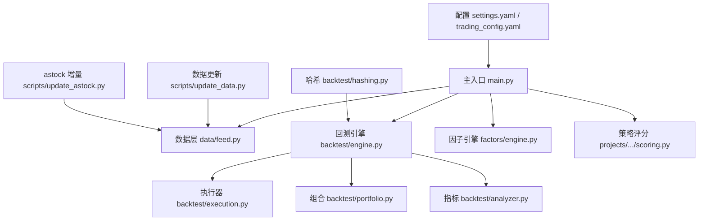
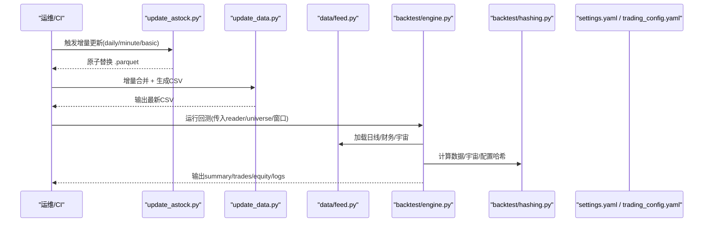
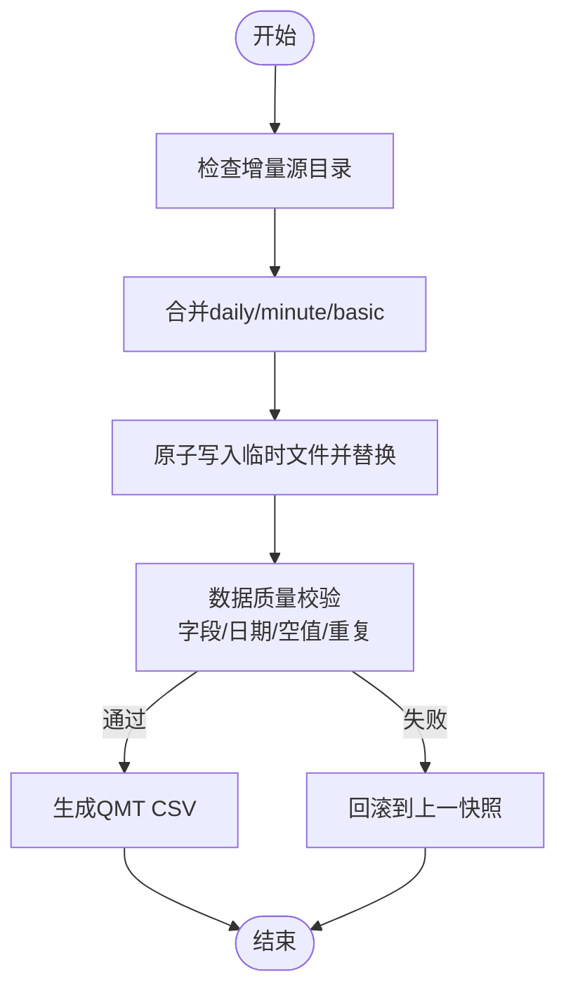
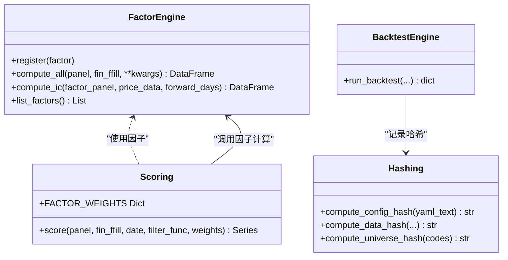
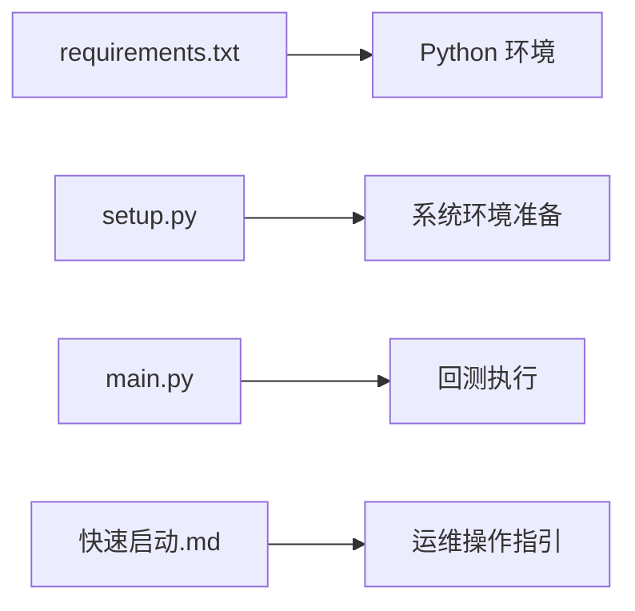

# 维护任务自动化

<cite>
**本文引用的文件**   
- [main.py](file://main.py)
- [requirements.txt](file://requirements.txt)
- [setup.py](file://setup.py)
- [AGENTS.md](file://AGENTS.md)
- [快速启动.md](file://快速启动.md)
- [scripts/update_data.py](file://scripts/update_data.py)
- [scripts/update_astock.py](file://scripts/update_astock.py)
- [config/settings.yaml](file://config/settings.yaml)
- [config/trading_config.yaml](file://config/trading_config.yaml)
- [data/feed.py](file://data/feed.py)
- [projects/Project_01_多因子IC小盘Alpha/strategy/scoring.py](file://projects/Project_01_多因子IC小盘Alpha/strategy/scoring.py)
- [factors/engine.py](file://factors/engine.py)
- [backtest/engine.py](file://backtest/engine.py)
- [backtest/hashing.py](file://backtest/hashing.py)
</cite>

## 目录
1. [引言](#引言)
2. [项目结构](#项目结构)
3. [核心组件](#核心组件)
4. [架构总览](#架构总览)
5. [详细组件分析](#详细组件分析)
6. [依赖关系分析](#依赖关系分析)
7. [性能与可扩展性](#性能与可扩展性)
8. [故障排查指南](#故障排查指南)
9. [结论](#结论)
10. [附录：自动化清单与SOP](#附录自动化清单与sop)

## 引言
本指南面向 QuantLab 的运维与研发人员，提供“维护任务自动化”的完整方案。围绕数据更新、模型重训练、配置同步、证书与密钥管理、系统清理五大主题，给出可落地的流程设计、关键脚本定位、校验与回滚策略，以及监控与排障建议。内容基于仓库现有代码与脚本进行梳理，确保与当前工程一致并可立即落地。

## 项目结构
QuantLab 采用模块化+项目隔离的组织方式：
- 数据层：统一接口 DataFeed，支持 astock parquet 与 DuckDB 双引擎；增量更新脚本位于 scripts/ 下。
- 因子与策略：factors/ 提供因子基类与引擎；策略逻辑按项目隔离在 projects/ 下。
- 回测与执行：backtest/ 提供回测主循环、执行器、组合与指标计算。
- 配置：settings.yaml（全局）、trading_config.yaml（实盘）、各项目的 strategy.yaml。
- 构建与部署：setup.py 用于环境准备；各子项目 build.py 生成 QMT 单文件产物。

图表来源 
- [main.py:1-104](file://main.py#L1-L104)
- [data/feed.py:1-197](file://data/feed.py#L1-L197)
- [backtest/engine.py:1-619](file://backtest/engine.py#L1-L619)
- [factors/engine.py:1-86](file://factors/engine.py#L1-L86)
- [projects/Project_01_多因子IC小盘Alpha/strategy/scoring.py:1-158](file://projects/Project_01_多因子IC小盘Alpha/strategy/scoring.py#L1-L158)
- [scripts/update_data.py:1-135](file://scripts/update_data.py#L1-L135)
- [scripts/update_astock.py:1-219](file://scripts/update_astock.py#L1-L219)
- [config/settings.yaml:1-69](file://config/settings.yaml#L1-L69)
- [config/trading_config.yaml:1-62](file://config/trading_config.yaml#L1-L62)
- [backtest/hashing.py:1-23](file://backtest/hashing.py#L1-L23)

章节来源
- [AGENTS.md:1-194](file://AGENTS.md#L1-L194)
- [快速启动.md:1-67](file://快速启动.md#L1-L67)

## 核心组件
- 数据更新
  - scripts/update_data.py：增量合并 astock parquet，并重新生成 QMT 所需 CSV。
  - scripts/update_astock.py：对 daily/minute/basic 三类数据进行原子写入与并行处理。
- 数据读取
  - data/feed.py：DataFeed 统一接口，封装 astock/DuckDB 读取、宇宙选择、面板构建。
- 因子与策略
  - factors/engine.py：因子注册、批量计算与 IC 评估。
  - projects/.../scoring.py：多因子评分与权重合成。
- 回测与版本化
  - backtest/engine.py：回测主循环、基准对齐、结果汇总。
  - backtest/hashing.py：数据/宇宙/配置哈希，保障可复现。
- 配置
  - config/settings.yaml：全局数据、回测、日志、因子预处理等。
  - config/trading_config.yaml：账号、交易参数、风控、调度、通知。

章节来源
- [scripts/update_data.py:1-135](file://scripts/update_data.py#L1-L135)
- [scripts/update_astock.py:1-219](file://scripts/update_astock.py#L1-L219)
- [data/feed.py:1-197](file://data/feed.py#L1-L197)
- [factors/engine.py:1-86](file://factors/engine.py#L1-L86)
- [projects/Project_01_多因子IC小盘Alpha/strategy/scoring.py:1-158](file://projects/Project_01_多因子IC小盘Alpha/strategy/scoring.py#L1-L158)
- [backtest/engine.py:1-619](file://backtest/engine.py#L1-L619)
- [backtest/hashing.py:1-23](file://backtest/hashing.py#L1-L23)
- [config/settings.yaml:1-69](file://config/settings.yaml#L1-L69)
- [config/trading_config.yaml:1-62](file://config/trading_config.yaml#L1-L62)

## 架构总览
下图展示从数据更新到回测运行的端到端链路，以及关键配置与哈希校验点。

图表来源 
- [scripts/update_astock.py:1-219](file://scripts/update_astock.py#L1-L219)
- [scripts/update_data.py:1-135](file://scripts/update_data.py#L1-L135)
- [data/feed.py:1-197](file://data/feed.py#L1-L197)
- [backtest/engine.py:1-619](file://backtest/engine.py#L1-L619)
- [backtest/hashing.py:1-23](file://backtest/hashing.py#L1-L23)
- [config/settings.yaml:1-69](file://config/settings.yaml#L1-L69)
- [config/trading_config.yaml:1-62](file://config/trading_config.yaml#L1-L62)

## 详细组件分析

### 数据更新自动化（增量同步、历史校验、质量检查、备份恢复）
- 增量同步
  - update_astock.py：按 daily/minute/basic 分别合并本地(<2026-01-01)、全量包(2026)、增量包，使用原子写入避免部分更新导致的数据损坏。
  - update_data.py：扫描“增量”目录，去重合并 stock_daily.parquet，并基于最新交易日生成 QMT 所需的 mfic_fin_data.csv。
- 历史校验
  - 通过 backtest/hashing.py 的 compute_data_hash 将 db_path、mtime、调整方式、起止日期、实际覆盖范围、去重统计、宇宙哈希等纳入哈希，便于比对前后版本一致性。
  - 可在 CI 中对比 run_id/data_hash/config_hash/universe_hash 是否变化，决定是否重跑回测。
- 质量检查
  - 建议在 update_astock.py 完成后增加校验步骤：字段完整性、日期连续性、重复行检测、空值比例阈值、最小样本数。
  - 对 CSV 生成后校验列名、缺失率、市值区间分布是否符合预期。
- 备份恢复
  - 原子替换机制已内置（.tmp_update -> os.replace），建议配合每日快照（如 rsync/cp 到归档目录）。
  - 失败回滚：若后续验证失败，直接回退到上次快照或保留的旧文件。

图表来源 
- [scripts/update_astock.py:1-219](file://scripts/update_astock.py#L1-L219)
- [scripts/update_data.py:1-135](file://scripts/update_data.py#L1-L135)
- [backtest/hashing.py:1-23](file://backtest/hashing.py#L1-L23)

章节来源
- [scripts/update_astock.py:1-219](file://scripts/update_astock.py#L1-L219)
- [scripts/update_data.py:1-135](file://scripts/update_data.py#L1-L135)
- [backtest/hashing.py:1-23](file://backtest/hashing.py#L1-L23)

### 模型重训练自动化（因子权重更新、策略参数优化、机器学习训练、版本管理）
- 因子权重更新
  - 权重定义位于 projects/.../scoring.py 的 FACTOR_WEIGHTS；可通过外部配置注入或运行时覆盖。
  - 建议在 CI 中比较权重变更的 diff，自动触发因子 IC 评估与回测。
- 策略参数优化
  - 使用 backtest/engine.py 的 run_backtest 接口，结合网格/贝叶斯搜索框架（可选扩展），输出不同参数的 summary/performance。
- 机器学习模型训练
  - requirements.txt 包含 lightgbm 等 ML 依赖；可在 research/ 或独立训练脚本中实现训练流水线，产出模型文件与元数据（特征、版本、哈希）。
- 版本管理
  - 利用 backtest/hashing.py 的 compute_config_hash 对 YAML 文本求哈希，作为配置版本标识。
  - 每次训练/回测记录 run_id、data_hash、universe_hash、config_hash，保证完全可追溯。

图表来源 
- [factors/engine.py:1-86](file://factors/engine.py#L1-L86)
- [projects/Project_01_多因子IC小盘Alpha/strategy/scoring.py:1-158](file://projects/Project_01_多因子IC小盘Alpha/strategy/scoring.py#L1-L158)
- [backtest/engine.py:1-619](file://backtest/engine.py#L1-L619)
- [backtest/hashing.py:1-23](file://backtest/hashing.py#L1-L23)

章节来源
- [factors/engine.py:1-86](file://factors/engine.py#L1-L86)
- [projects/Project_01_多因子IC小盘Alpha/strategy/scoring.py:1-158](file://projects/Project_01_多因子IC小盘Alpha/strategy/scoring.py#L1-L158)
- [backtest/engine.py:1-619](file://backtest/engine.py#L1-L619)
- [backtest/hashing.py:1-23](file://backtest/hashing.py#L1-L23)

### 配置同步自动化（版本控制、差异检测、热更新、回滚）
- 版本控制
  - settings.yaml 与 trading_config.yaml 纳入 Git 管理；每次修改提交并附带变更说明。
- 差异检测
  - 使用 compute_config_hash 对配置文件文本求哈希，CI 中比较前后哈希，自动标记变更并触发相应流水线（如回测/部署）。
- 热更新
  - 对于非运行时强一致场景，可在服务启动时动态读取 YAML；对敏感项（如路径、端口）建议重启生效。
- 回滚机制
  - 配置变更需遵循“灰度+回滚”策略：先应用至预发环境验证，再切换生产；一旦异常，立即回滚到上一个稳定版本。

章节来源
- [config/settings.yaml:1-69](file://config/settings.yaml#L1-L69)
- [config/trading_config.yaml:1-62](file://config/trading_config.yaml#L1-L62)
- [backtest/hashing.py:1-23](file://backtest/hashing.py#L1-L23)

### 证书管理自动化（SSL续期、API密钥轮换、数据库密码更新、第三方认证）
- SSL 证书续期
  - 建议使用自动化脚本拉取/安装新证书，并在 Nginx/反向代理中平滑重载；记录证书指纹与到期时间。
- API 密钥轮换
  - 将密钥存放于安全存储（如环境变量或密钥管理服务），通过配置中心下发；轮换时启用双活过渡期，逐步切换流量。
- 数据库密码更新
  - 先在只读副本验证连接，再切换到主库；更新连接池配置并滚动重启服务。
- 第三方服务认证
  - 对 QMT/数据源等第三方凭据，建立定期巡检与告警；失败重试与熔断降级策略需完备。

[本节为通用实践说明，不直接分析具体文件]

### 系统清理自动化（临时文件、缓存、日志归档、存储空间优化）
- 临时文件清理
  - update_astock.py 使用临时后缀 .tmp_update，应在成功替换后清理；分钟级周期拆分后的临时目录 inc_tmp_dir 会在完成后删除。
- 缓存清理
  - data/cache/ 目录按过期天数（settings.yaml 中 expire_days=1）清理过期缓存，释放磁盘空间。
- 日志归档
  - logs/ 目录按天轮转，超过 backup_count 的旧日志压缩归档并迁移至冷存储。
- 存储空间优化
  - 定期扫描大文件与重复文件，清理无用中间产物；对 parquet 文件进行压缩与分区优化。

章节来源
- [scripts/update_astock.py:1-219](file://scripts/update_astock.py#L1-L219)
- [config/settings.yaml:1-69](file://config/settings.yaml#L1-L69)

## 依赖关系分析
- 运行依赖
  - requirements.txt 定义了 pandas/numpy/pyyaml 等核心依赖，以及 lightgbm 等可选 ML 依赖。
- 环境准备
  - setup.py 负责查找 xtquant 源路径、复制到系统 Python、创建必要目录（logs/data/cache）。
- 启动与测试
  - main.py 作为回测入口，解析参数并运行指定策略；快速启动文档提供一键配置与连接测试步骤。

图表来源 
- [requirements.txt:1-29](file://requirements.txt#L1-L29)
- [setup.py:1-82](file://setup.py#L1-L82)
- [main.py:1-104](file://main.py#L1-L104)
- [快速启动.md:1-67](file://快速启动.md#L1-L67)

章节来源
- [requirements.txt:1-29](file://requirements.txt#L1-L29)
- [setup.py:1-82](file://setup.py#L1-L82)
- [main.py:1-104](file://main.py#L1-L104)
- [快速启动.md:1-67](file://快速启动.md#L1-L67)

## 性能与可扩展性
- 数据更新
  - update_astock.py 对 minute 周期采用进程池并行处理，提升吞吐；建议根据 CPU 核数调优 workers。
- 回测性能
  - backtest/engine.py 使用预计算 cut_index 实现 O(1) 切片，减少内存拷贝与索引开销。
- 可扩展性
  - DataFeed 抽象了数据源，新增数据源只需实现对应方法；因子引擎支持注册新因子，无需改动主循环。

[本节为通用性能讨论，不直接分析具体文件]

## 故障排查指南
- 数据更新失败
  - 检查增量源目录是否存在、文件名是否匹配；查看 update_astock.py 日志中的错误信息；确认原子替换是否成功。
- 回测异常
  - 核对 backtest/engine.py 的 summary 中的 data_hash/config_hash/universe_hash 是否与预期一致；检查 benchmark 数据可用性。
- 配置问题
  - 确认 settings.yaml/trading_config.yaml 路径与权限正确；必要时使用 compute_config_hash 对比变更。
- 连接测试
  - 使用 test_connection.py/test_connection_qmt.py 验证 QMT 连接；参考快速启动文档逐项检查。

章节来源
- [scripts/update_astock.py:1-219](file://scripts/update_astock.py#L1-L219)
- [backtest/engine.py:1-619](file://backtest/engine.py#L1-L619)
- [config/settings.yaml:1-69](file://config/settings.yaml#L1-L69)
- [config/trading_config.yaml:1-62](file://config/trading_config.yaml#L1-L62)
- [快速启动.md:1-67](file://快速启动.md#L1-L67)

## 结论
QuantLab 的维护任务自动化应以“数据更新—校验—回测—版本化”为主线，结合配置管理与证书/密钥生命周期管理，形成闭环。通过原子写入、哈希追踪、并行处理与标准化接口，既能保障稳定性，又能提升效率。建议将上述流程集成到 CI/CD 中，实现无人值守的自动化运维。

## 附录：自动化清单与SOP
- 数据更新 SOP
  - 执行 update_astock.py（支持 --dry 预览）→ 执行 update_data.py → 运行数据质量校验 → 生成 CSV → 记录 data_hash。
- 模型重训练 SOP
  - 拉取最新配置与数据 → 计算 config_hash → 训练/回测 → 记录 run_id/data_hash/universe_hash/config_hash → 输出报告。
- 配置同步 SOP
  - 修改 YAML → 提交 Git → CI 计算哈希并触发流水线 → 灰度验证 → 生产切换 → 异常回滚。
- 证书与密钥 SOP
  - 定时巡检 → 到期前续期 → 双活切换 → 旧凭据下线 → 记录审计日志。
- 系统清理 SOP
  - 每日清理 cache/logs → 周度归档 → 月度存储优化 → 监控磁盘使用率。

[本节为通用操作清单，不直接分析具体文件]