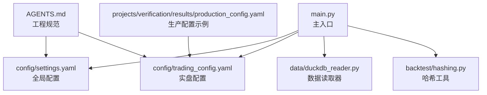
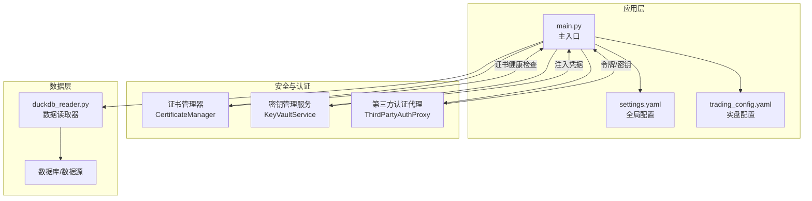
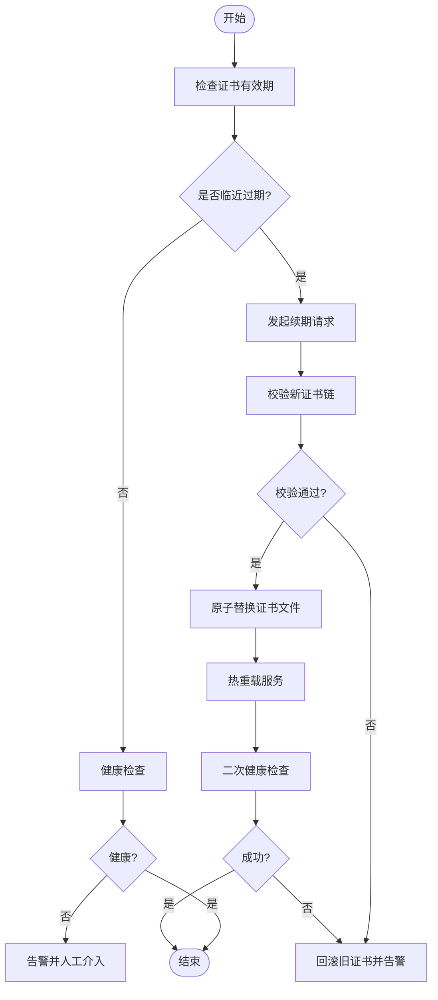
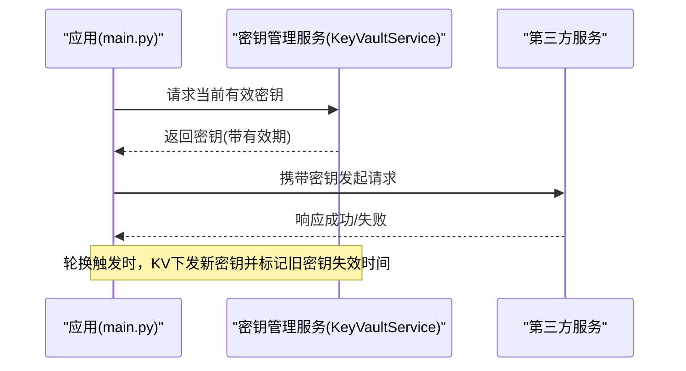
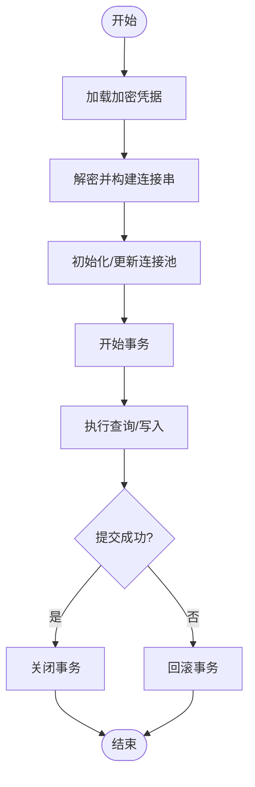
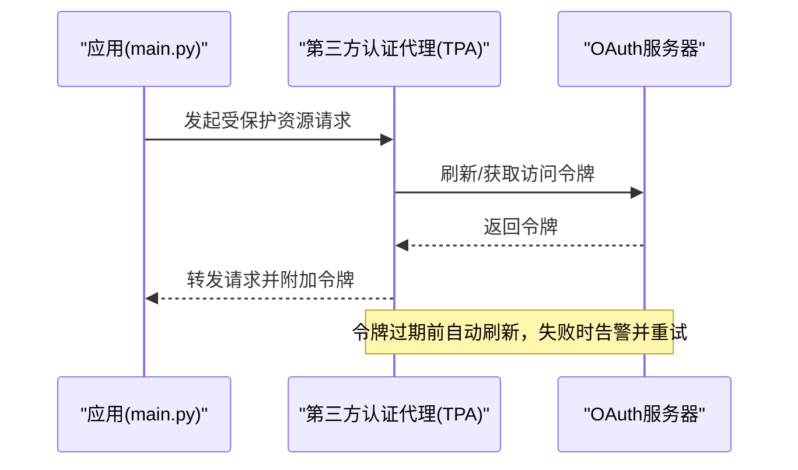
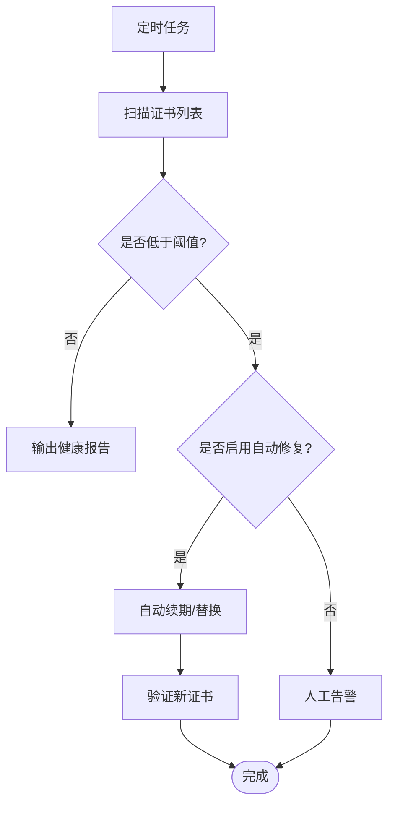
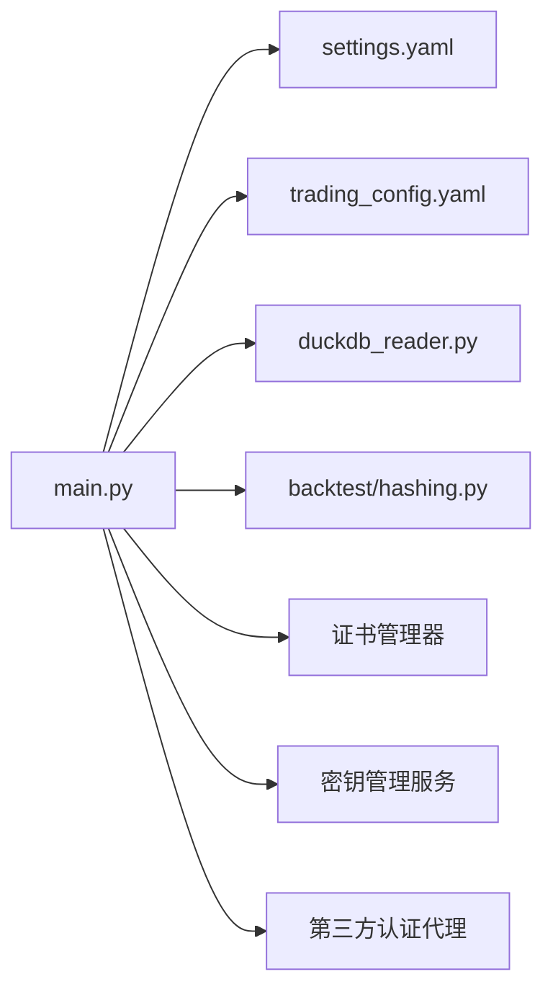

# 证书管理自动化

<cite>
**本文引用的文件**   
- [config/settings.yaml](file://config/settings.yaml)
- [config/trading_config.yaml](file://config/trading_config.yaml)
- [main.py](file://main.py)
- [backtest/hashing.py](file://backtest/hashing.py)
- [data/duckdb_reader.py](file://data/duckdb_reader.py)
- [miniQMT实盘对接_生产级完善方案.md](file://miniQMT实盘对接_生产级完善方案.md)
- [projects/verification/results/production_config.yaml](file://projects/verification/results/production_config.yaml)
- [AGENTS.md](file://AGENTS.md)
</cite>

## 目录
1. [引言](#引言)
2. [项目结构](#项目结构)
3. [核心组件](#核心组件)
4. [架构总览](#架构总览)
5. [详细组件分析](#详细组件分析)
6. [依赖分析](#依赖分析)
7. [性能考虑](#性能考虑)
8. [故障排查指南](#故障排查指南)
9. [结论](#结论)
10. [附录](#附录)

## 引言
本指南面向 QuantLab 的生产与运维团队，提供“证书管理自动化”的完整实践方案。内容覆盖：
- SSL 证书续期：监控、自动续期、替换流程与健康检查
- API 密钥轮换：生成、安全存储、定期轮换与访问权限管理
- 数据库密码更新：加密存储、连接池更新与事务处理
- 第三方服务认证：OAuth 令牌管理、API 密钥轮换与服务账户维护
- 证书监控：过期预警、健康检查与自动修复机制

本指南结合仓库现有配置与代码结构，给出可落地的自动化流程与最佳实践，确保系统在高可用与安全合规的前提下稳定运行。

## 项目结构
QuantLab 采用分层与模块化组织方式，关键与证书/认证相关的配置集中在以下位置：
- 全局配置：config/settings.yaml（数据源、缓存、日志、策略默认等）
- 实盘配置：config/trading_config.yaml（账号、交易参数、风控、调度、通知）
- 主入口：main.py（加载配置、启动回测/策略）
- 数据读取：data/duckdb_reader.py（数据库/数据源相关，含 WAL 检测等）
- 哈希工具：backtest/hashing.py（用于配置/数据指纹校验）
- 生产配置示例：projects/verification/results/production_config.yaml（组合策略与 QMT 路径等）
- 工程规范：AGENTS.md（配置体系、文件通信约定）

图表来源
- [main.py:1-104](file://main.py#L1-L104)
- [config/settings.yaml:1-69](file://config/settings.yaml#L1-L69)
- [config/trading_config.yaml:1-62](file://config/trading_config.yaml#L1-L62)
- [data/duckdb_reader.py:56-63](file://data/duckdb_reader.py#L56-L63)
- [backtest/hashing.py:1-23](file://backtest/hashing.py#L1-L23)
- [projects/verification/results/production_config.yaml:1-100](file://projects/verification/results/production_config.yaml#L1-L100)
- [AGENTS.md:90-109](file://AGENTS.md#L90-L109)

章节来源
- [main.py:1-104](file://main.py#L1-L104)
- [config/settings.yaml:1-69](file://config/settings.yaml#L1-L69)
- [config/trading_config.yaml:1-62](file://config/trading_config.yaml#L1-L62)
- [AGENTS.md:90-109](file://AGENTS.md#L90-L109)

## 核心组件
围绕证书与认证，建议引入以下核心组件（以模块/脚本形式落地）：
- 证书管理器（CertificateManager）
  - 负责证书生命周期：获取、续期、替换、验证、备份与回滚
  - 集成健康检查与告警（Webhook/邮件/企业微信）
- 密钥管理服务（KeyVaultService）
  - 统一生成、存储、轮换 API Key/OAuth Token
  - 支持最小权限与审计日志
- 数据库凭据管理器（DBSecretsManager）
  - 加密存储数据库密码，动态注入连接串
  - 连接池热更新与事务一致性保障
- 第三方认证代理（ThirdPartyAuthProxy）
  - OAuth 令牌刷新、API Key 轮换、服务账户维护
  - 重试与熔断策略

这些组件将与现有配置和入口无缝衔接，通过环境变量或受保护的配置文件注入敏感信息，避免硬编码。

章节来源
- [config/settings.yaml:1-69](file://config/settings.yaml#L1-L69)
- [config/trading_config.yaml:1-62](file://config/trading_config.yaml#L1-L62)
- [AGENTS.md:90-109](file://AGENTS.md#L90-L109)

## 架构总览
下图展示证书管理与认证相关的关键交互：入口加载配置，证书与密钥由专用服务提供，数据层通过加密凭据建立连接，第三方服务通过代理进行认证与令牌管理。

图表来源
- [main.py:1-104](file://main.py#L1-L104)
- [config/settings.yaml:1-69](file://config/settings.yaml#L1-L69)
- [config/trading_config.yaml:1-62](file://config/trading_config.yaml#L1-L62)
- [data/duckdb_reader.py:56-63](file://data/duckdb_reader.py#L56-L63)

## 详细组件分析

### SSL 证书续期与替换流程
- 监控与预警
  - 定时扫描证书有效期，临近过期触发预警（如剩余 30/15/7 天）
  - 健康检查接口返回证书状态与链完整性
- 自动续期
  - 调用证书颁发机构 API 或本地 CA 工具完成续期
  - 生成新证书并写入安全目录，保留旧版本用于回滚
- 替换流程
  - 原子替换：先写新证书到临时文件，校验通过后重命名替换
  - 服务热重载：对需要证书的服务执行平滑重启或重新加载配置
- 回滚机制
  - 若新证书校验失败，自动回滚至上一版本并告警

章节来源
- [config/settings.yaml:1-69](file://config/settings.yaml#L1-L69)
- [config/trading_config.yaml:1-62](file://config/trading_config.yaml#L1-L62)

### API 密钥轮换与安全管理
- 密钥生成
  - 使用强随机算法生成 API Key/OAuth Token，设置合理有效期
- 安全存储
  - 集中存储于密钥管理服务（环境变量、加密文件或专用 Vault）
  - 禁止在代码与配置中明文出现
- 定期轮换
  - 基于时间或事件触发轮换，保持新旧密钥并行窗口
  - 客户端按策略切换至新密钥，失败则回退
- 访问权限管理
  - 最小权限原则，按服务/环境隔离
  - 审计日志记录所有访问与变更

章节来源
- [AGENTS.md:90-109](file://AGENTS.md#L90-L109)

### 数据库密码更新与连接池管理
- 密码加密存储
  - 使用加密格式保存数据库密码，运行时解密注入连接串
- 连接池更新
  - 支持热更新连接池，避免中断正在进行的查询
- 事务处理
  - 在密码切换期间保证事务一致性，必要时暂停写入并等待切换完成

章节来源
- [data/duckdb_reader.py:56-63](file://data/duckdb_reader.py#L56-L63)

### 第三方服务认证与令牌管理
- OAuth 令牌管理
  - 自动刷新令牌，缓存短期令牌，处理刷新失败的重试与降级
- API 密钥轮换
  - 与密钥管理服务联动，按策略轮换并通知客户端
- 服务账户维护
  - 定期审计服务账户权限，清理过期或冗余账户

章节来源
- [AGENTS.md:90-109](file://AGENTS.md#L90-L109)

### 证书监控与健康检查
- 过期预警
  - 基于阈值的多级预警（黄/橙/红），并通过通知渠道推送
- 健康检查
  - 定期检查证书链完整性、域名匹配、HTTPS 握手成功率
- 自动修复
  - 自动续期与替换，失败时回滚并升级告警级别

章节来源
- [config/settings.yaml:1-69](file://config/settings.yaml#L1-L69)
- [config/trading_config.yaml:1-62](file://config/trading_config.yaml#L1-L62)

## 依赖分析
- 入口依赖
  - main.py 加载 settings.yaml 与 trading_config.yaml，驱动策略与数据读取
- 数据层依赖
  - duckdb_reader.py 负责数据源读取，可能涉及 WAL 检测与连接参数
- 安全与认证依赖
  - 证书管理器、密钥管理服务、第三方认证代理作为横切关注点，被入口与各模块调用
- 配置与规范
  - AGENTS.md 定义配置体系与文件通信约定，指导敏感信息与路径管理

图表来源
- [main.py:1-104](file://main.py#L1-L104)
- [config/settings.yaml:1-69](file://config/settings.yaml#L1-L69)
- [config/trading_config.yaml:1-62](file://config/trading_config.yaml#L1-L62)
- [data/duckdb_reader.py:56-63](file://data/duckdb_reader.py#L56-L63)
- [backtest/hashing.py:1-23](file://backtest/hashing.py#L1-L23)

章节来源
- [main.py:1-104](file://main.py#L1-L104)
- [AGENTS.md:90-109](file://AGENTS.md#L90-L109)

## 性能考虑
- 证书健康检查应异步执行，避免阻塞主流程
- 密钥与令牌缓存策略需平衡安全性与性能，设置合理的 TTL
- 数据库连接池更新应在低峰期进行，减少事务中断概率
- 第三方服务调用增加重试与熔断，防止雪崩效应

[本节为通用指导，不直接分析具体文件]

## 故障排查指南
- 证书问题
  - 检查证书链完整性与域名匹配
  - 查看续期日志与替换过程，确认原子替换与回滚是否生效
- 密钥问题
  - 核对密钥有效期与权限范围
  - 检查密钥轮换窗口内客户端切换逻辑
- 数据库问题
  - 验证连接串与加密凭据是否正确注入
  - 观察连接池状态与事务提交情况
- 第三方认证问题
  - 检查 OAuth 令牌刷新与 API Key 轮换日志
  - 确认网络连通性与服务可用性

章节来源
- [miniQMT实盘对接_生产级完善方案.md:73-756](file://miniQMT实盘对接_生产级完善方案.md#L73-L756)
- [data/duckdb_reader.py:56-63](file://data/duckdb_reader.py#L56-L63)

## 结论
通过引入证书管理器、密钥管理服务与第三方认证代理，并结合现有配置与入口，QuantLab 可实现端到端的证书与认证自动化。该方案具备高可用、可观测与可回滚特性，满足生产环境的严格安全要求。

[本节为总结性内容，不直接分析具体文件]

## 附录
- 配置体系参考：AGENTS.md 中的三级级联配置说明
- 生产配置示例：projects/verification/results/production_config.yaml 中的组合与 QMT 路径

章节来源
- [AGENTS.md:90-109](file://AGENTS.md#L90-L109)
- [projects/verification/results/production_config.yaml:1-100](file://projects/verification/results/production_config.yaml#L1-L100)