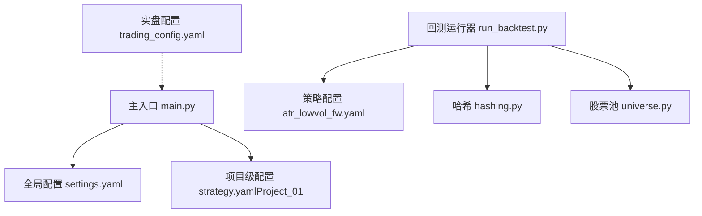
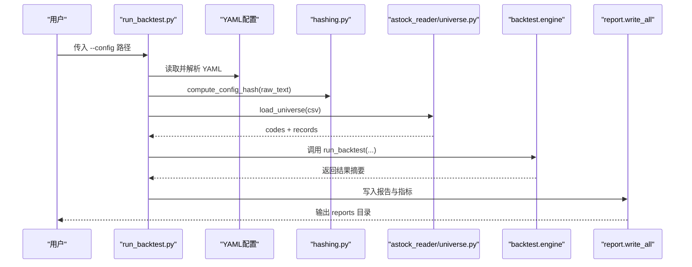
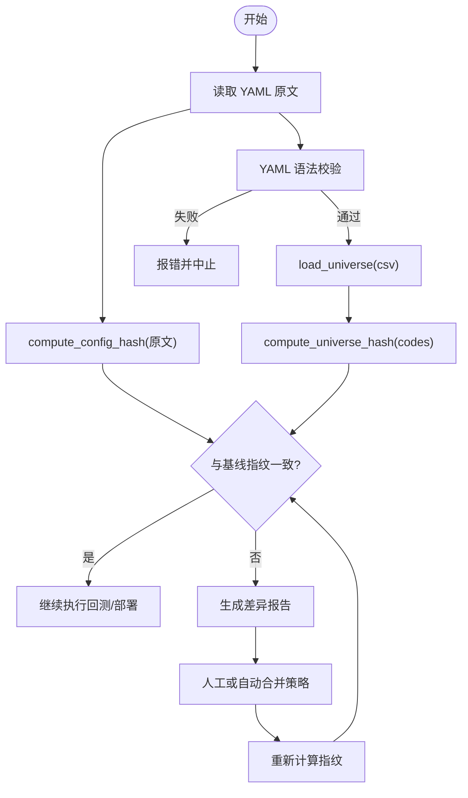
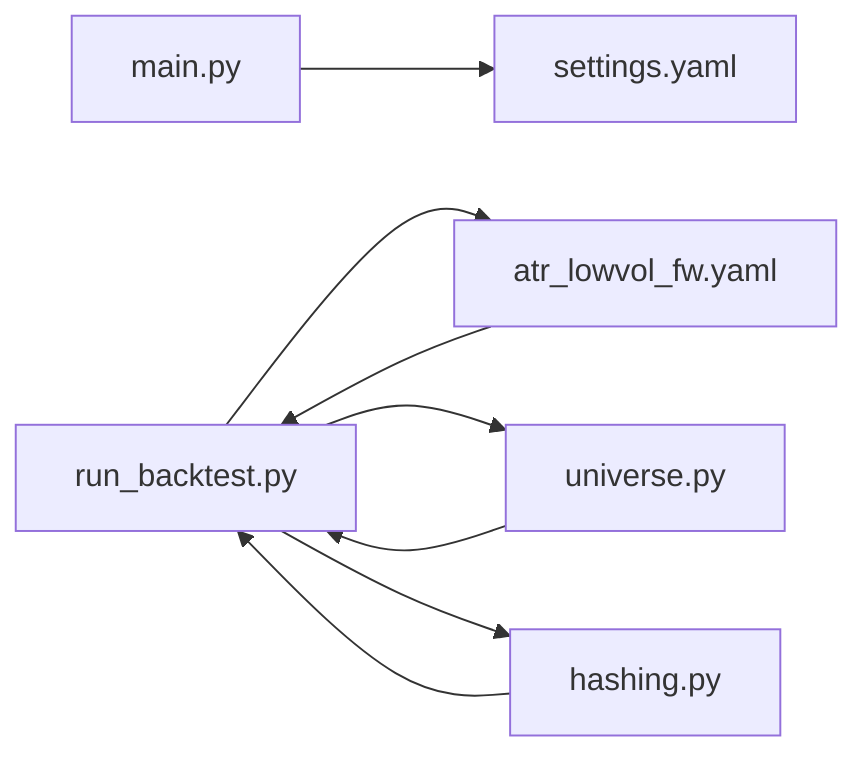

# 配置同步自动化

<cite>
**本文引用的文件**   
- [main.py](file://main.py)
- [settings.yaml](file://config\settings.yaml)
- [trading_config.yaml](file://config\trading_config.yaml)
- [atr_lowvol_fw.yaml](file://config\atr_lowvol_fw.yaml)
- [run_backtest.py](file://scripts\run_backtest.py)
- [hashing.py](file://backtest\hashing.py)
- [universe.py](file://data\universe.py)
- [strategy.yaml（Project_01）](file://projects\Project_01_多因子IC小盘Alpha\config\strategy.yaml)
- [AGENTS.md](file://AGENTS.md)
</cite>

## 目录
1. [简介](#简介)
2. [项目结构](#项目结构)
3. [核心组件](#核心组件)
4. [架构总览](#架构总览)
5. [详细组件分析](#详细组件分析)
6. [依赖关系分析](#依赖关系分析)
7. [性能考虑](#性能考虑)
8. [故障排查指南](#故障排查指南)
9. [结论](#结论)
10. [附录](#附录)

## 简介
本指南面向 QuantLab 的配置同步与自动化，覆盖以下目标：
- 配置文件版本控制：YAML 结构管理、Git 集成、变更追踪
- 配置差异检测：对比工具、冲突解决、自动合并策略
- 配置热更新机制：运行时加载、动态参数调整、最小化服务重启
- 配置回滚机制：版本快照、快速恢复、回滚验证
- 配置验证：语法检查、依赖关系验证、环境兼容性测试

本指南基于仓库现有实现进行系统化梳理，并提供可落地的流程与最佳实践。

## 项目结构
QuantLab 采用“三级级联”配置体系：
- 全局配置：config/settings.yaml（项目信息、数据源、回测参数、因子预处理、策略默认股票池、日志等）
- 实盘配置：config/trading_config.yaml（账号、交易参数、风控阈值、委托管理、调度计划、通知等）
- 项目级配置：projects/Project_XX_*/config/strategy.yaml（项目独立参数）

此外，回测引擎通过 scripts/run_backtest.py 读取具体策略的 YAML 配置并执行；哈希模块 backtest/hashing.py 为配置与数据集生成稳定指纹，便于差异检测与结果溯源。

**图表来源** 
- [main.py:21-34](file://main.py#L21-L34)
- [settings.yaml:1-68](file://config\settings.yaml#L1-L68)
- [atr_lowvol_fw.yaml:1-49](file://config\atr_lowvol_fw.yaml#L1-L49)
- [run_backtest.py:35-64](file://scripts\run_backtest.py#L35-L64)
- [hashing.py:1-23](file://backtest\hashing.py#L1-L23)
- [universe.py:1-62](file://data\universe.py#L1-L62)
- [trading_config.yaml:1-62](file://config\trading_config.yaml#L1-L62)

**章节来源**
- [AGENTS.md:90-94](file://AGENTS.md#L90-L94)
- [settings.yaml:1-68](file://config\settings.yaml#L1-L68)
- [trading_config.yaml:1-62](file://config\trading_config.yaml#L1-L62)
- [atr_lowvol_fw.yaml:1-49](file://config\atr_lowvol_fw.yaml#L1-L49)
- [strategy.yaml（Project_01）:1-62](file://projects\Project_01_多因子IC小盘Alpha\config\strategy.yaml#L1-L62)

## 核心组件
- 配置加载与入口
  - 主入口 main.py 负责加载全局配置 settings.yaml 并启动回测流程
  - 回测运行器 scripts/run_backtest.py 解析策略 YAML 配置，构建运行上下文并输出报告
- 配置哈希与溯源
  - backtest/hashing.py 提供 compute_config_hash、compute_universe_hash、compute_data_hash，用于配置、股票池与数据的指纹计算
- 股票池校验
  - data/universe.py 对 universe CSV 做严格模式校验（首列 code、正则匹配、去重、空集报错等）
- 实盘与全局配置分离
  - config/trading_config.yaml 承载账号、风控、委托、调度、通知等生产相关参数
  - config/settings.yaml 承载全局通用设置

**章节来源**
- [main.py:21-34](file://main.py#L21-L34)
- [run_backtest.py:35-64](file://scripts\run_backtest.py#L35-L64)
- [hashing.py:1-23](file://backtest\hashing.py#L1-L23)
- [universe.py:1-62](file://data\universe.py#L1-L62)
- [trading_config.yaml:1-62](file://config\trading_config.yaml#L1-L62)
- [settings.yaml:1-68](file://config\settings.yaml#L1-L68)

## 架构总览
下图展示从 CLI 到配置加载、哈希计算、数据读取与结果输出的整体流程，体现配置在系统中的关键作用点。

**图表来源** 
- [run_backtest.py:35-64](file://scripts\run_backtest.py#L35-L64)
- [hashing.py:1-23](file://backtest\hashing.py#L1-L23)
- [universe.py:1-62](file://data\universe.py#L1-L62)

## 详细组件分析

### 配置结构与版本控制
- 三级级联配置职责清晰：
  - 全局配置（settings.yaml）：项目元数据、数据源路径、缓存、回测默认值、因子预处理、策略默认股票池、日志级别与路径、实盘开关与指向
  - 实盘配置（trading_config.yaml）：账号、交易费率、滑点、风控阈值、委托超时与重试、调度时间表、通知方式
  - 项目级配置（Project_XX/config/strategy.yaml）：因子权重、市值过滤、调仓频率、止损、实盘参数、QMT 测试参数
- Git 集成建议：
  - 将 config/ 与 projects/*/config/ 纳入版本控制，提交前执行配置校验脚本
  - 使用语义化版本号与变更说明，结合 CI 触发配置差异检测与回归测试
  - 禁止提交敏感信息（如 webhook_url、本地路径），使用模板与环境变量注入

**章节来源**
- [settings.yaml:1-68](file://config\settings.yaml#L1-L68)
- [trading_config.yaml:1-62](file://config\trading_config.yaml#L1-L62)
- [strategy.yaml（Project_01）:1-62](file://projects\Project_01_多因子IC小盘Alpha\config\strategy.yaml#L1-L62)
- [AGENTS.md:90-94](file://AGENTS.md#L90-L94)

### 配置差异检测与合并策略
- 差异检测：
  - 使用 compute_config_hash(yaml_text) 对原始文本计算 SHA-256，作为配置指纹
  - 对 universe CSV 使用 compute_universe_hash(sorted(codes)) 生成股票池指纹
  - 对数据集合使用 compute_data_hash(...) 组合 db_path、mtime、adjustment、时间窗口、去重统计等生成数据指纹
- 对比与合并：
  - 建议在 CI 中比较两次提交的配置指纹，若变化则触发差异报告与回归测试
  - 对于多人协作，推荐以功能分支为单位修改配置，合并时优先保留业务正确性，必要时引入三方合并工具并人工复核关键字段（如风控阈值、费率、时间窗口）

**图表来源** 
- [run_backtest.py:35-64](file://scripts\run_backtest.py#L35-L64)
- [hashing.py:1-23](file://backtest\hashing.py#L1-L23)
- [universe.py:1-62](file://data\universe.py#L1-L62)

**章节来源**
- [run_backtest.py:35-64](file://scripts\run_backtest.py#L35-L64)
- [hashing.py:1-23](file://backtest\hashing.py#L1-L23)
- [universe.py:1-62](file://data\universe.py#L1-L62)

### 配置热更新机制
- 当前实现特点：
  - main.py 在进程启动时加载 settings.yaml，适用于回测场景
  - run_backtest.py 通过命令行参数指定 YAML 路径，适合批处理与流水线
- 热更新建议：
  - 对非关键参数（如日志级别、观察窗口、阈值微调）支持运行时重载：监听文件变更事件，增量替换内存中的配置对象
  - 对关键参数（如风控阈值、手续费率、调仓频率）建议采用“灰度切换”：先加载新配置至隔离空间，校验通过后切换引用，必要时触发最小化重启
  - 避免频繁重启：将配置变更与任务边界对齐（如换仓日、开盘前）

[本节为概念性说明，不直接分析具体文件]

### 配置回滚机制
- 版本快照：
  - 每次提交配置后，记录配置指纹与对应运行结果目录（reports/<run_id>_<config>/）
  - 将关键运行产物（summary.json、logs.txt、equity_curve.csv、trades.csv）纳入归档
- 快速恢复：
  - 当线上出现异常，依据最近一次“健康”配置的指纹定位到对应快照，一键恢复配置与状态
- 回滚验证：
  - 恢复后执行轻量回归（如最小数据集、短周期回测）确认关键指标未退化

[本节为概念性说明，不直接分析具体文件]

### 配置验证
- 语法检查：
  - 所有 YAML 必须通过 yaml.safe_load 解析，CI 中增加语法校验步骤
- 依赖关系验证：
  - universe CSV 必须满足 schema（首列为 code、正则匹配、去重、非空）
  - 数据路径与调整方式需与运行环境一致（如 astock parquet 路径、adjustment 取值 raw/qfq/hfq）
- 环境兼容性测试：
  - 校验必要环境变量与路径存在性（如 E:/astock、E:/QuantLab/data/cache）
  - 针对 QMT 路径与账号信息进行占位符校验与脱敏检查

**章节来源**
- [universe.py:1-62](file://data\universe.py#L1-L62)
- [run_backtest.py:75-78](file://scripts\run_backtest.py#L75-L78)
- [settings.yaml:1-68](file://config\settings.yaml#L1-L68)
- [trading_config.yaml:1-62](file://config\trading_config.yaml#L1-L62)

## 依赖关系分析
- 入口与配置
  - main.py 依赖 settings.yaml 提供全局设置
  - run_backtest.py 依赖策略 YAML（如 atr_lowvol_fw.yaml）与 universe CSV
- 哈希与溯源
  - hashing.py 被 run_backtest.py 调用，生成配置、股票池与数据指纹
- 数据与校验
  - universe.py 提供股票池加载与强校验，确保输入质量

**图表来源** 
- [main.py:21-34](file://main.py#L21-L34)
- [run_backtest.py:35-64](file://scripts\run_backtest.py#L35-L64)
- [atr_lowvol_fw.yaml:1-49](file://config\atr_lowvol_fw.yaml#L1-L49)
- [universe.py:1-62](file://data\universe.py#L1-L62)
- [hashing.py:1-23](file://backtest\hashing.py#L1-L23)

**章节来源**
- [main.py:21-34](file://main.py#L21-L34)
- [run_backtest.py:35-64](file://scripts\run_backtest.py#L35-L64)
- [universe.py:1-62](file://data\universe.py#L1-L62)
- [hashing.py:1-23](file://backtest\hashing.py#L1-L23)

## 性能考虑
- 配置加载开销极低，主要成本在于数据读取与回测计算
- 使用哈希指纹避免重复计算：相同配置+数据指纹可直接复用历史结果
- 对大文件（如 parquet）保持只读访问，减少 I/O 竞争
- 批量回测时，合理设置 results-dir 与并发策略，避免磁盘瓶颈

[本节为通用指导，不直接分析具体文件]

## 故障排查指南
- 常见错误与定位
  - YAML 解析失败：检查语法与缩进，确保使用 safe_load
  - universe CSV 无效：确认首列为 code、符合正则、非空且无重复
  - 数据路径或 adjustment 不合法：核对 astock 路径与 raw/qfq/hfq 取值
- 日志与结果
  - 查看 reports 目录下的 logs.txt 与 summary.json 定位问题
  - 关注 unfilled_order 等错误日志，结合交易参数与最小手数限制排查

**章节来源**
- [run_backtest.py:75-78](file://scripts\run_backtest.py#L75-L78)
- [universe.py:27-62](file://data\universe.py#L27-L62)
- [atr_lowvol_fw.yaml:11-14](file://config\atr_lowvol_fw.yaml#L11-L14)

## 结论
QuantLab 已具备清晰的三级配置体系与完善的哈希溯源能力。通过引入 CI 驱动的配置差异检测、自动合并策略、运行时热更新与回滚机制，可显著提升配置管理的可靠性与效率。建议在生产环境中强化配置校验与审计，确保关键参数的变更可控、可追溯、可恢复。

[本节为总结性内容，不直接分析具体文件]

## 附录
- 建议的 CI 流水线步骤
  - 拉取代码 → 校验 YAML 语法 → 校验 universe CSV → 计算配置与数据指纹 → 与基线比对 → 触发回归测试 → 生成差异报告
- 建议的 Git 工作流
  - 分支命名规范（feature/config-update）、提交信息模板（包含影响范围与风险等级）、强制代码审查（重点字段：风控、费率、时间窗口）
- 建议的监控与告警
  - 配置变更告警、回滚事件告警、关键指标偏离告警

[本节为补充信息，不直接分析具体文件]