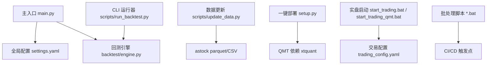
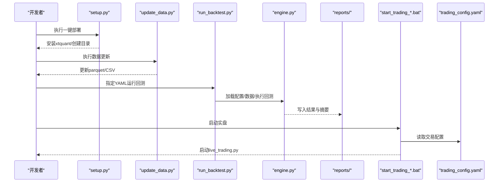
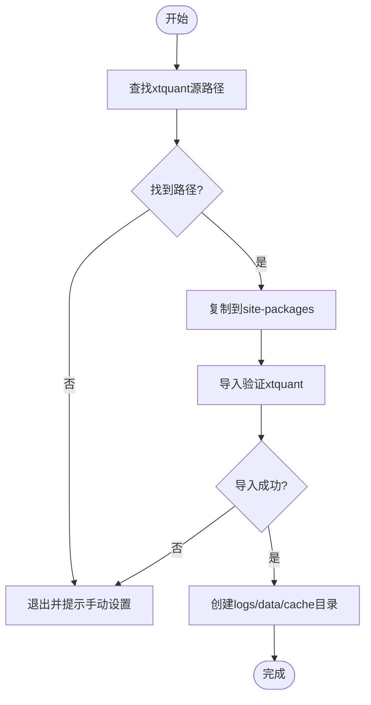
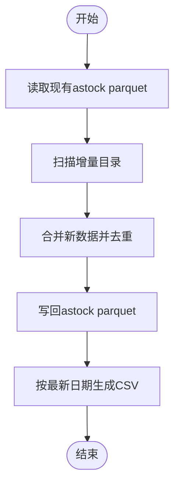
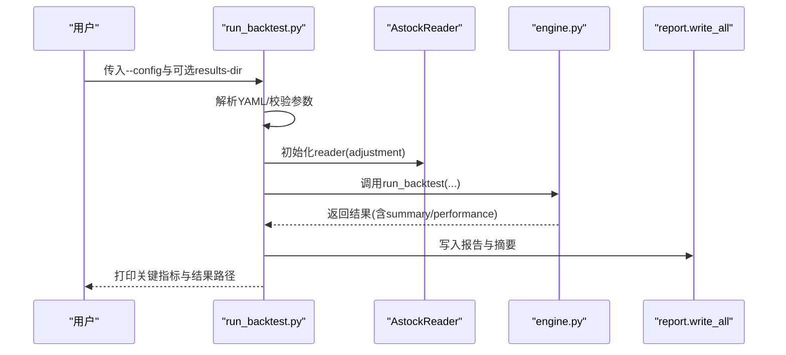
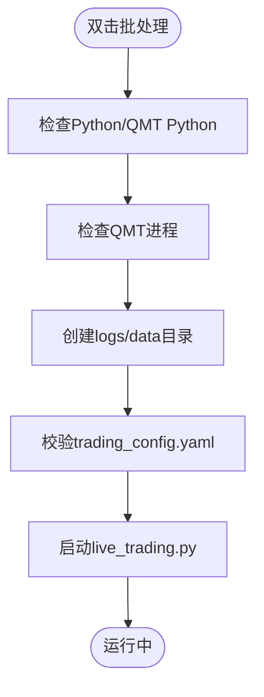
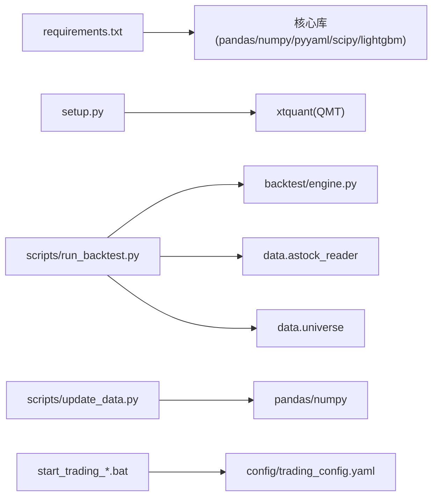

# 运维自动化

<cite>
**本文引用的文件**   
- [main.py](file://main.py)
- [requirements.txt](file://requirements.txt)
- [setup.py](file://setup.py)
- [start_trading.bat](file://start_trading.bat)
- [start_trading_qmt.bat](file://start_trading_qmt.bat)
- [scripts/update_data.py](file://scripts/update_data.py)
- [scripts/run_backtest.py](file://scripts/run_backtest.py)
- [config/settings.yaml](file://config/settings.yaml)
- [config/trading_config.yaml](file://config/trading_config.yaml)
- [backtest/engine.py](file://backtest/engine.py)
- [scripts/update_data.bat](file://scripts/update_data.bat)
- [scripts/run_batch_ic_test.bat](file://scripts/run_batch_ic_test.bat)
- [scripts/run_order_test.bat](file://scripts/run_order_test.bat)
</cite>

## 目录
1. [简介](#简介)
2. [项目结构](#项目结构)
3. [核心组件](#核心组件)
4. [架构总览](#架构总览)
5. [详细组件分析](#详细组件分析)
6. [依赖关系分析](#依赖关系分析)
7. [性能考虑](#性能考虑)
8. [故障排查指南](#故障排查指南)
9. [结论](#结论)
10. [附录](#附录)

## 简介
本指南面向 QuantLab 的运维自动化，覆盖以下目标：
- 部署脚本开发：一键部署、版本管理、依赖检查、环境验证
- 监控脚本编写：健康检查、性能监控、日志轮转、自动清理
- 维护任务自动化：数据更新、模型重训练、配置同步、证书更新
- CI/CD 流水线：代码检查、单元测试、集成测试、自动化部署
- 容器化部署：Docker 镜像构建、编排配置、服务发现、负载均衡

本指南基于仓库现有脚本与配置进行系统化梳理，并给出可落地的自动化方案与最佳实践。

## 项目结构
QuantLab 采用“策略工程 + 回测引擎 + 数据管线 + 实盘对接”的分层组织方式：
- 根入口与全局配置：main.py、settings.yaml、requirements.txt
- 回测与报告：backtest/*（引擎、执行、报告）、scripts/run_backtest.py
- 数据更新：scripts/update_data.py、update_data.bat
- 实盘启动：start_trading.bat、start_trading_qmt.bat、trading_config.yaml
- 环境初始化：setup.py（QMT 依赖拷贝与目录创建）
- 批处理与测试：run_batch_ic_test.bat、run_order_test.bat

图表来源 
- [main.py:1-104](file://main.py#L1-L104)
- [config/settings.yaml:1-69](file://config/settings.yaml#L1-L69)
- [backtest/engine.py:434-578](file://backtest/engine.py#L434-L578)
- [scripts/run_backtest.py:1-132](file://scripts/run_backtest.py#L1-L132)
- [scripts/update_data.py:1-135](file://scripts/update_data.py#L1-L135)
- [setup.py:1-82](file://setup.py#L1-L82)
- [config/trading_config.yaml:1-62](file://config/trading_config.yaml#L1-L62)

章节来源
- [main.py:1-104](file://main.py#L1-L104)
- [config/settings.yaml:1-69](file://config/settings.yaml#L1-L69)
- [requirements.txt:1-29](file://requirements.txt#L1-L29)

## 核心组件
- 一键部署与环境初始化
  - setup.py：查找 QMT 的 xtquant 路径、复制到系统 Python site-packages、导入验证、创建 logs/data/cache 目录
- 数据更新与维护
  - scripts/update_data.py：增量合并 astock parquet、按最新日期生成 CSV；配合 update_data.bat 一键执行
- 回测与报告
  - scripts/run_backtest.py：解析 YAML 配置、加载股票池、读取 astock 数据、调用 backtest/engine.py 执行回测、输出报告到 reports
  - backtest/engine.py：聚合诊断指标、计算绩效、记录样本期与数据覆盖信息
- 实盘启动
  - start_trading.bat/start_trading_qmt.bat：检查 Python/QMT、创建日志目录、校验配置文件、启动 live_trading.py（或 QMT Python 解释器）
  - config/trading_config.yaml：账户、风控、委托、调度、通知、数据源与策略参数

章节来源
- [setup.py:1-82](file://setup.py#L1-L82)
- [scripts/update_data.py:1-135](file://scripts/update_data.py#L1-L135)
- [scripts/run_backtest.py:1-132](file://scripts/run_backtest.py#L1-L132)
- [backtest/engine.py:434-578](file://backtest/engine.py#L434-L578)
- [start_trading.bat:1-51](file://start_trading.bat#L1-L51)
- [start_trading_qmt.bat:1-66](file://start_trading_qmt.bat#L1-L66)
- [config/trading_config.yaml:1-62](file://config/trading_config.yaml#L1-L62)

## 架构总览
下图展示从配置到回测/实盘的端到端流程，以及数据更新与一键部署的支撑作用。

图表来源 
- [setup.py:1-82](file://setup.py#L1-L82)
- [scripts/update_data.py:1-135](file://scripts/update_data.py#L1-L135)
- [scripts/run_backtest.py:1-132](file://scripts/run_backtest.py#L1-L132)
- [backtest/engine.py:434-578](file://backtest/engine.py#L434-L578)
- [start_trading.bat:1-51](file://start_trading.bat#L1-L51)
- [start_trading_qmt.bat:1-66](file://start_trading_qmt.bat#L1-L66)
- [config/trading_config.yaml:1-62](file://config/trading_config.yaml#L1-L62)

## 详细组件分析

### 一键部署与环境验证（setup.py）
- 功能要点
  - 自动探测 QMT 安装路径下的 xtquant 包位置
  - 将 xtquant 复制到当前 Python 环境的 site-packages
  - 导入验证 xtquant 模块可用性
  - 创建 logs、data、data/cache 目录
- 适用场景
  - 新机器初始化、CI 节点准备、本地复现实盘环境
- 风险与注意
  - 路径硬编码需与实际安装一致
  - 覆盖已有目录前需确认权限与备份策略

图表来源 
- [setup.py:1-82](file://setup.py#L1-L82)

章节来源
- [setup.py:1-82](file://setup.py#L1-L82)

### 数据更新与维护（scripts/update_data.py）
- 功能要点
  - 增量扫描“增量”目录，合并新的 stock_daily.parquet
  - 去重与排序后写回 astock parquet
  - 基于最新交易日生成 CSV（包含 PB、PE_TTM、ROE、流通市值等字段）
- 适用场景
  - 每日收盘后数据刷新、因子库更新前的数据准备
- 性能与可靠性
  - 使用 pandas 批量操作，注意内存占用
  - 异常捕获避免单批次失败影响整体

图表来源 
- [scripts/update_data.py:1-135](file://scripts/update_data.py#L1-L135)

章节来源
- [scripts/update_data.py:1-135](file://scripts/update_data.py#L1-L135)

### 回测运行器与引擎（scripts/run_backtest.py 与 backtest/engine.py）
- run_backtest.py
  - 解析 YAML 配置（策略、数据、执行、选股池）
  - 加载 universe 与 astock reader
  - 调用 engine.run_backtest 执行回测
  - 统一输出报告至 reports 目录
- engine.py
  - 汇总每日诊断、未成交订单统计
  - 计算绩效指标（收益、回撤、夏普等）
  - 记录数据覆盖度、去重情况、WAL 检测等元信息

图表来源 
- [scripts/run_backtest.py:1-132](file://scripts/run_backtest.py#L1-L132)
- [backtest/engine.py:434-578](file://backtest/engine.py#L434-L578)

章节来源
- [scripts/run_backtest.py:1-132](file://scripts/run_backtest.py#L1-L132)
- [backtest/engine.py:434-578](file://backtest/engine.py#L434-L578)

### 实盘启动与配置（start_trading_*.bat 与 trading_config.yaml）
- start_trading.bat
  - 检查 Python 是否可用
  - 检测 miniQMT 进程是否存在
  - 创建日志与数据目录
  - 校验 trading_config.yaml 存在后启动 live_trading.py
- start_trading_qmt.bat
  - 使用 QMT 内置 Python 解释器运行
  - 支持自动拉起 QMT 客户端
  - 同样校验配置文件与目录
- trading_config.yaml
  - 账户、资金、风控阈值、委托参数、调度时间、通知渠道、数据源路径、策略参数

图表来源 
- [start_trading.bat:1-51](file://start_trading.bat#L1-L51)
- [start_trading_qmt.bat:1-66](file://start_trading_qmt.bat#L1-L66)
- [config/trading_config.yaml:1-62](file://config/trading_config.yaml#L1-L62)

章节来源
- [start_trading.bat:1-51](file://start_trading.bat#L1-L51)
- [start_trading_qmt.bat:1-66](file://start_trading_qmt.bat#L1-L66)
- [config/trading_config.yaml:1-62](file://config/trading_config.yaml#L1-L62)

### 主入口与全局配置（main.py 与 settings.yaml）
- main.py
  - 回测模式入口，支持策略选择与命令行参数
  - 动态添加项目路径以导入 research 子模块
- settings.yaml
  - 全局项目信息、数据路径、缓存开关、回测默认参数、日志级别与轮转、因子预处理、策略宇宙、实盘开关

章节来源
- [main.py:1-104](file://main.py#L1-L104)
- [config/settings.yaml:1-69](file://config/settings.yaml#L1-L69)

## 依赖关系分析
- 运行时依赖
  - requirements.txt 声明核心库（pandas、numpy、pyyaml、scipy、lightgbm 等）
  - QMT 依赖 xtquant（通过 setup.py 复制安装）
- 模块依赖
  - run_backtest.py 依赖 backtest/engine.py、data.astock_reader、data.universe
  - update_data.py 依赖 pandas/numpy，读写 parquet/csv
  - 实盘启动依赖 trading_config.yaml 与 live_trading.py（由批处理调用）

图表来源 
- [requirements.txt:1-29](file://requirements.txt#L1-L29)
- [setup.py:1-82](file://setup.py#L1-L82)
- [scripts/run_backtest.py:1-132](file://scripts/run_backtest.py#L1-L132)
- [backtest/engine.py:434-578](file://backtest/engine.py#L434-L578)
- [scripts/update_data.py:1-135](file://scripts/update_data.py#L1-L135)
- [config/trading_config.yaml:1-62](file://config/trading_config.yaml#L1-L62)

章节来源
- [requirements.txt:1-29](file://requirements.txt#L1-L29)
- [setup.py:1-82](file://setup.py#L1-L82)
- [scripts/run_backtest.py:1-132](file://scripts/run_backtest.py#L1-L132)
- [scripts/update_data.py:1-135](file://scripts/update_data.py#L1-L135)
- [config/trading_config.yaml:1-62](file://config/trading_config.yaml#L1-L62)

## 性能考虑
- 数据更新
  - 增量合并时优先按 trade_date 去重，减少重复写入
  - 大文件读写建议使用 pyarrow 引擎（已在 update_data.py 中使用）
- 回测引擎
  - 合理设置 initial_cash、滑点与佣金，避免极端参数导致数值不稳定
  - 关注 engine.py 中的样本期警告与数据覆盖统计，确保回测有效性
- 日志与存储
  - 根据 settings.yaml 的日志配置控制轮转大小与保留数量，防止磁盘占满
  - 定期清理 data/cache 与 reports 历史产物

[本节为通用建议，不直接分析具体文件]

## 故障排查指南
- 常见错误与定位
  - Python 未安装或未加入 PATH：start_trading.bat 会显式检查并提示
  - QMT 未运行：批处理脚本检测 XtMiniQmt.exe 进程，必要时引导启动
  - 配置文件缺失：若缺少 trading_config.yaml，启动将中止
  - xtquant 导入失败：setup.py 已做导入验证，失败时需核对路径与权限
- 日志与诊断
  - 查看 logs 目录下的运行日志
  - 使用 run_order_test.bat 查看订单测试日志
  - 使用 run_batch_ic_test.bat 执行因子 IC 测试并查看 reports 输出
- 数据问题
  - 检查 astock parquet 最新日期与行数
  - 确认 CSV 生成是否包含必要字段（PB、PE_TTM、ROE、circ_mv 等）

章节来源
- [start_trading.bat:1-51](file://start_trading.bat#L1-L51)
- [start_trading_qmt.bat:1-66](file://start_trading_qmt.bat#L1-L66)
- [scripts/run_order_test.bat:1-24](file://scripts/run_order_test.bat#L1-L24)
- [scripts/run_batch_ic_test.bat:1-17](file://scripts/run_batch_ic_test.bat#L1-L17)
- [scripts/update_data.py:1-135](file://scripts/update_data.py#L1-L135)
- [config/trading_config.yaml:1-62](file://config/trading_config.yaml#L1-L62)

## 结论
QuantLab 已具备完善的一键部署、数据更新、回测运行与实盘启动能力。通过批处理脚本与 YAML 配置，可实现快速环境搭建与稳定运行。建议在现有基础上引入 CI/CD 与容器化，进一步提升自动化程度与可移植性。

[本节为总结性内容，不直接分析具体文件]

## 附录

### 部署脚本开发指南（一键部署、版本管理、依赖检查、环境验证）
- 一键部署
  - 使用 setup.py 完成 QMT 依赖安装与目录初始化
  - 结合 update_data.bat 一键更新数据
- 版本管理
  - 在 settings.yaml 中维护 project.version
  - 在回测报告中记录 config_hash/universe_hash/data_hash，便于溯源
- 依赖检查
  - 在 CI 中执行 pip install -r requirements.txt
  - 对 xtquant 进行导入验证（参考 setup.py）
- 环境验证
  - 运行 run_backtest.py 的最小用例校验数据与引擎
  - 使用 start_trading_qmt.bat 验证 QMT 连接与配置

章节来源
- [setup.py:1-82](file://setup.py#L1-L82)
- [config/settings.yaml:1-69](file://config/settings.yaml#L1-L69)
- [scripts/run_backtest.py:1-132](file://scripts/run_backtest.py#L1-L132)
- [scripts/update_data.bat:1-15](file://scripts/update_data.bat#L1-L15)

### 监控脚本编写指南（健康检查、性能监控、日志轮转、自动清理）
- 健康检查
  - 检查 QMT 进程、Python 版本、配置文件存在性
  - 定时调用 run_backtest.py 最小用例，验证数据可读与引擎可用
- 性能监控
  - 采集 engine.py 输出的 performance 指标（年化收益、最大回撤、夏普、交易次数）
  - 监控 astock parquet 文件大小与最新日期
- 日志轮转
  - 依据 settings.yaml 的 logging 配置，限制文件大小与备份数量
- 自动清理
  - 定期清理 data/cache 与 reports 历史产物，释放磁盘空间

[本节为通用建议，不直接分析具体文件]

### 维护任务自动化（数据更新、模型重训练、配置同步、证书更新）
- 数据更新
  - 使用 scripts/update_data.py 与 update_data.bat 实现每日增量更新
- 模型重训练
  - 在 CI 中触发 lightgbm/xgboost 训练脚本，产出模型工件并归档
- 配置同步
  - 使用 Git 管理 settings.yaml 与 trading_config.yaml，变更通过 PR 审核
- 证书更新
  - 将证书纳入密钥管理服务，CI 拉取并注入到运行环境

[本节为通用建议，不直接分析具体文件]

### CI/CD 流水线（代码检查、单元测试、集成测试、自动化部署）
- 代码检查
  - 静态检查（flake8/black/mypy），格式与规范校验
- 单元测试
  - 针对 factors、backtest、data 模块编写单元测试
- 集成测试
  - 运行 run_backtest.py 最小用例，校验数据与报告输出
- 自动化部署
  - 打包 artifacts（模型、报告、配置快照）
  - 推送 Docker 镜像（见下一节）

[本节为通用建议，不直接分析具体文件]

### 容器化部署（Docker 镜像构建、编排配置、服务发现、负载均衡）
- 镜像构建
  - 基于 Python 基础镜像，安装 requirements.txt 依赖
  - 复制项目代码与配置文件，暴露端口（如需 Web 服务）
- 编排配置
  - 使用 docker-compose 或 Kubernetes 定义服务、环境变量、卷挂载（logs/data/reports）
- 服务发现
  - 在 K8s 中通过 Service/Ingress 暴露 API
- 负载均衡
  - 多副本部署，配合 Ingress 或 Service Mesh 实现流量分发与健康检查

[本节为通用建议，不直接分析具体文件]