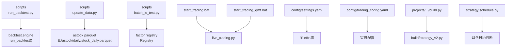
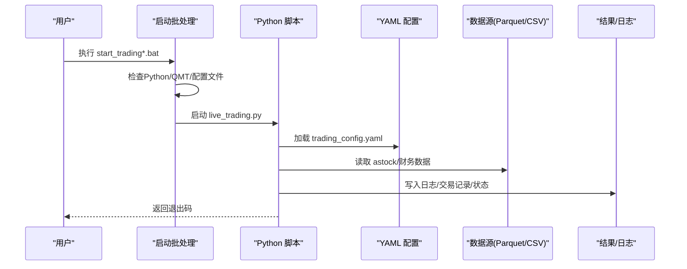
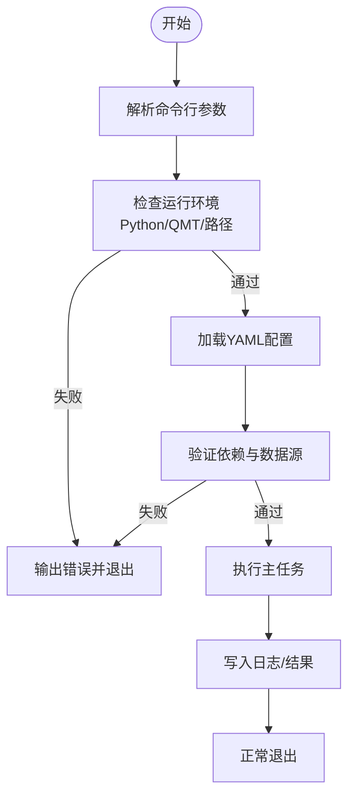
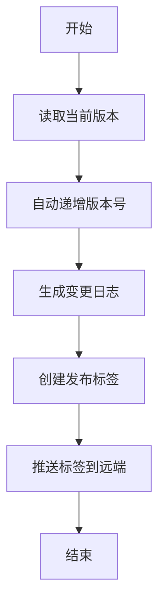
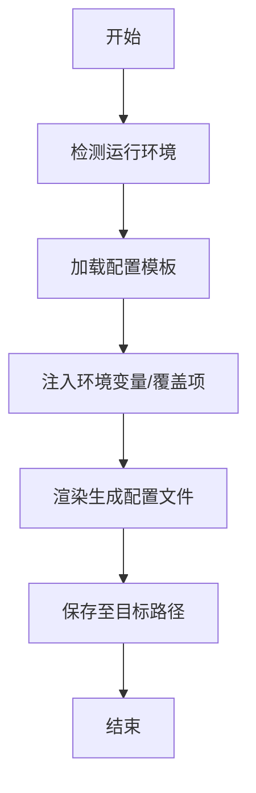
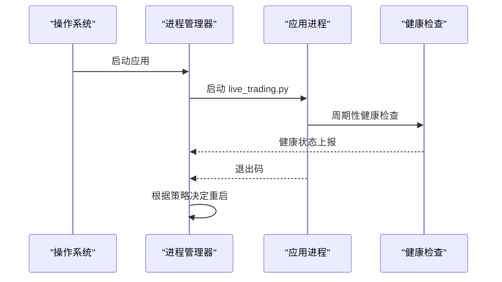
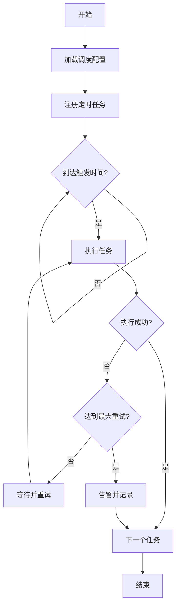
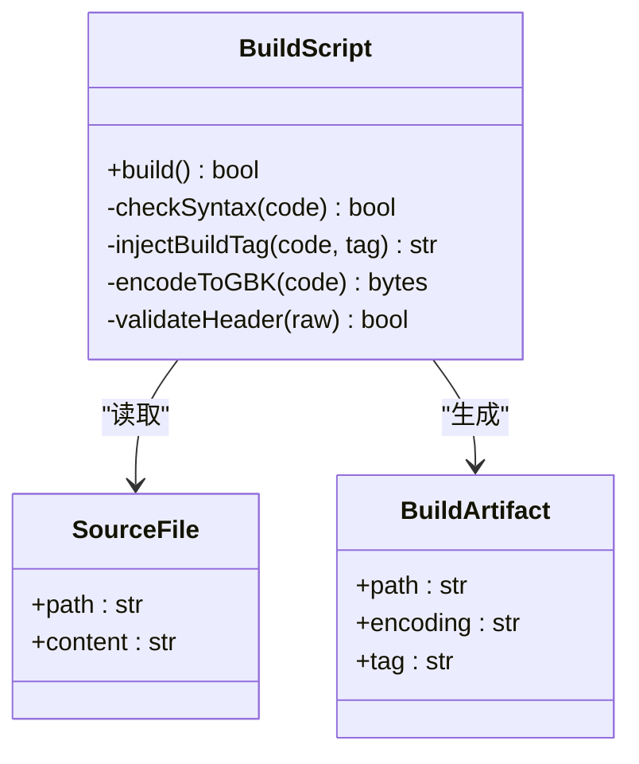
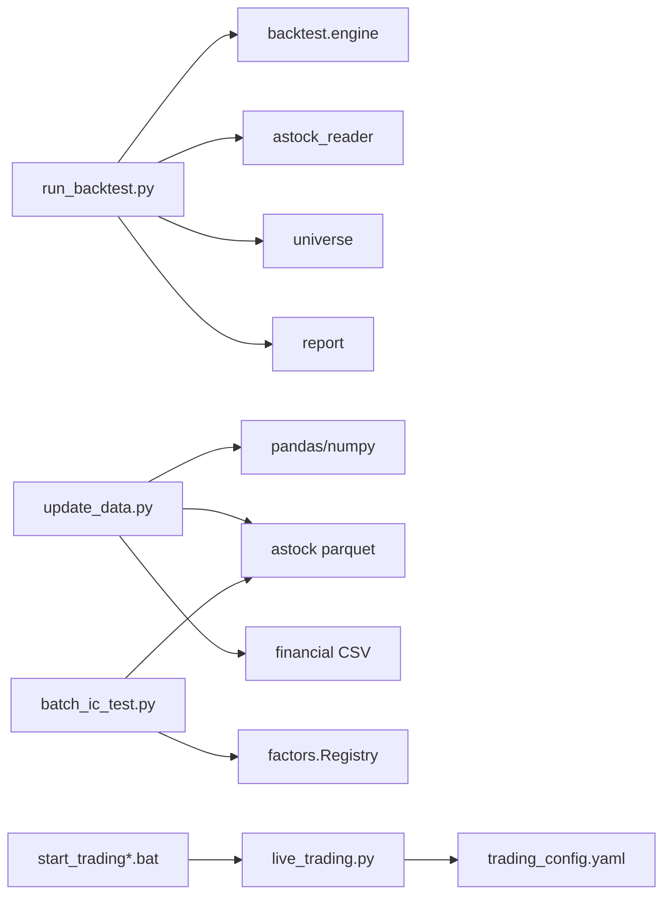

# 部署脚本开发

<cite>
**本文引用的文件**   
- [scripts/run_backtest.py](file://scripts/run_backtest.py)
- [scripts/update_data.py](file://scripts/update_data.py)
- [scripts/batch_ic_test.py](file://scripts/batch_ic_test.py)
- [start_trading.bat](file://start_trading.bat)
- [start_trading_qmt.bat](file://start_trading_qmt.bat)
- [config/settings.yaml](file://config/settings.yaml)
- [config/trading_config.yaml](file://config/trading_config.yaml)
- [projects/Project_10_价值小盘V2/build.py](file://projects/Project_10_价值小盘V2/build.py)
- [strategy/schedule.py](file://strategy/schedule.py)
- [miniQMT实盘对接_生产级完善方案.md](file://miniQMT实盘对接_生产级完善方案.md)
</cite>

## 目录
1. [简介](#简介)
2. [项目结构](#项目结构)
3. [核心组件](#核心组件)
4. [架构总览](#架构总览)
5. [详细组件分析](#详细组件分析)
6. [依赖关系分析](#依赖关系分析)
7. [性能考虑](#性能考虑)
8. [故障排查指南](#故障排查指南)
9. [结论](#结论)
10. [附录](#附录)

## 简介
本指南面向 QuantLab 的部署与运维，聚焦以下目标：
- 一键部署脚本：参数解析、环境检查、依赖验证、错误处理
- 版本管理脚本：版本号自动递增、变更日志生成、发布标签管理
- 配置管理脚本：环境变量注入、配置文件模板化、多环境切换
- 启动脚本：进程守护、日志输出、健康检查、自动重启
- 批量任务调度：定时任务配置、任务依赖管理、失败重试机制

本仓库已具备若干脚本与配置样例，可作为构建统一部署体系的基线。

## 项目结构
QuantLab 的脚本与配置分布在 scripts、config、projects 等目录中，涵盖回测运行、数据更新、批量因子测试、启动批处理以及策略构建产物。下图给出与本指南相关的结构与职责概览。

图表来源
- [scripts/run_backtest.py:1-132](file://scripts/run_backtest.py#L1-L132)
- [scripts/update_data.py:1-135](file://scripts/update_data.py#L1-L135)
- [scripts/batch_ic_test.py:1-266](file://scripts/batch_ic_test.py#L1-L266)
- [start_trading.bat:1-51](file://start_trading.bat#L1-L51)
- [start_trading_qmt.bat:1-66](file://start_trading_qmt.bat#L1-L66)
- [config/settings.yaml:1-69](file://config/settings.yaml#L1-L69)
- [config/trading_config.yaml:1-62](file://config/trading_config.yaml#L1-L62)
- [projects/Project_10_价值小盘V2/build.py:1-69](file://projects/Project_10_价值小盘V2/build.py#L1-L69)
- [strategy/schedule.py:1-47](file://strategy/schedule.py#L1-L47)

章节来源
- [scripts/run_backtest.py:1-132](file://scripts/run_backtest.py#L1-L132)
- [scripts/update_data.py:1-135](file://scripts/update_data.py#L1-L135)
- [scripts/batch_ic_test.py:1-266](file://scripts/batch_ic_test.py#L1-L266)
- [start_trading.bat:1-51](file://start_trading.bat#L1-L51)
- [start_trading_qmt.bat:1-66](file://start_trading_qmt.bat#L1-L66)
- [config/settings.yaml:1-69](file://config/settings.yaml#L1-L69)
- [config/trading_config.yaml:1-62](file://config/trading_config.yaml#L1-L62)
- [projects/Project_10_价值小盘V2/build.py:1-69](file://projects/Project_10_价值小盘V2/build.py#L1-L69)
- [strategy/schedule.py:1-47](file://strategy/schedule.py#L1-L47)

## 核心组件
- 回测运行器（scripts/run_backtest.py）
  - 使用 argparse 解析 --config、--results-dir 等参数
  - 加载 YAML 配置，校验 data.adjustment 取值
  - 初始化数据读取器与股票池，执行回测并输出报告
- 数据更新器（scripts/update_data.py）
  - 增量合并 astock parquet 与重新生成 CSV
  - 日期归一化、去重、排序与落盘
- 批量 IC 测试（scripts/batch_ic_test.py）
  - 从因子注册表加载 alpha101/gtja191 因子
  - 计算日度 IC 与 ICIR，输出汇总报告
- 启动批处理（start_trading.bat / start_trading_qmt.bat）
  - 检查 Python/QMT 环境与配置文件
  - 创建日志目录并启动 live_trading.py
- 构建器（projects/Project_10_价值小盘V2/build.py）
  - 语法检查、禁止 3.6+ 新语法、注入 BUILD_TAG、GBK 编码转换与产物校验
- 调仓日历（strategy/schedule.py）
  - 周/月/季度首个交易日判定逻辑

章节来源
- [scripts/run_backtest.py:1-132](file://scripts/run_backtest.py#L1-L132)
- [scripts/update_data.py:1-135](file://scripts/update_data.py#L1-L135)
- [scripts/batch_ic_test.py:1-266](file://scripts/batch_ic_test.py#L1-L266)
- [start_trading.bat:1-51](file://start_trading.bat#L1-L51)
- [start_trading_qmt.bat:1-66](file://start_trading_qmt.bat#L1-L66)
- [projects/Project_10_价值小盘V2/build.py:1-69](file://projects/Project_10_价值小盘V2/build.py#L1-L69)
- [strategy/schedule.py:1-47](file://strategy/schedule.py#L1-L47)

## 架构总览
下图展示“一键部署”在 QuantLab 中的端到端流程：从环境检查、配置加载、依赖验证到任务执行与结果输出。

图表来源
- [start_trading.bat:1-51](file://start_trading.bat#L1-L51)
- [start_trading_qmt.bat:1-66](file://start_trading_qmt.bat#L1-L66)
- [config/trading_config.yaml:1-62](file://config/trading_config.yaml#L1-L62)
- [scripts/update_data.py:1-135](file://scripts/update_data.py#L1-L135)

## 详细组件分析

### 一键部署脚本编写指南
- 参数解析
  - 参考 scripts/run_backtest.py 的 argparse 用法，定义必需与可选参数，提供默认值与帮助信息
  - 对关键路径参数进行绝对路径规范化与存在性校验
- 环境检查
  - 参考 start_trading*.bat，检查 Python/QMT 可执行文件是否存在、是否加入 PATH
  - 检查必要目录（logs、data）是否存在，不存在则创建
- 依赖验证
  - 在 Python 侧通过 import 或模块可用性检测；对缺失依赖给出明确提示
  - 对外部服务（如 miniQMT）进程存在性进行检查
- 错误处理
  - 对异常捕获并输出结构化日志，区分警告与致命错误
  - 设置合理的退出码，便于上层编排系统识别

图表来源
- [scripts/run_backtest.py:1-132](file://scripts/run_backtest.py#L1-L132)
- [start_trading.bat:1-51](file://start_trading.bat#L1-L51)
- [start_trading_qmt.bat:1-66](file://start_trading_qmt.bat#L1-L66)

章节来源
- [scripts/run_backtest.py:1-132](file://scripts/run_backtest.py#L1-L132)
- [start_trading.bat:1-51](file://start_trading.bat#L1-L51)
- [start_trading_qmt.bat:1-66](file://start_trading_qmt.bat#L1-L66)

### 版本管理脚本
- 版本号自动递增
  - 建议基于 Git tag 或配置文件（settings.yaml 的 project.version）实现语义化版本递增
  - 在构建阶段将版本号注入产物（类似 build.py 的 BUILD_TAG 注入）
- 变更日志生成
  - 基于 Git log 按版本区间生成 CHANGELOG，包含提交摘要、作者、影响范围
- 发布标签管理
  - 自动化打 tag、推送至远程仓库，并触发 CI/CD 流水线

[本节为概念性说明，不直接分析具体文件]

### 配置管理脚本
- 环境变量注入
  - 在启动前将环境变量注入到运行时上下文，避免硬编码路径与密钥
- 配置文件模板化
  - 使用 Jinja2 或类似工具渲染模板，生成不同环境的配置文件
- 多环境配置切换
  - 通过命令行参数或环境变量选择 dev/test/prod 配置集

[本节为概念性说明，不直接分析具体文件]

### 启动脚本开发
- 进程守护
  - 使用系统级守护（Windows Service/Supervisor）或自实现心跳监控
- 日志输出
  - 统一日志格式与轮转策略，区分 INFO/WARN/ERROR
- 健康检查
  - 暴露健康检查接口或定期自检，结合告警机制
- 自动重启
  - 根据退出码与错误类型决定是否重启，限制重启频率

图表来源
- [start_trading.bat:1-51](file://start_trading.bat#L1-L51)
- [start_trading_qmt.bat:1-66](file://start_trading_qmt.bat#L1-L66)
- [miniQMT实盘对接_生产级完善方案.md:1131-1344](file://miniQMT实盘对接_生产级完善方案.md#L1131-L1344)

章节来源
- [start_trading.bat:1-51](file://start_trading.bat#L1-L51)
- [start_trading_qmt.bat:1-66](file://start_trading_qmt.bat#L1-L66)
- [miniQMT实盘对接_生产级完善方案.md:1131-1344](file://miniQMT实盘对接_生产级完善方案.md#L1131-L1344)

### 批量任务调度
- 定时任务配置
  - 参考 config/trading_config.yaml 的 schedule 字段，定义盘前/开盘/午后/风控/尾盘任务时间
- 任务依赖管理
  - 上游任务成功再执行下游，失败时阻断或降级
- 失败重试机制
  - 指数退避重试、最大重试次数、幂等性与补偿逻辑

图表来源
- [config/trading_config.yaml:1-62](file://config/trading_config.yaml#L1-L62)
- [strategy/schedule.py:1-47](file://strategy/schedule.py#L1-L47)

章节来源
- [config/trading_config.yaml:1-62](file://config/trading_config.yaml#L1-L62)
- [strategy/schedule.py:1-47](file://strategy/schedule.py#L1-L47)

### 构建与版本注入（示例）
- 构建器（build.py）演示了源码校验、语法限制、版本标记注入、编码转换与产物校验的完整流程
- 可复用该模式扩展到其他项目的构建与发布

图表来源
- [projects/Project_10_价值小盘V2/build.py:1-69](file://projects/Project_10_价值小盘V2/build.py#L1-L69)

章节来源
- [projects/Project_10_价值小盘V2/build.py:1-69](file://projects/Project_10_价值小盘V2/build.py#L1-L69)

## 依赖关系分析
- 脚本间依赖
  - run_backtest.py 依赖 backtest.engine、data.astock_reader、data.universe、backtest.report
  - update_data.py 依赖 pandas/numpy，读写 astock parquet 与 CSV
  - batch_ic_test.py 依赖 backtest.factors.registry，读取 astock parquet
- 配置依赖
  - settings.yaml 提供全局路径与默认参数
  - trading_config.yaml 提供实盘账户、风控、调度与通知配置

图表来源
- [scripts/run_backtest.py:1-132](file://scripts/run_backtest.py#L1-L132)
- [scripts/update_data.py:1-135](file://scripts/update_data.py#L1-L135)
- [scripts/batch_ic_test.py:1-266](file://scripts/batch_ic_test.py#L1-L266)
- [start_trading.bat:1-51](file://start_trading.bat#L1-L51)
- [start_trading_qmt.bat:1-66](file://start_trading_qmt.bat#L1-L66)
- [config/trading_config.yaml:1-62](file://config/trading_config.yaml#L1-L62)

章节来源
- [scripts/run_backtest.py:1-132](file://scripts/run_backtest.py#L1-L132)
- [scripts/update_data.py:1-135](file://scripts/update_data.py#L1-L135)
- [scripts/batch_ic_test.py:1-266](file://scripts/batch_ic_test.py#L1-L266)
- [start_trading.bat:1-51](file://start_trading.bat#L1-L51)
- [start_trading_qmt.bat:1-66](file://start_trading_qmt.bat#L1-L66)
- [config/trading_config.yaml:1-62](file://config/trading_config.yaml#L1-L62)

## 性能考虑
- 数据读取优化
  - 使用 Parquet 列式存储与分区，减少 IO 与内存占用
  - 增量更新时仅合并新增日期，避免全量重建
- 并行与并发
  - 批量任务可使用进程池或线程池提升吞吐（如 update_astock.py 的 ProcessPoolExecutor 用法）
- 缓存与过期
  - 启用数据缓存与 TTL，降低重复计算与 IO 压力
- 日志与监控
  - 控制日志级别与滚动策略，避免磁盘膨胀
  - 关键指标（IC、回撤、委托成功率）实时采集与告警

[本节为通用指导，不直接分析具体文件]

## 故障排查指南
- 常见问题定位
  - 环境缺失：检查 Python/QMT 安装与 PATH
  - 配置错误：核对 trading_config.yaml 的路径、账号、风控阈值
  - 数据异常：确认 astock parquet 最新日期与字段完整性
- 日志与诊断
  - 查看 logs 目录下的交易日志与错误堆栈
  - 对关键步骤增加断言与中间结果输出
- 恢复与自愈
  - 未成交订单自动撤单与状态恢复
  - 失败任务的重试与降级策略

章节来源
- [start_trading.bat:1-51](file://start_trading.bat#L1-L51)
- [start_trading_qmt.bat:1-66](file://start_trading_qmt.bat#L1-L66)
- [scripts/update_data.py:1-135](file://scripts/update_data.py#L1-L135)
- [miniQMT实盘对接_生产级完善方案.md:1131-1344](file://miniQMT实盘对接_生产级完善方案.md#L1131-L1344)

## 结论
通过统一的参数解析、环境检查、依赖验证与错误处理，配合版本管理、配置模板化与多环境切换，以及健壮的启动守护与调度重试机制，QuantLab 可实现稳定、可追溯、可扩展的一键部署体系。现有脚本与配置提供了良好基线，建议在 CI/CD 中集成上述能力，形成端到端的自动化流水线。

[本节为总结性内容，不直接分析具体文件]

## 附录
- 快速命令参考
  - 回测运行：python -m scripts.run_backtest --config config/atr_lowvol_fw.yaml
  - 数据更新：python scripts/update_data.py
  - 批量 IC：python scripts/batch_ic_test.py
  - 启动实盘：start_trading.bat 或 start_trading_qmt.bat
- 配置要点
  - settings.yaml：全局路径、回测默认参数、日志与因子预处理
  - trading_config.yaml：账户、风控、调度、通知与策略权重

章节来源
- [scripts/run_backtest.py:1-132](file://scripts/run_backtest.py#L1-L132)
- [scripts/update_data.py:1-135](file://scripts/update_data.py#L1-L135)
- [scripts/batch_ic_test.py:1-266](file://scripts/batch_ic_test.py#L1-L266)
- [config/settings.yaml:1-69](file://config/settings.yaml#L1-L69)
- [config/trading_config.yaml:1-62](file://config/trading_config.yaml#L1-L62)