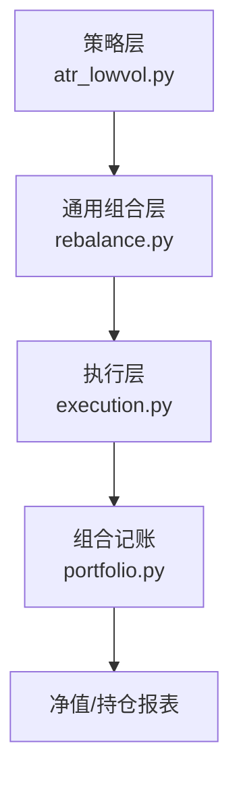
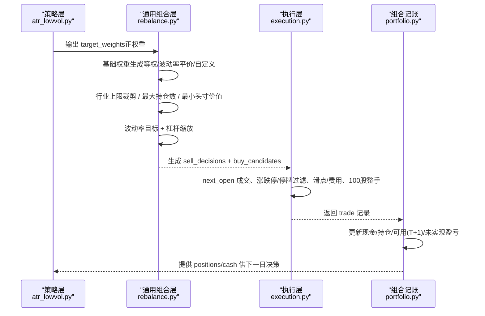
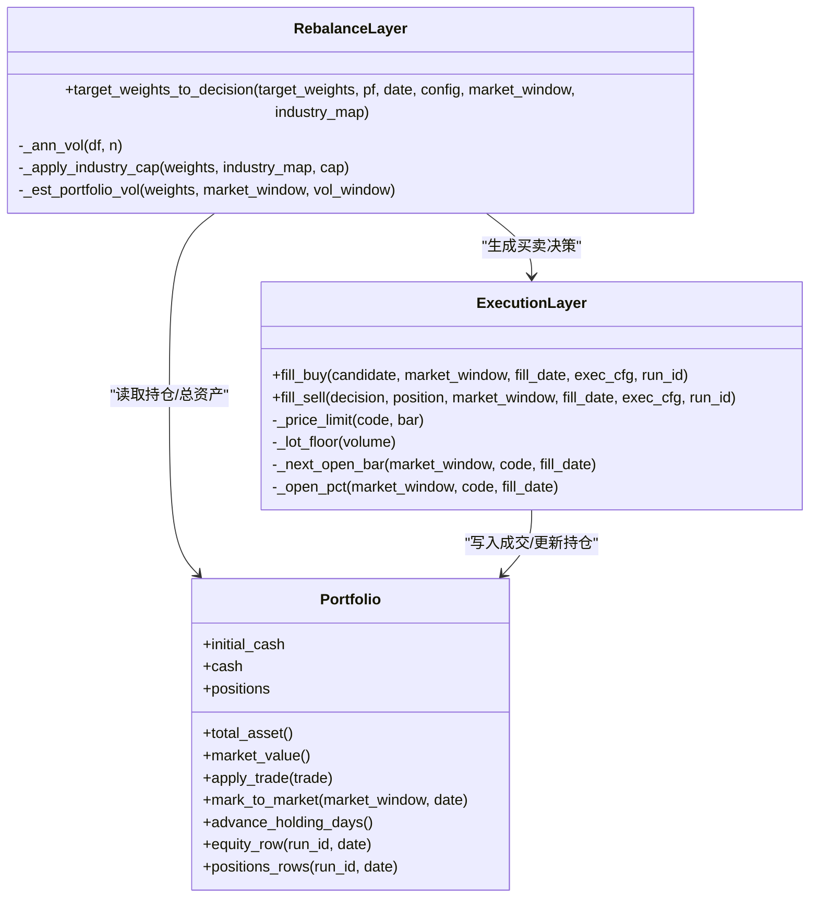
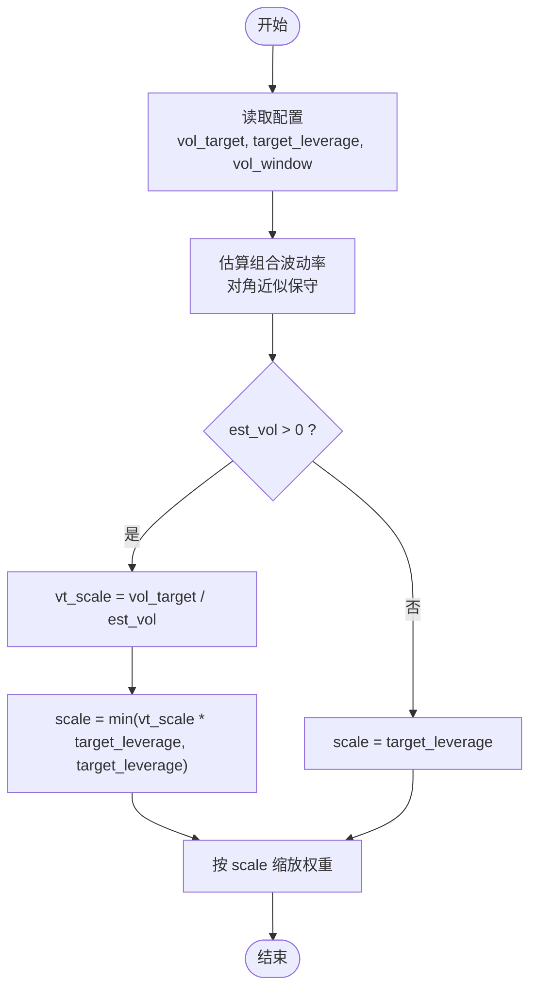
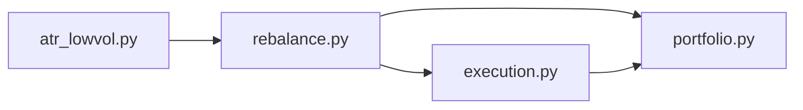

# 仓位管理策略

<cite>
**本文引用的文件**   
- [backtest/rebalance.py](file://backtest/rebalance.py)
- [backtest/execution.py](file://backtest/execution.py)
- [backtest/portfolio.py](file://backtest/portfolio.py)
- [strategy/atr_lowvol.py](file://strategy/atr_lowvol.py)
- [config/settings.yaml](file://config/settings.yaml)
- [config/trading_config.yaml](file://config/trading_config.yaml)
- [config/atr_lowvol_fw.yaml](file://config/atr_lowvol_fw.yaml)
- [config/atr_lowvol_fw_leveraged.yaml](file://config/atr_lowvol_fw_leveraged.yaml)
- [projects/Project_01_多因子IC小盘Alpha/config/strategy.yaml](file://projects/Project_01_多因子IC小盘Alpha/config/strategy.yaml)
</cite>

## 目录
1. [引言](#引言)
2. [项目结构](#项目结构)
3. [核心组件](#核心组件)
4. [架构总览](#架构总览)
5. [详细组件分析](#详细组件分析)
6. [依赖关系分析](#依赖关系分析)
7. [性能与流动性考量](#性能与流动性考量)
8. [故障排查指南](#故障排查指南)
9. [结论](#结论)
10. [附录：配置参数速查](#附录配置参数速查)

## 引言
本文件面向 QuantLab 的“仓位管理策略”，系统化说明以下能力：
- 单票仓位限制机制：最大持仓比例、最小交易单位、资金分配算法
- 行业集中度控制：行业权重上限、相关性分散思路、板块轮动限制
- 总仓位管理逻辑：动态仓位调整、市场状态判断、仓位缓冲机制
- 换手率限制实现：日换手率计算、调仓缩放算法、流动性约束
- 配置参数说明与实战示例，展示在不同市场环境下的优化方法

该文档以仓库中实际代码为依据，重点围绕 backtest/rebalance.py（目标权重到决策）、backtest/execution.py（成交执行与涨跌停/整数手约束）、backtest/portfolio.py（组合记账与T+1可用）以及策略层 atr_lowvol.py（target_weights 输出）展开。

## 项目结构
QuantLab 将“策略信号”和“仓位/风控执行”解耦：
- 策略层仅输出 target_weights（相对权重），不直接处理订单簿细节
- 通用组合层（rebalance）负责：等权/波动率平价/自定义权重、行业上限、最大持仓数、最小头寸价值、波动率目标与杠杆缩放
- 执行层（execution）负责：下一交易日开盘价成交、涨跌停/停牌过滤、滑点/佣金/印花税、A股100股整手约束
- 组合记账（portfolio）负责：现金、市值、未实现盈亏、T+1可用数量、日收益曲线

图表来源
- [strategy/atr_lowvol.py](file://strategy/atr_lowvol.py)
- [backtest/rebalance.py](file://backtest/rebalance.py)
- [backtest/execution.py](file://backtest/execution.py)
- [backtest/portfolio.py](file://backtest/portfolio.py)

章节来源
- [strategy/atr_lowvol.py:1-165](file://strategy/atr_lowvol.py#L1-L165)
- [backtest/rebalance.py:1-281](file://backtest/rebalance.py#L1-L281)
- [backtest/execution.py:1-204](file://backtest/execution.py#L1-L204)
- [backtest/portfolio.py:1-189](file://backtest/portfolio.py#L1-L189)

## 核心组件
- 通用组合层（rebalance）
  - 输入：target_weights（策略输出的正权重字典）、当前持仓、市场窗口数据、行业映射
  - 功能：基础权重生成（等权/波动率平价/自定义）、行业上限裁剪、最大持仓数裁剪、最小头寸价值过滤、波动率目标与杠杆缩放、生成 sell/buy 决策
- 执行层（execution）
  - 成交模型：next_open（T+1 开盘价成交）
  - 约束：涨跌停判定（主板/双创/北交所/ST）、停牌过滤、滑点、佣金/印花税、100股整手向下取整
- 组合记账（portfolio）
  - T+1 可用规则：当日买入不可当日卖出；次日 unfreeze available_volume
  - 每日盯市：更新 last_price 与 unrealized_pnl；支持停牌回退到最近收盘价
  - 输出：equity_curve.csv、positions.csv

章节来源
- [backtest/rebalance.py:101-260](file://backtest/rebalance.py#L101-L260)
- [backtest/execution.py:27-53](file://backtest/execution.py#L27-L53)
- [backtest/execution.py:95-204](file://backtest/execution.py#L95-L204)
- [backtest/portfolio.py:38-189](file://backtest/portfolio.py#L38-L189)

## 架构总览
下图展示了从策略信号到最终成交与记账的完整链路，并标注关键约束点。

图表来源
- [strategy/atr_lowvol.py:78-165](file://strategy/atr_lowvol.py#L78-L165)
- [backtest/rebalance.py:101-260](file://backtest/rebalance.py#L101-L260)
- [backtest/execution.py:95-204](file://backtest/execution.py#L95-L204)
- [backtest/portfolio.py:76-151](file://backtest/portfolio.py#L76-L151)

## 详细组件分析

### 单票仓位限制机制
- 最大持仓比例
  - 通过 industry_cap（行业上限）与 max_positions（最大持仓数）间接约束单票权重；当 position_sizing=custom 时，策略可显式给出不同幅度的权重，但仍会被 _normalize 归一化
  - 参考路径：[backtest/rebalance.py:150-177](file://backtest/rebalance.py#L150-L177)
- 最小交易单位
  - A股整手约束：100股为最小单位，成交量向下取整至100的倍数；若不足1手则放弃成交
  - 参考路径：[backtest/execution.py:48-53](file://backtest/execution.py#L48-L53)、[backtest/execution.py:176-184](file://backtest/execution.py#L176-L184)
- 资金分配算法
  - equal：等权分配
  - vol_parity：按 1/年化波动率 分配权重，低波高配
  - custom：按策略提供的绝对值权重归一化
  - 参考路径：[backtest/rebalance.py:141-153](file://backtest/rebalance.py#L141-L153)

章节来源
- [backtest/rebalance.py:141-177](file://backtest/rebalance.py#L141-L177)
- [backtest/execution.py:48-53](file://backtest/execution.py#L48-L53)
- [backtest/execution.py:176-184](file://backtest/execution.py#L176-L184)

### 行业集中度控制
- 行业权重上限
  - 对每个行业的总权重进行按比例压缩，确保不超过 industry_cap
  - 参考路径：[backtest/rebalance.py:64-82](file://backtest/rebalance.py#L64-L82)、[backtest/rebalance.py:155-163](file://backtest/rebalance.py#L155-L163)
- 相关性分散
  - 框架采用对角近似估计组合波动率（忽略相关性），保守估计避免过度集中；如需更精细的相关性约束可在上层扩展
  - 参考路径：[backtest/rebalance.py:85-98](file://backtest/rebalance.py#L85-L98)
- 板块轮动限制
  - 可通过 rebalance_freq 控制调仓频率，结合 stop_loss 与 momentum_gate 减少频繁切换；也可在策略层做行业中性或行业暴露监控
  - 参考路径：[strategy/atr_lowvol.py:78-165](file://strategy/atr_lowvol.py#L78-L165)

章节来源
- [backtest/rebalance.py:64-82](file://backtest/rebalance.py#L64-L82)
- [backtest/rebalance.py:85-98](file://backtest/rebalance.py#L85-L98)
- [strategy/atr_lowvol.py:78-165](file://strategy/atr_lowvol.py#L78-L165)

### 总仓位管理逻辑
- 动态仓位调整
  - 波动率目标 vol_target：根据预估组合波动率 vt_scale = vol_target / est_vol 计算毛敞口，再乘以 target_leverage 作为缩放系数，且以 target_leverage 为硬上限
  - 参考路径：[backtest/rebalance.py:179-195](file://backtest/rebalance.py#L179-L195)
- 市场状态判断
  - 非调仓日：策略可选择 hold（保持现有持仓）或基于止损触发退出；ATR 低波策略默认在非调仓日持有，触发止损则退出
  - 参考路径：[strategy/atr_lowvol.py:37-76](file://strategy/atr_lowvol.py#L37-L76)
- 仓位缓冲机制
  - 最小头寸价值 min_position_value：低于阈值的小权重被剔除并重新归一化，避免过碎头寸
  - 参考路径：[backtest/rebalance.py:170-177](file://backtest/rebalance.py#L170-L177)

章节来源
- [backtest/rebalance.py:179-195](file://backtest/rebalance.py#L179-L195)
- [strategy/atr_lowvol.py:37-76](file://strategy/atr_lowvol.py#L37-L76)
- [backtest/rebalance.py:170-177](file://backtest/rebalance.py#L170-L177)

### 换手率限制实现
- 日换手率计算
  - 策略层使用 turnover_rate 字段进行筛选（如 1%-8% 区间），用于流动性与活跃度控制
  - 参考路径：[strategy/atr_lowvol.py:114-117](file://strategy/atr_lowvol.py#L114-L117)
- 调仓缩放算法
  - 通过 vol_target 与 target_leverage 共同决定整体仓位缩放；vol_window 控制波动率估计窗口
  - 参考路径：[backtest/rebalance.py:179-195](file://backtest/rebalance.py#L179-L195)
- 流动性约束
  - 执行层对涨停/跌停/停牌进行拒绝；同时 100 股整手约束进一步限制小额成交
  - 参考路径：[backtest/execution.py:27-46](file://backtest/execution.py#L27-L46)、[backtest/execution.py:165-184](file://backtest/execution.py#L165-L184)

章节来源
- [strategy/atr_lowvol.py:114-117](file://strategy/atr_lowvol.py#L114-L117)
- [backtest/rebalance.py:179-195](file://backtest/rebalance.py#L179-L195)
- [backtest/execution.py:27-46](file://backtest/execution.py#L27-L46)
- [backtest/execution.py:165-184](file://backtest/execution.py#L165-L184)

### 类图：组合与执行相关对象

图表来源
- [backtest/portfolio.py:38-189](file://backtest/portfolio.py#L38-L189)
- [backtest/rebalance.py:101-260](file://backtest/rebalance.py#L101-L260)
- [backtest/execution.py:95-204](file://backtest/execution.py#L95-L204)

### 流程图：波动率目标与杠杆缩放

图表来源
- [backtest/rebalance.py:179-195](file://backtest/rebalance.py#L179-L195)

## 依赖关系分析
- 策略层 atr_lowvol.py 仅输出 target_weights，不关心订单簿细节
- 通用组合层 rebalance.py 依赖 portfolio.py 获取当前持仓与总资产，依赖 execution.py 的成交语义（next_open、涨跌停、整手）
- 执行层 execution.py 依赖市场窗口数据（bar、open/close、is_st）与执行配置（slippage、commission_rate、tax_rate）
- 组合记账 portfolio.py 维护 T+1 可用规则与未实现盈亏

图表来源
- [strategy/atr_lowvol.py:78-165](file://strategy/atr_lowvol.py#L78-L165)
- [backtest/rebalance.py:101-260](file://backtest/rebalance.py#L101-L260)
- [backtest/execution.py:95-204](file://backtest/execution.py#L95-L204)
- [backtest/portfolio.py:38-189](file://backtest/portfolio.py#L38-L189)

章节来源
- [strategy/atr_lowvol.py:78-165](file://strategy/atr_lowvol.py#L78-L165)
- [backtest/rebalance.py:101-260](file://backtest/rebalance.py#L101-L260)
- [backtest/execution.py:95-204](file://backtest/execution.py#L95-L204)
- [backtest/portfolio.py:38-189](file://backtest/portfolio.py#L38-L189)

## 性能与流动性考量
- 波动率估计窗口 vol_window：窗口越大越平滑但滞后；建议 60 日左右平衡稳定性与响应速度
- 行业上限 industry_cap：过高会放大行业风险，过低可能限制有效分散；建议 10%-20% 区间
- 最小头寸价值 min_position_value：过小会导致大量碎头寸，增加交易成本与执行难度；建议不低于总资产的 0.5%-1%
- 整手约束与涨跌停：A股 100 股整手与涨跌停限制可能导致部分候选无法成交，需结合流动性筛选（如成交额、换手率区间）
- 波动率目标 vol_target：开启后可自动调节仓位规模，但在极端行情下需谨慎设置以避免过度减仓

章节来源
- [backtest/rebalance.py:179-195](file://backtest/rebalance.py#L179-L195)
- [backtest/execution.py:27-46](file://backtest/execution.py#L27-L46)
- [strategy/atr_lowvol.py:114-117](file://strategy/atr_lowvol.py#L114-L117)

## 故障排查指南
- 无成交或成交极少
  - 检查是否遭遇涨停/跌停/停牌；查看 execution 日志中的 limit_up_at_open、limit_down_at_open、suspended 原因
  - 确认 100 股整手约束是否导致 volume 为 0
  - 参考路径：[backtest/execution.py:165-184](file://backtest/execution.py#L165-L184)
- 持仓未按预期调整
  - 核对 target_weights 是否为空或全部为负；rebalance 会在空权重时触发全清仓
  - 检查行业上限与最大持仓数裁剪是否过度
  - 参考路径：[backtest/rebalance.py:134-168](file://backtest/rebalance.py#L134-L168)
- 组合波动率异常
  - 确认 vol_window 与数据质量；若数据缺失或价格异常，_ann_vol 可能返回 0 导致 vt_scale 异常
  - 参考路径：[backtest/rebalance.py:31-47](file://backtest/rebalance.py#L31-L47)
- T+1 可用问题
  - 当日买入不可卖出；available_volume 次日才 unfreeze；检查 advance_holding_days 调用时机
  - 参考路径：[backtest/portfolio.py:90-99](file://backtest/portfolio.py#L90-L99)

章节来源
- [backtest/execution.py:165-184](file://backtest/execution.py#L165-L184)
- [backtest/rebalance.py:134-168](file://backtest/rebalance.py#L134-L168)
- [backtest/rebalance.py:31-47](file://backtest/rebalance.py#L31-L47)
- [backtest/portfolio.py:90-99](file://backtest/portfolio.py#L90-L99)

## 结论
QuantLab 的仓位管理策略通过“策略信号 + 通用组合层 + 执行层 + 组合记账”的分层设计，实现了：
- 灵活的单票仓位限制与资金分配（等权/波动率平价/自定义）
- 稳健的行业集中度控制与相关性分散（行业上限、对角波动率估计）
- 动态总仓位调整（波动率目标 + 杠杆缩放）与缓冲机制（最小头寸价值）
- 严格的换手率与流动性约束（换手率区间、涨跌停/停牌、整手约束）
在实际应用中，建议结合市场环境与账户条件，合理配置 vol_target、industry_cap、max_positions、min_position_value 等参数，以获得更优的风险调整后收益。

## 附录：配置参数速查
- 全局回测与策略配置（settings.yaml）
  - initial_capital、benchmark、commission、slippage、factors 中性化/标准化方法
  - 参考路径：[config/settings.yaml:22-69](file://config/settings.yaml#L22-L69)
- 实盘交易配置（trading_config.yaml）
  - max_single_position、max_total_position、stop_loss_pct、max_drawdown、max_daily_turnover
  - 参考路径：[config/trading_config.yaml:10-35](file://config/trading_config.yaml#L10-L35)
- ATR 低波策略配置（atr_lowvol_fw.yaml / atr_lowvol_fw_leveraged.yaml）
  - position_sizing、target_leverage、vol_target、industry_cap、max_positions、min_position_value、vol_window
  - 参考路径：[config/atr_lowvol_fw.yaml:29-49](file://config/atr_lowvol_fw.yaml#L29-L49)、[config/atr_lowvol_fw_leveraged.yaml:28-47](file://config/atr_lowvol_fw_leveraged.yaml#L28-L47)
- 多因子IC小盘Alpha策略配置（strategy.yaml）
  - top_n、rebalance_freq、stop_loss、tx_cost、dynamic_universe、live.max_position_pct、live.max_total_positions
  - 参考路径：[projects/Project_01_多因子IC小盘Alpha/config/strategy.yaml:29-62](file://projects/Project_01_多因子IC小盘Alpha/config/strategy.yaml#L29-L62)

章节来源
- [config/settings.yaml:22-69](file://config/settings.yaml#L22-L69)
- [config/trading_config.yaml:10-35](file://config/trading_config.yaml#L10-L35)
- [config/atr_lowvol_fw.yaml:29-49](file://config/atr_lowvol_fw.yaml#L29-L49)
- [config/atr_lowvol_fw_leveraged.yaml:28-47](file://config/atr_lowvol_fw_leveraged.yaml#L28-L47)
- [projects/Project_01_多因子IC小盘Alpha/config/strategy.yaml:29-62](file://projects/Project_01_多因子IC小盘Alpha/config/strategy.yaml#L29-L62)