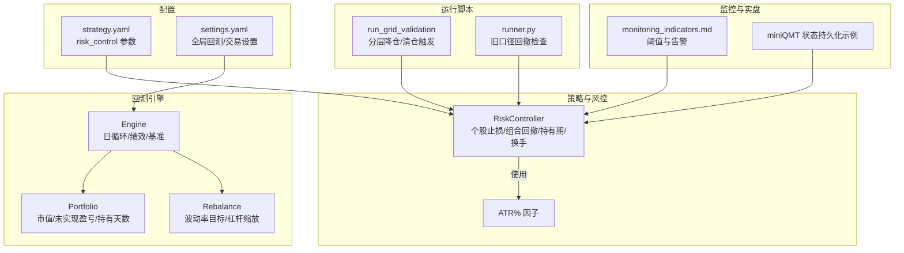
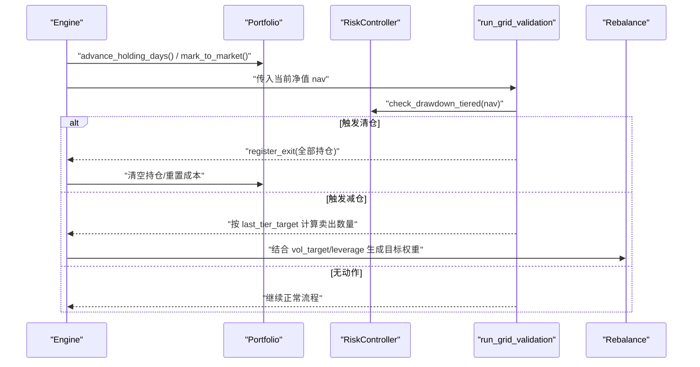
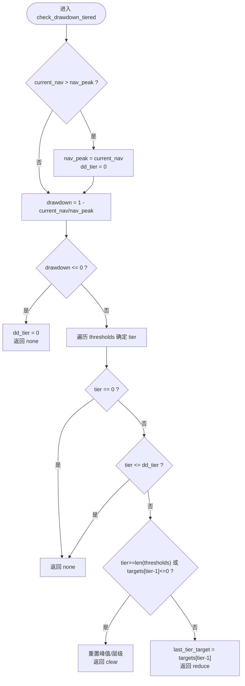
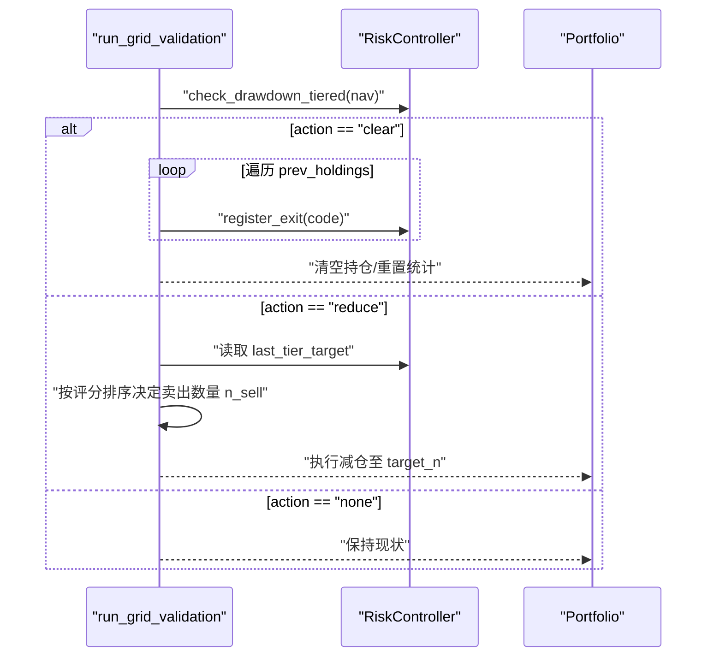
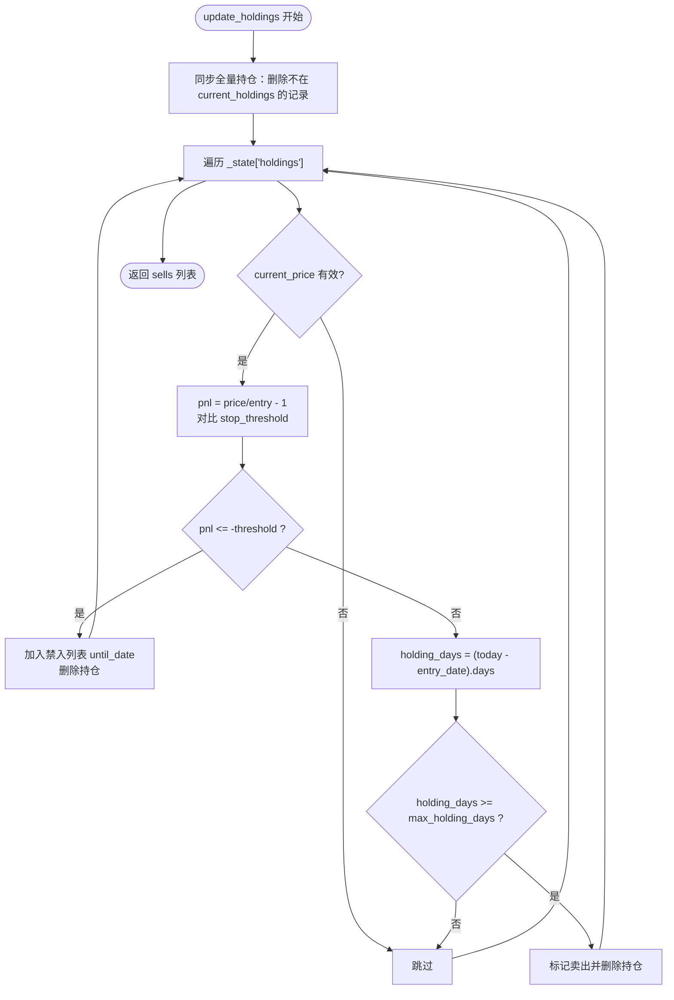
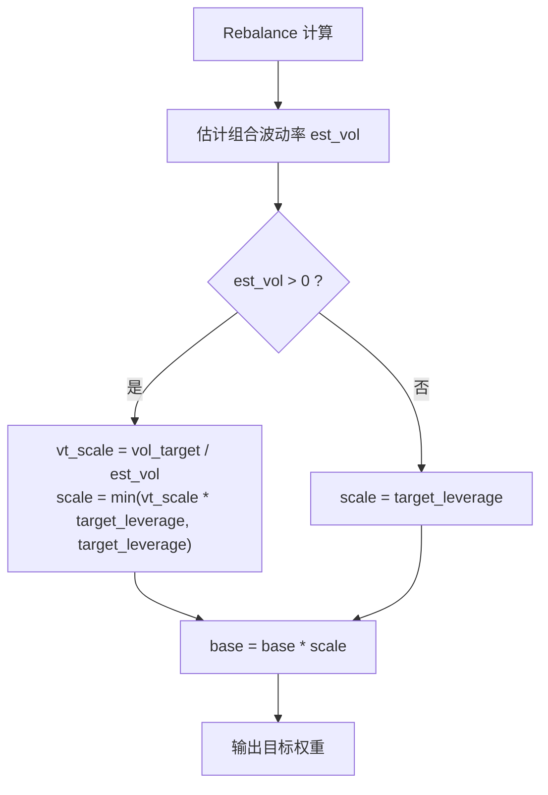
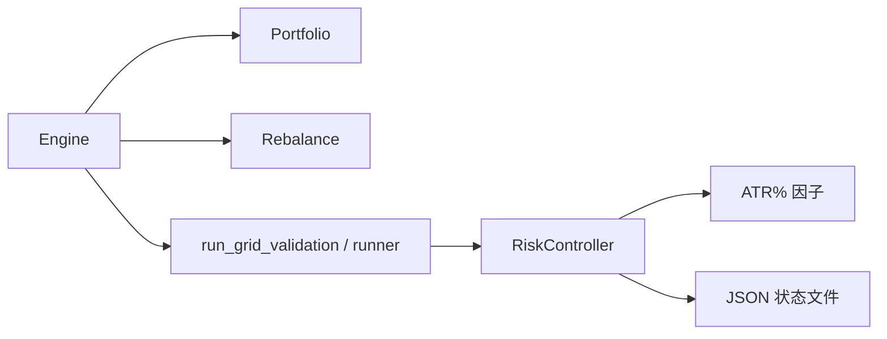

# 回撤控制机制

<cite>
**本文引用的文件**   
- [risk.py](file://projects/Project_10_价值小盘V2/strategy/risk.py)
- [run_grid_validation.py](file://projects/Project_10_价值小盘V2/run_grid_validation.py)
- [runner.py](file://projects/Project_10_价值小盘V2/runner.py)
- [portfolio.py](file://backtest/portfolio.py)
- [rebalance.py](file://backtest/rebalance.py)
- [engine.py](file://backtest/engine.py)
- [atr.py](file://factors/atr.py)
- [strategy.yaml](file://projects/Project_10_价值小盘V2/config/strategy.yaml)
- [settings.yaml](file://config/settings.yaml)
- [monitoring_indicators.md](file://projects/verification/results/monitoring_indicators.md)
- [miniQMT实盘对接_生产级完善方案.md](file://miniQMT实盘对接_生产级完善方案.md)
</cite>

## 目录
1. [引言](#引言)
2. [项目结构](#项目结构)
3. [核心组件](#核心组件)
4. [架构总览](#架构总览)
5. [详细组件分析](#详细组件分析)
6. [依赖关系分析](#依赖关系分析)
7. [性能与稳定性考量](#性能与稳定性考量)
8. [故障排查指南](#故障排查指南)
9. [结论](#结论)
10. [附录：配置与示例路径](#附录配置与示例路径)

## 引言
本文件面向 QuantLab 的回撤控制机制，系统性说明组合回撤监控、清仓触发、持有期管理以及状态持久化等关键能力。文档基于仓库中已实现的风控模块与回测/执行管线，给出可操作的参数说明、流程图与调用序列，帮助读者在策略层与框架层正确集成并调优风控逻辑。

## 项目结构
与回撤控制直接相关的代码分布在以下位置：
- 风控核心：projects/Project_10_价值小盘V2/strategy/risk.py（RiskController）
- 回撤触发与减仓逻辑：projects/Project_10_价值小盘V2/run_grid_validation.py、projects/Project_10_价值小盘V2/runner.py
- 持仓与净值跟踪：backtest/portfolio.py
- 波动率目标与杠杆缩放：backtest/rebalance.py
- 因子计算（ATR%）：factors/atr.py
- 策略与风控配置：projects/Project_10_价值小盘V2/config/strategy.yaml、config/settings.yaml
- 监控指标定义：projects/verification/results/monitoring_indicators.md
- 实盘状态持久化参考：miniQMT实盘对接_生产级完善方案.md

图表来源 
- [risk.py:15-195](file://projects/Project_10_价值小盘V2/strategy/risk.py#L15-L195)
- [run_grid_validation.py:228-256](file://projects/Project_10_价值小盘V2/run_grid_validation.py#L228-L256)
- [runner.py:154-190](file://projects/Project_10_价值小盘V2/runner.py#L154-L190)
- [portfolio.py:70-98](file://backtest/portfolio.py#L70-L98)
- [rebalance.py:141-195](file://backtest/rebalance.py#L141-L195)
- [atr.py:1-42](file://factors/atr.py#L1-L42)
- [strategy.yaml:43-56](file://projects/Project_10_价值小盘V2/config/strategy.yaml#L43-L56)
- [settings.yaml:22-28](file://config/settings.yaml#L22-L28)
- [monitoring_indicators.md:1-63](file://projects/verification/results/monitoring_indicators.md#L1-L63)
- [miniQMT实盘对接_生产级完善方案.md:650-686](file://miniQMT实盘对接_生产级完善方案.md#L650-L686)

章节来源
- [risk.py:15-195](file://projects/Project_10_价值小盘V2/strategy/risk.py#L15-L195)
- [run_grid_validation.py:228-256](file://projects/Project_10_价值小盘V2/run_grid_validation.py#L228-L256)
- [runner.py:154-190](file://projects/Project_10_价值小盘V2/runner.py#L154-L190)
- [portfolio.py:70-98](file://backtest/portfolio.py#L70-L98)
- [rebalance.py:141-195](file://backtest/rebalance.py#L141-L195)
- [atr.py:1-42](file://factors/atr.py#L1-L42)
- [strategy.yaml:43-56](file://projects/Project_10_价值小盘V2/config/strategy.yaml#L43-L56)
- [settings.yaml:22-28](file://config/settings.yaml#L22-L28)
- [monitoring_indicators.md:1-63](file://projects/verification/results/monitoring_indicators.md#L1-L63)
- [miniQMT实盘对接_生产级完善方案.md:650-686](file://miniQMT实盘对接_生产级完善方案.md#L650-L686)

## 核心组件
- RiskController：封装个股止损、组合回撤（含分层）、最长持有期、单日换手限制、禁入列表与状态持久化。
- 回测执行链路：Engine 驱动每日循环，Portfolio 维护持仓与净值，Rebalance 提供波动率目标与杠杆缩放。
- 运行脚本：run_grid_validation 集成分层回撤触发；runner.py 保留旧口径回撤检查兼容。
- 因子层：ATR% 用于自适应止损阈值。
- 配置层：strategy.yaml 的 risk_control 节点集中管理回撤与止损参数；settings.yaml 提供全局回测/交易设置。
- 监控与实盘：monitoring_indicators.md 定义回撤告警阈值；miniQMT 文档提供状态持久化范式。

章节来源
- [risk.py:15-195](file://projects/Project_10_价值小盘V2/strategy/risk.py#L15-L195)
- [engine.py:1-200](file://backtest/engine.py#L1-L200)
- [portfolio.py:70-98](file://backtest/portfolio.py#L70-L98)
- [rebalance.py:141-195](file://backtest/rebalance.py#L141-L195)
- [atr.py:1-42](file://factors/atr.py#L1-L42)
- [strategy.yaml:43-56](file://projects/Project_10_价值小盘V2/config/strategy.yaml#L43-L56)
- [settings.yaml:22-28](file://config/settings.yaml#L22-L28)
- [monitoring_indicators.md:1-63](file://projects/verification/results/monitoring_indicators.md#L1-L63)
- [miniQMT实盘对接_生产级完善方案.md:650-686](file://miniQMT实盘对接_生产级完善方案.md#L650-L686)

## 架构总览
下图展示回撤控制在回测与策略运行中的整体交互：Engine 每日推进，Portfolio 更新市值与持有天数；RiskController 根据当前净值与持仓进行止损、持有期与回撤检查；run_grid_validation 或 runner.py 根据检查结果生成卖出指令；Rebalance 负责按波动率目标与杠杆缩放输出目标权重。

图表来源 
- [engine.py:1-200](file://backtest/engine.py#L1-L200)
- [portfolio.py:70-98](file://backtest/portfolio.py#L70-L98)
- [run_grid_validation.py:228-256](file://projects/Project_10_价值小盘V2/run_grid_validation.py#L228-L256)
- [risk.py:125-157](file://projects/Project_10_价值小盘V2/strategy/risk.py#L125-L157)
- [rebalance.py:141-195](file://backtest/rebalance.py#L141-L195)

## 详细组件分析

### 回撤监控与计算公式
- 净值峰值跟踪：RiskController 内部维护 nav_peak，当 current_nav > nav_peak 时更新峰值。
- 回撤计算：drawdown = 1 - current_nav / nav_peak。
- 阈值与动作：
  - 旧口径 check_drawdown：drawdown >= max_drawdown 即触发清仓（兼容）。
  - 新口径 check_drawdown_tiered：按 thresholds 分层判定 none/reduce/clear，并在创净值新高时重置层级。

图表来源 
- [risk.py:125-157](file://projects/Project_10_价值小盘V2/strategy/risk.py#L125-L157)

章节来源
- [risk.py:112-157](file://projects/Project_10_价值小盘V2/strategy/risk.py#L112-L157)

### 清仓触发与强制减仓
- 分层触发：thresholds 默认 [0.10, 0.15, 0.20]，targets 默认 [0.70, 0.40, 0.0]。达到第 N 层则降至对应仓位比例，最后一层为清仓。
- 防重触发：仅在回撤加深到新层级时返回动作；创净值新高后重置层级。
- 执行方式：
  - run_grid_validation：action=clear 时 register_exit 全部持仓；action=reduce 时按 last_tier_target 计算 target_n 并排序卖出低分标的。
  - runner.py：旧口径 check_drawdown 触发时同样 register_exit 全部持仓。

图表来源 
- [run_grid_validation.py:228-256](file://projects/Project_10_价值小盘V2/run_grid_validation.py#L228-L256)
- [risk.py:125-157](file://projects/Project_10_价值小盘V2/strategy/risk.py#L125-L157)

章节来源
- [run_grid_validation.py:228-256](file://projects/Project_10_价值小盘V2/run_grid_validation.py#L228-L256)
- [runner.py:154-190](file://projects/Project_10_价值小盘V2/runner.py#L154-L190)
- [risk.py:125-157](file://projects/Project_10_价值小盘V2/strategy/risk.py#L125-L157)

### 持有期管理与老化监控
- 最长持有天数：max_holding_days（默认 60），超过则卖出并移除记录。
- 持有天数递增：Portfolio.advance_holding_days 在每个交易日开始时对持仓 holding_days+1。
- 禁入列表：个股止损触发后将 code 加入禁入列表，直到 until_date 后方可重新买入。

图表来源 
- [risk.py:74-110](file://projects/Project_10_价值小盘V2/strategy/risk.py#L74-L110)
- [portfolio.py:90-98](file://backtest/portfolio.py#L90-L98)

章节来源
- [risk.py:74-110](file://projects/Project_10_价值小盘V2/strategy/risk.py#L74-L110)
- [portfolio.py:90-98](file://backtest/portfolio.py#L90-L98)

### 状态持久化机制
- RiskController 状态字段：
  - holdings：code -> {entry_date, entry_price}
  - nav_peak：历史净值峰值
  - 禁入列表：code -> until_date
  - dd_tier：已触发的回撤层级（用于防重）
- 持久化接口：
  - save_state：将 _state 写入 JSON 文件（支持目录创建）
  - _load_state：启动时加载 JSON，缺失字段用默认值补齐（如 dd_tier）
- 实盘参考：miniQMT 文档提供订单/成交/连接状态的保存与恢复范式，可作为扩展风控状态的参考。

```mermaid
classDiagram
class RiskController {
+stop_loss : float
+max_drawdown : float
+max_holding_days : int
+max_daily_turnover : float
+state_file : str
+atr_stop : bool
+atr_multiplier : float
+atr_stop_cap : float
+tiered_drawdown : bool
+tiered_thresholds : tuple
+tiered_targets : tuple
+_state : dict
+save_state() void
+_load_state() dict
+stop_threshold(code, atr_pct) float
+update_holdings(current_holdings, current_prices, today, atr_pct) list
+check_drawdown(current_nav) (bool, float)
+check_drawdown_tiered(current_nav) (str, float)
+is_banned(code, today) bool
+register_entry(code, price, today) void
+register_exit(code) void
+check_turnover(n_sells, n_buys, total_position) (int,int)
}
```

图表来源 
- [risk.py:15-195](file://projects/Project_10_价值小盘V2/strategy/risk.py#L15-L195)

章节来源
- [risk.py:39-63](file://projects/Project_10_价值小盘V2/strategy/risk.py#L39-L63)
- [miniQMT实盘对接_生产级完善方案.md:650-686](file://miniQMT实盘对接_生产级完善方案.md#L650-L686)

### 波动率动态调整与极端市场保护
- 波动率目标（vol_target）：Rebalance 根据估计组合波动率 vt_scale 调节目标权重，并与 target_leverage 相乘作为硬上限，避免过度暴露。
- ATR 自适应止损：atr_stop 开启时，止损阈值 = min(multiplier * ATR%, stop_cap)，以应对高波动环境。
- 监控告警：monitoring_indicators.md 定义了回撤阈值与处理建议（预警/减仓/清仓），可与风控联动。

图表来源 
- [rebalance.py:179-195](file://backtest/rebalance.py#L179-L195)
- [atr.py:34-42](file://factors/atr.py#L34-L42)
- [monitoring_indicators.md:10-16](file://projects/verification/results/monitoring_indicators.md#L10-L16)

章节来源
- [rebalance.py:179-195](file://backtest/rebalance.py#L179-L195)
- [atr.py:34-42](file://factors/atr.py#L34-L42)
- [monitoring_indicators.md:10-16](file://projects/verification/results/monitoring_indicators.md#L10-L16)

## 依赖关系分析
- RiskController 依赖：
  - 输入：当前净值、持仓信息、价格、ATR%（可选）
  - 输出：卖出清单、清仓/减仓动作、禁入列表、换手限制结果
- 回测依赖：
  - Engine 驱动 Portfolio 更新与 Rebalance 决策
  - Runner/Grid 脚本调用 RiskController 完成风控动作
- 外部依赖：
  - 数据源（行情/财务）通过 Engine/Reader 注入
  - 监控与通知可通过 miniQMT 模式扩展

图表来源 
- [engine.py:1-200](file://backtest/engine.py#L1-L200)
- [portfolio.py:70-98](file://backtest/portfolio.py#L70-L98)
- [rebalance.py:141-195](file://backtest/rebalance.py#L141-L195)
- [run_grid_validation.py:228-256](file://projects/Project_10_价值小盘V2/run_grid_validation.py#L228-L256)
- [risk.py:15-195](file://projects/Project_10_价值小盘V2/strategy/risk.py#L15-L195)
- [atr.py:1-42](file://factors/atr.py#L1-L42)

章节来源
- [engine.py:1-200](file://backtest/engine.py#L1-L200)
- [portfolio.py:70-98](file://backtest/portfolio.py#L70-L98)
- [rebalance.py:141-195](file://backtest/rebalance.py#L141-L195)
- [run_grid_validation.py:228-256](file://projects/Project_10_价值小盘V2/run_grid_validation.py#L228-L256)
- [risk.py:15-195](file://projects/Project_10_价值小盘V2/strategy/risk.py#L15-L195)
- [atr.py:1-42](file://factors/atr.py#L1-L42)

## 性能与稳定性考量
- 回撤检查复杂度：check_drawdown_tiered 为 O(T) 遍历阈值，T 通常为 3~5，开销极低。
- 持有期扫描：update_holdings 为 O(N) 遍历持仓，N 为持仓数（通常数十到上百）。
- 状态 I/O：save_state/_load_state 为 JSON 读写，建议在每日收盘后批量保存，避免盘中频繁 IO。
- 波动率估计：Rebalance 的 vol_target 估算涉及窗口内收益方差，注意窗口长度与数据质量。
- 极端市场保护：启用 atr_stop 与分层阈值，配合 vol_target 降低敞口，可有效抑制尾部风险。

[本节为通用指导，不直接分析具体文件]

## 故障排查指南
- 回撤未触发：
  - 检查 nav_peak 是否正确更新（是否出现负净值或异常价格导致 drawdown 计算错误）
  - 确认 thresholds/targets 配置是否符合预期
- 减仓数量异常：
  - 核对 last_tier_target 与评分排序逻辑
  - 检查换手限制 check_turnover 是否按比例缩放
- 持有期未生效：
  - 确认 advance_holding_days 是否在每日开盘前调用
  - 检查 entry_date 与 today 的时间差计算
- 状态丢失：
  - 检查 state_file 路径与权限
  - 确认 save_state 在关键节点被调用

章节来源
- [risk.py:39-63](file://projects/Project_10_价值小盘V2/strategy/risk.py#L39-L63)
- [risk.py:74-110](file://projects/Project_10_价值小盘V2/strategy/risk.py#L74-L110)
- [portfolio.py:90-98](file://backtest/portfolio.py#L90-L98)
- [miniQMT实盘对接_生产级完善方案.md:650-686](file://miniQMT实盘对接_生产级完善方案.md#L650-L686)

## 结论
QuantLab 的回撤控制机制以 RiskController 为核心，结合回测引擎与执行脚本，实现了从净值峰值跟踪、回撤分层触发、强制减仓/清仓、持有期管理到状态持久化的完整闭环。通过 ATR 自适应止损与波动率目标，系统可在高波动与极端市场中有效保护资本。建议在生产环境中结合 monitoring_indicators 的告警阈值与 miniQMT 的状态持久化范式，进一步提升稳健性与可观测性。

[本节为总结性内容，不直接分析具体文件]

## 附录：配置与示例路径
- 回撤与止损参数（strategy.yaml）：
  - risk_control.stop_loss_pct：个股止损百分比
  - risk_control.max_drawdown_pct：组合最大回撤阈值（旧口径）
  - risk_control.max_holding_days：最长持有天数
  - risk_control.max_daily_turnover：单日最大换手
  - risk_control.atr_stop.enabled/multiplier/stop_cap：ATR 自适应止损开关、倍数与保底
  - risk_control.tiered_drawdown.enabled/thresholds/targets：分层阈值与目标仓位
- 全局回测/交易设置（settings.yaml）：
  - backtest.initial_capital/commission/slippage/benchmark：初始资金、手续费、滑点、基准
- 监控指标（monitoring_indicators.md）：
  - 回撤阈值与处理建议（预警/减仓/清仓）
- 状态持久化（miniQMT 文档）：
  - 订单/成交/连接状态保存与恢复范式

章节来源
- [strategy.yaml:43-56](file://projects/Project_10_价值小盘V2/config/strategy.yaml#L43-L56)
- [settings.yaml:22-28](file://config/settings.yaml#L22-L28)
- [monitoring_indicators.md:10-16](file://projects/verification/results/monitoring_indicators.md#L10-L16)
- [miniQMT实盘对接_生产级完善方案.md:650-686](file://miniQMT实盘对接_生产级完善方案.md#L650-L686)