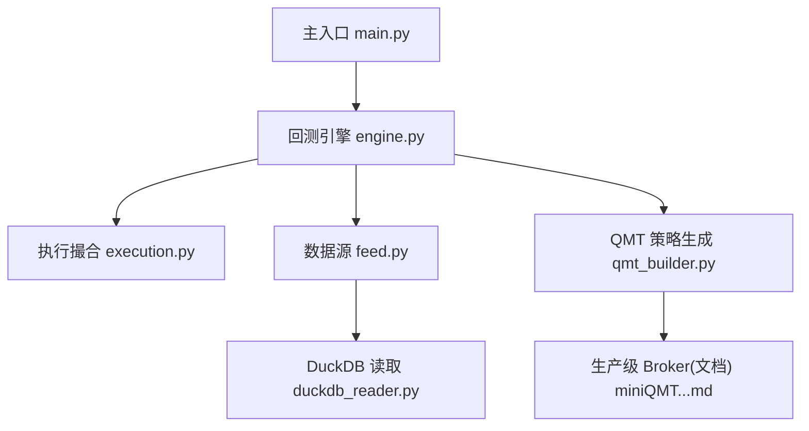
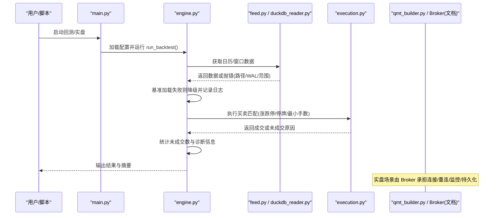
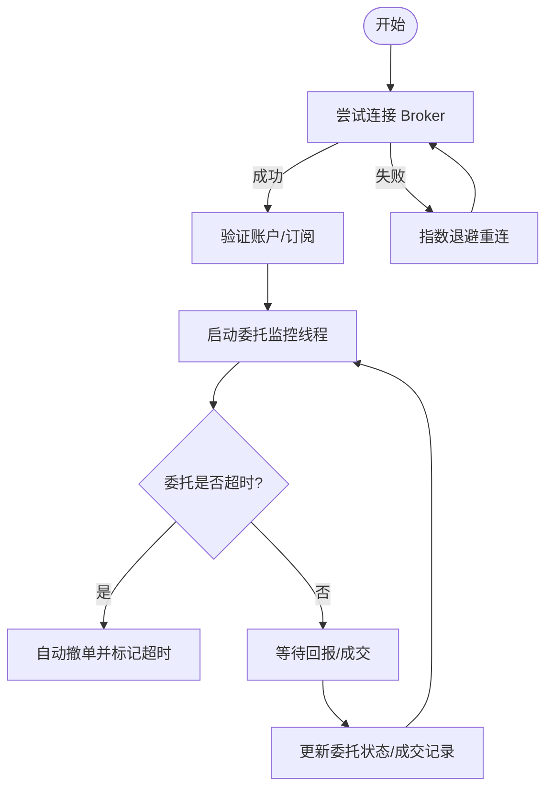
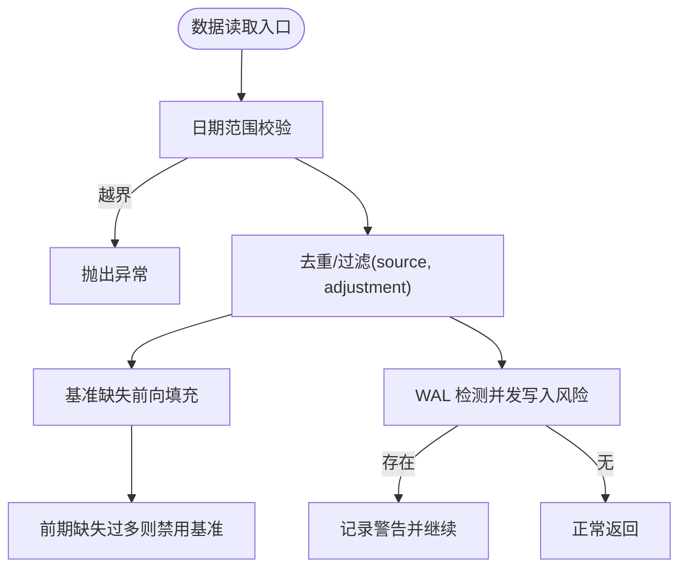
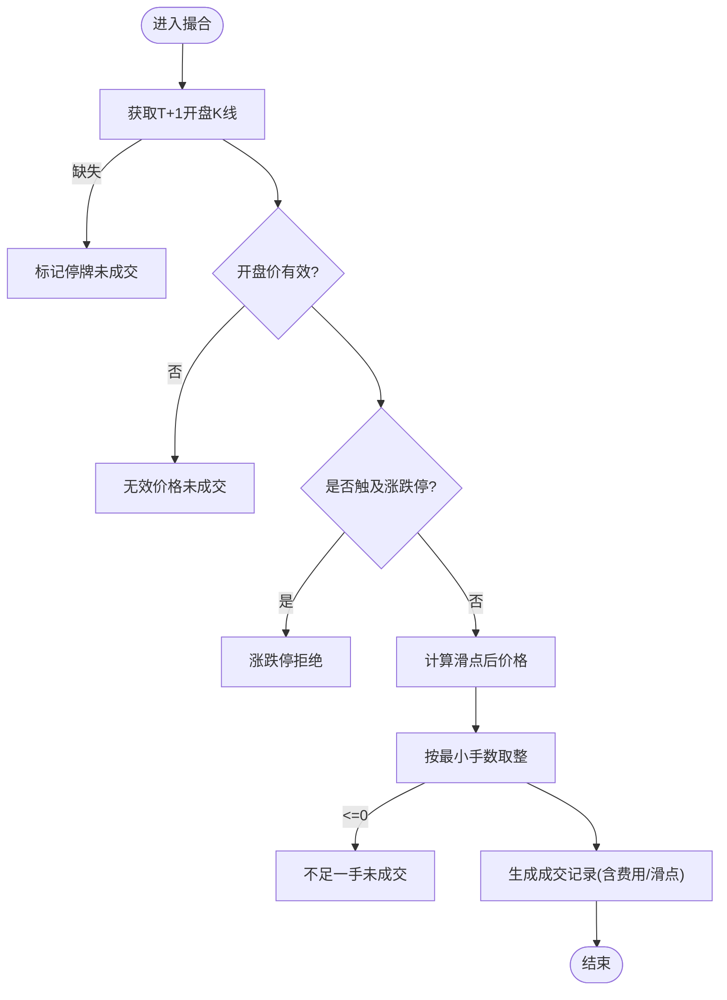
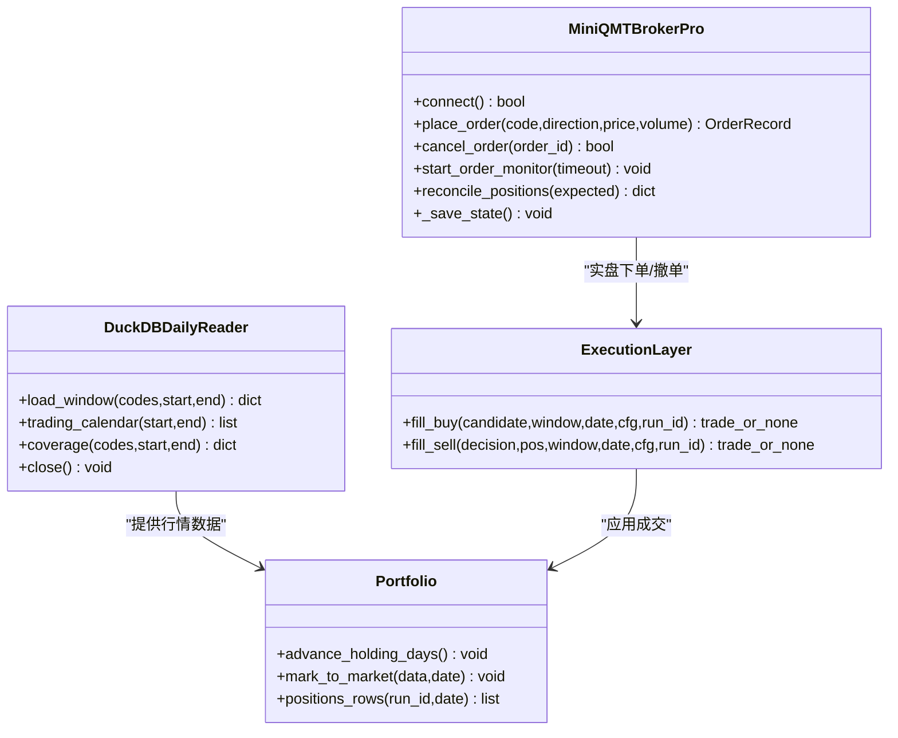
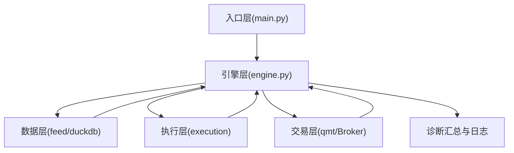
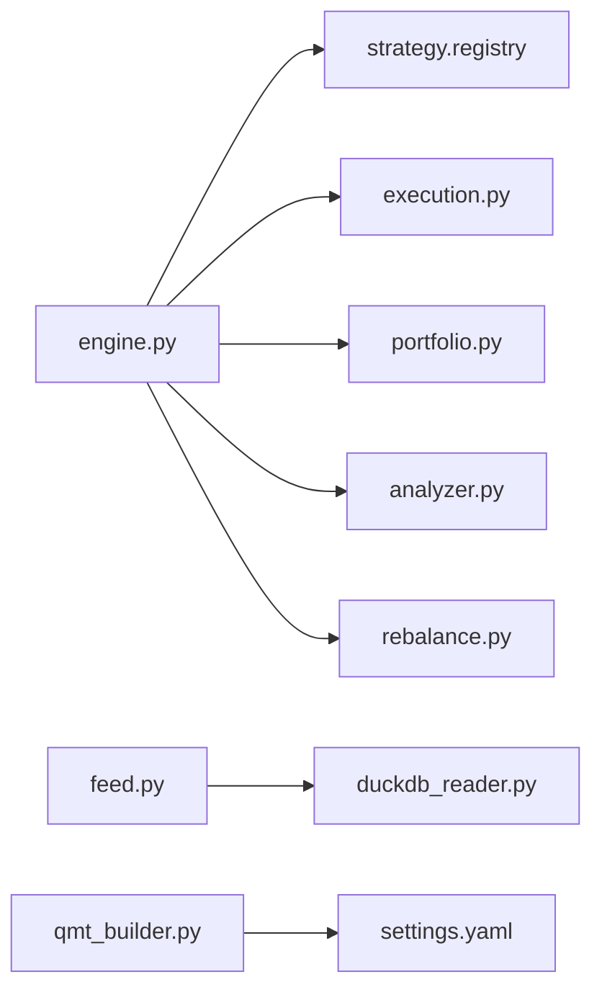

# 异常处理框架

<cite>
**本文引用的文件**   
- [main.py](file://main.py)
- [engine.py](file://backtest/engine.py)
- [execution.py](file://backtest/execution.py)
- [feed.py](file://data/feed.py)
- [duckdb_reader.py](file://data/duckdb_reader.py)
- [qmt_builder.py](file://broker/qmt_builder.py)
- [miniQMT实盘对接_生产级完善方案.md](file://miniQMT实盘对接_生产级完善方案.md)
- [logs.txt](file://reports/20260803_204830_513b7f_atr_lowvol_fw/logs.txt)
</cite>

## 目录
1. [引言](#引言)
2. [项目结构](#项目结构)
3. [核心组件](#核心组件)
4. [架构总览](#架构总览)
5. [详细组件分析](#详细组件分析)
6. [依赖关系分析](#依赖关系分析)
7. [性能考虑](#性能考虑)
8. [故障排查指南](#故障排查指南)
9. [结论](#结论)
10. [附录](#附录)

## 引言
本文件为 QuantLab 的“异常处理框架”文档，面向回测与实盘两类场景，系统化梳理网络异常、数据异常、执行异常与系统异常的分类与处理流程。重点覆盖：
- 网络异常：连接超时重试、断线重连机制、数据源切换策略
- 数据异常：缺失数据处理、异常值检测、数据质量校验
- 执行异常：订单失败重试、部分成交处理、滑点风险控制
- 系统异常：内存泄漏防护、资源清理机制、进程崩溃恢复
同时给出分层捕获与处理的实践建议，并引用仓库中的实际实现位置（以“章节来源”标注），便于快速定位代码。

## 项目结构
QuantLab 的异常处理贯穿“入口—引擎—执行—数据—交易接口”各层：
- 入口层：主程序加载配置、启动回测流程
- 引擎层：日历/基准/窗口切片、策略调用、决策到执行的编排
- 执行层：涨跌停/停牌/最小手数等撮合规则与滑点计算
- 数据层：统一数据源接口、DuckDB 只读读取、WAL 检测与范围校验
- 交易接口层：QMT 生成器与生产级 Broker（含回调、重连、监控、持久化）

**图表来源** 
- [main.py:28-92](file://main.py#L28-L92)
- [engine.py:237-318](file://backtest/engine.py#L237-L318)
- [execution.py:95-204](file://backtest/execution.py#L95-L204)
- [feed.py:17-41](file://data/feed.py#L17-L41)
- [duckdb_reader.py:90-132](file://data/duckdb_reader.py#L90-L132)
- [qmt_builder.py:33-71](file://broker/qmt_builder.py#L33-L71)
- [miniQMT实盘对接_生产级完善方案.md:236-313](file://miniQMT实盘对接_生产级完善方案.md#L236-L313)

**章节来源**
- [main.py:28-92](file://main.py#L28-L92)
- [engine.py:237-318](file://backtest/engine.py#L237-L318)

## 核心组件
- 回测引擎（engine.py）
  - 负责日历构建、基准加载、市场窗口切片、策略评估、决策聚合、未成交统计与诊断汇总
  - 对基准加载失败、fundamentals 读取失败、rebalance 转换异常等进行降级与告警
- 执行撮合（execution.py）
  - 定义涨跌停幅度、最小手数、开盘价有效性、涨停/跌停/停牌拒绝逻辑，计算滑点与费用
- 数据源接口（feed.py）
  - 统一 astock/duckdb 两种数据源；路径不存在时抛出明确错误；DuckDB 路径通过 reader 封装
- DuckDB 读取（duckdb_reader.py）
  - 只读模式、WAL 检测、日期范围校验、去重策略、覆盖率统计
- QMT 策略生成（qmt_builder.py）
  - 将策略参数与生命周期组装为 GBK 编码的单文件策略，包含止损、调仓、下单等逻辑
- 生产级 Broker（miniQMT...md）
  - 回调类、指数退避重连、委托监控、部分成交处理、持仓对账、状态持久化、通知告警

**章节来源**
- [engine.py:237-318](file://backtest/engine.py#L237-L318)
- [execution.py:95-204](file://backtest/execution.py#L95-L204)
- [feed.py:17-41](file://data/feed.py#L17-L41)
- [duckdb_reader.py:90-132](file://data/duckdb_reader.py#L90-L132)
- [qmt_builder.py:33-71](file://broker/qmt_builder.py#L33-L71)
- [miniQMT实盘对接_生产级完善方案.md:236-313](file://miniQMT实盘对接_生产级完善方案.md#L236-L313)

## 架构总览
下图展示从主入口到数据、执行与交易接口的异常处理关键路径。

**图表来源** 
- [main.py:28-92](file://main.py#L28-L92)
- [engine.py:237-318](file://backtest/engine.py#L237-L318)
- [duckdb_reader.py:90-132](file://data/duckdb_reader.py#L90-L132)
- [execution.py:95-204](file://backtest/execution.py#L95-L204)
- [miniQMT实盘对接_生产级完善方案.md:236-313](file://miniQMT实盘对接_生产级完善方案.md#L236-L313)

## 详细组件分析

### 网络异常处理（连接超时重试、断线重连、数据源切换）
- 连接与重连
  - 使用回调类监听断线事件，触发指数退避重连线程，最大尝试次数与间隔可配置
  - 连接成功后进行账户验证，确保可用
- 委托监控与超时
  - 后台线程定时检查未完成委托，超过阈值自动撤单并标记超时
  - 支持“是否自动撤单”的配置开关
- 数据源切换
  - DataFeed 根据 source 选择 astock 或 duckdb；若路径不存在直接报错，上层可据此切换
  - DuckDBReader 在 WAL 存在时发出警告，提示数据一致性风险

**图表来源** 
- [miniQMT实盘对接_生产级完善方案.md:236-313](file://miniQMT实盘对接_生产级完善方案.md#L236-L313)
- [miniQMT实盘对接_生产级完善方案.md:510-546](file://miniQMT实盘对接_生产级完善方案.md#L510-L546)
- [feed.py:17-41](file://data/feed.py#L17-L41)
- [duckdb_reader.py:63-75](file://data/duckdb_reader.py#L63-L75)

**章节来源**
- [miniQMT实盘对接_生产级完善方案.md:236-313](file://miniQMT实盘对接_生产级完善方案.md#L236-L313)
- [miniQMT实盘对接_生产级完善方案.md:510-546](file://miniQMT实盘对接_生产级完善方案.md#L510-L546)
- [feed.py:17-41](file://data/feed.py#L17-L41)
- [duckdb_reader.py:63-75](file://data/duckdb_reader.py#L63-L75)

### 数据异常处理（缺失数据、异常值检测、数据质量校验）
- 缺失数据处理
  - DuckDBReader 对日期范围越界抛出异常；对同日双时间戳按 schema 去重
  - 基准序列缺失时采用前向填充，但前期缺失过多会禁用基准指标
- 异常值检测
  - 执行层对开盘价为非正数、涨跌停开板、停牌等情况拒绝成交
  - 因子与财务数据缺失时回退默认值或跳过计算
- 数据质量校验
  - coverage 统计去重计数、缺失代码清单、数据库修改时间
  - WAL 检测提示同步中数据不一致风险

**图表来源** 
- [duckdb_reader.py:90-132](file://data/duckdb_reader.py#L90-L132)
- [engine.py:38-99](file://backtest/engine.py#L38-L99)
- [execution.py:95-152](file://backtest/execution.py#L95-L152)

**章节来源**
- [duckdb_reader.py:90-132](file://data/duckdb_reader.py#L90-L132)
- [engine.py:38-99](file://backtest/engine.py#L38-L99)
- [execution.py:95-152](file://backtest/execution.py#L95-L152)

### 执行异常处理（订单失败重试、部分成交、滑点控制）
- 订单失败重试
  - 回测侧：未成交原因（停牌、涨停/跌停、不足一手等）被记录并计入未成交统计
  - 实盘侧：Broker 支持委托超时监控与自动撤单，可按配置决定是否重试
- 部分成交处理
  - 回测侧：按 target_cash 向下取整至最小手数，不足则拒绝
  - 实盘侧：成交回报累计已成交量，达到目标后标记全部成交
- 滑点风险控制
  - 买入价=开盘价*(1+滑点)，卖出价=开盘价*(1-滑点)
  - 佣金与印花税按配置计算，影响最终金额与收益

**图表来源** 
- [execution.py:95-204](file://backtest/execution.py#L95-L204)
- [miniQMT实盘对接_生产级完善方案.md:510-546](file://miniQMT实盘对接_生产级完善方案.md#L510-L546)

**章节来源**
- [execution.py:95-204](file://backtest/execution.py#L95-L204)
- [miniQMT实盘对接_生产级完善方案.md:510-546](file://miniQMT实盘对接_生产级完善方案.md#L510-L546)

### 系统异常处理（内存泄漏防护、资源清理、崩溃恢复）
- 内存泄漏防护
  - 回测引擎避免重复创建大对象，使用预计算 cut_index 加速窗口切片
  - 数据读取完成后及时关闭连接（DuckDBReader.close）
- 资源清理机制
  - Reader 析构时关闭连接；基准加载 try/finally 确保资源释放
- 崩溃恢复
  - Broker 定期保存状态（连接、委托、最近成交），重启后可恢复上下文
  - 持仓对账保障程序预期与券商实际一致

**图表来源** 
- [duckdb_reader.py:90-132](file://data/duckdb_reader.py#L90-L132)
- [engine.py:237-318](file://backtest/engine.py#L237-L318)
- [execution.py:95-204](file://backtest/execution.py#L95-L204)
- [miniQMT实盘对接_生产级完善方案.md:650-686](file://miniQMT实盘对接_生产级完善方案.md#L650-L686)

**章节来源**
- [duckdb_reader.py:207-215](file://data/duckdb_reader.py#L207-L215)
- [engine.py:237-318](file://backtest/engine.py#L237-L318)
- [miniQMT实盘对接_生产级完善方案.md:650-686](file://miniQMT实盘对接_生产级完善方案.md#L650-L686)

### 分层异常捕获与处理流程
- 入口层（main.py）
  - 加载配置失败应向上抛出异常，由外部调度器捕获并终止
- 引擎层（engine.py）
  - 基准加载失败：记录日志并禁用相关指标
  - fundamentals 读取失败：降级回退到基础 aux_data
  - rebalance 转换异常：构造空决策并记录诊断
- 执行层（execution.py）
  - 明确返回未成交原因，供上层统计与告警
- 数据层（feed.py / duckdb_reader.py）
  - 路径不存在、WAL 存在、范围越界等抛出明确异常
- 交易层（qmt_builder.py / Broker）
  - 下单失败、撤单失败、委托超时、部分成交均有对应处理与日志

**图表来源** 
- [main.py:28-92](file://main.py#L28-L92)
- [engine.py:237-318](file://backtest/engine.py#L237-L318)
- [execution.py:95-204](file://backtest/execution.py#L95-L204)
- [feed.py:17-41](file://data/feed.py#L17-L41)
- [duckdb_reader.py:90-132](file://data/duckdb_reader.py#L90-L132)
- [qmt_builder.py:33-71](file://broker/qmt_builder.py#L33-L71)

**章节来源**
- [engine.py:237-318](file://backtest/engine.py#L237-L318)
- [execution.py:95-204](file://backtest/execution.py#L95-L204)
- [feed.py:17-41](file://data/feed.py#L17-L41)
- [duckdb_reader.py:90-132](file://data/duckdb_reader.py#L90-L132)
- [qmt_builder.py:33-71](file://broker/qmt_builder.py#L33-L71)

## 依赖关系分析
- 模块耦合
  - engine.py 依赖 strategy.registry、execution、portfolio、analyzer、rebalance
  - feed.py 依赖 backtest.data_tools.duckdb_reader（间接）
  - duckdb_reader.py 仅依赖 duckdb 库，保持只读与轻量
- 潜在循环依赖
  - 当前结构扁平，未见明显循环导入
- 外部依赖
  - xtquant（实盘 Broker）、duckdb（本地数据库）、pandas/numpy（数据处理）

**图表来源** 
- [engine.py:20-25](file://backtest/engine.py#L20-L25)
- [feed.py:106-124](file://data/feed.py#L106-L124)
- [duckdb_reader.py:22-28](file://data/duckdb_reader.py#L22-L28)
- [qmt_builder.py:21-24](file://broker/qmt_builder.py#L21-L24)

**章节来源**
- [engine.py:20-25](file://backtest/engine.py#L20-L25)
- [feed.py:106-124](file://data/feed.py#L106-L124)
- [duckdb_reader.py:22-28](file://data/duckdb_reader.py#L22-L28)
- [qmt_builder.py:21-24](file://broker/qmt_builder.py#L21-L24)

## 性能考虑
- 窗口切片优化：engine.py 使用 searchsorted 预计算 cut_index，O(1) 切片减少内存拷贝
- 基准加载：提前准备足够 warmup 天数，避免 MA 等长窗口指标不稳定
- 数据读取：DuckDBReader 只读模式与 WAL 检测降低并发写入风险
- 执行层：避免随机性与全局可变状态，保证回测确定性

[本节为通用指导，不直接分析具体文件]

## 故障排查指南
- 常见未成交原因
  - below_min_lot：数量不足一手
  - suspended：标的停牌或缺失 K 线
  - limit_up_at_open / limit_down_at_open：开盘触及涨跌停
  - invalid_price：开盘价无效
- 日志定位
  - 回测日志中大量 unfilled_order 记录，结合 reason 字段定位问题
- 数据一致性
  - DuckDB WAL 存在时，数据哈希可能不稳定，需等待同步完成再复现
- 实盘异常
  - 委托超时、部分成交、持仓差异，参考 Broker 的状态持久化与对账方法

**章节来源**
- [logs.txt:4708-5827](file://reports/20260803_204830_513b7f_atr_lowvol_fw/logs.txt#L4708-L5827)
- [duckdb_reader.py:63-75](file://data/duckdb_reader.py#L63-L75)
- [miniQMT实盘对接_生产级完善方案.md:603-644](file://miniQMT实盘对接_生产级完善方案.md#L603-L644)

## 结论
QuantLab 的异常处理框架覆盖了从数据、执行到交易的全链路：
- 数据层强调只读、范围校验与 WAL 检测
- 执行层严格遵循涨跌停/停牌/最小手数规则，并计算滑点与费用
- 交易层提供回调、重连、监控、持久化与对账能力
- 引擎层对基准与辅助数据读取失败进行降级，保证回测稳健性
建议在新增功能时遵循“先校验、再处理、留日志、可降级”的原则，确保系统稳定可靠。

[本节为总结性内容，不直接分析具体文件]

## 附录
- 最佳实践建议
  - 所有外部依赖调用均包裹 try/except，记录错误并返回可恢复状态
  - 对关键路径（基准加载、fundamentals、rebalance）设置降级策略
  - 对网络交互（Broker）启用超时与指数退避重连
  - 对数据一致性（WAL、去重、覆盖率）进行持续监控
  - 对执行结果（未成交原因、部分成交比例）进行统计与告警

[本节为通用指导，不直接分析具体文件]