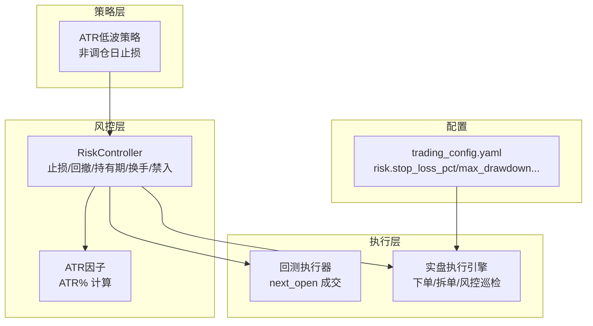
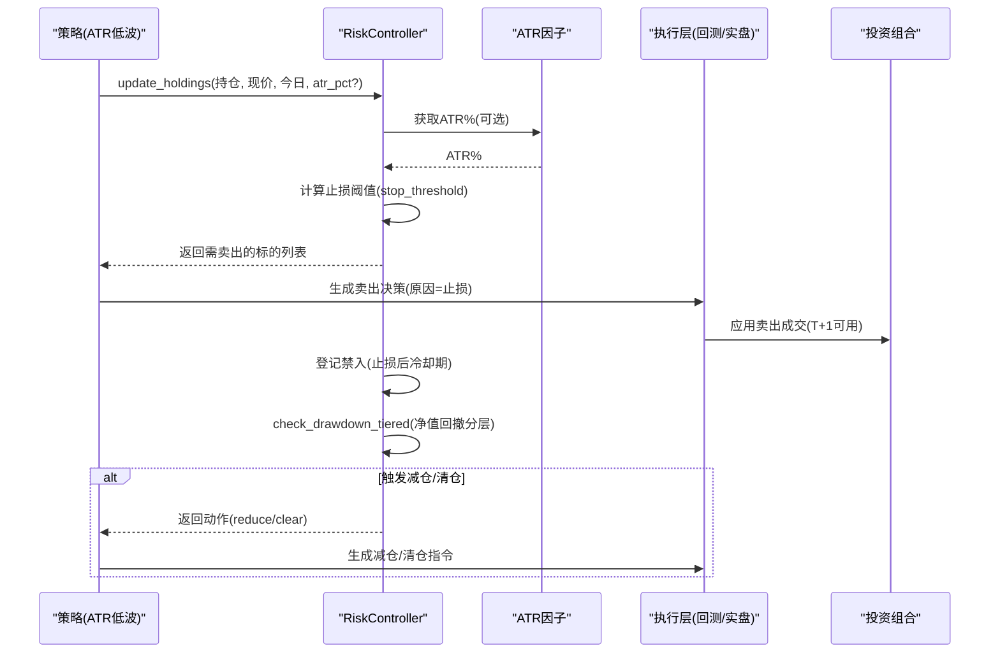
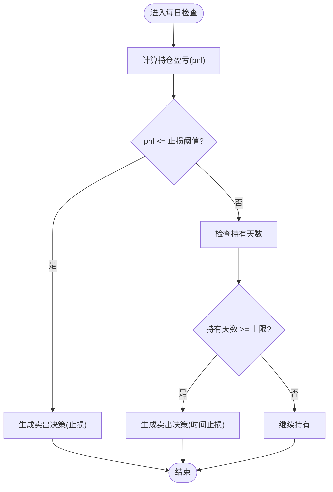
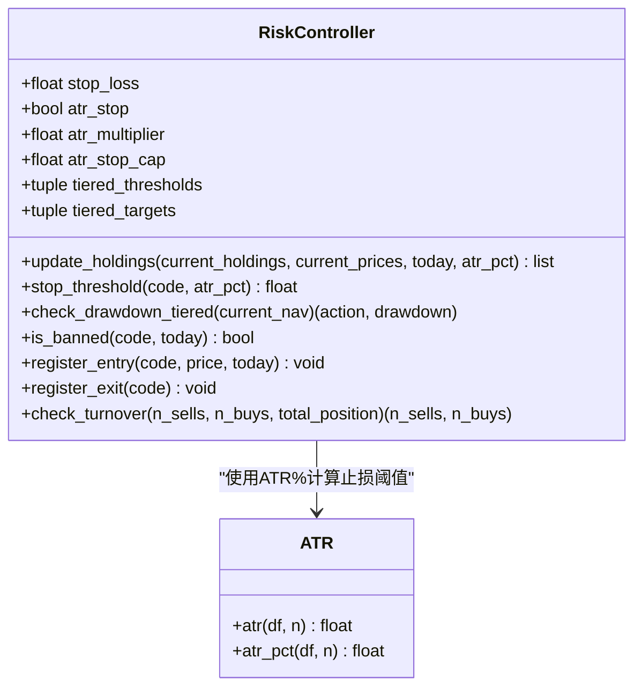
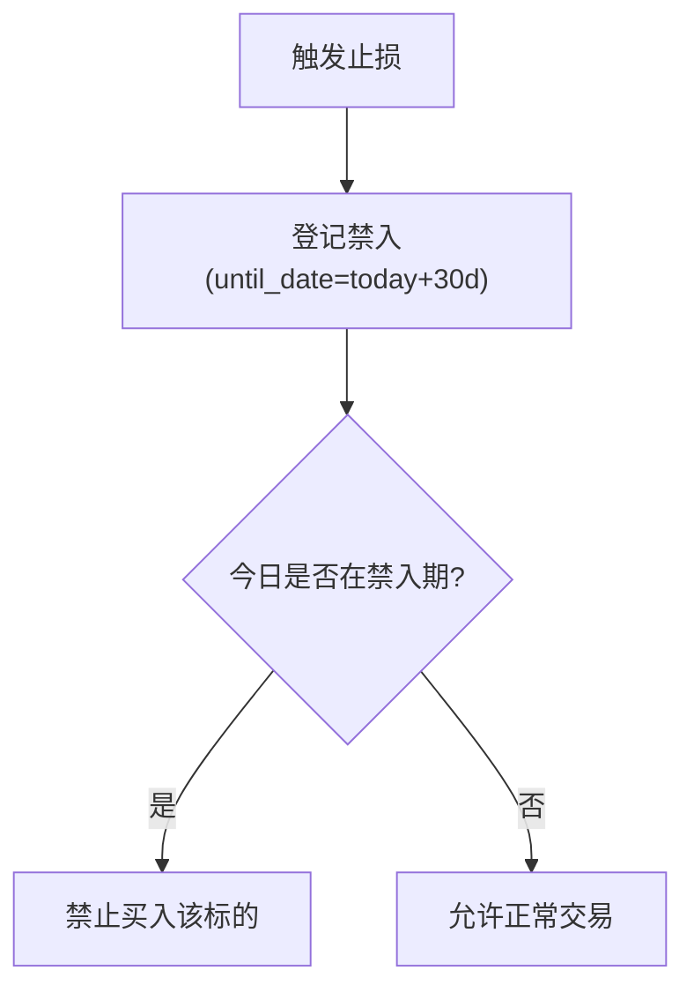
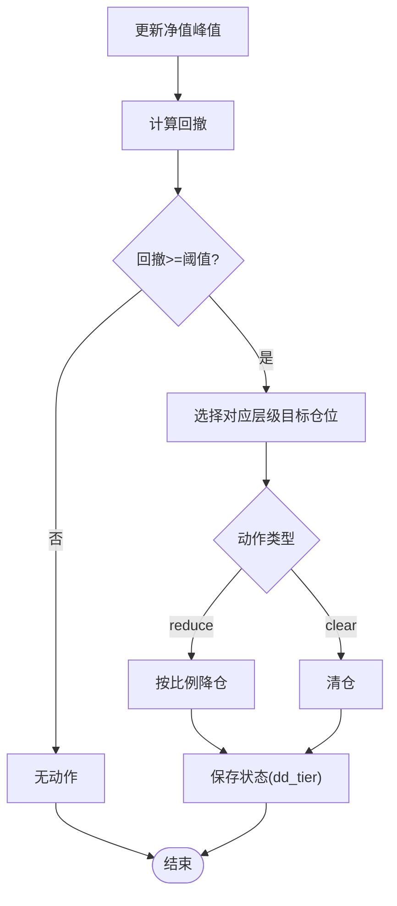
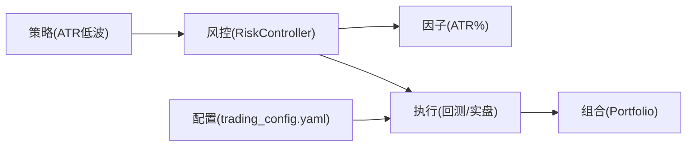

# 止损止盈机制

<cite>
**本文引用的文件**   
- [projects/Project_10_价值小盘V2/strategy/risk.py](file://projects/Project_10_价值小盘V2/strategy/risk.py)
- [factors/atr.py](file://factors/atr.py)
- [strategy/atr_lowvol.py](file://strategy/atr_lowvol.py)
- [backtest/rebalance.py](file://backtest/rebalance.py)
- [backtest/portfolio.py](file://backtest/portfolio.py)
- [backtest/execution.py](file://backtest/execution.py)
- [config/trading_config.yaml](file://config/trading_config.yaml)
- [miniQMT实盘对接_生产级完善方案.md](file://miniQMT实盘对接_生产级完善方案.md)
- [projects/verification/results/monitoring_indicators.md](file://projects/verification/results/monitoring_indicators.md)
</cite>

## 目录
1. [引言](#引言)
2. [项目结构](#项目结构)
3. [核心组件](#核心组件)
4. [架构总览](#架构总览)
5. [详细组件分析](#详细组件分析)
6. [依赖关系分析](#依赖关系分析)
7. [性能与稳定性考量](#性能与稳定性考量)
8. [故障排查指南](#故障排查指南)
9. [结论](#结论)
10. [附录：配置与使用示例](#附录配置与使用示例)

## 引言
本文件为 QuantLab 的“止损止盈机制”全面文档，覆盖固定止损（百分比、价格、时间）、移动止损（追踪、阶梯、波动率自适应）、条件止盈（目标收益、技术指标、基本面）以及禁入列表（冷却期、黑名单管理、恢复条件）。文档同时给出在回测与实盘中的集成方式、参数配置与落地实践，帮助在不深入代码细节的前提下正确设计与应用风控策略。

## 项目结构
QuantLab 的风控与交易执行由多模块协作完成：
- 策略层：ATR低波等策略在调仓日与非调仓日分别处理持仓与止损逻辑
- 风控层：RiskController 提供个股止损、组合回撤分层降仓、持有期与换手限制、禁入列表
- 执行层：回测执行器按 next_open 成交；实盘执行引擎负责下单、拆单与风控巡检
- 数据与因子：ATR 因子用于波动率自适应止损
- 配置：回测与实盘统一通过 YAML 配置风险参数

图表来源
- [strategy/atr_lowvol.py:37-75](file://strategy/atr_lowvol.py#L37-L75)
- [projects/Project_10_价值小盘V2/strategy/risk.py:15-195](file://projects/Project_10_价值小盘V2/strategy/risk.py#L15-L195)
- [factors/atr.py:1-43](file://factors/atr.py#L1-L43)
- [backtest/execution.py:95-156](file://backtest/execution.py#L95-L156)
- [config/trading_config.yaml:18-22](file://config/trading_config.yaml#L18-L22)

章节来源
- [strategy/atr_lowvol.py:37-75](file://strategy/atr_lowvol.py#L37-L75)
- [projects/Project_10_价值小盘V2/strategy/risk.py:15-195](file://projects/Project_10_价值小盘V2/strategy/risk.py#L15-L195)
- [factors/atr.py:1-43](file://factors/atr.py#L1-L43)
- [backtest/execution.py:95-156](file://backtest/execution.py#L95-L156)
- [config/trading_config.yaml:18-22](file://config/trading_config.yaml#L18-L22)

## 核心组件
- RiskController：实现个股止损阈值（固定或ATR自适应）、最长持有期、组合回撤分层降仓、换手率限制、禁入列表与状态持久化
- ATR 因子：提供 ATR 与 ATR%，作为波动率代理用于自适应止损
- 策略集成点：ATR低波策略在非调仓日根据 stop_loss 参数触发止损退出
- 执行层：回测执行器按 next_open 成交；实盘执行引擎定时巡检并触发止损卖出

章节来源
- [projects/Project_10_价值小盘V2/strategy/risk.py:15-195](file://projects/Project_10_价值小盘V2/strategy/risk.py#L15-L195)
- [factors/atr.py:1-43](file://factors/atr.py#L1-L43)
- [strategy/atr_lowvol.py:78-164](file://strategy/atr_lowvol.py#L78-L164)
- [backtest/execution.py:95-156](file://backtest/execution.py#L95-L156)

## 架构总览
下图展示从策略到风控再到执行的完整流程，包括止损触发、禁入登记与回撤分层降仓。

图表来源
- [projects/Project_10_价值小盘V2/strategy/risk.py:62-110](file://projects/Project_10_价值小盘V2/strategy/risk.py#L62-L110)
- [factors/atr.py:34-43](file://factors/atr.py#L34-L43)
- [backtest/execution.py:95-156](file://backtest/execution.py#L95-L156)
- [backtest/portfolio.py:100-151](file://backtest/portfolio.py#L100-L151)

## 详细组件分析

### 固定止损策略
- 百分比止损：基于买入成本价与当前价的收益率判断是否跌破阈值
  - 实现要点：pnl = (last - cost)/cost；若 pnl <= stop_loss 则卖出
  - 参考路径：[strategy/atr_lowvol.py:37-75](file://strategy/atr_lowvol.py#L37-L75)
- 价格止损：以绝对价格或开盘价触发（回测中按 next_open 成交，避免滑点过大）
  - 实现要点：fill_sell 使用下一根 bar 的 open 价格执行
  - 参考路径：[backtest/execution.py:95-156](file://backtest/execution.py#L95-L156)
- 时间止损：最长持有期控制，超过 max_holding_days 强制退出
  - 实现要点：holding_days >= max_holding_days 时卖出
  - 参考路径：[projects/Project_10_价值小盘V2/strategy/risk.py:104-110](file://projects/Project_10_价值小盘V2/strategy/risk.py#L104-L110)

图表来源
- [strategy/atr_lowvol.py:37-75](file://strategy/atr_lowvol.py#L37-L75)
- [projects/Project_10_价值小盘V2/strategy/risk.py:104-110](file://projects/Project_10_价值小盘V2/strategy/risk.py#L104-L110)

章节来源
- [strategy/atr_lowvol.py:37-75](file://strategy/atr_lowvol.py#L37-L75)
- [backtest/execution.py:95-156](file://backtest/execution.py#L95-L156)
- [projects/Project_10_价值小盘V2/strategy/risk.py:104-110](file://projects/Project_10_价值小盘V2/strategy/risk.py#L104-L110)

### 移动止损机制
- 追踪止损：以最高价回落幅度触发（概念性扩展，可在 RiskController 中新增最高价跟踪与回落阈值）
- 阶梯止损：结合回撤分层，逐级降低仓位比例（已在框架内实现）
  - 实现要点：check_drawdown_tiered() 根据回撤阈值选择 reduce/clear
  - 参考路径：[projects/Project_10_价值小盘V2/strategy/risk.py:125-157](file://projects/Project_10_价值小盘V2/strategy/risk.py#L125-L157)
- 波动率自适应止损：使用 ATR% 动态调整止损阈值（已实现）
  - 实现要点：stop_threshold(atr_stop=True) 返回 min(multiplier*ATR%, cap)
  - 参考路径：[projects/Project_10_价值小盘V2/strategy/risk.py:62-72](file://projects/Project_10_价值小盘V2/strategy/risk.py#L62-L72), [factors/atr.py:34-43](file://factors/atr.py#L34-L43)

图表来源
- [projects/Project_10_价值小盘V2/strategy/risk.py:15-195](file://projects/Project_10_价值小盘V2/strategy/risk.py#L15-L195)
- [factors/atr.py:1-43](file://factors/atr.py#L1-L43)

章节来源
- [projects/Project_10_价值小盘V2/strategy/risk.py:62-157](file://projects/Project_10_价值小盘V2/strategy/risk.py#L62-L157)
- [factors/atr.py:34-43](file://factors/atr.py#L34-L43)

### 条件止盈策略
- 目标收益止盈：当收益率达到预设目标时平仓（概念性扩展，可在策略评估函数中加入止盈条件）
- 技术指标止盈：基于技术指标（如RSI超买、MACD死叉）触发止盈（概念性扩展）
- 基本面止盈：基于基本面变化（如ROE下降、估值回归）触发止盈（概念性扩展）
说明：当前仓库未提供具体止盈实现，建议在策略 evaluate_day 中增加止盈判断分支，并在 sell_decisions 中标注 reason="止盈" 以便统计与分析。

章节来源
- [strategy/atr_lowvol.py:78-164](file://strategy/atr_lowvol.py#L78-L164)

### 禁入列表机制
- 止损后冷却期：触发止损后将标的加入禁入列表，设置 until_date（默认30天）
- 黑名单管理：is_banned(code, today) 检查是否在禁入期内
- 恢复条件：until_date 过后自动解除禁入
- 参考路径：
  - 禁入登记与查询：[projects/Project_10_价值小盘V2/strategy/risk.py:159-164](file://projects/Project_10_价值小盘V2/strategy/risk.py#L159-L164)
  - 止损触发时登记禁入：[projects/Project_10_价值小盘V2/strategy/risk.py:96-102](file://projects/Project_10_价值小盘V2/strategy/risk.py#L96-L102)

图表来源
- [projects/Project_10_价值小盘V2/strategy/risk.py:96-102](file://projects/Project_10_价值小盘V2/strategy/risk.py#L96-L102)
- [projects/Project_10_价值小盘V2/strategy/risk.py:159-164](file://projects/Project_10_价值小盘V2/strategy/risk.py#L159-L164)

章节来源
- [projects/Project_10_价值小盘V2/strategy/risk.py:96-102](file://projects/Project_10_价值小盘V2/strategy/risk.py#L96-L102)
- [projects/Project_10_价值小盘V2/strategy/risk.py:159-164](file://projects/Project_10_价值小盘V2/strategy/risk.py#L159-L164)

### 组合回撤与分层降仓
- 回撤监控：记录净值峰值，计算当前回撤
- 分层降仓：根据回撤阈值逐步降低目标仓位比例，直至清仓
- 防重触发：仅在回撤加深到新层级时返回动作，创净值新高时重置层级
- 参考路径：[projects/Project_10_价值小盘V2/strategy/risk.py:125-157](file://projects/Project_10_价值小盘V2/strategy/risk.py#L125-L157)

图表来源
- [projects/Project_10_价值小盘V2/strategy/risk.py:125-157](file://projects/Project_10_价值小盘V2/strategy/risk.py#L125-L157)

章节来源
- [projects/Project_10_价值小盘V2/strategy/risk.py:125-157](file://projects/Project_10_价值小盘V2/strategy/risk.py#L125-L157)

## 依赖关系分析
- 策略对风控的依赖：ATR低波策略在非调仓日调用止损逻辑；调仓日输出目标权重
- 风控对因子的依赖：ATR% 用于波动率自适应止损
- 执行层对组合状态的依赖：回测执行器依据 portfolio 的 T+1 规则与 available_volume 决定可卖数量
- 配置对执行的影响：trading_config.yaml 中的 risk.stop_loss_pct、max_drawdown 等参数驱动实盘风控巡检

图表来源
- [strategy/atr_lowvol.py:78-164](file://strategy/atr_lowvol.py#L78-L164)
- [projects/Project_10_价值小盘V2/strategy/risk.py:15-195](file://projects/Project_10_价值小盘V2/strategy/risk.py#L15-L195)
- [factors/atr.py:1-43](file://factors/atr.py#L1-L43)
- [backtest/execution.py:95-156](file://backtest/execution.py#L95-L156)
- [config/trading_config.yaml:18-22](file://config/trading_config.yaml#L18-L22)

章节来源
- [strategy/atr_lowvol.py:78-164](file://strategy/atr_lowvol.py#L78-L164)
- [projects/Project_10_价值小盘V2/strategy/risk.py:15-195](file://projects/Project_10_价值小盘V2/strategy/risk.py#L15-L195)
- [factors/atr.py:1-43](file://factors/atr.py#L1-L43)
- [backtest/execution.py:95-156](file://backtest/execution.py#L95-L156)
- [config/trading_config.yaml:18-22](file://config/trading_config.yaml#L18-L22)

## 性能与稳定性考量
- 止损频率与换手：过高的止损阈值可能导致频繁交易与高换手，建议结合 max_daily_turnover 限制
- 滑点与冲击成本：回测中使用 slippage 模拟；实盘中大单需拆分以降低冲击
- 数据可用性：停牌或无行情时需 fallback 到最近收盘价，避免误判
- 状态持久化：RiskController 的状态文件确保跨进程/重启后的连续性

章节来源
- [backtest/rebalance.py:170-195](file://backtest/rebalance.py#L170-L195)
- [backtest/portfolio.py:76-99](file://backtest/portfolio.py#L76-99)
- [miniQMT实盘对接_生产级完善方案.md:991-1006](file://miniQMT实盘对接_生产级完善方案.md#L991-L1006)

## 故障排查指南
- 止损未触发：检查 stop_loss 参数是否为 None 或未传入 atr_pct
- 禁入未生效：确认 until_date 是否正确设置且今日未过冷却期
- 回撤未降仓：检查 dd_tier 状态与阈值配置，确认净值峰值更新逻辑
- 执行失败：核对 next_open 是否存在、available_volume 是否为 0、涨跌停限制

章节来源
- [strategy/atr_lowvol.py:37-75](file://strategy/atr_lowvol.py#L37-L75)
- [projects/Project_10_价值小盘V2/strategy/risk.py:159-164](file://projects/Project_10_价值小盘V2/strategy/risk.py#L159-L164)
- [backtest/execution.py:95-156](file://backtest/execution.py#L95-L156)

## 结论
QuantLab 的止损止盈机制以 RiskController 为核心，结合 ATR 因子实现波动率自适应止损，并通过分层回撤降仓与禁入列表提升稳健性。策略层在调仓与非调仓日分别处理信号与止损，执行层保证成交与资金约束。通过合理配置与监控指标，可在保护投资组合的同时保持策略有效性。

## 附录：配置与使用示例
- 回测配置（ATR低波策略）：
  - 关键参数：stop_loss、position_sizing、target_leverage、vol_target、industry_cap
  - 参考路径：[config/atr_lowvol_fw_leveraged.yaml](file://config/atr_lowvol_fw_leveraged.yaml)
- 实盘配置（交易与风控）：
  - 关键参数：risk.stop_loss_pct、max_drawdown、max_holding_days、max_daily_turnover
  - 参考路径：[config/trading_config.yaml:18-22](file://config/trading_config.yaml#L18-L22)
- 实盘执行引擎（风控巡检）：
  - 个股止损巡检与通知
  - 参考路径：[miniQMT实盘对接_生产级完善方案.md:1034-1061](file://miniQMT实盘对接_生产级完善方案.md#L1034-L1061)
- 监控指标（风控回顾）：
  - 止损次数、止盈次数、最大单笔亏损
  - 参考路径：[projects/verification/results/monitoring_indicators.md:65-69](file://projects/verification/results/monitoring_indicators.md#L65-L69)

章节来源
- [config/atr_lowvol_fw_leveraged.yaml:28-46](file://config/atr_lowvol_fw_leveraged.yaml#L28-L46)
- [config/trading_config.yaml:18-22](file://config/trading_config.yaml#L18-L22)
- [miniQMT实盘对接_生产级完善方案.md:1034-1061](file://miniQMT实盘对接_生产级完善方案.md#L1034-L1061)
- [projects/verification/results/monitoring_indicators.md:65-69](file://projects/verification/results/monitoring_indicators.md#L65-L69)