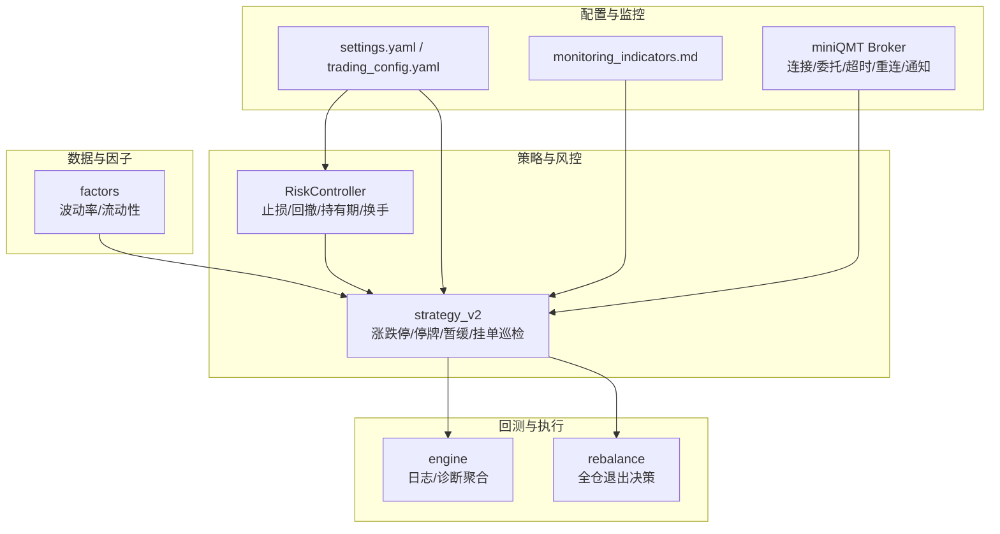
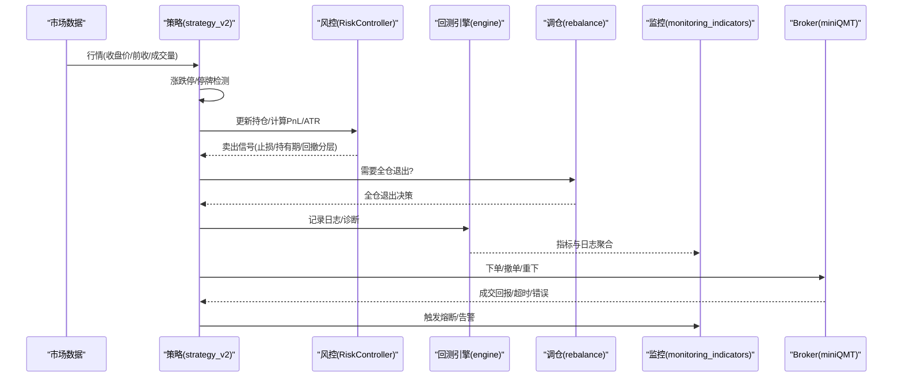
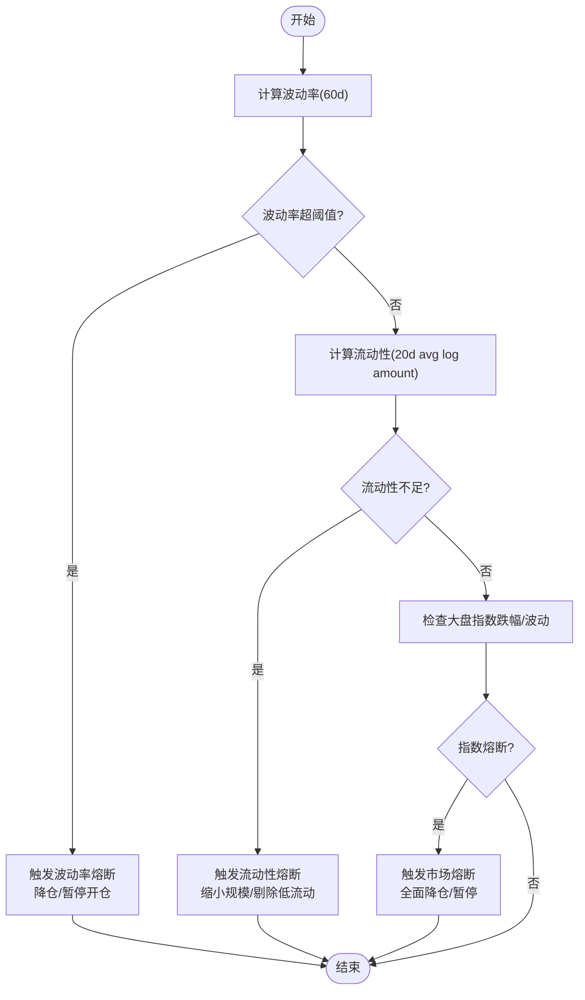
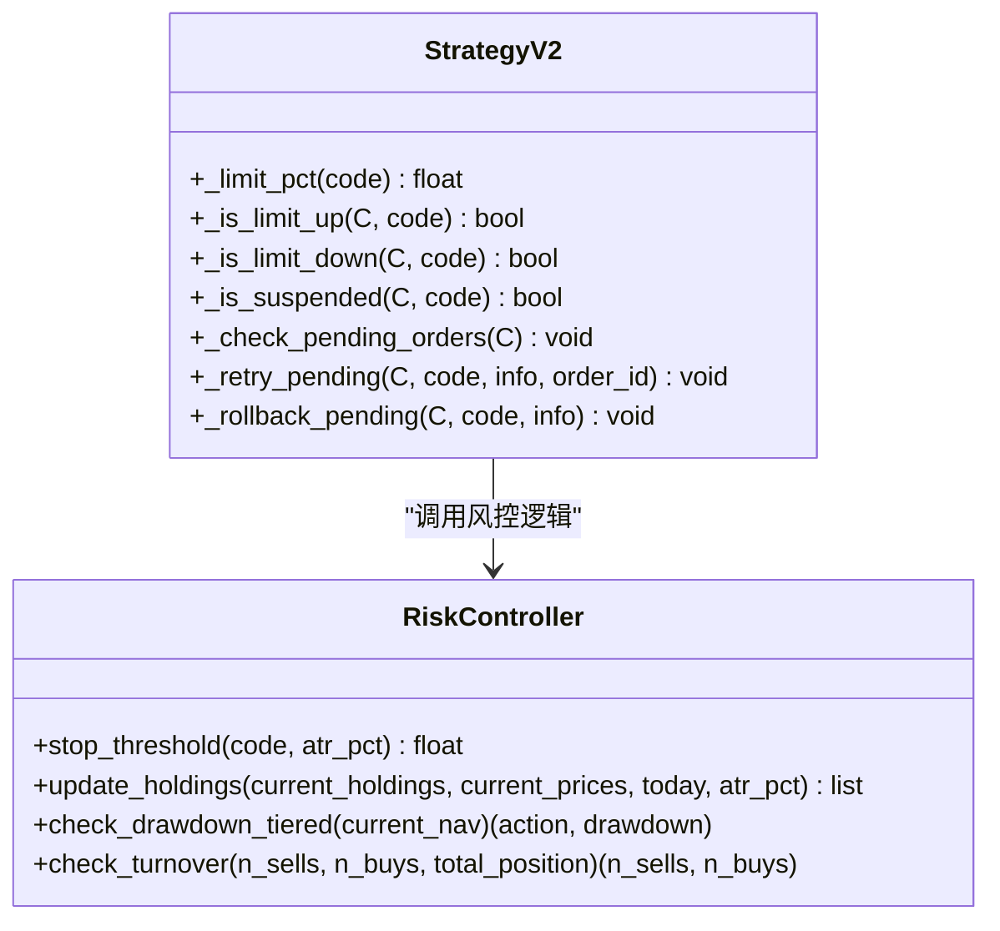
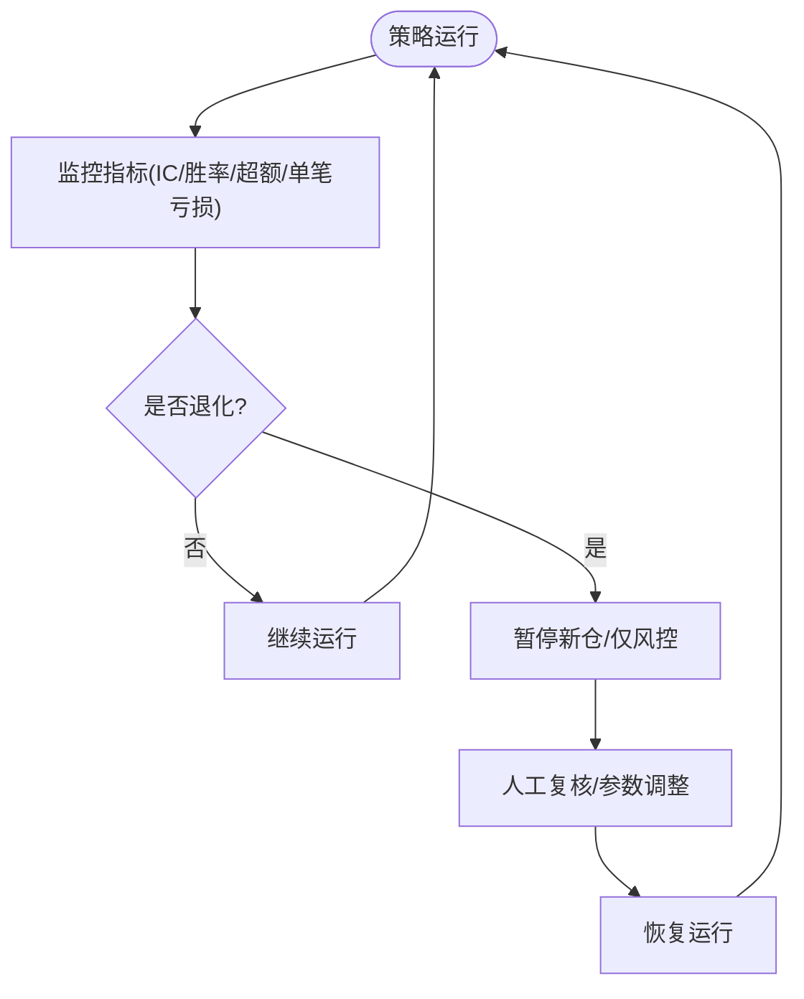
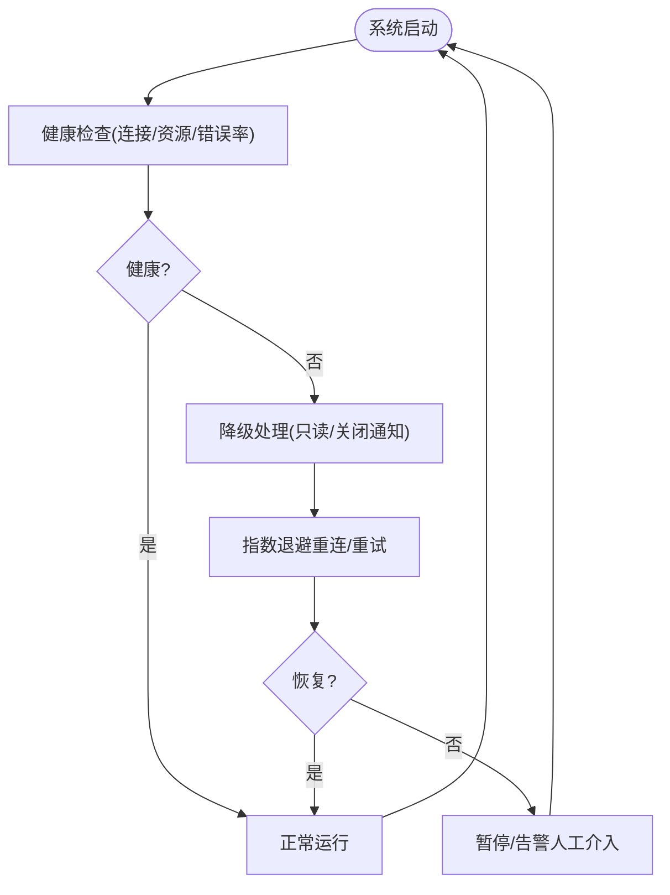
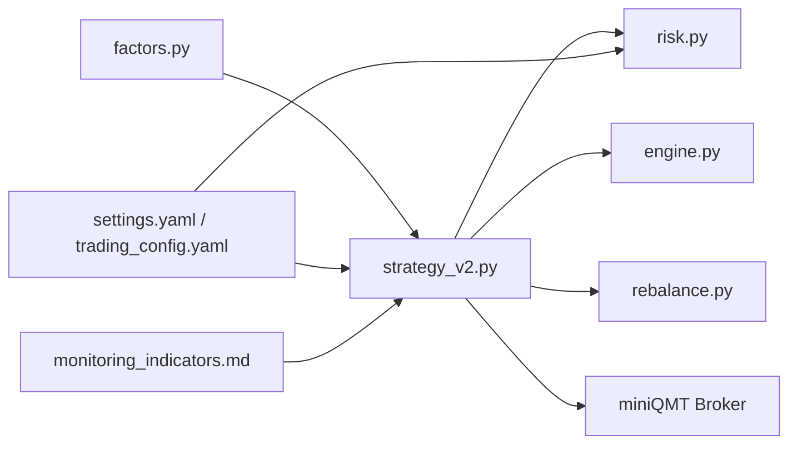

# 熔断机制设计

<cite>
**本文引用的文件**   
- [risk.py](file://projects/Project_10_价值小盘V2/strategy/risk.py)
- [strategy_v2.py](file://projects/Project_10_价值小盘V2/strategy_v2.py)
- [runner.py](file://projects/Project_10_价值小盘V2/runner.py)
- [engine.py](file://backtest/engine.py)
- [rebalance.py](file://backtest/rebalance.py)
- [factors.py](file://projects/Project_01_多因子IC小盘Alpha/research/multi_factor_ic/factors.py)
- [settings.yaml](file://config/settings.yaml)
- [trading_config.yaml](file://config/trading_config.yaml)
- [AGENTS.md](file://AGENTS.md)
- [monitoring_indicators.md](file://projects/verification/results/monitoring_indicators.md)
- [miniQMT实盘对接_生产级完善方案.md](file://miniQMT实盘对接_生产级完善方案.md)
</cite>

## 目录
1. [引言](#引言)
2. [项目结构](#项目结构)
3. [核心组件](#核心组件)
4. [架构总览](#架构总览)
5. [详细组件分析](#详细组件分析)
6. [依赖关系分析](#依赖关系分析)
7. [性能与稳定性考量](#性能与稳定性考量)
8. [故障排查指南](#故障排查指南)
9. [结论](#结论)
10. [附录：配置与示例](#附录配置与示例)

## 引言
本文件为 QuantLab 的熔断机制设计文档，覆盖市场熔断（大盘指数、波动率、流动性）、个股熔断（涨跌停处理、异常波动识别、停牌过滤）、策略熔断（失效检测、性能退化监控、自动暂停）以及系统熔断（资源耗尽保护、错误率阈值控制、降级处理）。同时给出状态监控与恢复机制（日志记录、人工干预接口、自动恢复逻辑），并提供可落地的配置参数与实现示例，帮助在不同风险场景下有效触发和执行熔断操作。

## 项目结构
QuantLab 的风控与熔断能力主要分布在以下模块：
- 风控控制器：RiskController（止损、回撤分层、持有期、换手限制）
- 交易执行与风控集成：strategy_v2（涨跌停/停牌检测、暂缓卖出、挂单巡检与重下）
- 回测引擎与诊断：engine（日志与诊断聚合）、rebalance（全仓退出决策）
- 因子与指标：factors（波动率、流动性计算）
- 配置体系：settings.yaml（全局）、trading_config.yaml（实盘风控阈值）
- 监控与告警：monitoring_indicators.md（每日/周/月/季监控指标与阈值）
- 生产级 Broker：miniQMT实盘对接_生产级完善方案.md（连接、委托、超时、重连、通知）

图表来源 
- [risk.py:15-195](file://projects/Project_10_价值小盘V2/strategy/risk.py#L15-L195)
- [strategy_v2.py:177-376](file://projects/Project_10_价值小盘V2/strategy_v2.py#L177-L376)
- [engine.py:434-443](file://backtest/engine.py#L434-L443)
- [rebalance.py:236-280](file://backtest/rebalance.py#L236-L280)
- [factors.py:88-102](file://projects/Project_01_多因子IC小盘Alpha/research/multi_factor_ic/factors.py#L88-L102)
- [settings.yaml:1-69](file://config/settings.yaml#L1-L69)
- [trading_config.yaml:1-62](file://config/trading_config.yaml#L1-L62)
- [monitoring_indicators.md:1-69](file://projects/verification/results/monitoring_indicators.md#L1-L69)
- [miniQMT实盘对接_生产级完善方案.md:73-756](file://miniQMT实盘对接_生产级完善方案.md#L73-L756)

章节来源
- [settings.yaml:1-69](file://config/settings.yaml#L1-L69)
- [trading_config.yaml:1-62](file://config/trading_config.yaml#L1-L62)
- [AGENTS.md:83-109](file://AGENTS.md#L83-L109)

## 核心组件
- RiskController：提供个股止损（固定或ATR自适应）、组合回撤检查（含分层降仓）、最长持有期、单日换手率限制，并持久化状态（净值峰值、禁入列表等）。
- strategy_v2：在盘中实时检测涨跌停与停牌，对跌停/停牌标的暂缓卖出；支持挂单超时巡检、撤单重下与重试上限后的估算回滚；结合风控输出执行卖出。
- engine：汇总每日诊断信息（候选数、通过率、策略特定字段、日志），便于回溯与监控。
- rebalance：当触发清仓或风控要求时，生成“全仓退出”决策。
- factors：提供波动率与流动性因子，用于市场层熔断判断。
- monitoring_indicators.md：定义每日/周/月/季的监控指标与阈值，作为熔断与人工干预的依据。
- miniQMT Broker：提供连接管理、委托追踪、超时监控、自动重连与通知，保障系统在异常下的稳健性。

章节来源
- [risk.py:15-195](file://projects/Project_10_价值小盘V2/strategy/risk.py#L15-L195)
- [strategy_v2.py:177-376](file://projects/Project_10_价值小盘V2/strategy_v2.py#L177-L376)
- [engine.py:434-443](file://backtest/engine.py#L434-L443)
- [rebalance.py:236-280](file://backtest/rebalance.py#L236-L280)
- [factors.py:88-102](file://projects/Project_01_多因子IC小盘Alpha/research/multi_factor_ic/factors.py#L88-L102)
- [monitoring_indicators.md:1-69](file://projects/verification/results/monitoring_indicators.md#L1-L69)
- [miniQMT实盘对接_生产级完善方案.md:73-756](file://miniQMT实盘对接_生产级完善方案.md#L73-L756)

## 架构总览
下图展示从市场数据到策略决策、风控判定、执行与监控的完整链路，以及熔断在各环节的触发点。

图表来源 
- [strategy_v2.py:177-376](file://projects/Project_10_价值小盘V2/strategy_v2.py#L177-L376)
- [risk.py:15-195](file://projects/Project_10_价值小盘V2/strategy/risk.py#L15-L195)
- [engine.py:434-443](file://backtest/engine.py#L434-L443)
- [rebalance.py:236-280](file://backtest/rebalance.py#L236-L280)
- [monitoring_indicators.md:1-69](file://projects/verification/results/monitoring_indicators.md#L1-L69)
- [miniQMT实盘对接_生产级完善方案.md:73-756](file://miniQMT实盘对接_生产级完善方案.md#L73-L756)

## 详细组件分析

### 市场熔断（大盘指数、波动率、流动性）
- 触发条件建议
  - 大盘指数熔断：以沪深300等基准指数的日跌幅或波动突破阈值触发（例如单日跌幅>3%或波动率显著放大），由监控指标驱动。
  - 波动率熔断：基于近N日收益率标准差（如60日）超过历史分位数或绝对阈值，降低仓位或暂停新开仓。
  - 流动性熔断：基于近N日成交额均值（如对数平均）低于阈值，减少交易规模或暂停低流动性标的。
- 实现要点
  - 使用 factors 模块提供的波动率与流动性指标，结合 monitoring_indicators.md 的阈值进行判定。
  - 将市场熔断结果注入策略层，影响选股池、调仓频率或目标权重。

图表来源 
- [factors.py:88-102](file://projects/Project_01_多因子IC小盘Alpha/research/multi_factor_ic/factors.py#L88-L102)
- [monitoring_indicators.md:1-69](file://projects/verification/results/monitoring_indicators.md#L1-L69)

章节来源
- [factors.py:88-102](file://projects/Project_01_多因子IC小盘Alpha/research/multi_factor_ic/factors.py#L88-L102)
- [monitoring_indicators.md:1-69](file://projects/verification/results/monitoring_indicators.md#L1-L69)

### 个股熔断（涨跌停处理、异常波动识别、停牌过滤）
- 涨跌停处理
  - 涨停禁止买入，跌停禁止卖出；若需卖出但处于跌停或停牌，则暂缓卖出并在后续bar尝试。
  - 通过 _is_limit_up/_is_limit_down/_is_suspended 检测，并结合 limit_pct 规则区分不同板块涨跌幅度。
- 异常波动识别
  - 结合 ATR 自适应止损阈值，动态调整个股止损线，避免极端波动造成过大亏损。
- 停牌过滤
  - 成交量为0视为停牌，跳过交易；已暂缓卖出的标的在恢复后继续尝试卖出。

图表来源 
- [strategy_v2.py:177-376](file://projects/Project_10_价值小盘V2/strategy_v2.py#L177-L376)
- [risk.py:15-195](file://projects/Project_10_价值小盘V2/strategy/risk.py#L15-L195)

章节来源
- [strategy_v2.py:177-376](file://projects/Project_10_价值小盘V2/strategy_v2.py#L177-L376)
- [runner.py:113-152](file://projects/Project_10_价值小盘V2/runner.py#L113-L152)

### 策略熔断（失效检测、性能退化监控、自动暂停）
- 失效检测
  - 监控因子IC、胜率、超额收益等指标，连续不达标触发预警或暂停。
- 性能退化监控
  - 跟踪最大单笔亏损、换手率、信号质量等，超过阈值触发减仓或暂停。
- 自动暂停
  - 当监测到策略表现恶化或外部风险（市场熔断）时，停止新增头寸，仅执行止损与风险控制。

章节来源
- [monitoring_indicators.md:1-69](file://projects/verification/results/monitoring_indicators.md#L1-L69)
- [AGENTS.md:83-109](file://AGENTS.md#L83-L109)

### 系统熔断（资源耗尽保护、错误率阈值控制、降级处理）
- 资源耗尽保护
  - 连接失败、内存/CPU超限、磁盘空间不足时，触发降级或暂停。
- 错误率阈值控制
  - 委托失败、成交回报缺失、数据源不可用等错误率超过阈值，触发熔断。
- 降级处理
  - 切换到只读模式（仅查询与报告）、关闭非关键功能（通知）、保留核心风控与止损。

图表来源 
- [miniQMT实盘对接_生产级完善方案.md:73-756](file://miniQMT实盘对接_生产级完善方案.md#L73-L756)

章节来源
- [miniQMT实盘对接_生产级完善方案.md:73-756](file://miniQMT实盘对接_生产级完善方案.md#L73-L756)

## 依赖关系分析
- RiskController 被 strategy_v2 调用，用于止损、回撤分层与换手限制。
- strategy_v2 依赖 market data（收盘价、前收、成交量）进行涨跌停与停牌检测，并与 broker（miniQMT）交互执行委托。
- engine 聚合 daily warnings、diagnostics 与 logs，供监控与审计。
- rebalance 在风控要求时生成全仓退出决策。
- factors 提供波动率与流动性指标，支撑市场层熔断。
- settings.yaml 与 trading_config.yaml 提供全局与实盘配置，包括风控阈值与调度计划。
- monitoring_indicators.md 定义监控指标与阈值，指导熔断与人工干预。

图表来源 
- [factors.py:88-102](file://projects/Project_01_多因子IC小盘Alpha/research/multi_factor_ic/factors.py#L88-L102)
- [strategy_v2.py:177-376](file://projects/Project_10_价值小盘V2/strategy_v2.py#L177-L376)
- [risk.py:15-195](file://projects/Project_10_价值小盘V2/strategy/risk.py#L15-L195)
- [engine.py:434-443](file://backtest/engine.py#L434-L443)
- [rebalance.py:236-280](file://backtest/rebalance.py#L236-L280)
- [settings.yaml:1-69](file://config/settings.yaml#L1-L69)
- [trading_config.yaml:1-62](file://config/trading_config.yaml#L1-L62)
- [monitoring_indicators.md:1-69](file://projects/verification/results/monitoring_indicators.md#L1-L69)
- [miniQMT实盘对接_生产级完善方案.md:73-756](file://miniQMT实盘对接_生产级完善方案.md#L73-L756)

章节来源
- [AGENTS.md:83-109](file://AGENTS.md#L83-L109)

## 性能与稳定性考量
- 止损与回撤分层：ATR 自适应止损提高极端波动下的鲁棒性；分层降仓避免一刀切清仓带来的冲击成本。
- 挂单巡检与重下：每bar分钟级节流，避免频繁重复下单；超时未成交自动撤单并重下，提升成交概率。
- 日志与诊断：engine 聚合日志与诊断，便于回溯与优化；reports 中的 WARN 块记录关键异常。
- 连接与重连：miniQMT Broker 采用指数退避重连，保障断线恢复；订单状态追踪确保一致性。

章节来源
- [risk.py:15-195](file://projects/Project_10_价值小盘V2/strategy/risk.py#L15-L195)
- [strategy_v2.py:177-376](file://projects/Project_10_价值小盘V2/strategy_v2.py#L177-L376)
- [engine.py:434-443](file://backtest/engine.py#L434-L443)
- [miniQMT实盘对接_生产级完善方案.md:73-756](file://miniQMT实盘对接_生产级完善方案.md#L73-L756)

## 故障排查指南
- 常见错误
  - 委托失败/超时：检查订单反查接口可用性、价格容差、资金/持仓限制。
  - 涨跌停/停牌导致无法交易：确认 _is_limit_up/_is_limit_down/_is_suspended 逻辑与 limit_pct 设置。
  - 数据源不可用：检查 astock 路径、缓存与 WAL 文件状态。
- 排查步骤
  - 查看 engine 日志与 reports 中的 WARN 块，定位问题时间窗口。
  - 核对 trading_config.yaml 的风控阈值与调度计划。
  - 使用 monitoring_indicators.md 的阈值对比实际指标，判断是否触发熔断。
  - 检查 miniQMT Broker 的连接状态与订单追踪，必要时手动干预。

章节来源
- [engine.py:434-443](file://backtest/engine.py#L434-L443)
- [trading_config.yaml:1-62](file://config/trading_config.yaml#L1-L62)
- [monitoring_indicators.md:1-69](file://projects/verification/results/monitoring_indicators.md#L1-L69)
- [miniQMT实盘对接_生产级完善方案.md:73-756](file://miniQMT实盘对接_生产级完善方案.md#L73-L756)

## 结论
QuantLab 的熔断机制通过多层防护（市场、个股、策略、系统）与完善的监控恢复流程，确保在极端行情与系统异常下的稳健运行。RiskController 与 strategy_v2 的配合实现了灵活的止损与回撤控制，miniQMT Broker 提供了生产级的连接与委托管理能力。结合 monitoring_indicators.md 的阈值与 AGENTS.md 的风控优先级，可在不同风险场景下有效触发和执行熔断操作。

## 附录：配置与示例
- 配置参数
  - settings.yaml：全局回测与数据配置（初始资金、佣金、滑点、基准等）。
  - trading_config.yaml：实盘风控阈值（个股止损8%、组合最大回撤15%、最长持有60天、单日最大换手30%）、调度计划与通知配置。
- 实现示例
  - 市场熔断：基于 factors 的波动率与流动性指标，结合 monitoring_indicators.md 阈值触发降仓或暂停。
  - 个股熔断：strategy_v2 中涨跌停/停牌检测与暂缓卖出，RiskController 的 ATR 自适应止损与分层降仓。
  - 策略熔断：监控 IC/胜率/超额，退化时暂停新仓，仅执行风控。
  - 系统熔断：miniQMT Broker 的连接失败与错误率阈值触发降级与重连。

章节来源
- [settings.yaml:1-69](file://config/settings.yaml#L1-L69)
- [trading_config.yaml:1-62](file://config/trading_config.yaml#L1-L62)
- [factors.py:88-102](file://projects/Project_01_多因子IC小盘Alpha/research/multi_factor_ic/factors.py#L88-L102)
- [strategy_v2.py:177-376](file://projects/Project_10_价值小盘V2/strategy_v2.py#L177-L376)
- [risk.py:15-195](file://projects/Project_10_价值小盘V2/strategy/risk.py#L15-L195)
- [monitoring_indicators.md:1-69](file://projects/verification/results/monitoring_indicators.md#L1-L69)
- [miniQMT实盘对接_生产级完善方案.md:73-756](file://miniQMT实盘对接_生产级完善方案.md#L73-L756)