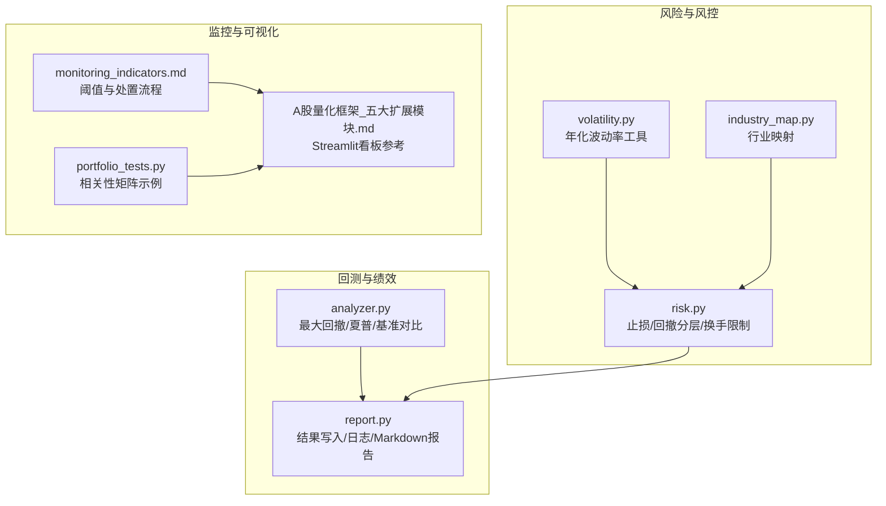
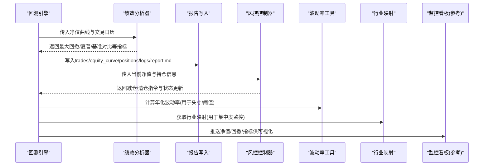
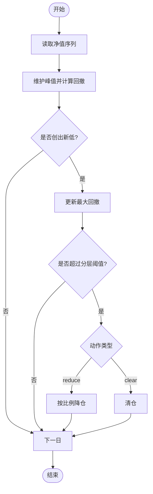
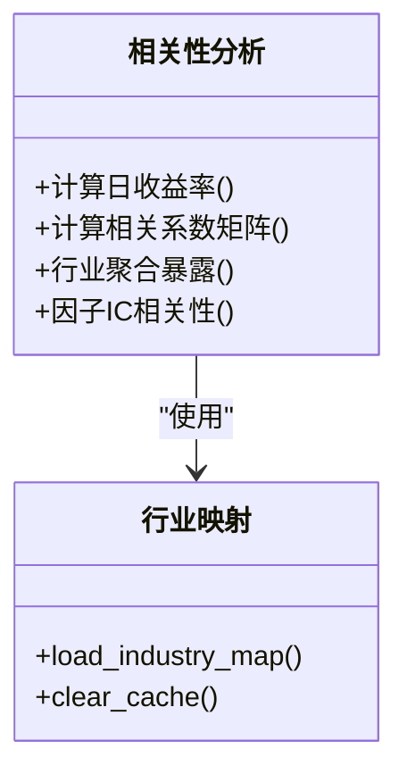
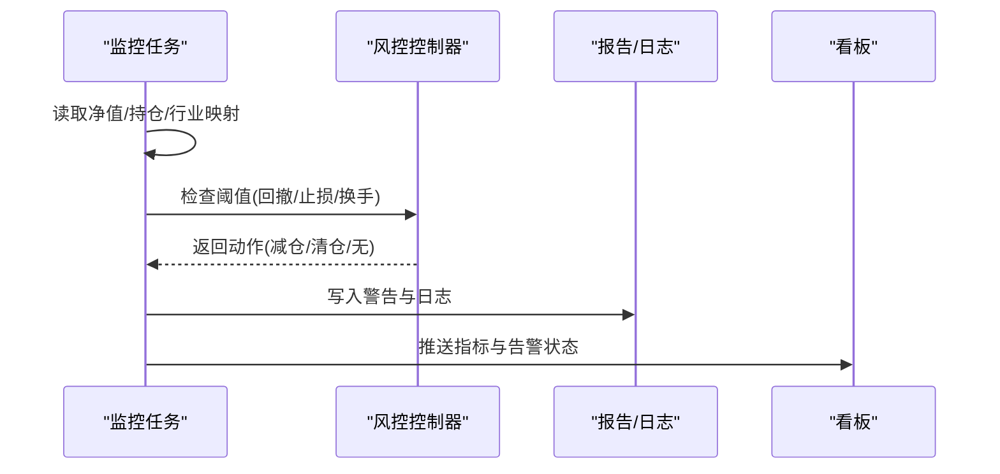
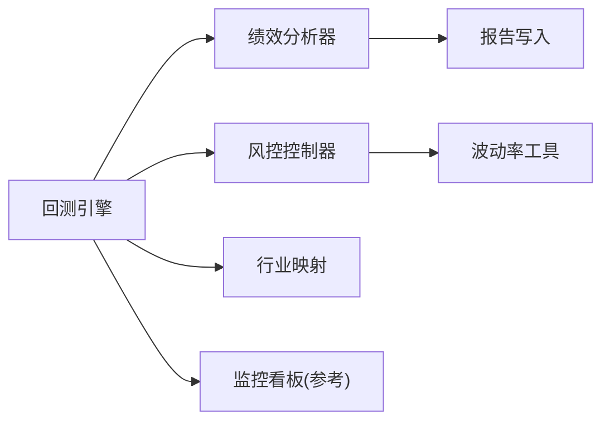

# 风险指标监控

<cite>
**本文引用的文件**   
- [backtest/analyzer.py](file://backtest/analyzer.py)
- [backtest/report.py](file://backtest/report.py)
- [factors/volatility.py](file://factors/volatility.py)
- [data/industry_map.py](file://data/industry_map.py)
- [projects/Project_10_价值小盘V2/strategy/risk.py](file://projects/Project_10_价值小盘V2/strategy/risk.py)
- [projects/verification/results/monitoring_indicators.md](file://projects/verification/results/monitoring_indicators.md)
- [A股量化框架_五大扩展模块.md](file://A股量化框架_五大扩展模块.md)
- [projects/verification/portfolio_tests.py](file://projects/verification/portfolio_tests.py)
</cite>

## 目录
1. [简介](#简介)
2. [项目结构](#项目结构)
3. [核心组件](#核心组件)
4. [架构总览](#架构总览)
5. [详细组件分析](#详细组件分析)
6. [依赖关系分析](#依赖关系分析)
7. [性能与计算复杂度](#性能与计算复杂度)
8. [故障排查指南](#故障排查指南)
9. [结论](#结论)
10. [附录：指标公式与可视化清单](#附录指标公式与可视化清单)

## 简介
本文件面向 QuantLab 的风险指标监控体系，系统化梳理 VaR（Value at Risk）计算方法、最大回撤监控、波动率监控、相关性分析与实时风控告警机制。文档结合仓库中已有的回测分析器、报告输出、波动率工具、行业映射、风控控制器与监控指标定义，给出可落地的实现路径、代码片段定位与可视化建议，帮助交易者在实盘或回测环境中及时识别与控制风险。

## 项目结构
围绕风险监控相关能力，仓库主要涉及以下模块：
- 回测绩效与回撤计算：backtest/analyzer.py
- 结果与报告输出：backtest/report.py
- 波动率工具：factors/volatility.py
- 行业映射（用于行业集中度监控）：data/industry_map.py
- 风控控制器（止损、分层降仓、换手限制等）：projects/Project_10_价值小盘V2/strategy/risk.py
- 监控指标定义（阈值与处置流程）：projects/verification/results/monitoring_indicators.md
- 相关性分析示例：projects/verification/portfolio_tests.py
- Streamlit 监控看板参考实现（含净值曲线、回撤、因子IC等可视化）：A股量化框架_五大扩展模块.md

图表来源
- [backtest/analyzer.py:18-31](file://backtest/analyzer.py#L18-L31)
- [backtest/report.py:138-233](file://backtest/report.py#L138-L233)
- [factors/volatility.py:6-26](file://factors/volatility.py#L6-L26)
- [data/industry_map.py:16-36](file://data/industry_map.py#L16-L36)
- [projects/Project_10_价值小盘V2/strategy/risk.py:15-195](file://projects/Project_10_价值小盘V2/strategy/risk.py#L15-L195)
- [projects/verification/results/monitoring_indicators.md:1-69](file://projects/verification/results/monitoring_indicators.md#L1-L69)
- [projects/verification/portfolio_tests.py:63-81](file://projects/verification/portfolio_tests.py#L63-L81)
- [A股量化框架_五大扩展模块.md:1705-2117](file://A股量化框架_五大扩展模块.md#L1705-L2117)

章节来源
- [backtest/analyzer.py:18-31](file://backtest/analyzer.py#L18-L31)
- [backtest/report.py:138-233](file://backtest/report.py#L138-L233)
- [factors/volatility.py:6-26](file://factors/volatility.py#L6-L26)
- [data/industry_map.py:16-36](file://data/industry_map.py#L16-L36)
- [projects/Project_10_价值小盘V2/strategy/risk.py:15-195](file://projects/Project_10_价值小盘V2/strategy/risk.py#L15-L195)
- [projects/verification/results/monitoring_indicators.md:1-69](file://projects/verification/results/monitoring_indicators.md#L1-L69)
- [projects/verification/portfolio_tests.py:63-81](file://projects/verification/portfolio_tests.py#L63-L81)
- [A股量化框架_五大扩展模块.md:1705-2117](file://A股量化框架_五大扩展模块.md#L1705-L2117)

## 核心组件
- 回撤与绩效分析器：提供最大回撤、夏普比率、基准超额与信息比率、跟踪误差等指标计算，支撑组合级风险度量与报告生成。
- 报告与日志输出：将净值曲线、交易记录、持仓快照与关键警告写入标准化产物，便于审计与复盘。
- 波动率工具：基于收盘价序列计算滚动年化波动率，为波动率监控与头寸规模控制提供基础数据。
- 行业映射：加载股票到行业的映射，支持行业集中度监控与超限处置。
- 风控控制器：实现个股止损（固定或ATR自适应）、组合回撤分层降仓、持有期与换手率限制，并持久化状态。
- 监控指标定义：明确每日/每周/每月/每季度监控项、阈值与处置动作，作为预警与自动化执行依据。
- 相关性分析：基于日收益率计算相关系数矩阵，辅助资产间分散度评估与集中度风险识别。
- 监控看板参考：Streamlit 页面展示净值、回撤、因子IC时序与相关性热力图，可作为实时看板的基础模板。

章节来源
- [backtest/analyzer.py:18-31](file://backtest/analyzer.py#L18-L31)
- [backtest/report.py:138-233](file://backtest/report.py#L138-L233)
- [factors/volatility.py:6-26](file://factors/volatility.py#L6-L26)
- [data/industry_map.py:16-36](file://data/industry_map.py#L16-L36)
- [projects/Project_10_价值小盘V2/strategy/risk.py:15-195](file://projects/Project_10_价值小盘V2/strategy/risk.py#L15-L195)
- [projects/verification/results/monitoring_indicators.md:1-69](file://projects/verification/results/monitoring_indicators.md#L1-L69)
- [projects/verification/portfolio_tests.py:63-81](file://projects/verification/portfolio_tests.py#L63-L81)
- [A股量化框架_五大扩展模块.md:1705-2117](file://A股量化框架_五大扩展模块.md#L1705-L2117)

## 架构总览
下图展示了从数据与策略运行到风险指标计算、报告输出与监控看板的整体流程。

图表来源
- [backtest/analyzer.py:96-175](file://backtest/analyzer.py#L96-L175)
- [backtest/report.py:245-263](file://backtest/report.py#L245-L263)
- [projects/Project_10_价值小盘V2/strategy/risk.py:125-157](file://projects/Project_10_价值小盘V2/strategy/risk.py#L125-L157)
- [factors/volatility.py:6-26](file://factors/volatility.py#L6-L26)
- [data/industry_map.py:16-36](file://data/industry_map.py#L16-L36)
- [A股量化框架_五大扩展模块.md:1705-2117](file://A股量化框架_五大扩展模块.md#L1705-L2117)

## 详细组件分析

### VaR（风险价值）监控方案
VaR 是衡量在一定置信水平下，给定持有期内可能的最大损失。仓库未直接实现 VaR 计算，但提供了构建 VaR 所需的数据与工具：
- 历史模拟法：使用历史日收益率序列，按分位数估计 VaR。可复用 volatility.py 的年化波动率思路与 analyzer.py 的收益序列处理逻辑。
- 蒙特卡洛模拟：基于参数假设（如正态分布或 t 分布）随机生成收益路径，统计尾部损失分位数。
- 参数法：假设收益服从正态分布，利用均值与标准差计算 VaR。

建议实现要点（不粘贴代码，仅给出路径与说明）：
- 输入：组合日收益率序列（可从 equity_rows 提取 daily_return），或标的收益率面板（用于多资产 VaR）。
- 方法选择：历史模拟法稳健且无需分布假设；参数法计算快但需检验分布拟合；蒙特卡洛适合复杂衍生品或非线性组合。
- 输出：不同置信水平（如 95%、99%）下的 VaR 值，以及压力情景下的极端 VaR。
- 集成点：在回测引擎或监控任务中周期性计算，并与监控指标定义中的阈值联动触发预警。

章节来源
- [factors/volatility.py:6-26](file://factors/volatility.py#L6-L26)
- [backtest/analyzer.py:96-175](file://backtest/analyzer.py#L96-L175)

### 最大回撤监控
- 回撤计算：基于净值序列的峰值追踪，计算每个时点的回撤比例，取最小值为最大回撤。
- 持续时间与恢复时间：通过连续回撤区间统计最长持续天数与从最低点到重新回到前高的恢复天数。
- 分层降仓：当回撤超过阈值时，自动降低目标仓位比例，避免进一步损失。

现有实现与扩展：
- 最大回撤计算：analyzer.py 提供 _max_drawdown 函数，可直接用于组合级回撤度量。
- 分层回撤控制：risk.py 的 check_drawdown_tiered 实现阈值分级与防重触发，支持“none/reduce/clear”动作。
- 监控阈值：monitoring_indicators.md 定义了回撤 >10%/15%/20% 的预警与处置动作。

图表来源
- [backtest/analyzer.py:18-31](file://backtest/analyzer.py#L18-L31)
- [projects/Project_10_价值小盘V2/strategy/risk.py:125-157](file://projects/Project_10_价值小盘V2/strategy/risk.py#L125-L157)
- [projects/verification/results/monitoring_indicators.md:10-16](file://projects/verification/results/monitoring_indicators.md#L10-L16)

章节来源
- [backtest/analyzer.py:18-31](file://backtest/analyzer.py#L18-L31)
- [projects/Project_10_价值小盘V2/strategy/risk.py:125-157](file://projects/Project_10_价值小盘V2/strategy/risk.py#L125-L157)
- [projects/verification/results/monitoring_indicators.md:10-16](file://projects/verification/results/monitoring_indicators.md#L10-L16)

### 波动率监控
- 历史波动率：基于收盘价序列计算滚动年化波动率，适用于头寸规模与风险预算分配。
- 隐含波动率：若接入期权市场数据，可通过期权定价模型反推隐含波动率，用于跨资产风险比较。
- 波动率聚类：观察波动率的自相关性与聚集现象，采用 GARCH 类模型或滚动窗口统计进行监测。

现有实现与扩展：
- 年化波动率工具：volatility.py 提供 ann_vol，基于近 n 日收益率标准差乘以 sqrt(252)。
- 监控建议：对组合与单标的分别计算波动率，设置动态阈值（如波动率突破过去 N 日均值+K倍标准差）触发预警。
- 可视化：在监控看板中绘制波动率时序与热力图，标注异常区间。

章节来源
- [factors/volatility.py:6-26](file://factors/volatility.py#L6-L26)
- [A股量化框架_五大扩展模块.md:1705-2117](file://A股量化框架_五大扩展模块.md#L1705-L2117)

### 相关性分析
- 资产相关性矩阵：基于日收益率计算相关系数矩阵，识别高相关性资产集中风险。
- 行业相关性：借助行业映射聚合行业暴露，监控行业集中度与超配风险。
- 因子相关性：对因子 IC 序列计算相关性，评估因子间的共线性与冗余。

现有实现与扩展：
- 相关性矩阵示例：portfolio_tests.py 演示了从权益序列计算日收益率与相关系数矩阵。
- 行业映射：industry_map.py 提供 ts_code -> 行业的映射，可用于行业集中度监控。
- 可视化：监控看板参考实现了相关性热力图与因子 IC 时序图。

图表来源
- [projects/verification/portfolio_tests.py:63-81](file://projects/verification/portfolio_tests.py#L63-L81)
- [data/industry_map.py:16-36](file://data/industry_map.py#L16-L36)
- [A股量化框架_五大扩展模块.md:1705-2117](file://A股量化框架_五大扩展模块.md#L1705-L2117)

章节来源
- [projects/verification/portfolio_tests.py:63-81](file://projects/verification/portfolio_tests.py#L63-L81)
- [data/industry_map.py:16-36](file://data/industry_map.py#L16-L36)
- [A股量化框架_五大扩展模块.md:1705-2117](file://A股量化框架_五大扩展模块.md#L1705-L2117)

### 实时风险监控与告警
- 预警阈值：根据 monitoring_indicators.md 定义，对净值跌幅、回撤、持仓集中度、行业集中度、换手率等设定阈值。
- 告警通知：结合日志与报告输出，将关键警告写入 logs.txt 与 report.md，并在看板中高亮显示。
- 自动化处置：风控控制器根据阈值执行减仓或清仓，并持久化状态防止重复触发。

图表来源
- [projects/verification/results/monitoring_indicators.md:1-69](file://projects/verification/results/monitoring_indicators.md#L1-L69)
- [backtest/report.py:111-121](file://backtest/report.py#L111-L121)
- [projects/Project_10_价值小盘V2/strategy/risk.py:125-157](file://projects/Project_10_价值小盘V2/strategy/risk.py#L125-L157)
- [A股量化框架_五大扩展模块.md:1705-2117](file://A股量化框架_五大扩展模块.md#L1705-L2117)

章节来源
- [projects/verification/results/monitoring_indicators.md:1-69](file://projects/verification/results/monitoring_indicators.md#L1-L69)
- [backtest/report.py:111-121](file://backtest/report.py#L111-L121)
- [projects/Project_10_价值小盘V2/strategy/risk.py:125-157](file://projects/Project_10_价值小盘V2/strategy/risk.py#L125-L157)
- [A股量化框架_五大扩展模块.md:1705-2117](file://A股量化框架_五大扩展模块.md#L1705-L2117)

## 依赖关系分析
- 回测引擎与绩效分析器：engine 调用 analyzer 计算回撤、夏普与基准对比，随后由 report 输出标准化结果。
- 风控控制器与波动率工具：risk 依赖波动率工具提供的年化波动率估算，用于止损阈值与头寸管理。
- 行业映射与集中度监控：industry_map 为行业集中度监控提供映射数据，配合监控指标定义执行处置。
- 监控看板与数据源：dashboard 参考实现读取净值曲线、持仓、因子 IC 与交易记录，进行可视化展示。

图表来源
- [backtest/analyzer.py:96-175](file://backtest/analyzer.py#L96-L175)
- [backtest/report.py:245-263](file://backtest/report.py#L245-L263)
- [factors/volatility.py:6-26](file://factors/volatility.py#L6-L26)
- [data/industry_map.py:16-36](file://data/industry_map.py#L16-L36)
- [A股量化框架_五大扩展模块.md:1705-2117](file://A股量化框架_五大扩展模块.md#L1705-L2117)

章节来源
- [backtest/analyzer.py:96-175](file://backtest/analyzer.py#L96-L175)
- [backtest/report.py:245-263](file://backtest/report.py#L245-L263)
- [factors/volatility.py:6-26](file://factors/volatility.py#L6-L26)
- [data/industry_map.py:16-36](file://data/industry_map.py#L16-L36)
- [A股量化框架_五大扩展模块.md:1705-2117](file://A股量化框架_五大扩展模块.md#L1705-L2117)

## 性能与计算复杂度
- 最大回撤计算：O(N)，N 为交易日数，空间 O(1)。
- 夏普比率：O(N)，需要均值与方差计算。
- 相关性矩阵：O(M^2 * N)，M 为资产数量，N 为观测数；建议使用向量化计算与缓存。
- 波动率计算：O(N)，滚动窗口滑动平均与标准差。
- 报告写入：I/O 密集型，注意批量写入与压缩归档。

优化建议：
- 对相关性矩阵与波动率计算使用向量化库（如 numpy/pandas）减少循环开销。
- 对监控任务设置合理的刷新频率与缓存策略，避免重复计算。
- 对长序列的回撤与峰值追踪采用流式算法，降低内存占用。

[本节为通用指导，不直接分析具体文件]

## 故障排查指南
- 样本期过短：当回测样本不足 252 天或缺少基准数据时，analyzer 会禁用 IR/excess 等指标，需在报告中提示。
- 基准不可用：benchmark 起点价格为 0 时禁用基准对比，需检查数据质量。
- 数据去重与 WAL：report 会记录数据去重与 WAL 检测警告，确保数据同步稳定。
- 风控状态持久化：risk 的状态文件需正确读写，避免重复触发或状态丢失。

章节来源
- [backtest/analyzer.py:96-175](file://backtest/analyzer.py#L96-L175)
- [backtest/report.py:78-108](file://backtest/report.py#L78-L108)
- [projects/Project_10_价值小盘V2/strategy/risk.py:39-54](file://projects/Project_10_价值小盘V2/strategy/risk.py#L39-L54)

## 结论
QuantLab 已具备完善的风险监控基础：回撤与绩效分析、报告输出、波动率工具、行业映射与风控控制器。在此基础上，可快速落地 VaR 监控、波动率聚类与相关性分析，并通过监控看板实现可视化与告警。建议优先完善 VaR 计算与阈值联动，结合分层降仓与换手限制，形成闭环的风控体系。

[本节为总结性内容，不直接分析具体文件]

## 附录：指标公式与可视化清单
- VaR 计算公式（建议实现）：
  - 历史模拟法：VaR_p = -quantile(r, p)，p 为置信水平对应的分位数。
  - 参数法：VaR_p = -(μ + z_p * σ)，z_p 为标准正态分位数。
  - 蒙特卡洛：模拟 N 条收益路径，取损失分布的分位数。
- 最大回撤：MDD = min_t((E_t - peak_t)/peak_t)，peak_t 为历史峰值。
- 夏普比率：Sharpe = (mean(r) / std(r)) * sqrt(252)。
- 年化波动率：ann_vol = std(returns_n) * sqrt(252)。
- 相关性矩阵：corr = corr(daily_returns)。
- 可视化建议：
  - 净值曲线与回撤面积图（参考看板实现）。
  - 波动率时序与热力图。
  - 因子 IC 时序与相关性热力图。
  - 行业集中度饼图与个股权重条形图。

章节来源
- [backtest/analyzer.py:34-43](file://backtest/analyzer.py#L34-L43)
- [factors/volatility.py:6-26](file://factors/volatility.py#L6-L26)
- [projects/verification/portfolio_tests.py:63-81](file://projects/verification/portfolio_tests.py#L63-L81)
- [A股量化框架_五大扩展模块.md:1705-2117](file://A股量化框架_五大扩展模块.md#L1705-L2117)