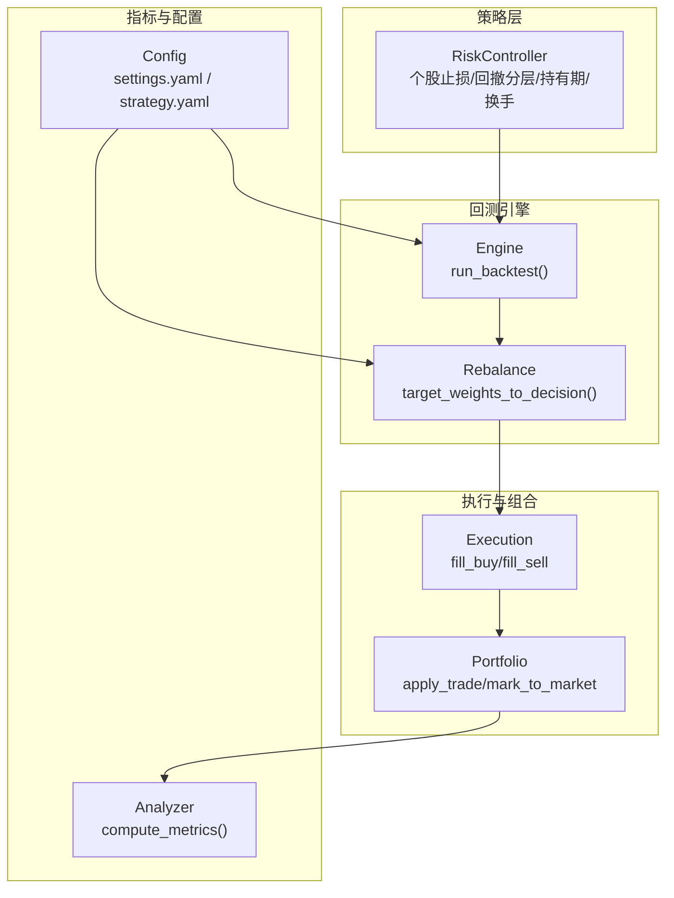
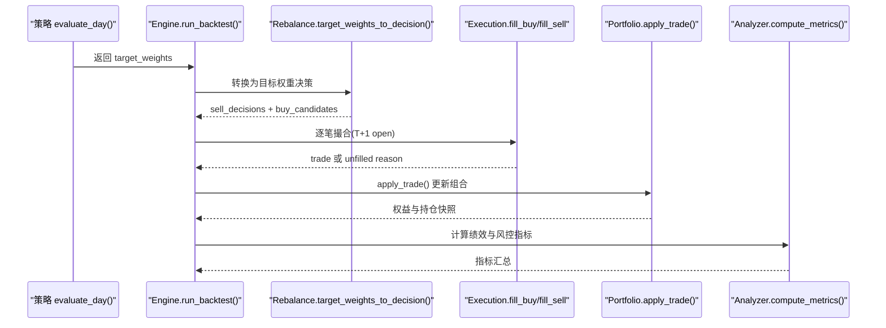
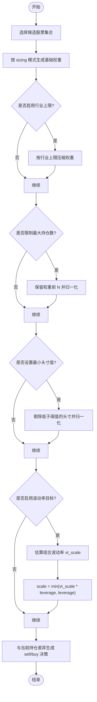
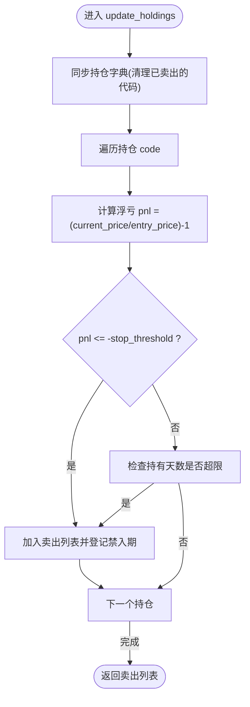
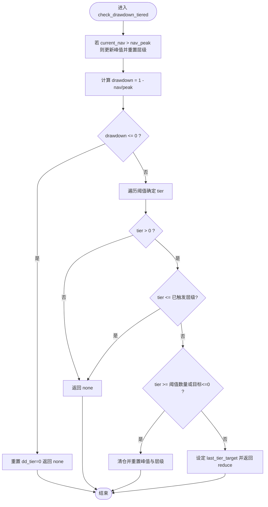
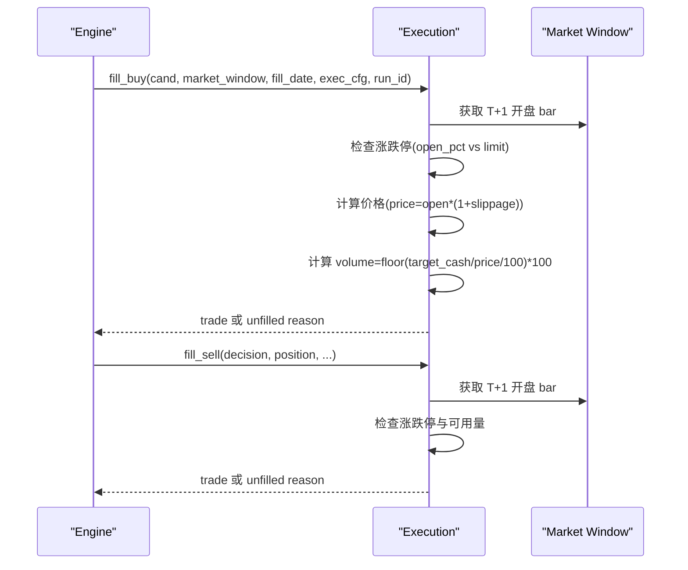
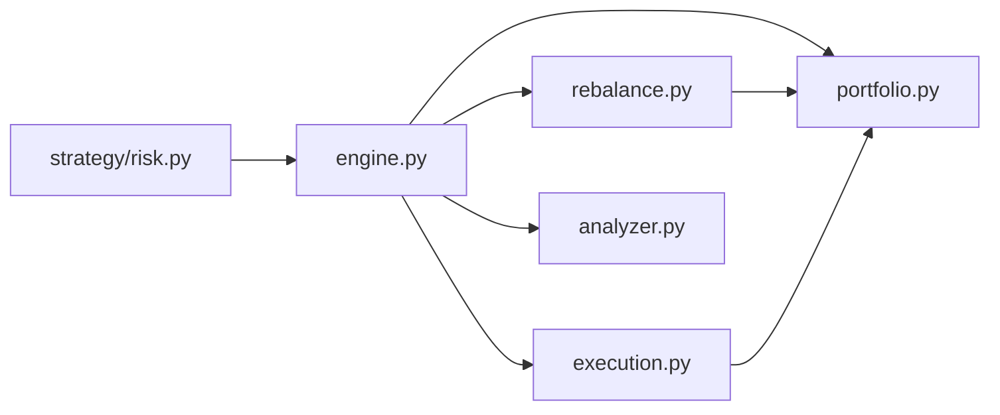

# 风险控制机制

<cite>
**本文引用的文件**
- [risk.py](file://projects/Project_10_价值小盘V2/strategy/risk.py)
- [engine.py](file://backtest/engine.py)
- [execution.py](file://backtest/execution.py)
- [portfolio.py](file://backtest/portfolio.py)
- [rebalance.py](file://backtest/rebalance.py)
- [analyzer.py](file://backtest/analyzer.py)
- [settings.yaml](file://config/settings.yaml)
- [strategy.yaml](file://projects/Project_10_价值小盘V2/config/strategy.yaml)
- [monitoring_indicators.md](file://projects/verification/results/monitoring_indicators.md)
- [run_grid_validation.py](file://projects/Project_10_价值小盘V2/run_grid_validation.py)
- [volatility.py](file://factors/volatility.py)
</cite>

## 目录
1. [引言](#引言)
2. [项目结构](#项目结构)
3. [核心组件](#核心组件)
4. [架构总览](#架构总览)
5. [详细组件分析](#详细组件分析)
6. [依赖关系分析](#依赖关系分析)
7. [性能与风控特性](#性能与风控特性)
8. [故障排查指南](#故障排查指南)
9. [结论](#结论)
10. [附录](#附录)

## 引言
本文件为 QuantLab 的风险控制机制提供系统化、可落地的文档。内容覆盖仓位管理策略（单票限制、行业集中度、总仓位、动态调仓）、止损止盈机制（固定止损、移动止损、时间止损、条件止盈）、异常处理框架（网络、数据、执行、系统）、熔断机制设计（市场、个股、策略、系统）以及风险指标监控（VaR、最大回撤、波动率、相关性）。文档同时给出架构图、流程图和时序图，帮助非技术读者理解实现思路，并为研发人员提供精确的文件定位与行号引用。

## 项目结构
QuantLab 的风险控制由“策略层 + 回测引擎 + 组合账本 + 执行撮合 + 指标计算”共同构成：
- 策略层：RiskController 负责个股止损、组合回撤分层降仓、持有期与换手限制等规则。
- 回测引擎：统一调度策略评估、权重到决策转换、执行撮合与组合记账。
- 组合账本：维护现金、持仓、市值、未实现盈亏与 T+1 可用量。
- 执行撮合：模拟涨跌停、滑点、手续费、印花税与最小交易单位约束。
- 指标计算：年化收益、夏普、最大回撤、胜率、跟踪误差与信息比率等。

图表来源
- [engine.py:237-320](file://backtest/engine.py#L237-L320)
- [rebalance.py:101-200](file://backtest/rebalance.py#L101-L200)
- [execution.py:95-204](file://backtest/execution.py#L95-L204)
- [portfolio.py:38-150](file://backtest/portfolio.py#L38-L150)
- [analyzer.py:96-176](file://backtest/analyzer.py#L96-L176)
- [settings.yaml:22-35](file://config/settings.yaml#L22-L35)
- [strategy.yaml:43-56](file://projects/Project_10_价值小盘V2/config/strategy.yaml#L43-L56)

章节来源
- [engine.py:237-320](file://backtest/engine.py#L237-L320)
- [rebalance.py:101-200](file://backtest/rebalance.py#L101-L200)
- [execution.py:95-204](file://backtest/execution.py#L95-L204)
- [portfolio.py:38-150](file://backtest/portfolio.py#L38-L150)
- [analyzer.py:96-176](file://backtest/analyzer.py#L96-L176)
- [settings.yaml:22-35](file://config/settings.yaml#L22-L35)
- [strategy.yaml:43-56](file://projects/Project_10_价值小盘V2/config/strategy.yaml#L43-L56)

## 核心组件
- RiskController：实现个股止损（固定或 ATR 自适应）、组合回撤分层降仓、最长持有期、单日换手上限、禁入列表与状态持久化。
- Portfolio：记录现金、市值、未实现盈亏、T+1 可用量，支持按日标记市价与生成权益曲线与持仓快照。
- Execution：基于 next_open 模型进行买卖撮合，考虑涨跌停、滑点、手续费、印花税与最小交易单位。
- Rebalance：将策略输出的目标权重转换为 sell/buy 决策，内置行业集中度上限、最大持仓数、最小头寸值、波动率目标与杠杆上限。
- Analyzer：计算年化收益、夏普、最大回撤、胜率、信息比率、跟踪误差等关键指标。
- Engine：串联 reader -> strategy -> rebalance -> execution -> portfolio -> analyzer，输出完整回测结果与诊断信息。

章节来源
- [risk.py:15-195](file://projects/Project_10_价值小盘V2/strategy/risk.py#L15-L195)
- [portfolio.py:38-189](file://backtest/portfolio.py#L38-L189)
- [execution.py:27-204](file://backtest/execution.py#L27-L204)
- [rebalance.py:101-281](file://backtest/rebalance.py#L101-L281)
- [analyzer.py:96-176](file://backtest/analyzer.py#L96-L176)
- [engine.py:237-619](file://backtest/engine.py#L237-L619)

## 架构总览
下图展示从策略信号到执行与风控的端到端流程，突出风控在权重分配与执行阶段的介入点。

图表来源
- [engine.py:408-441](file://backtest/engine.py#L408-L441)
- [rebalance.py:101-200](file://backtest/rebalance.py#L101-L200)
- [execution.py:95-204](file://backtest/execution.py#L95-L204)
- [portfolio.py:103-150](file://backtest/portfolio.py#L103-L150)
- [analyzer.py:96-176](file://backtest/analyzer.py#L96-L176)

## 详细组件分析

### 仓位管理策略
- 单票仓位限制
  - 通过 Rebalance 的 max_positions 与 min_position_value 过滤，确保单票权重不低于最低头寸阈值，避免过碎头寸。
  - 等权/波动率平价/自定义权重三种 sizing 模式，结合 vol_target 与 target_leverage 控制整体敞口。
- 行业集中度控制
  - _apply_industry_cap 对每个行业的总权重按比例压缩至 industry_cap，防止单一行业暴露过高。
- 总仓位管理
  - vol_target 先估算组合波动率，再按 vt_scale 调整权重，并以 target_leverage 作为硬上限，保证 gross 不超过杠杆上限。
- 动态调仓逻辑
  - 对比当前持仓与目标权重，生成 sell/buy 决策；不在目标中的持仓触发全清；已持仓但权重变化则部分减仓或加仓。

图表来源
- [rebalance.py:101-200](file://backtest/rebalance.py#L101-L200)
- [rebalance.py:202-281](file://backtest/rebalance.py#L202-L281)

章节来源
- [rebalance.py:101-281](file://backtest/rebalance.py#L101-L281)

### 止损止盈机制
- 固定止损
  - RiskController.stop_threshold 默认使用固定百分比（如 8%），当持仓亏损超过阈值即卖出。
- ATR 自适应止损（可选）
  - 开启 atr_stop 后，止损阈值 = min(multiplier × ATR%, stop_cap)，更贴合波动环境。
- 移动止损（建议扩展）
  - 可在 update_holdings 中引入最高收盘价追踪，以入场价或最高价的回撤比例触发卖出。
- 时间止损
  - 通过 max_holding_days 强制退出长期未达预期的持仓。
- 条件止盈（建议扩展）
  - 可在策略层或 Rebalance 层增加止盈条件（如达到目标收益或波动率突破），生成 sell 决策。

图表来源
- [risk.py:74-110](file://projects/Project_10_价值小盘V2/strategy/risk.py#L74-L110)

章节来源
- [risk.py:15-195](file://projects/Project_10_价值小盘V2/strategy/risk.py#L15-L195)

### 组合回撤与分层降仓
- 一刀切回撤（兼容旧口径）
  - check_drawdown 在净值跌破峰值一定比例时触发清仓。
- 分层降仓（推荐）
  - check_drawdown_tiered 根据回撤阈值逐步降低目标仓位比例（如 10%→70%仓，15%→40%仓，20%→清仓），带状态防重触发，创净值新高时重置层级。

图表来源
- [risk.py:125-157](file://projects/Project_10_价值小盘V2/strategy/risk.py#L125-L157)

章节来源
- [risk.py:112-157](file://projects/Project_10_价值小盘V2/strategy/risk.py#L112-L157)

### 执行与撮合（含涨跌停保护）
- next_open 模型：T 日收盘信号，T+1 开盘成交。
- 涨跌停保护：买入在涨停开盘被拒绝，卖出在跌停开盘被拒绝。
- 成本与滑点：按配置计算滑点、佣金与印花税，并按最小交易单位（100 股）向下取整。
- 部分减仓：支持 target_cash 指定卖出金额，不足一手则拒绝。

图表来源
- [execution.py:155-204](file://backtest/execution.py#L155-L204)
- [execution.py:95-153](file://backtest/execution.py#L95-L153)

章节来源
- [execution.py:27-204](file://backtest/execution.py#L27-L204)

### 组合账本与 T+1 规则
- 买入：新买股份当日不可用（available_volume=0），次日 advance_holding_days 解冻。
- 卖出：按可用量扣减，若持仓清零则移除记录。
- 每日标记市价：根据 close 或最后已知 close 更新 last_price 与 unrealized_pnl。

章节来源
- [portfolio.py:38-189](file://backtest/portfolio.py#L38-L189)

### 风险指标监控
- 最大回撤：_max_drawdown 计算历史净值相对峰值的最大跌幅。
- 夏普比率：基于日收益率均值与标准差，按 252 年化处理。
- 胜率与平均持有期：配对买卖交易统计。
- 基准超额与信息比率：在有基准序列时计算 excess_return、information_ratio、tracking_error。
- 波动率估计：ann_vol 用于 vol-parity 与 ex-ante 组合波动率估算。

章节来源
- [analyzer.py:96-176](file://backtest/analyzer.py#L96-L176)
- [volatility.py:1-26](file://factors/volatility.py#L1-L26)

## 依赖关系分析
- Engine 依赖 Strategy Registry、Execution、Portfolio、Analyzer、Rebalance。
- Rebalance 依赖 Portfolio 当前持仓与总资产、市场窗口（用于波动率估算）与行业映射。
- Execution 依赖市场窗口（获取 T+1 开盘价与涨跌停判断）。
- Analyzer 依赖 equity_rows 与 trades 列表。
- RiskController 独立于回测主循环，通过策略侧调用参与风控决策。

图表来源
- [engine.py:237-320](file://backtest/engine.py#L237-L320)
- [rebalance.py:101-200](file://backtest/rebalance.py#L101-L200)
- [execution.py:95-204](file://backtest/execution.py#L95-L204)
- [portfolio.py:38-150](file://backtest/portfolio.py#L38-L150)
- [analyzer.py:96-176](file://backtest/analyzer.py#L96-L176)
- [risk.py:15-195](file://projects/Project_10_价值小盘V2/strategy/risk.py#L15-L195)

章节来源
- [engine.py:237-320](file://backtest/engine.py#L237-L320)
- [rebalance.py:101-200](file://backtest/rebalance.py#L101-L200)
- [execution.py:95-204](file://backtest/execution.py#L95-L204)
- [portfolio.py:38-150](file://backtest/portfolio.py#L38-L150)
- [analyzer.py:96-176](file://backtest/analyzer.py#L96-L176)
- [risk.py:15-195](file://projects/Project_10_价值小盘V2/strategy/risk.py#L15-L195)

## 性能与风控特性
- 回测性能
  - Engine 使用预计算的 cut_index 与 O(1) 切片，提升每日窗口读取效率。
  - Analyzer 使用纯 Python 数学运算，避免外部库依赖，便于短样本稳健计算。
- 风控特性
  - ATR 自适应止损与分层降仓减少极端行情下的损失放大。
  - 行业集中度上限与最大持仓数控制分散度与流动性风险。
  - 波动率目标与杠杆上限避免过度风险暴露。
  - 执行层涨跌停保护与最小交易单位约束贴近真实交易环境。

章节来源
- [engine.py:121-146](file://backtest/engine.py#L121-L146)
- [analyzer.py:11-44](file://backtest/analyzer.py#L11-L44)
- [rebalance.py:179-195](file://backtest/rebalance.py#L179-L195)
- [execution.py:27-46](file://backtest/execution.py#L27-L46)

## 故障排查指南
- 常见执行失败原因
  - below_min_lot：资金不足以购买至少一手（100 股）。
  - limit_up_at_open / limit_down_at_open：开盘涨跌停导致无法成交。
  - suspended：标的停牌无开盘数据。
  - no_available_volume：T+1 可用量为零。
- 日志定位
  - Engine 在撮合失败时记录 unfilled_order 与 reason，便于回溯。
- 风控参数调整建议
  - 若频繁 below_min_lot，提高初始资金或降低目标权重。
  - 若频繁涨跌停拒绝，考虑放宽滑点或调整选股范围。
  - 若回撤频繁触发分层降仓，检查 atr_multiplier 与 tiered thresholds。

章节来源
- [execution.py:155-204](file://backtest/execution.py#L155-L204)
- [engine.py:328-371](file://backtest/engine.py#L328-L371)
- [monitoring_indicators.md:1-69](file://projects/verification/results/monitoring_indicators.md#L1-L69)

## 结论
QuantLab 的风险控制体系以 RiskController 为核心，结合 Rebalance 的权重约束与 Execution 的真实撮合约束，形成从策略到执行的闭环风控。ATR 自适应止损与分层降仓提升了极端行情的鲁棒性；行业集中度、最大持仓数、波动率目标与杠杆上限有效控制了组合风险暴露。建议在后续版本中补充移动止损与条件止盈，并完善 VaR 与相关性监控模块，以实现更全面的风险度量与预警。

## 附录
- 配置参考
  - settings.yaml：回测基础参数（起始日期、初始资金、滑点、佣金、基准）。
  - strategy.yaml：项目级风控参数（止损比例、最大回撤、持有期、换手上限、ATR 与分层降仓开关）。
- 网格验证与状态文件
  - run_grid_validation.py：不同风控变体的网格测试入口。
  - risk_state.json：RiskController 的状态持久化（持仓、净值峰值、禁入列表）。

章节来源
- [settings.yaml:22-35](file://config/settings.yaml#L22-L35)
- [strategy.yaml:43-56](file://projects/Project_10_价值小盘V2/config/strategy.yaml#L43-L56)
- [run_grid_validation.py:166-185](file://projects/Project_10_价值小盘V2/run_grid_validation.py#L166-L185)
- [risk.py:39-61](file://projects/Project_10_价值小盘V2/strategy/risk.py#L39-L61)