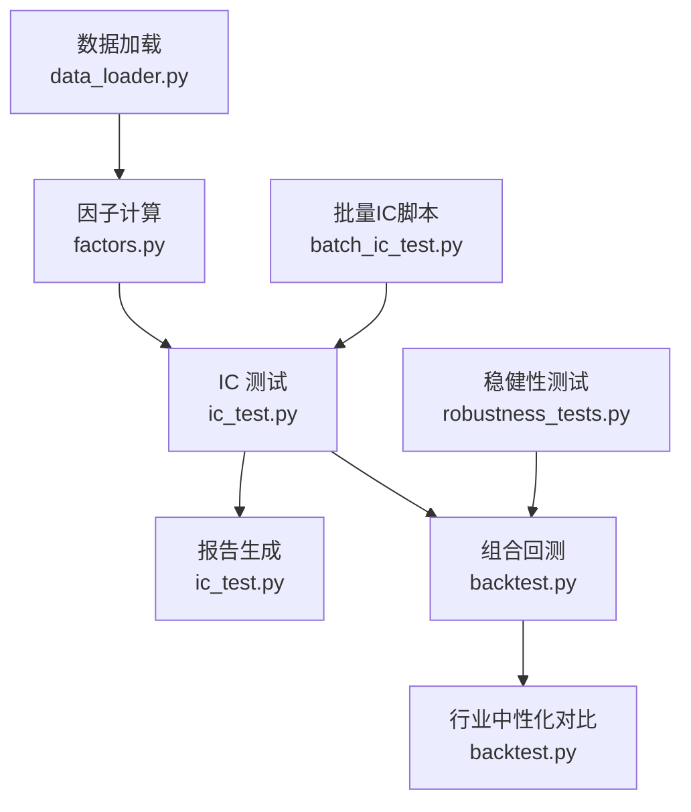
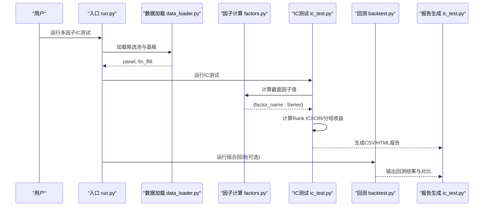
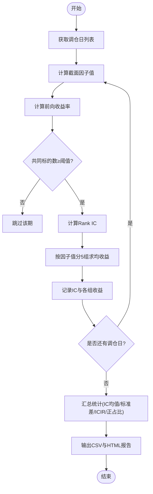
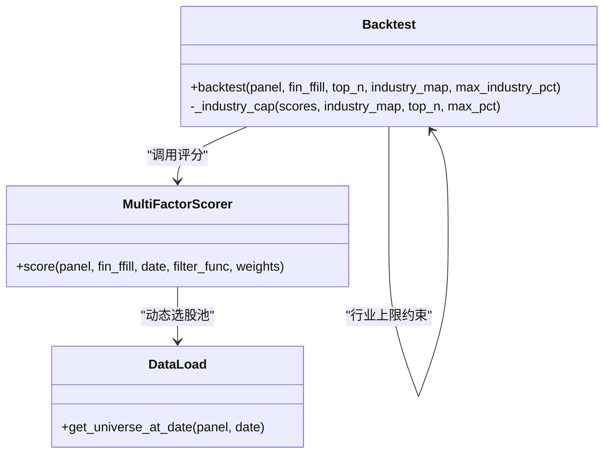
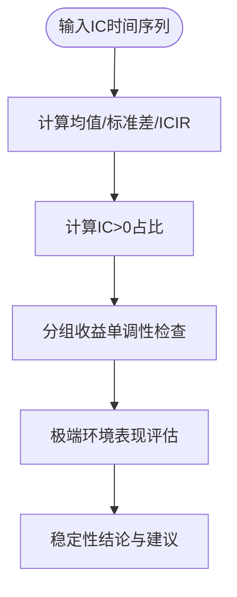
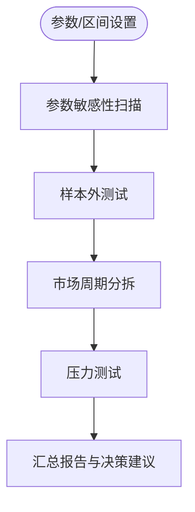
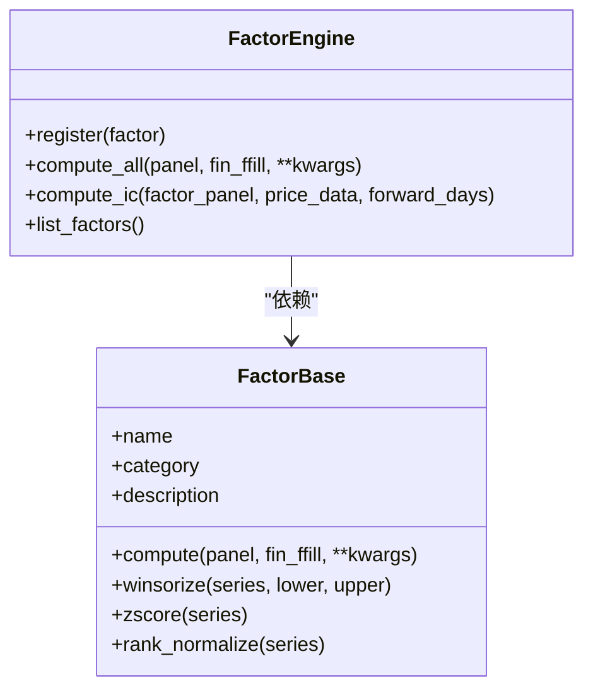
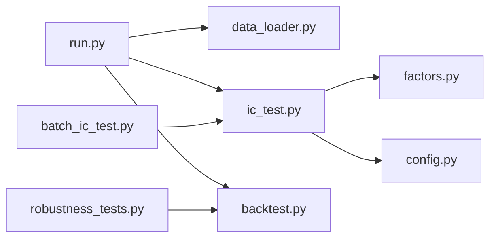

# 因子有效性验证

<cite>
**本文引用的文件**   
- [ic_test.py](file://projects/Project_01_多因子IC小盘Alpha/research/multi_factor_ic/ic_test.py)
- [factors.py](file://projects/Project_01_多因子IC小盘Alpha/research/multi_factor_ic/factors.py)
- [data_loader.py](file://projects/Project_01_多因子IC小盘Alpha/research/multi_factor_ic/data_loader.py)
- [config.py](file://projects/Project_01_多因子IC小盘Alpha/research/multi_factor_ic/config.py)
- [run.py](file://projects/Project_01_多因子IC小盘Alpha/research/multi_factor_ic/run.py)
- [backtest.py](file://projects/Project_01_多因子IC小盘Alpha/research/multi_factor_ic/backtest.py)
- [base.py](file://factors/base.py)
- [engine.py](file://factors/engine.py)
- [batch_ic_test.py](file://scripts/batch_ic_test.py)
- [robustness_tests.py](file://projects/verification/robustness_tests.py)
</cite>

## 目录
1. [引言](#引言)
2. [项目结构](#项目结构)
3. [核心组件](#核心组件)
4. [架构总览](#架构总览)
5. [详细组件分析](#详细组件分析)
6. [依赖关系分析](#依赖关系分析)
7. [性能考量](#性能考量)
8. [故障排查指南](#故障排查指南)
9. [结论](#结论)
10. [附录：报告解读与使用指南](#附录报告解读与使用指南)

## 引言
本文件面向 QuantLab 的因子有效性验证，系统化说明 IC（信息系数）分析方法、因子中性化处理、稳定性检验与鲁棒性测试方法，并给出可操作的验证工具与报告解读指南。内容覆盖 Rank IC、ICIR、分组回测、行业/市值/风格中性化、时间序列稳定性、截面相关性、极端市场环境表现、参数敏感性、样本外测试与不同市场周期表现等关键主题。

## 项目结构
本项目围绕“数据加载—因子计算—IC测试—分组回测—报告生成”的主线组织代码，主要模块如下：
- 数据层：面板构建、财务数据前向填充、动态选股池
- 因子层：因子定义、预处理（截尾、标准化）、批量计算
- 验证层：Rank IC、ICIR、分组收益、HTML 报告
- 回测层：月度调仓、等权持仓、交易成本、行业约束
- 稳健性层：子样本、牛熊分拆、压力测试、容量估算、未来函数与幸存者偏差检查

图表来源
- [data_loader.py:66-121](file://projects/Project_01_多因子IC小盘Alpha/research/multi_factor_ic/data_loader.py#L66-L121)
- [factors.py:34-139](file://projects/Project_01_多因子IC小盘Alpha/research/multi_factor_ic/factors.py#L34-L139)
- [ic_test.py:78-163](file://projects/Project_01_多因子IC小盘Alpha/research/multi_factor_ic/ic_test.py#L78-L163)
- [backtest.py:47-170](file://projects/Project_01_多因子IC小盘Alpha/research/multi_factor_ic/backtest.py#L47-L170)
- [batch_ic_test.py:100-186](file://scripts/batch_ic_test.py#L100-L186)
- [robustness_tests.py:221-266](file://projects/verification/robustness_tests.py#L221-L266)

章节来源
- [data_loader.py:19-51](file://projects/Project_01_多因子IC小盘Alpha/research/multi_factor_ic/data_loader.py#L19-L51)
- [config.py:1-47](file://projects/Project_01_多因子IC小盘Alpha/research/multi_factor_ic/config.py#L1-L47)
- [run.py:24-66](file://projects/Project_01_多因子IC小盘Alpha/research/multi_factor_ic/run.py#L24-L66)

## 核心组件
- 数据加载与面板构建：提供动态滚动选股池、财务指标前向填充、ST/停牌过滤
- 因子计算与预处理：统一截尾与标准化，支持价值、质量、动量、情绪、量价等多类因子
- IC 测试框架：按调仓日计算 Rank IC、ICIR、分组收益，输出 CSV/HTML 报告
- 组合回测：月度调仓、等权持仓、交易成本、行业上限约束、绩效指标统计
- 稳健性测试：子样本、牛熊市分拆、极端事件压力、成本压力、容量估算、未来函数与幸存者偏差检查

章节来源
- [data_loader.py:66-121](file://projects/Project_01_多因子IC小盘Alpha/research/multi_factor_ic/data_loader.py#L66-L121)
- [factors.py:8-16](file://projects/Project_01_多因子IC小盘Alpha/research/multi_factor_ic/factors.py#L8-L16)
- [ic_test.py:48-76](file://projects/Project_01_多因子IC小盘Alpha/research/multi_factor_ic/ic_test.py#L48-L76)
- [backtest.py:47-170](file://projects/Project_01_多因子IC小盘Alpha/research/multi_factor_ic/backtest.py#L47-L170)
- [robustness_tests.py:35-71](file://projects/verification/robustness_tests.py#L35-L71)

## 架构总览
下图展示从数据到报告的端到端流程，以及各模块之间的调用关系。

图表来源
- [run.py:24-66](file://projects/Project_01_多因子IC小盘Alpha/research/multi_factor_ic/run.py#L24-L66)
- [data_loader.py:66-121](file://projects/Project_01_多因子IC小盘Alpha/research/multi_factor_ic/data_loader.py#L66-L121)
- [factors.py:34-139](file://projects/Project_01_多因子IC小盘Alpha/research/multi_factor_ic/factors.py#L34-L139)
- [ic_test.py:78-163](file://projects/Project_01_多因子IC小盘Alpha/research/multi_factor_ic/ic_test.py#L78-L163)
- [backtest.py:47-170](file://projects/Project_01_多因子IC小盘Alpha/research/multi_factor_ic/backtest.py#L47-L170)

## 详细组件分析

### IC 分析方法（Rank IC、ICIR、分组回测）
- Rank IC：对每个调仓日，计算因子值与未来持有期收益率的 Spearman 秩相关；样本不足时返回空值
- ICIR：IC均值除以IC标准差，衡量因子稳定性与方向一致性
- 分组回测：将股票按因子值分为 Q1~Q5，计算各组平均收益，观察单调性与超额收益
- 报告输出：生成 ic_statistics.csv、ic_series.csv、group_returns.csv 与 HTML 报告

图表来源
- [ic_test.py:78-163](file://projects/Project_01_多因子IC小盘Alpha/research/multi_factor_ic/ic_test.py#L78-L163)
- [ic_test.py:18-28](file://projects/Project_01_多因子IC小盘Alpha/research/multi_factor_ic/ic_test.py#L18-L28)
- [ic_test.py:48-76](file://projects/Project_01_多因子IC小盘Alpha/research/multi_factor_ic/ic_test.py#L48-L76)

章节来源
- [ic_test.py:48-76](file://projects/Project_01_多因子IC小盘Alpha/research/multi_factor_ic/ic_test.py#L48-L76)
- [ic_test.py:117-163](file://projects/Project_01_多因子IC小盘Alpha/research/multi_factor_ic/ic_test.py#L117-L163)
- [batch_ic_test.py:120-186](file://scripts/batch_ic_test.py#L120-L186)

### 因子中性化处理（行业中性化、市值中性化、风格因子控制）
- 行业中性化：在评分排序基础上限制单行业最大权重比例，避免行业暴露过度集中
- 市值中性化：通过动态滚动选股池（按市值排名区间）消除静态池带来的生存偏差
- 风格因子控制：在因子合成阶段对各子因子进行归一化与加权，降低单一风格主导风险

图表来源
- [backtest.py:14-39](file://projects/Project_01_多因子IC小盘Alpha/research/multi_factor_ic/backtest.py#L14-L39)
- [backtest.py:47-170](file://projects/Project_01_多因子IC小盘Alpha/research/multi_factor_ic/backtest.py#L47-L170)
- [data_loader.py:35-51](file://projects/Project_01_多因子IC小盘Alpha/research/multi_factor_ic/data_loader.py#L35-L51)

章节来源
- [backtest.py:14-39](file://projects/Project_01_多因子IC小盘Alpha/research/multi_factor_ic/backtest.py#L14-L39)
- [data_loader.py:35-51](file://projects/Project_01_多因子IC小盘Alpha/research/multi_factor_ic/data_loader.py#L35-L51)

### 因子稳定性检验（时间序列稳定性、截面相关性、极端市场环境表现）
- 时间序列稳定性：通过 IC 时间序列的均值、标准差与 ICIR 评估；正占比衡量方向一致性
- 截面相关性：分组收益单调性与组间差异反映截面预测能力
- 极端市场环境表现：结合稳健性测试中的牛熊市分拆与压力场景，观察策略在不同环境下的回撤与收益

图表来源
- [ic_test.py:117-163](file://projects/Project_01_多因子IC小盘Alpha/research/multi_factor_ic/ic_test.py#L117-L163)
- [robustness_tests.py:74-110](file://projects/verification/robustness_tests.py#L74-L110)

章节来源
- [ic_test.py:117-163](file://projects/Project_01_多因子IC小盘Alpha/research/multi_factor_ic/ic_test.py#L117-L163)
- [robustness_tests.py:74-110](file://projects/verification/robustness_tests.py#L74-L110)

### 鲁棒性测试方法（参数敏感性、样本外测试、不同市场周期表现）
- 参数敏感性：调整因子权重、持有期、交易成本等，观察绩效变化
- 样本外测试：划分训练/测试区间，确保无未来数据泄漏
- 不同市场周期表现：子样本分段、牛市/熊市分拆、极端事件压力测试

图表来源
- [robustness_tests.py:35-71](file://projects/verification/robustness_tests.py#L35-L71)
- [robustness_tests.py:74-110](file://projects/verification/robustness_tests.py#L74-L110)
- [robustness_tests.py:113-141](file://projects/verification/robustness_tests.py#L113-L141)

章节来源
- [robustness_tests.py:35-71](file://projects/verification/robustness_tests.py#L35-L71)
- [robustness_tests.py:74-110](file://projects/verification/robustness_tests.py#L74-L110)
- [robustness_tests.py:113-141](file://projects/verification/robustness_tests.py#L113-L141)

### 因子引擎与基类（扩展与复用）
- FactorBase：提供通用预处理方法（截尾、Z-score、秩标准化）
- FactorEngine：注册与批量计算因子，并提供统一的 IC 计算方法（Pearson/秩相关）

图表来源
- [base.py:9-52](file://factors/base.py#L9-L52)
- [engine.py:9-86](file://factors/engine.py#L9-L86)

章节来源
- [base.py:9-52](file://factors/base.py#L9-L52)
- [engine.py:9-86](file://factors/engine.py#L9-L86)

## 依赖关系分析
- 数据依赖：日线行情、基础信息、财务指标（Parquet）
- 模块耦合：run.py 协调 data_loader、ic_test、backtest；ic_test 依赖 factors 与 config
- 外部脚本：batch_ic_test.py 用于批量因子 IC 筛选；robustness_tests.py 提供稳健性报告

图表来源
- [run.py:24-66](file://projects/Project_01_多因子IC小盘Alpha/research/multi_factor_ic/run.py#L24-L66)
- [ic_test.py:78-163](file://projects/Project_01_多因子IC小盘Alpha/research/multi_factor_ic/ic_test.py#L78-L163)
- [backtest.py:47-170](file://projects/Project_01_多因子IC小盘Alpha/research/multi_factor_ic/backtest.py#L47-L170)
- [batch_ic_test.py:100-186](file://scripts/batch_ic_test.py#L100-L186)
- [robustness_tests.py:221-266](file://projects/verification/robustness_tests.py#L221-L266)

章节来源
- [run.py:24-66](file://projects/Project_01_多因子IC小盘Alpha/research/multi_factor_ic/run.py#L24-L66)
- [data_loader.py:66-121](file://projects/Project_01_多因子IC小盘Alpha/research/multi_factor_ic/data_loader.py#L66-L121)
- [factors.py:34-139](file://projects/Project_01_多因子IC小盘Alpha/research/multi_factor_ic/factors.py#L34-L139)

## 性能考量
- 面板计算优化：使用宽表与向量化操作（如 rolling corr）减少 groupby-apply 开销
- 内存与I/O：Parquet 存储与按需读取，避免全量加载；合理过滤 ST/停牌与无效标的
- 计算复杂度：IC 计算为 O(N×D)，N 为标的数，D 为交易日数；分组收益与排序为 O(N log N)
- 批处理与并行：批量 IC 脚本适合多因子并行计算；注意进程/线程资源分配

[本节为通用指导，不直接分析具体文件]

## 故障排查指南
- 数据缺失或过少：检查日期范围、标的过滤条件与最小样本阈值；确认财务数据前向填充有效
- IC 计算异常：确认共同标的数量、Spearman 秩相关实现与 NaN 处理；必要时放宽样本阈值
- 回测结果不稳定：检查调仓频率、交易成本、行业上限与动态选股池配置；核对入场/出场价格逻辑
- 报告未生成：确认输出目录权限与路径配置；检查中间 DataFrame 是否为空

章节来源
- [ic_test.py:78-114](file://projects/Project_01_多因子IC小盘Alpha/research/multi_factor_ic/ic_test.py#L78-L114)
- [backtest.py:47-170](file://projects/Project_01_多因子IC小盘Alpha/research/multi_factor_ic/backtest.py#L47-L170)
- [data_loader.py:66-121](file://projects/Project_01_多因子IC小盘Alpha/research/multi_factor_ic/data_loader.py#L66-L121)

## 结论
QuantLab 提供了完整的因子有效性验证流水线：从数据准备、因子计算、IC 分析与分组回测，到行业/市值/风格中性化与稳健性测试。通过标准化的报告输出与可扩展的因子引擎，用户可以高效地评估因子有效性、识别稳定信号并进行策略迭代。建议在正式使用前，结合业务需求调整中性化与风控参数，并通过样本外与压力测试验证策略稳健性。

[本节为总结性内容，不直接分析具体文件]

## 附录：报告解读与使用指南
- IC 统计摘要：关注 IC均值、IC标准差、ICIR、IC>0占比与样本数；参考阈值 |IC|>0.03、ICIR>0.5、IC>0占比>55%
- 分组收益：观察 Q1~Q5 的收益单调性与组间差异，判断因子预测能力
- 回测对比：比较行业中性化前后绩效，关注年化收益、最大回撤、换手与交易成本影响
- 稳健性报告：查看子样本、牛熊市分拆、压力测试结果，评估策略在不同环境下的表现

章节来源
- [ic_test.py:117-163](file://projects/Project_01_多因子IC小盘Alpha/research/multi_factor_ic/ic_test.py#L117-L163)
- [backtest.py:317-348](file://projects/Project_01_多因子IC小盘Alpha/research/multi_factor_ic/backtest.py#L317-L348)
- [robustness_tests.py:221-266](file://projects/verification/robustness_tests.py#L221-L266)