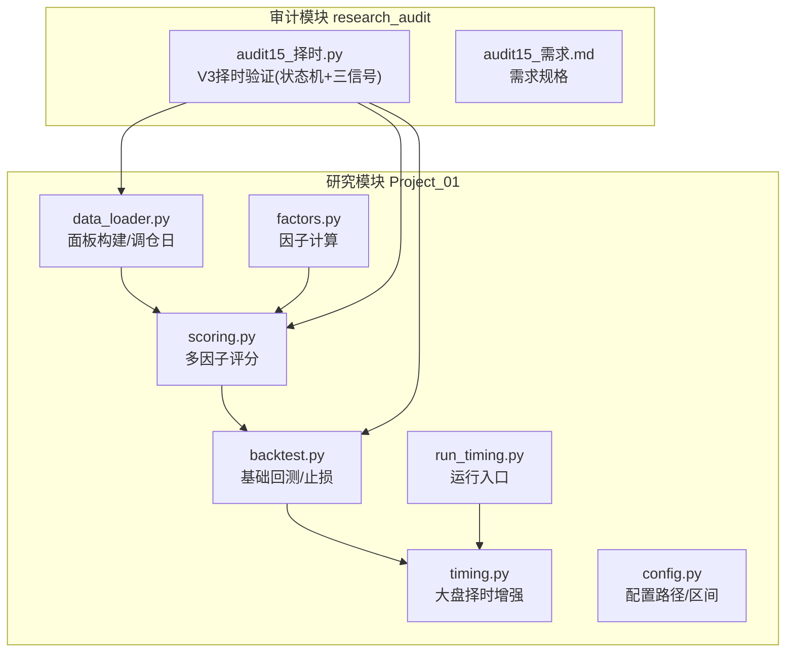
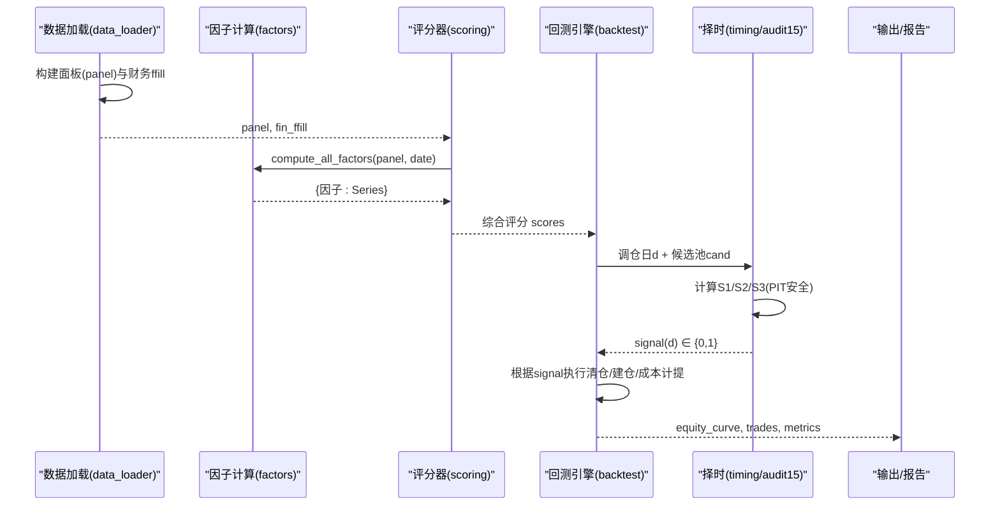
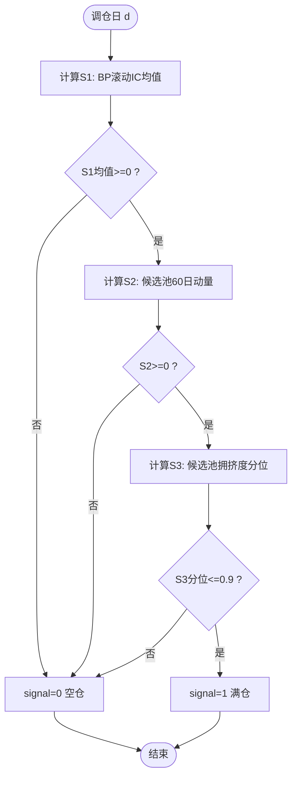
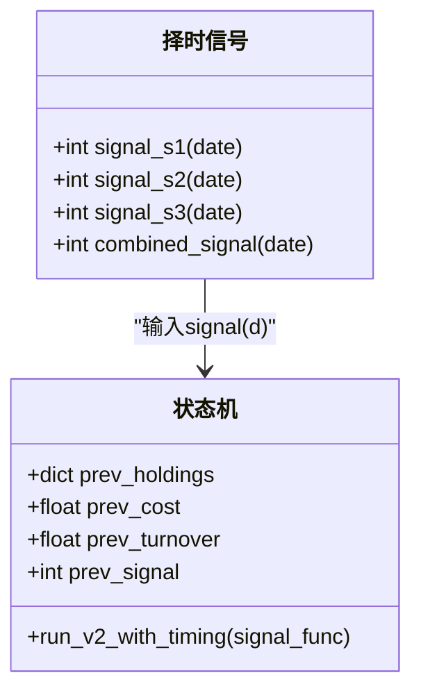
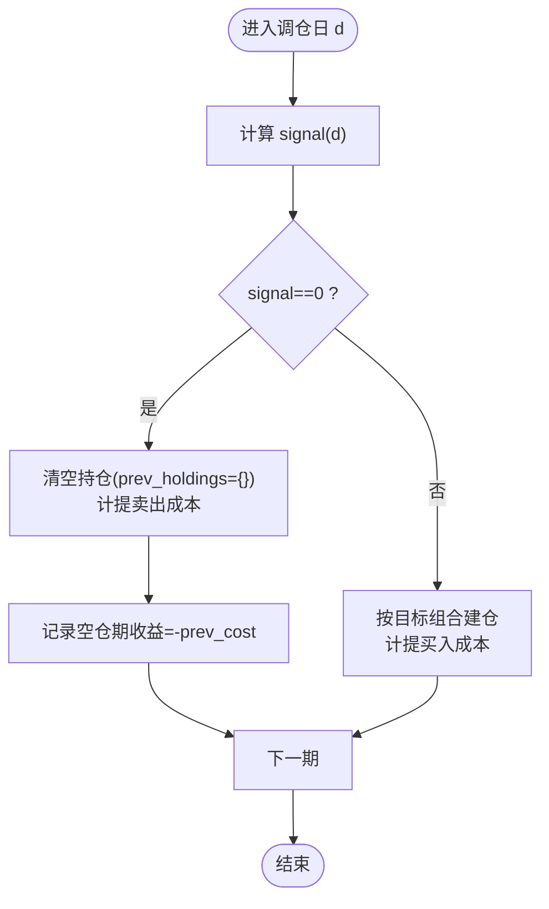
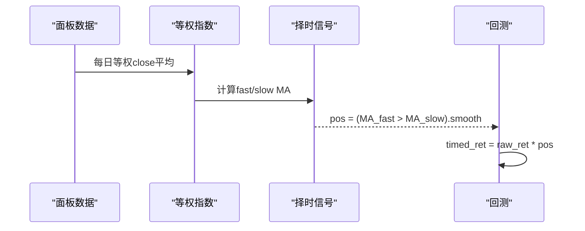
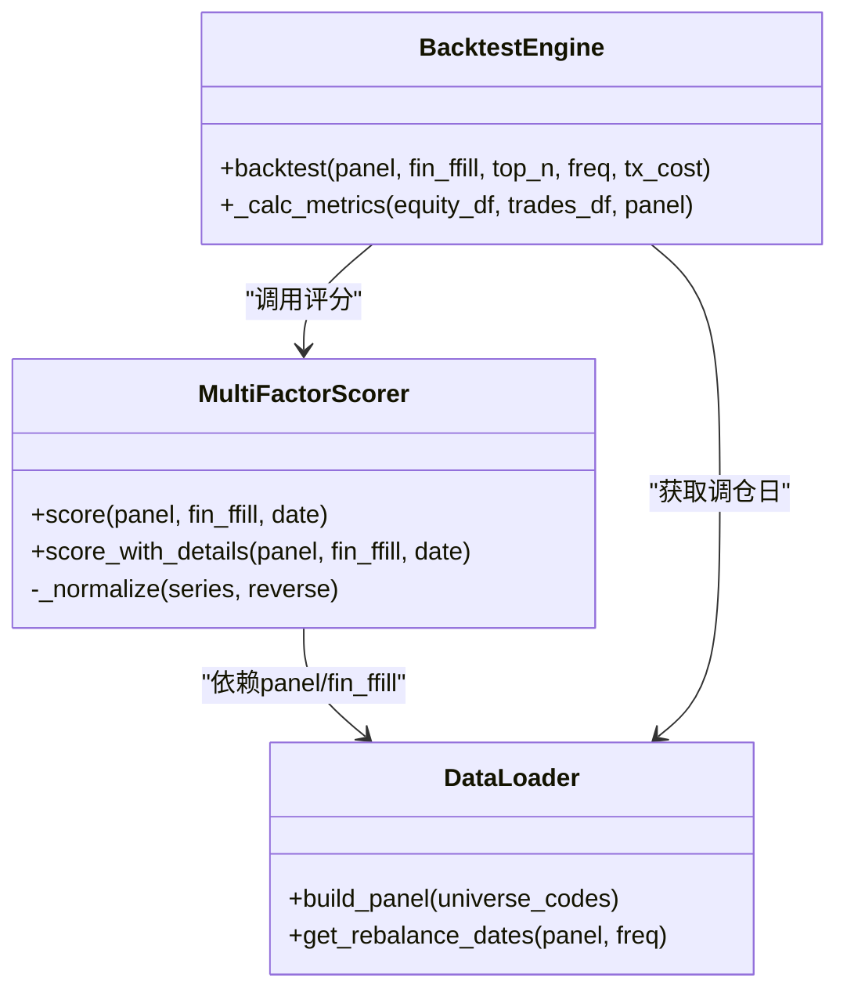
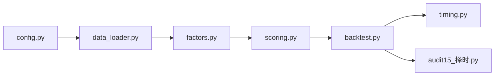

# 择时验证框架

<cite>
**本文引用的文件**   
- [timing.py](file://projects/Project_01_多因子IC小盘Alpha/research/multi_factor_ic/timing.py)
- [run_timing.py](file://projects/Project_01_多因子IC小盘Alpha/research/multi_factor_ic/run_timing.py)
- [backtest.py](file://projects/Project_01_多因子IC小盘Alpha/research/multi_factor_ic/backtest.py)
- [scoring.py](file://projects/Project_01_多因子IC小盘Alpha/research/multi_factor_ic/scoring.py)
- [data_loader.py](file://projects/Project_01_多因子IC小盘Alpha/research/multi_factor_ic/data_loader.py)
- [factors.py](file://projects/Project_01_多因子IC小盘Alpha/research/multi_factor_ic/factors.py)
- [config.py](file://projects/Project_01_多因子IC小盘Alpha/research/multi_factor_ic/config.py)
- [audit15_择时.py](file://research_audit/audit15_择时.py)
- [audit15_需求.md](file://research_audit/audit15_需求.md)
- [全局复利与踩坑日志.md](file://全局复利与踩坑日志.md)
</cite>

## 目录
1. [引言](#引言)
2. [项目结构](#项目结构)
3. [核心组件](#核心组件)
4. [架构总览](#架构总览)
5. [详细组件分析](#详细组件分析)
6. [依赖关系分析](#依赖关系分析)
7. [性能与计算特性](#性能与计算特性)
8. [故障排查指南](#故障排查指南)
9. [结论](#结论)
10. [附录：实现示例与结果解读](#附录实现示例与结果解读)

## 引言
本文件为 QuantLab 的“择时验证框架”文档，聚焦于在价值小盘多因子策略之上叠加风格择时开关（空仓/满仓），以评估不同择时信号对超额收益、换手率与市场周期表现的影响。框架严格遵循 PIT（Point-in-Time）安全原则，确保所有择时信号仅使用当前及历史数据，杜绝未来信息泄漏。文档涵盖：
- 择时信号设计：BP 因子滚动 IC、候选池动量、候选池拥挤度等
- 组合规则：单一信号验证、多信号组合、触发条件设置
- 空仓期处理：持仓管理、收益计算、恢复建仓逻辑
- 效果评估：超额收益改善、换手率影响、不同市场周期表现分析
- 具体实现路径与结果解读

## 项目结构
择时验证相关代码主要分布在两个位置：
- 研究模块（Project_01）：提供基础回测、评分器、数据加载与大盘择时增强脚本
- 审计模块（research_audit）：提供 V3 择时增强验证脚本与需求说明

图表来源
- [data_loader.py:124-151](file://projects/Project_01_多因子IC小盘Alpha/research/multi_factor_ic/data_loader.py#L124-L151)
- [factors.py:34-140](file://projects/Project_01_多因子IC小盘Alpha/research/multi_factor_ic/factors.py#L34-L140)
- [scoring.py:40-139](file://projects/Project_01_多因子IC小盘Alpha/research/multi_factor_ic/scoring.py#L40-L139)
- [backtest.py:47-170](file://projects/Project_01_多因子IC小盘Alpha/research/multi_factor_ic/backtest.py#L47-L170)
- [timing.py:14-49](file://projects/Project_01_多因子IC小盘Alpha/research/multi_factor_ic/timing.py#L14-L49)
- [run_timing.py:18-24](file://projects/Project_01_多因子IC小盘Alpha/research/multi_factor_ic/run_timing.py#L18-L24)
- [config.py:1-47](file://projects/Project_01_多因子IC小盘Alpha/research/multi_factor_ic/config.py#L1-L47)
- [audit15_择时.py:249-335](file://research_audit/audit15_择时.py#L249-L335)
- [audit15_需求.md:1-50](file://research_audit/audit15_需求.md#L1-L50)

章节来源
- [data_loader.py:124-151](file://projects/Project_01_多因子IC小盘Alpha/research/multi_factor_ic/data_loader.py#L124-L151)
- [config.py:1-47](file://projects/Project_01_多因子IC小盘Alpha/research/multi_factor_ic/config.py#L1-L47)

## 核心组件
- 数据与面板构建：统一从 Parquet 读取日线与财务数据，构建 (date, code) 面板，并生成财务指标前向填充序列
- 因子计算：截面标准化、极值处理、方向调整，支持 BP、反转、低波、ROE、VWAP量价相关等
- 评分器：加权合成综合评分，内置基础安全过滤（PE/PB/ROE）与可选自定义过滤
- 基础回测：月度/双月/季度等多频率调仓，等权持仓，交易成本扣除，绩效指标计算
- 大盘择时增强：基于选股池等权指数均线系统，输出仓位乘子（0~1）
- 审计择时验证（V3）：在状态机延续+顺延基础上，叠加三信号择时（S1/S2/S3）与组合规则，严格 PIT 安全

章节来源
- [data_loader.py:66-121](file://projects/Project_01_多因子IC小盘Alpha/research/multi_factor_ic/data_loader.py#L66-L121)
- [factors.py:34-140](file://projects/Project_01_多因子IC小盘Alpha/research/multi_factor_ic/factors.py#L34-L140)
- [scoring.py:40-139](file://projects/Project_01_多因子IC小盘Alpha/research/multi_factor_ic/scoring.py#L40-L139)
- [backtest.py:47-170](file://projects/Project_01_多因子IC小盘Alpha/research/multi_factor_ic/backtest.py#L47-L170)
- [timing.py:29-49](file://projects/Project_01_多因子IC小盘Alpha/research/multi_factor_ic/timing.py#L29-L49)
- [audit15_择时.py:249-335](file://research_audit/audit15_择时.py#L249-L335)

## 架构总览
择时验证框架由“数据层 → 因子/评分层 → 回测引擎 → 择时信号层 → 评估输出”构成。择时信号在调仓日 d 计算，决定该期仓位乘子（0=空仓，1=满仓），并在状态机中执行清仓/建仓与成本计提。

图表来源
- [data_loader.py:66-121](file://projects/Project_01_多因子IC小盘Alpha/research/multi_factor_ic/data_loader.py#L66-L121)
- [factors.py:34-140](file://projects/Project_01_多因子IC小盘Alpha/research/multi_factor_ic/factors.py#L34-L140)
- [scoring.py:40-139](file://projects/Project_01_多因子IC小盘Alpha/research/multi_factor_ic/scoring.py#L40-L139)
- [backtest.py:47-170](file://projects/Project_01_多因子IC小盘Alpha/research/multi_factor_ic/backtest.py#L47-L170)
- [audit15_择时.py:249-335](file://research_audit/audit15_择时.py#L249-L335)

## 详细组件分析

### 择时信号设计（PIT 安全）
- S1：BP 因子滚动 IC（价值因子有效性）
  - 方法：取历史已完结调仓期的实际收益（E日open买入、X日open卖出）与当期BP分位数做秩相关（Spearman），用最近8~12期均值判断；若均值<0则空仓
  - PIT保证：仅使用d之前已完结期（x_date < d），避免收益未实现的前视
- S2：候选池动量（趋势过滤）
  - 方法：候选池内股票等权，取d日及之前60个交易日收益率；若<0则空仓
  - PIT保证：仅使用d及以前close/open数据
- S3：候选池拥挤度（热度分位）
  - 方法：候选池平均成交额amount与过去36个月自身历史分布比较；若当前分位>0.9则空仓
  - PIT保证：仅使用d及以前amount数据

图表来源
- [audit15_择时.py:170-246](file://research_audit/audit15_择时.py#L170-L246)
- [audit15_需求.md:14-28](file://research_audit/audit15_需求.md#L14-L28)

章节来源
- [audit15_择时.py:170-246](file://research_audit/audit15_择时.py#L170-L246)
- [audit15_需求.md:14-28](file://research_audit/audit15_需求.md#L14-L28)

### 组合规则设计
- 单一信号验证：分别运行 S1、S2、S3，记录各窗口超额与空仓期数
- 多信号组合：“任一触发即空仓”（S1或S2或S3），用于保守风控
- 触发条件：每个信号返回 0/1，组合函数按逻辑“或”判定空仓

图表来源
- [audit15_择时.py:362-375](file://research_audit/audit15_择时.py#L362-L375)
- [audit15_择时.py:249-335](file://research_audit/audit15_择时.py#L249-L335)

章节来源
- [audit15_择时.py:362-375](file://research_audit/audit15_择时.py#L362-L375)
- [audit15_择时.py:249-335](file://research_audit/audit15_择时.py#L249-L335)

### 空仓期处理机制
- 空仓期持仓为空集合 {}，period_return 记 0（现金无利息）
- 清仓时计入卖出成本（单边 0.001），空仓期行收益应为 -prev_cost（非 0）
- 恢复满仓时按正常状态机流程建仓（买入 top80），计入建仓成本（单边 0.001）
- 结算日期照常记录，保持净值连乘口径一致

图表来源
- [audit15_择时.py:249-335](file://research_audit/audit15_择时.py#L249-L335)
- [全局复利与踩坑日志.md:414-423](file://全局复利与踩坑日志.md#L414-L423)

章节来源
- [audit15_择时.py:249-335](file://research_audit/audit15_择时.py#L249-L335)
- [全局复利与踩坑日志.md:414-423](file://全局复利与踩坑日志.md#L414-L423)

### 大盘择时增强（MA均线系统）
- 构建选股池等权指数：每日对池内 close 等权平均，归一化到 1000 点
- 信号生成：快线 MA_fast vs 慢线 MA_slow，连续确认 smooth-of-N 天
- 回测应用：将信号作为仓位乘子（pos∈[0,1]）作用于等权组合原始收益

图表来源
- [timing.py:14-49](file://projects/Project_01_多因子IC小盘Alpha/research/multi_factor_ic/timing.py#L14-L49)
- [timing.py:52-144](file://projects/Project_01_多因子IC小盘Alpha/research/multi_factor_ic/timing.py#L52-L144)

章节来源
- [timing.py:14-49](file://projects/Project_01_多因子IC小盘Alpha/research/multi_factor_ic/timing.py#L14-L49)
- [timing.py:52-144](file://projects/Project_01_多因子IC小盘Alpha/research/multi_factor_ic/timing.py#L52-L144)

### 基础回测与评分器
- 评分器：截面 z-score、winsorize、方向调整、加权合成，内置 PE/PB/ROE 安全过滤
- 回测引擎：多频率调仓、等权持仓、交易成本扣除、绩效指标（年化、夏普、最大回撤、胜率）
- 动态 Universe：按市值排名区间动态筛选，消除生存偏差

图表来源
- [scoring.py:40-139](file://projects/Project_01_多因子IC小盘Alpha/research/multi_factor_ic/scoring.py#L40-L139)
- [backtest.py:47-170](file://projects/Project_01_多因子IC小盘Alpha/research/multi_factor_ic/backtest.py#L47-L170)
- [data_loader.py:66-121](file://projects/Project_01_多因子IC小盘Alpha/research/multi_factor_ic/data_loader.py#L66-L121)

章节来源
- [scoring.py:40-139](file://projects/Project_01_多因子IC小盘Alpha/research/multi_factor_ic/scoring.py#L40-L139)
- [backtest.py:47-170](file://projects/Project_01_多因子IC小盘Alpha/research/multi_factor_ic/backtest.py#L47-L170)
- [data_loader.py:66-121](file://projects/Project_01_多因子IC小盘Alpha/research/multi_factor_ic/data_loader.py#L66-L121)

## 依赖关系分析
- 数据层：data_loader.py 提供面板与调仓日，config.py 定义路径与区间
- 因子层：factors.py 计算截面因子，scoring.py 进行标准化与加权
- 回测层：backtest.py 驱动评分与收益计算，timing.py 提供大盘择时增强
- 审计层：audit15_择时.py 在状态机基础上叠加三信号择时，严格 PIT 安全

图表来源
- [config.py:1-47](file://projects/Project_01_多因子IC小盘Alpha/research/multi_factor_ic/config.py#L1-L47)
- [data_loader.py:66-121](file://projects/Project_01_多因子IC小盘Alpha/research/multi_factor_ic/data_loader.py#L66-L121)
- [factors.py:34-140](file://projects/Project_01_多因子IC小盘Alpha/research/multi_factor_ic/factors.py#L34-L140)
- [scoring.py:40-139](file://projects/Project_01_多因子IC小盘Alpha/research/multi_factor_ic/scoring.py#L40-L139)
- [backtest.py:47-170](file://projects/Project_01_多因子IC小盘Alpha/research/multi_factor_ic/backtest.py#L47-L170)
- [timing.py:14-49](file://projects/Project_01_多因子IC小盘Alpha/research/multi_factor_ic/timing.py#L14-L49)
- [audit15_择时.py:249-335](file://research_audit/audit15_择时.py#L249-L335)

章节来源
- [config.py:1-47](file://projects/Project_01_多因子IC小盘Alpha/research/multi_factor_ic/config.py#L1-L47)
- [data_loader.py:66-121](file://projects/Project_01_多因子IC小盘Alpha/research/multi_factor_ic/data_loader.py#L66-L121)

## 性能与计算特性
- 因子计算采用向量化操作（unstack + rolling corr），避免慢速 groupby-apply
- 面板构建时对 ST/停牌股过滤，减少无效计算
- 回测引擎支持动态 Universe，消除生存偏差，但增加索引对齐开销
- 择时信号预计算（如 _period_returns）提升滚动 IC 效率

优化建议：
- 对长窗口滚动计算可考虑增量更新或缓存中间结果
- 大面板下 unstack 可能内存占用较高，可按行业/市值分层计算

章节来源
- [factors.py:104-137](file://projects/Project_01_多因子IC小盘Alpha/research/multi_factor_ic/factors.py#L104-L137)
- [data_loader.py:103-106](file://projects/Project_01_多因子IC小盘Alpha/research/multi_factor_ic/data_loader.py#L103-L106)
- [audit15_择时.py:135-168](file://research_audit/audit15_择时.py#L135-L168)

## 故障排查指南
- Look-ahead 陷阱：收益已完结必须以结算日 x_date 判定，而非入场日 e_date
- 空仓期收益记账：空仓期行收益应为 -prev_cost（非 0），否则低估成本
- 清仓成本：状态机 signal=0 清仓时需计提卖出成本，避免遗漏
- 涨跌停保护：买卖撮合需考虑涨跌停限制，避免不可成交订单

章节来源
- [全局复利与踩坑日志.md:414-423](file://全局复利与踩坑日志.md#L414-L423)
- [audit15_择时.py:249-335](file://research_audit/audit15_择时.py#L249-L335)

## 结论
- 三信号择时在修复 2026 年转负方面存在显著权衡：S1 能拉正 2026 超额，但全期超额大幅下滑；S2/S3 无法有效修复且损害更大；组合版灾难性
- 严格 PIT 安全与正确空仓期记账是关键纪律，任何前视或成本遗漏都会导致结论失真
- 建议后续探索仅在 IC 连续 N 期为负时降仓而非全空仓，或替换非价值信号

章节来源
- [全局复利与踩坑日志.md:414-423](file://全局复利与踩坑日志.md#L414-L423)
- [audit15_择时.py:362-375](file://research_audit/audit15_择时.py#L362-L375)

## 附录：实现示例与结果解读
- 运行入口：run_timing.py 加载数据并调用 compare_timing_params
- 大盘择时增强：timing.py 构建等权指数与 MA 信号，应用于回测
- 审计验证：audit15_择时.py 实现 V3 择时验证，输出窗口超额与逐期明细

示例路径：
- [run_timing.py:18-24](file://projects/Project_01_多因子IC小盘Alpha/research/multi_factor_ic/run_timing.py#L18-L24)
- [timing.py:52-144](file://projects/Project_01_多因子IC小盘Alpha/research/multi_factor_ic/timing.py#L52-L144)
- [audit15_择时.py:362-445](file://research_audit/audit15_择时.py#L362-L445)

章节来源
- [run_timing.py:18-24](file://projects/Project_01_多因子IC小盘Alpha/research/multi_factor_ic/run_timing.py#L18-L24)
- [timing.py:52-144](file://projects/Project_01_多因子IC小盘Alpha/research/multi_factor_ic/timing.py#L52-L144)
- [audit15_择时.py:362-445](file://research_audit/audit15_择时.py#L362-L445)