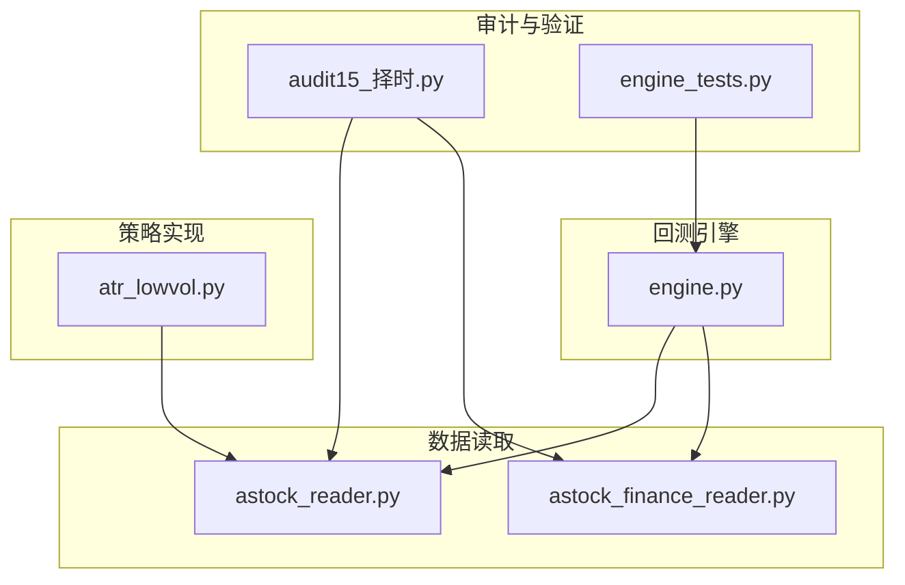
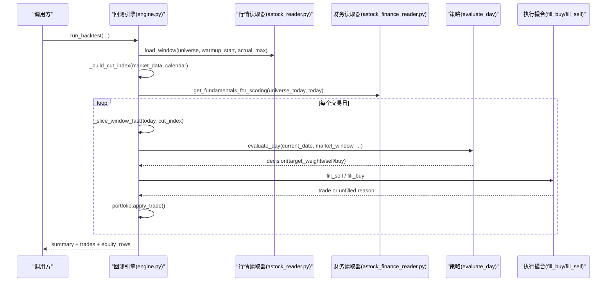
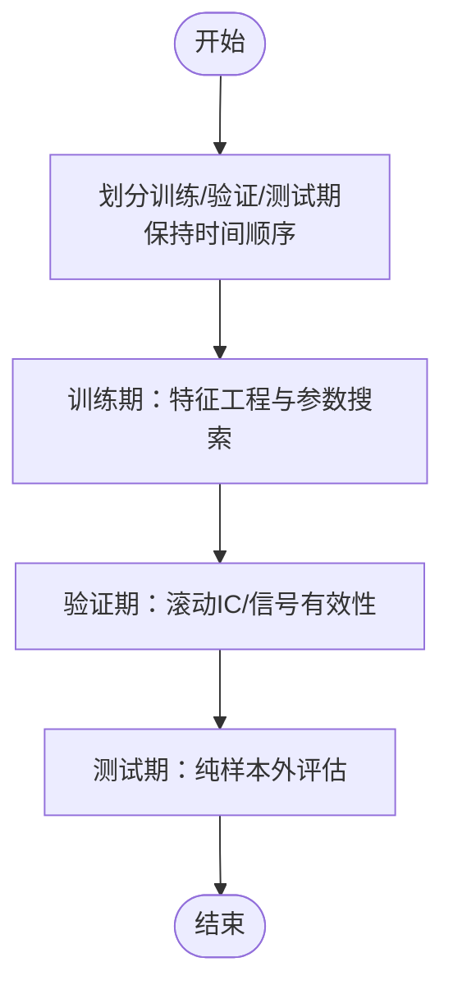
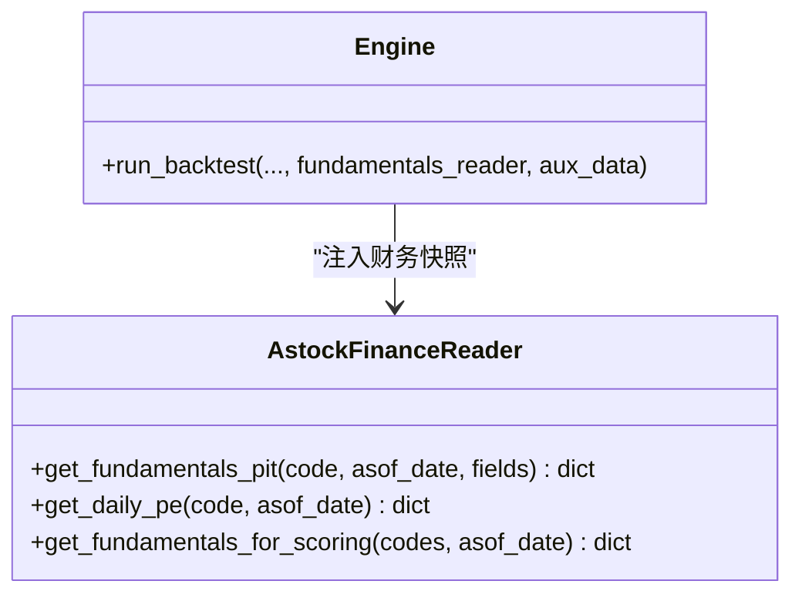
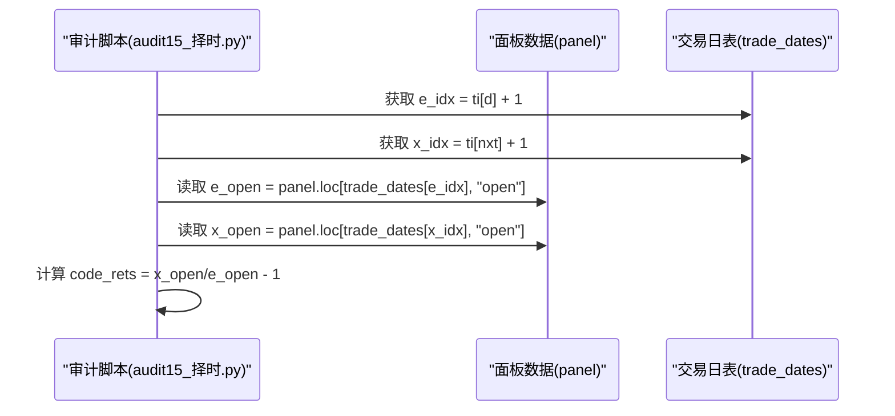
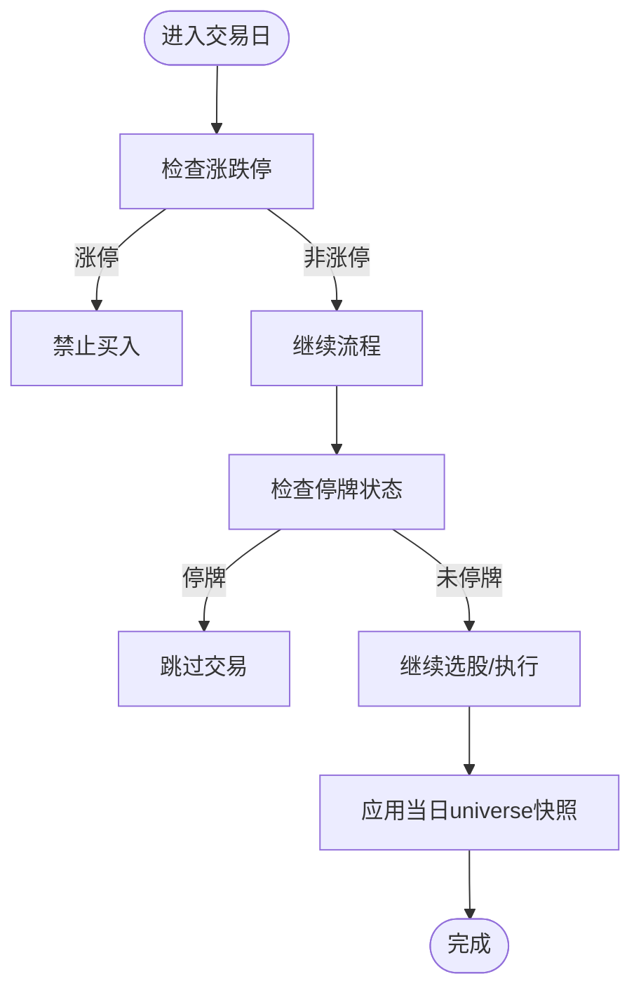
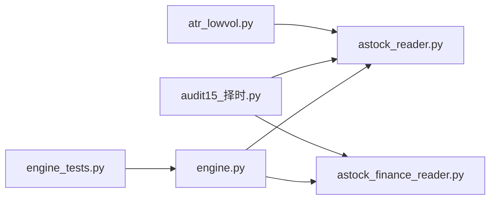

# 数据泄露检测

<cite>
**本文引用的文件**   
- [backtest/engine.py](file://backtest/engine.py)
- [data/astock_reader.py](file://data/astock_reader.py)
- [data/astock_finance_reader.py](file://data/astock_finance_reader.py)
- [research_audit/audit15_择时.py](file://research_audit/audit15_择时.py)
- [projects/verification/engine_tests.py](file://projects/verification/engine_tests.py)
- [strategy/atr_lowvol.py](file://strategy/atr_lowvol.py)
- [全局复利与踩坑日志.md](file://全局复利与踩坑日志.md)
</cite>

## 目录
1. [引言](#引言)
2. [项目结构](#项目结构)
3. [核心组件](#核心组件)
4. [架构总览](#架构总览)
5. [详细组件分析](#详细组件分析)
6. [依赖关系分析](#依赖关系分析)
7. [性能考量](#性能考量)
8. [故障排查指南](#故障排查指南)
9. [结论](#结论)
10. [附录：检测工具与脚本使用](#附录检测工具与脚本使用)

## 引言
本文件面向 QuantLab 的数据质量与回测严谨性，聚焦“数据泄露（前视偏差）”的识别与修复。内容涵盖：
- 前视偏差检测方法：时间序列交叉验证、样本外测试设计、PIT（Point-in-Time）安全数据处理
- 财务数据对齐机制：确保以结算日 e_date 为准而非交易日期 x_date
- 停牌处理、涨跌停过滤、退市股票处理的正确方式
- 具体检测工具与脚本使用方法，含实际案例与修复方案

目标读者包括策略研究员、回测工程师与生产运维人员，力求在技术细节与可操作层面提供完整指导。

## 项目结构
QuantLab 中与数据泄露检测相关的关键模块分布如下：
- 回测引擎：负责按交易日推进、窗口切片、执行撮合与指标计算
- 数据读取器：行情与财务数据的 PIT 安全读取
- 审计与验证：择时审计脚本、引擎验证用例
- 策略层：选股与风控逻辑中涉及停牌、涨跌停等市场约束

图表来源
- [backtest/engine.py:237-318](file://backtest/engine.py#L237-L318)
- [data/astock_reader.py:71-116](file://data/astock_reader.py#L71-L116)
- [data/astock_finance_reader.py:66-129](file://data/astock_finance_reader.py#L66-L129)
- [research_audit/audit15_择时.py:133-168](file://research_audit/audit15_择时.py#L133-L168)
- [projects/verification/engine_tests.py:95-127](file://projects/verification/engine_tests.py#L95-L127)
- [strategy/atr_lowvol.py:110-141](file://strategy/atr_lowvol.py#L110-L141)

章节来源
- [backtest/engine.py:237-318](file://backtest/engine.py#L237-L318)
- [data/astock_reader.py:71-116](file://data/astock_reader.py#L71-L116)
- [data/astock_finance_reader.py:66-129](file://data/astock_finance_reader.py#L66-L129)
- [research_audit/audit15_择时.py:133-168](file://research_audit/audit15_择时.py#L133-L168)
- [projects/verification/engine_tests.py:95-127](file://projects/verification/engine_tests.py#L95-L127)
- [strategy/atr_lowvol.py:110-141](file://strategy/atr_lowvol.py#L110-L141)

## 核心组件
- 回测引擎（engine.py）
  - 提供 next_open 交易模型，T 收盘信号 → T+1 开盘成交
  - 通过预计算 cut_index 对每个代码进行 O(1) 历史窗口切片，避免未来信息泄漏
  - 支持 PIT universe_by_date 快照，按 as_of_date 动态限定候选池
  - 基准指数对齐与缺失填充，保证评估口径一致
- 行情读取器（astock_reader.py）
  - 基于 parquet 的多索引数据（trade_date, ts_code），输出标准列集
  - 支持 raw/qfq/hfq 复权，注意复权因子应用顺序与时点
- 财务读取器（astock_finance_reader.py）
  - 严格 PIT 规则：仅使用公告日 ≤ asof_date 的财务记录，取最新 end_date
  - 提供每日 PE 快照读取，天然防前视
- 审计脚本（audit15_择时.py）
  - 构建 e_date/x_date 对齐的收益计算，PIT 安全的滚动 IC、动量、拥挤度信号
- 验证用例（engine_tests.py）
  - 覆盖涨跌停、停牌、资金约束、先卖后买、止损等关键行为
- 策略示例（atr_lowvol.py）
  - 包含换手率、ST、ATR%、ROE、动量门控等筛选逻辑

章节来源
- [backtest/engine.py:237-318](file://backtest/engine.py#L237-L318)
- [data/astock_reader.py:71-116](file://data/astock_reader.py#L71-L116)
- [data/astock_finance_reader.py:66-129](file://data/astock_finance_reader.py#L66-L129)
- [research_audit/audit15_择时.py:133-168](file://research_audit/audit15_择时.py#L133-L168)
- [projects/verification/engine_tests.py:95-127](file://projects/verification/engine_tests.py#L95-L127)
- [strategy/atr_lowvol.py:110-141](file://strategy/atr_lowvol.py#L110-L141)

## 架构总览
下图展示回测主循环与数据读取器的交互，以及 PIT 安全财务数据注入路径。

图表来源
- [backtest/engine.py:237-443](file://backtest/engine.py#L237-L443)
- [data/astock_reader.py:71-116](file://data/astock_reader.py#L71-L116)
- [data/astock_finance_reader.py:180-191](file://data/astock_finance_reader.py#L180-L191)

## 详细组件分析

### 时间序列交叉验证与样本外测试设计
- 时间序列交叉验证要点
  - 使用滚动窗口或扩展窗口，禁止随机打乱；每次训练集必须早于验证集
  - 在 engine.py 中通过 _build_cut_index 与 _slice_window_fast 实现按日历切分的历史窗口，天然满足时序不泄漏
- 样本外测试设计
  - 将全样本划分为训练/验证/测试三段，测试段不参与任何特征工程或参数选择
  - 在 audit15_择时.py 中，e_date/x_date 对齐的收益计算用于滚动 IC 与信号有效性检验，确保只用已实现收益

章节来源
- [backtest/engine.py:121-146](file://backtest/engine.py#L121-L146)
- [research_audit/audit15_择时.py:133-168](file://research_audit/audit15_择时.py#L133-L168)

### PIT（Point-in-Time）安全数据处理
- 财务数据 PIT 规则
  - 仅使用公告日 ≤ asof_date 的记录，取最大 end_date 作为当期可用财务值
  - 每日 PE 快照使用 trade_date ≤ asof_date 的最新行，天然防前视
- 在 astock_finance_reader.py 中实现了 get_fundamentals_pit 与 get_daily_pe，并在 engine.py 中以 fundamentals_reader.get_fundamentals_for_scoring 注入到策略辅助数据

图表来源
- [data/astock_finance_reader.py:66-129](file://data/astock_finance_reader.py#L66-L129)
- [backtest/engine.py:396-406](file://backtest/engine.py#L396-L406)

章节来源
- [data/astock_finance_reader.py:66-129](file://data/astock_finance_reader.py#L66-L129)
- [backtest/engine.py:396-406](file://backtest/engine.py#L396-L406)

### 财务数据对齐机制：e_date 与 x_date
- 对齐原则
  - 调仓日 d 的决策基于当日及以前信息
  - 收益计算采用 e_date（次日开盘）与 x_date（再下一日开盘）对齐，避免使用未来价格
- 在 audit15_择时.py 中，明确使用 e_idx/x_idx 映射到 trade_dates，并以 open 价计算区间收益，确保无前视

图表来源
- [research_audit/audit15_择时.py:133-168](file://research_audit/audit15_择时.py#L133-L168)

章节来源
- [research_audit/audit15_择时.py:133-168](file://research_audit/audit15_择时.py#L133-L168)

### 停牌处理、涨跌停过滤、退市股票处理
- 涨跌停处理
  - 涨停日不可买入，跌停日不可卖出
  - engine_tests.py 中 B-3 验证该逻辑；策略层需根据 pre_close/close 判断是否触及涨跌停幅度
- 停牌处理
  - 停牌期间不可交易；engine_tests.py 中 B-4 验证该逻辑
  - 策略层可通过 is_st、suspend_type 等字段过滤
- 退市股票处理
  - 使用 universe_by_date 快照限定候选池，避免将已退市股票纳入后续周期
  - 在 engine.py 中支持 per_day_universe 的 PIT 模式，按 as_of_date 更新候选集合

章节来源
- [projects/verification/engine_tests.py:95-127](file://projects/verification/engine_tests.py#L95-L127)
- [backtest/engine.py:298-309](file://backtest/engine.py#L298-L309)
- [strategy/atr_lowvol.py:110-141](file://strategy/atr_lowvol.py#L110-L141)

### 复权与价格对齐的前视风险
- 后复权陷阱
  - 使用 groupby("code")["factor"].transform("last") 会导致未来复权因子污染历史价格
  - 全局复利与踩坑日志指出这是常见前视偏差来源
- 正确做法
  - 在 astock_reader.py 中，按行内 adj_factor 逐条复权，或使用 qfq/hfq 的规范实现，避免用“最后因子”回溯

章节来源
- [全局复利与踩坑日志.md:199-211](file://全局复利与踩坑日志.md#L199-L211)
- [data/astock_reader.py:98-110](file://data/astock_reader.py#L98-L110)

## 依赖关系分析
- 回测引擎依赖行情读取器与财务读取器，策略通过 evaluate_day 接收市场窗口与辅助数据
- 审计脚本依赖面板数据与交易日映射，确保 e_date/x_date 对齐
- 验证用例覆盖关键交易约束，保障引擎行为符合预期

图表来源
- [backtest/engine.py:237-443](file://backtest/engine.py#L237-L443)
- [data/astock_reader.py:71-116](file://data/astock_reader.py#L71-L116)
- [data/astock_finance_reader.py:180-191](file://data/astock_finance_reader.py#L180-L191)
- [research_audit/audit15_择时.py:133-168](file://research_audit/audit15_择时.py#L133-L168)
- [projects/verification/engine_tests.py:95-127](file://projects/verification/engine_tests.py#L95-L127)
- [strategy/atr_lowvol.py:110-141](file://strategy/atr_lowvol.py#L110-L141)

## 性能考量
- 窗口切片优化
  - engine.py 通过 _build_cut_index 与 _slice_window_fast 实现 O(1) 每日切片，减少重复过滤开销
- 数据加载与内存
  - astock_reader.py 仅读取必要列，降低内存占用
- 基准对齐
  - 基准缺失时使用前向填充，但需警惕过长缺失导致评估失真

章节来源
- [backtest/engine.py:121-146](file://backtest/engine.py#L121-L146)
- [data/astock_reader.py:47-56](file://data/astock_reader.py#L47-L56)

## 故障排查指南
- 常见前视偏差症状
  - 复权 look-ahead：后复权使用“最后因子”回溯导致全因子污染
  - 宇宙选择 look-ahead：静态 top 池套用到全历史周期
  - 撮合 look-ahead：1d 频率盘中取 close 却按盘中撮合
- 排查步骤
  - 对比“盘中 vs 尾盘”两套口径，差异显著且方向反转通常意味着前视
  - 检查财务数据是否严格按 ann_date ≤ asof_date 过滤
  - 校验 e_date/x_date 对齐是否正确，避免使用未来价格
- 修复建议
  - 使用 astock_finance_reader.py 的 PIT 接口
  - 在 engine.py 中使用 universe_by_date 快照限定候选池
  - 在策略层严格执行涨跌停与停牌过滤

章节来源
- [全局复利与踩坑日志.md:199-211](file://全局复利与踩坑日志.md#L199-L211)
- [data/astock_finance_reader.py:66-129](file://data/astock_finance_reader.py#L66-L129)
- [backtest/engine.py:298-309](file://backtest/engine.py#L298-L309)
- [projects/verification/engine_tests.py:95-127](file://projects/verification/engine_tests.py#L95-L127)

## 结论
QuantLab 的回测框架在数据读取与引擎层面提供了较强的 PIT 安全基础。通过严格的窗口切片、e_date/x_date 对齐、财务公告日过滤与候选池快照，可有效避免多数前视偏差。但仍需关注复权因子使用、静态池套用与盘中/尾盘口径一致性等问题。建议结合审计脚本与验证用例，建立常态化的数据泄露检测流程。

## 附录：检测工具与脚本使用
- 时间序列交叉验证
  - 使用 engine.py 的 _build_cut_index/_slice_window_fast 实现滚动/扩展窗口
  - 在研究阶段，参考 audit15_择时.py 的 e_date/x_date 对齐方法
- 样本外测试
  - 划分训练/验证/测试期，测试期不参与任何特征工程或参数选择
- PIT 安全数据处理
  - 使用 astock_finance_reader.py 的 get_fundamentals_pit/get_daily_pe
  - 在 engine.py 中通过 fundamentals_reader 注入策略辅助数据
- 涨跌停与停牌处理
  - 参考 engine_tests.py 的 B-3/B-4 验证用例
  - 在策略层实现涨跌幅判断与停牌过滤
- 退市股票处理
  - 使用 universe_by_date 快照，按 as_of_date 更新候选集合
- 复权与价格对齐
  - 避免使用“最后因子”回溯，遵循 astock_reader.py 的逐行复权逻辑

章节来源
- [backtest/engine.py:121-146](file://backtest/engine.py#L121-L146)
- [research_audit/audit15_择时.py:133-168](file://research_audit/audit15_择时.py#L133-L168)
- [data/astock_finance_reader.py:66-129](file://data/astock_finance_reader.py#L66-L129)
- [projects/verification/engine_tests.py:95-127](file://projects/verification/engine_tests.py#L95-L127)
- [data/astock_reader.py:98-110](file://data/astock_reader.py#L98-L110)