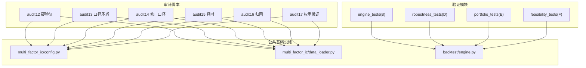
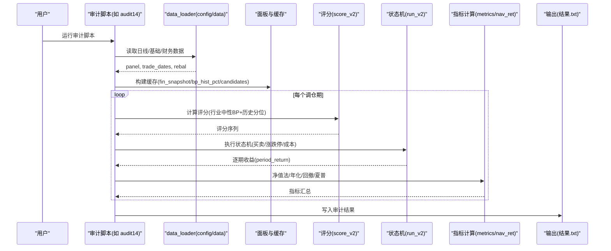
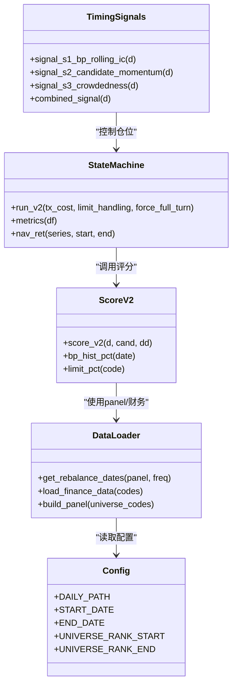
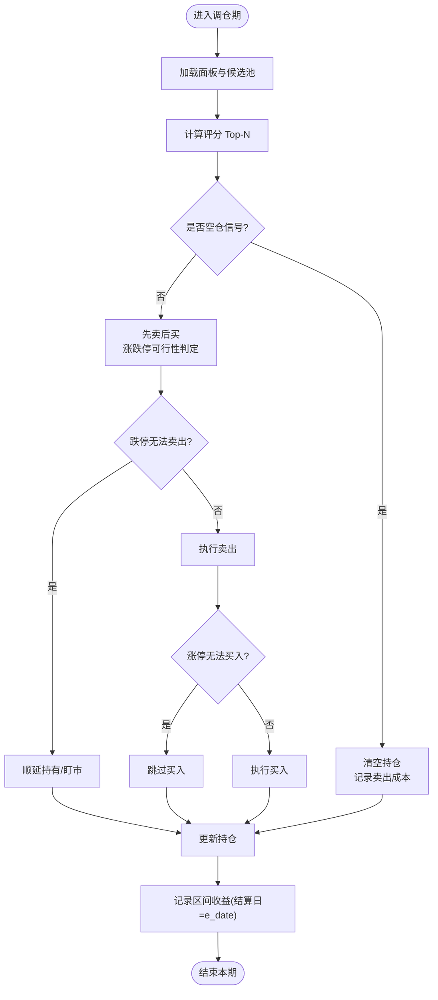
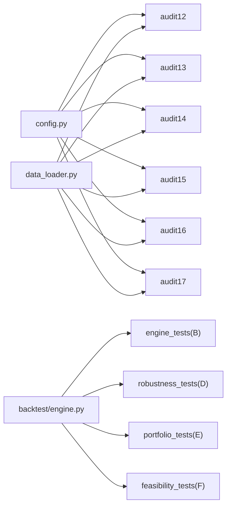

# 研究审计与验证

<cite>
**本文引用的文件**   
- [research_audit/audit12_hard.py](file://research_audit/audit12_hard.py)
- [research_audit/audit13_口径矛盾.py](file://research_audit/audit13_口径矛盾.py)
- [research_audit/audit14_修正口径.py](file://research_audit/audit14_修正口径.py)
- [research_audit/audit15_择时.py](file://research_audit/audit15_择时.py)
- [research_audit/audit16_归因.py](file://research_audit/audit16_归因.py)
- [research_audit/audit17_权重.py](file://research_audit/audit17_权重.py)
- [projects/verification/engine_tests.py](file://projects/verification/engine_tests.py)
- [projects/verification/robustness_tests.py](file://projects/verification/robustness_tests.py)
- [projects/verification/portfolio_tests.py](file://projects/verification/portfolio_tests.py)
- [projects/verification/feasibility_tests.py](file://projects/verification/feasibility_tests.py)
- [backtest/engine.py](file://backtest/engine.py)
- [projects/Project_01_多因子IC小盘Alpha/research/multi_factor_ic/config.py](file://projects/Project_01_多因子IC小盘Alpha/research/multi_factor_ic/config.py)
- [projects/Project_01_多因子IC小盘Alpha/research/multi_factor_ic/data_loader.py](file://projects/Project_01_多因子IC小盘Alpha/research/multi_factor_ic/data_loader.py)
</cite>

## 目录
1. [引言](#引言)
2. [项目结构](#项目结构)
3. [核心组件](#核心组件)
4. [架构总览](#架构总览)
5. [详细组件分析](#详细组件分析)
6. [依赖关系分析](#依赖关系分析)
7. [性能考量](#性能考量)
8. [故障排查指南](#故障排查指南)
9. [结论](#结论)
10. [附录：审计报告解读与工具使用](#附录审计报告解读与工具使用)

## 引言
本文件面向 QuantLab 的研究审计与验证，聚焦以下目标：
- 前视偏差检测：数据泄露检测、时间序列交叉验证、样本外测试设计
- 过拟合防范：正则化技术、简化模型、交叉验证策略
- 数据口径一致性检查：财务数据对齐、停牌处理、涨跌停过滤、退市股票处理
- 因子有效性验证：IC 分析、分组回测、稳定性检验、鲁棒性测试
- 策略审计流程：代码审查、逻辑验证、边界条件检查、异常情况处理
- 审计工具与脚本使用方法，以及审计报告解读指南

本仓库已具备一套完整的“审计脚本族”和“验证模块”，覆盖从数据准备、评分构建、状态机回测、择时扩展、归因分解到稳健性与组合优化的全链路。下文将基于这些实现进行系统化说明。

## 项目结构
QuantLab 的审计与验证相关代码主要分布在两个区域：
- research_audit：针对具体策略（如 V2/V3）的多轮审计脚本，逐层定位问题、修正口径、引入择时与权重优化
- projects/verification：通用验证模块（B/D/E/F），覆盖引擎校验、稳健性、组合优化与实盘可行性评估

图表来源
- [research_audit/audit12_hard.py:1-292](file://research_audit/audit12_hard.py#L1-L292)
- [research_audit/audit13_口径矛盾.py:1-304](file://research_audit/audit13_口径矛盾.py#L1-L304)
- [research_audit/audit14_修正口径.py:1-312](file://research_audit/audit14_修正口径.py#L1-L312)
- [research_audit/audit15_择时.py:1-450](file://research_audit/audit15_择时.py#L1-L450)
- [research_audit/audit16_归因.py:1-547](file://research_audit/audit16_归因.py#L1-L547)
- [research_audit/audit17_权重.py:1-328](file://research_audit/audit17_权重.py#L1-L328)
- [projects/verification/engine_tests.py:1-309](file://projects/verification/engine_tests.py#L1-L309)
- [projects/verification/robustness_tests.py:1-267](file://projects/verification/robustness_tests.py#L1-L267)
- [projects/verification/portfolio_tests.py:1-232](file://projects/verification/portfolio_tests.py#L1-L232)
- [projects/verification/feasibility_tests.py:1-178](file://projects/verification/feasibility_tests.py#L1-L178)
- [projects/Project_01_多因子IC小盘Alpha/research/multi_factor_ic/config.py:1-47](file://projects/Project_01_多因子IC小盘Alpha/research/multi_factor_ic/config.py#L1-L47)
- [projects/Project_01_多因子IC小盘Alpha/research/multi_factor_ic/data_loader.py:1-151](file://projects/Project_01_多因子IC小盘Alpha/research/multi_factor_ic/data_loader.py#L1-L151)
- [backtest/engine.py:1-200](file://backtest/engine.py#L1-L200)

章节来源
- [research_audit/audit12_hard.py:1-292](file://research_audit/audit12_hard.py#L1-L292)
- [research_audit/audit13_口径矛盾.py:1-304](file://research_audit/audit13_口径矛盾.py#L1-L304)
- [research_audit/audit14_修正口径.py:1-312](file://research_audit/audit14_修正口径.py#L1-L312)
- [research_audit/audit15_择时.py:1-450](file://research_audit/audit15_择时.py#L1-L450)
- [research_audit/audit16_归因.py:1-547](file://research_audit/audit16_归因.py#L1-L547)
- [research_audit/audit17_权重.py:1-328](file://research_audit/audit17_权重.py#L1-L328)
- [projects/verification/engine_tests.py:1-309](file://projects/verification/engine_tests.py#L1-L309)
- [projects/verification/robustness_tests.py:1-267](file://projects/verification/robustness_tests.py#L1-L267)
- [projects/verification/portfolio_tests.py:1-232](file://projects/verification/portfolio_tests.py#L1-L232)
- [projects/verification/feasibility_tests.py:1-178](file://projects/verification/feasibility_tests.py#L1-L178)
- [projects/Project_01_多因子IC小盘Alpha/research/multi_factor_ic/config.py:1-47](file://projects/Project_01_多因子IC小盘Alpha/research/multi_factor_ic/config.py#L1-L47)
- [projects/Project_01_多因子IC小盘Alpha/research/multi_factor_ic/data_loader.py:1-151](file://projects/Project_01_多因子IC小盘Alpha/research/multi_factor_ic/data_loader.py#L1-L151)
- [backtest/engine.py:1-200](file://backtest/engine.py#L1-L200)

## 核心组件
- 数据与面板构建
  - 日线面板、行业映射、财务 PIT 快照、候选池筛选、调仓日生成
  - 关键路径：config.py 定义数据路径与窗口；data_loader.py 提供 get_rebalance_dates、动态宇宙等
- 评分与选股
  - 行业中性 BP z-score + 历史分位 BP 加权评分；Top-N 选股
  - 涨跌停限制、停牌/ST 过滤、退市处理
- 状态机回测
  - 期 i 结算上一期末持仓区间收益；真实结算日 e_date；涨跌停顺延与强制全换变体
- 择时扩展
  - S1 BP滚动IC、S2 候选池动量、S3 拥挤度；空仓/满仓开关
- 归因与权重优化
  - 月度超额归因、BP分层、历史分位分层、排雷贡献对比、z/hp 权重扫描
- 验证模块
  - B 引擎校验、D 稳健性、E 组合优化、F 实盘可行性

章节来源
- [projects/Project_01_多因子IC小盘Alpha/research/multi_factor_ic/config.py:1-47](file://projects/Project_01_多因子IC小盘Alpha/research/multi_factor_ic/config.py#L1-L47)
- [projects/Project_01_多因子IC小盘Alpha/research/multi_factor_ic/data_loader.py:1-151](file://projects/Project_01_多因子IC小盘Alpha/research/multi_factor_ic/data_loader.py#L1-L151)
- [research_audit/audit14_修正口径.py:1-312](file://research_audit/audit14_修正口径.py#L1-L312)
- [research_audit/audit15_择时.py:1-450](file://research_audit/audit15_择时.py#L1-L450)
- [research_audit/audit16_归因.py:1-547](file://research_audit/audit16_归因.py#L1-L547)
- [research_audit/audit17_权重.py:1-328](file://research_audit/audit17_权重.py#L1-L328)

## 架构总览
下图展示审计脚本与公共基础设施之间的调用关系与数据流。

图表来源
- [research_audit/audit14_修正口径.py:1-312](file://research_audit/audit14_修正口径.py#L1-L312)
- [projects/Project_01_多因子IC小盘Alpha/research/multi_factor_ic/data_loader.py:1-151](file://projects/Project_01_多因子IC小盘Alpha/research/multi_factor_ic/data_loader.py#L1-L151)
- [projects/Project_01_多因子IC小盘Alpha/research/multi_factor_ic/config.py:1-47](file://projects/Project_01_多因子IC小盘Alpha/research/multi_factor_ic/config.py#L1-L47)

## 详细组件分析

### 前视偏差检测与时间序列交叉验证
- 数据泄露检测
  - 所有审计脚本严格遵循 PIT 原则：财务数据按 ann_date 对齐，仅使用 d 及以前信息；收益结算使用 E 日 open，禁止 x_date 标记
  - 涨跌停判断与交易可行性均基于当日行情，避免未来价格泄露
- 时间序列交叉验证
  - 通过分段窗口（牛市/熊市/震荡/压力窗口）与净值法连乘，确保时序一致性与可比性
  - 子样本检验（D-1）、牛熊分拆（D-2）、极端事件（D-3）在 robustness_tests.py 中实现
- 样本外测试设计
  - 以 2026 为样本外窗口，对比不同口径（逐期独立 vs 状态机延续/顺延）表现差异
  - 权重扫描（audit17）在不同窗口下比较超额，避免过拟合

章节来源
- [research_audit/audit13_口径矛盾.py:1-304](file://research_audit/audit13_口径矛盾.py#L1-L304)
- [research_audit/audit14_修正口径.py:1-312](file://research_audit/audit14_修正口径.py#L1-L312)
- [research_audit/audit15_择时.py:1-450](file://research_audit/audit15_择时.py#L1-L450)
- [projects/verification/robustness_tests.py:1-267](file://projects/verification/robustness_tests.py#L1-L267)

### 过拟合防范措施
- 正则化技术
  - 行业中性化处理（BP z-score）降低风格暴露；winsorize 百分位截尾（config.py）
- 简化模型
  - 评分函数采用线性加权（z/hp），参数可扫描但保持简单结构
- 交叉验证策略
  - 多窗口超额对比（全期/2024+/2026）、滚动夏普（E-5）、子样本/牛熊/压力测试（D-1~D-3）

章节来源
- [projects/Project_01_多因子IC小盘Alpha/research/multi_factor_ic/config.py:1-47](file://projects/Project_01_多因子IC小盘Alpha/research/multi_factor_ic/config.py#L1-L47)
- [research_audit/audit17_权重.py:1-328](file://research_audit/audit17_权重.py#L1-L328)
- [projects/verification/robustness_tests.py:1-267](file://projects/verification/robustness_tests.py#L1-L267)
- [projects/verification/portfolio_tests.py:1-232](file://projects/verification/portfolio_tests.py#L1-L232)

### 数据口径一致性检查
- 财务数据对齐
  - 使用 ann_date 做 PIT 快照，保证公告日之后才可用
- 停牌处理
  - 过滤 ST 与停牌类型（S/R/R&S），不可交易标的剔除
- 涨跌停过滤
  - 根据板块规则（主板/创业板/科创板/北交所）设定涨跌停幅度，买入/卖出可行性判定
- 退市股票处理
  - 幸存者偏差确认（audit12）统计退市数量并纳入回测范围

章节来源
- [research_audit/audit12_hard.py:1-292](file://research_audit/audit12_hard.py#L1-L292)
- [research_audit/audit13_口径矛盾.py:1-304](file://research_audit/audit13_口径矛盾.py#L1-L304)
- [research_audit/audit14_修正口径.py:1-312](file://research_audit/audit14_修正口径.py#L1-L312)

### 因子有效性验证
- IC 分析
  - S1 滚动 IC（BP 因子有效性），用 Spearman 秩相关衡量
- 分组回测
  - BP 行业中性 z-score 5 分组收益；历史分位 bp_hist_pct 5 分组收益
- 稳定性检验
  - 多窗口超额对比、滚动夏普、子样本/牛熊/压力测试
- 鲁棒性测试
  - 交易成本压力测试、容量估算、滑点真实性评估

章节来源
- [research_audit/audit15_择时.py:1-450](file://research_audit/audit15_择时.py#L1-L450)
- [research_audit/audit16_归因.py:1-547](file://research_audit/audit16_归因.py#L1-L547)
- [projects/verification/robustness_tests.py:1-267](file://projects/verification/robustness_tests.py#L1-L267)
- [projects/verification/feasibility_tests.py:1-178](file://projects/verification/feasibility_tests.py#L1-L178)

### 策略审计流程
- 代码审查
  - 审计脚本复用同一模板（audit14），减少不一致风险
- 逻辑验证
  - 状态机结算日 e_date、先卖后买、涨跌停顺延、强制全换变体
- 边界条件检查
  - 候选池不足、无有效成交、停牌/涨跌停导致无法交易
- 异常情况处理
  - 空仓期记录 period_return=0，清仓/建仓成本计入

章节来源
- [research_audit/audit14_修正口径.py:1-312](file://research_audit/audit14_修正口径.py#L1-L312)
- [research_audit/audit15_择时.py:1-450](file://research_audit/audit15_择时.py#L1-L450)
- [projects/verification/engine_tests.py:1-309](file://projects/verification/engine_tests.py#L1-L309)

### 类图：评分与状态机

图表来源
- [research_audit/audit14_修正口径.py:1-312](file://research_audit/audit14_修正口径.py#L1-L312)
- [research_audit/audit15_择时.py:1-450](file://research_audit/audit15_择时.py#L1-L450)
- [projects/Project_01_多因子IC小盘Alpha/research/multi_factor_ic/data_loader.py:1-151](file://projects/Project_01_多因子IC小盘Alpha/research/multi_factor_ic/data_loader.py#L1-L151)
- [projects/Project_01_多因子IC小盘Alpha/research/multi_factor_ic/config.py:1-47](file://projects/Project_01_多因子IC小盘Alpha/research/multi_factor_ic/config.py#L1-L47)

### 流程图：状态机结算与涨跌停处理

图表来源
- [research_audit/audit14_修正口径.py:1-312](file://research_audit/audit14_修正口径.py#L1-L312)
- [research_audit/audit15_择时.py:1-450](file://research_audit/audit15_择时.py#L1-L450)

## 依赖关系分析
- 审计脚本对 config.py 与 data_loader.py 的强依赖
- 择时脚本在状态机基础上扩展信号函数
- 验证模块与 backtest/engine.py 解耦，侧重逻辑校验与报告生成

图表来源
- [projects/Project_01_多因子IC小盘Alpha/research/multi_factor_ic/config.py:1-47](file://projects/Project_01_多因子IC小盘Alpha/research/multi_factor_ic/config.py#L1-L47)
- [projects/Project_01_多因子IC小盘Alpha/research/multi_factor_ic/data_loader.py:1-151](file://projects/Project_01_多因子IC小盘Alpha/research/multi_factor_ic/data_loader.py#L1-L151)
- [backtest/engine.py:1-200](file://backtest/engine.py#L1-L200)

章节来源
- [research_audit/audit12_hard.py:1-292](file://research_audit/audit12_hard.py#L1-L292)
- [research_audit/audit13_口径矛盾.py:1-304](file://research_audit/audit13_口径矛盾.py#L1-L304)
- [research_audit/audit14_修正口径.py:1-312](file://research_audit/audit14_修正口径.py#L1-L312)
- [research_audit/audit15_择时.py:1-450](file://research_audit/audit15_择时.py#L1-L450)
- [research_audit/audit16_归因.py:1-547](file://research_audit/audit16_归因.py#L1-L547)
- [research_audit/audit17_权重.py:1-328](file://research_audit/audit17_权重.py#L1-L328)
- [projects/verification/engine_tests.py:1-309](file://projects/verification/engine_tests.py#L1-L309)
- [projects/verification/robustness_tests.py:1-267](file://projects/verification/robustness_tests.py#L1-L267)
- [projects/verification/portfolio_tests.py:1-232](file://projects/verification/portfolio_tests.py#L1-L232)
- [projects/verification/feasibility_tests.py:1-178](file://projects/verification/feasibility_tests.py#L1-L178)
- [backtest/engine.py:1-200](file://backtest/engine.py#L1-L200)

## 性能考量
- 面板与缓存
  - fin_snapshot、bp_hist_pct、candidates 缓存避免重复计算
- 净值法计算
  - nav_ret 使用区间连乘，避免逐期均值带来的偏差
- 成本敏感性
  - 单边成本扫描（0.0005~0.005）评估换手与收益敏感度
- 容量估算
  - 基于 top80 成分日均成交额分布，给出资金规模建议

章节来源
- [research_audit/audit12_hard.py:1-292](file://research_audit/audit12_hard.py#L1-L292)
- [research_audit/audit14_修正口径.py:1-312](file://research_audit/audit14_修正口径.py#L1-L312)
- [research_audit/audit17_权重.py:1-328](file://research_audit/audit17_权重.py#L1-L328)

## 故障排查指南
- 常见错误
  - 日期错位：x_date 误用导致滞后一期（已在 audit14 修正）
  - 涨跌停误判：未考虑板块涨跌幅差异或高低价边界
  - 停牌/ST 未过滤：导致不可交易标的参与评分
  - 财务数据泄露：未使用 ann_date 对齐
- 排查步骤
  - 检查 panel 构造与过滤逻辑
  - 核对结算日 e_date 与收益计算
  - 验证涨跌停可行性判定与顺延逻辑
  - 确认财务快照与候选池筛选
- 参考脚本
  - engine_tests.py 中的 B 模块逐项校验（成本、涨跌停、停牌、止损等）
  - robustness_tests.py 的 D 模块（未来函数、幸存者偏差）

章节来源
- [research_audit/audit14_修正口径.py:1-312](file://research_audit/audit14_修正口径.py#L1-L312)
- [projects/verification/engine_tests.py:1-309](file://projects/verification/engine_tests.py#L1-L309)
- [projects/verification/robustness_tests.py:1-267](file://projects/verification/robustness_tests.py#L1-L267)

## 结论
- 审计脚本族提供了从数据口径、状态机回测、择时扩展到归因与权重优化的完整闭环
- 通过净值法与多窗口对比，确保时序一致性与稳健性
- 验证模块覆盖了引擎、稳健性、组合与实盘可行性，形成体系化的研究与生产衔接

## 附录：审计报告解读与工具使用
- 审计报告文件
  - audit12_结果.txt：同口径基准、成本敏感性、涨跌停处理对比、牛熊/压力窗口、容量估算、幸存者偏差确认
  - audit13_结果.txt：四变体对照（逐期独立/状态机延续+顺延/无顺延/全换+顺延），2026 窗口明细
  - audit14_结果.txt：净值法修正口径，全期/2026/压力窗口超额，逐期明细对齐
  - audit15_结果.txt：择时变体（S1/S2/S3/组合）全期/窗口超额，空仓期统计，2026 明细
  - audit16_结果.txt：月度超额归因、BP分层、历史分位分层、排雷贡献对比
  - audit17_结果.txt：z/hp 权重扫描，各窗口超额对比，最优配比选择
- 使用方法
  - 直接运行对应脚本（Python 环境需安装 pandas/numpy/scipy 等）
  - 输出统一写入 research_audit/*.txt，便于审阅与归档
- 解读要点
  - 关注净值法累计与年化、最大回撤、夏普比率
  - 窗口超额对比（全期/2024+/2026）判断稳健性
  - 2026 逐期明细观察异常月份与信号触发
  - 归因结论（风格beta vs 因子失效）指导后续改进方向

章节来源
- [research_audit/audit12_hard.py:1-292](file://research_audit/audit12_hard.py#L1-L292)
- [research_audit/audit13_口径矛盾.py:1-304](file://research_audit/audit13_口径矛盾.py#L1-L304)
- [research_audit/audit14_修正口径.py:1-312](file://research_audit/audit14_修正口径.py#L1-L312)
- [research_audit/audit15_择时.py:1-450](file://research_audit/audit15_择时.py#L1-L450)
- [research_audit/audit16_归因.py:1-547](file://research_audit/audit16_归因.py#L1-L547)
- [research_audit/audit17_权重.py:1-328](file://research_audit/audit17_权重.py#L1-L328)