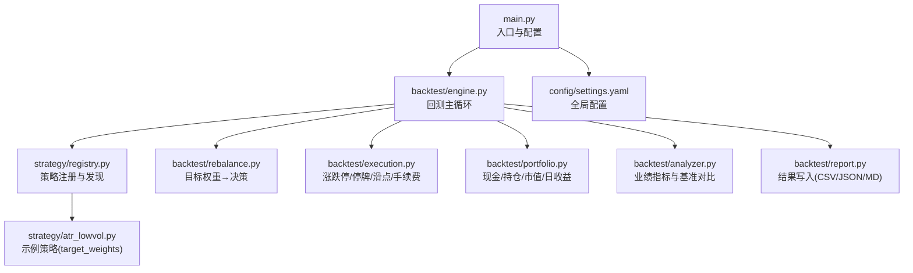
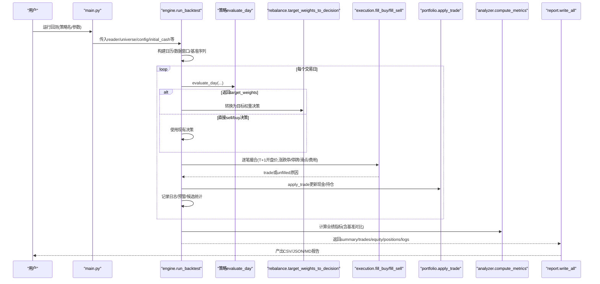
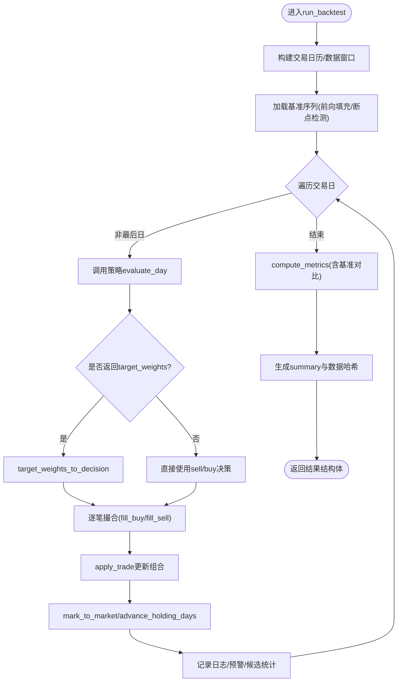
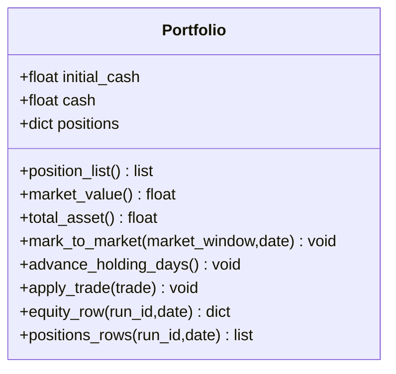
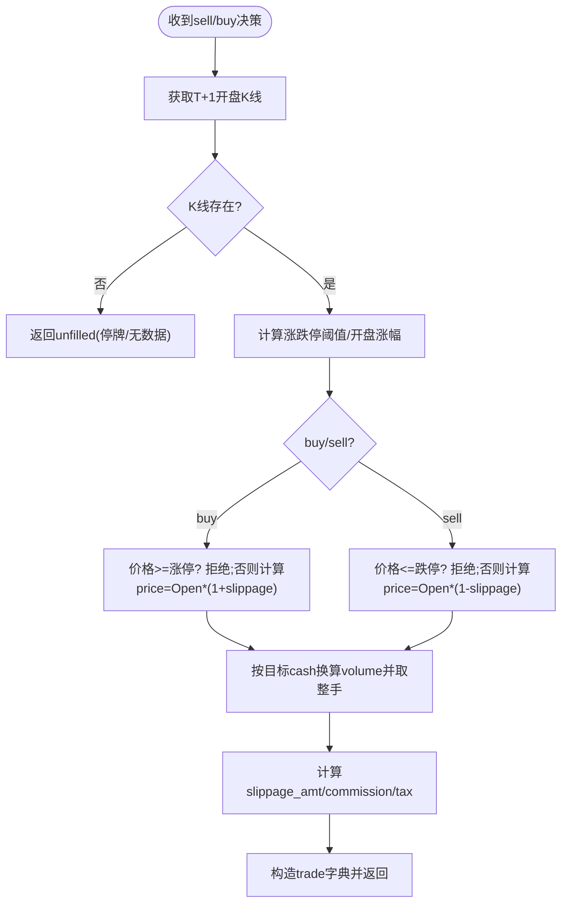
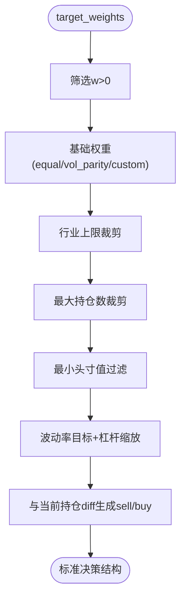
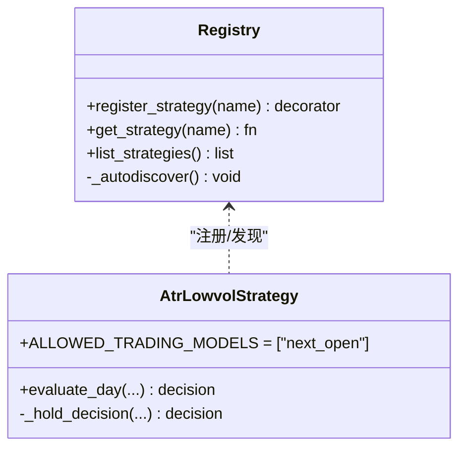
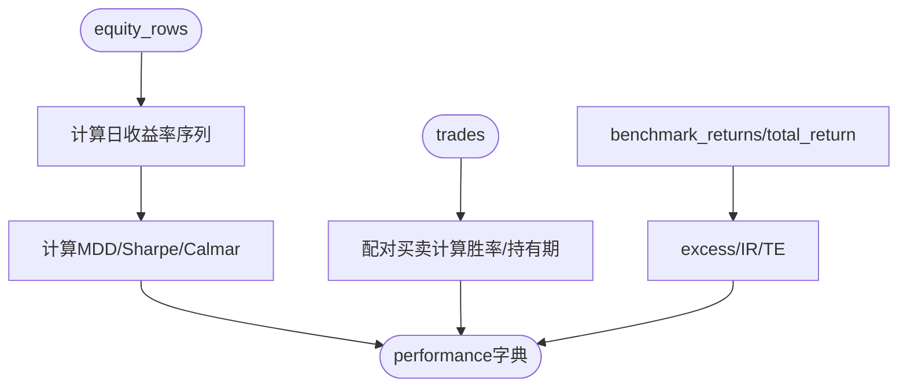
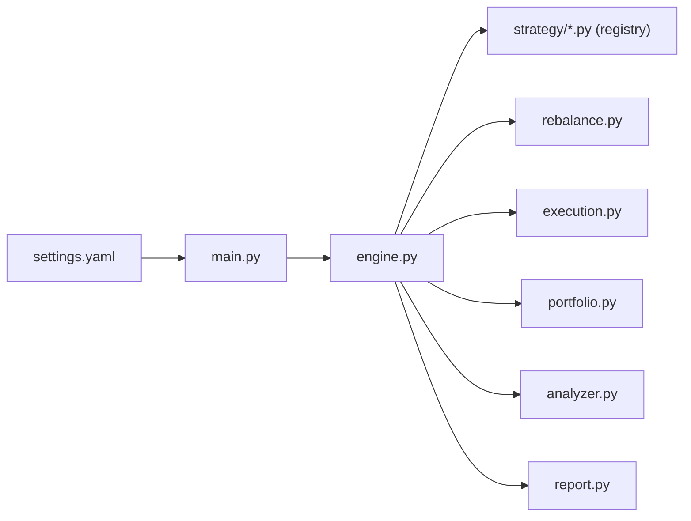
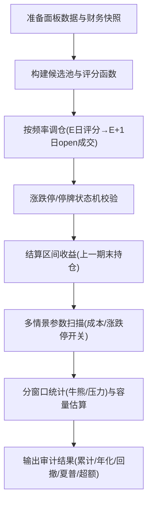

# 策略审计流程

<cite>
**本文引用的文件**   
- [main.py](file://main.py)
- [engine.py](file://backtest/engine.py)
- [analyzer.py](file://backtest/analyzer.py)
- [portfolio.py](file://backtest/portfolio.py)
- [rebalance.py](file://backtest/rebalance.py)
- [execution.py](file://backtest/execution.py)
- [report.py](file://backtest/report.py)
- [registry.py](file://strategy/registry.py)
- [atr_lowvol.py](file://strategy/atr_lowvol.py)
- [settings.yaml](file://config/settings.yaml)
- [engine_tests.py](file://projects/verification/engine_tests.py)
- [risk.py](file://projects/Project_10_价值小盘V2/strategy/risk.py)
- [audit12_hard.py](file://research_audit/audit12_hard.py)
- [audit15_需求.md](file://research_audit/audit15_需求.md)
</cite>

## 目录
1. [引言](#引言)
2. [项目结构](#项目结构)
3. [核心组件](#核心组件)
4. [架构总览](#架构总览)
5. [详细组件分析](#详细组件分析)
6. [依赖关系分析](#依赖关系分析)
7. [性能与一致性考量](#性能与一致性考量)
8. [压力测试方法](#压力测试方法)
9. [审计清单与检查表](#审计清单与检查表)
10. [审计报告模板与解读指南](#审计报告模板与解读指南)
11. [结论](#结论)

## 引言
本文件面向 QuantLab 的策略审计，覆盖代码审查要点、状态机验证（调仓逻辑、持仓管理、订单执行）、回测一致性检查（收益计算、成本扣除、基准对比）、压力测试方法（极端行情、流动性冲击、黑天鹅应对），并提供可落地的审计清单、检查表以及审计报告模板与解读指南。文档以仓库实际实现为依据，确保审计结论可追溯、可复现。

## 项目结构
QuantLab 采用“引擎 + 策略注册 + 组合与执行 + 报告”的分层架构：
- 入口与配置：主入口加载配置并调度回测；全局配置集中管理数据、回测参数等。
- 回测引擎：日历切片、基准对齐、策略调用、目标权重到决策转换、执行撮合、组合记账、指标计算与汇总。
- 策略层：扁平化注册，策略仅输出 target_weights 或 sell/buy 决策，风险与仓位由通用层统一处理。
- 报告层：固定列契约的 CSV/JSON/Markdown 产物，便于审计与复现。

**图表来源** 
- [main.py:21-73](file://main.py#L21-L73)
- [engine.py:237-319](file://backtest/engine.py#L237-L319)
- [registry.py:96-114](file://strategy/registry.py#L96-L114)
- [rebalance.py:101-260](file://backtest/rebalance.py#L101-L260)
- [execution.py:95-204](file://backtest/execution.py#L95-L204)
- [portfolio.py:38-189](file://backtest/portfolio.py#L38-L189)
- [analyzer.py:96-176](file://backtest/analyzer.py#L96-L176)
- [report.py:245-264](file://backtest/report.py#L245-L264)
- [atr_lowvol.py:78-165](file://strategy/atr_lowvol.py#L78-L165)
- [settings.yaml:21-28](file://config/settings.yaml#L21-L28)

**章节来源**
- [main.py:21-73](file://main.py#L21-L73)
- [settings.yaml:21-28](file://config/settings.yaml#L21-L28)

## 核心组件
- 回测引擎：负责日历构建、数据窗口切片、基准序列加载、策略 evaluate_day 调用、目标权重转决策、执行撮合、组合记账、指标计算与摘要生成。
- 组合记账：维护现金、持仓、可用数量（T+1冻结）、未实现盈亏、每日权益曲线与持仓快照。
- 执行撮合：遵循 next_open 模型，处理涨跌停、停牌、滑点、佣金、印花税、最小整手约束。
- 目标权重到决策：将任意策略输出的 target_weights 转换为 sell_decisions 与 buy_candidates，内置行业上限、最大持仓数、最小头寸值、波动率目标与杠杆上限等风控。
- 指标计算：年化收益、最大回撤、夏普、卡玛、胜率、平均持有期、超额收益、信息比率、跟踪误差等。
- 报告输出：固定列契约的 trades.csv、equity_curve.csv、positions.csv、summary.json、logs.txt、report.md。

**章节来源**
- [engine.py:237-619](file://backtest/engine.py#L237-L619)
- [portfolio.py:38-189](file://backtest/portfolio.py#L38-L189)
- [execution.py:95-204](file://backtest/execution.py#L95-L204)
- [rebalance.py:101-260](file://backtest/rebalance.py#L101-L260)
- [analyzer.py:96-176](file://backtest/analyzer.py#L96-L176)
- [report.py:245-264](file://backtest/report.py#L245-L264)

## 架构总览
下图展示从入口到报告的端到端流程，包括策略注册、目标权重转换、执行撮合、组合记账与指标计算。

**图表来源** 
- [main.py:28-73](file://main.py#L28-L73)
- [engine.py:237-511](file://backtest/engine.py#L237-L511)
- [rebalance.py:101-260](file://backtest/rebalance.py#L101-L260)
- [execution.py:95-204](file://backtest/execution.py#L95-L204)
- [portfolio.py:103-151](file://backtest/portfolio.py#L103-L151)
- [analyzer.py:96-176](file://backtest/analyzer.py#L96-L176)
- [report.py:245-264](file://backtest/report.py#L245-L264)

## 详细组件分析

### 回测引擎（engine）
- 职责：串联 reader → strategy → rebalance → execution → portfolio → analyzer → report。
- 关键特性：
  - 支持 PIT 宇宙快照（universe_by_date）。
  - 基准序列前向填充与断点检测，禁用 IR/excess 时给出说明。
  - 两融利息计提（当杠杆启用且现金为负）。
  - 诊断聚合（警告去重、候选通过率、未成交订单计数、策略特定指标均值）。
  - 数据哈希与样本期警告，保障可复现性与短样本提示。

**图表来源** 
- [engine.py:237-511](file://backtest/engine.py#L237-L511)
- [engine.py:512-619](file://backtest/engine.py#L512-L619)

**章节来源**
- [engine.py:237-619](file://backtest/engine.py#L237-L619)

### 组合记账（portfolio）
- T+1 可用性：新买入当日 available_volume=0，次日 unfreeze。
- 成本均价：加仓按金额加权平均成本（含佣金）。
- 未实现盈亏：基于 last_price 与 cost_price 计算。
- 日收益：基于 total_asset 环比计算，空值保护。

**图表来源** 
- [portfolio.py:38-189](file://backtest/portfolio.py#L38-L189)

**章节来源**
- [portfolio.py:38-189](file://backtest/portfolio.py#L38-L189)

### 执行撮合（execution）
- 模型：next_open（T+1 开盘价成交）。
- 涨跌停规则：根据板块/ST 动态确定涨跌幅度；涨停拒买、跌停拒卖。
- 费用与滑点：滑点、佣金、印花税（卖出）按约定计算。
- 手数约束：A股 100 股整数倍向下取整。

**图表来源** 
- [execution.py:95-204](file://backtest/execution.py#L95-L204)

**章节来源**
- [execution.py:95-204](file://backtest/execution.py#L95-L204)

### 目标权重到决策（rebalance）
- 输入：target_weights（code→weight>0 表示持有意愿）。
- 步骤：
  - 选择与基础权重（equal/vol_parity/custom）。
  - 行业上限裁剪、最大持仓数裁剪、最小头寸值过滤。
  - 波动率目标与杠杆缩放（保守对角估计，避免过拟合相关性）。
  - 与当前持仓 diff 生成 sell_decisions 与 buy_candidates。
- 输出：标准决策结构，供 engine 消费。

**图表来源** 
- [rebalance.py:101-260](file://backtest/rebalance.py#L101-L260)

**章节来源**
- [rebalance.py:101-260](file://backtest/rebalance.py#L101-L260)

### 策略注册与示例策略（registry + atr_lowvol）
- registry：扫描 strategy/* 模块，@register_strategy 装饰器注册 evaluate_day。
- atr_lowvol：示例策略仅输出 target_weights（等权），其余风控与仓位由框架承担；非调仓日支持止损退出。

**图表来源** 
- [registry.py:24-44](file://strategy/registry.py#L24-L44)
- [registry.py:96-114](file://strategy/registry.py#L96-L114)
- [atr_lowvol.py:78-165](file://strategy/atr_lowvol.py#L78-L165)

**章节来源**
- [registry.py:24-44](file://strategy/registry.py#L24-L44)
- [registry.py:96-114](file://strategy/registry.py#L96-L114)
- [atr_lowvol.py:78-165](file://strategy/atr_lowvol.py#L78-L165)

### 指标计算（analyzer）
- 收益与风险：总收益、年化、最大回撤、夏普、卡玛、胜率、平均持有期。
- 基准对比：超额收益、信息比率、跟踪误差（需基准序列完整）。
- 配对交易：按 code 时间顺序配对买卖，剔除期末未平仓。

**图表来源** 
- [analyzer.py:96-176](file://backtest/analyzer.py#L96-L176)

**章节来源**
- [analyzer.py:96-176](file://backtest/analyzer.py#L96-L176)

### 报告输出（report）
- 固定列契约：trades.csv（13列）、equity_curve.csv（8列）、positions.csv（9列）。
- 文本与结构化：logs.txt（含WARN块）、report.md（可读性报告）、summary.json（元信息与指标）。
- 默认路径：E:/QuantLab/reports，可通过 set_results_dir 覆盖。

**章节来源**
- [report.py:31-75](file://backtest/report.py#L31-L75)
- [report.py:111-122](file://backtest/report.py#L111-L122)
- [report.py:138-233](file://backtest/report.py#L138-L233)
- [report.py:245-264](file://backtest/report.py#L245-L264)

## 依赖关系分析
- 引擎强依赖：reader（日历/窗口）、strategy（evaluate_day）、rebalance（目标权重→决策）、execution（撮合）、portfolio（记账）、analyzer（指标）、report（持久化）。
- 策略弱耦合：通过 registry 注册，仅需满足接口契约；无需关心订单簿细节。
- 外部依赖：DuckDB 基准索引、YAML 配置、CSV/JSON/Markdown 输出。

**图表来源** 
- [engine.py:237-319](file://backtest/engine.py#L237-L319)
- [registry.py:96-114](file://strategy/registry.py#L96-L114)
- [main.py:21-73](file://main.py#L21-L73)
- [settings.yaml:21-28](file://config/settings.yaml#L21-L28)

**章节来源**
- [engine.py:237-319](file://backtest/engine.py#L237-L319)
- [registry.py:96-114](file://strategy/registry.py#L96-L114)
- [main.py:21-73](file://main.py#L21-L73)
- [settings.yaml:21-28](file://config/settings.yaml#L21-L28)

## 性能与一致性考量
- 数据窗口切片：预计算 cut_index，O(1) per-code 切片，避免每日重复搜索。
- 基准序列：前向填充缺失，断点检测与短样本警告，保证指标稳健。
- 两融利息：仅在杠杆启用且现金为负时计提，避免误扣。
- 指标计算：纯 numpy/python 实现，避免额外依赖；短样本安全年化因子。
- 报告契约：固定列顺序与 WARN 块，便于自动化解析与比对。

**章节来源**
- [engine.py:121-146](file://backtest/engine.py#L121-L146)
- [engine.py:38-99](file://backtest/engine.py#L38-L99)
- [engine.py:375-380](file://backtest/engine.py#L375-L380)
- [analyzer.py:11-15](file://backtest/analyzer.py#L11-L15)
- [report.py:31-75](file://backtest/report.py#L31-L75)

## 压力测试方法
- 极端行情模拟：利用 audit12_hard.py 对牛熊/震荡/压力窗口进行分段评估，比较策略与同口径等权基准。
- 流动性冲击测试：通过不同单边交易成本（0.0005~0.005）敏感性分析，观察超额衰减与换手变化。
- 黑天鹅事件应对：结合涨跌停状态机（涨停拒买/跌停拒卖）与停牌处理，检验不可成交场景下的顺延与盯市行为。
- 容量估算：基于最新调仓日的 topN 候选与日均成交额，估算不同资金规模下的成交占比分位数。

**图表来源** 
- [audit12_hard.py:128-191](file://research_audit/audit12_hard.py#L128-L191)
- [audit12_hard.py:208-292](file://research_audit/audit12_hard.py#L208-L292)

**章节来源**
- [audit12_hard.py:128-191](file://research_audit/audit12_hard.py#L128-L191)
- [audit12_hard.py:208-292](file://research_audit/audit12_hard.py#L208-L292)

## 审计清单与检查表
- 逻辑正确性
  - 策略 evaluate_day 是否仅依赖 d 日及以前数据（PIT 纪律）。
  - target_weights 是否为正数含义（>0 表示持有），空集是否触发全清仓。
  - 非调仓日止损逻辑是否正确（ATR 自适应或固定阈值）。
- 边界条件
  - 停牌/涨跌停/无开盘价时的拒绝与顺延处理。
  - 最小整手约束导致无法成交时的降级与日志。
  - 基准序列缺失/断点时的降级与禁用 IR/excess。
- 异常情况
  - 未成交订单计数与原因分类（suspended/limit_up_at_open/no_available_volume 等）。
  - 数据源 WAL 检测与并发同步警告。
  - 短样本期警告与复现命令。
- 状态机验证
  - 调仓频率（月频/季频）与 is_rebalance_day 判定。
  - 先卖后买顺序与资金约束（卖出后再买入）。
  - T+1 可用数量冻结与解冻时序。
- 回测一致性
  - 收益计算：equity_curve daily_return 与 total_asset 环比一致。
  - 成本扣除：佣金/印花税/滑点与 trades.csv 字段一致。
  - 基准对比：benchmark_close/return 与 equity_curve 对齐。
- 压力测试
  - 多成本敏感度（单边 0.0005~0.005）。
  - 涨跌停开关对比（on/off）。
  - 分窗口（牛市/熊市/震荡/压力）超额与回撤。
  - 容量估算（P10/P50/P90 占成交额比例）。

**章节来源**
- [engine.py:324-443](file://backtest/engine.py#L324-L443)
- [execution.py:95-204](file://backtest/execution.py#L95-L204)
- [portfolio.py:90-151](file://backtest/portfolio.py#L90-L151)
- [analyzer.py:96-176](file://backtest/analyzer.py#L96-L176)
- [report.py:78-122](file://backtest/report.py#L78-L122)
- [audit12_hard.py:231-292](file://research_audit/audit12_hard.py#L231-L292)

## 审计报告模板与解读指南
- 报告结构（由 report.py 生成）
  - summary.json：run_id、运行时、配置哈希、数据哈希、基准可用性、样本期警告、执行参数、业绩指标、期末组合、诊断聚合、PIT 宇宙信息等。
  - trades.csv：每笔成交明细（run_id/date/code/side/volume/price/amount/slippage_amt/commission/tax/reason/layer/model）。
  - equity_curve.csv：每日权益（date/total_asset/cash/market_value/daily_return/benchmark_close/benchmark_return）。
  - positions.csv：每日持仓快照（date/code/volume/available_volume/cost_price/last_price/unrealized_pnl/holding_days）。
  - logs.txt：WARN 块与每日日志（含数据/WAL/基准/样本期警告）。
  - report.md：可读性报告（业绩指标、期末持仓、关键日志摘录、数据元信息、复现命令）。
- 解读要点
  - 关注样本期警告与基准可用性：短样本或基准缺失会限制结论有效性。
  - 核对 trades.csv 与 equity_curve.csv 的一致性：成交金额与权益变动应匹配。
  - 检查诊断聚合：未成交订单计数、候选通过率、策略特定指标均值。
  - 压力测试结果：不同成本与涨跌停开关下的超额稳定性与回撤控制。
  - 容量估算：资金规模与成交占比分位数决定实盘可行性。

**章节来源**
- [report.py:31-75](file://backtest/report.py#L31-L75)
- [report.py:78-122](file://backtest/report.py#L78-L122)
- [report.py:138-233](file://backtest/report.py#L138-L233)
- [report.py:245-264](file://backtest/report.py#L245-L264)

## 结论
QuantLab 的回测引擎以“策略只输出意图（target_weights）+ 通用层负责执行与风控”的设计，实现了高内聚、低耦合的可审计架构。通过严格的 next_open 执行模型、T+1 持仓管理、涨跌停/停牌处理、基准对齐与断点检测、固定列契约的报告输出，以及完善的诊断与警告机制，为策略审计提供了坚实基础。配合 audit12_hard.py 的压力测试与工程化验证（engine_tests.py），可系统性地评估策略在极端行情与流动性冲击下的稳健性。建议在实际上线前完成上述审计清单逐项核验，并以报告模板输出审计结论，确保策略可解释、可复现、可监控。