# 过拟合防范

<cite>
**本文引用的文件**   
- [A股量化框架_五大扩展模块.md](file://A股量化框架_五大扩展模块.md)
- [factors/engine.py](file://factors/engine.py)
- [projects/Project_01_多因子IC小盘Alpha/research/multi_factor_ic/ic_test.py](file://projects/Project_01_多因子IC小盘Alpha/research/multi_factor_ic/ic_test.py)
- [scripts/batch_ic_test.py](file://scripts/batch_ic_test.py)
- [projects/verification/robustness_tests.py](file://projects/verification/robustness_tests.py)
- [research_audit/audit17_权重.py](file://research_audit/audit17_权重.py)
- [backtest/rebalance.py](file://backtest/rebalance.py)
- [projects/Project_10_价值小盘V2/run_grid_validation.py](file://projects/Project_10_价值小盘V2/run_grid_validation.py)
</cite>

## 目录
1. [引言](#引言)
2. [项目结构](#项目结构)
3. [核心组件](#核心组件)
4. [架构总览](#架构总览)
5. [详细组件分析](#详细组件分析)
6. [依赖关系分析](#依赖关系分析)
7. [性能考虑](#性能考虑)
8. [故障排查指南](#故障排查指南)
9. [结论](#结论)
10. [附录](#附录)

## 引言
本文件面向 QuantLab 的因子与策略研发，聚焦“过拟合防范”的系统化实践。内容覆盖：
- 正则化技术在因子权重优化中的应用（L1/L2）
- 简化模型策略（因子数量控制、参数范围限制、复杂度管理）
- 交叉验证策略（时间序列交叉验证、滚动窗口验证、留一法）
- 过拟合检测指标（训练/测试差距、因子稳定性、参数敏感性）
- 具体防范措施与最佳实践

目标是帮助研究者在因子合成、权重优化与回测评估中，有效识别并抑制过拟合风险，提升策略稳健性与可部署性。

## 项目结构
QuantLab 在因子计算、IC检验、机器学习样本构建、滚动训练与网格验证等方面具备完整工具链，为过拟合防范提供了基础设施：
- 因子引擎与IC统计：用于因子有效性筛选与稳定性度量
- 机器学习流水线：提供时间序列切分、滚动训练、特征工程与集成预测
- 组合优化器：支持均值-方差、风险平价、换手率约束等，内置协方差收缩
- 网格验证与稳健性测试：覆盖评分/风控参数扫描与压力测试

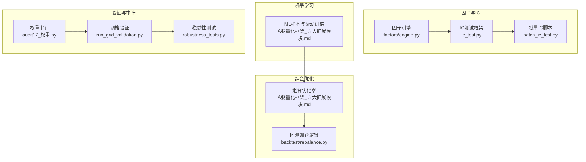

图表来源
- [factors/engine.py:34-86](file://factors/engine.py#L34-L86)
- [projects/Project_01_多因子IC小盘Alpha/research/multi_factor_ic/ic_test.py:78-162](file://projects/Project_01_多因子IC小盘Alpha/research/multi_factor_ic/ic_test.py#L78-L162)
- [scripts/batch_ic_test.py:84-165](file://scripts/batch_ic_test.py#L84-L165)
- [A股量化框架_五大扩展模块.md:14-509](file://A股量化框架_五大扩展模块.md#L14-L509)
- [A股量化框架_五大扩展模块.md:522-952](file://A股量化框架_五大扩展模块.md#L522-L952)
- [backtest/rebalance.py:141-168](file://backtest/rebalance.py#L141-L168)
- [projects/Project_10_价值小盘V2/run_grid_validation.py:421-479](file://projects/Project_10_价值小盘V2/run_grid_validation.py#L421-L479)
- [projects/verification/robustness_tests.py:221-262](file://projects/verification/robustness_tests.py#L221-L262)
- [research_audit/audit17_权重.py:229-322](file://research_audit/audit17_权重.py#L229-L322)

章节来源
- [factors/engine.py:34-86](file://factors/engine.py#L34-L86)
- [projects/Project_01_多因子IC小盘Alpha/research/multi_factor_ic/ic_test.py:78-162](file://projects/Project_01_多因子IC小盘Alpha/research/multi_factor_ic/ic_test.py#L78-L162)
- [scripts/batch_ic_test.py:84-165](file://scripts/batch_ic_test.py#L84-L165)
- [A股量化框架_五大扩展模块.md:14-509](file://A股量化框架_五大扩展模块.md#L14-L509)
- [A股量化框架_五大扩展模块.md:522-952](file://A股量化框架_五大扩展模块.md#L522-L952)
- [backtest/rebalance.py:141-168](file://backtest/rebalance.py#L141-L168)
- [projects/Project_10_价值小盘V2/run_grid_validation.py:421-479](file://projects/Project_10_价值小盘V2/run_grid_validation.py#L421-L479)
- [projects/verification/robustness_tests.py:221-262](file://projects/verification/robustness_tests.py#L221-L262)
- [research_audit/audit17_权重.py:229-322](file://research_audit/audit17_权重.py#L229-L322)

## 核心组件
- 因子引擎与IC统计：提供截面相关性（Rank IC）、ICIR、分组收益等指标，用于因子筛选与稳定性评估
- 机器学习流水线：时间序列切分、滚动训练、特征工程、集成预测，内置 L1/L2 正则与早停
- 组合优化器：均值-方差、最小方差、最大夏普、风险平价/预算、行业与换手率约束，协方差收缩估计
- 网格验证与稳健性测试：评分/风控参数扫描、子样本/牛熊/极端事件/成本压力测试

章节来源
- [factors/engine.py:34-86](file://factors/engine.py#L34-L86)
- [projects/Project_01_多因子IC小盘Alpha/research/multi_factor_ic/ic_test.py:78-162](file://projects/Project_01_多因子IC小盘Alpha/research/multi_factor_ic/ic_test.py#L78-L162)
- [scripts/batch_ic_test.py:84-165](file://scripts/batch_ic_test.py#L84-L165)
- [A股量化框架_五大扩展模块.md:14-509](file://A股量化框架_五大扩展模块.md#L14-L509)
- [A股量化框架_五大扩展模块.md:522-952](file://A股量化框架_五大扩展模块.md#L522-L952)
- [projects/verification/robustness_tests.py:221-262](file://projects/verification/robustness_tests.py#L221-L262)

## 架构总览
下图展示从因子计算到IC检验、机器学习滚动训练、组合优化与网格验证的整体流程，强调时间序列一致性、正则化与稳健性校验的关键节点。

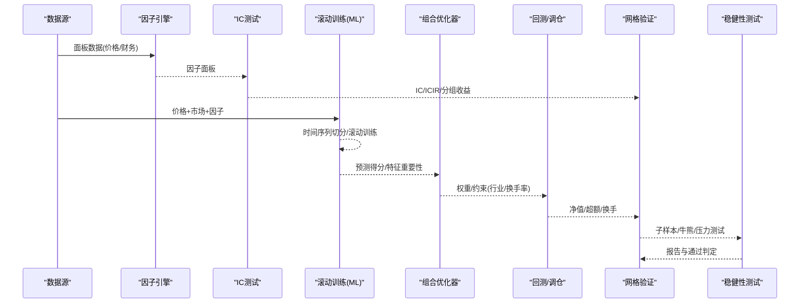

图表来源
- [factors/engine.py:34-86](file://factors/engine.py#L34-L86)
- [projects/Project_01_多因子IC小盘Alpha/research/multi_factor_ic/ic_test.py:78-162](file://projects/Project_01_多因子IC小盘Alpha/research/multi_factor_ic/ic_test.py#L78-L162)
- [A股量化框架_五大扩展模块.md:14-509](file://A股量化框架_五大扩展模块.md#L14-L509)
- [A股量化框架_五大扩展模块.md:522-952](file://A股量化框架_五大扩展模块.md#L522-L952)
- [backtest/rebalance.py:141-168](file://backtest/rebalance.py#L141-L168)
- [projects/Project_10_价值小盘V2/run_grid_validation.py:421-479](file://projects/Project_10_价值小盘V2/run_grid_validation.py#L421-L479)
- [projects/verification/robustness_tests.py:221-262](file://projects/verification/robustness_tests.py#L221-L262)

## 详细组件分析

### 正则化技术：L1/L2 在因子权重优化中的应用
- LightGBM/XGBoost 默认包含 L1/L2 正则项，配合早停与特征采样，降低过拟合风险
- 组合优化中的协方差收缩（Ledoit-Wolf）与换手率惩罚，等价于对权重解的平滑与稀疏化
- 建议：
  - 树模型：设置合理的 lambda_l1/lambda_l2、min_child_samples、early_stopping_rounds
  - 优化器：引入换手率约束或 L1 惩罚，避免权重剧烈变化
  - 协方差估计：使用收缩估计替代样本协方差，提高稳定性

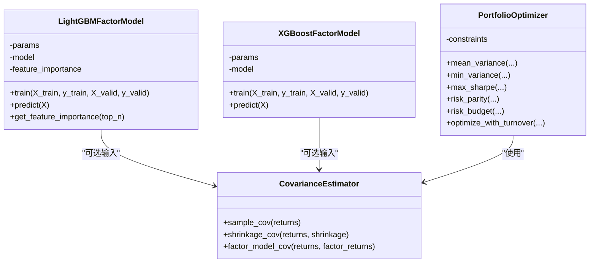

图表来源
- [A股量化框架_五大扩展模块.md:14-509](file://A股量化框架_五大扩展模块.md#L14-L509)
- [A股量化框架_五大扩展模块.md:522-952](file://A股量化框架_五大扩展模块.md#L522-L952)

章节来源
- [A股量化框架_五大扩展模块.md:14-509](file://A股量化框架_五大扩展模块.md#L14-L509)
- [A股量化框架_五大扩展模块.md:522-952](file://A股量化框架_五大扩展模块.md#L522-L952)

### 简化模型策略：因子数量控制、参数范围限制、复杂度管理
- 因子数量控制：仅保留前N个重要因子，避免维度爆炸；交互特征限定规模
- 参数范围限制：限制树深度、学习率、子采样比例、正则系数范围
- 复杂度管理：早停、最小叶子样本数、特征/样本随机采样
- 回测侧：行业上限、最大持仓数、换手率上限，降低交易成本与过拟合暴露

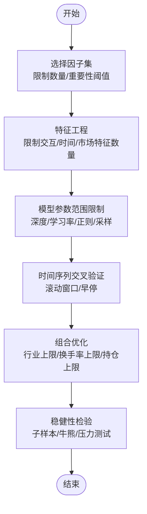

图表来源
- [A股量化框架_五大扩展模块.md:14-509](file://A股量化框架_五大扩展模块.md#L14-L509)
- [backtest/rebalance.py:141-168](file://backtest/rebalance.py#L141-L168)

章节来源
- [A股量化框架_五大扩展模块.md:14-509](file://A股量化框架_五大扩展模块.md#L14-L509)
- [backtest/rebalance.py:141-168](file://backtest/rebalance.py#L141-L168)

### 交叉验证策略：时序CV、滚动窗口、留一法
- 时间序列切分：严格保持时间顺序，避免未来函数泄露
- 滚动窗口（Walk-Forward）：固定训练窗口长度，滑动验证窗口，按月重训
- 留一法（LOO）：适用于短样本或极端场景，但计算成本高
- 建议：优先使用滚动窗口；在极端行情下辅以 LOO 或子样本检验

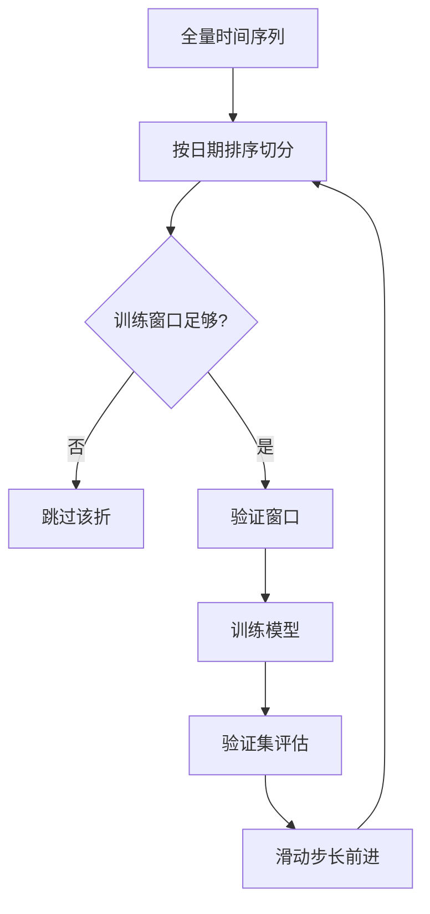

图表来源
- [A股量化框架_五大扩展模块.md:14-509](file://A股量化框架_五大扩展模块.md#L14-L509)

章节来源
- [A股量化框架_五大扩展模块.md:14-509](file://A股量化框架_五大扩展模块.md#L14-L509)

### 过拟合检测指标：训练/测试差距、因子稳定性、参数敏感性
- 训练/测试差距：比较 train_mse 与 valid_mse，差距过大提示过拟合
- 因子稳定性：IC均值、ICIR、IC>0占比、分组收益单调性
- 参数敏感性：网格扫描不同参数下的超额表现，观察是否仅在窄参数区间有效
- 稳健性：子样本/牛熊市/极端事件/成本压力测试通过率

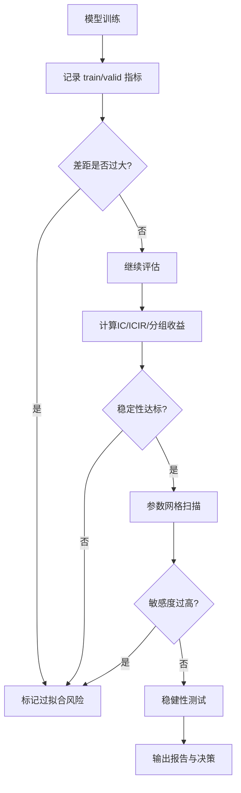

图表来源
- [A股量化框架_五大扩展模块.md:14-509](file://A股量化框架_五大扩展模块.md#L14-L509)
- [projects/Project_01_多因子IC小盘Alpha/research/multi_factor_ic/ic_test.py:117-162](file://projects/Project_01_多因子IC小盘Alpha/research/multi_factor_ic/ic_test.py#L117-L162)
- [projects/verification/robustness_tests.py:221-262](file://projects/verification/robustness_tests.py#L221-L262)

章节来源
- [A股量化框架_五大扩展模块.md:14-509](file://A股量化框架_五大扩展模块.md#L14-L509)
- [projects/Project_01_多因子IC小盘Alpha/research/multi_factor_ic/ic_test.py:117-162](file://projects/Project_01_多因子IC小盘Alpha/research/multi_factor_ic/ic_test.py#L117-L162)
- [projects/verification/robustness_tests.py:221-262](file://projects/verification/robustness_tests.py#L221-L262)

### 权重优化与正则化：均值-方差、风险平价、换手率约束
- 均值-方差：加入风险厌恶系数，约束单股/行业权重，防止集中暴露
- 风险平价/预算：均衡风险贡献，降低单一资产波动主导
- 换手率约束：L1 惩罚权重变动，减少交易成本与过度调仓
- 协方差收缩：Ledoit-Wolf 估计，缓解样本协方差不稳定导致的权重震荡

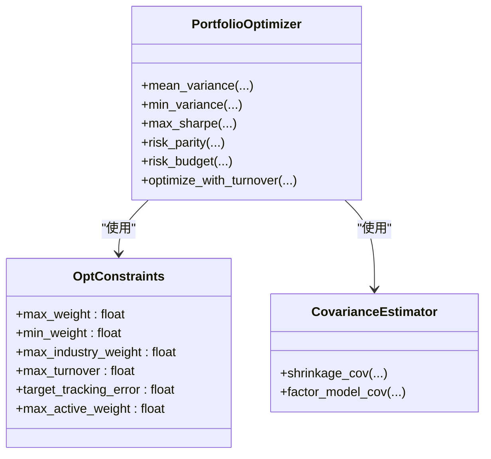

图表来源
- [A股量化框架_五大扩展模块.md:522-952](file://A股量化框架_五大扩展模块.md#L522-L952)

章节来源
- [A股量化框架_五大扩展模块.md:522-952](file://A股量化框架_五大扩展模块.md#L522-L952)

### 网格验证与参数敏感性：评分/风控参数扫描
- 评分网格：BP_z/hp/EP/ATR/换手等多因子权重组合，评估超额与回撤
- 风控网格：ATR止损、分层降仓、信号补仓等组合，观察稳健性
- 2026 逐期明细：关注近期表现与稳定性，避免历史过拟合

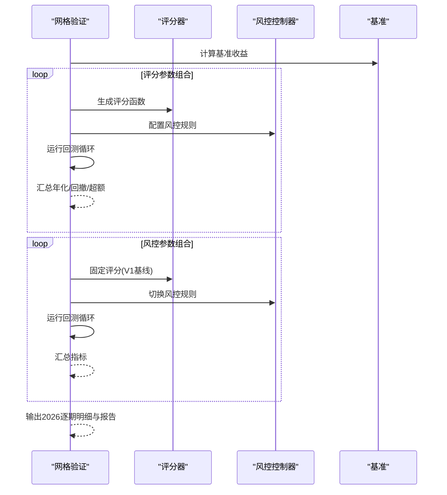

图表来源
- [projects/Project_10_价值小盘V2/run_grid_validation.py:421-479](file://projects/Project_10_价值小盘V2/run_grid_validation.py#L421-L479)

章节来源
- [projects/Project_10_价值小盘V2/run_grid_validation.py:421-479](file://projects/Project_10_价值小盘V2/run_grid_validation.py#L421-L479)

### 因子权重审计：z/hp 配比优化
- 通过参数化 score_v2_weighted 进行 z/hp 配比扫描，对比全期/2024+/2026 超额
- 结合基准收益计算超额，筛选最优配比

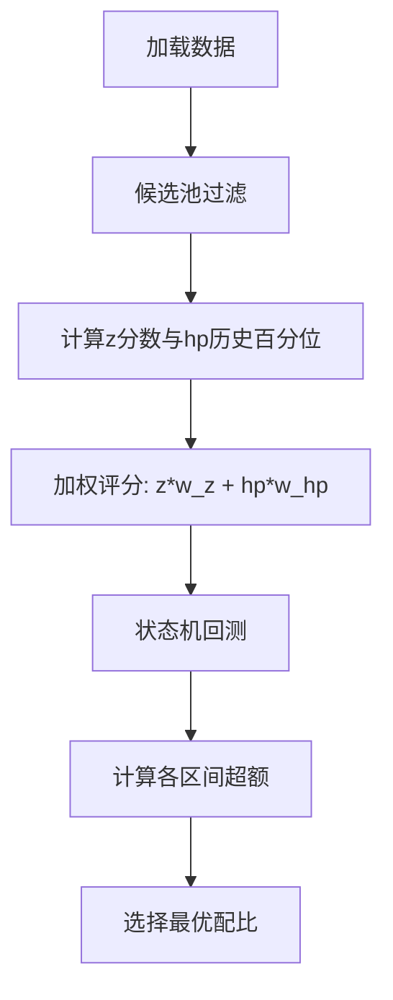

图表来源
- [research_audit/audit17_权重.py:119-131](file://research_audit/audit17_权重.py#L119-L131)
- [research_audit/audit17_权重.py:229-322](file://research_audit/audit17_权重.py#L229-L322)

章节来源
- [research_audit/audit17_权重.py:119-131](file://research_audit/audit17_权重.py#L119-L131)
- [research_audit/audit17_权重.py:229-322](file://research_audit/audit17_权重.py#L229-L322)

### 稳健性测试：子样本/牛熊/极端事件/成本压力
- 子样本检验：分段区间年化/回撤，评估跨周期稳定性
- 牛熊市分拆：不同市场环境下的收益与回撤
- 极端事件压力：模拟微盘踩踏等情景
- 交易成本压力：佣金与滑点放大，评估影响

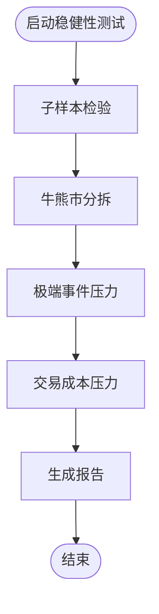

图表来源
- [projects/verification/robustness_tests.py:35-158](file://projects/verification/robustness_tests.py#L35-L158)

章节来源
- [projects/verification/robustness_tests.py:35-158](file://projects/verification/robustness_tests.py#L35-L158)

## 依赖关系分析
- 因子引擎与IC测试：依赖面板数据与前向收益计算，输出IC统计
- 机器学习流水线：依赖价格/市场/因子数据，输出预测与特征重要性
- 组合优化器：依赖协方差估计与约束条件，输出权重
- 网格验证与稳健性测试：依赖回测结果与基准，输出报告

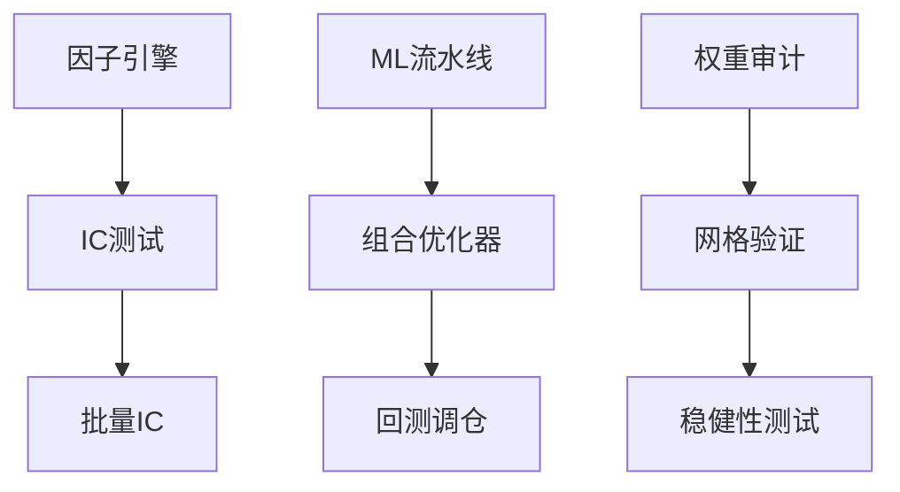

图表来源
- [factors/engine.py:34-86](file://factors/engine.py#L34-L86)
- [projects/Project_01_多因子IC小盘Alpha/research/multi_factor_ic/ic_test.py:78-162](file://projects/Project_01_多因子IC小盘Alpha/research/multi_factor_ic/ic_test.py#L78-L162)
- [scripts/batch_ic_test.py:84-165](file://scripts/batch_ic_test.py#L84-L165)
- [A股量化框架_五大扩展模块.md:14-509](file://A股量化框架_五大扩展模块.md#L14-L509)
- [A股量化框架_五大扩展模块.md:522-952](file://A股量化框架_五大扩展模块.md#L522-L952)
- [backtest/rebalance.py:141-168](file://backtest/rebalance.py#L141-L168)
- [projects/Project_10_价值小盘V2/run_grid_validation.py:421-479](file://projects/Project_10_价值小盘V2/run_grid_validation.py#L421-L479)
- [projects/verification/robustness_tests.py:221-262](file://projects/verification/robustness_tests.py#L221-L262)
- [research_audit/audit17_权重.py:229-322](file://research_audit/audit17_权重.py#L229-L322)

章节来源
- [factors/engine.py:34-86](file://factors/engine.py#L34-L86)
- [projects/Project_01_多因子IC小盘Alpha/research/multi_factor_ic/ic_test.py:78-162](file://projects/Project_01_多因子IC小盘Alpha/research/multi_factor_ic/ic_test.py#L78-L162)
- [scripts/batch_ic_test.py:84-165](file://scripts/batch_ic_test.py#L84-L165)
- [A股量化框架_五大扩展模块.md:14-509](file://A股量化框架_五大扩展模块.md#L14-L509)
- [A股量化框架_五大扩展模块.md:522-952](file://A股量化框架_五大扩展模块.md#L522-L952)
- [backtest/rebalance.py:141-168](file://backtest/rebalance.py#L141-L168)
- [projects/Project_10_价值小盘V2/run_grid_validation.py:421-479](file://projects/Project_10_价值小盘V2/run_grid_validation.py#L421-L479)
- [projects/verification/robustness_tests.py:221-262](file://projects/verification/robustness_tests.py#L221-L262)
- [research_audit/audit17_权重.py:229-322](file://research_audit/audit17_权重.py#L229-L322)

## 性能考虑
- 时间序列切分与滚动训练：避免数据泄露，保证评估真实性
- 协方差收缩与因子模型估计：降低高维协方差矩阵的不稳定性
- 换手率约束与交易成本：减少频繁调仓带来的成本侵蚀
- 早停与正则化：控制模型复杂度，提升泛化能力

[本节为通用指导，不直接分析具体文件]

## 故障排查指南
- IC统计异常：检查前向收益计算、截面样本数量、缺失值处理
- 模型过拟合：观察 train/valid 差距，调整正则与早停参数
- 权重不稳定：检查协方差估计方法、换手率约束、行业上限
- 稳健性失败：细分子样本/牛熊/压力场景，定位脆弱环节

章节来源
- [projects/verification/robustness_tests.py:221-262](file://projects/verification/robustness_tests.py#L221-L262)
- [A股量化框架_五大扩展模块.md:14-509](file://A股量化框架_五大扩展模块.md#L14-L509)

## 结论
通过系统化的正则化、简化模型、时序交叉验证与稳健性测试，QuantLab 能够在因子合成与权重优化过程中有效防范过拟合。建议在研究中坚持时间序列一致性、严格控制模型复杂度，并以多维度的稳健性检验作为最终决策依据。

[本节为总结，不直接分析具体文件]

## 附录
- 关键实现路径参考：
  - 因子IC统计：[factors/engine.py:34-86](file://factors/engine.py#L34-L86)、[projects/Project_01_多因子IC小盘Alpha/research/multi_factor_ic/ic_test.py:78-162](file://projects/Project_01_多因子IC小盘Alpha/research/multi_factor_ic/ic_test.py#L78-L162)
  - 机器学习正则化与滚动训练：[A股量化框架_五大扩展模块.md:14-509](file://A股量化框架_五大扩展模块.md#L14-L509)
  - 组合优化与协方差收缩：[A股量化框架_五大扩展模块.md:522-952](file://A股量化框架_五大扩展模块.md#L522-L952)
  - 网格验证与稳健性测试：[projects/Project_10_价值小盘V2/run_grid_validation.py:421-479](file://projects/Project_10_价值小盘V2/run_grid_validation.py#L421-L479)、[projects/verification/robustness_tests.py:221-262](file://projects/verification/robustness_tests.py#L221-L262)
  - 权重审计与配比优化：[research_audit/audit17_权重.py:229-322](file://research_audit/audit17_权重.py#L229-L322)

[本节为附录，不直接分析具体文件]