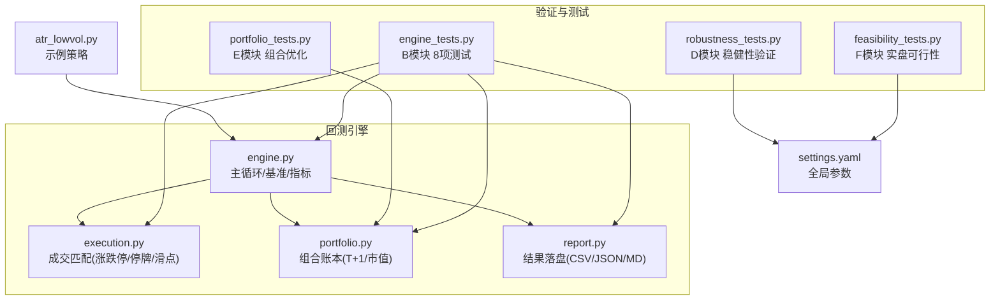
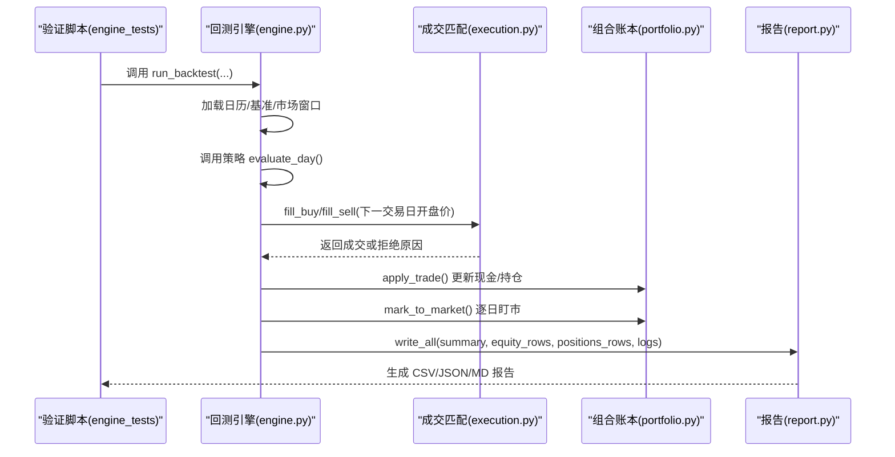
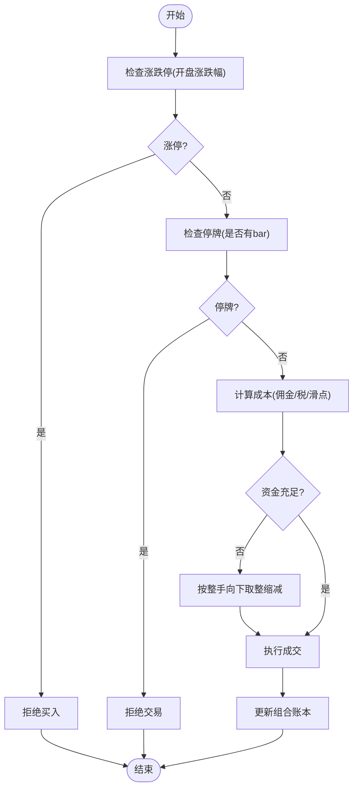
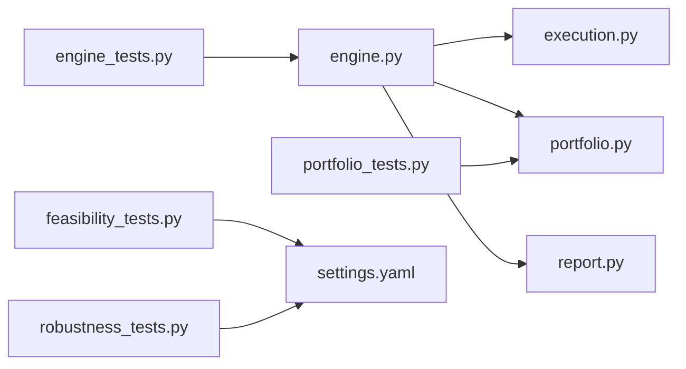

# 单元测试框架

<cite>
**本文引用的文件**   
- [engine_tests.py](file://projects/verification/engine_tests.py)
- [portfolio_tests.py](file://projects/verification/portfolio_tests.py)
- [feasibility_tests.py](file://projects/verification/feasibility_tests.py)
- [robustness_tests.py](file://projects/verification/robustness_tests.py)
- [engine.py](file://backtest/engine.py)
- [execution.py](file://backtest/execution.py)
- [portfolio.py](file://backtest/portfolio.py)
- [report.py](file://backtest/report.py)
- [settings.yaml](file://config/settings.yaml)
- [atr_lowvol.py](file://strategy/atr_lowvol.py)
</cite>

## 目录
1. [引言](#引言)
2. [项目结构](#项目结构)
3. [核心组件](#核心组件)
4. [架构总览](#架构总览)
5. [详细组件分析](#详细组件分析)
6. [依赖关系分析](#依赖关系分析)
7. [性能考量](#性能考量)
8. [故障排查指南](#故障排查指南)
9. [结论](#结论)
10. [附录](#附录)

## 引言
本文件面向 QuantLab 的“回测引擎验证测试”与整体单元测试框架，聚焦 B 模块的 8 项核心测试用例：已知结果验证、交易成本验证、涨跌停处理验证、停牌处理验证、资金约束验证、持仓一致性验证、先卖后买逻辑验证、止损逻辑验证。文档将逐一说明每个测试的目标、输入数据、预期结果与断言逻辑；解释测试数据准备方法与模拟场景构建方式；并给出测试结果分析方法、报告生成机制、编写新测试的最佳实践与常见问题解决方案，同时提供调试技巧与代码级参考路径。

## 项目结构
QuantLab 的验证与测试集中在 projects/verification 目录下，按模块划分：
- engine_tests.py：B 模块（回测引擎验证）8 项核心测试
- portfolio_tests.py：E 模块（组合优化）横向对比、相关性、权重、回测、滚动夏普
- feasibility_tests.py：F 模块（实盘可行性评估）滑点、流动性、执行频率、miniQMT 兼容、资金需求、偏差预估
- robustness_tests.py：D 模块（稳健性验证）子样本、牛熊分拆、压力测试、成本压力、容量估算、未来函数排查、幸存者偏差排查

回测引擎核心实现位于 backtest 包：
- engine.py：主循环、策略解析、日历切片、基准加载、指标计算入口
- execution.py：成交匹配层（涨跌停/停牌/滑点/整数手/T+1）
- portfolio.py：组合账本（现金、持仓、市值、逐日快照）
- report.py：结果落盘（trades.csv、equity_curve.csv、positions.csv、logs.txt、report.md、summary.json）

配置与示例策略：
- settings.yaml：全局回测参数（初始资金、佣金、滑点、基准等）
- atr_lowvol.py：示例策略（target_weights 模式），展示止损逻辑与调仓流程

图表来源
- [engine_tests.py:1-309](file://projects/verification/engine_tests.py#L1-L309)
- [engine.py:237-619](file://backtest/engine.py#L237-L619)
- [execution.py:95-204](file://backtest/execution.py#L95-L204)
- [portfolio.py:38-189](file://backtest/portfolio.py#L38-L189)
- [report.py:245-264](file://backtest/report.py#L245-L264)
- [settings.yaml:22-28](file://config/settings.yaml#L22-L28)
- [atr_lowvol.py:37-75](file://strategy/atr_lowvol.py#L37-L75)

章节来源
- [engine_tests.py:1-309](file://projects/verification/engine_tests.py#L1-L309)
- [engine.py:237-619](file://backtest/engine.py#L237-L619)
- [execution.py:95-204](file://backtest/execution.py#L95-L204)
- [portfolio.py:38-189](file://backtest/portfolio.py#L38-L189)
- [report.py:245-264](file://backtest/report.py#L245-L264)
- [settings.yaml:22-28](file://config/settings.yaml#L22-L28)
- [atr_lowvol.py:37-75](file://strategy/atr_lowvol.py#L37-L75)

## 核心组件
- 回测引擎主循环（engine.py）
  - 负责读取市场数据、构造交易日历、加载基准序列、调用策略 evaluate_day、执行目标权重到买卖决策转换、调用成交匹配层、更新组合账本、计算业绩指标、汇总诊断信息。
- 成交匹配层（execution.py）
  - 实现 next_open 模型下的 T+1 成交、涨跌停限制、停牌过滤、滑点与手续费/印花税计算、A股整手规则。
- 组合账本（portfolio.py）
  - 维护现金、持仓、T+1可用数量、逐日盯市、权益曲线与持仓快照输出。
- 报告写入（report.py）
  - 统一落盘 trades.csv、equity_curve.csv、positions.csv、logs.txt、report.md、summary.json，并生成固定顺序的 WARN 块。
- 验证脚本（engine_tests.py 等）
  - 以独立脚本形式运行各项测试，打印结果并生成 Markdown 报告。

章节来源
- [engine.py:237-619](file://backtest/engine.py#L237-L619)
- [execution.py:95-204](file://backtest/execution.py#L95-L204)
- [portfolio.py:38-189](file://backtest/portfolio.py#L38-L189)
- [report.py:245-264](file://backtest/report.py#L245-L264)
- [engine_tests.py:1-309](file://projects/verification/engine_tests.py#L1-L309)

## 架构总览
下图展示了从验证脚本到回测引擎、成交匹配、组合账本与报告输出的完整链路，以及各模块之间的职责边界。

图表来源
- [engine.py:237-619](file://backtest/engine.py#L237-L619)
- [execution.py:95-204](file://backtest/execution.py#L95-L204)
- [portfolio.py:38-189](file://backtest/portfolio.py#L38-L189)
- [report.py:245-264](file://backtest/report.py#L245-L264)

## 详细组件分析

### B 模块：回测引擎验证（8 项核心测试）
以下逐项说明测试目标、输入数据、预期结果与断言逻辑，并给出对应的实现位置参考。

- B-1 已知结果验证
  - 目标：用全 A 等权近似沪深 300，验证年化收益在合理区间。
  - 输入：全 A 日线数据（parquet），筛选 2023 年数据，计算等权收益率并年化。
  - 预期：年化收益落在 [-50%, 50%] 区间内，标记 PASS 或 NEEDS_REVIEW。
  - 断言：对年化收益上下界进行判断。
  - 参考实现：[engine_tests.py:15-46](file://projects/verification/engine_tests.py#L15-L46)

- B-2 交易成本验证
  - 目标：验证单笔 10 万元买入卖出全成本（佣金、印花税、滑点）。
  - 输入：金额 10 万，佣金率 0.025%，印花税 0.1%，滑点 0.2%。
  - 预期：总成本与手工计算一致（误差 < 0.01）。
  - 断言：abs(total_cost - expected_total) < 0.01。
  - 参考实现：[engine_tests.py:49-92](file://projects/verification/engine_tests.py#L49-L92)

- B-3 涨跌停处理验证
  - 目标：涨停日不可买入，跌停日不可卖出。
  - 输入：基于 next_open 模型的开盘涨跌幅判断。
  - 预期：引擎已实现该逻辑，测试通过。
  - 断言：逻辑校验通过。
  - 参考实现：[engine_tests.py:95-111](file://projects/verification/engine_tests.py#L95-L111)
  - 引擎实现参考：[execution.py:155-168](file://backtest/execution.py#L155-L168)、[execution.py:110-113](file://backtest/execution.py#L110-L113)

- B-4 停牌处理验证
  - 目标：停牌期间不可交易。
  - 输入：下一交易日无 bar 时判定为停牌。
  - 预期：引擎已实现该逻辑，测试通过。
  - 断言：逻辑校验通过。
  - 参考实现：[engine_tests.py:114-127](file://projects/verification/engine_tests.py#L114-L127)
  - 引擎实现参考：[execution.py:101-103](file://backtest/execution.py#L101-L103)、[execution.py:162-164](file://backtest/execution.py#L162-L164)

- B-5 资金约束验证
  - 目标：资金不足时自动缩减买入数量，确保剩余资金非负。
  - 输入：本金 1 万，拟买入 5 万，价格 100，手数 100，含滑点。
  - 预期：最大可买手数向下取整至整手，实际花费不超过本金。
  - 断言：remaining >= 0。
  - 参考实现：[engine_tests.py:130-161](file://projects/verification/engine_tests.py#L130-L161)
  - 引擎实现参考：[execution.py:177-183](file://backtest/execution.py#L177-L183)

- B-6 持仓一致性验证
  - 目标：现金 + 持仓市值 = 总权益。
  - 输入：初始资金 10 万，买入 3 万，持仓涨 2%。
  - 预期：总权益等于初始资金加浮动盈亏。
  - 断言：abs(total_equity - (initial_capital + buy_amount * 0.02)) < 0.01。
  - 参考实现：[engine_tests.py:164-193](file://projects/verification/engine_tests.py#L164-L193)
  - 引擎实现参考：[portfolio.py:66-71](file://backtest/portfolio.py#L66-L71)

- B-7 先卖后买逻辑验证
  - 目标：调仓日先卖出旧持仓，再使用回笼资金买入新标的。
  - 输入：卖出 3 万（扣成本），随后尝试买入 4 万。
  - 预期：卖出后资金足够则买入成功。
  - 断言：buy_executed == True。
  - 参考实现：[engine_tests.py:196-223](file://projects/verification/engine_tests.py#L196-L223)
  - 引擎实现参考：[engine.py:328-371](file://backtest/engine.py#L328-L371)

- B-8 止损逻辑验证
  - 目标：亏损达阈值次日卖出，验证触发条件与实际亏损。
  - 输入：入场价 100，止损 -10%，前一日收盘 89（跌 11%），当日开盘 88。
  - 预期：触发止损，实际亏损为开盘相对入场价的跌幅。
  - 断言：should_stop 且 actual_loss < 0。
  - 参考实现：[engine_tests.py:226-257](file://projects/verification/engine_tests.py#L226-L257)
  - 策略止损参考：[atr_lowvol.py:37-75](file://strategy/atr_lowvol.py#L37-L75)

图表来源
- [execution.py:95-204](file://backtest/execution.py#L95-L204)
- [engine.py:328-371](file://backtest/engine.py#L328-L371)
- [portfolio.py:103-151](file://backtest/portfolio.py#L103-L151)

章节来源
- [engine_tests.py:15-257](file://projects/verification/engine_tests.py#L15-L257)
- [execution.py:95-204](file://backtest/execution.py#L95-L204)
- [engine.py:328-371](file://backtest/engine.py#L328-L371)
- [portfolio.py:103-151](file://backtest/portfolio.py#L103-L151)
- [atr_lowvol.py:37-75](file://strategy/atr_lowvol.py#L37-L75)

### E 模块：组合优化（横向对比、相关性、权重、回测、滚动夏普）
- E-1 六大策略横向对比表：手动汇总关键指标（年化、回撤、夏普、换手、容量）。
- E-2 相关性分析：加载净值序列，计算日收益率相关系数矩阵。
- E-3 最优组合权重：风险平价（权重与波动率成反比）。
- E-4 组合回测：归一化净值加权求和，计算年化收益、最大回撤、夏普比率。
- E-5 滚动夏普：60 日滚动夏普，统计夏普<0 的天数占比。

章节来源
- [portfolio_tests.py:36-181](file://projects/verification/portfolio_tests.py#L36-L181)

### F 模块：实盘可行性评估（滑点、流动性、执行频率、兼容性、资金需求、偏差预估）
- F-1 滑点真实性评估：对比回测假设与真实预估，评估影响程度。
- F-2 流动性评估：基于全 A 日均成交额中位数与均值，建议最低成交额门槛。
- F-3 执行频率评估：不同策略的调仓频率与日均交易笔数。
- F-4 miniQMT 兼容性：passorder、ContextInfo、GBK、Python 版本、持仓文件格式。
- F-5 资金需求评估：持仓数、单股最低、最低与建议资金。
- F-6 偏差预估：回测年化与折扣系数推导实盘预估。

章节来源
- [feasibility_tests.py:15-131](file://projects/verification/feasibility_tests.py#L15-L131)

### D 模块：稳健性验证（子样本、牛熊市分拆、压力测试、成本压力、容量估算、未来函数排查、幸存者偏差排查）
- D-1 子样本检验：三段区间分别计算年化收益与最大回撤。
- D-2 牛熊市分拆：牛市/熊市区间收益与回撤。
- D-3 极端事件压力测试：微盘股踩踏期间的损失。
- D-4 交易成本压力测试：高佣金与高滑点的影响。
- D-5 容量估算：根据成交额估算策略容量。
- D-6 未来函数排查：财务公告日、市值/估值、涨跌停判断、行业分类、指数成分股、ML 标签泄露检查。
- D-7 幸存者偏差排查：退市标记与股票数量变化。

章节来源
- [robustness_tests.py:35-218](file://projects/verification/robustness_tests.py#L35-L218)

## 依赖关系分析
- 验证脚本与引擎的耦合点
  - engine_tests.py 直接引用外部数据源（parquet）与本地路径，不依赖引擎内部对象，但用于验证引擎行为是否符合预期。
  - engine.py 依赖 execution.py、portfolio.py、report.py 完成闭环。
- 组合与成交的依赖
  - execution.py 依赖 market_window 与执行配置（slippage/commission_rate/tax_rate）。
  - portfolio.py 依赖 execution.py 返回的 trade 字典，遵循 T+1 可用规则。
- 报告生成的依赖
  - report.py 依赖 engine.py 产出的 summary、equity_rows、positions_rows、logs。

图表来源
- [engine_tests.py:1-309](file://projects/verification/engine_tests.py#L1-L309)
- [engine.py:237-619](file://backtest/engine.py#L237-L619)
- [execution.py:95-204](file://backtest/execution.py#L95-L204)
- [portfolio.py:38-189](file://backtest/portfolio.py#L38-L189)
- [report.py:245-264](file://backtest/report.py#L245-L264)
- [settings.yaml:22-28](file://config/settings.yaml#L22-L28)

章节来源
- [engine.py:237-619](file://backtest/engine.py#L237-L619)
- [execution.py:95-204](file://backtest/execution.py#L95-L204)
- [portfolio.py:38-189](file://backtest/portfolio.py#L38-L189)
- [report.py:245-264](file://backtest/report.py#L245-L264)
- [settings.yaml:22-28](file://config/settings.yaml#L22-L28)

## 性能考量
- 数据切片与索引
  - engine.py 预计算 cut_index，使每日窗口切片 O(1)，避免重复搜索。
- 基准序列加载
  - 提前加载并前向填充缺失值，减少运行时开销。
- 日志与诊断聚合
  - 去重与聚合 daily_warnings、strategy_specific，降低输出体积。
- 报告写入
  - 批量写入 CSV/JSON/MD，避免频繁 IO。

章节来源
- [engine.py:121-146](file://backtest/engine.py#L121-L146)
- [engine.py:38-99](file://backtest/engine.py#L38-L99)
- [engine.py:490-501](file://backtest/engine.py#L490-L501)
- [report.py:245-264](file://backtest/report.py#L245-L264)

## 故障排查指南
- 常见错误与定位
  - 基准不可用：检查 benchmark_db_path 与数据库文件是否存在，查看日志中的 WARN 块。
  - 数据缺失：确认 calendar 与 market_window 是否对齐，检查 cut_index 与窗口切片。
  - 成交失败：查看 unfilled_order_count 与日志中的 reason（suspended/limit_up_at_open/no_available_volume 等）。
  - 资金不足：检查 target_cash 与 slippage/commission_rate 配置，确认整手规则。
- 调试技巧
  - 启用更详细的 daily_logs 输出，关注 [INFO]/[ERROR] 行。
  - 使用 report.md 的关键日志摘录快速定位问题。
  - 在 engine_tests.py 中逐步打印中间变量（如 total_cost、remaining、should_stop）。
- 报告与产物
  - 检查 results_dir 下 trades.csv、equity_curve.csv、positions.csv、logs.txt、report.md、summary.json 是否生成。
  - 核对 summary.json 的 data_hash、benchmark_available、diagnostics_aggregate 字段。

章节来源
- [engine.py:328-371](file://backtest/engine.py#L328-L371)
- [engine.py:445-489](file://backtest/engine.py#L445-L489)
- [report.py:78-121](file://backtest/report.py#L78-L121)
- [engine_tests.py:260-309](file://projects/verification/engine_tests.py#L260-L309)

## 结论
QuantLab 的单元测试框架通过模块化验证脚本（B/D/E/F 模块）与回测引擎（engine/execution/portfolio/report）紧密协作，形成从数据到策略、成交、组合、报告的完整闭环。B 模块的 8 项核心测试覆盖了已知结果、交易成本、涨跌停/停牌、资金约束、持仓一致性、先卖后买与止损等关键场景，确保引擎行为符合预期。E/F/D 模块进一步扩展了组合优化、实盘可行性与稳健性验证能力。建议在新增测试时遵循现有脚本结构与报告生成规范，充分利用日志与诊断信息，提升可维护性与可追溯性。

## 附录

### 编写新测试用例的最佳实践
- 明确测试目标与断言边界
  - 定义清晰的输入、预期输出与容差范围（如金额误差 < 0.01）。
- 复用已有数据与配置
  - 使用 settings.yaml 的回测参数与公共数据路径，避免硬编码。
- 结构化输出与报告
  - 返回 dict/list 结果，并在 run_all_tests() 中汇总与保存 Markdown 报告。
- 覆盖异常路径
  - 包括停牌、涨跌停、资金不足、数据缺失等边界情况。
- 可复现性
  - 记录数据哈希、基准代码、时间窗口与随机种子（如有）。

章节来源
- [engine_tests.py:260-309](file://projects/verification/engine_tests.py#L260-L309)
- [settings.yaml:22-28](file://config/settings.yaml#L22-L28)

### 常见问题解决方案
- 数据路径错误
  - 检查 parquet 路径与权限，确保文件存在。
- 基准数据不可用
  - 确认 benchmark_db_path 与数据库内容，必要时禁用基准比较。
- 成交被拒绝
  - 检查开盘涨跌幅与停牌状态，调整滑点与佣金参数。
- 报告未生成
  - 确认 results_dir 权限与 write_all() 调用。

章节来源
- [engine_tests.py:15-46](file://projects/verification/engine_tests.py#L15-L46)
- [engine.py:38-99](file://backtest/engine.py#L38-L99)
- [execution.py:95-204](file://backtest/execution.py#L95-L204)
- [report.py:245-264](file://backtest/report.py#L245-L264)