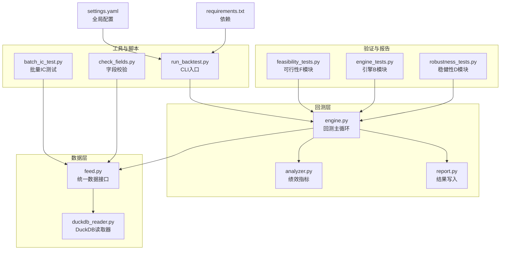
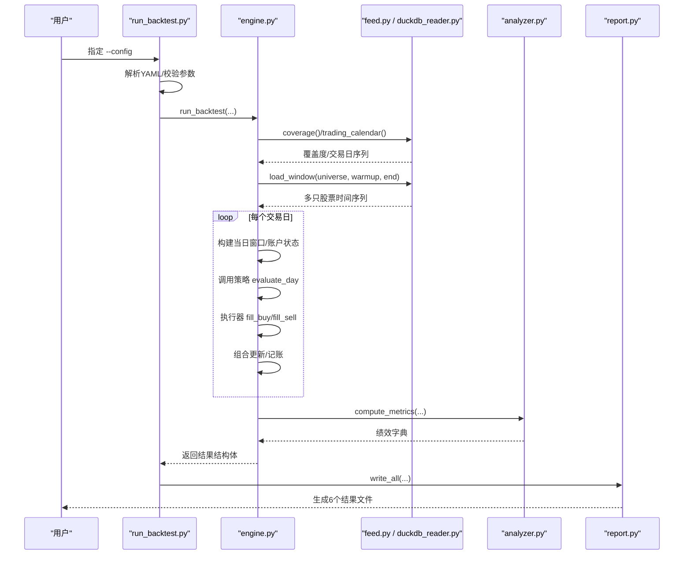
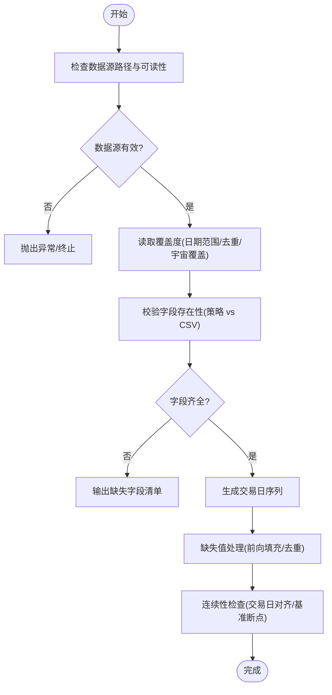
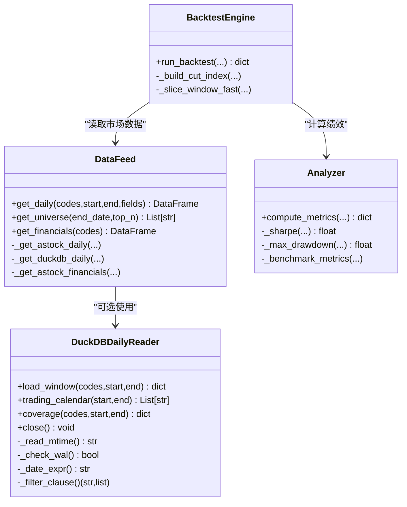
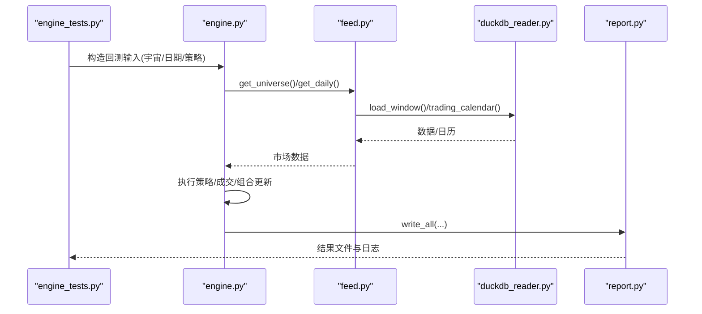
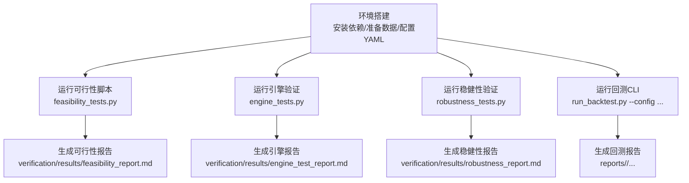
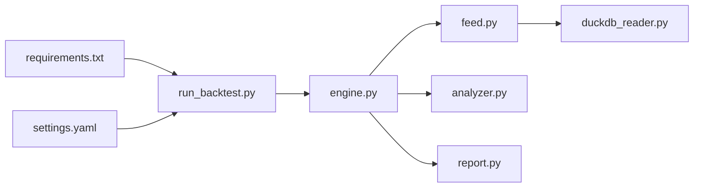

# 可行性测试

<cite>
**本文引用的文件**   
- [feasibility_tests.py](file://projects/verification/feasibility_tests.py)
- [engine_tests.py](file://projects/verification/engine_tests.py)
- [robustness_tests.py](file://projects/verification/robustness_tests.py)
- [check_fields.py](file://scripts/check_fields.py)
- [feed.py](file://data/feed.py)
- [duckdb_reader.py](file://data/duckdb_reader.py)
- [engine.py](file://backtest/engine.py)
- [analyzer.py](file://backtest/analyzer.py)
- [report.py](file://backtest/report.py)
- [run_backtest.py](file://scripts/run_backtest.py)
- [batch_ic_test.py](file://scripts/batch_ic_test.py)
- [settings.yaml](file://config/settings.yaml)
- [requirements.txt](file://requirements.txt)
</cite>

## 目录
1. [引言](#引言)
2. [项目结构](#项目结构)
3. [核心组件](#核心组件)
4. [架构总览](#架构总览)
5. [详细组件分析](#详细组件分析)
6. [依赖关系分析](#依赖关系分析)
7. [性能考量](#性能考量)
8. [故障排查指南](#故障排查指南)
9. [结论](#结论)
10. [附录](#附录)

## 引言
本文件面向 QuantLab 的“可行性测试”体系，围绕数据完整性检查、性能基准测试、兼容性测试与功能可用性测试四大主题，给出可操作的实现说明、流程图示与最佳实践。文档基于仓库现有代码与脚本进行梳理，确保读者既能快速上手执行，也能深入理解内部机制与优化点。

## 项目结构
QuantLab 将回测引擎、数据读取、报告输出与验证脚本分层组织：
- backtest：回测主循环、执行器、组合管理、指标计算与报告写入
- data：统一数据源接口与 DuckDB 读取器
- scripts：批量 IC 测试、字段校验、回测 CLI 等工具
- projects/verification：可行性、引擎、稳健性、组合等验证脚本与结果
- config：全局配置与策略参数
- requirements.txt：依赖声明

图表来源
- [engine.py:237-619](file://backtest/engine.py#L237-L619)
- [analyzer.py:96-176](file://backtest/analyzer.py#L96-L176)
- [report.py:245-264](file://backtest/report.py#L245-L264)
- [feed.py:17-135](file://data/feed.py#L17-L135)
- [duckdb_reader.py:35-215](file://data/duckdb_reader.py#L35-L215)
- [run_backtest.py:42-132](file://scripts/run_backtest.py#L42-L132)
- [batch_ic_test.py:1-266](file://scripts/batch_ic_test.py#L1-L266)
- [check_fields.py:1-32](file://scripts/check_fields.py#L1-L32)
- [settings.yaml:1-69](file://config/settings.yaml#L1-L69)
- [requirements.txt:1-29](file://requirements.txt#L1-L29)

章节来源
- [engine.py:237-619](file://backtest/engine.py#L237-L619)
- [feed.py:17-135](file://data/feed.py#L17-L135)
- [duckdb_reader.py:35-215](file://data/duckdb_reader.py#L35-L215)
- [run_backtest.py:42-132](file://scripts/run_backtest.py#L42-L132)
- [batch_ic_test.py:1-266](file://scripts/batch_ic_test.py#L1-L266)
- [check_fields.py:1-32](file://scripts/check_fields.py#L1-L32)
- [settings.yaml:1-69](file://config/settings.yaml#L1-L69)
- [requirements.txt:1-29](file://requirements.txt#L1-L29)

## 核心组件
- 回测引擎（engine.py）：负责日历生成、数据窗口切片、策略调用、成交模拟、组合更新、指标计算与汇总输出。
- 数据接口（feed.py + duckdb_reader.py）：统一 astock parquet 与 DuckDB 两种数据源，提供日线、财务、股票池与覆盖度统计。
- 指标计算（analyzer.py）：纯 numpy 实现年化收益、最大回撤、夏普、胜率、跟踪误差、信息比率等。
- 报告写入（report.py）：固定列顺序输出 trades/equity_curve/positions/logs/report.md/summary.json。
- 可行性验证（feasibility_tests.py）：滑点、流动性、执行频率、miniQMT兼容、资金需求、偏差预估。
- 引擎验证（engine_tests.py）：已知结果、交易成本、涨跌停/停牌处理、资金约束、持仓一致性、先卖后买、止损逻辑。
- 稳健性验证（robustness_tests.py）：子样本、牛熊分拆、压力测试、容量估算、未来函数排查、幸存者偏差。
- 批量 IC 测试（batch_ic_test.py）：全量因子 IC/ICIR 筛选与报告。
- 字段校验（check_fields.py）：策略所需财务字段与 CSV 列对比。
- 运行入口（run_backtest.py）：解析 YAML、加载数据、执行回测、写报告。
- 配置与依赖（settings.yaml, requirements.txt）：路径、回测参数、日志、因子预处理、策略宇宙、依赖版本。

章节来源
- [engine.py:237-619](file://backtest/engine.py#L237-L619)
- [analyzer.py:96-176](file://backtest/analyzer.py#L96-L176)
- [report.py:245-264](file://backtest/report.py#L245-L264)
- [feed.py:17-135](file://data/feed.py#L17-L135)
- [duckdb_reader.py:35-215](file://data/duckdb_reader.py#L35-L215)
- [feasibility_tests.py:15-178](file://projects/verification/feasibility_tests.py#L15-L178)
- [engine_tests.py:15-309](file://projects/verification/engine_tests.py#L15-L309)
- [robustness_tests.py:175-252](file://projects/verification/robustness_tests.py#L175-L252)
- [batch_ic_test.py:1-266](file://scripts/batch_ic_test.py#L1-L266)
- [check_fields.py:1-32](file://scripts/check_fields.py#L1-L32)
- [run_backtest.py:42-132](file://scripts/run_backtest.py#L42-L132)
- [settings.yaml:1-69](file://config/settings.yaml#L1-L69)
- [requirements.txt:1-29](file://requirements.txt#L1-L29)

## 架构总览
下图展示一次回测从 CLI 到数据读取、策略执行、指标计算与报告输出的完整流程。

图表来源
- [run_backtest.py:42-132](file://scripts/run_backtest.py#L42-L132)
- [engine.py:237-619](file://backtest/engine.py#L237-L619)
- [feed.py:17-135](file://data/feed.py#L17-L135)
- [duckdb_reader.py:90-215](file://data/duckdb_reader.py#L90-L215)
- [analyzer.py:96-176](file://backtest/analyzer.py#L96-L176)
- [report.py:245-264](file://backtest/report.py#L245-L264)

## 详细组件分析

### 数据完整性检查
目标：确保数据源可用、字段完整、时间连续、缺失值处理合理。

- 数据源验证
  - feed.py 支持 astock parquet 与 DuckDB 双源；若路径不存在或格式不符会抛出明确异常。
  - duckdb_reader.py 强制 read_only，检测 .wal 并发同步并告警；coverage() 返回最小/最大日期、去重计数、宇宙覆盖率。
- 字段完整性校验
  - check_fields.py 通过正则提取策略对财务字段的引用，并与 CSV 列对比，输出缺失/多余字段清单。
- 时间序列连续性检查
  - engine.py 使用 trading_calendar() 获取交易日序列，并对 benchmark 序列做前向填充与断点检测。
  - feed.py 在 get_daily 中按 trade_date 过滤与排序，保证 MultiIndex 有序。
- 缺失数据处理
  - analyzer.py 对空序列与零除情况做安全处理；engine.py 对未成交订单计数与日志记录；report.py 输出 WARN 块提示数据去重、WAL 同步、基准不可用等。

图表来源
- [feed.py:71-135](file://data/feed.py#L71-L135)
- [duckdb_reader.py:90-215](file://data/duckdb_reader.py#L90-L215)
- [check_fields.py:1-32](file://scripts/check_fields.py#L1-L32)
- [engine.py:38-100](file://backtest/engine.py#L38-L100)
- [analyzer.py:96-176](file://backtest/analyzer.py#L96-L176)
- [report.py:78-122](file://backtest/report.py#L78-L122)

章节来源
- [feed.py:71-135](file://data/feed.py#L71-L135)
- [duckdb_reader.py:90-215](file://data/duckdb_reader.py#L90-L215)
- [check_fields.py:1-32](file://scripts/check_fields.py#L1-L32)
- [engine.py:38-100](file://backtest/engine.py#L38-L100)
- [analyzer.py:96-176](file://backtest/analyzer.py#L96-L176)
- [report.py:78-122](file://backtest/report.py#L78-L122)

### 性能基准测试设计
目标：评估回测速度、内存占用、CPU利用率与 I/O 性能。

- 回测速度测试
  - run_backtest.py 打印关键耗时指标（total_return/annual_return/sharpe 等），结合 report.py 的 summary.json runtime_seconds 作为基准。
  - batch_ic_test.py 对全量因子逐日计算 IC/ICIR，适合评估大规模面板运算吞吐。
- 内存占用监控
  - feed.py 使用缓存字典 _cache 避免重复读取；duckdb_reader.py 以只读连接减少开销；engine.py 预计算 cut_index 实现 O(1) 窗口切片。
- CPU 利用率分析
  - analyzer.py 纯 numpy 计算，无额外重型依赖，利于 CPU 密集场景；可通过系统监控工具（如 top/htop/任务管理器）观察进程 CPU。
- I/O 性能评估
  - report.py 固定列顺序与 UTF-8-sig 编码，降低写入开销；duckdb_reader.py 直接 SQL 查询并按 code 分组返回 DataFrame，减少中间拷贝。

图表来源
- [feed.py:17-135](file://data/feed.py#L17-L135)
- [duckdb_reader.py:35-215](file://data/duckdb_reader.py#L35-L215)
- [engine.py:110-147](file://backtest/engine.py#L110-L147)
- [analyzer.py:96-176](file://backtest/analyzer.py#L96-L176)

章节来源
- [run_backtest.py:42-132](file://scripts/run_backtest.py#L42-L132)
- [batch_ic_test.py:1-266](file://scripts/batch_ic_test.py#L1-L266)
- [feed.py:17-135](file://data/feed.py#L17-L135)
- [duckdb_reader.py:35-215](file://data/duckdb_reader.py#L35-L215)
- [engine.py:110-147](file://backtest/engine.py#L110-L147)
- [analyzer.py:96-176](file://backtest/analyzer.py#L96-L176)

### 兼容性测试
目标：Python 版本、依赖库版本冲突、操作系统适配。

- Python 版本与依赖
  - requirements.txt 声明 pandas>=2.0、numpy>=1.24、pyyaml>=6.0、scipy>=1.10 等；engine.py 注释强调 3.6-safe 兼容（report.py）。
- 依赖冲突检测
  - 建议通过 pip 安装环境隔离（venv/conda），并在 CI 中执行 pip install -r requirements.txt 验证无冲突。
- 操作系统适配
  - 路径分隔符与编码：report.py 使用 os.path 与 utf-8-sig；duckdb_reader.py 使用 duckdb 跨平台驱动；Windows 下注意 .wal 文件检测。
- miniQMT 兼容
  - feasibility_tests.py F-4 项检查 passorder、ContextInfo、GBK 编码、Python 3.6.8 兼容性与持仓文件格式。

章节来源
- [requirements.txt:1-29](file://requirements.txt#L1-L29)
- [report.py:1-20](file://backtest/report.py#L1-L20)
- [duckdb_reader.py:35-76](file://data/duckdb_reader.py#L35-L76)
- [feasibility_tests.py:90-103](file://projects/verification/feasibility_tests.py#L90-L103)

### 功能可用性测试
目标：核心模块验证、API 接口测试、配置文件解析验证。

- 核心模块验证
  - engine_tests.py 覆盖已知结果、交易成本、涨跌停/停牌、资金约束、持仓一致性、先卖后买、止损逻辑等 8 项。
- API 接口测试
  - feed.py 的 get_daily/get_universe/get_financials 为统一接口；duckdb_reader.py 的 load_window/trading_calendar/coverage 为数据层 API。
- 配置文件解析验证
  - run_backtest.py 解析 YAML，校验 adjustment 取值与 universe.csv 必填；settings.yaml 提供默认回测参数与路径。

图表来源
- [engine_tests.py:15-309](file://projects/verification/engine_tests.py#L15-L309)
- [engine.py:237-619](file://backtest/engine.py#L237-L619)
- [feed.py:17-135](file://data/feed.py#L17-L135)
- [duckdb_reader.py:90-215](file://data/duckdb_reader.py#L90-L215)
- [report.py:245-264](file://backtest/report.py#L245-L264)

章节来源
- [engine_tests.py:15-309](file://projects/verification/engine_tests.py#L15-L309)
- [feed.py:17-135](file://data/feed.py#L17-L135)
- [duckdb_reader.py:90-215](file://data/duckdb_reader.py#L90-L215)
- [run_backtest.py:42-132](file://scripts/run_backtest.py#L42-L132)
- [settings.yaml:1-69](file://config/settings.yaml#L1-L69)

### 可行性测试执行流程
目标：自动化脚本、环境搭建、结果分析报告。

- 自动化脚本
  - feasibility_tests.py 聚合 F-1~F-6 评估项，输出 Markdown 报告至 verification/results。
  - engine_tests.py 聚合 B-1~B-8 验证项，输出引擎测试报告。
  - robustness_tests.py 聚合 D-1~D-7 稳健性项，输出稳健性报告。
- 环境搭建
  - 安装依赖：pip install -r requirements.txt
  - 准备数据：astock parquet 或 DuckDB 数据库路径配置于 settings.yaml 与 feed.py
  - 配置回测：修改 config/*.yaml 中的 start/end/universe/execution 等
- 结果分析报告
  - report.py 生成 summary.json、trades.csv、equity_curve.csv、positions.csv、logs.txt、report.md
  - verification/results 下的 *_report.md 汇总各模块测试结果

图表来源
- [feasibility_tests.py:134-178](file://projects/verification/feasibility_tests.py#L134-L178)
- [engine_tests.py:260-309](file://projects/verification/engine_tests.py#L260-L309)
- [robustness_tests.py:221-252](file://projects/verification/robustness_tests.py#L221-L252)
- [run_backtest.py:42-132](file://scripts/run_backtest.py#L42-L132)
- [report.py:245-264](file://backtest/report.py#L245-L264)

章节来源
- [feasibility_tests.py:134-178](file://projects/verification/feasibility_tests.py#L134-L178)
- [engine_tests.py:260-309](file://projects/verification/engine_tests.py#L260-L309)
- [robustness_tests.py:221-252](file://projects/verification/robustness_tests.py#L221-L252)
- [run_backtest.py:42-132](file://scripts/run_backtest.py#L42-L132)
- [report.py:245-264](file://backtest/report.py#L245-L264)

### 具体测试案例与优化建议
- 数据完整性
  - 案例：check_fields.py 对比策略财务字段与 CSV 列，定位缺失字段；duckdb_reader.py 检测 WAL 并发同步并告警。
  - 建议：在 CI 中加入字段校验步骤；对缺失字段设置自动补齐或失败阻断。
- 性能基准
  - 案例：batch_ic_test.py 全量因子 IC 测试，评估面板计算吞吐；engine.py 预计算 cut_index 提升窗口切片效率。
  - 建议：启用 feed.py 的缓存；限制 universe 规模；使用并行因子计算（需评估内存峰值）。
- 兼容性
  - 案例：feasibility_tests.py F-4 检查 miniQMT 兼容项；requirements.txt 锁定依赖版本。
  - 建议：在 Docker/CI 中固定 Python 与依赖版本；跨平台路径与编码统一。
- 功能可用性
  - 案例：engine_tests.py 八项验证覆盖交易成本、涨跌停/停牌、资金约束、持仓一致性、先卖后买、止损。
  - 建议：新增边界用例（极端行情、零成交量、价格跳空）；增加回归测试集。

章节来源
- [check_fields.py:1-32](file://scripts/check_fields.py#L1-L32)
- [duckdb_reader.py:63-76](file://data/duckdb_reader.py#L63-L76)
- [batch_ic_test.py:1-266](file://scripts/batch_ic_test.py#L1-L266)
- [engine.py:110-147](file://backtest/engine.py#L110-L147)
- [feasibility_tests.py:90-103](file://projects/verification/feasibility_tests.py#L90-L103)
- [engine_tests.py:15-309](file://projects/verification/engine_tests.py#L15-L309)

## 依赖关系分析
- 模块耦合
  - engine.py 依赖 feed.py/duckdb_reader.py 获取数据，依赖 analyzer.py 计算指标，依赖 report.py 输出结果。
  - run_backtest.py 作为 CLI 编排上述模块，解析 YAML 并传入参数。
- 外部依赖
  - pandas/numpy/pyyaml/scipy/duckdb 为核心依赖；xtquant 为可选实盘依赖。
- 潜在循环依赖
  - 当前结构扁平化，未见明显循环导入；report.py 仅序列化结果，不反向依赖 engine。

图表来源
- [run_backtest.py:42-132](file://scripts/run_backtest.py#L42-L132)
- [engine.py:237-619](file://backtest/engine.py#L237-L619)
- [feed.py:17-135](file://data/feed.py#L17-L135)
- [duckdb_reader.py:35-215](file://data/duckdb_reader.py#L35-L215)
- [analyzer.py:96-176](file://backtest/analyzer.py#L96-L176)
- [report.py:245-264](file://backtest/report.py#L245-L264)
- [requirements.txt:1-29](file://requirements.txt#L1-L29)
- [settings.yaml:1-69](file://config/settings.yaml#L1-L69)

章节来源
- [run_backtest.py:42-132](file://scripts/run_backtest.py#L42-L132)
- [engine.py:237-619](file://backtest/engine.py#L237-L619)
- [feed.py:17-135](file://data/feed.py#L17-L135)
- [duckdb_reader.py:35-215](file://data/duckdb_reader.py#L35-L215)
- [analyzer.py:96-176](file://backtest/analyzer.py#L96-L176)
- [report.py:245-264](file://backtest/report.py#L245-L264)
- [requirements.txt:1-29](file://requirements.txt#L1-L29)
- [settings.yaml:1-69](file://config/settings.yaml#L1-L69)

## 性能考量
- 数据读取
  - 优先使用 DuckDB 直查，减少中间对象创建；启用 feed.py 缓存避免重复 IO。
- 计算优化
  - analyzer.py 使用纯 numpy 计算，避免引入重型依赖；engine.py 预计算 cut_index 实现 O(1) 窗口切片。
- I/O 优化
  - report.py 固定列顺序与 UTF-8-sig 编码，减少解析开销；批量写入 CSV 而非逐行追加。
- 监控建议
  - 使用系统工具监控进程内存/CPU；在 CI 中记录 runtime_seconds 与 peak memory 作为基线。

[本节为通用指导，不直接分析具体文件]

## 故障排查指南
- 数据源问题
  - 路径不存在或权限不足：检查 settings.yaml 与 feed.py 中的路径；确认 astock parquet/DuckDB 文件存在且可读。
  - WAL 并发同步：duckdb_reader.py 检测到 .wal 会告警，等待同步完成后重跑。
- 字段缺失
  - check_fields.py 输出缺失字段清单；补充 CSV 列或调整策略引用。
- 基准不可用
  - engine.py 对 benchmark 缺失或断点进行处理，report.py 输出 WARN 块；检查 benchmark_db_path 与数据覆盖。
- 回测结果异常
  - 查看 logs.txt 与 report.md 中的关键日志；核对 universe.csv 与策略参数；检查涨跌停/停牌/资金约束逻辑。

章节来源
- [duckdb_reader.py:63-76](file://data/duckdb_reader.py#L63-L76)
- [check_fields.py:1-32](file://scripts/check_fields.py#L1-L32)
- [engine.py:38-100](file://backtest/engine.py#L38-L100)
- [report.py:78-122](file://backtest/report.py#L78-L122)

## 结论
QuantLab 的可行性测试体系覆盖了数据完整性、性能基准、兼容性与功能可用性四大维度，并通过工程化的脚本与报告输出形成闭环。建议在 CI 中集成字段校验、IC 批量测试与引擎验证，持续监控回测性能与稳定性，确保策略从研究到实盘的可靠性。

[本节为总结，不直接分析具体文件]

## 附录
- 常用命令
  - 运行回测：python -m scripts.run_backtest --config config/atr_lowvol_fw.yaml
  - 批量 IC 测试：python scripts/batch_ic_test.py
  - 字段校验：python scripts/check_fields.py
  - 可行性验证：python projects/verification/feasibility_tests.py
  - 引擎验证：python projects/verification/engine_tests.py
  - 稳健性验证：python projects/verification/robustness_tests.py

[本节为操作指引，不直接分析具体文件]