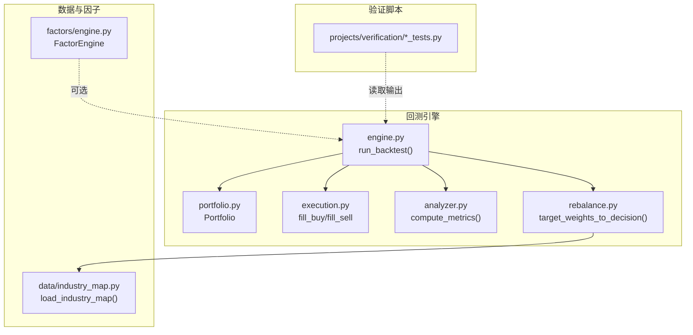
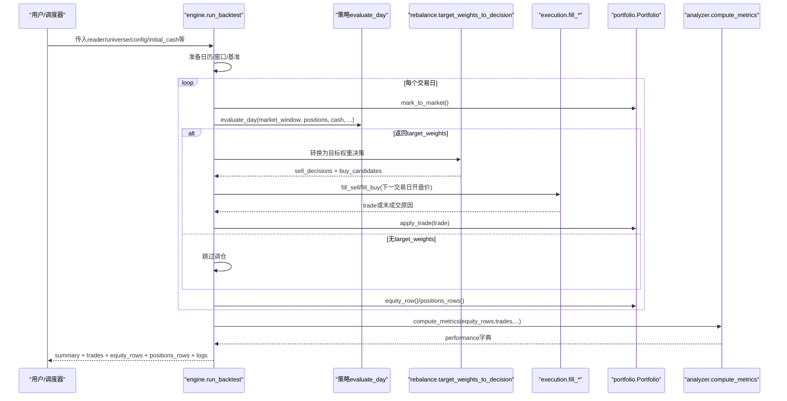
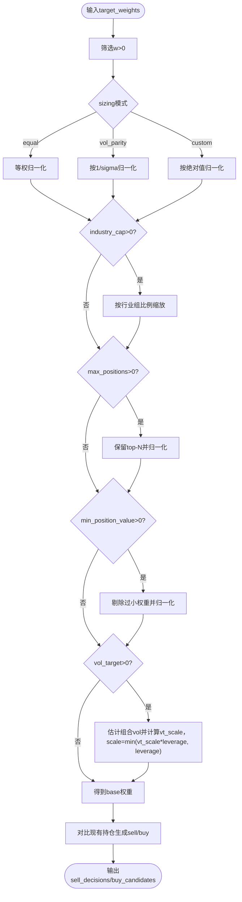
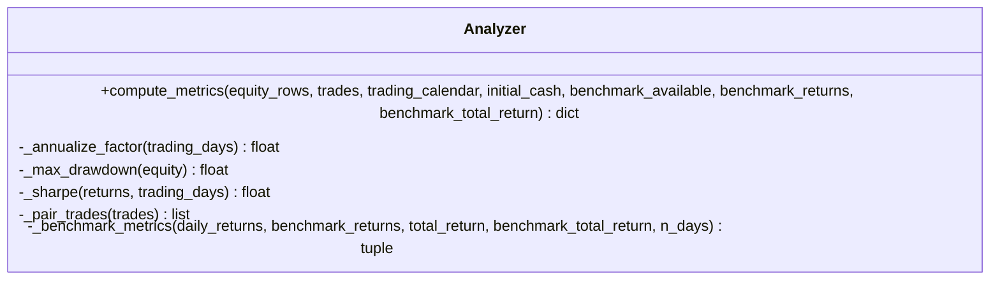
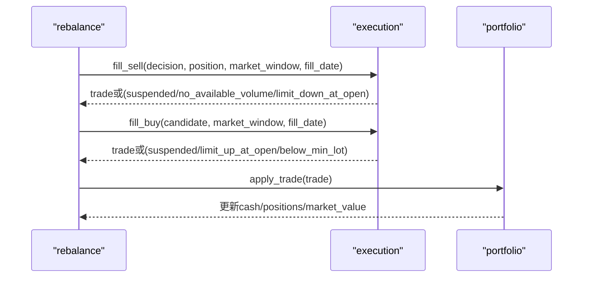
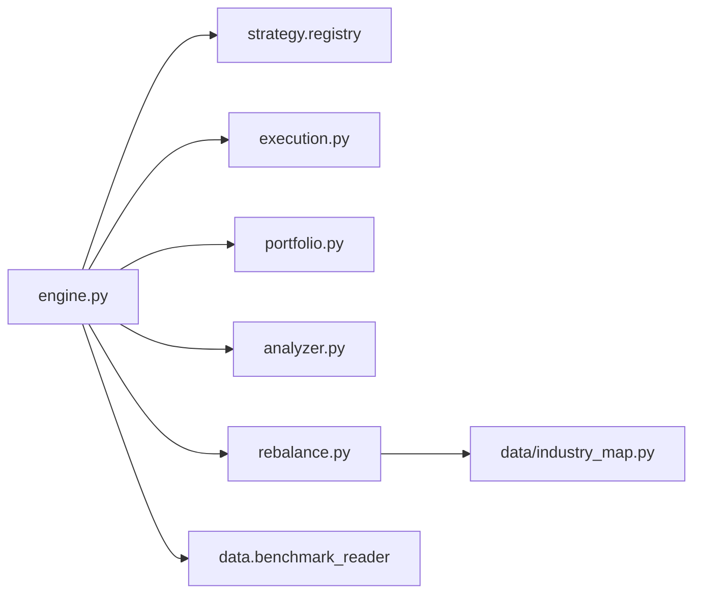

# 投资组合测试

<cite>
**本文引用的文件**   
- [engine.py](file://backtest/engine.py)
- [portfolio.py](file://backtest/portfolio.py)
- [analyzer.py](file://backtest/analyzer.py)
- [execution.py](file://backtest/execution.py)
- [rebalance.py](file://backtest/rebalance.py)
- [industry_map.py](file://data/industry_map.py)
- [engine_tests.py](file://projects/verification/engine_tests.py)
- [portfolio_tests.py](file://projects/verification/portfolio_tests.py)
- [robustness_tests.py](file://projects/verification/robustness_tests.py)
</cite>

## 目录
1. [引言](#引言)
2. [项目结构](#项目结构)
3. [核心组件](#核心组件)
4. [架构总览](#架构总览)
5. [详细组件分析](#详细组件分析)
6. [依赖关系分析](#依赖关系分析)
7. [性能与数值稳定性](#性能与数值稳定性)
8. [故障排查指南](#故障排查指南)
9. [结论](#结论)
10. [附录：测试示例与结果解读](#附录测试示例与结果解读)

## 引言
本文件面向 QuantLab 投资组合测试框架，系统化阐述资产配置验证、风险指标计算准确性验证、绩效归因分析、组合再平衡测试以及最佳实践。文档以代码级实现为依据，结合回测引擎、执行层、组合记账、指标计算与再平衡模块，给出可操作的验证方法与结果解读建议，帮助使用者在权重分配合理性、行业集中度、风格暴露度、相关性矩阵、波动率/VaR/最大回撤/夏普比率、收益来源分解、因子贡献度、择时与选股能力评估、调仓频率与交易成本、冲击成本与流动性约束等方面建立严谨的测试体系。

## 项目结构
QuantLab 的回测与组合测试相关代码主要分布在 backtest、data、factors 与 projects/verification 等目录中。核心流程由 engine 驱动，依次调用策略 evaluate_day、执行层 execution、组合记账 portfolio、指标计算 analyzer，并通过 rebalance 将目标权重转换为买卖决策；数据侧通过 industry_map 提供行业映射用于行业集中度约束。

图表来源
- [engine.py:237-619](file://backtest/engine.py#L237-L619)
- [portfolio.py:38-189](file://backtest/portfolio.py#L38-L189)
- [execution.py:95-204](file://backtest/execution.py#L95-L204)
- [analyzer.py:96-176](file://backtest/analyzer.py#L96-L176)
- [rebalance.py:101-281](file://backtest/rebalance.py#L101-L281)
- [industry_map.py:16-36](file://data/industry_map.py#L16-L36)
- [engine_tests.py:1-309](file://projects/verification/engine_tests.py#L1-L309)
- [portfolio_tests.py:1-232](file://projects/verification/portfolio_tests.py#L1-L232)
- [robustness_tests.py:1-267](file://projects/verification/robustness_tests.py#L1-L267)

章节来源
- [engine.py:237-619](file://backtest/engine.py#L237-L619)
- [portfolio.py:38-189](file://backtest/portfolio.py#L38-L189)
- [execution.py:95-204](file://backtest/execution.py#L95-L204)
- [analyzer.py:96-176](file://backtest/analyzer.py#L96-L176)
- [rebalance.py:101-281](file://backtest/rebalance.py#L101-L281)
- [industry_map.py:16-36](file://data/industry_map.py#L16-L36)

## 核心组件
- 回测引擎（engine）：负责日历切片、基准加载、策略调用、执行匹配、组合记账、指标汇总与诊断聚合。
- 组合记账（portfolio）：维护现金、持仓、T+1可用性与每日净值快照。
- 执行层（execution）：按 next_open 模型进行成交匹配，处理涨跌停、停牌、最小手数、滑点与费用。
- 指标计算（analyzer）：年化收益、最大回撤、夏普、Calmar、胜率、持有期、超额收益、信息比率、跟踪误差。
- 再平衡（rebalance）：将目标权重转换为买卖决策，支持等权、波动率平价、自定义权重，叠加行业上限、最大持仓数、最小仓位价值、波动率目标与杠杆上限。
- 行业映射（industry_map）：从 parquet 加载 code→行业映射，供行业集中度约束使用。
- 因子引擎（factors/engine）：注册与批量计算因子面板，并计算 IC/ICIR。

章节来源
- [engine.py:237-619](file://backtest/engine.py#L237-L619)
- [portfolio.py:38-189](file://backtest/portfolio.py#L38-L189)
- [execution.py:95-204](file://backtest/execution.py#L95-L204)
- [analyzer.py:96-176](file://backtest/analyzer.py#L96-L176)
- [rebalance.py:101-281](file://backtest/rebalance.py#L101-L281)
- [industry_map.py:16-36](file://data/industry_map.py#L16-L36)
- [engine.py:1-100](file://backtest/engine.py#L1-L100)

## 架构总览
回测主循环在 engine.run_backtest 中完成：构建市场窗口与交易日历 → 加载基准序列 → 初始化 Portfolio → 逐日调用策略 evaluate_day → 若返回 target_weights，则经 rebalance 转为 sell_decisions/buy_candidates → execution 匹配成交 → portfolio.apply_trade 更新头寸与权益 → 记录 equity_rows/trades/logs → 最后 compute_metrics 汇总指标。

图表来源
- [engine.py:237-619](file://backtest/engine.py#L237-L619)
- [rebalance.py:101-281](file://backtest/rebalance.py#L101-L281)
- [execution.py:95-204](file://backtest/execution.py#L95-L204)
- [portfolio.py:76-189](file://backtest/portfolio.py#L76-L189)
- [analyzer.py:96-176](file://backtest/analyzer.py#L96-L176)

## 详细组件分析

### 资产配置验证
- 权重分配合理性检查
  - 等权/波动率平价/自定义权重三种 sizing 模式，自动归一化，避免零权重与负权重。
  - 最小仓位价值过滤：剔除低于阈值导致交易不经济的小权重。
  - 最大持仓数限制：按权重降序保留前 N 只，再归一化。
  - 杠杆上限：scale 不超过 target_leverage，确保 gross exposure 合法。
- 行业集中度分析
  - 基于 industry_map 的行业分组，对每组权重按比例缩放至 cap，防止单行业过度集中。
- 风格暴露度验证
  - 当前框架未内置风格因子暴露度量；可通过外部因子面板与回归方法扩展（见“绩效归因”）。
- 相关性矩阵分析
  - 验证脚本 portfolio_tests 提供收益率相关系数矩阵计算与滚动夏普分析，可用于组合分散度检验。

图表来源
- [rebalance.py:101-281](file://backtest/rebalance.py#L101-L281)
- [industry_map.py:16-36](file://data/industry_map.py#L16-L36)

章节来源
- [rebalance.py:101-281](file://backtest/rebalance.py#L101-L281)
- [industry_map.py:16-36](file://data/industry_map.py#L16-L36)
- [portfolio_tests.py:63-82](file://projects/verification/portfolio_tests.py#L63-L82)

### 风险指标计算的准确性验证
- 波动率计算
  - 组合层面：equity_rows 的 daily_return 序列用于夏普与波动率估算（年化处理基于 252 交易日）。
  - 资产层面：rebalance._ann_vol 使用近 n 日收益率标准差乘以 sqrt(252)，用于 vol_parity 与 vol_target。
- VaR 值验证
  - 当前 analyzer 未直接实现 VaR；可在验证脚本中基于历史收益率分布（参数法/历史模拟法/蒙特卡洛）补充。
- 最大回撤计算
  - analyzer._max_drawdown 采用峰值追踪法，返回负值或 0。
- 夏普比率检验
  - analyzer._sharpe 使用样本标准差（n-1 分母），无风险利率为 0，年化乘 sqrt(252)。
- 基准对齐与信息比率
  - 当 benchmark_available 为真且序列长度一致时，计算 excess_return、information_ratio、tracking_error。

图表来源
- [analyzer.py:96-176](file://backtest/analyzer.py#L96-L176)

章节来源
- [analyzer.py:18-44](file://backtest/analyzer.py#L18-L44)
- [analyzer.py:78-94](file://backtest/analyzer.py#L78-L94)
- [analyzer.py:96-176](file://backtest/analyzer.py#L96-L176)
- [rebalance.py:31-48](file://backtest/rebalance.py#L31-L48)

### 绩效归因分析
- 收益来源分解
  - 基准对比：engine 在 equity_rows 后追加 benchmark_close/benchmark_return，analyzer 计算 excess_return、IR、TE。
  - 交易维度：win_rate、avg_holding_days、n_trades/n_buy/n_sell 反映交易行为对收益的贡献。
- 因子贡献度分析
  - factors/engine.FactorEngine 提供 IC/ICIR 统计，可用于因子有效性评估；组合层面可通过多因子回归（需扩展）分解 alpha/beta/风格暴露。
- 择时能力评估
  - 可通过 rolling Sharpe、区间收益拆分（牛熊市/子样本）评估择时稳定性（参考 robustness_tests）。
- 选股能力验证
  - 通过 IC/ICIR、胜率、持有期与超额收益综合判断选股质量；可结合行业/风格中性化后的残差收益进一步验证。

章节来源
- [engine.py:445-489](file://backtest/engine.py#L445-L489)
- [analyzer.py:96-176](file://backtest/analyzer.py#L96-L176)
- [engine.py:160-205](file://backtest/engine.py#L160-L205)
- [factors/engine.py:34-82](file://factors/engine.py#L34-L82)

### 组合再平衡测试
- 调仓频率影响
  - 通过不同 calendar 切片与 warmup 天数观察指标稳定性；engine 支持 _warmup_calendar_days 配置。
- 交易成本控制
  - execution 层统一处理 slippage/commission/tax，并在 trades.csv 中记录；验证脚本 engine_tests 包含交易成本校验用例。
- 冲击成本估算
  - 当前为 next_open 开盘价成交，未显式建模冲击成本；可在验证脚本中通过放大 slippage 或引入价格路径假设近似。
- 流动性约束处理
  - min_position_value 过滤小仓位；lot_floor 强制 100 股整数倍；涨停/跌停与停牌逻辑保证不可成交时返回 unfilled_reason。

图表来源
- [execution.py:95-204](file://backtest/execution.py#L95-L204)
- [portfolio.py:103-151](file://backtest/portfolio.py#L103-L151)
- [rebalance.py:202-260](file://backtest/rebalance.py#L202-L260)

章节来源
- [execution.py:27-93](file://backtest/execution.py#L27-L93)
- [execution.py:95-204](file://backtest/execution.py#L95-L204)
- [portfolio.py:103-151](file://backtest/portfolio.py#L103-L151)
- [rebalance.py:101-281](file://backtest/rebalance.py#L101-L281)

### 最佳实践
- 基准选择
  - 使用稳定的宽基指数（如沪深300/中证500），确保基准数据连续且覆盖回测区间；engine 已内置基准加载与缺失前向填充逻辑。
- 统计显著性检验
  - 对 IC/ICIR、Sharpe、Excess 等进行 t 检验或 Bootstrap 置信区间；验证脚本提供滚动夏普与区间拆分思路。
- 蒙特卡洛模拟
  - 基于历史收益率分布或因子协方差矩阵生成路径，评估 VaR/CVaR 与极端损失概率（需在验证脚本中扩展）。
- 稳健性测试
  - 子样本检验、牛熊市分拆、极端事件压力测试、交易成本压力测试、容量估算、未来函数与幸存者偏差排查（参考 robustness_tests）。

章节来源
- [engine.py:38-99](file://backtest/engine.py#L38-L99)
- [robustness_tests.py:35-218](file://projects/verification/robustness_tests.py#L35-L218)
- [portfolio_tests.py:148-181](file://projects/verification/portfolio_tests.py#L148-L181)

## 依赖关系分析
- engine 依赖 strategy.registry、execution、portfolio、analyzer、rebalance、data.benchmark_reader、backtest.hashing。
- rebalance 依赖 industry_map 用于行业集中度约束。
- analyzer 纯函数式计算，无外部依赖。
- execution 与 portfolio 严格遵循 T+1 与最小手数规则，保证交易一致性。

图表来源
- [engine.py:20-26](file://backtest/engine.py#L20-L26)
- [rebalance.py:101-125](file://backtest/rebalance.py#L101-L125)
- [industry_map.py:16-36](file://data/industry_map.py#L16-L36)

章节来源
- [engine.py:20-26](file://backtest/engine.py#L20-L26)
- [rebalance.py:101-125](file://backtest/rebalance.py#L101-L125)

## 性能与数值稳定性
- 时间复杂度
  - 市场窗口切片通过预计算 cut_index，每日 O(1) per code 视图，降低重复切片开销。
  - 指标计算为线性扫描 equity_series，O(N)。
- 数值稳定性
  - 波动率估计使用 std(n-1) 无偏估计；夏普在 std=0 时返回 0 避免除零。
  - 基准序列缺失前向填充，首段缺失容忍一定天数，否则禁用 IR/excess。
- 内存与 IO
  - 回测仅内存结果，IO 集中在 report.py（不在本文件范围）；trades/equity/positions 行式记录便于后续分析。

章节来源
- [engine.py:121-146](file://backtest/engine.py#L121-L146)
- [analyzer.py:34-44](file://backtest/analyzer.py#L34-L44)
- [engine.py:38-99](file://backtest/engine.py#L38-L99)

## 故障排查指南
- 常见未成交原因
  - suspended（停牌）、no_available_volume（T+1 不可卖）、limit_down_at_open（跌停开盘无法卖出）、limit_up_at_open（涨停开盘无法买入）、below_min_lot（不足一手）、invalid_price（无效价格）、no_target_cash（买入无目标金额）。
- 基准不可用
  - 基准数据库路径不存在、窗口内无数据、起点价格为 0 或存在断点，将禁用 IR/excess 并记录 note。
- 资金与持仓一致性
  - 应用 apply_trade 后总资产 = 现金 + 市值；持仓 available_volume 遵循 T+1 冻结与解冻逻辑。
- 日志与诊断
  - daily_logs 记录每笔成交与错误；diagnostics_aggregate 汇总警告、候选数量、未成交计数与策略特定指标。

章节来源
- [execution.py:95-204](file://backtest/execution.py#L95-L204)
- [engine.py:445-489](file://backtest/engine.py#L445-L489)
- [portfolio.py:103-151](file://backtest/portfolio.py#L103-L151)
- [engine.py:493-501](file://backtest/engine.py#L493-L501)

## 结论
QuantLab 的组合测试框架以清晰的模块化设计实现了从策略信号到交易执行、组合记账与指标计算的完整闭环。rebalance 层将策略抽象为“目标权重”，使风险约束（行业集中度、波动率目标、杠杆上限、最小仓位价值、最大持仓数）成为可配置的通用叠加层；execution 层严格遵循 A 股交易规则与 T+1 机制；analyzer 提供稳健的绩效与风险指标。配合 verification 脚本中的横向对比、相关性、滚动夏普与稳健性测试，可系统性地验证资产配置合理性、风险指标准确性与策略稳健性。建议在 VaR、风格暴露与因子归因方面按需扩展，以完善组合测试体系。

## 附录：测试示例与结果解读
- 已知结果验证（B-1）
  - 目的：验证等权全 A 组合年化收益处于合理区间。
  - 方法：选取 2023 年日线数据，计算等权组合年化收益并与经验范围对比。
  - 结果解读：若偏离过大，需检查数据口径与计算周期。
- 交易成本验证（B-2）
  - 目的：确认佣金、印花税与滑点的加总与手工计算一致。
  - 方法：设定固定成交额与费率，逐项核算并比对。
  - 结果解读：误差应小于容差（如 0.01 元），否则检查费率与取整逻辑。
- 涨跌停与停牌处理（B-3/B-4）
  - 目的：确保涨停日不买入、跌停日不卖出、停牌期间不可交易。
  - 方法：构造极端行情与停牌场景，检查是否返回对应未成交原因。
  - 结果解读：所有边界条件均应 PASS。
- 资金约束与先卖后买（B-5/B-7）
  - 目的：资金不足时自动缩减数量；调仓日先卖后买保障流动性。
  - 方法：模拟资金不足与调仓日买卖顺序，验证剩余资金与成交情况。
  - 结果解读：剩余资金非负，买入成功或明确失败原因。
- 持仓一致性（B-6）
  - 目的：现金 + 持仓市值 = 总资产。
  - 方法：单笔买入后检查权益构成。
  - 结果解读：等式成立即通过。
- 止损逻辑（B-8）
  - 目的：亏损达阈值次日卖出。
  - 方法：构造 D-1 收盘价触发止损，D 日开盘卖出，验证实际亏损。
  - 结果解读：触发条件与实际亏损方向一致。
- 组合优化与回测（E-2/E-4/E-5）
  - 目的：相关性矩阵、风险平价权重、组合回测与滚动夏普。
  - 方法：读取各策略净值，计算收益率、相关系数、风险平价权重与组合曲线，评估滚动夏普稳定性。
  - 结果解读：低相关性、稳定夏普与可控回撤表明组合分散有效。
- 稳健性测试（D-1~D-7）
  - 目的：子样本、牛熊市分拆、极端事件压力、交易成本压力、容量估算、未来函数与幸存者偏差排查。
  - 方法：分段回测与压力情景，统计收益与回撤，检查数据与逻辑漏洞。
  - 结果解读：跨区间表现稳定、压力损失可控、无未来函数与明显幸存者偏差。

章节来源
- [engine_tests.py:15-257](file://projects/verification/engine_tests.py#L15-L257)
- [portfolio_tests.py:63-181](file://projects/verification/portfolio_tests.py#L63-L181)
- [robustness_tests.py:35-218](file://projects/verification/robustness_tests.py#L35-L218)