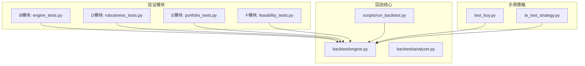
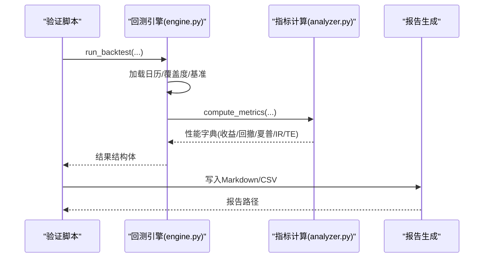
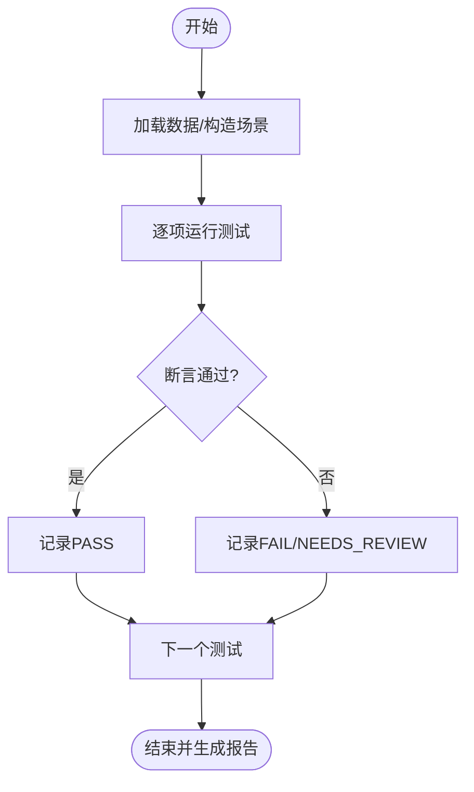
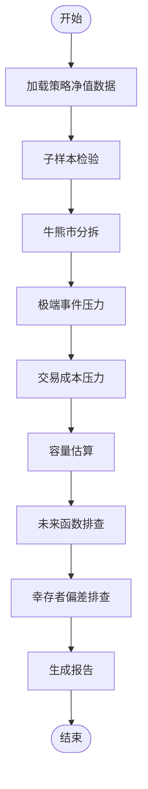
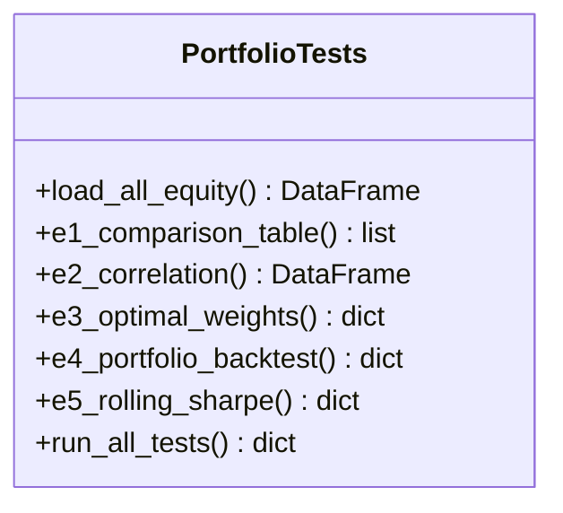
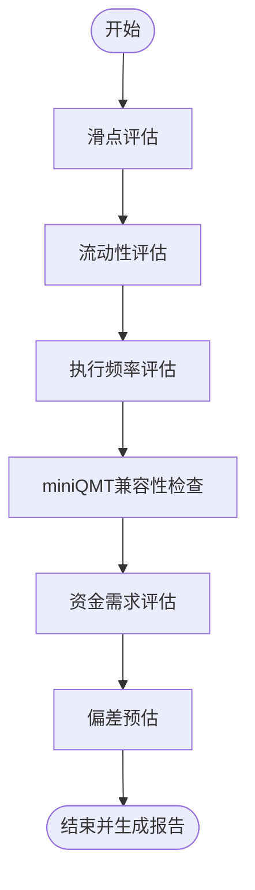
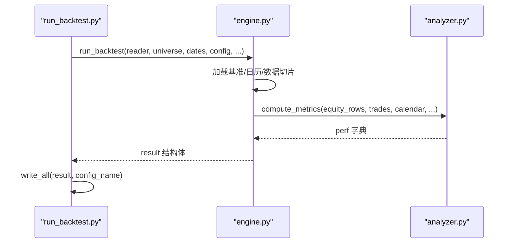
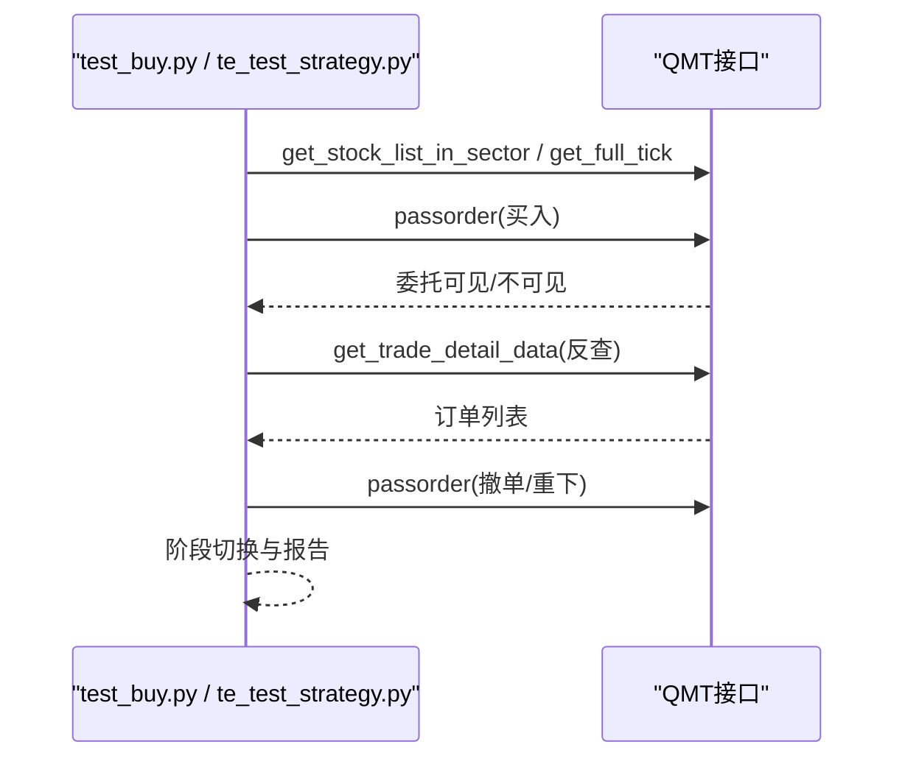
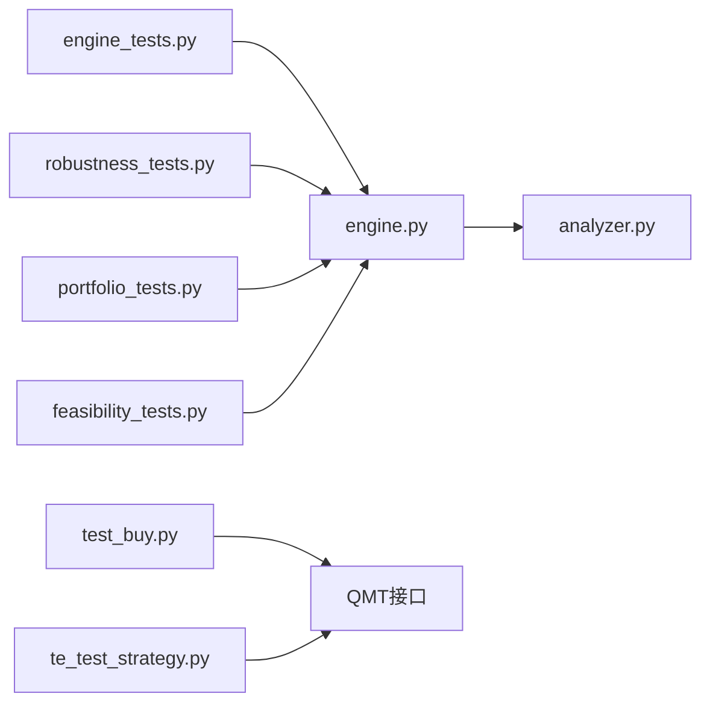

# 测试与验证框架

<cite>
**本文引用的文件**   
- [engine_tests.py](file://projects/verification/engine_tests.py)
- [robustness_tests.py](file://projects/verification/robustness_tests.py)
- [feasibility_tests.py](file://projects/verification/feasibility_tests.py)
- [portfolio_tests.py](file://projects/verification/portfolio_tests.py)
- [engine.py](file://backtest/engine.py)
- [analyzer.py](file://backtest/analyzer.py)
- [run_backtest.py](file://scripts/run_backtest.py)
- [test_buy.py](file://projects/Project_01_多因子IC小盘Alpha/research/mfic_strategy/test_buy.py)
- [te_test_strategy.py](file://projects/Project_10_价值小盘V2/te_test_strategy.py)
- [engine_test_report.md](file://projects/verification/results/engine_test_report.md)
- [robustness_report.md](file://projects/verification/results/robustness_report.md)
</cite>

## 目录
1. [引言](#引言)
2. [项目结构](#项目结构)
3. [核心组件](#核心组件)
4. [架构总览](#架构总览)
5. [详细组件分析](#详细组件分析)
6. [依赖关系分析](#依赖关系分析)
7. [性能考量](#性能考量)
8. [故障排查指南](#故障排查指南)
9. [结论](#结论)
10. [附录](#附录)

## 引言
本文件面向 QuantLab 的“测试与验证框架”，系统化阐述单元测试、回测验证、鲁棒性测试、可行性评估与投资组合测试的设计与实现。文档覆盖以下目标：
- 单元测试框架设计与自动化流程
- 回测验证机制，确保策略逻辑正确性与一致性
- 鲁棒性测试：参数敏感性、压力测试、极端市场环境
- 可行性测试：数据完整性、性能基准、兼容性
- 投资组合测试：资产配置、风险指标、绩效归因
- 最佳实践：测试数据准备、断言编写、覆盖率分析
- 示例与常见问题解决方案

## 项目结构
QuantLab 的测试与验证相关代码集中在 projects/verification 目录下，按模块划分：
- B 模块（engine_tests.py）：回测引擎基础能力验证
- D 模块（robustness_tests.py）：稳健性验证
- E 模块（portfolio_tests.py）：组合优化与评估
- F 模块（feasibility_tests.py）：实盘可行性评估

此外，脚本层提供统一回测入口（scripts/run_backtest.py），核心回测引擎在 backtest/engine.py，指标计算在 backtest/analyzer.py。项目内还包含若干最小化测试策略用于下单通路和交易执行链路验证。

图表来源
- [engine_tests.py:1-309](file://projects/verification/engine_tests.py#L1-L309)
- [robustness_tests.py:1-267](file://projects/verification/robustness_tests.py#L1-L267)
- [portfolio_tests.py:1-232](file://projects/verification/portfolio_tests.py#L1-L232)
- [feasibility_tests.py:1-178](file://projects/verification/feasibility_tests.py#L1-L178)
- [engine.py:237-522](file://backtest/engine.py#L237-L522)
- [analyzer.py:78-175](file://backtest/analyzer.py#L78-L175)
- [run_backtest.py:93-131](file://scripts/run_backtest.py#L93-L131)
- [test_buy.py:1-46](file://projects/Project_01_多因子IC小盘Alpha/research/mfic_strategy/test_buy.py#L1-L46)
- [te_test_strategy.py:1-289](file://projects/Project_10_价值小盘V2/te_test_strategy.py#L1-L289)

章节来源
- [engine_tests.py:1-309](file://projects/verification/engine_tests.py#L1-L309)
- [robustness_tests.py:1-267](file://projects/verification/robustness_tests.py#L1-L267)
- [portfolio_tests.py:1-232](file://projects/verification/portfolio_tests.py#L1-L232)
- [feasibility_tests.py:1-178](file://projects/verification/feasibility_tests.py#L1-L178)
- [engine.py:237-522](file://backtest/engine.py#L237-L522)
- [analyzer.py:78-175](file://backtest/analyzer.py#L78-L175)
- [run_backtest.py:93-131](file://scripts/run_backtest.py#L93-L131)
- [test_buy.py:1-46](file://projects/Project_01_多因子IC小盘Alpha/research/mfic_strategy/test_buy.py#L1-L46)
- [te_test_strategy.py:1-289](file://projects/Project_10_价值小盘V2/te_test_strategy.py#L1-L289)

## 核心组件
- 回测引擎验证（B模块）
  - 已知结果验证、交易成本校验、涨跌停与停牌处理、资金约束、持仓一致性、先卖后买、止损触发等8项测试，覆盖回测引擎关键路径与边界条件。
- 稳健性验证（D模块）
  - 子样本检验、牛熊市分拆、极端事件压力、交易成本压力、容量估算、未来函数排查、幸存者偏差排查等7项测试，全面评估策略在不同市场环境与假设下的稳定性。
- 组合优化（E模块）
  - 横向对比、相关性分析、风险平价权重、组合回测、滚动夏普分析，支撑多策略组合构建与动态评估。
- 实盘可行性（F模块）
  - 滑点真实性、流动性评估、执行频率、miniQMT兼容性、资金需求、回测vs实盘偏差预估，为上线决策提供依据。

章节来源
- [engine_tests.py:15-257](file://projects/verification/engine_tests.py#L15-L257)
- [robustness_tests.py:35-218](file://projects/verification/robustness_tests.py#L35-L218)
- [portfolio_tests.py:36-181](file://projects/verification/portfolio_tests.py#L36-L181)
- [feasibility_tests.py:15-131](file://projects/verification/feasibility_tests.py#L15-L131)

## 架构总览
测试与验证框架围绕“数据→回测→指标→报告”的主干展开，各模块通过统一的回测接口驱动，最终输出结构化报告与可审计结果。

图表来源
- [engine.py:237-522](file://backtest/engine.py#L237-L522)
- [analyzer.py:78-175](file://backtest/analyzer.py#L78-L175)
- [run_backtest.py:93-131](file://scripts/run_backtest.py#L93-L131)

章节来源
- [engine.py:237-522](file://backtest/engine.py#L237-L522)
- [analyzer.py:78-175](file://backtest/analyzer.py#L78-L175)
- [run_backtest.py:93-131](file://scripts/run_backtest.py#L93-L131)

## 详细组件分析

### 回测引擎验证（B模块）
- 设计要点
  - 以“已知结果”作为基线，逐项验证交易成本、涨跌停/停牌处理、资金约束、持仓一致性、调仓顺序与止损逻辑。
  - 每个测试返回结构化结果，便于汇总统计与报告生成。
- 关键流程
  - 读取历史数据或构造模拟场景
  - 执行规则判断与数值校验
  - 输出 PASS/FAIL/NEEDS_REVIEW 并记录说明
- 自动化与报告
  - 统一入口 run_all_tests() 聚合结果，生成 Markdown 报告至 results 目录

图表来源
- [engine_tests.py:15-257](file://projects/verification/engine_tests.py#L15-L257)
- [engine_tests.py:260-309](file://projects/verification/engine_tests.py#L260-L309)

章节来源
- [engine_tests.py:15-257](file://projects/verification/engine_tests.py#L15-L257)
- [engine_test_report.md:1-17](file://projects/verification/results/engine_test_report.md#L1-L17)

### 稳健性验证（D模块）
- 设计要点
  - 子样本检验：将长周期切分为多个区间，观察年化收益与最大回撤是否稳定。
  - 牛熊市分拆：区分不同市场状态，评估策略在不同环境下的表现。
  - 极端事件压力：针对特定时间段（如微盘股踩踏）进行损失评估。
  - 交易成本压力：提高佣金与滑点，评估对策略的影响。
  - 容量估算：基于成交额与持仓数估算策略容量。
  - 未来函数排查：检查财务数据、市值/估值、涨跌停判断、行业分类、指数成分股、ML标签泄露等潜在问题。
  - 幸存者偏差排查：检查退市标记与股票数量变化。
- 自动化与报告
  - 统一入口 run_all_tests() 聚合结果，生成 Markdown 报告

图表来源
- [robustness_tests.py:35-218](file://projects/verification/robustness_tests.py#L35-L218)
- [robustness_tests.py:221-267](file://projects/verification/robustness_tests.py#L221-L267)

章节来源
- [robustness_tests.py:35-218](file://projects/verification/robustness_tests.py#L35-L218)
- [robustness_report.md:1-75](file://projects/verification/results/robustness_report.md#L1-L75)

### 组合优化（E模块）
- 设计要点
  - 横向对比：汇总多策略的关键指标（年化、最大回撤、夏普、Calmar、换手、容量）。
  - 相关性分析：计算策略间日收益率的相关系数矩阵。
  - 风险平价权重：根据波动率倒数分配权重，降低单一策略风险贡献。
  - 组合回测：基于权重合成组合净值，计算整体指标。
  - 滚动夏普：评估策略在时间维度上的稳定性。
- 自动化与报告
  - 统一入口 run_all_tests() 聚合结果，生成 Markdown 报告

图表来源
- [portfolio_tests.py:15-181](file://projects/verification/portfolio_tests.py#L15-L181)
- [portfolio_tests.py:184-232](file://projects/verification/portfolio_tests.py#L184-L232)

章节来源
- [portfolio_tests.py:36-181](file://projects/verification/portfolio_tests.py#L36-L181)

### 实盘可行性（F模块）
- 设计要点
  - 滑点真实性：对比回测假设与实际预估，评估偏差倍数与影响程度。
  - 流动性评估：基于全A日均成交额中位数/均值，筛选可交易标的。
  - 执行频率：评估调仓频率与日均交易笔数，避免过度交易。
  - miniQMT兼容性：检查 passorder、ContextInfo、GBK编码、Python版本、持仓文件格式等。
  - 资金需求：根据持仓数与单股最低金额估算最低与建议资金。
  - 偏差预估：给出折扣系数与实盘预估年化，明确偏差来源。
- 自动化与报告
  - 统一入口 run_all_tests() 聚合结果，生成 Markdown 报告

图表来源
- [feasibility_tests.py:15-131](file://projects/verification/feasibility_tests.py#L15-L131)
- [feasibility_tests.py:134-178](file://projects/verification/feasibility_tests.py#L134-L178)

章节来源
- [feasibility_tests.py:15-131](file://projects/verification/feasibility_tests.py#L15-L131)

### 回测引擎与指标计算
- 回测主循环
  - 解析策略与交易模型，加载基准序列，构建交易日历与数据切片，逐日执行策略信号、成交、组合更新与指标计算。
- 指标计算
  - 计算总收益、年化收益、最大回撤、夏普比率、胜率、平均持有天数、超额收益、信息比率、跟踪误差等。
- 报告与诊断
  - 生成样本期警告、未成交订单计数、策略特定指标聚合等诊断信息。

图表来源
- [run_backtest.py:93-131](file://scripts/run_backtest.py#L93-L131)
- [engine.py:237-522](file://backtest/engine.py#L237-L522)
- [analyzer.py:78-175](file://backtest/analyzer.py#L78-L175)

章节来源
- [engine.py:237-522](file://backtest/engine.py#L237-L522)
- [analyzer.py:78-175](file://backtest/analyzer.py#L78-L175)
- [run_backtest.py:93-131](file://scripts/run_backtest.py#L93-L131)

### 最小化测试策略与下单通路验证
- test_buy.py
  - 最小策略，每根K线尝试买入一只股票，验证 get_stock_list_in_sector、get_full_tick、passorder 等下单通路。
- te_test_strategy.py
  - 验证 _te_ 函数的下单→反查→超时→撤单→重试链路，包含挂单巡检、状态检查、日志输出与阶段控制。

图表来源
- [test_buy.py:1-46](file://projects/Project_01_多因子IC小盘Alpha/research/mfic_strategy/test_buy.py#L1-L46)
- [te_test_strategy.py:1-289](file://projects/Project_10_价值小盘V2/te_test_strategy.py#L1-L289)

章节来源
- [test_buy.py:1-46](file://projects/Project_01_多因子IC小盘Alpha/research/mfic_strategy/test_buy.py#L1-L46)
- [te_test_strategy.py:1-289](file://projects/Project_10_价值小盘V2/te_test_strategy.py#L1-L289)

## 依赖关系分析
- 模块耦合
  - 验证模块（B/D/E/F）均依赖回测引擎与指标计算，形成“验证→回测→指标→报告”的单向依赖。
  - 示例策略依赖 QMT 接口，用于真实下单与反查链路验证。
- 外部依赖
  - pandas/numpy 用于数据处理与指标计算
  - duckdb 用于基准指数数据读取（由引擎内部使用）
  - QMT 接口用于实盘/模拟端下单与订单查询

图表来源
- [engine_tests.py:1-309](file://projects/verification/engine_tests.py#L1-L309)
- [robustness_tests.py:1-267](file://projects/verification/robustness_tests.py#L1-L267)
- [portfolio_tests.py:1-232](file://projects/verification/portfolio_tests.py#L1-L232)
- [feasibility_tests.py:1-178](file://projects/verification/feasibility_tests.py#L1-L178)
- [engine.py:237-522](file://backtest/engine.py#L237-L522)
- [analyzer.py:78-175](file://backtest/analyzer.py#L78-L175)
- [test_buy.py:1-46](file://projects/Project_01_多因子IC小盘Alpha/research/mfic_strategy/test_buy.py#L1-L46)
- [te_test_strategy.py:1-289](file://projects/Project_10_价值小盘V2/te_test_strategy.py#L1-L289)

章节来源
- [engine.py:237-522](file://backtest/engine.py#L237-L522)
- [analyzer.py:78-175](file://backtest/analyzer.py#L78-L175)

## 性能考量
- 数据切片优化
  - 引擎预计算 cut_index，使每日数据切片从 O(n) 降为 O(1)，提升回测效率。
- 指标计算复杂度
  - 收益、回撤、夏普等指标均为线性扫描，基准对比（IR/TE）需额外计算差值序列。
- 报告生成
  - 验证模块批量生成 Markdown 表格，避免频繁 I/O；建议在大数据集上合并写入。
- 内存占用
  - 全A数据与多策略净值加载需注意内存峰值，建议按需加载与分块处理。

[本节为通用指导，不直接分析具体文件]

## 故障排查指南
- 常见错误与定位
  - 基准数据缺失或路径错误：检查 benchmark_db_path 与文件存在性，确认日期范围对齐。
  - 交易日历为空：确认 start_date/end_date 有效且 reader.trading_calendar 返回非空。
  - 订单反查不可用：在 te_test_strategy.py 中检查 get_trade_detail_data 可用性，确认在 QMT 模拟端运行。
  - 涨跌停/停牌处理异常：核对 engine 中的限制逻辑与数据字段（涨停价、跌停价、停牌标记）。
  - 资金不足导致无法成交：检查资金约束与自动缩减逻辑，确认剩余资金与成本计算。
- 调试建议
  - 启用日志输出，记录关键中间变量（权益曲线、成交明细、未成交订单）。
  - 使用最小化测试策略逐步验证下单通路，再扩展至完整策略。
  - 对异常区间进行子样本检验与压力测试，定位不稳定因素。

章节来源
- [engine.py:237-522](file://backtest/engine.py#L237-L522)
- [te_test_strategy.py:1-289](file://projects/Project_10_价值小盘V2/te_test_strategy.py#L1-L289)
- [engine_tests.py:15-257](file://projects/verification/engine_tests.py#L15-L257)

## 结论
QuantLab 的测试与验证框架以模块化方式覆盖了回测引擎、稳健性、组合优化与实盘可行性等关键环节。通过标准化测试用例、自动化报告与清晰的依赖关系，能够有效保障策略逻辑的正确性与一致性，并为实盘部署提供充分依据。建议持续完善数据完整性检查、覆盖率分析与性能基准，进一步提升框架的可靠性与可维护性。

[本节为总结性内容，不直接分析具体文件]

## 附录
- 测试最佳实践
  - 测试数据准备：使用真实历史数据与构造极端场景相结合，确保覆盖正常与异常情况。
  - 断言编写：明确 PASS/FAIL/NEEDS_REVIEW 标准，记录详细说明以便追溯。
  - 覆盖率分析：统计关键路径与边界条件的覆盖情况，优先补齐高风险区域。
  - 报告归档：每次运行生成独立报告，便于版本对比与审计。
- 常见问题解决方案
  - 数据路径配置错误：统一配置文件管理路径，避免硬编码。
  - QMT 接口调用失败：确认运行环境与权限，必要时降级到模拟模式。
  - 指标计算异常：检查输入数据结构与缺失值处理，确保日期对齐与频率一致。

[本节为通用指导，不直接分析具体文件]