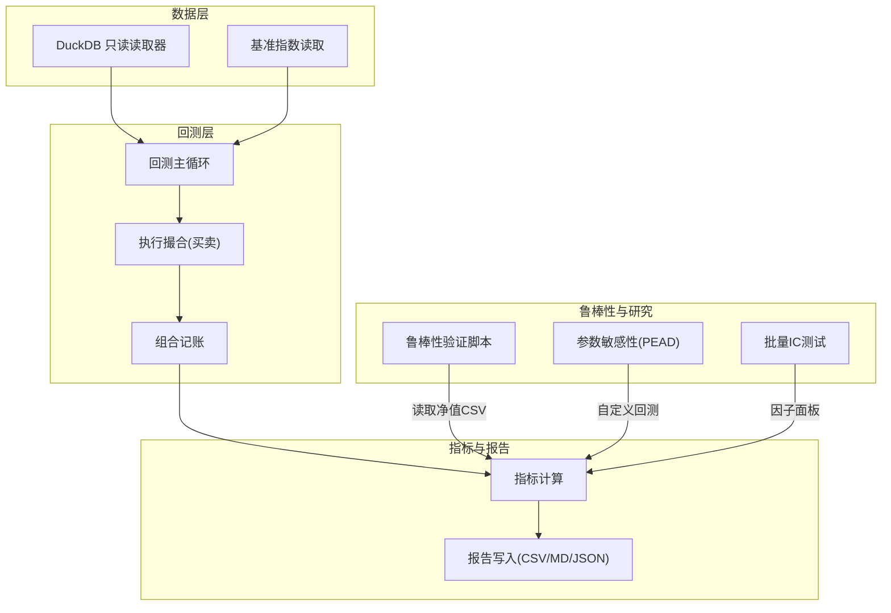
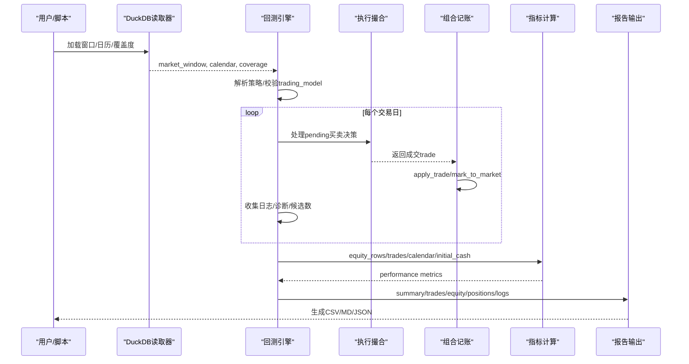
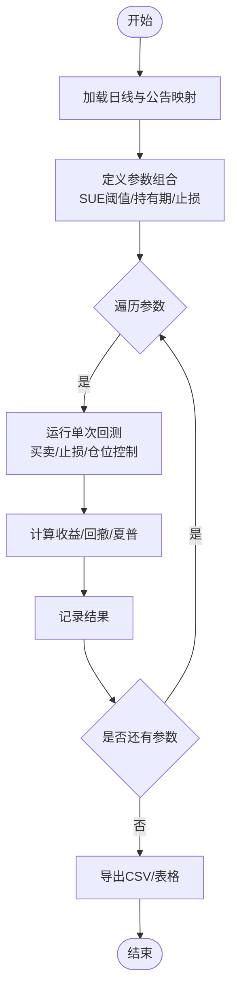
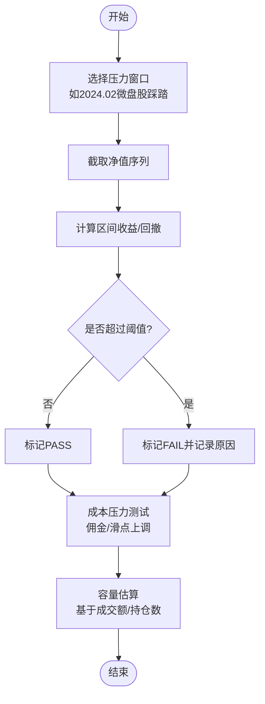
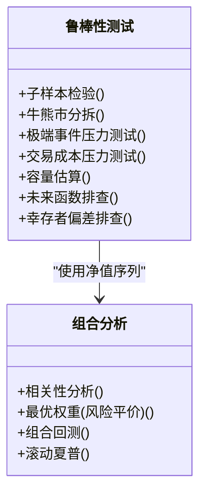
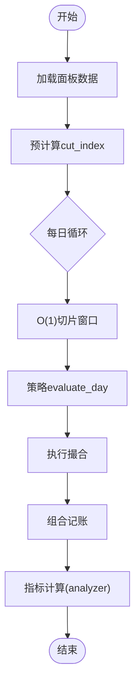
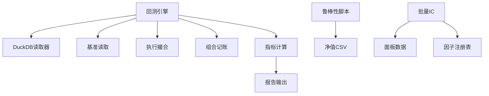

# 鲁棒性测试

<cite>
**本文引用的文件**   
- [projects/verification/robustness_tests.py](file://projects/verification/robustness_tests.py)
- [backtest/engine.py](file://backtest/engine.py)
- [backtest/analyzer.py](file://backtest/analyzer.py)
- [backtest/report.py](file://backtest/report.py)
- [backtest/portfolio.py](file://backtest/portfolio.py)
- [data/duckdb_reader.py](file://data/duckdb_reader.py)
- [factors/engine.py](file://factors/engine.py)
- [scripts/batch_ic_test.py](file://scripts/batch_ic_test.py)
- [projects/Project_03_PEAD盈余漂移/run_sensitivity.py](file://projects/Project_03_PEAD盈余漂移/run_sensitivity.py)
- [projects/Project_01_多因子IC小盘Alpha/reports/param_matrix_20260719.csv](file://projects/Project_01_多因子IC小盘Alpha/reports/param_matrix_20260719.csv)
</cite>

## 目录
1. [简介](#简介)
2. [项目结构](#项目结构)
3. [核心组件](#核心组件)
4. [架构总览](#架构总览)
5. [详细组件分析](#详细组件分析)
6. [依赖关系分析](#依赖关系分析)
7. [性能考量](#性能考量)
8. [故障排查指南](#故障排查指南)
9. [结论](#结论)
10. [附录](#附录)

## 简介
本文件面向 QuantLab 鲁棒性测试框架，系统化阐述参数敏感性分析、压力测试、组合稳定性测试与性能基准测试的实现方法与最佳实践。文档结合仓库中的回测引擎、指标计算、数据读取与报告输出等模块，给出可操作的测试设计、结果分析方法与问题定位技巧，并附带具体示例与排障指引，帮助读者在极端市场、流动性冲击与黑天鹅事件下评估策略稳健性。

## 项目结构
QuantLab 的鲁棒性验证围绕“回测引擎 + 指标计算 + 数据读取 + 报告输出”四大环节展开，同时提供专项脚本进行参数扫描与 IC 批量检验：
- 回测引擎：负责交易日历、数据窗口切片、执行撮合、组合记账与指标汇总
- 指标计算：年化收益、最大回撤、夏普、Calmar、胜率、信息比率、跟踪误差等
- 数据读取：DuckDB 只读 reader，统一列名与去重、WAL 检测、覆盖度统计
- 报告输出：固定 schema 的 trades/equity/positions CSV、日志、Markdown 报告与 summary.json
- 鲁棒性脚本：子样本、牛熊分拆、极端事件、成本压力、容量估算、未来函数与幸存者偏差检查
- 参数敏感性：PEAD 策略的多参数网格扫描与结果导出
- 因子 IC 批量：alpha101/gtja191 全量因子的 Spearman IC/ICIR 批量计算与筛选

**图表来源** 
- [backtest/engine.py:237-619](file://backtest/engine.py#L237-L619)
- [backtest/analyzer.py:96-176](file://backtest/analyzer.py#L96-L176)
- [data/duckdb_reader.py:35-215](file://data/duckdb_reader.py#L35-L215)
- [backtest/report.py:245-264](file://backtest/report.py#L245-L264)

**章节来源**
- [backtest/engine.py:237-619](file://backtest/engine.py#L237-L619)
- [backtest/analyzer.py:96-176](file://backtest/analyzer.py#L96-L176)
- [data/duckdb_reader.py:35-215](file://data/duckdb_reader.py#L35-L215)
- [backtest/report.py:245-264](file://backtest/report.py#L245-L264)

## 核心组件
- 回测主循环（engine）：构建交易日历、加载历史窗口、按日调用策略 evaluate_day、执行买卖、更新组合、聚合诊断与指标
- 指标计算（analyzer）：纯 numpy 实现年化、回撤、夏普、Calmar、配对胜率、持有天数、超额与信息比率
- 数据读取（duckdb_reader）：只读 DuckDB，支持两种 schema，统一列名、去重、WAL 检测、覆盖度统计
- 报告输出（report）：固定列序的 trades/equity/positions CSV、logs.txt、report.md、summary.json
- 鲁棒性验证（robustness_tests）：子样本、牛熊市分拆、极端事件、成本压力、容量估算、未来函数排查、幸存者偏差
- 参数敏感性（run_sensitivity）：PEAD 策略的多参数组合回测与结果导出
- 因子 IC 批量（batch_ic_test）：alpha101/gtja191 全量因子 Spearman IC/ICIR 批量计算与筛选

**章节来源**
- [backtest/engine.py:237-619](file://backtest/engine.py#L237-L619)
- [backtest/analyzer.py:96-176](file://backtest/analyzer.py#L96-L176)
- [data/duckdb_reader.py:35-215](file://data/duckdb_reader.py#L35-L215)
- [backtest/report.py:245-264](file://backtest/report.py#L245-L264)
- [projects/verification/robustness_tests.py:1-267](file://projects/verification/robustness_tests.py#L1-L267)
- [projects/Project_03_PEAD盈余漂移/run_sensitivity.py:1-186](file://projects/Project_03_PEAD盈余漂移/run_sensitivity.py#L1-L186)
- [scripts/batch_ic_test.py:1-266](file://scripts/batch_ic_test.py#L1-L266)

## 架构总览
下图展示一次完整回测与鲁棒性评估的数据流与控制流：

**图表来源** 
- [backtest/engine.py:237-619](file://backtest/engine.py#L237-L619)
- [backtest/analyzer.py:96-176](file://backtest/analyzer.py#L96-L176)
- [backtest/report.py:245-264](file://backtest/report.py#L245-L264)

## 详细组件分析

### 参数敏感性分析（含范围测试、边界值、异常值处理）
- 设计要点
  - 参数空间定义：阈值、持有期、止损等关键参数的合理范围与步长
  - 边界值测试：最小/最大参数、极端止损、极短持有期
  - 异常值处理：缺失价格、停牌、涨跌停、资金不足时的自动缩减
- 实现路径
  - PEAD 策略的参数扫描脚本遍历多组参数，逐日模拟买入/卖出、止损与持仓上限控制，输出年化、回撤、夏普等指标
  - 多因子策略的参数矩阵结果以 CSV 形式保存，便于横向对比与可视化
- 结果解读
  - 关注指标对参数变化的敏感度；识别稳定区间与脆弱边界
  - 通过失败案例（如过拟合或极端止损导致频繁止损）反推参数约束

**图表来源** 
- [projects/Project_03_PEAD盈余漂移/run_sensitivity.py:1-186](file://projects/Project_03_PEAD盈余漂移/run_sensitivity.py#L1-L186)
- [projects/Project_01_多因子IC小盘Alpha/reports/param_matrix_20260719.csv:24-100](file://projects/Project_01_多因子IC小盘Alpha/reports/param_matrix_20260719.csv#L24-L100)

**章节来源**
- [projects/Project_03_PEAD盈余漂移/run_sensitivity.py:1-186](file://projects/Project_03_PEAD盈余漂移/run_sensitivity.py#L1-L186)
- [projects/Project_01_多因子IC小盘Alpha/reports/param_matrix_20260719.csv:24-100](file://projects/Project_01_多因子IC小盘Alpha/reports/param_matrix_20260719.csv#L24-L100)

### 压力测试（极端市场、流动性危机、黑天鹅）
- 设计要点
  - 极端事件窗口：选取历史上显著下跌或流动性枯竭时段（如微盘股踩踏）
  - 成本压力：提高佣金与滑点，评估净收益衰减
  - 容量估算：基于成交额与持仓数量估算策略容量区间
- 实现路径
  - 鲁棒性脚本对特定日期区间截取净值曲线，计算区间收益与回撤，设定通过阈值
  - 成本压力与容量估算采用经验规则与简化假设快速评估
- 结果解读
  - 若区间损失超过阈值，需审视风控与调仓频率；成本压力敏感的策略应降低换手或优化执行

**图表来源** 
- [projects/verification/robustness_tests.py:113-172](file://projects/verification/robustness_tests.py#L113-L172)

**章节来源**
- [projects/verification/robustness_tests.py:113-172](file://projects/verification/robustness_tests.py#L113-L172)

### 组合稳定性测试（因子权重变化、Regime切换）
- 设计要点
  - 因子权重扰动：对多因子权重进行±比例扰动，观察收益与风险指标变化
  - Regime切换：按牛熊市分拆评估策略在不同市场环境下的表现差异
- 实现路径
  - 鲁棒性脚本按时间段截取净值，计算收益与回撤，设置通过阈值
  - 组合层面可进行相关性分析与风险平价权重计算，评估分散化效果
- 结果解读
  - 权重扰动后指标波动过大说明策略对权重敏感，需引入正则或动态权重机制
  - 牛熊分拆中熊市显著劣于牛市，需增强下行保护或降低暴露

**图表来源** 
- [projects/verification/robustness_tests.py:35-111](file://projects/verification/robustness_tests.py#L35-L111)
- [projects/verification/portfolio_tests.py:63-181](file://projects/verification/portfolio_tests.py#L63-L181)

**章节来源**
- [projects/verification/robustness_tests.py:35-111](file://projects/verification/robustness_tests.py#L35-L111)
- [projects/verification/portfolio_tests.py:63-181](file://projects/verification/portfolio_tests.py#L63-L181)

### 性能基准测试（大数据量、内存优化、计算效率）
- 设计要点
  - 数据规模：全A股票多年日线，要求高效读取与切片
  - 内存优化：避免重复拷贝，使用预计算索引与视图
  - 计算效率：指标计算纯 numpy，减少 Python 循环开销
- 实现路径
  - 回测引擎预计算 cut_index，每日 O(1) 切片；benchmark 前向填充补齐缺失
  - analyzer 使用数学公式直接计算，避免第三方库依赖
  - batch_ic_test 对全量因子进行批处理，输出 IC/ICIR 排名
- 结果解读
  - 关注运行时、内存峰值与 I/O 瓶颈；必要时引入并行或增量计算

**图表来源** 
- [backtest/engine.py:121-147](file://backtest/engine.py#L121-L147)
- [backtest/analyzer.py:96-176](file://backtest/analyzer.py#L96-L176)
- [scripts/batch_ic_test.py:95-186](file://scripts/batch_ic_test.py#L95-L186)

**章节来源**
- [backtest/engine.py:121-147](file://backtest/engine.py#L121-L147)
- [backtest/analyzer.py:96-176](file://backtest/analyzer.py#L96-L176)
- [scripts/batch_ic_test.py:95-186](file://scripts/batch_ic_test.py#L95-L186)

## 依赖关系分析
- 回测引擎依赖数据读取器与基准读取器，内部调用执行与组合模块，最终由指标计算与报告输出完成闭环
- 鲁棒性脚本依赖各策略的净值 CSV 文件，进行分段与阈值判断
- 因子 IC 批量脚本依赖因子注册表与面板数据，输出筛选结果

**图表来源** 
- [backtest/engine.py:237-619](file://backtest/engine.py#L237-L619)
- [data/duckdb_reader.py:35-215](file://data/duckdb_reader.py#L35-L215)
- [backtest/analyzer.py:96-176](file://backtest/analyzer.py#L96-L176)
- [backtest/report.py:245-264](file://backtest/report.py#L245-L264)
- [projects/verification/robustness_tests.py:1-267](file://projects/verification/robustness_tests.py#L1-L267)
- [scripts/batch_ic_test.py:1-266](file://scripts/batch_ic_test.py#L1-L266)

**章节来源**
- [backtest/engine.py:237-619](file://backtest/engine.py#L237-L619)
- [data/duckdb_reader.py:35-215](file://data/duckdb_reader.py#L35-L215)
- [backtest/analyzer.py:96-176](file://backtest/analyzer.py#L96-L176)
- [backtest/report.py:245-264](file://backtest/report.py#L245-L264)
- [projects/verification/robustness_tests.py:1-267](file://projects/verification/robustness_tests.py#L1-L267)
- [scripts/batch_ic_test.py:1-266](file://scripts/batch_ic_test.py#L1-L266)

## 性能考量
- 数据读取：DuckDB 只读模式，避免 WAL 干扰；coverage 缓存减少重复查询
- 内存管理：预计算 cut_index，每日 O(1) 切片，避免全量复制
- 指标计算：纯 numpy 实现，避免额外依赖；短样本安全处理
- 报告输出：固定列序与 UTF-8 编码，确保跨平台一致性
- 批量 IC：按月采样计算 IC，减少计算量；错误与跳过项记录便于调试

[本节为通用指导，不直接分析具体文件]

## 故障排查指南
- 数据源问题
  - DuckDB 文件不存在或 WAL 检测：检查路径与同步状态，确认 data_source 配置
  - 覆盖度不足：requested range 超出 min/max date，调整窗口或更新数据
- 基准不可用
  - benchmark_db_path 未配置或缺失；benchmark 起点价格为 0 或存在断点将禁用 IR/excess
- 回测逻辑
  - 涨跌停/停牌处理：确保信号过滤与执行逻辑正确
  - 资金约束：资金不足时自动缩减数量，避免负现金
  - T+1 规则：新买入当日不可卖，次日解冻 available_volume
- 指标与报告
  - 短样本警告：交易日少于 252 天或基准不可用，仅用于 MVP 验证
  - 日志与 WARN：查看 logs.txt 与 report.md 中的关键告警

**章节来源**
- [data/duckdb_reader.py:42-76](file://data/duckdb_reader.py#L42-L76)
- [backtest/engine.py:38-99](file://backtest/engine.py#L38-L99)
- [backtest/engine.py:479-522](file://backtest/engine.py#L479-L522)
- [backtest/report.py:78-121](file://backtest/report.py#L78-L121)

## 结论
QuantLab 的鲁棒性测试框架以回测引擎为核心，结合指标计算、数据读取与报告输出，形成完整的评估闭环。通过参数敏感性、压力测试、组合稳定性与性能基准测试，可在极端市场与流动性冲击下全面评估策略稳健性。建议在实际使用中：
- 建立系统化的参数扫描与阈值判定流程
- 针对历史极端事件进行压力测试与成本压力评估
- 定期复现与版本化管理，确保结果可追溯
- 关注数据质量与基准可用性，及时修复 WAL 与覆盖度问题

[本节为总结性内容，不直接分析具体文件]

## 附录
- 常用测试命令与路径
  - 鲁棒性验证：运行 robustness_tests.py，输出 robustness_report.md
  - 参数敏感性：运行 run_sensitivity.py，输出 pead_sensitivity.csv
  - 批量 IC：运行 batch_ic_test.py，输出 factor_ic_report.csv 与 top_factors.csv
- 结果文件位置
  - 回测产物：reports 目录下按 run_id 划分的子目录，包含 trades/equity/positions CSV、logs.txt、report.md、summary.json
  - 鲁棒性报告：projects/verification/results 目录下生成各类报告

[本节为补充信息，不直接分析具体文件]