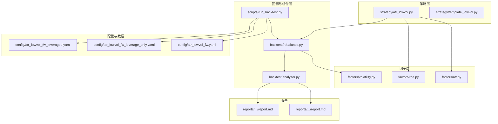
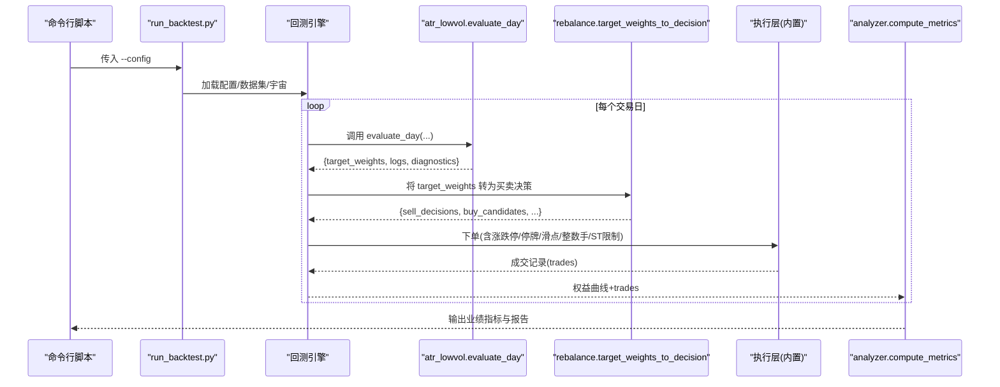
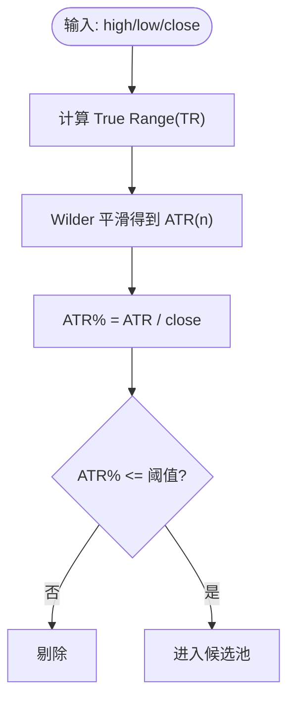
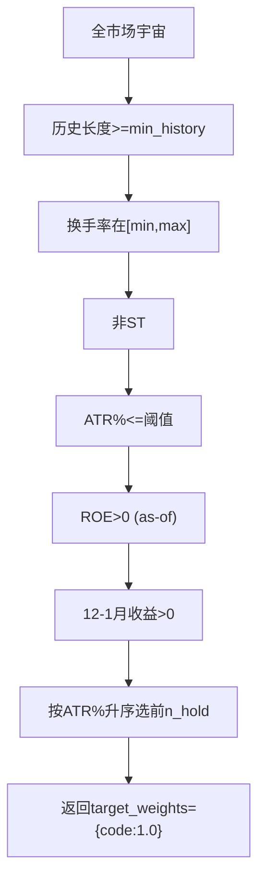
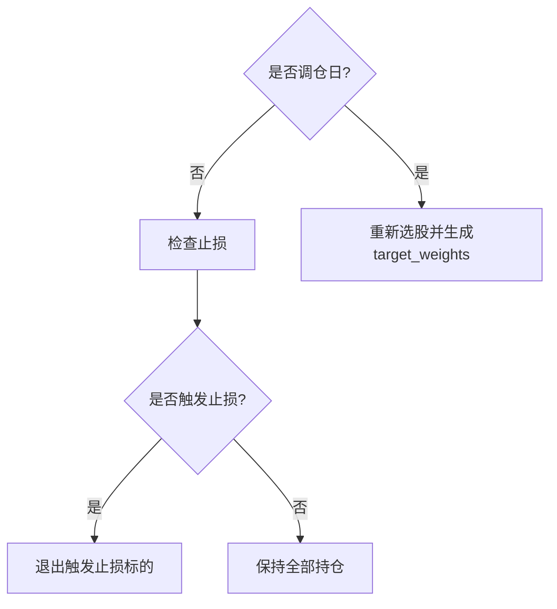
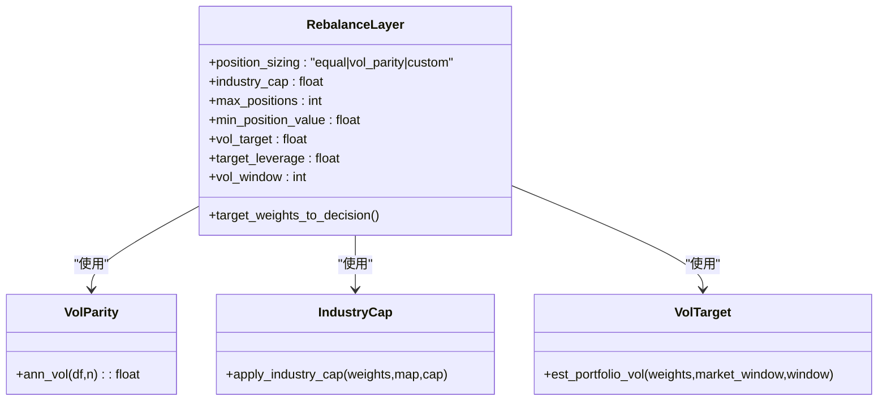
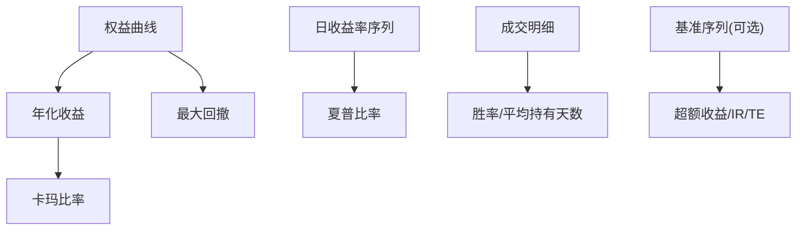
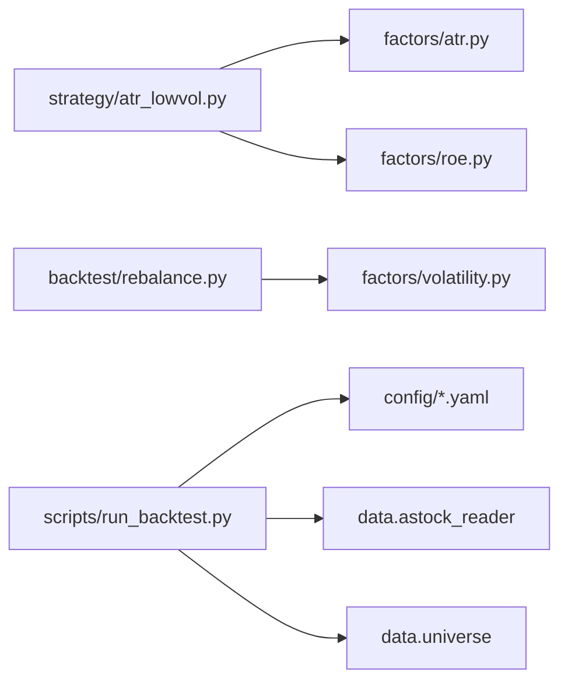
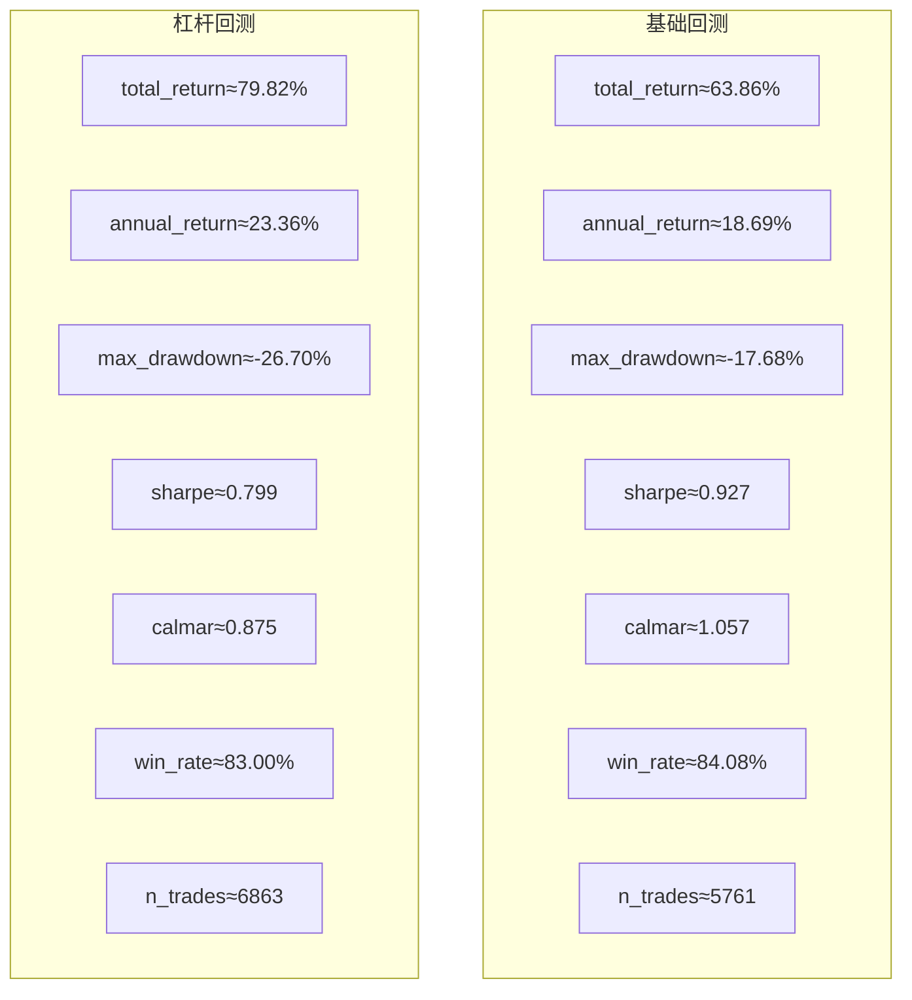

# 示例策略详解

<cite>
**本文引用的文件**
- [strategy/atr_lowvol.py](file://strategy/atr_lowvol.py)
- [factors/atr.py](file://factors/atr.py)
- [factors/roe.py](file://factors/roe.py)
- [config/atr_lowvol_fw.yaml](file://config/atr_lowvol_fw.yaml)
- [config/atr_lowvol_fw_leverage_only.yaml](file://config/atr_lowvol_fw_leverage_only.yaml)
- [config/atr_lowvol_fw_leveraged.yaml](file://config/atr_lowvol_fw_leveraged.yaml)
- [backtest/rebalance.py](file://backtest/rebalance.py)
- [backtest/analyzer.py](file://backtest/analyzer.py)
- [scripts/run_backtest.py](file://scripts/run_backtest.py)
- [reports/20260803_204830_513b7f_atr_lowvol_fw/report.md](file://reports/20260803_204830_513b7f_atr_lowvol_fw/report.md)
- [reports/20260803_205645_a7b4b3_atr_lowvol_fw_leverage_only/report.md](file://reports/20260803_205645_a7b4b3_atr_lowvol_fw_leverage_only/report.md)
</cite>

## 目录
1. [引言](#引言)
2. [项目结构](#项目结构)
3. [核心组件](#核心组件)
4. [架构总览](#架构总览)
5. [详细组件分析](#详细组件分析)
6. [依赖关系分析](#依赖关系分析)
7. [性能与回测结果](#性能与回测结果)
8. [故障排查指南](#故障排查指南)
9. [结论](#结论)
10. [附录：参数说明与调优建议](#附录参数说明与调优建议)

## 引言
本文件面向 QuantLab 的 ATR 低波动策略，系统阐述其实现原理、指标计算、信号生成、持仓管理与组合层风控叠加，并给出参数含义、回测结果解读与扩展方法。该策略以“目标权重”模式输出选股意愿，由框架通用组合层统一完成仓位分配、杠杆控制、行业上限、波动率目标等风险约束，确保任何策略均可即插即用且自带真实交易约束（涨跌停/停牌/滑点/整数手/ST限制）。

## 项目结构
ATR 低波动策略位于 strategy 层，因子计算在 factors 层，组合与执行在 backtest 层，运行入口在 scripts 层，配置在 config 层，回测报告在 reports 层。整体采用“策略只负责选股 + 返回目标权重，组合层负责一切订单簿记与风控”的解耦设计。

**图表来源**
- [strategy/atr_lowvol.py:1-165](file://strategy/atr_lowvol.py#L1-L165)
- [factors/atr.py:1-43](file://factors/atr.py#L1-L43)
- [factors/roe.py:1-43](file://factors/roe.py#L1-L43)
- [backtest/rebalance.py:1-281](file://backtest/rebalance.py#L1-L281)
- [backtest/analyzer.py:1-176](file://backtest/analyzer.py#L1-L176)
- [scripts/run_backtest.py:1-132](file://scripts/run_backtest.py#L1-L132)
- [config/atr_lowvol_fw.yaml:1-49](file://config/atr_lowvol_fw.yaml#L1-L49)
- [config/atr_lowvol_fw_leverage_only.yaml:1-48](file://config/atr_lowvol_fw_leverage_only.yaml#L1-L48)
- [config/atr_lowvol_fw_leveraged.yaml:1-47](file://config/atr_lowvol_fw_leveraged.yaml#L1-L47)

**章节来源**
- [strategy/atr_lowvol.py:1-165](file://strategy/atr_lowvol.py#L1-L165)
- [backtest/rebalance.py:1-281](file://backtest/rebalance.py#L1-L281)
- [scripts/run_backtest.py:1-132](file://scripts/run_backtest.py#L1-L132)

## 核心组件
- 策略评估函数 evaluate_day：按调仓频率筛选候选池，依次应用换手率、非 ST、ATR% 阈值、质量门控（ROE>0）、动量门控（12-1月收益>0），最终按 ATR% 升序选择前 n_hold 只，返回等权 target_weights。
- 因子模块 atr_pct：基于真实波幅（True Range）与 Wilder 平滑计算 ATR，再除以收盘价得到 ATR%，作为波动率代理。
- 质量门控 get_roe_asof：读取财务指标 parquet，按 as-of 规则取截至当日的最新 ROE，避免未来函数。
- 组合层 target_weights_to_decision：将策略的目标权重转换为买卖决策，支持等权/波动率倒数加权/自定义权重；叠加行业上限、最大持仓数、最小持仓金额、波动率目标与杠杆上限，并输出 sell/buy 决策供执行层处理。
- 回测分析 analyzer：基于权益曲线与成交明细计算年化收益、最大回撤、夏普、卡玛比率、胜率、平均持有天数、超额收益与信息比率等。

**章节来源**
- [strategy/atr_lowvol.py:78-165](file://strategy/atr_lowvol.py#L78-L165)
- [factors/atr.py:10-43](file://factors/atr.py#L10-L43)
- [factors/roe.py:15-43](file://factors/roe.py#L15-L43)
- [backtest/rebalance.py:101-281](file://backtest/rebalance.py#L101-L281)
- [backtest/analyzer.py:96-176](file://backtest/analyzer.py#L96-L176)

## 架构总览
下图展示从配置加载到策略评估、组合层转换、执行与回测分析的完整流程。

**图表来源**
- [scripts/run_backtest.py:42-132](file://scripts/run_backtest.py#L42-L132)
- [strategy/atr_lowvol.py:78-165](file://strategy/atr_lowvol.py#L78-L165)
- [backtest/rebalance.py:101-281](file://backtest/rebalance.py#L101-L281)
- [backtest/analyzer.py:96-176](file://backtest/analyzer.py#L96-L176)

## 详细组件分析

### ATR 指标计算与波动率筛选逻辑
- True Range 计算：取当日最高最低差、与前收盘绝对差的较大者，构成 TR 序列。
- ATR 计算：对 TR 序列使用指数移动平均（Wilder 平滑，alpha=1/n）得到 ATR。
- ATR%：ATR 除以收盘价，作为相对波动率指标，用于低波动筛选。
- 筛选逻辑：仅保留 ATR% 小于等于阈值的标的，配合换手率区间与非 ST 过滤，进一步通过质量与动量门控。

**图表来源**
- [factors/atr.py:10-43](file://factors/atr.py#L10-L43)

**章节来源**
- [factors/atr.py:10-43](file://factors/atr.py#L10-L43)

### 选股规则与信号生成
- 历史长度校验：要求标的具备足够历史（默认至少 252 日）。
- 换手率过滤：限定在 [turnover_min, turnover_max] 区间。
- 非 ST 过滤：排除 ST 股票。
- ATR% 阈值：仅保留低波动标的。
- 质量门控：ROE>0（as-of 读取，避免未来函数）。
- 动量门控：12-1 月收益率>0（跳过最近 1 月），剔除近期输家。
- 排序与入选：按 ATR% 升序选取前 n_hold 只，返回等权 target_weights。

**图表来源**
- [strategy/atr_lowvol.py:95-165](file://strategy/atr_lowvol.py#L95-L165)
- [factors/roe.py:15-43](file://factors/roe.py#L15-L43)

**章节来源**
- [strategy/atr_lowvol.py:95-165](file://strategy/atr_lowvol.py#L95-L165)
- [factors/roe.py:15-43](file://factors/roe.py#L15-L43)

### 持仓管理与止损逻辑
- 非调仓日：默认保持现有持仓；若启用止损，则逐只检查成本价与最新价的盈亏比，触发止损的标的退出，其余继续持有。
- 调仓日：重新计算目标权重，组合层生成买卖决策。

**图表来源**
- [strategy/atr_lowvol.py:37-76](file://strategy/atr_lowvol.py#L37-L76)

**章节来源**
- [strategy/atr_lowvol.py:37-76](file://strategy/atr_lowvol.py#L37-L76)

### 组合层与风险控制叠加
- 权重模型：等权、波动率倒数加权（vol_parity）、自定义权重（custom）。
- 行业上限：单行业权重总和不超过 industry_cap，按比例缩放。
- 最大持仓数：超过 max_positions 时按权重降序裁剪。
- 最小持仓金额：低于 min_position_value 的权重被剔除后重归一化。
- 波动率目标：根据估计组合波动率 vt_scale 调整毛敞口，并与 target_leverage 共同作用，确保不突破硬上限。
- 杠杆：target_leverage>1 启用两融，自动计提利息。

**图表来源**
- [backtest/rebalance.py:31-99](file://backtest/rebalance.py#L31-L99)
- [backtest/rebalance.py:101-200](file://backtest/rebalance.py#L101-L200)
- [backtest/rebalance.py:200-281](file://backtest/rebalance.py#L200-L281)
- [factors/volatility.py:1-27](file://factors/volatility.py#L1-L27)

**章节来源**
- [backtest/rebalance.py:101-281](file://backtest/rebalance.py#L101-L281)
- [factors/volatility.py:1-27](file://factors/volatility.py#L1-L27)

### 回测分析与指标计算
- 年化收益：基于总收益与交易天数进行年化。
- 最大回撤：权益曲线的峰值回落幅度。
- 夏普比率：日收益率均值/标准差乘以根号252。
- 卡玛比率：年化收益/最大回撤绝对值。
- 胜率与平均持有天数：配对买入卖出交易统计。
- 基准对比：超额收益、信息比率、跟踪误差（若可用）。

**图表来源**
- [backtest/analyzer.py:11-94](file://backtest/analyzer.py#L11-L94)
- [backtest/analyzer.py:96-176](file://backtest/analyzer.py#L96-L176)

**章节来源**
- [backtest/analyzer.py:96-176](file://backtest/analyzer.py#L96-L176)

## 依赖关系分析
- 策略依赖因子：atr_pct 提供波动率代理，get_roe_asof 提供质量门控。
- 组合层依赖波动率工具：ann_vol 用于 vol_parity 与 vol_target 估计。
- 运行入口依赖配置与数据源：run_backtest 解析 YAML，加载 astock parquet 与 universe CSV，按需加载行业映射。

**图表来源**
- [strategy/atr_lowvol.py:29-33](file://strategy/atr_lowvol.py#L29-L33)
- [backtest/rebalance.py:31-48](file://backtest/rebalance.py#L31-L48)
- [scripts/run_backtest.py:26-31](file://scripts/run_backtest.py#L26-L31)

**章节来源**
- [strategy/atr_lowvol.py:29-33](file://strategy/atr_lowvol.py#L29-L33)
- [backtest/rebalance.py:31-48](file://backtest/rebalance.py#L31-L48)
- [scripts/run_backtest.py:26-31](file://scripts/run_backtest.py#L26-L31)

## 性能与回测结果
- 基础配置（等权、无杠杆）：总收益约 63.86%，年化约 18.69%，最大回撤约 -17.68%，夏普约 0.927，卡玛约 1.057，胜率约 84.08%，交易次数 5761。
- 纯杠杆配置（1.5x 两融、等权、关闭 vol_target）：总收益约 79.82%，年化约 23.36%，最大回撤约 -26.70%，夏普约 0.799，卡玛约 0.875，胜率约 83.00%，交易次数 6863。
- 关键日志显示部分订单因低于最小手数未成交（below_min_lot），体现整数手约束的影响。

**图表来源**
- [reports/20260803_204830_513b7f_atr_lowvol_fw/report.md:15-26](file://reports/20260803_204830_513b7f_atr_lowvol_fw/report.md#L15-L26)
- [reports/20260803_205645_a7b4b3_atr_lowvol_fw_leverage_only/report.md:15-26](file://reports/20260803_205645_a7b4b3_atr_lowvol_fw_leverage_only/report.md#L15-L26)

**章节来源**
- [reports/20260803_204830_513b7f_atr_lowvol_fw/report.md:15-26](file://reports/20260803_204830_513b7f_atr_lowvol_fw/report.md#L15-L26)
- [reports/20260803_205645_a7b4b3_atr_lowvol_fw_leverage_only/report.md:15-26](file://reports/20260803_205645_a7b4b3_atr_lowvol_fw_leverage_only/report.md#L15-L26)

## 故障排查指南
- 无有效候选：当 valid 为空或 selected 为空时，策略会返回空决策并记录诊断信息（如 no_valid_universe、no_selection）。
- 止损触发：非调仓日若触发止损，将退出相关标的并在日志中记录。
- 订单未成交：常见原因为 below_min_lot（低于最小手数），需结合价格与资金规模调整 n_hold 或 min_position_value。
- 行业上限裁剪：当行业权重总和超过 industry_cap 时，组合层会按比例缩减并记录日志。
- 波动率目标与杠杆交互：vol_target 打开时会先估算所需毛敞口 vt_scale，再与 target_leverage 共同决定最终 scale，避免杠杆被静默压制。

**章节来源**
- [strategy/atr_lowvol.py:95-165](file://strategy/atr_lowvol.py#L95-L165)
- [backtest/rebalance.py:155-196](file://backtest/rebalance.py#L155-L196)
- [reports/20260803_204830_513b7f_atr_lowvol_fw/report.md:100-113](file://reports/20260803_204830_513b7f_atr_lowvol_fw/report.md#L100-L113)
- [reports/20260803_205645_a7b4b3_atr_lowvol_fw_leverage_only/report.md:105-118](file://reports/20260803_205645_a7b4b3_atr_lowvol_fw_leverage_only/report.md#L105-L118)

## 结论
ATR 低波动策略通过简洁而稳健的波动率代理与多重门控，实现了可解释、可扩展的低波动选股方案。借助框架的组合层，策略无需关心订单簿记与风控细节，即可获得一致的风险暴露与真实的交易约束。回测结果显示，在合理参数下可获得稳健的收益与可控的回撤；引入杠杆可提升收益但放大回撤，需结合 vol_target 与行业上限进行综合控制。

## 附录：参数说明与调优建议
- 调仓频率 rebalance_freq：weekly/monthly/quarterly，影响换仓频率与交易成本。
- 持仓数量 n_hold：控制分散度与单票资金占用，杠杆场景可适当降低以避免整数手瓶颈。
- ATR 周期 atr_win：常用 14，窗口越长越平滑但滞后更大。
- ATR% 阈值 atr_pct_max：越低越保守，通常 0.04–0.08 区间探索。
- 换手率区间 turnover_min/max：过滤流动性过低的标的，典型 1–8%。
- 质量门控 quality_gate：开启后要求 ROE>0，避免基本面恶化标的。
- 动量门控 momentum_gate：开启后要求 12-1 月收益>0，剔除近期输家。
- 止损 stop_loss：非调仓日生效，建议 -0.05 至 -0.10 区间测试。
- 仓位模型 position_sizing：equal（等权）、vol_parity（波动率倒数加权）、custom（自定义权重）。
- 杠杆 target_leverage：>1 启用两融，注意利息与保证金约束。
- 波动率目标 vol_target：>0 启用，控制组合事前波动率，与杠杆协同工作。
- 行业上限 industry_cap：限制单行业暴露，防范集中度风险。
- 最大持仓数 max_positions：裁剪过多头寸，简化组合。
- 最小持仓金额 min_position_value：过滤过小头寸，减少交易摩擦。
- 波动率估计窗口 vol_window：用于 vol_parity 与 vol_target 估计，常用 60。
- 融资利率 margin_interest_rate：两融利息，影响净收益。

调优建议：
- 先从等权与较低 atr_pct_max 开始，逐步放宽阈值观察收益与回撤变化。
- 在杠杆场景中降低 n_hold 并结合 vol_target 控制波动率，避免过度集中与高波动。
- 结合行业上限与最小持仓金额，优化实际可执行性与交易成本。
- 使用不同回测期与数据源验证稳健性，关注样本外表现。

**章节来源**
- [config/atr_lowvol_fw.yaml:29-49](file://config/atr_lowvol_fw.yaml#L29-L49)
- [config/atr_lowvol_fw_leverage_only.yaml:29-48](file://config/atr_lowvol_fw_leverage_only.yaml#L29-L48)
- [config/atr_lowvol_fw_leveraged.yaml:28-47](file://config/atr_lowvol_fw_leveraged.yaml#L28-L47)
- [backtest/rebalance.py:118-196](file://backtest/rebalance.py#L118-L196)