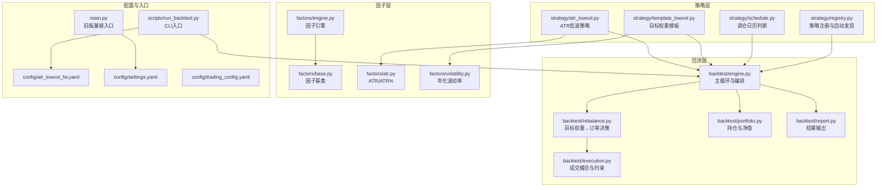
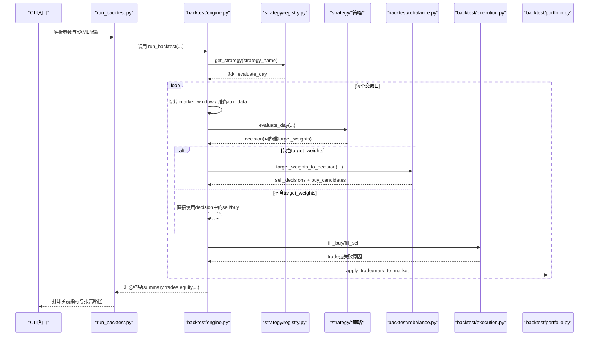
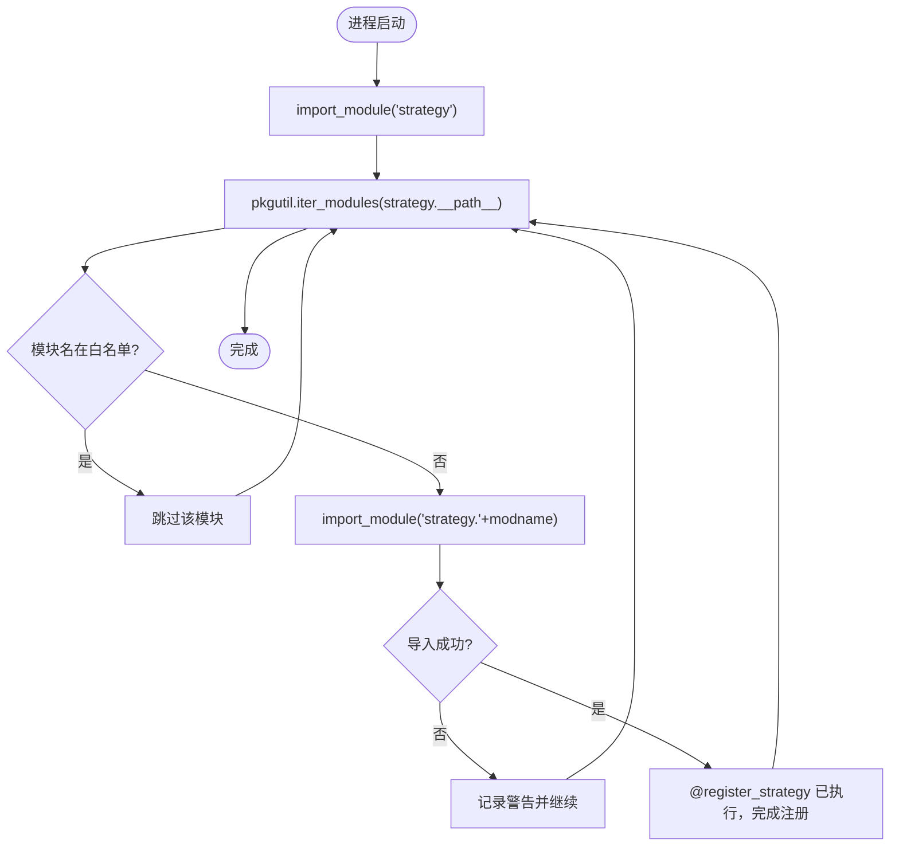
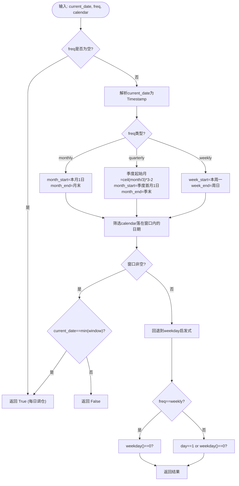
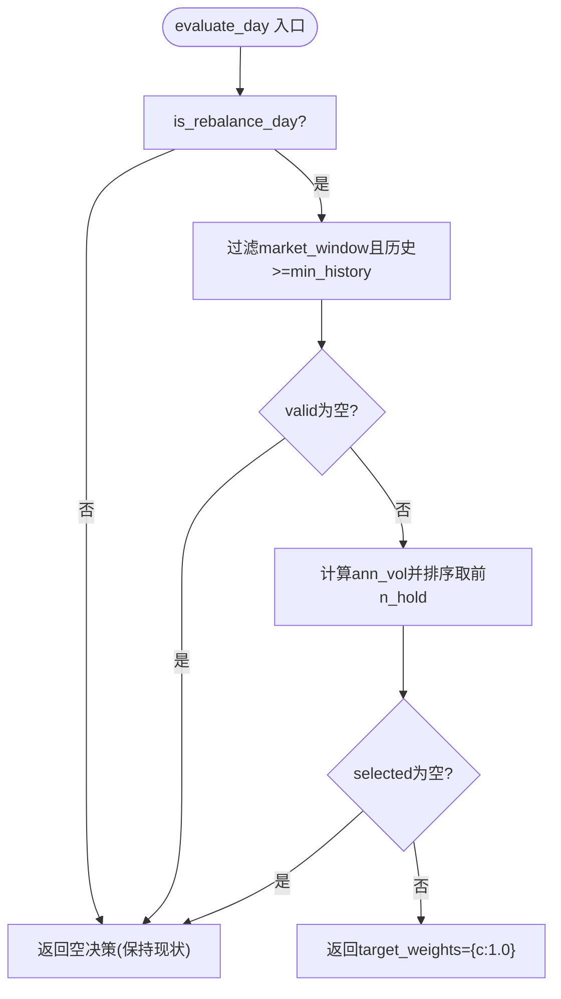
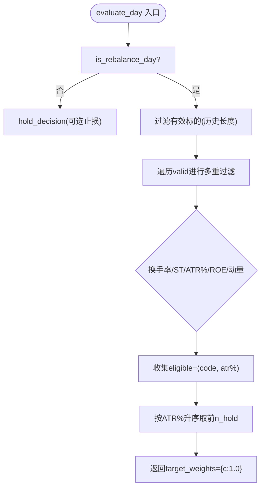
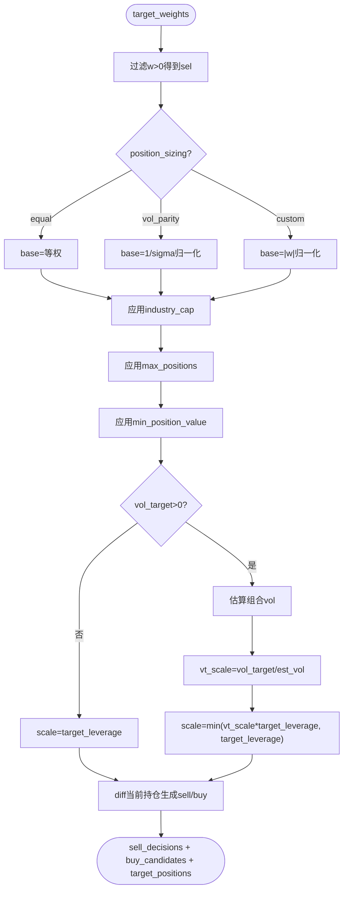
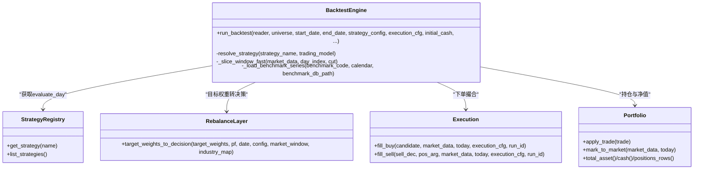
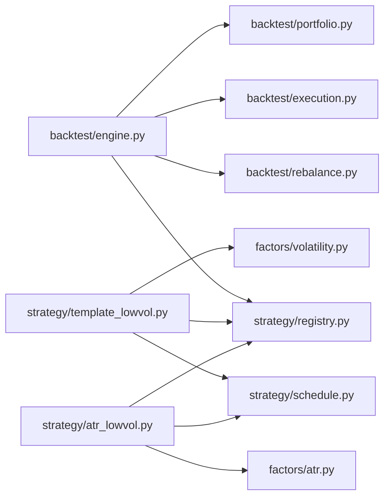

# 策略开发框架

<cite>
**本文引用的文件**   
- [strategy/registry.py](file://strategy/registry.py)
- [strategy/schedule.py](file://strategy/schedule.py)
- [strategy/template_lowvol.py](file://strategy/template_lowvol.py)
- [strategy/atr_lowvol.py](file://strategy/atr_lowvol.py)
- [backtest/engine.py](file://backtest/engine.py)
- [backtest/rebalance.py](file://backtest/rebalance.py)
- [factors/engine.py](file://factors/engine.py)
- [factors/base.py](file://factors/base.py)
- [factors/atr.py](file://factors/atr.py)
- [factors/volatility.py](file://factors/volatility.py)
- [scripts/run_backtest.py](file://scripts/run_backtest.py)
- [config/atr_lowvol_fw.yaml](file://config/atr_lowvol_fw.yaml)
- [config/settings.yaml](file://config/settings.yaml)
- [config/trading_config.yaml](file://config/trading_config.yaml)
- [main.py](file://main.py)
</cite>

## 目录
1. [简介](#简介)
2. [项目结构](#项目结构)
3. [核心组件](#核心组件)
4. [架构总览](#架构总览)
5. [详细组件分析](#详细组件分析)
6. [依赖关系分析](#依赖关系分析)
7. [性能考量](#性能考量)
8. [故障排查指南](#故障排查指南)
9. [结论](#结论)
10. [附录：策略开发流程与最佳实践](#附录策略开发流程与最佳实践)

## 简介
本文件为 QuantLab 策略开发框架的全面技术文档，聚焦以下目标：
- 策略注册机制与动态加载：@register_strategy 装饰器的工作原理、autodiscover 扫描与错误隔离。
- 调仓时间管理：统一的重仓日判定逻辑（周/月/季频）与回退策略。
- 策略模板使用：template_lowvol.py 的结构、扩展点与即插即用范式。
- 策略与因子系统集成：如何在策略中调用因子计算结果（ATR、波动率等）。
- 完整策略开发流程：从构思、实现、参数调优到回测验证的端到端说明。
- 实战示例：ATR 低波动策略的完整实现与配置。
- 调试与测试：日志记录、错误处理、性能监控与回归保障。

## 项目结构
QuantLab 采用扁平化包布局，核心模块按职责划分：
- strategy：策略注册、调度日历、策略模板与具体策略实现。
- backtest：回测引擎、执行层、组合层、报告与指标计算。
- factors：因子基类、因子引擎与常用因子实现。
- data：数据读取与行业映射等辅助工具。
- config：全局与策略运行配置。
- scripts：命令行入口与批处理脚本。

图表来源
- [strategy/registry.py:1-115](file://strategy/registry.py#L1-L115)
- [strategy/schedule.py:1-47](file://strategy/schedule.py#L1-L47)
- [strategy/template_lowvol.py:1-94](file://strategy/template_lowvol.py#L1-L94)
- [strategy/atr_lowvol.py:1-165](file://strategy/atr_lowvol.py#L1-L165)
- [backtest/engine.py:1-619](file://backtest/engine.py#L1-L619)
- [backtest/rebalance.py:1-281](file://backtest/rebalance.py#L1-L281)
- [factors/base.py:1-52](file://factors/base.py#L1-L52)
- [factors/engine.py:1-86](file://factors/engine.py#L1-L86)
- [factors/atr.py:1-43](file://factors/atr.py#L1-L43)
- [factors/volatility.py:1-27](file://factors/volatility.py#L1-L27)
- [scripts/run_backtest.py:1-132](file://scripts/run_backtest.py#L1-L132)
- [config/atr_lowvol_fw.yaml:1-49](file://config/atr_lowvol_fw.yaml#L1-L49)
- [config/settings.yaml:1-69](file://config/settings.yaml#L1-L69)
- [config/trading_config.yaml:1-59](file://config/trading_config.yaml#L1-L59)

章节来源
- [strategy/registry.py:1-115](file://strategy/registry.py#L1-L115)
- [backtest/engine.py:1-619](file://backtest/engine.py#L1-L619)
- [scripts/run_backtest.py:1-132](file://scripts/run_backtest.py#L1-L132)

## 核心组件
- 策略注册与动态加载
  - @register_strategy(name) 装饰器将 evaluate_day 函数注册到内存字典；重复注册会抛错。
  - autodiscover 扫描 strategy 包下所有模块并导入触发注册，跳过已知非目标模块，单模块异常不影响整体。
  - get_strategy/list_strategies 提供查询能力；strategy_spy 用于测试替换。
- 调仓时间管理
  - is_rebalance_day(current_date, freq, calendar) 支持 weekly/monthly/quarterly/None，优先基于交易日历窗口取“首交易日”，否则回退到工作日启发式。
- 目标权重组合层
  - target_weights_to_decision 将 {code: weight} 转换为 sell_decisions/buy_candidates/target_positions，内置等权/波动率平价/自定义 sizing、行业上限、最大持仓数、最小持仓金额、波动率目标与杠杆上限等风控叠加。
- 回测引擎
  - run_backtest 负责每日切片市场数据、构建 aux_data（含交易日历与基准序列）、调用策略 evaluate_day、转换目标权重为订单、执行撮合、更新组合、聚合诊断与指标。
- 因子系统
  - FactorBase/FactorEngine 提供因子注册、批量计算与 IC 统计；策略可直接调用轻量因子函数（如 atr_pct、ann_vol）。

章节来源
- [strategy/registry.py:24-44](file://strategy/registry.py#L24-L44)
- [strategy/registry.py:96-115](file://strategy/registry.py#L96-L115)
- [strategy/schedule.py:10-47](file://strategy/schedule.py#L10-L47)
- [backtest/rebalance.py:101-281](file://backtest/rebalance.py#L101-L281)
- [backtest/engine.py:237-619](file://backtest/engine.py#L237-L619)
- [factors/base.py:9-52](file://factors/base.py#L9-L52)
- [factors/engine.py:9-86](file://factors/engine.py#L9-L86)

## 架构总览
下图展示从 CLI 到策略评估、订单生成与执行的完整时序。

图表来源
- [scripts/run_backtest.py:42-132](file://scripts/run_backtest.py#L42-L132)
- [backtest/engine.py:237-619](file://backtest/engine.py#L237-L619)
- [strategy/registry.py:24-44](file://strategy/registry.py#L24-L44)
- [backtest/rebalance.py:101-281](file://backtest/rebalance.py#L101-L281)

## 详细组件分析

### 策略注册机制与动态加载
- 装饰器 @register_strategy(name)
  - 在模块顶层注册 evaluate_day，键名为 name。
  - 重复注册抛出 ValueError，避免覆盖。
- 自动发现 _autodiscover()
  - 通过 importlib 与 pkgutil 遍历 strategy 包子模块。
  - 跳过 registry/schedule/base/multi_factor 等内部模块。
  - 单个模块导入失败仅记录警告，不中断整体。
- 查询与测试辅助
  - get_strategy/list_strategies 提供运行时查询。
  - strategy_spy/register_test_spy 支持测试期临时替换策略实现。

图表来源
- [strategy/registry.py:96-115](file://strategy/registry.py#L96-L115)

章节来源
- [strategy/registry.py:24-44](file://strategy/registry.py#L24-L44)
- [strategy/registry.py:96-115](file://strategy/registry.py#L96-L115)

### 调仓时间管理系统
- is_rebalance_day(current_date, freq, calendar)
  - 若 freq 为空则每日调仓。
  - 优先基于传入的交易日历 calendar 计算当周/当月/当季窗口，返回窗口内第一个交易日。
  - 若无日历或计算异常，回退到工作日启发式（周一为周频首日，月初或周一为月/季频首日）。
- 典型用法
  - 模板与 ATR 策略均在 evaluate_day 开头调用该函数决定是否进入选股/再平衡流程。

图表来源
- [strategy/schedule.py:10-47](file://strategy/schedule.py#L10-L47)

章节来源
- [strategy/schedule.py:10-47](file://strategy/schedule.py#L10-L47)

### 策略模板 template_lowvol.py
- 设计目标
  - 任何策略只需输出 target_weights = {code: 1.0 for code in selected}，其余由框架组合层处理。
- 关键流程
  - 非调仓日：返回空决策（保持现状）。
  - 预筛：确保 market_window 历史长度满足 min_history。
  - 信号：对 valid 标的计算 ann_vol，选波动率最低的前 n_hold 只。
  - 输出：等权 target_weights，diagnostics 记录候选总数与通过数。
- 扩展点
  - 可替换信号源（例如改用 ATR%、多因子打分），但保持 target_weights 接口不变。
  - 可通过 strategy_config 调整 rebalance_freq/n_hold/vol_window 等参数。

图表来源
- [strategy/template_lowvol.py:34-94](file://strategy/template_lowvol.py#L34-L94)

章节来源
- [strategy/template_lowvol.py:1-94](file://strategy/template_lowvol.py#L1-L94)

### ATR 低波动策略 atr_lowvol.py
- 选股逻辑
  - 换手率区间过滤、非 ST、ATR% 阈值过滤、质量门控（ROE>0）、动量门控（12-1月收益>0）。
  - 按 ATR% 升序选择前 n_hold 只。
- 非调仓日行为
  - 默认持有；若启用 stop_loss，逐仓检查成本价与最新价，触发止损则退出对应标的。
- 输出
  - 返回 target_weights={c:1.0}，由组合层施加仓位模型与风控。

图表来源
- [strategy/atr_lowvol.py:37-165](file://strategy/atr_lowvol.py#L37-L165)

章节来源
- [strategy/atr_lowvol.py:1-165](file://strategy/atr_lowvol.py#L1-L165)

### 目标权重组合层 backtest/rebalance.py
- 功能要点
  - 将 target_weights 转为 sell_decisions/buy_candidates/target_positions。
  - 内置 sizing：equal/vol_parity/custom。
  - 风控叠加：industry_cap、max_positions、min_position_value、vol_target、target_leverage。
  - 保守估计组合波动率（对角近似），保证回测稳健性。
- 关键流程
  - 先按 sizing 得到 base weights，再依次应用 industry_cap、max_positions、min_position_value。
  - 根据 vol_target 估算所需毛敞口 vt_scale，并与 target_leverage 结合得到最终 scale。
  - 对比当前持仓生成买卖指令，未入选持仓全量卖出。

图表来源
- [backtest/rebalance.py:101-281](file://backtest/rebalance.py#L101-L281)

章节来源
- [backtest/rebalance.py:1-281](file://backtest/rebalance.py#L1-L281)

### 回测引擎 backtest/engine.py
- 主循环
  - 每日切片 market_window（O(1) per code 视图），准备 account_state 与 aux_data（含交易日历与基准序列）。
  - 调用 resolve_strategy 获取 evaluate_day 并校验 trading_model。
  - 若 decision 含 target_weights，则调用 target_weights_to_decision 转换为原生决策。
  - 执行 fill_buy/fill_sell，更新 Portfolio，记录 trades/equity/logs/diagnostics。
- 基准与指标
  - 加载基准序列并对齐日历，计算基准收益与总回报。
  - 聚合 daily warnings/candidates/strategy_specific，计算 performance 指标。
- 两融利息
  - 当 target_leverage>1 且现金为负时，按 margin_interest_rate 计提日息。

图表来源
- [backtest/engine.py:207-619](file://backtest/engine.py#L207-L619)
- [backtest/rebalance.py:101-281](file://backtest/rebalance.py#L101-L281)

章节来源
- [backtest/engine.py:1-619](file://backtest/engine.py#L1-L619)

### 因子系统与集成方式
- 因子基类与引擎
  - FactorBase 定义 compute 接口与预处理工具（winsorize/zscore/rank_normalize）。
  - FactorEngine 支持注册、批量计算与截面 IC 统计。
- 策略直接调用轻量因子函数
  - atr_pct(df, n)：ATR% 作为波动代理。
  - ann_vol(df, n)：近 n 日年化波动率。
- 集成建议
  - 简单策略：直接在 evaluate_day 中调用 factors.* 函数。
  - 复杂策略：通过 FactorEngine.compute_all 一次性计算多因子面板，再进行打分与排序。

章节来源
- [factors/base.py:9-52](file://factors/base.py#L9-L52)
- [factors/engine.py:9-86](file://factors/engine.py#L9-L86)
- [factors/atr.py:10-43](file://factors/atr.py#L10-L43)
- [factors/volatility.py:6-27](file://factors/volatility.py#L6-L27)

## 依赖关系分析
- 模块耦合
  - backtest/engine.py 强依赖 strategy.registry、backtest.rebalance、backtest.execution、backtest.portfolio。
  - strategy 模块之间解耦良好：registry 与 schedule 被多个策略复用。
  - factors 模块独立，策略可直接调用函数或通过 FactorEngine 批量计算。
- 外部依赖
  - 数据读取：astock parquet、benchmark duckdb。
  - 配置文件：settings.yaml、trading_config.yaml、各策略 yaml。
- 潜在循环依赖
  - 未发现循环导入；engine 仅在运行时按需 import strategy 模块。

图表来源
- [backtest/engine.py:207-235](file://backtest/engine.py#L207-L235)
- [strategy/template_lowvol.py:27-30](file://strategy/template_lowvol.py#L27-L30)
- [strategy/atr_lowvol.py:29-33](file://strategy/atr_lowvol.py#L29-L33)

章节来源
- [backtest/engine.py:207-235](file://backtest/engine.py#L207-L235)

## 性能考量
- 数据切片优化
  - _build_cut_index 与 _slice_window_fast 以 O(1) per code 的方式获取当日历史视图，避免每日重复切片。
- 基准对齐
  - 基准序列提前加载并按日历前向填充，减少每日 IO。
- 组合波动率估算
  - 使用对角近似（忽略相关性）保守估计，避免协方差矩阵计算开销。
- 日志与诊断
  - 每日 diagnostics 聚合 candidate_total/passed/unfilled_order_count 等，便于定位瓶颈。

[本节为通用指导，无需特定文件引用]

## 故障排查指南
- 常见错误与定位
  - 策略未注册：KeyError 提示 registered strategies 列表。检查 @register_strategy(name) 是否匹配 engine.resolve_strategy 使用的名称。
  - 交易模型不支持：ValueError 提示 ALLOWED_TRADING_MODELS。确认策略模块导出 ALLOWED_TRADING_MODELS 并包含 trading_model。
  - 基准不可用：日志 warning 提示 benchmark 缺失或断点。检查 benchmark_db_path 与代码段。
  - 无有效标的：diagnostics.warnings 包含 no_valid_universe/no_selection。检查历史长度、过滤条件与因子值有效性。
- 日志与调试
  - 查看 daily_logs 与 diagnostics_aggregate.unfilled_order_count 定位未成交原因。
  - 使用 strategy_spy 注入临时 evaluate_day 快速验证输入输出。
- 性能问题
  - 若回测过慢，检查 market_window 行数与因子计算复杂度；必要时减少 n_hold 或缩短 vol_window。

章节来源
- [strategy/registry.py:34-44](file://strategy/registry.py#L34-L44)
- [backtest/engine.py:207-235](file://backtest/engine.py#L207-L235)
- [backtest/engine.py:445-501](file://backtest/engine.py#L445-L501)

## 结论
QuantLab 的策略框架通过“目标权重 + 组合层”的设计，将策略的核心思想（选股/打分）与交易执行、风控、资金管理等通用逻辑解耦。开发者仅需关注 evaluate_day 的信号生成与 target_weights 输出，即可享受统一的回测体验与生产级约束。配合灵活的调仓日历、丰富的因子库与完善的诊断日志，能够快速迭代与验证策略想法。

[本节为总结，无需特定文件引用]

## 附录：策略开发流程与最佳实践
- 策略构思
  - 明确信号来源（技术指标/基本面/另类数据）、调仓频率与风险偏好。
- 代码实现
  - 新建 strategy/<your_strategy>.py，使用 @register_strategy("your_strategy") 装饰 evaluate_day。
  - 在 evaluate_day 中：
    - 使用 is_rebalance_day 控制调仓节奏。
    - 从 market_window 提取必要字段，调用 factors.* 计算信号。
    - 返回 target_weights={code: 1.0 for code in selected}。
- 参数调优
  - 在 config/*.yaml 的 strategy_params 中调整 n_hold、atr_win、turnover_min/max、quality_gate、momentum_gate、stop_loss、position_sizing、target_leverage、vol_target、industry_cap 等。
- 回测验证
  - 使用 scripts/run_backtest.py --config config/atr_lowvol_fw.yaml 运行。
  - 观察 reports/<run_id>/ 下的 equity_curve.csv、trades.csv、report.md、summary.json。
- 调试与测试
  - 利用 diagnostics 与 logs 定位问题；使用 strategy_spy 注入测试用例。
  - 逐步放宽/收紧过滤条件，观察 candidate_total/candidate_passed 变化。
- 部署与实盘
  - 参考 config/trading_config.yaml 配置账户、风控、订单与通知；确保 broker/qmt_builder 对接正确。

章节来源
- [config/atr_lowvol_fw.yaml:1-49](file://config/atr_lowvol_fw.yaml#L1-L49)
- [scripts/run_backtest.py:42-132](file://scripts/run_backtest.py#L42-L132)
- [config/trading_config.yaml:1-59](file://config/trading_config.yaml#L1-L59)