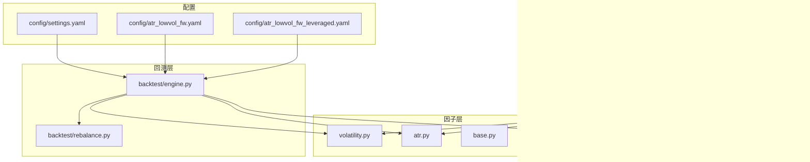
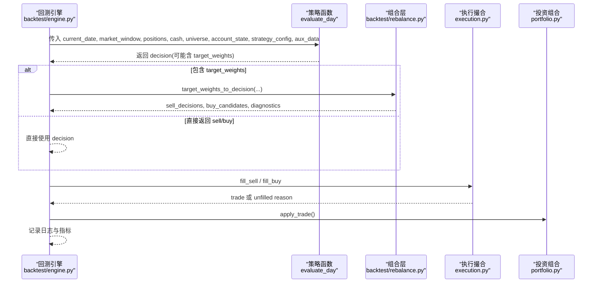
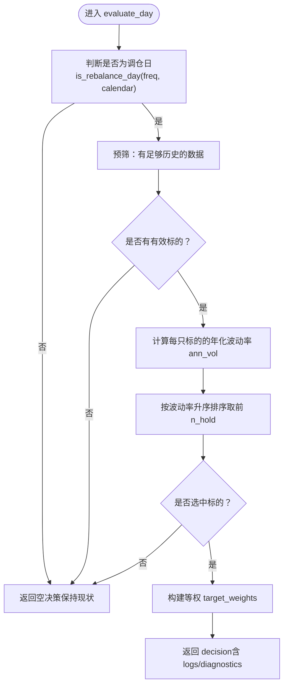
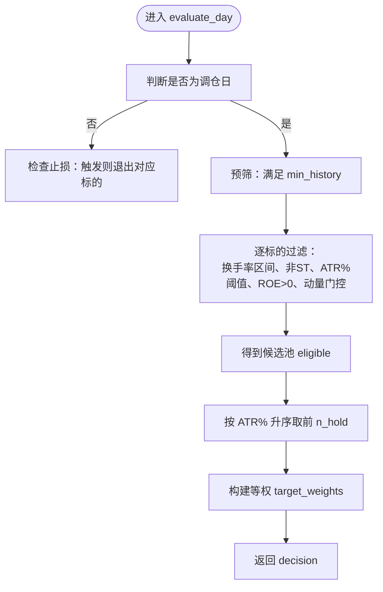
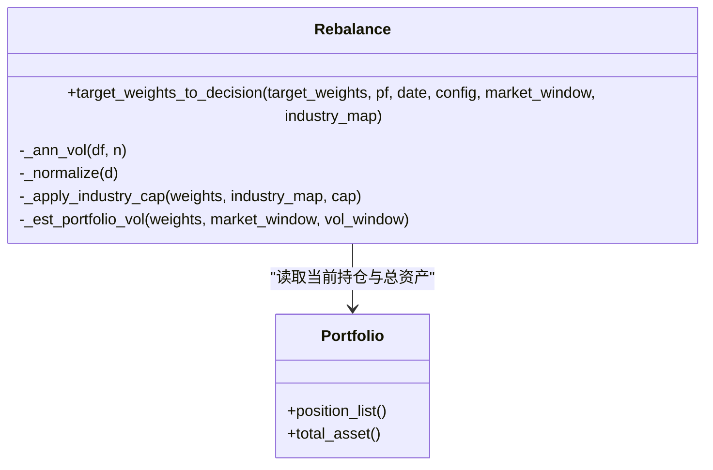
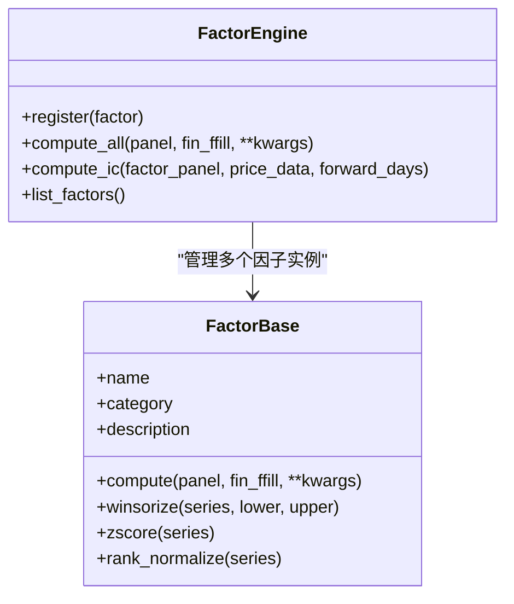
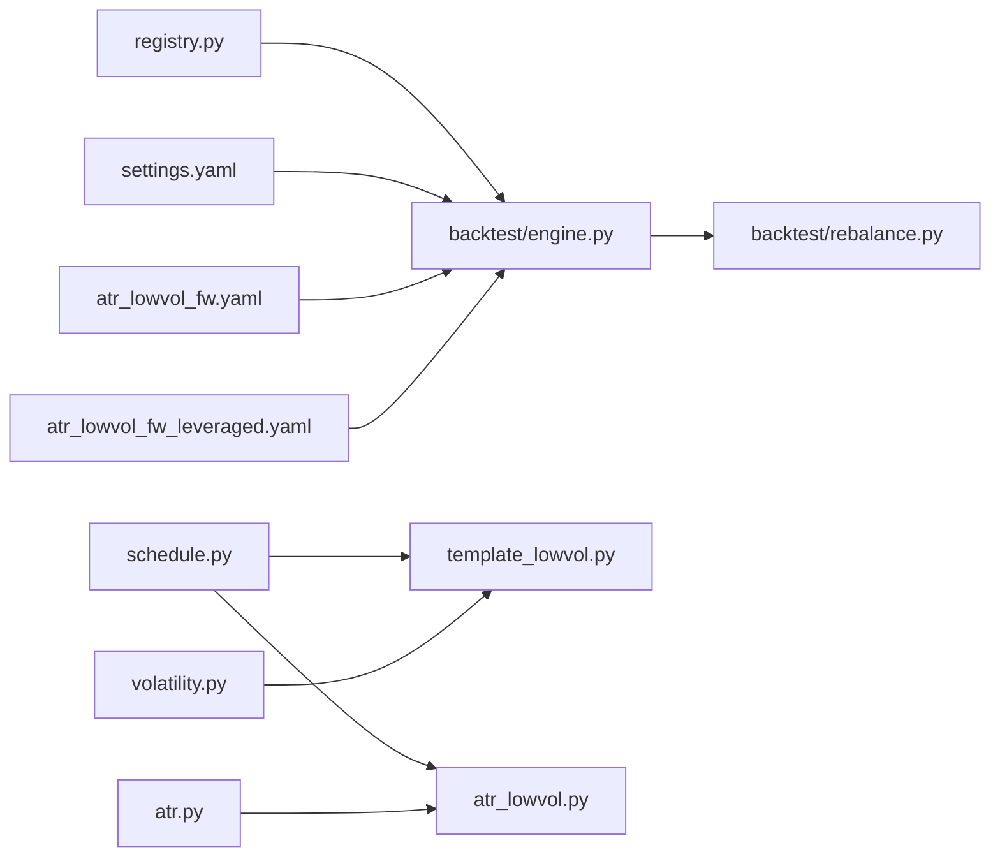

# 策略模板与开发规范

<cite>
**本文引用的文件**   
- [strategy/template_lowvol.py](file://strategy/template_lowvol.py)
- [strategy/atr_lowvol.py](file://strategy/atr_lowvol.py)
- [strategy/registry.py](file://strategy/registry.py)
- [strategy/schedule.py](file://strategy/schedule.py)
- [factors/volatility.py](file://factors/volatility.py)
- [factors/atr.py](file://factors/atr.py)
- [factors/base.py](file://factors/base.py)
- [factors/engine.py](file://factors/engine.py)
- [backtest/engine.py](file://backtest/engine.py)
- [backtest/rebalance.py](file://backtest/rebalance.py)
- [config/settings.yaml](file://config/settings.yaml)
- [config/atr_lowvol_fw.yaml](file://config/atr_lowvol_fw.yaml)
- [config/atr_lowvol_fw_leveraged.yaml](file://config/atr_lowvol_fw_leveraged.yaml)
</cite>

## 目录
1. [引言](#引言)
2. [项目结构](#项目结构)
3. [核心组件](#核心组件)
4. [架构总览](#架构总览)
5. [详细组件分析](#详细组件分析)
6. [依赖关系分析](#依赖关系分析)
7. [性能考量](#性能考量)
8. [故障排查指南](#故障排查指南)
9. [结论](#结论)
10. [附录：策略开发标准流程与示例](#附录策略开发标准流程与示例)

## 引言
本文件面向 QuantLab 的策略模板系统，重点解析 template_lowvol.py 模板的结构设计、类与函数关系、数据流处理，以及策略与因子系统的集成方式。文档同时给出从数据准备、因子计算、信号生成到订单执行的完整开发流程，并提供参数配置方法与调试技巧，帮助读者基于模板快速构建新策略。

## 项目结构
QuantLab 采用“扁平化策略模块 + 通用回测引擎 + 组合层”的架构：
- strategy 包：存放各策略实现（如 template_lowvol.py、atr_lowvol.py），通过装饰器注册 evaluate_day 接口。
- factors 包：提供因子计算工具与基类（如波动率、ATR、ROE）。
- backtest 包：回测主循环、执行撮合、组合再平衡与指标统计。
- config：统一配置文件（settings.yaml 与各策略专用 yaml）。

**图表来源** 
- [strategy/template_lowvol.py:1-94](file://strategy/template_lowvol.py#L1-L94)
- [strategy/atr_lowvol.py:1-165](file://strategy/atr_lowvol.py#L1-L165)
- [strategy/registry.py:1-115](file://strategy/registry.py#L1-L115)
- [strategy/schedule.py:1-47](file://strategy/schedule.py#L1-L47)
- [factors/volatility.py:1-27](file://factors/volatility.py#L1-L27)
- [factors/atr.py:1-43](file://factors/atr.py#L1-L43)
- [factors/base.py:1-52](file://factors/base.py#L1-L52)
- [factors/engine.py:1-86](file://factors/engine.py#L1-L86)
- [backtest/engine.py:1-619](file://backtest/engine.py#L1-L619)
- [backtest/rebalance.py:1-281](file://backtest/rebalance.py#L1-L281)
- [config/settings.yaml:1-69](file://config/settings.yaml#L1-L69)
- [config/atr_lowvol_fw.yaml:1-49](file://config/atr_lowvol_fw.yaml#L1-L49)
- [config/atr_lowvol_fw_leveraged.yaml:1-46](file://config/atr_lowvol_fw_leveraged.yaml#L1-L46)

**章节来源**
- [strategy/template_lowvol.py:1-94](file://strategy/template_lowvol.py#L1-L94)
- [backtest/engine.py:237-619](file://backtest/engine.py#L237-L619)
- [config/settings.yaml:1-69](file://config/settings.yaml#L1-L69)

## 核心组件
- 策略模板 template_lowvol：最小可运行 target_weights 策略，仅输出等权目标权重，其余由框架完成。
- 策略 atr_lowvol：更完整的低波策略，包含多门控与止损逻辑，仍遵循 target_weights 模式。
- 策略注册表 registry：装饰器注册 evaluate_day，支持自动发现与测试注入。
- 调度 schedule：统一的调仓日判定（周/月/季首交易日）。
- 因子 volatility/atr：年化波动率与 ATR% 计算，供策略与组合层使用。
- 回测引擎 engine：每日循环、基准加载、aux_data 注入、决策转订单、绩效统计。
- 组合层 rebalance：将 target_weights 转换为 sell/buy 决策，并应用仓位模型、行业上限、波动率目标、杠杆上限等约束。

**章节来源**
- [strategy/template_lowvol.py:1-94](file://strategy/template_lowvol.py#L1-L94)
- [strategy/atr_lowvol.py:1-165](file://strategy/atr_lowvol.py#L1-L165)
- [strategy/registry.py:1-115](file://strategy/registry.py#L1-L115)
- [strategy/schedule.py:1-47](file://strategy/schedule.py#L1-L47)
- [factors/volatility.py:1-27](file://factors/volatility.py#L1-L27)
- [factors/atr.py:1-43](file://factors/atr.py#L1-L43)
- [backtest/engine.py:237-619](file://backtest/engine.py#L237-L619)
- [backtest/rebalance.py:1-281](file://backtest/rebalance.py#L1-L281)

## 架构总览
QuantLab 的回测主循环在 backtest/engine.py 中驱动：读取市场数据与日历、构造 market_window、调用策略 evaluate_day，若返回 target_weights，则交由 backtest/rebalance.py 转换为 sell_decisions 与 buy_candidates，再由 execution 进行成交撮合与持仓更新。

**图表来源** 
- [backtest/engine.py:237-619](file://backtest/engine.py#L237-L619)
- [backtest/rebalance.py:101-281](file://backtest/rebalance.py#L101-L281)

## 详细组件分析

### 模板策略 template_lowvol 分析
- 职责：在调仓日选出波动率最低的前 n_hold 只股票，返回等权 target_weights；非调仓日返回空决策。
- 关键输入：current_date、market_window（按 code 切片的历史 DataFrame）、positions、cash、universe、account_state、strategy_config、aux_data（含 trading_calendar）。
- 关键输出：decision dict，包含 sell_decisions、buy_candidates、target_weights、diagnostics、logs。
- 依赖：strategy.schedule.is_rebalance_day、factors.volatility.ann_vol。

**图表来源** 
- [strategy/template_lowvol.py:34-94](file://strategy/template_lowvol.py#L34-L94)
- [strategy/schedule.py:10-47](file://strategy/schedule.py#L10-L47)
- [factors/volatility.py:6-27](file://factors/volatility.py#L6-L27)

**章节来源**
- [strategy/template_lowvol.py:1-94](file://strategy/template_lowvol.py#L1-L94)
- [strategy/schedule.py:1-47](file://strategy/schedule.py#L1-L47)
- [factors/volatility.py:1-27](file://factors/volatility.py#L1-L27)

### 策略 atr_lowvol 分析
- 职责：在调仓日执行多步筛选（换手率区间、非 ST、ATR% 阈值、ROE>0、动量门控），返回等权 target_weights；非调仓日根据止损条件决定是否退出部分持仓。
- 关键差异：相比模板，增加了更多业务门控与止损逻辑，但仍遵循 target_weights 模式。

**图表来源** 
- [strategy/atr_lowvol.py:37-165](file://strategy/atr_lowvol.py#L37-L165)
- [factors/atr.py:34-43](file://factors/atr.py#L34-L43)

**章节来源**
- [strategy/atr_lowvol.py:1-165](file://strategy/atr_lowvol.py#L1-L165)
- [factors/atr.py:1-43](file://factors/atr.py#L1-L43)

### 组合层 rebalance 分析
- 职责：将 target_weights 转换为 sell/buy 决策，并应用以下约束：
  - 仓位模型：equal / vol_parity / custom
  - 行业上限：industry_cap
  - 最大持仓数：max_positions
  - 最小持仓金额：min_position_value
  - 波动率目标：vol_target（估计组合波动率，按比例缩放）
  - 杠杆上限：target_leverage（gross 不超过该值）
- 输出：sell_decisions、buy_candidates、target_positions、diagnostics、logs。

**图表来源** 
- [backtest/rebalance.py:101-281](file://backtest/rebalance.py#L101-L281)

**章节来源**
- [backtest/rebalance.py:1-281](file://backtest/rebalance.py#L1-L281)

### 因子系统与基类
- FactorBase：定义 compute 接口与常用预处理（winsorize、zscore、rank_normalize）。
- FactorEngine：注册因子、批量计算、IC 统计。
- 具体因子：volatility.ann_vol、atr.atr_pct 等，供策略与组合层复用。

**图表来源** 
- [factors/base.py:9-52](file://factors/base.py#L9-L52)
- [factors/engine.py:9-86](file://factors/engine.py#L9-L86)

**章节来源**
- [factors/base.py:1-52](file://factors/base.py#L1-L52)
- [factors/engine.py:1-86](file://factors/engine.py#L1-L86)

## 依赖关系分析
- 策略模块通过 @register_strategy 注册 evaluate_day，回测引擎通过 registry.get_strategy 获取。
- 策略依赖 schedule.is_rebalance_day 控制调仓频率，依赖 factors.* 计算信号。
- 回测引擎依赖 backtest.rebalance.target_weights_to_decision 将策略意图转为订单。
- 配置通过 settings.yaml 与各策略专用 yaml 注入 run_backtest 的参数。

**图表来源** 
- [strategy/registry.py:1-115](file://strategy/registry.py#L1-L115)
- [strategy/schedule.py:1-47](file://strategy/schedule.py#L1-L47)
- [strategy/template_lowvol.py:1-94](file://strategy/template_lowvol.py#L1-L94)
- [strategy/atr_lowvol.py:1-165](file://strategy/atr_lowvol.py#L1-L165)
- [factors/volatility.py:1-27](file://factors/volatility.py#L1-L27)
- [factors/atr.py:1-43](file://factors/atr.py#L1-L43)
- [backtest/engine.py:237-619](file://backtest/engine.py#L237-L619)
- [backtest/rebalance.py:1-281](file://backtest/rebalance.py#L1-L281)
- [config/settings.yaml:1-69](file://config/settings.yaml#L1-L69)
- [config/atr_lowvol_fw.yaml:1-49](file://config/atr_lowvol_fw.yaml#L1-L49)
- [config/atr_lowvol_fw_leveraged.yaml:1-46](file://config/atr_lowvol_fw_leveraged.yaml#L1-L46)

**章节来源**
- [backtest/engine.py:237-619](file://backtest/engine.py#L237-L619)
- [strategy/registry.py:1-115](file://strategy/registry.py#L1-L115)

## 性能考量
- 窗口切片优化：回测引擎预先计算 cut_index，每日 O(1) 切片 market_window，避免重复搜索。
- 因子计算：优先使用向量化 pandas/numpy 操作（如 pct_change、ewm），减少 Python 循环。
- 组合层估算：vol_target 使用对角近似（忽略相关性），保守估计组合波动率，避免过度放大杠杆。
- 日志与诊断：通过 diagnostics 聚合 daily_candidate_total/passed、warnings_unique 等，便于定位瓶颈。

[本节为通用指导，不直接分析具体文件]

## 故障排查指南
- 常见错误与定位：
  - 未找到策略：registry.get_strategy 抛出 KeyError，确认注册名与模块路径。
  - 交易模型不支持：resolve_strategy 校验 ALLOWED_TRADING_MODELS，确保策略声明允许的交易模型。
  - 基准数据不可用：benchmark_code 存在但 duckdb 缺失或时间断点，回测会禁用 IR/excess 并记录警告。
  - 无有效标的：pre-filter 失败或 no_selection，检查 min_history、vol_window、ATR% 阈值等。
  - 未成交订单：fill_sell/fill_buy 返回 unfilled reason（涨跌停、停牌、滑点、整数手限制等），查看 daily_logs。
- 调试建议：
  - 使用 strategy_spy 临时替换 evaluate_day，捕获输入参数与中间结果。
  - 关注 decision.diagnostics 中的 warnings、candidate_total/passed、target_gross_leverage、est_portfolio_vol。
  - 检查 logs 中的 “[INFO]” 与 “[ERROR]” 行，定位问题日期与原因。

**章节来源**
- [strategy/registry.py:34-44](file://strategy/registry.py#L34-L44)
- [backtest/engine.py:207-234](file://backtest/engine.py#L207-L234)
- [backtest/engine.py:324-443](file://backtest/engine.py#L324-L443)
- [backtest/rebalance.py:101-281](file://backtest/rebalance.py#L101-L281)

## 结论
QuantLab 的策略模板系统以 target_weights 为核心抽象，将策略信号与组合风控解耦。template_lowvol 展示了“最小可运行”范式，atr_lowvol 演示了复杂门控与止损如何无缝接入同一框架。通过 registry、schedule、factors、rebalance 等组件的协作，开发者可以专注于选股与信号逻辑，而将订单簿记、风险约束与真实约束交给框架处理。

[本节为总结性内容，不直接分析具体文件]

## 附录：策略开发标准流程与示例

### 标准流程
- 数据准备：
  - 通过 reader.load_window 加载市场数据，构造 calendar 与 per-day universe。
  - 可选：加载 benchmark 序列用于绩效对比。
- 因子计算：
  - 使用 factors.* 提供的函数（如 ann_vol、atr_pct）或自定义 FactorBase 实现 compute。
  - 如需 IC 评估，使用 FactorEngine.compute_ic。
- 信号生成：
  - 在 evaluate_day 中完成预筛、因子计算、排序与选择，返回 target_weights 或直接返回 sell/buy 决策。
- 订单执行：
  - 回测引擎将 target_weights 经 rebalance 转换为 sell/buy，执行撮合并更新 portfolio。
- 绩效统计：
  - 回测结束后 compute_metrics 生成收益曲线、交易明细与诊断汇总。

**章节来源**
- [backtest/engine.py:237-619](file://backtest/engine.py#L237-L619)
- [factors/engine.py:20-86](file://factors/engine.py#L20-L86)

### 策略与因子系统集成
- 因子调用接口：
  - 直接调用 factors.volatility.ann_vol、factors.atr.atr_pct 等函数。
  - 自定义因子继承 FactorBase，实现 compute 并通过 FactorEngine.register 注册。
- 数据格式转换：
  - market_window[c] 为 DataFrame，列包括 close/open/high/low/vol 等；需确保类型转换（astype(float)）。
- 性能优化技巧：
  - 使用向量化操作（pct_change、ewm.mean）替代循环。
  - 合理设置 vol_window、min_history 以减少无效计算。
  - 利用回测引擎的 cut_index 与 _slice_window_fast 提升每日切片效率。

**章节来源**
- [factors/base.py:9-52](file://factors/base.py#L9-L52)
- [factors/engine.py:9-86](file://factors/engine.py#L9-L86)
- [factors/volatility.py:6-27](file://factors/volatility.py#L6-L27)
- [factors/atr.py:20-43](file://factors/atr.py#L20-L43)
- [backtest/engine.py:121-146](file://backtest/engine.py#L121-L146)

### 策略参数配置方法
- 硬编码参数：
  - 在 evaluate_day 内部通过 strategy_config.get(key, default) 读取。
- 外部配置文件：
  - settings.yaml 提供全局默认（如 initial_capital、commission、slippage、benchmark）。
  - 策略专用 yaml（如 atr_lowvol_fw.yaml）覆盖 strategy_params，包括 rebalance_freq、n_hold、atr_win、position_sizing、target_leverage、vol_target、industry_cap 等。
- 运行时注入：
  - run_backtest 接收 strategy_config 与 execution_cfg，并在每日循环中注入 aux_data（trading_calendar、benchmark_closes、fundamentals）。

**章节来源**
- [config/settings.yaml:1-69](file://config/settings.yaml#L1-L69)
- [config/atr_lowvol_fw.yaml:1-49](file://config/atr_lowvol_fw.yaml#L1-L49)
- [config/atr_lowvol_fw_leveraged.yaml:1-46](file://config/atr_lowvol_fw_leveraged.yaml#L1-L46)
- [backtest/engine.py:237-319](file://backtest/engine.py#L237-L319)

### 完整策略开发示例（基于模板）
- 步骤概览：
  - 复制 template_lowvol.py，重命名为你的策略模块（如 my_lowvol.py）。
  - 在模块顶层使用 @register_strategy("my_lowvol") 装饰 evaluate_day。
  - 修改选股逻辑（例如加入换手率、质量门控），保持返回 target_weights。
  - 在 atr_lowvol_fw.yaml 基础上新增 strategy: my_lowvol 与相应 strategy_params。
  - 运行回测，观察 logs 与 diagnostics，逐步调整参数。
- 关键点：
  - 非调仓日返回空决策（保持现状）。
  - 预筛保证 min_history 充足。
  - 使用 factors.* 计算信号，避免重复造轮子。
  - 通过 rebalance 层获得真实约束（涨跌停、停牌、滑点、整数手、ST±5%）。

**章节来源**
- [strategy/template_lowvol.py:1-94](file://strategy/template_lowvol.py#L1-L94)
- [config/atr_lowvol_fw.yaml:1-49](file://config/atr_lowvol_fw.yaml#L1-L49)
- [backtest/rebalance.py:101-281](file://backtest/rebalance.py#L101-L281)

### 调试技巧与最佳实践
- 日志记录：
  - 在 evaluate_day 的 decision["logs"] 中添加关键信息（如 selected count、warnings）。
  - 回测引擎会将 logs 写入 daily_logs，便于事后分析。
- 中间结果检查：
  - 使用 strategy_spy 捕获 evaluate_day 的输入与输出，验证 market_window、positions、universe 是否符合预期。
  - 检查 decision.diagnostics 中的 candidate_total/passed、target_gross_leverage、est_portfolio_vol。
- 错误处理：
  - 对异常数据（NaN、零价格、缺失字段）做防御性判断（如 v > 0、close > 0）。
  - 对基准数据缺失或断点，回测会自动降级并记录警告。

**章节来源**
- [strategy/template_lowvol.py:34-94](file://strategy/template_lowvol.py#L34-L94)
- [strategy/registry.py:59-94](file://strategy/registry.py#L59-L94)
- [backtest/engine.py:324-443](file://backtest/engine.py#L324-L443)