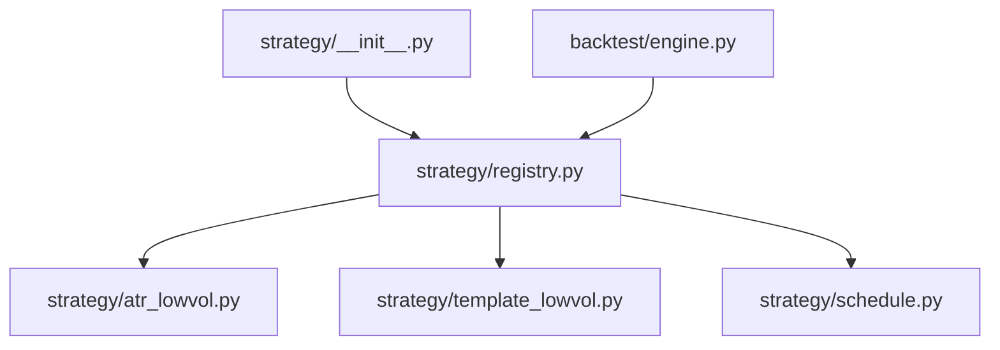
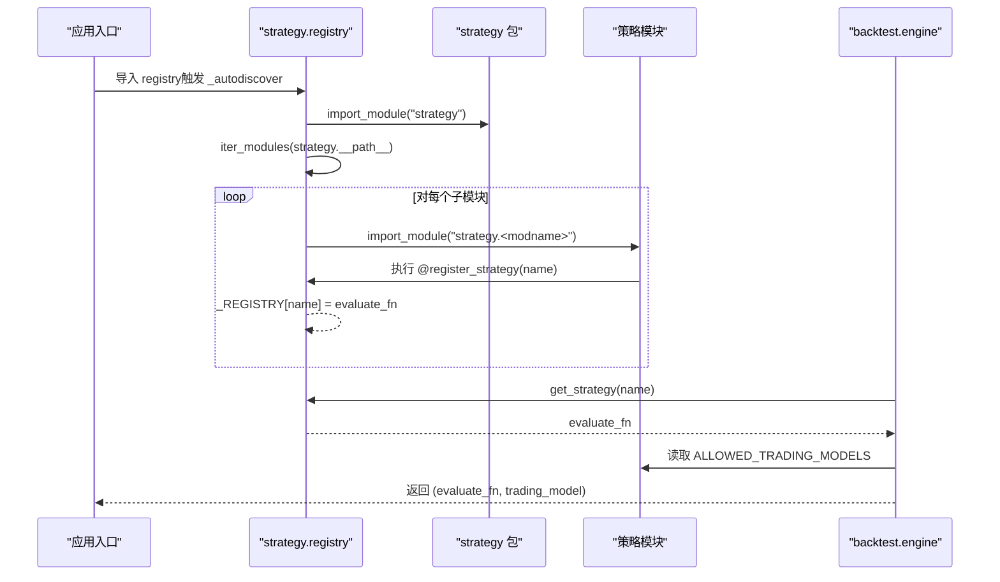
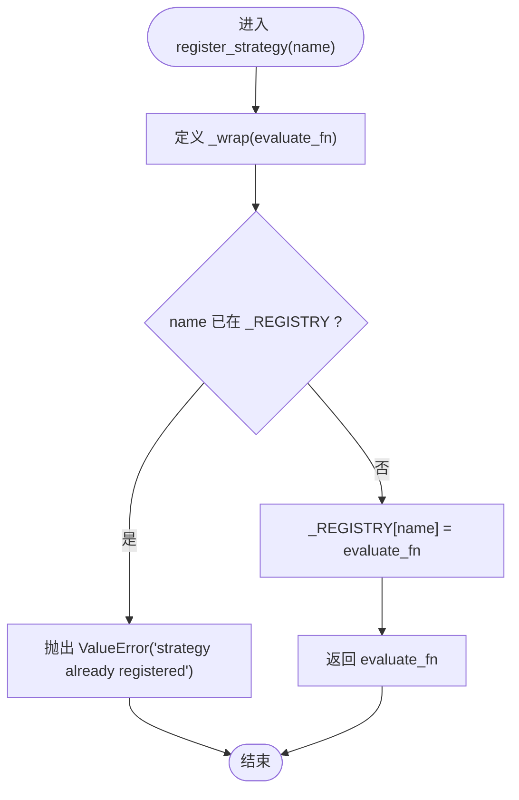
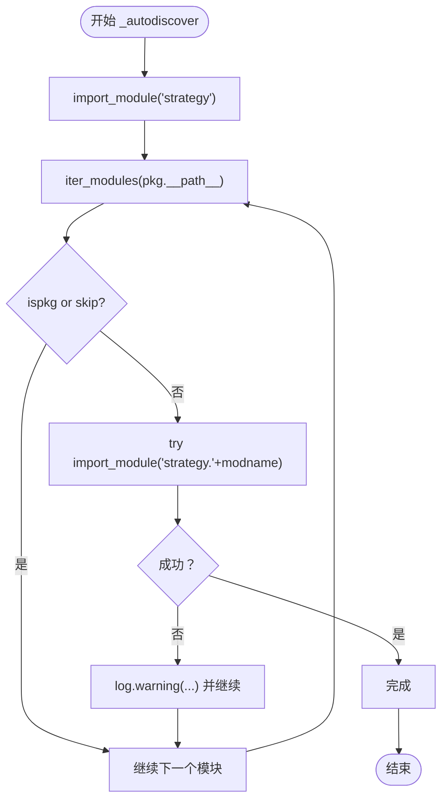
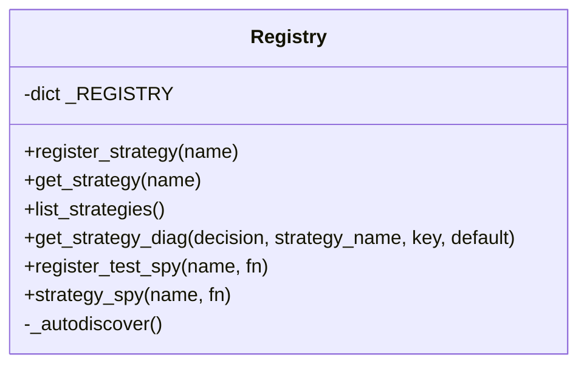
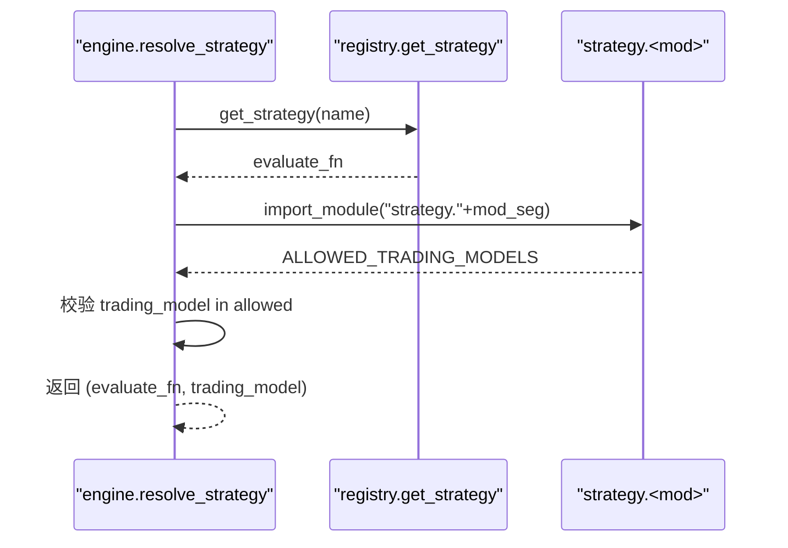
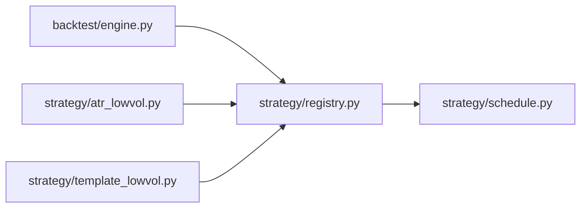
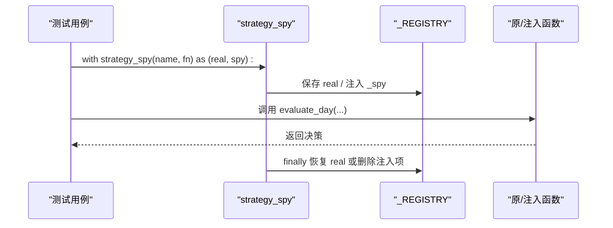

# 策略注册机制

<cite>
**本文引用的文件**   
- [strategy/registry.py](file://strategy/registry.py)
- [strategy/__init__.py](file://strategy/__init__.py)
- [strategy/atr_lowvol.py](file://strategy/atr_lowvol.py)
- [strategy/template_lowvol.py](file://strategy/template_lowvol.py)
- [strategy/schedule.py](file://strategy/schedule.py)
- [backtest/engine.py](file://backtest/engine.py)
</cite>

## 目录
1. [简介](#简介)
2. [项目结构](#项目结构)
3. [核心组件](#核心组件)
4. [架构总览](#架构总览)
5. [详细组件分析](#详细组件分析)
6. [依赖关系分析](#依赖关系分析)
7. [性能考虑](#性能考虑)
8. [故障排查指南](#故障排查指南)
9. [结论](#结论)
10. [附录：示例与最佳实践](#附录示例与最佳实践)

## 简介
本文件面向 QuantLab 的策略注册机制，系统性说明 @register_strategy 装饰器的工作原理、策略注册表 _REGISTRY 的数据结构与生命周期、自动发现机制 _autodiscover() 的实现细节、策略获取接口 get_strategy() 与列表接口 list_strategies() 的用法，以及测试辅助 register_test_spy() 与 strategy_spy() 的使用方法与最佳实践。同时给出策略命名规范与冲突处理机制，帮助读者快速、正确地编写和集成新的 target_weights 策略。

## 项目结构
QuantLab 将策略以扁平模块形式组织在 strategy/ 包下，每个策略一个 .py 文件，通过 @register_strategy("<name>") 在模块顶层完成注册。框架在导入 strategy 包时自动扫描并触发所有策略模块的导入，从而执行各模块中的装饰器逻辑，完成注册。

图表来源
- [strategy/__init__.py:1-11](file://strategy/__init__.py#L1-L11)
- [strategy/registry.py:1-115](file://strategy/registry.py#L1-L115)
- [strategy/atr_lowvol.py:1-165](file://strategy/atr_lowvol.py#L1-L165)
- [strategy/template_lowvol.py:1-94](file://strategy/template_lowvol.py#L1-L94)
- [strategy/schedule.py:1-47](file://strategy/schedule.py#L1-L47)
- [backtest/engine.py:1-270](file://backtest/engine.py#L1-L270)

章节来源
- [strategy/__init__.py:1-11](file://strategy/__init__.py#L1-L11)
- [strategy/registry.py:1-115](file://strategy/registry.py#L1-L115)

## 核心组件
- 装饰器 register_strategy(name)：用于在策略模块顶层注册 evaluate_day 函数，键为 name，值为 evaluate_day。
- 注册表 _REGISTRY：进程内全局字典，保存已注册的策略名到函数的映射。
- 自动发现 _autodiscover()：扫描 strategy/ 包下的子模块，跳过已知非目标模块，逐个导入以触发装饰器。
- 策略获取与列表：get_strategy(name) 返回已注册函数；list_strategies() 返回已注册名称排序后的列表。
- 诊断取值 get_strategy_diag(decision, strategy_name, key, default=None)：从 decision.diagnostics.strategy_specific.{short_name}.{key} 安全取值。
- 测试辅助：register_test_spy(name, fn) 直接注入临时函数；strategy_spy(name, fn=None) 上下文管理器临时替换或注入，退出时恢复。

章节来源
- [strategy/registry.py:24-44](file://strategy/registry.py#L24-L44)
- [strategy/registry.py:47-54](file://strategy/registry.py#L47-L54)
- [strategy/registry.py:59-94](file://strategy/registry.py#L59-L94)
- [strategy/registry.py:96-115](file://strategy/registry.py#L96-L115)

## 架构总览
策略注册机制的核心流程如下：
- 模块级装饰器：策略模块在顶层使用 @register_strategy("name") 装饰 evaluate_day。
- 自动扫描：导入 strategy 包后，registry 模块在初始化时调用 _autodiscover()，遍历 strategy/ 下的模块并导入，触发装饰器执行。
- 注册表维护：_REGISTRY 保存 name -> evaluate_day 的映射，支持 O(1) 查找。
- 引擎集成：回测引擎通过 resolve_strategy() 调用 get_strategy() 获取 evaluate_day，并按策略声明的 ALLOWED_TRADING_MODELS 校验 trading_model。

图表来源
- [strategy/registry.py:96-115](file://strategy/registry.py#L96-L115)
- [strategy/registry.py:24-31](file://strategy/registry.py#L24-L31)
- [backtest/engine.py:207-234](file://backtest/engine.py#L207-L234)

## 详细组件分析

### 装饰器 register_strategy(name)
- 作用：在模块顶层装饰 evaluate_day，将其注册到 _REGISTRY[name]。
- 参数传递：name 作为装饰器工厂的参数传入，用于唯一标识策略。
- 包装过程：内部 _wrap(evaluate_fn) 检查是否重复注册，若重复抛出 ValueError；否则写入 _REGISTRY 并原样返回 evaluate_fn，保证策略函数签名不变。
- 复杂度：O(1) 插入与访问。

图表来源
- [strategy/registry.py:24-31](file://strategy/registry.py#L24-L31)

章节来源
- [strategy/registry.py:24-31](file://strategy/registry.py#L24-L31)

### 注册表 _REGISTRY 与生命周期
- 数据结构：进程内全局字典 {name: evaluate_fn}。
- 生命周期：随 Python 进程启动而创建，随进程结束而销毁。模块导入时由装饰器填充，运行时可被测试辅助临时覆盖。
- 并发与线程安全：未加锁，默认单线程回测场景；多线程需外部同步。
- 内存占用：仅存储函数引用，开销极小。

章节来源
- [strategy/registry.py:15](file://strategy/registry.py#L15)

### 自动发现机制 _autodiscover()
- 扫描范围：strategy/ 包路径下的所有子模块。
- 跳过规则：跳过 registry、schedule、base、__init__ 及 legacy multi_factor、ml_strategy、portfolio 等，避免重依赖与慢导入。
- 导入策略：对每个模块名 modname，尝试 import_module("strategy." + modname)，失败则记录警告但不中断整体扫描。
- 触发时机：registry 模块加载时立即调用 _autodiscover()，确保后续 get_strategy() 可用。

图表来源
- [strategy/registry.py:96-115](file://strategy/registry.py#L96-L115)

章节来源
- [strategy/registry.py:96-115](file://strategy/registry.py#L96-L115)

### 策略获取与列表接口
- get_strategy(name)：若 name 不在 _REGISTRY，抛出 KeyError，并附带已注册名称列表以便调试；存在则返回 evaluate_fn。
- list_strategies()：返回已注册名称的排序列表，便于枚举与展示。

图表来源
- [strategy/registry.py:24-44](file://strategy/registry.py#L24-L44)
- [strategy/registry.py:47-54](file://strategy/registry.py#L47-L54)
- [strategy/registry.py:59-94](file://strategy/registry.py#L59-L94)
- [strategy/registry.py:96-115](file://strategy/registry.py#L96-L115)

章节来源
- [strategy/registry.py:34-44](file://strategy/registry.py#L34-L44)

### 引擎集成与交易模型校验
- backtest/engine.py 中 resolve_strategy(strategy_name, trading_model)：
  - 通过 get_strategy(name) 获取 evaluate_fn。
  - 解析 strategy_name 的最后一段作为模块名，尝试导入 strategy.<mod_seg> 以读取 ALLOWED_TRADING_MODELS。
  - 校验传入的 trading_model 是否在允许列表中，否则抛出 ValueError。
  - 返回 (evaluate_fn, trading_model)。

图表来源
- [backtest/engine.py:207-234](file://backtest/engine.py#L207-L234)

章节来源
- [backtest/engine.py:207-234](file://backtest/engine.py#L207-L234)

### 调仓日历辅助 schedule.is_rebalance_day
- 功能：根据 freq（weekly/monthly/quarterly）与交易日历 calendar，判断当前日期是否为调仓日（周/月/季首交易日）。
- 策略用途：在 evaluate_day 中决定是否执行选股与调仓，非调仓日返回空决策或保持持仓。

章节来源
- [strategy/schedule.py:10-47](file://strategy/schedule.py#L10-L47)

## 依赖关系分析
- 模块耦合：
  - registry.py 不依赖具体策略实现，仅维护 _REGISTRY 与自动发现。
  - 策略模块依赖 registry.register_strategy 与 schedule.is_rebalance_day。
  - engine.py 依赖 registry.get_strategy/list_strategies 与策略模块的 ALLOWED_TRADING_MODELS。
- 外部依赖：
  - importlib、pkgutil 用于动态导入与模块扫描。
  - pandas 用于日期计算（schedule）。
- 潜在循环依赖：无，registry 不反向导入策略模块，策略模块也不导入 engine。

图表来源
- [backtest/engine.py:20-25](file://backtest/engine.py#L20-L25)
- [strategy/registry.py:9-11](file://strategy/registry.py#L9-L11)
- [strategy/atr_lowvol.py:29-32](file://strategy/atr_lowvol.py#L29-L32)
- [strategy/template_lowvol.py:27-29](file://strategy/template_lowvol.py#L27-L29)
- [strategy/schedule.py:1-7](file://strategy/schedule.py#L1-L7)

章节来源
- [backtest/engine.py:20-25](file://backtest/engine.py#L20-L25)
- [strategy/registry.py:9-11](file://strategy/registry.py#L9-L11)

## 性能考虑
- 自动发现仅在模块导入时执行一次，时间复杂度与策略模块数量线性相关。
- 单个模块导入失败不影响整体，日志记录便于定位问题。
- _REGISTRY 查找为 O(1)，list_strategies() 排序为 O(n log n)，n 为策略数量，通常很小。
- 建议：
  - 避免在策略模块导入时执行耗时逻辑，尽量延迟到 evaluate_day 调用。
  - 控制策略模块依赖库的大小，减少冷启动时间。

[本节为通用指导，不直接分析具体文件]

## 故障排查指南
- KeyError: strategy not found
  - 现象：get_strategy(name) 找不到策略。
  - 原因：模块未导入或未正确注册；名称不一致。
  - 处理：确认模块位于 strategy/ 且未被 _AUTODISCOVER_SKIP 跳过；检查 @register_strategy 的 name 是否与调用一致。
- ValueError: strategy already registered
  - 现象：重复注册同名策略。
  - 原因：多个模块使用相同 name。
  - 处理：统一命名规范，避免冲突。
- ValueError: trading_model not allowed
  - 现象：resolve_strategy 校验失败。
  - 原因：策略未声明 ALLOWED_TRADING_MODELS 或传入值不在允许列表。
  - 处理：在策略模块顶部添加 ALLOWED_TRADING_MODELS = ["next_open"] 或其他允许值。
- 自动发现跳过模块
  - 现象：新策略未被注册。
  - 原因：模块名命中 _AUTODISCOVER_SKIP 或被异常捕获。
  - 处理：检查模块名与跳过集合；查看日志中的 warning 信息。

章节来源
- [strategy/registry.py:34-44](file://strategy/registry.py#L34-L44)
- [strategy/registry.py:24-31](file://strategy/registry.py#L24-L31)
- [backtest/engine.py:207-234](file://backtest/engine.py#L207-L234)
- [strategy/registry.py:96-115](file://strategy/registry.py#L96-L115)

## 结论
QuantLab 的策略注册机制以极简装饰器为核心，配合自动发现与轻量注册表，实现了“即插即用”的目标权重策略体系。通过统一的 evaluate_day 接口与组合层解耦，策略只需关注选股与目标权重输出，其余风控、订单簿记与真实约束由框架承担。该设计具备高扩展性、低耦合与易测试特性，适合大规模策略开发与迭代。

[本节为总结，不直接分析具体文件]

## 附录：示例与最佳实践

### 如何编写一个策略
- 在 strategy/<your_strategy>.py 中：
  - 从 strategy.registry 导入 register_strategy。
  - 定义 evaluate_day(current_date, market_window, positions, cash, universe, account_state, strategy_config, aux_data)。
  - 在模块顶层使用 @register_strategy("<your_name>") 装饰 evaluate_day。
  - 可选：声明 ALLOWED_TRADING_MODELS = ["next_open"]。
  - 可选：使用 schedule.is_rebalance_day 控制调仓频率。
- 参考实现：
  - atr_lowvol 策略：[strategy/atr_lowvol.py:78-165](file://strategy/atr_lowvol.py#L78-L165)
  - template_lowvol 模板：[strategy/template_lowvol.py:46-94](file://strategy/template_lowvol.py#L46-L94)

章节来源
- [strategy/atr_lowvol.py:78-165](file://strategy/atr_lowvol.py#L78-L165)
- [strategy/template_lowvol.py:46-94](file://strategy/template_lowvol.py#L46-L94)

### 策略命名规范与冲突处理
- 命名规范：
  - 使用短横线或下划线的英文标识符，如 "atr_lowvol"、"template_lowvol"。
  - 可通过 category/name 形式（如 "research/atr_lowvol"），引擎会取最后一段匹配。
- 冲突处理：
  - 重复注册会抛出 ValueError，需在开发阶段避免同名。
  - 使用 list_strategies() 检查已注册名称。
  - 若需要多版本共存，建议使用不同 name（例如 "v1"、"v2" 后缀）。

章节来源
- [strategy/registry.py:24-31](file://strategy/registry.py#L24-L31)
- [backtest/engine.py:207-234](file://backtest/engine.py#L207-L234)

### 获取与列出策略
- 获取策略：
  - from strategy.registry import get_strategy
  - fn = get_strategy("atr_lowvol")
- 列出策略：
  - from strategy.registry import list_strategies
  - names = list_strategies()

章节来源
- [strategy/registry.py:34-44](file://strategy/registry.py#L34-L44)

### 测试辅助：register_test_spy 与 strategy_spy
- register_test_spy(name, fn)：
  - 直接注入临时函数，返回旧版本供还原。
  - 适用于单元测试中快速替换策略行为。
- strategy_spy(name, fn=None)：
  - 上下文管理器，临时替换或注入 evaluate_day。
  - 用法1：替换已注册策略，spy 包装原函数，退出自动恢复。
  - 用法2：注入新临时策略 fn，退出时删除。
  - 捕获调用参数，便于断言与验证。

图表来源
- [strategy/registry.py:66-94](file://strategy/registry.py#L66-L94)

章节来源
- [strategy/registry.py:59-94](file://strategy/registry.py#L59-L94)

### 完整示例流程（端到端）
- 步骤：
  - 编写策略模块并使用 @register_strategy 装饰 evaluate_day。
  - 运行回测引擎，传入 strategy_name="your_name"。
  - 引擎通过 get_strategy() 获取 evaluate_fn，并校验 trading_model。
  - 每日调用 evaluate_day，返回 target_weights，由组合层生成订单。
- 参考：
  - 引擎集成：[backtest/engine.py:207-234](file://backtest/engine.py#L207-L234)
  - 策略示例：[strategy/atr_lowvol.py:78-165](file://strategy/atr_lowvol.py#L78-L165)、[strategy/template_lowvol.py:46-94](file://strategy/template_lowvol.py#L46-L94)

章节来源
- [backtest/engine.py:207-234](file://backtest/engine.py#L207-L234)
- [strategy/atr_lowvol.py:78-165](file://strategy/atr_lowvol.py#L78-L165)
- [strategy/template_lowvol.py:46-94](file://strategy/template_lowvol.py#L46-L94)