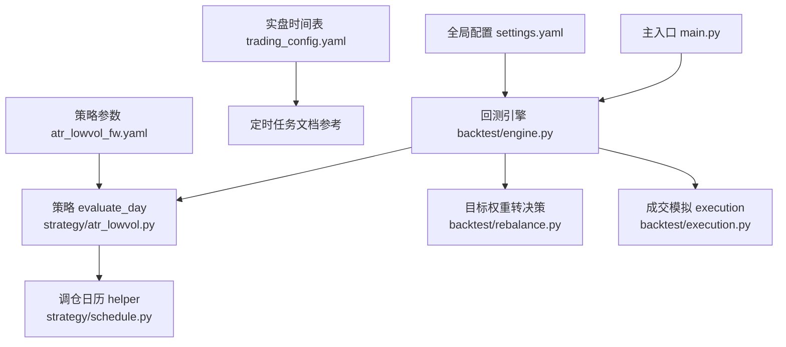
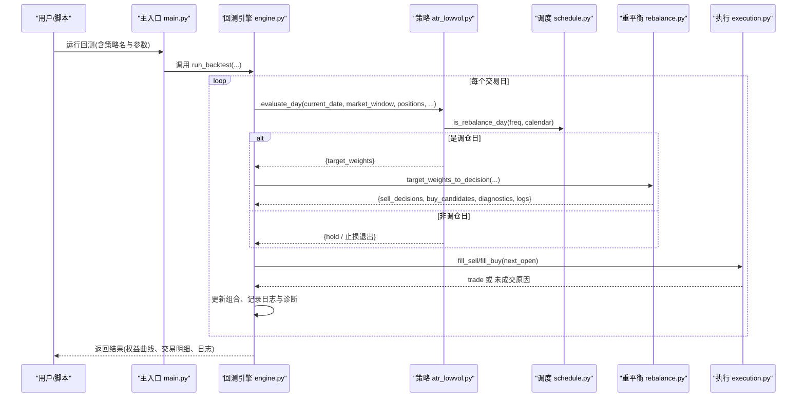
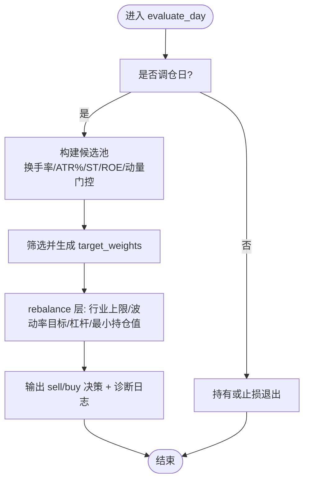
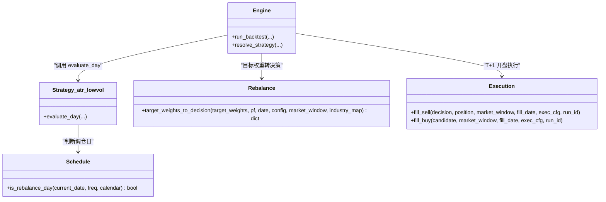
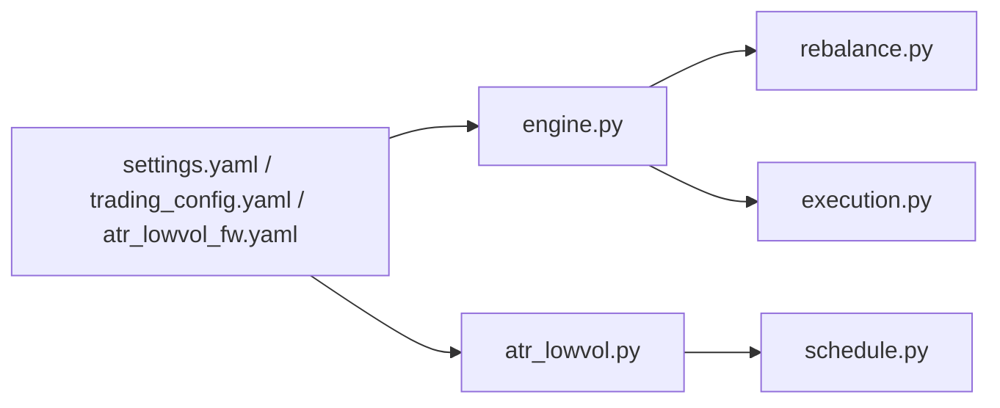

# 调仓时间管理

<cite>
**本文引用的文件**
- [backtest/engine.py](file://backtest/engine.py)
- [backtest/rebalance.py](file://backtest/rebalance.py)
- [strategy/schedule.py](file://strategy/schedule.py)
- [strategy/atr_lowvol.py](file://strategy/atr_lowvol.py)
- [config/trading_config.yaml](file://config/trading_config.yaml)
- [config/settings.yaml](file://config/settings.yaml)
- [config/atr_lowvol_fw.yaml](file://config/atr_lowvol_fw.yaml)
- [projects/Project_01_多因子IC小盘Alpha/config/strategy.yaml](file://projects/Project_01_多因子IC小盘Alpha/config/strategy.yaml)
- [projects/Project_10_价值小盘V2/config/strategy.yaml](file://projects/Project_10_价值小盘V2/config/strategy.yaml)
- [main.py](file://main.py)
- [backtest/execution.py](file://backtest/execution.py)
</cite>

## 目录
1. [简介](#简介)
2. [项目结构](#项目结构)
3. [核心组件](#核心组件)
4. [架构总览](#架构总览)
5. [详细组件分析](#详细组件分析)
6. [依赖关系分析](#依赖关系分析)
7. [性能考虑](#性能考虑)
8. [故障排查指南](#故障排查指南)
9. [结论](#结论)
10. [附录：配置示例与最佳实践](#附录配置示例与最佳实践)

## 简介
本文件面向 QuantLab 的“调仓时间管理”能力，系统性说明如何配置调仓频率（每日、每周、每月、每季度等）、调仓执行时机（开盘前、盘中、收盘后），以及调仓前置条件（市场状态检查、流动性过滤等）。同时给出与回测引擎的集成方式、日志记录与调试方法，并提供完整的 YAML 配置示例，帮助开发者快速搭建并验证复杂的调仓规则。

## 项目结构
QuantLab 将“何时调仓”和“如何调仓”解耦：
- 策略层负责生成目标权重 target_weights；
- 通用组合层根据风控与仓位规则将目标权重转换为买卖决策；
- 调度层提供统一的调仓日历判断逻辑；
- 回测引擎按交易日驱动策略与执行层，确保信号在 T+1 开盘执行。

图表来源
- [backtest/engine.py:237-443](file://backtest/engine.py#L237-L443)
- [strategy/atr_lowvol.py:78-165](file://strategy/atr_lowvol.py#L78-L165)
- [strategy/schedule.py:10-46](file://strategy/schedule.py#L10-L46)
- [backtest/rebalance.py:101-260](file://backtest/rebalance.py#L101-L260)
- [backtest/execution.py:95-117](file://backtest/execution.py#L95-L117)
- [config/settings.yaml:1-69](file://config/settings.yaml#L1-L69)
- [config/trading_config.yaml:30-36](file://config/trading_config.yaml#L30-L36)
- [config/atr_lowvol_fw.yaml:26-49](file://config/atr_lowvol_fw.yaml#L26-L49)

章节来源
- [backtest/engine.py:237-443](file://backtest/engine.py#L237-L443)
- [strategy/atr_lowvol.py:78-165](file://strategy/atr_lowvol.py#L78-L165)
- [strategy/schedule.py:10-46](file://strategy/schedule.py#L10-L46)
- [backtest/rebalance.py:101-260](file://backtest/rebalance.py#L101-L260)
- [backtest/execution.py:95-117](file://backtest/execution.py#L95-L117)
- [config/settings.yaml:1-69](file://config/settings.yaml#L1-L69)
- [config/trading_config.yaml:30-36](file://config/trading_config.yaml#L30-L36)
- [config/atr_lowvol_fw.yaml:26-49](file://config/atr_lowvol_fw.yaml#L26-L49)

## 核心组件
- 调仓日历判定：统一实现周/月/季首日的判断，支持传入交易日历进行精确匹配。
- 策略评估函数：每个策略通过 evaluate_day 返回 target_weights；非调仓日可仅做止损或持有。
- 目标权重到决策转换：将策略的目标权重经行业上限、波动率目标、杠杆上限、最小持仓值等约束转化为 sell/buy 决策。
- 回测引擎循环：按交易日调用策略，T 日生成信号，T+1 日开盘执行；记录日志、诊断指标与未成交原因。
- 执行层模拟：基于 next_open 模型进行涨跌停、停牌、滑点、手续费与印花税模拟。

章节来源
- [strategy/schedule.py:10-46](file://strategy/schedule.py#L10-L46)
- [strategy/atr_lowvol.py:78-165](file://strategy/atr_lowvol.py#L78-L165)
- [backtest/rebalance.py:101-260](file://backtest/rebalance.py#L101-L260)
- [backtest/engine.py:237-443](file://backtest/engine.py#L237-L443)
- [backtest/execution.py:95-117](file://backtest/execution.py#L95-L117)

## 架构总览
下图展示从配置加载到信号生成、决策转换与成交模拟的完整链路。

图表来源
- [main.py:28-73](file://main.py#L28-L73)
- [backtest/engine.py:237-443](file://backtest/engine.py#L237-L443)
- [strategy/atr_lowvol.py:78-165](file://strategy/atr_lowvol.py#L78-L165)
- [strategy/schedule.py:10-46](file://strategy/schedule.py#L10-L46)
- [backtest/rebalance.py:101-260](file://backtest/rebalance.py#L101-L260)
- [backtest/execution.py:95-117](file://backtest/execution.py#L95-L117)

## 详细组件分析

### 调仓频率与时间点配置
- 频率选项
  - 策略侧使用字符串 freq 控制：weekly、monthly、quarterly；None/空表示每日。
  - 工程侧也有“双月/周频”等便捷写法（如 2M、W、Q），用于研究管线中的日期选择。
- 时间点（实盘）
  - 通过 trading_config.yaml 的 schedule 节点定义盘前、开盘、午后、风控间隔、尾盘等时间点。
  - 这些时间点由外部调度器（如 schedule）触发具体任务，策略仍遵循“T 日信号、T+1 开盘执行”的回测一致性约定。

章节来源
- [strategy/schedule.py:10-46](file://strategy/schedule.py#L10-L46)
- [config/trading_config.yaml:30-36](file://config/trading_config.yaml#L30-L36)
- [projects/Project_01_多因子IC小盘Alpha/config/strategy.yaml:30-35](file://projects/Project_01_多因子IC小盘Alpha/config/strategy.yaml#L30-L35)
- [projects/Project_10_价值小盘V2/config/strategy.yaml:30-34](file://projects/Project_10_价值小盘V2/config/strategy.yaml#L30-L34)

### 调仓条件判断逻辑（前置条件）
- 市场状态检查
  - 执行层对开盘价有效性、涨跌停、停牌等进行校验，避免无效成交。
- 流动性过滤
  - 策略可在选股阶段加入换手率区间、ATR% 上限等流动性/波动性过滤。
- 质量与动量门控
  - 例如 ROE>0、12-1 月动量为正等，减少劣质标的进入候选池。
- 止损保护
  - 非调仓日也可触发止损退出，保持风险控制。

图表来源
- [strategy/atr_lowvol.py:78-165](file://strategy/atr_lowvol.py#L78-L165)
- [backtest/rebalance.py:101-260](file://backtest/rebalance.py#L101-L260)
- [backtest/execution.py:95-117](file://backtest/execution.py#L95-L117)

章节来源
- [strategy/atr_lowvol.py:78-165](file://strategy/atr_lowvol.py#L78-L165)
- [backtest/rebalance.py:101-260](file://backtest/rebalance.py#L101-L260)
- [backtest/execution.py:95-117](file://backtest/execution.py#L95-L117)

### 与回测引擎的集成
- 引擎在每个交易日调用策略 evaluate_day，若返回 target_weights，则交由 rebalance 层转换为标准决策。
- 信号在 T 日生成，T+1 日开盘执行（next_open 模型），保证与实盘一致的时序。
- 引擎聚合诊断信息（候选数量、通过率、未成交次数等），并写入日志。

章节来源
- [backtest/engine.py:237-443](file://backtest/engine.py#L237-L443)
- [backtest/rebalance.py:101-260](file://backtest/rebalance.py#L101-L260)

### 类与模块关系图

图表来源
- [backtest/engine.py:237-443](file://backtest/engine.py#L237-L443)
- [strategy/atr_lowvol.py:78-165](file://strategy/atr_lowvol.py#L78-L165)
- [strategy/schedule.py:10-46](file://strategy/schedule.py#L10-L46)
- [backtest/rebalance.py:101-260](file://backtest/rebalance.py#L101-L260)
- [backtest/execution.py:95-117](file://backtest/execution.py#L95-L117)

## 依赖关系分析
- 策略依赖调度模块确定调仓日；
- 引擎依赖策略注册表与 rebalance 层；
- 执行层依赖市场数据与执行参数；
- 配置文件为策略与系统行为提供参数化支撑。

图表来源
- [config/settings.yaml:1-69](file://config/settings.yaml#L1-L69)
- [config/trading_config.yaml:30-36](file://config/trading_config.yaml#L30-L36)
- [config/atr_lowvol_fw.yaml:26-49](file://config/atr_lowvol_fw.yaml#L26-L49)
- [backtest/engine.py:237-443](file://backtest/engine.py#L237-L443)
- [strategy/atr_lowvol.py:78-165](file://strategy/atr_lowvol.py#L78-L165)
- [strategy/schedule.py:10-46](file://strategy/schedule.py#L10-L46)
- [backtest/rebalance.py:101-260](file://backtest/rebalance.py#L101-L260)
- [backtest/execution.py:95-117](file://backtest/execution.py#L95-L117)

章节来源
- [backtest/engine.py:237-443](file://backtest/engine.py#L237-L443)
- [strategy/atr_lowvol.py:78-165](file://strategy/atr_lowvol.py#L78-L165)
- [strategy/schedule.py:10-46](file://strategy/schedule.py#L10-L46)
- [backtest/rebalance.py:101-260](file://backtest/rebalance.py#L101-L260)
- [backtest/execution.py:95-117](file://backtest/execution.py#L95-L117)
- [config/settings.yaml:1-69](file://config/settings.yaml#L1-L69)
- [config/trading_config.yaml:30-36](file://config/trading_config.yaml#L30-L36)
- [config/atr_lowvol_fw.yaml:26-49](file://config/atr_lowvol_fw.yaml#L26-L49)

## 性能考虑
- 窗口切片优化：引擎预计算 cut_index，使每日数据切片接近 O(1)。
- 基准序列对齐：采用前向填充补齐缺失，降低异常中断影响。
- 诊断聚合：汇总候选通过率、未成交次数等关键指标，便于定位瓶颈。
- 建议：合理设置 vol_window、max_positions、min_position_value，避免过度交易与过小的持仓导致摩擦成本放大。

章节来源
- [backtest/engine.py:121-146](file://backtest/engine.py#L121-L146)
- [backtest/engine.py:490-501](file://backtest/engine.py#L490-L501)

## 故障排查指南
- 常见未成交原因
  - 停牌/无可用成交量/开盘价无效/跌停开盘等，执行层会返回明确原因。
- 日志查看
  - 引擎逐日记录 [INFO]/[ERROR] 行，包含成交详情与未成交原因；rebalance 层也会输出行业上限裁剪、波动率目标缩放等日志。
- 诊断指标
  - 关注 candidate_total/candidate_passed、unfilled_order_count、target_gross_leverage、est_portfolio_vol 等字段。
- 复现与隔离
  - 固定 trading_model=next_open，逐步关闭 overlays（industry_cap/vol_target/leverage）以定位问题来源。

章节来源
- [backtest/execution.py:95-117](file://backtest/execution.py#L95-L117)
- [backtest/engine.py:324-371](file://backtest/engine.py#L324-L371)
- [backtest/rebalance.py:155-196](file://backtest/rebalance.py#L155-L196)

## 结论
QuantLab 的调仓时间管理通过“策略—调度—组合—执行”的分层设计，实现了灵活的周期与时间点配置、稳健的前置条件判断以及与回测引擎的一致集成。借助标准化的 target_weights 接口与丰富的风控 overlay，开发者可以专注于策略逻辑，而将调仓时机与订单簿记交给框架处理。配合完善的日志与诊断，能够快速定位与优化调仓相关问题。

## 附录：配置示例与最佳实践

### 调仓频率配置要点
- 策略级频率
  - weekly/monthly/quarterly/None（每日）
  - 研究管线中可使用 W/2W/M/2M/Q 等快捷写法
- 实盘时间点
  - 通过 trading_config.yaml 的 schedule 节点定义盘前、开盘、午后、风控间隔、尾盘时间

章节来源
- [strategy/schedule.py:10-46](file://strategy/schedule.py#L10-L46)
- [config/trading_config.yaml:30-36](file://config/trading_config.yaml#L30-L36)
- [projects/Project_01_多因子IC小盘Alpha/config/strategy.yaml:30-35](file://projects/Project_01_多因子IC小盘Alpha/config/strategy.yaml#L30-L35)
- [projects/Project_10_价值小盘V2/config/strategy.yaml:30-34](file://projects/Project_10_价值小盘V2/config/strategy.yaml#L30-L34)

### 调仓时间点与执行时机
- 回测一致约定：T 日生成信号，T+1 日开盘执行（next_open）
- 实盘调度：在 pre_market/morning_open/afternoon_check/end_of_day 等时点触发相应任务

章节来源
- [backtest/engine.py:237-260](file://backtest/engine.py#L237-L260)
- [config/trading_config.yaml:30-36](file://config/trading_config.yaml#L30-L36)

### 调仓前置条件（市场状态与流动性）
- 市场状态：开盘价有效、非跌停开盘、非停牌
- 流动性：换手率区间、ATR% 上限
- 质量与动量：ROE>0、近期动量为正
- 止损：非调仓日亦可触发

章节来源
- [backtest/execution.py:95-117](file://backtest/execution.py#L95-L117)
- [strategy/atr_lowvol.py:110-137](file://strategy/atr_lowvol.py#L110-L137)

### 完整 YAML 配置示例（路径与关键字段）
- 全局回测与数据路径：settings.yaml
- 实盘时间表与账户参数：trading_config.yaml
- 策略与组合层参数：atr_lowvol_fw.yaml（position_sizing/target_leverage/vol_target/industry_cap/max_positions/min_position_value/vol_window 等）
- 项目级策略参数：Project_01/Project_10 的 strategy.yaml（rebalance_freq、top_n、stop_loss 等）

章节来源
- [config/settings.yaml:1-69](file://config/settings.yaml#L1-L69)
- [config/trading_config.yaml:1-59](file://config/trading_config.yaml#L1-L59)
- [config/atr_lowvol_fw.yaml:1-49](file://config/atr_lowvol_fw.yaml#L1-L49)
- [projects/Project_01_多因子IC小盘Alpha/config/strategy.yaml:1-62](file://projects/Project_01_多因子IC小盘Alpha/config/strategy.yaml#L1-L62)
- [projects/Project_10_价值小盘V2/config/strategy.yaml:1-62](file://projects/Project_10_价值小盘V2/config/strategy.yaml#L1-L62)

### 与回测引擎集成的关键点
- 确保 trading_model 被策略声明允许（如 next_open）
- 在 aux_data 中注入 trading_calendar 与 benchmark_closes
- 观察 daily_logs 与 diagnostics 字段定位问题

章节来源
- [backtest/engine.py:207-234](file://backtest/engine.py#L207-L234)
- [backtest/engine.py:288-318](file://backtest/engine.py#L288-L318)
- [backtest/engine.py:433-441](file://backtest/engine.py#L433-L441)