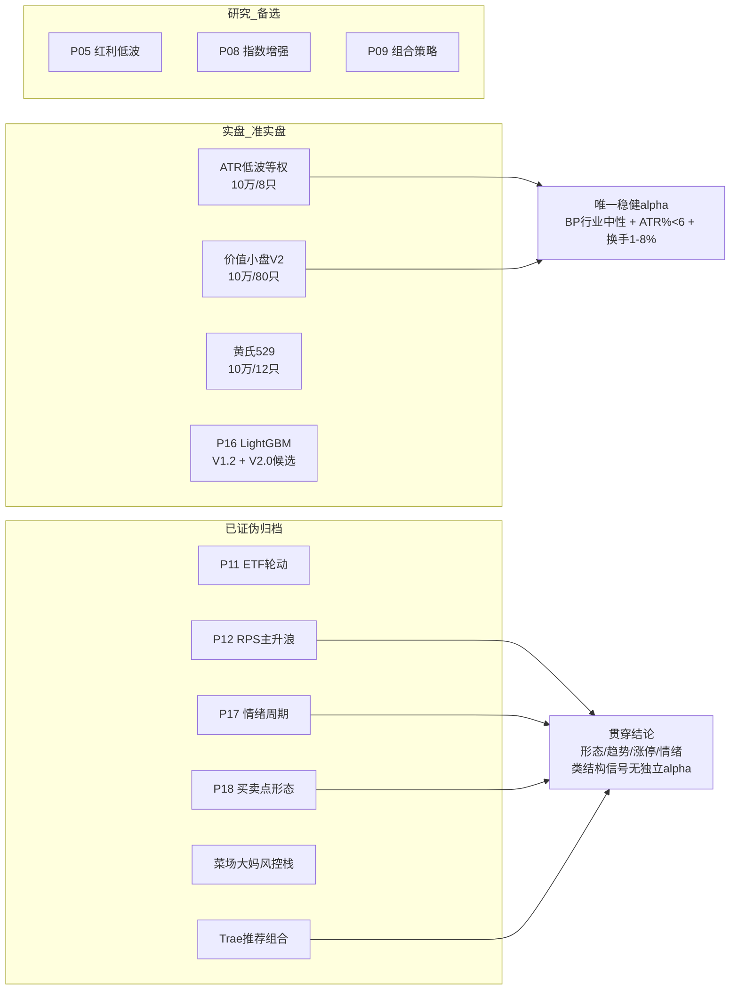

# 主要策略详解

<cite>
**本文档引用的文件**
- [AGENTS.md](file://AGENTS.md) — 策略项目状态表与全局红线
- [全局控制台.md](file://全局控制台.md) — 唯一任务看板（TODO/DOING/DONE）
- [研究总览与路线图.md](file://研究总览与路线图.md) — 因子 IC 实证汇总与踩坑清单
- [资金分配总表与约束.md](file://资金分配总表与约束.md) — 多策略资金硬规则
- [config/capital_allocation.yaml](file://config/capital_allocation.yaml) — 资金分配机器可校验事实源
- [projects/Project_ATR_lowvol/](file://projects/Project_ATR_lowvol)
- [projects/Project_10_价值小盘V2/](file://projects/Project_10_价值小盘V2)
- [projects/Project_16_LightGBM股票大师/VERSIONS.md](file://projects/Project_16_LightGBM股票大师/VERSIONS.md)
</cite>

## 目录
1. [引言](#引言)
2. [策略项目全景](#策略项目全景)
3. [实盘在跑策略](#实盘在跑策略)
4. [已证伪归档策略](#已证伪归档策略)
5. [研究结论与证伪知识库](#研究结论与证伪知识库)
6. [有效因子与因子健康监控](#有效因子与因子健康监控)
7. [研究方法论](#研究方法论)
8. [章节来源](#章节来源)

## 引言

QuantLab 以 `projects/` 为单元承载 20 条独立策略线，共用数据层、因子库、回测引擎与 QMT 实盘通道。本文档是**策略侧的最新进展快照**，回答三个问题：现在哪些策略在真跑、哪些已经证伪、以及哪些方向不该再投入。

> **接手必读顺序**：`AGENTS.md`（规范）→ `研究总览与路线图.md`（全局）→ `全局控制台.md`（任务看板）→ 本文档（策略现状）→ 目标项目 `PROJECT_MEMORY.md`。

**核心判断（截至 2026-08-28）**：

- 实盘/准实盘共 4 条线：ATR 低波等权、价值小盘 V2、黄氏 529、Project_16 LightGBM。
- 已证伪归档 7 条线，其中 **2026-08 单月证伪 3 条**（P17 情绪周期、P18 买卖点形态、菜场大妈风控栈）。
- 一条贯穿性结论正在被反复印证：**A 股全市场的形态/趋势/涨停/情绪类结构信号均无独立 alpha**。

章节来源
- [AGENTS.md:44-70](file://AGENTS.md#L44-L70)
- [全局控制台.md:60-80](file://全局控制台.md#L60-L80)

## 策略项目全景



| 编号 | 名称 | 年化 | 夏普 | 回撤 | 状态 |
|---|---|---|---|---|---|
| 01 | 多因子IC小盘Alpha | 10.1%（全池真实口径） | 0.41 | -24.4% | 🔴 已审计不建议实盘 |
| 02 | 双均线趋势 | -8.9% | -1.03 | -48.4% | 🔴 失效（已验证） |
| 03 | PEAD盈余漂移 | -7.8% | — | — | 🔴 不推荐 |
| 04 | ML多因子 | -21.4% | — | -65.8% | 🔴 已淘汰 |
| 05 | 红利低波 | 3.7% | — | -11.3% | 🟡 推荐（防御） |
| 06 | 质量小市值 | 4.1% | — | -20.1% | 🟡 可选 |
| 07 | 低换手反转 | -6.9% | — | -39.0% | 🔴 不推荐 |
| 08 | 指数增强 | 0.4% | — | -8.2% | 🟡 防御 |
| 09 | 组合策略 | — | — | — | 🟡 组合（70%红利+30%小盘） |
| 10 | 价值小盘V2 | v2.3口径 18.0%（真实每日风控 **7.5%**） | 0.58 | -29.7% | 🟢 模拟盘运行中 |
| 11 | ETF轮动 | +1.19% | 0.16 | -36.8% | 🔴 已淘汰 |
| 12 | RPS主升浪 | -60.8%（全周期PIT） | -0.47 | -63.5% | 🔴 已证伪归档 |
| 13 | 黄氏529主升浪 | 基线 +26.59%；1/n 修正后近段 7.00% | 0.53 | -32.3% | 🟡 DOING（不配资） |
| 14 | Trae选股驱动 | — | — | — | 🔴 推荐组合已证伪 |
| 16 | LightGBM股票大师 | 前向验证中（N=9，未达 N>30） | — | — | 🟢 双轨运行 V1.2 + V2.0候选 |
| 17 | 情绪周期择时 | — | — | — | 🔴 2026-08-26 证伪归档 |
| 18 | 买卖点信号工具 | — | — | — | 🔴 2026-08-27 证伪结题 |
| ATR | ATR低波动 | 8只+价<50 口径 28.99%（线性） | 0.894 | -24.80% | 🟢 实盘（10万锁定） |

### 资金分配（硬约束）

单一事实源 `config/capital_allocation.yaml`，校验器 `scripts/check_capital_allocation.py`（退出码 0 才许部署）。

| 策略 key | 锁定本金 | 最大持仓 | 账号 |
|---|---:|---:|---|
| `atr_lowvol_equalweight` | 100,000 | 8（2026-08-14 改集中版） | `70180771` |
| `value_smallcap_v2` | 100,000 | 80 | `70180771` |
| `huang529_breakout` | 100,000 | 12 | `70180771` |
| Project_16 LightGBM | 100,472（真实口径） | 2 | `67014907`（miniQMT） |
| **合计（70180771）** | **300,000** | — | ≤ 账户总资产 10,000,000 |

> ⚠️ **双账号并存（2026-08-25 用户确认）**：`67014907` 未停用，miniQMT 跑 Project_16；`70180771` 跑 ATR/V2/P13 等纯 QMT 策略。此前"全策略换号至 70180771"的前提**已被推翻**，引用错号会废单。

章节来源
- [AGENTS.md:44-70](file://AGENTS.md#L44-L70)
- [资金分配总表与约束.md:18-30](file://资金分配总表与约束.md#L18-L30)

## 实盘在跑策略

### ATR 低波等权（`projects/Project_ATR_lowvol/`）

**策略内核**：合格域过滤（ATR%<6 & 换手率 1-8% & 非 ST & 上市≥60日）→ 按 ATR% 最低排序取前 N → 季频等权。

**关键实证**：

| 结论 | 数值 | 状态 |
|---|---|---|
| 8只集中 + 真实价<50 过滤 | 总收益 182.9%→**208.8%**、夏普 0.840→**0.894** | ✅ 免费午餐，已部署 |
| MAX5 彩票效应过滤（max_exclude_pct 0.15-0.20） | CAGR 16.95→**18.40%**、回撤 -24.80→**-20.05%** | ✅ ATR 系列首个全维度正优化 |
| 价格过滤口径 | 真实价 = 复权价 / adj_factor，**不能直接用 hfq 价比** | ⚠️ 易错点 |
| vol_target（无杠杆 8只） | 全档夏普/卡玛均劣于基线 | ❌ 已证伪 |
| MA200 大盘门控 / 动量排序 / 换手缓冲 | 全为负优化 | ❌ 已证伪 |
| 流动性池（≥30亿） | 静态池 45.49% 系幸存者偏差，PIT 逐季截断后仅 16.00% | ❌ 已证伪（alpha 在小微盘） |

**2026-08 工程修复链**（实盘踩坑沉淀，详见实盘交易系统文档）：

1. **T-20260823-001**：换号后零委托根因 = ①盘前空 bar 误判停牌（QMT 09:16 已生成 volume=0 的当日 K 线，`dropna().iloc[-1]` 取昨日值选出票，而停牌检查静默丢弃）→ 改 `_is_suspended_bar()` 末两根连续无量才判停牌；②季度键死守卫（`if selected:` 恒真，失败一次锁死整季）→ 改真实建仓成功才锁键。共 5 项修复，单测 42/42。
2. **T-20260825-001**：买单 pending 超时 30s 即撤单放弃 → 改 300s + 最多重试 3 次（撤单→按最新价重报→更新 pending），约 15 分钟仍不成交才放弃。
3. **T-20260823-004**：持票账本内嵌 `account_id` 戳，加载时不匹配自动备份 `.bak_acct_*` 并空仓起步（fail-safe）。

### 价值小盘 V2（`projects/Project_10_价值小盘V2/`）

行业中性 BP z-score（权重 1.0）+ 质量排雷 + 退市排雷 + buffer160 降换手，30 亿以下小盘等权 80 只，双月调仓。

> ⚠️ **口径警示（2026-08-14 实证）**：宣传的 18.0% 是「双月 open 状态机 + 双月才查风控」口径。**真实每日风控口径约 7.5%**（风控频率 -8.3pp、结算频率 -2.2pp）。实盘预期以 7.5% 为锚。

其他实证：BP 因子 IC=0.069 / ICIR=1.74 / 胜率 81%（强因子）；容量上限约 1000-2000 万（5000 万收益减半）；MA200 门控回撤 -29.7%→-15.8%（代价年化 -4.4pp）。

### 黄氏 529 主升浪（`projects/Project_13_529主升浪/`）

529 信号池内做 ATR 低波排序 + 风控。持有期 60 天不可动摇（20 天=灾难 -16.8%），止损 -8→-12% 正优化。

> ⚠️ **审计勘误**：早期"n16 +82%"是线性年化虚高，真实 CAGR 仅 8.69%；按 `max_single_pct=1/n` 修正复跑后 2023-2026 段全部转正（1.49%~7.00%，最佳 n12=7.00%），但**最佳卡玛 0.37 远逊同期 ATR 基线 1.56** → 判定 R3：维持 DOING + 信号衰减监控，暂不分配资金。

### Project_16 LightGBM 股票大师（`projects/Project_16_LightGBM股票大师/`）

双轨选股：LightGBM 概率 × 0.6 + F1-F6 评分卡 × 0.4，TOP2 等权，止损 -7% / 止盈 +15%。

| 版本 | 上线日期 | 模型 | 面板 | 状态 |
|---|---|---|---|---|
| V1.0 | 2026-08-21 | lgb_model_v3（8/19） | 8/14 冻结 | 已归档 |
| V1.1 | 2026-08-25 | 8/19 参数复现（3676树） | 8/14 | 运行中 |
| **V1.2** | **2026-08-28** | 重训版（2837树） | **8/27 重建** | ✅ 已上线 |
| V2.0-候选 | 待定 | v3.4_N3（813树） | v3_enh 33特征 | ⏳ 前向验证中 |

**2026-08-25~28 关键进展**：

- **g2 实时化**：新增 `g2_realtime.py`，10 个新因子中 9 个实现当日实时化（F2 新浪资金流 + F5 自算板块 + 龙虎榜 + 研报），北向因 2024-08 起改为季频披露**客观上无法当日化**。
- **量纲 bug**：评分卡 F2 阈值单位是元，原代码把快照 `mf_main_net`（万元）直接传入 → F2 恒 2-6 分。已改评分卡用 `main_net_yuan`。
- **面板停更修复**：`feature_panel_v3.parquet` 停在 8/14（周更只跑 v2，v3 靠手工切片命令）→ 新增 `refresh_panel_v3.py` 并固化到调度，面板重建至 8/27。
- **V1.2 promote**：消除"正式模型训练于 8/14 旧面板、生产喂 8/27 新面板"的分布不一致，新候选 test IC 0.0394 > 正式 0.0380。
- **资金池硬校验**：下单前逐笔校验单笔 ≤ 资金池×95%÷N、累计 ≤ 资金池×95%，超限拒绝并 `POOL_BLOCK` 报警。
- **独立审计（T-20260828-006）**：11 项声称全部属实；发现 2×P1（共享数据层 `data/astock_reader.py` 被未登记 diff 静默改造、P16 账本无 account_id 戳），均已于 T-20260828-008 修复。

> 🔍 **观察**：全账户已实现 467,996 元 vs 策略真实口径 599 元——**99.87% 的利润来自 8/24 超买单票的运气**，策略真实 alpha 仍无证据。前向验证 N>30 是唯一裁判。

**2026-09-13 三策略自我迭代机制讨论**（TRAE+DE 两方独立分析，待拍板）：
- **当前形态**：G2 桥（70180771/N15-live_trail/红线60/TOP2，live 回退 08-25 版）、V1.3（67014907/27特征，09-07 版在跑待决策）、融合桥 ENS（70180771/rank融合 w=0.5，09-11 首日建仓）。
- **闭环现状**：「防退化」闭环（模型层双门禁 strict + 策略层比钱门禁 + 观察期回滚 + 纸面前向三臂）已达工程可用；「提升环」靠人——门禁全为"不劣于"（≥live-0.02pp），缺显著更优即切换的进取机制。
- **分层提案 12 条**：模型层（显著优先进阶 promote/回滚条件自动化）、特征层（特征级 IC 周报/enh 新鲜度硬门禁/新特征沙箱）、策略层（配置漂移复查/纸面自动降级闸/纸面优先制度）、组合层（ENS 资金池滚动/G2 反向互斥/三臂季评）、工程层（心跳告警验证/告警统一出口/调度巡检）。**已落地 9 条（2026-09-13，T-20260913-001 全部执行）**：①ENS 资金池滚动（reconcile_ens.py `_roll_ens_capital`，实测 100000→98469.21）；②**纸面自动降级闸**（`paper_forward_downgrade.py`：三臂 rank<=2 超额，触发 n≥30 且均值<0 且<-0.0002；`--check/--unfreeze/--force-freeze`；三个 rebalance 冻结只卖不买，卖出与桥内风控保留；挂 16:45 管道步骤6；单测 8/8 + G2 冻结 dry-run 实证）；③G2 反向互斥对称化（g2_config.ENS_HOLD_DATES_FILE + rebalance_g2 跳过 ENS 账本）；④特征级 IC/覆盖率周报（`feature_health_weekly.py` 挂 retrain 前置；首跑发现 fin_ocf_to_profit 缺失率 13.34% WATCH）；⑤enh 面板新鲜度硬门禁（`check_enh_freshness.py` >7 天阻断 G2 重训）；⑥观察期回滚条件自动化（`rollback_check_g2.py --auto` 深度劣化>0.05pp 自动回退+飞书，单测 9/9）；⑦E6 双调度器一致性巡检（nightly_check 读 `data/tw_schedule_snapshot.json`，TW 侧 eda9b0c3 成本锚仍 Paused 待删已监控）；⑧配置漂移复查（`config_drift_recheck.py` promote 后 N 邻域 3 点重扫，只登记不改实盘）；⑨纸面优先制度固化（repowiki 方法论第七节）。设计文档 `data/纸面自动降级闸_设计_20260913.md`。
- **已核实 P0**：ENS 资金池无滚动（停在 09-10 初始 10 万）→ **2026-09-13 已修复**：`reconcile_ens.py` 补 `_roll_ens_capital`（对齐 G2 `_roll_g2_capital`，初始+全历史 fills FIFO 已实现盈亏+最新 positions_cfg 浮盈，account_id 戳原子写；单测 5/5 PASS；端到端实测 100000→98469.21；TW 对账任务 18c0c8d2 自动生效）；心跳告警任务已注册（09-12 补，待 09-14 盘中真实验证）。
- **红线**：模型层与策略层分工不混（重训不找 alpha）；唯一裁判=样本外纸面前向（回测年化不作 KPI）；按策略隔离评估；先刹车（降级闸）再加速（提升环）。
- 详见 `data/三策略自我迭代_讨论纪要_20260913.md` + DE 稿 `data/de_self_iteration_discuss_20260913.md`。

章节来源
- [研究总览与路线图.md:14-22](file://研究总览与路线图.md#L14-L22)
- [全局控制台.md:230-320](file://全局控制台.md#L230-L320)
- [projects/Project_16_LightGBM股票大师/VERSIONS.md:16-25](file://projects/Project_16_LightGBM股票大师/VERSIONS.md#L16-L25)

## 已证伪归档策略

| 策略线 | 证伪日期 | 核心结论 | 可复用资产 |
|---|---|---|---|
| **P11 ETF轮动** | 2026-08-09 | 7.6 年实证跑输基准（仅 2020/2025 盈利）；趋势+动量双腿同族，无绝对动量过滤为致命伤 | ETF 数据管道（`astock etf_xtdata`） |
| **P12 RPS主升浪** | 2026-08-14 | 全周期 PIT -60.8%；候选池枯竭（0.2只/天）→ 持仓集中 → 单票运气（2020 的 +95% 实为满仓押中 002626） | `strategy/sector_rps.py` 板块 RPS 信号、大盘门控、`candidate_passed_avg_per_day` 必检指标 |
| **菜场大妈六步选股** | 2026-08-23 | 流动性主证伪：max_adv_pct 1%/5%/10% 三档，3840 笔买入尝试 100% 被拒、CAGR 全归零——**可捕获收益=精确的 0** | 逐级归因消融方法（A0→A4） |
| **P17 情绪周期择时** | 2026-08-26 | 四轮检验全谱收口；连续情绪分对未来收益 IC **全为正 = 动量延续**，与养家「高潮回落」反转型假设**方向相悖** | `results/sentiment_series.csv` 日频情绪序列 + `research/build_sentiment.py` |
| **P18 买卖点形态** | 2026-08-27 | 4 类买点命中率 43-47%（<50%）且中位数为负；样本外 2015-2018 全转负；增强版 16 组合样本外**全部**为负 | 4 模块 PIT 信号扫描器 `research/buypoint_signals.py` |
| **Trae 主升浪** | 2026-08-19 | 组合2「实盘首选」证伪（pitfix 后 Calmar 0.75）；组合 1 唯一保留（ex-2026 CAGR 15.21% / Calmar 1.02） | PIT 修复审计链（首轮→复测→复核终裁） |
| **MCRPS 复合RPS** | 2026-08-14 | 5 场景仅牛市有效（2014-15 +115%）；RPS 加速度因子独立 IC -0.0154 | `factors/rps_acceleration.py`（方法参考） |

### P17 情绪周期：四轮检验收口

```
Phase 0   情绪温度计有效性    → 阶段哑变量 IC≈0，冰点vs高潮 fwd20 差 0.11pp（p=0.87）  ❌
V2-A     涨停股 fwd20 分层    → 剔一字板后 -4.79%（t=-7.61，显著反向）                  ❌
V2-B     顺势覆盖层           → 恒定30%仓对照组全面碾压覆盖层，弱阳性系现金拖累假象       ❌
V3       连板结构检验         → M1′ 剔一字板后 -2.32%（p=1.0，显著反向）                 ❌
```

**贯穿机理**：名义正超额 100% 由**买不到的一字板**（T+1 开盘缺口≥9.5%）贡献，可执行口径立转负。

### P18 买卖点形态：增强版救不活裸信号

| 区间 | 裸信号 | +大盘门控 | +板块过滤 | 结论 |
|---|---|---|---|---|
| 2019-2025 | 命中率 43.1%~46.7%、中位 -0.71%~-1.98% | 杯柄 46.7→48.3%（轻微改善） | 趋势低吸均值 +0.16→+0.52% | 命中率仍 ≤48.3%，中位为负 |
| **2015-2018（样本外）** | 全转负 | **16 组合全部均值/中位为负** | 同左 | ❌ 证伪 |

> **机理**：门控/板块在 P10/P13 对「本身有 alpha」的策略有效，但对「本身无 alpha」的形态买点只压缩交易时段、不创造单信号 edge。

章节来源
- [研究总览与路线图.md:16-22](file://研究总览与路线图.md#L16-L22)
- [全局控制台.md:280-330](file://全局控制台.md#L280-L330)

## 研究结论与证伪知识库

> **这是本仓库最贵的资产**。以下结论均已跑过并归档，**无论谁接手都不需要重跑**。新方向立项前必须先查本节，避免重复投入。

### 因子 IC 实证汇总（2021-2026，中证500+1000，100期月频）

| 因子 | 类别 | IC均值 | ICIR | IC>0占比 | 方向 |
|---|---|---|---|---|---|
| BP | 价值 | +0.067 | **0.448** | 63% | ✅ 正（低PB=好） |
| dividend_yield | 价值 | +0.019 | 0.199 | 60% | 正（弱） |
| EP | 价值 | +0.024 | 0.192 | 59% | 正（弱） |
| ROE | 质量 | -0.016 | -0.123 | 45% | ❌ **负贡献** |
| turnover_change | 情绪 | -0.041 | -0.385 | 32% | ❌ 负 |
| momentum_6m | 动量 | -0.059 | -0.421 | 37% | ❌ 负 |
| volatility_60d | 情绪 | -0.091 | **-0.524** | 28% | ✅ 负=低波好 |
| momentum_1m | 动量 | -0.073 | **-0.561** | 32% | ✅ 负=反转好 |
| momentum_3m | 动量 | -0.073 | **-0.567** | 26% | ✅ 负=反转好 |
| liquidity_avg | 情绪 | -0.110 | **-0.687** | 23% | ✅ 负=低流动性好 |

**权重优化最优 ICIR=0.74**：BP 15% + 反转 55% + 低波 25% + ROE 5%（ROE 最优权重→0）。

### harness 462 因子 × 3 universe 科学证伪

| Universe | 全期有效(\|ICIR\|>0.5) | 训练集(2021-23)有效 | 样本外回测(2024-26) | 结论 |
|---|---|---|---|---|
| 大盘 top1500 | 9 | **0** | 牛市过拟合 | 全期=2024-26 牛市假象 |
| 中盘 rank300-1500 | 8 | **0** | 牛市过拟合 | 同上 |
| 小盘 rank1500-3000 | 43 | **11** | **-24.54%** | 训练集非过拟合但样本外失效 |

**基本面 6 因子**（EP/BP/SP/DP/低换手/小市值）：全期+训练集都 ICIR<0.5（low_turnover 最强 0.39）——**本身弱，不是过拟合但无效**。

### 有效因子库（5 年 spread 验证）

| 因子 | 5年spread | 排名 | 适用类型 |
|---|---|---|---|
| **ATR%<6** | **+0.313%** | 1 | 过滤型（低波策略） |
| **换手率 1-8%** | +0.158% | 2 | 过滤型 |
| 29 个技术因子 | 全中性或负 | — | 无效 |

### 七条关键教训（必读）

1. **全期 IC 筛选 = 牛市过拟合**：大盘/中盘全期 9/8 有效，训练集 0 有效 → 必须训练集筛 + 样本外验证。
2. **IC 有效 ≠ 回测有效**：小盘训练集 11 有效，样本外 -24.54%（IC 是截面预测，回测含组合+成本+风控+换手）。
3. **加因子 ≠ 加收益**：P01 实测 4 因子 10.7% → 低波主导 11.8% → 全因子等权 11.5%，加因子没超过基线。
4. **ROE/反转/低波 = 负贡献**（全池口径）：反转 -9.0%/年、ROE -11.1%/年、低波 -0.7%/年。
5. **BP 是唯一稳健 alpha**：全池 +6.1%/年（raw）/ +8.6%/年（行业中性化），2024+ 仍正但 2026 转负。
6. **GTJA191 / Alpha101 / Qlib158 已证伪**（训练集 0 有效），新因子立项前先查本节。
7. **形态/趋势/涨停/情绪类结构信号在 A 股全市场均无独立 alpha**（P12/P17/P18/P16 四线互证）——不要再投入"形态信号转策略"。

### 外部公开策略分诊

2026-08-19 首轮分诊 6 篇知乎高相关文章，**无一是真 alpha**：

- ETF 轮动 30.47% = beta + 窗口选择（基准创业50 自涨 17.68%/年 + 2020 起点即成长牛 + 趋势动量同族已被 P11 证伪）。
- RL 轮动 30.75% **输给等权躺平 32.49%**（唯一遗产："少动比多动赚钱"，与 ATR 低波 / buffer160 互证）。
- "负 PE 陷阱/行业偏斜"等待检查项经代码核实**本仓全已规避**（P01 `scoring.py:113` base_mask、P10 行业中性 BP + `pe>0` 掩码）。

> **流程纪律**：外部资料一律先过 `外部策略资料审计清单.md` 五问分诊再立项；深度复现走 `Project_16_公开策略审计/`。

章节来源
- [研究总览与路线图.md:28-135](file://研究总览与路线图.md#L28-L135)

## 有效因子与因子健康监控

`research_audit/factor_health.py` 按月频调仓期 Spearman IC + 分段（全期 / 2024+ / 2026 / 近8期）+ 衰减告警（FAILED / DEGRADED / WATCH / HEALTHY）。每周五 19:30 计划任务 `QuantLab_FactorHealth_Monitor` 自动跑，产物 `research_audit/factor_health_报告.md` + `factor_health_ic.csv`。

**首期结论（2018~2026-06，100 期）**：

| 因子 | 状态 | 全期IC | 2024+ | 2026 | 近8期 | 判定 |
|---|---|---|---|---|---|---|
| **BP 行业中性 z** | 🟢 HEALTHY | +0.089 | +0.097 | +0.100 | **+0.130 走强** | 唯一健康因子，正值占比 88% |
| BP 历史分位 | 🟡 WATCH | 0.099 | — | — | 0.057 | 维持低权重正确 |
| ROE | 🔴 FAILED | -0.028 | — | — | -0.069 | 只能作排雷 filter |
| 波动率 60d | 🔴 FAILED | -0.086 | — | — | — | 只能作排雷 filter |
| 动量 1m | 🟡 WATCH | -0.049 | — | 回正 | 弱 | 不得当排序正贡献因子 |
| VWAP 量价 | 🟡 WATCH | — | — | -0.015 | — | 印证 P01 审计 |

> **立项门槛**：新策略上线前必须跑一遍因子健康监控，衰减因子（FAILED）禁止进排序权重。

## 研究方法论

### 预注册（Pre-registration）纪律

所有新方向在跑之前**冻结判据**，跑完零改判。这是 2026-08 月 P17/P18/菜场大妈三条线能干净证伪的关键。

```
任务书（specs/） → 冻结判据与门槛 → 执行 → 按判据裁决 → 归档结题
                        ↑
                  中途禁止修改
```

### 逐级归因消融（A0→A4）

菜场大妈审计沉淀的标准方法，用于定位"高收益"的真实来源：

| 层级 | 口径 | 作用 |
|---|---|---|
| A0 | 模拟器复现（幸存者池 + 前视财务 + 零成本 + 涨停可买） | 复刻原声称 |
| A1 | 全池 | 量化幸存者偏差 |
| A2 | 财务 PIT | 量化前视偏差 |
| A3 | 涨跌停/停牌 | 量化可交易性 |
| A4 | 引擎全设施裁决（next_open + 成本） | 干净口径终裁 |

**实测**：A0=+53.03% → A1=+53.09%（幸存者偏差可忽略）→ A2=+47.64%（**财务前视 -5.45pp 为最大虚高源**）→ A3=+45.66% → A4=+37.73%。

### 交叉验证与反事实

- **gpsj 交叉验证**：P18 用 gpsj 数据源对拍 astock，2020 单年 600 只信号数/统计量完全一致（85=85），证明非数据口径假象。
- **look-ahead 检测**：盘中 vs 尾盘对照，差异 >30pp 且方向反转 → look-ahead 风险（击中 4 次）。
- **恒定仓位对照**：P17 方向 B 的形式弱阳性被"恒定 30% 仓"对照组揭穿（CAGR +0.98% / MDD -13.31% 全面碾压覆盖层 -0.02% / -31.65%）。
- **反事实卖出规则**：P13 用同法校准卖出规则（±0.02pp 精度），验证 trail15 是唯一正优化。

### 已知数据陷阱（涉及共享数据层）

> ⚠️ **`data/gpsj_reader.py` 的 `is_st` 语义与 astock/tushare 相反**（2026-08-27 发现）：astock `is_st`=1 是 ST，而 gpsj `"ST"` 列 **0=该股是 ST、1=正常**，`_COL_MAP` 直接透传未反转 → 凡用 gpsj_reader 的 is_st 做 ST 过滤，结果**反转**（正常股被当 ST 剔、ST 股被放行）。
> 排查办法：600 只面板 is_st 分布与 astock 几乎镜像。**状态：待修（T-20260827-003，P1）**，涉及共享数据层，改动前先清存量用法。

章节来源
- [研究总览与路线图.md:126-135](file://研究总览与路线图.md#L126-L135)
- [研究总览与路线图.md:195-205](file://研究总览与路线图.md#L195-L205)
