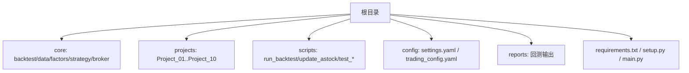
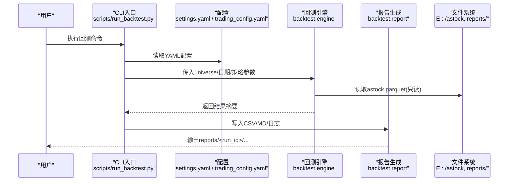
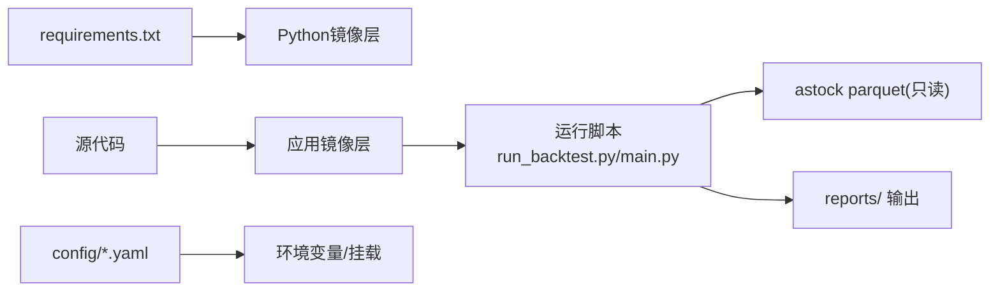

# Docker容器化

<cite>
**本文引用的文件**   
- [requirements.txt](file://requirements.txt)
- [setup.py](file://setup.py)
- [main.py](file://main.py)
- [config/settings.yaml](file://config/settings.yaml)
- [config/trading_config.yaml](file://config/trading_config.yaml)
- [scripts/run_backtest.py](file://scripts/run_backtest.py)
- [backtest/report.py](file://backtest/report.py)
- [backtest/hashing.py](file://backtest/hashing.py)
- [start_trading.bat](file://start_trading.bat)
- [start_trading_qmt.bat](file://start_trading_qmt.bat)
- [test_connection.py](file://test_connection.py)
- [AGENTS.md](file://AGENTS.md)
</cite>

## 目录
1. [简介](#简介)
2. [项目结构](#项目结构)
3. [核心组件](#核心组件)
4. [架构总览](#架构总览)
5. [详细组件分析](#详细组件分析)
6. [依赖与关系分析](#依赖与关系分析)
7. [性能考量](#性能考量)
8. [故障排查指南](#故障排查指南)
9. [结论](#结论)
10. [附录](#附录)

## 简介
本文件面向 QuantLab 的 Docker 容器化实践，提供从镜像构建、依赖管理、应用打包、多阶段构建到运行配置、网络设置与运维调试的全流程指南。内容基于仓库现有代码与配置，确保可落地、可复现，并兼顾回测与实盘（QMT）两种运行模式。

## 项目结构
QuantLab 采用“核心库 + 策略项目 + 脚本工具”的组织方式：
- 核心库：backtest、data、factors、strategy、broker 等模块
- 策略项目：projects/Project_XX_* 独立策略与参数
- 脚本工具：scripts/* 用于回测执行、数据更新、测试连接等
- 配置中心：config/settings.yaml（全局）、config/trading_config.yaml（实盘）

**章节来源**
- [main.py:1-104](file://main.py#L1-L104)
- [config/settings.yaml:1-69](file://config/settings.yaml#L1-L69)
- [config/trading_config.yaml:1-62](file://config/trading_config.yaml#L1-L62)

## 核心组件
- 入口与回测主流程
  - main.py：加载全局配置，选择策略分支，驱动回测或兼容旧版流程
  - scripts/run_backtest.py：标准化 CLI 入口，读取 YAML 配置，调用引擎并生成报告
- 配置系统
  - config/settings.yaml：项目信息、数据源、回测参数、因子预处理、日志
  - config/trading_config.yaml：账号、交易参数、风控阈值、委托与调度、通知
- 报告与哈希
  - backtest/report.py：汇总指标、日志摘录、复现命令写入 Markdown
  - backtest/hashing.py：配置、数据集、股票池哈希，保障结果可追溯

**章节来源**
- [main.py:21-92](file://main.py#L21-L92)
- [scripts/run_backtest.py:42-127](file://scripts/run_backtest.py#L42-L127)
- [backtest/report.py:111-233](file://backtest/report.py#L111-L233)
- [backtest/hashing.py:1-23](file://backtest/hashing.py#L1-L23)

## 架构总览
下图展示回测与实盘的典型运行路径，以及关键配置文件与产物位置。

**图表来源**
- [scripts/run_backtest.py:42-127](file://scripts/run_backtest.py#L42-L127)
- [backtest/report.py:111-233](file://backtest/report.py#L111-L233)
- [config/settings.yaml:10-35](file://config/settings.yaml#L10-L35)

## 详细组件分析

### Dockerfile 编写指南（基础镜像、依赖、缓存、多阶段）
- 基础镜像选择
  - Python 版本：建议使用与本地一致的 Python 版本（如 3.10），以匹配 QMT 内置 Python 3.6.8 的差异场景；若仅回测，可使用较新 Python 以获得更好性能
  - 系统依赖：如需编译扩展（如某些科学计算包），需选用带编译工具的镜像（如 python:3.10-slim-bullseye）
- 依赖安装优化
  - 使用 requirements.txt 分层安装，先安装系统级依赖，再安装 Python 依赖，最大化利用 Docker 层缓存
  - 将 requirements.txt 单独 COPY 并先 pip install，再 COPY 源码，避免每次源码变更导致全量重建
- 应用代码打包
  - 最小化镜像：仅复制必要目录（core、scripts、config、部分 projects），排除 .git、测试与临时文件
  - 编码与平台差异：Windows 路径与编码在 Linux 容器中需注意，建议统一使用相对路径与环境变量
- 多阶段构建
  - 构建阶段：安装编译依赖与构建工具
  - 运行阶段：仅包含运行时依赖与二进制产物，显著减小镜像体积
- 安全扫描
  - 在 CI 中集成 Trivy/Snyk 扫描镜像漏洞，阻断高危漏洞发布

[本节为通用最佳实践说明，不直接分析具体文件]

### 镜像构建流程与优化（分层、大小控制、安全）
- 分层构建优化
  - 将频繁变动的层（源码）放在后部，固定层（依赖）放在前部
  - 使用 .dockerignore 排除无关文件
- 镜像大小控制
  - 使用 slim/alpine 变体，清理 apt/pip 缓存
  - 合并 RUN 指令减少层数
- 安全扫描
  - 基镜像定期更新，启用非 root 用户运行
  - 限制镜像暴露端口，按需开启网络能力

[本节为通用最佳实践说明，不直接分析具体文件]

### 容器环境配置（环境变量、挂载、持久化）
- 环境变量管理
  - 通过环境变量注入敏感信息与路径（如 ASTOCK_PATH、LOG_DIR、CONFIG_PATH）
  - 在脚本中使用 os.environ 读取，避免硬编码路径
- 配置文件挂载
  - 将 config/settings.yaml 与 config/trading_config.yaml 以只读方式挂载，便于不同环境切换
- 数据卷持久化
  - 将 reports、logs、data/cache 等目录映射到宿主机，保证重启不丢失
  - astock 数据目录以只读方式挂载，防止误写

**章节来源**
- [config/settings.yaml:10-35](file://config/settings.yaml#L10-L35)
- [config/trading_config.yaml:42-46](file://config/trading_config.yaml#L42-L46)
- [scripts/run_backtest.py:93-121](file://scripts/run_backtest.py#L93-L121)

### 容器运行与调试（启动、端口、日志、监控）
- 启动命令
  - 回测：python -m scripts.run_backtest --config config/atr_lowvol_fw.yaml
  - 实盘：参考 start_trading.bat / start_trading_qmt.bat 的启动逻辑，在容器内等效执行 live_trading.py
- 端口映射
  - 若服务对外暴露 HTTP/API，使用 -p 映射端口；否则无需开放
- 日志查看
  - 将 logs 目录挂载到宿主机，或使用 docker logs 查看标准输出
- 性能监控
  - 结合 cgroups/prometheus 监控 CPU/内存，关注 I/O 瓶颈（parquet 读取）

**章节来源**
- [scripts/run_backtest.py:42-127](file://scripts/run_backtest.py#L42-L127)
- [start_trading.bat:1-51](file://start_trading.bat#L1-L51)
- [start_trading_qmt.bat:1-66](file://start_trading_qmt.bat#L1-L66)

### 容器网络配置（服务通信、外部数据库、QMT接口）
- 服务间通信
  - 使用 Docker Compose 定义 service，通过服务名互通
- 外部数据库
  - 通过环境变量注入 DB_HOST/PORT，容器内访问外网数据库
- QMT 接口访问
  - QMT 为本地进程通信（共享内存/命名管道），容器化需特殊处理（如 host 网络模式或进程直通）
  - 建议在 Windows 宿主上运行 QMT，容器通过 API 或文件交换与 QMT 交互

[本节为通用网络方案说明，不直接分析具体文件]

## 依赖与关系分析
- Python 依赖
  - requirements.txt 定义了核心库与可选依赖（ML、可视化、数据源、QMT）
- 构建与部署
  - setup.py 用于本地一键配置（含 xtquant 拷贝与目录创建），容器化时应替换为镜像内安装
- 运行入口
  - main.py 与 scripts/run_backtest.py 分别承担回测入口与标准化 CLI
- 配置与报告
  - settings.yaml/trading_config.yaml 决定行为；report.py 输出可复现实验报告

**图表来源**
- [requirements.txt:1-29](file://requirements.txt#L1-L29)
- [setup.py:1-82](file://setup.py#L1-L82)
- [scripts/run_backtest.py:42-127](file://scripts/run_backtest.py#L42-L127)
- [backtest/report.py:111-233](file://backtest/report.py#L111-L233)

**章节来源**
- [requirements.txt:1-29](file://requirements.txt#L1-L29)
- [setup.py:1-82](file://setup.py#L1-L82)
- [main.py:21-92](file://main.py#L21-L92)
- [scripts/run_backtest.py:42-127](file://scripts/run_backtest.py#L42-L127)

## 性能考量
- I/O 优化
  - astock parquet 大文件读取是主要瓶颈，建议使用 SSD 与只读挂载
  - 合理设置并行度与内存限制，避免 OOM
- 计算优化
  - 科学计算库（numpy/pandas/scipy/lightgbm）在 CPU 密集型任务中占主导，优先选择单核性能强的实例
- 缓存策略
  - 使用 data/cache 目录缓存中间结果，缩短重复运行时间
- 资源隔离
  - 使用 cgroup 限制 CPU/内存，避免影响宿主其他服务

[本节为通用性能建议，不直接分析具体文件]

## 故障排查指南
- 常见错误定位
  - 连接失败：检查 QMT 是否启动、路径是否正确、账号是否登录
  - 配置缺失：确认 config/trading_config.yaml 存在且路径正确
  - 依赖缺失：确认 xtquant 已安装（容器内需预装或外挂）
- 诊断步骤
  - 使用 test_connection.py 验证 QMT 连通性
  - 查看 logs 目录与标准输出，定位异常堆栈
  - 核对 astock 数据路径与权限（只读）
- 回测复现
  - 使用 report.md 中的复现命令与哈希值，确保一致的环境与数据

**章节来源**
- [test_connection.py:1-117](file://test_connection.py#L1-L117)
- [backtest/report.py:199-233](file://backtest/report.py#L199-L233)
- [AGENTS.md:90-109](file://AGENTS.md#L90-L109)

## 结论
通过合理的 Dockerfile 设计、分层构建与依赖管理，结合环境变量与数据卷挂载，QuantLab 可在容器环境中稳定运行回测与实盘任务。针对 QMT 的特殊性，建议采用宿主直连或文件交换模式，确保低延迟与高可靠性。配合完善的日志与报告机制，可实现可复现、可审计的量化研究与生产部署。

## 附录
- 快速启动命令示例
  - 回测：python -m scripts.run_backtest --config config/atr_lowvol_fw.yaml
  - 连接测试：python test_connection.py
- 常用路径约定
  - 数据：E:/astock（只读）
  - 日志：logs/
  - 报告：reports/<run_id>/
  - 配置：config/settings.yaml、config/trading_config.yaml

[本节为通用操作指引，不直接分析具体文件]