# Kubernetes部署

<cite>
**本文引用的文件**   
- [config/settings.yaml](file://config/settings.yaml)
- [config/trading_config.yaml](file://config/trading_config.yaml)
- [miniQMT实盘对接_生产级完善方案.md](file://miniQMT实盘对接_生产级完善方案.md)
- [IC策略_QMT部署说明.md](file://projects/Project_01_多因子IC小盘Alpha/specs/IC策略_QMT部署说明.md)
- [start_trading.bat](file://start_trading.bat)
</cite>

## 目录
1. [简介](#简介)
2. [项目结构](#项目结构)
3. [核心组件](#核心组件)
4. [架构总览](#架构总览)
5. [详细组件分析](#详细组件分析)
6. [依赖分析](#依赖分析)
7. [性能考虑](#性能考虑)
8. [故障排查指南](#故障排查指南)
9. [结论](#结论)
10. [附录](#附录)

## 简介
本文件面向在 Kubernetes 上部署 QuantLab 量化交易系统的工程与运维人员，提供从资源定义、Pod 编排、存储持久化、网络与服务发现，到监控日志、扩缩容与高可用的完整实践指南。由于仓库未包含现成的 Kubernetes YAML，本文基于现有配置与文档进行“可落地的设计蓝图”，并给出可直接用于生产的最佳实践建议与检查清单。

## 项目结构
QuantLab 当前仓库以 Python 代码与配置文件为主，Kubernetes 部署相关资源尚未纳入版本库。因此，本节聚焦于如何把现有配置映射到 K8s 资源对象，以及需要新增的清单文件组织方式。

- 应用入口与运行脚本
  - Windows 批处理启动脚本：[start_trading.bat](file://start_trading.bat)
  - 该脚本负责环境检查、日志目录创建、配置文件校验与进程启动，可作为容器镜像内 CMD/ENTRYPOINT 的设计参考。

- 全局与交易配置
  - 全局设置：[config/settings.yaml](file://config/settings.yaml)（数据路径、回测参数、日志、因子与策略等）
  - 实盘交易配置：[config/trading_config.yaml](file://config/trading_config.yaml)（账户、风控、下单、调度、通知、数据源与策略参数）

- QMT 集成与部署说明
  - miniQMT 生产级方案与回调、重连、状态持久化等关键实现细节见：[miniQMT实盘对接_生产级完善方案.md](file://miniQMT实盘对接_生产级完善方案.md)
  - 多因子 IC 策略的 QMT 部署流程与参数见：[IC策略_QMT部署说明.md](file://projects/Project_01_多因子IC小盘Alpha/specs/IC策略_QMT部署说明.md)

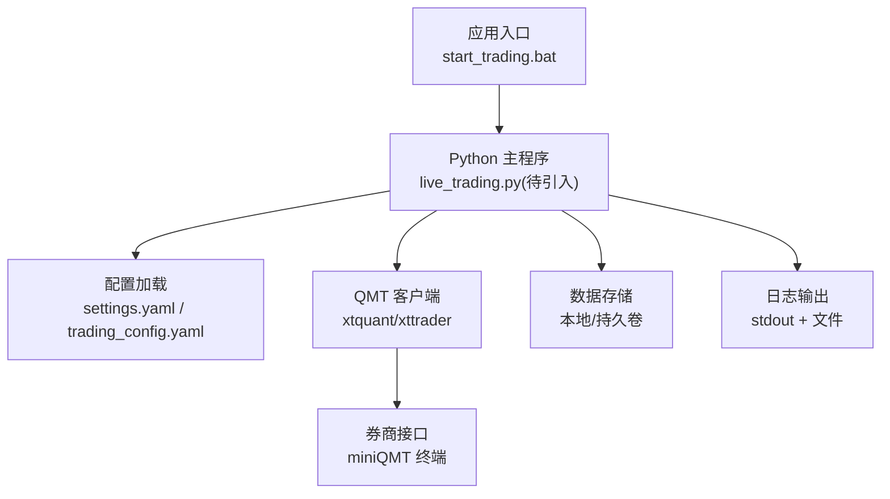

**图表来源** 
- [start_trading.bat:1-51](file://start_trading.bat#L1-L51)
- [config/settings.yaml:1-69](file://config/settings.yaml#L1-L69)
- [config/trading_config.yaml:1-62](file://config/trading_config.yaml#L1-L62)
- [miniQMT实盘对接_生产级完善方案.md:1-800](file://miniQMT实盘对接_生产级完善方案.md#L1-L800)

**章节来源**
- [start_trading.bat:1-51](file://start_trading.bat#L1-L51)
- [config/settings.yaml:1-69](file://config/settings.yaml#L1-L69)
- [config/trading_config.yaml:1-62](file://config/trading_config.yaml#L1-L62)
- [miniQMT实盘对接_生产级完善方案.md:1-800](file://miniQMT实盘对接_生产级完善方案.md#L1-L800)
- [IC策略_QMT部署说明.md:1-69](file://projects/Project_01_多因子IC小盘Alpha/specs/IC策略_QMT部署说明.md#L1-L69)

## 核心组件
- 配置中心
  - settings.yaml：项目信息、数据源、缓存、回测、日志、因子与策略默认值等。
  - trading_config.yaml：账号、资金与风控、委托超时与重试、调度时间片、通知渠道、数据路径与策略权重等。

- 交易执行引擎
  - 通过 xtquant/xttrader 与 miniQMT 交互，具备回调、断线重连、委托监控、持仓对账、状态持久化与通知能力。详见生产级方案文档。

- 外部依赖
  - miniQMT 终端（Windows 环境），作为券商 API 的本地网关；容器化时需确保网络可达或采用桥接方案。

**章节来源**
- [config/settings.yaml:1-69](file://config/settings.yaml#L1-L69)
- [config/trading_config.yaml:1-62](file://config/trading_config.yaml#L1-L62)
- [miniQMT实盘对接_生产级完善方案.md:1-800](file://miniQMT实盘对接_生产级完善方案.md#L1-L800)

## 架构总览
下图展示将 QuantLab 部署到 Kubernetes 的整体视图：应用 Pod 读取 ConfigMap/Secret，挂载持久卷，通过 Service 暴露指标与日志采集端点，Ingress 暴露管理界面，Prometheus/Grafana/Loki 完成监控与日志聚合。

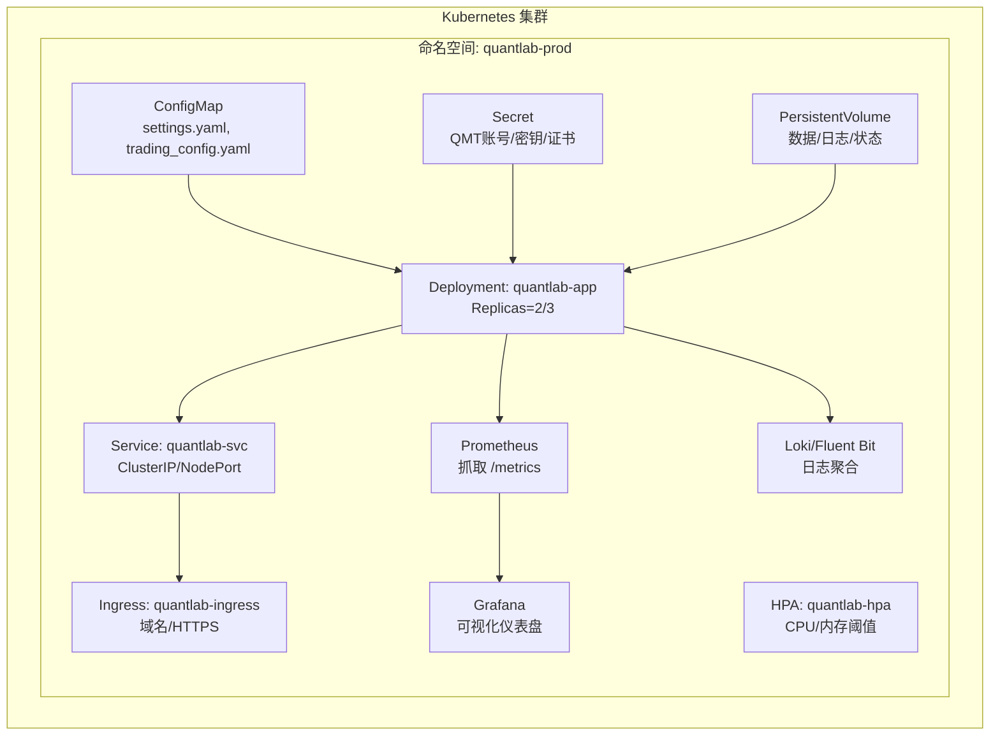

**图表来源** 
- [config/settings.yaml:1-69](file://config/settings.yaml#L1-L69)
- [config/trading_config.yaml:1-62](file://config/trading_config.yaml#L1-L62)
- [miniQMT实盘对接_生产级完善方案.md:1-800](file://miniQMT实盘对接_生产级完善方案.md#L1-L800)

## 详细组件分析

### Deployment 配置（应用工作负载）
- 目标
  - 将 Python 应用打包为镜像，使用 Deployment 管理副本、滚动更新与自愈。
- 关键要点
  - 镜像与标签：固定镜像版本，避免 latest。
  - 副本数：默认 2~3，结合 HPA 弹性伸缩。
  - 资源限制：requests/limits 明确 CPU 与内存，避免被驱逐。
  - 健康检查：livenessProbe 与 readinessProbe 分别探测进程存活与就绪。
  - 环境变量与配置：通过 envFrom 引用 ConfigMap/Secret。
  - 存储挂载：data/logs/state 等目录挂载 PVC。
  - 重启策略：restartPolicy=Always，配合探针控制重启行为。
  - 安全上下文：非 root 用户运行，只读根文件系统（可选）。
  - 亲和性与拓扑：nodeSelector/tolerations/topologySpreadConstraints 保障可用区分布。
  - 滚动更新：maxUnavailable/maxSurge 控制发布节奏。
- 与仓库映射
  - 配置注入：settings.yaml、trading_config.yaml 通过 ConfigMap 挂载或环境变量注入。
  - 敏感信息：QMT 账号、路径、会话 ID 等放入 Secret。
  - 启动命令：参考 start_trading.bat 的检查逻辑，容器 CMD 应直接执行 Python 主程序。

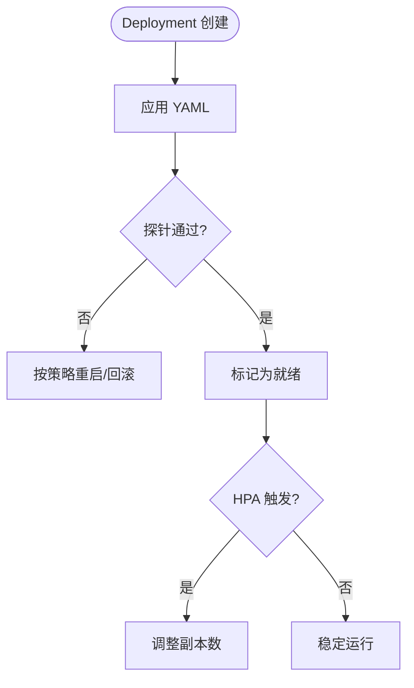

**图表来源** 
- [start_trading.bat:1-51](file://start_trading.bat#L1-L51)
- [config/settings.yaml:1-69](file://config/settings.yaml#L1-L69)
- [config/trading_config.yaml:1-62](file://config/trading_config.yaml#L1-L62)

**章节来源**
- [start_trading.bat:1-51](file://start_trading.bat#L1-L51)
- [config/settings.yaml:1-69](file://config/settings.yaml#L1-L69)
- [config/trading_config.yaml:1-62](file://config/trading_config.yaml#L1-L62)

### Service 暴露（服务发现与访问）
- 类型选择
  - ClusterIP：内部服务通信（如 Prometheus 抓取）。
  - NodePort/LoadBalancer：对外暴露管理面板或指标端口（谨慎暴露）。
  - Ingress：统一 HTTP(S) 入口，支持域名、TLS 与路由规则。
- 与仓库映射
  - 若应用提供 Web UI 或指标接口，可通过 Service 暴露端口，再由 Ingress 统一接入。

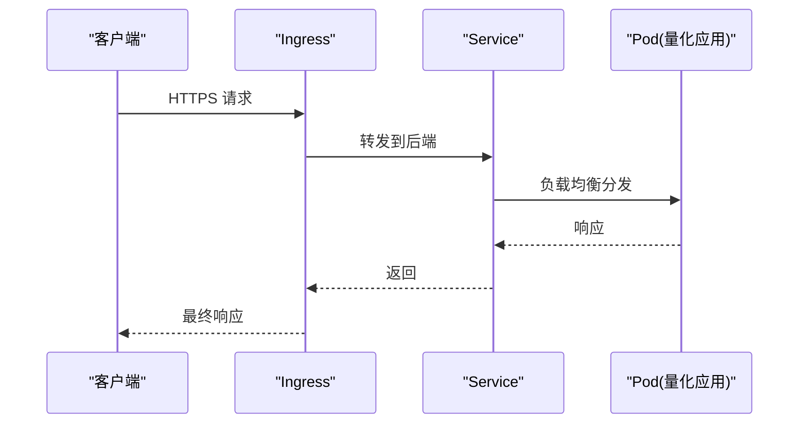

**图表来源** 
- [config/settings.yaml:1-69](file://config/settings.yaml#L1-L69)
- [config/trading_config.yaml:1-62](file://config/trading_config.yaml#L1-L62)

**章节来源**
- [config/settings.yaml:1-69](file://config/settings.yaml#L1-L69)
- [config/trading_config.yaml:1-62](file://config/trading_config.yaml#L1-L62)

### ConfigMap 管理（配置中心）
- 用途
  - 将 settings.yaml、trading_config.yaml 等非敏感配置以 ConfigMap 形式注入。
- 最佳实践
  - 将大段 YAML 拆分为多个键，或在容器内以卷挂载整个文件。
  - 使用 kustomize/helm 管理多环境差异。
  - 热更新：通过 volumeMount 的 subPath 或 sidecar 监听变更并 reload。

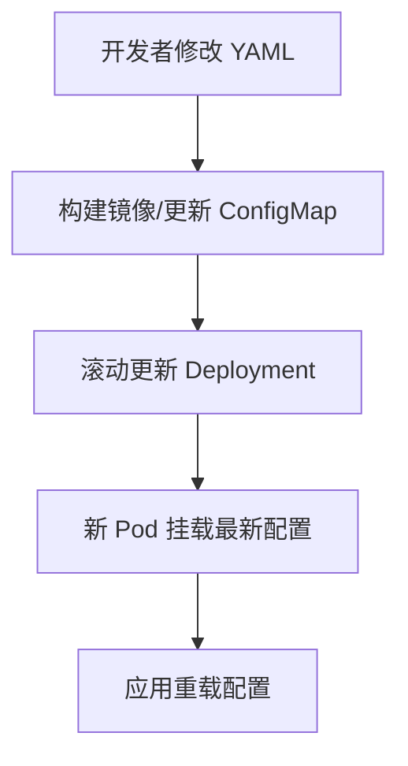

**图表来源** 
- [config/settings.yaml:1-69](file://config/settings.yaml#L1-L69)
- [config/trading_config.yaml:1-62](file://config/trading_config.yaml#L1-L62)

**章节来源**
- [config/settings.yaml:1-69](file://config/settings.yaml#L1-L69)
- [config/trading_config.yaml:1-62](file://config/trading_config.yaml#L1-L62)

### Secret 敏感信息管理
- 内容
  - QMT 账号、会话 ID、路径、Webhook URL、证书等。
- 最佳实践
  - 使用 Kubernetes Secret 或外部密钥管理服务（Vault/KMS）。
  - 最小权限原则，按需注入环境变量或只读卷。
  - 审计与轮换机制。

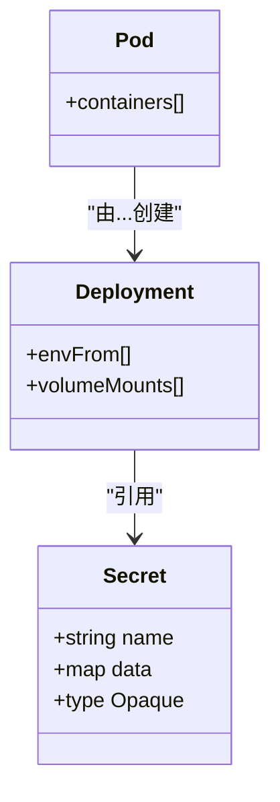

**图表来源** 
- [config/trading_config.yaml:1-62](file://config/trading_config.yaml#L1-L62)

**章节来源**
- [config/trading_config.yaml:1-62](file://config/trading_config.yaml#L1-L62)

### Pod 编排与容器规格
- 容器规格
  - 镜像、端口、环境变量、命令与参数。
- 资源限制
  - requests/limits 合理设置，避免争抢与 OOM。
- 健康检查
  - livenessProbe：失败则重启。
  - readinessProbe：失败则摘除流量。
- 重启策略
  - Always；配合探针与退避策略。
- 与仓库映射
  - 启动流程参考 start_trading.bat 的环境检查与日志目录创建逻辑，容器内应保证相同语义。

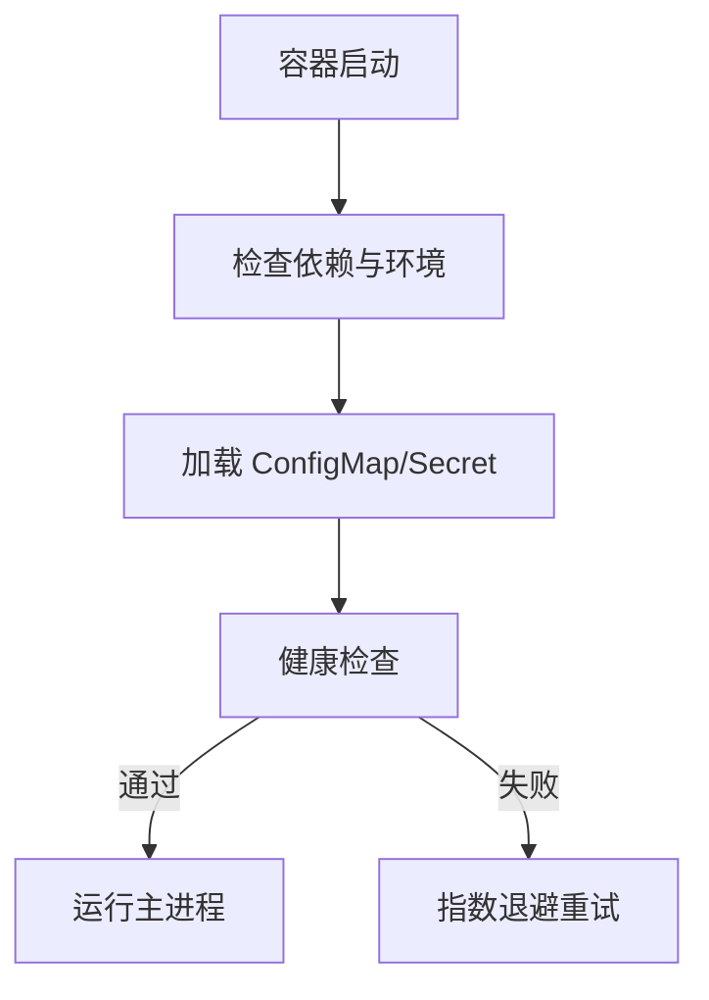

**图表来源** 
- [start_trading.bat:1-51](file://start_trading.bat#L1-L51)
- [config/settings.yaml:1-69](file://config/settings.yaml#L1-L69)
- [config/trading_config.yaml:1-62](file://config/trading_config.yaml#L1-L62)

**章节来源**
- [start_trading.bat:1-51](file://start_trading.bat#L1-L51)
- [config/settings.yaml:1-69](file://config/settings.yaml#L1-L69)
- [config/trading_config.yaml:1-62](file://config/trading_config.yaml#L1-L62)

### 存储持久化方案
- 需求
  - 数据文件（parquet/csv）、缓存目录、日志、broker_state.json、持仓与订单记录等。
- 方案
  - PersistentVolume + StorageClass：根据云厂商或自建 CSI 选择合适后端（NFS/Ceph/RBD/云盘）。
  - PVC 模板：按目录拆分（data、logs、state），便于备份与生命周期管理。
  - 备份恢复：Velero 定期快照，跨集群迁移与灾难恢复。
- 与仓库映射
  - settings.yaml 中的 cache_dir、astock 路径需映射到 PVC。
  - trading_config.yaml 中的 astock_path、cache_dir 同样映射到 PVC。
  - broker 状态文件（data/broker_state.json）需持久化。

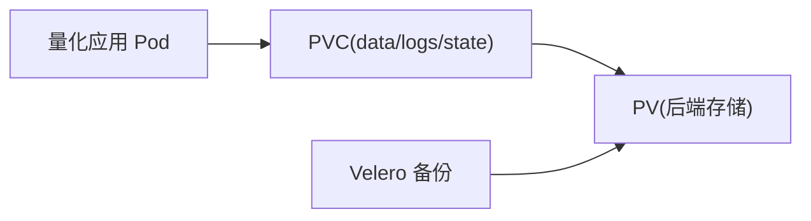

**图表来源** 
- [config/settings.yaml:1-69](file://config/settings.yaml#L1-L69)
- [config/trading_config.yaml:1-62](file://config/trading_config.yaml#L1-L62)
- [miniQMT实盘对接_生产级完善方案.md:1-800](file://miniQMT实盘对接_生产级完善方案.md#L1-L800)

**章节来源**
- [config/settings.yaml:1-69](file://config/settings.yaml#L1-L69)
- [config/trading_config.yaml:1-62](file://config/trading_config.yaml#L1-L62)
- [miniQMT实盘对接_生产级完善方案.md:1-800](file://miniQMT实盘对接_生产级完善方案.md#L1-L800)

### 服务发现与网络配置
- Service 类型
  - 内部服务用 ClusterIP；对外管理面板用 Ingress。
- Ingress 路由
  - 域名、TLS 终止、路径前缀、鉴权与限流。
- 网络安全策略
  - NetworkPolicy 限制 Pod 间通信；仅开放必要端口。
- 与仓库映射
  - 若应用提供指标与日志采集端点，需在 Service/Ingress 中暴露对应端口。

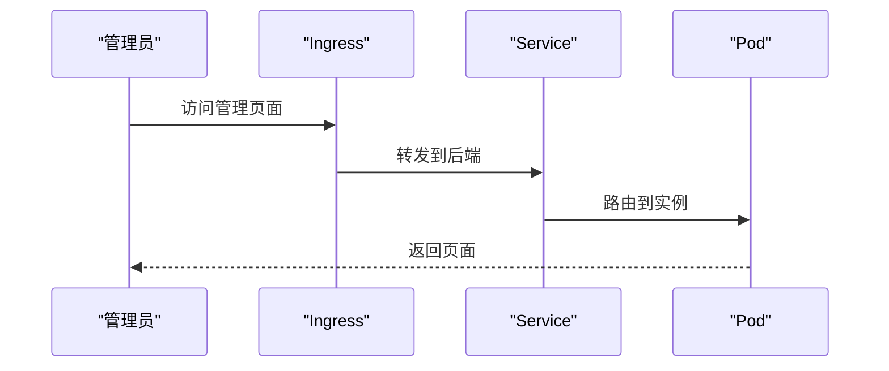

**图表来源** 
- [config/settings.yaml:1-69](file://config/settings.yaml#L1-L69)
- [config/trading_config.yaml:1-62](file://config/trading_config.yaml#L1-L62)

**章节来源**
- [config/settings.yaml:1-69](file://config/settings.yaml#L1-L69)
- [config/trading_config.yaml:1-62](file://config/trading_config.yaml#L1-L62)

### 监控与日志收集
- 指标采集
  - 应用暴露 /metrics（Prometheus 格式），Prometheus 抓取，Grafana 可视化。
- 日志聚合
  - Fluent Bit/Filebeat 采集 stdout 与文件日志，推送至 Loki/Elasticsearch。
- 告警
  - Prometheus Alertmanager 与 Grafana 告警规则联动企业微信/钉钉。
- 与仓库映射
  - settings.yaml 的日志级别与目录可用于容器日志输出策略。
  - trading_config.yaml 的通知 webhook 可与告警系统集成。

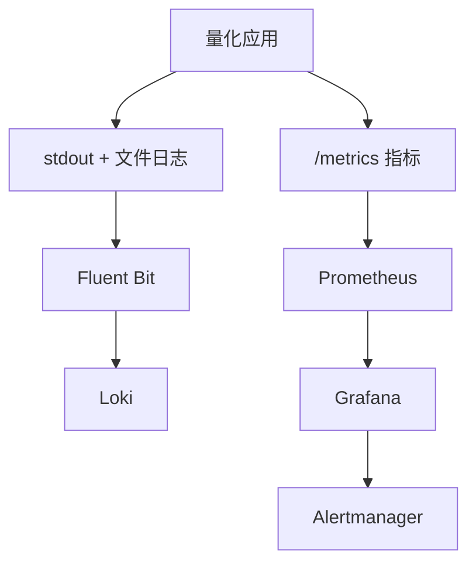

**图表来源** 
- [config/settings.yaml:1-69](file://config/settings.yaml#L1-L69)
- [config/trading_config.yaml:1-62](file://config/trading_config.yaml#L1-L62)

**章节来源**
- [config/settings.yaml:1-69](file://config/settings.yaml#L1-L69)
- [config/trading_config.yaml:1-62](file://config/trading_config.yaml#L1-L62)

### 扩缩容与高可用
- HPA 自动扩缩容
  - 基于 CPU/内存/自定义指标（如队列长度、延迟）动态调整副本数。
- 多副本部署
  - 无状态服务推荐 2~3 副本；有状态服务需谨慎（如 broker_state.json 需共享存储或外置状态）。
- 故障转移
  - 探针失败自动重启；节点故障时 Pod 漂移；数据库/消息中间件高可用。
- 与仓库映射
  - trading_config.yaml 的重试、超时与通知机制可在 Pod 层叠加 K8s 自愈能力。

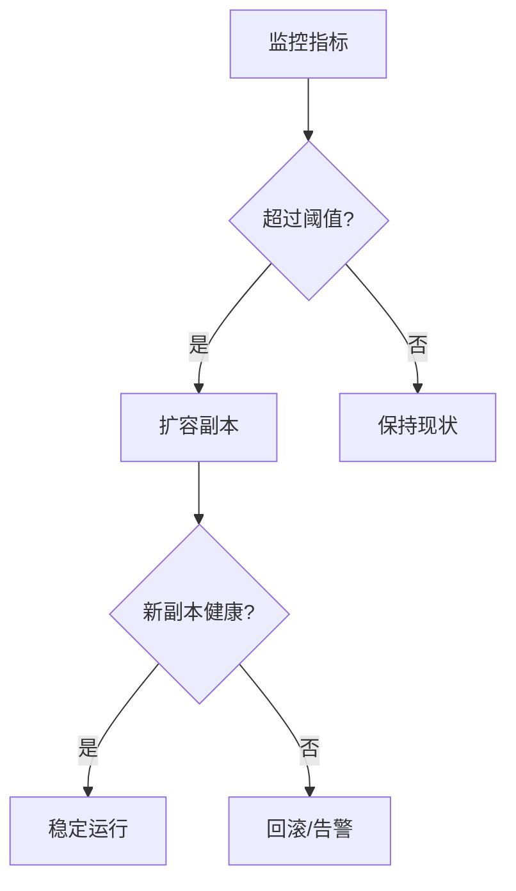

**图表来源** 
- [config/trading_config.yaml:1-62](file://config/trading_config.yaml#L1-L62)

**章节来源**
- [config/trading_config.yaml:1-62](file://config/trading_config.yaml#L1-L62)

## 依赖分析
- 外部依赖
  - miniQMT 终端（Windows 环境）：作为券商 API 网关，需确保网络连通与端口可达。
  - 数据源：astock 数据路径需映射到持久卷。
- 内部依赖
  - 配置：settings.yaml、trading_config.yaml。
  - 日志与状态：stdout、文件日志、broker_state.json。

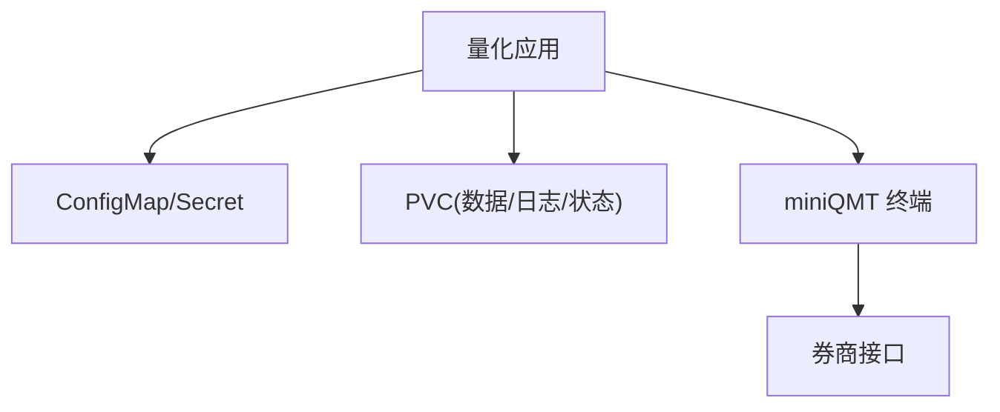

**图表来源** 
- [config/settings.yaml:1-69](file://config/settings.yaml#L1-L69)
- [config/trading_config.yaml:1-62](file://config/trading_config.yaml#L1-L62)
- [miniQMT实盘对接_生产级完善方案.md:1-800](file://miniQMT实盘对接_生产级完善方案.md#L1-L800)

**章节来源**
- [config/settings.yaml:1-69](file://config/settings.yaml#L1-L69)
- [config/trading_config.yaml:1-62](file://config/trading_config.yaml#L1-L62)
- [miniQMT实盘对接_生产级完善方案.md:1-800](file://miniQMT实盘对接_生产级完善方案.md#L1-L800)

## 性能考虑
- 资源配置
  - 合理设置 requests/limits，避免 CPU 节流与内存不足。
- I/O 优化
  - 数据文件与缓存目录使用高性能存储（SSD/NVMe），减少磁盘 IO 瓶颈。
- 并发与线程
  - 回调与监控线程需隔离，避免阻塞主流程。
- 缓存策略
  - 利用 settings.yaml 的缓存开关与过期策略，降低重复计算与 IO。

[本节为通用指导，不直接分析具体文件]

## 故障排查指南
- 连接问题
  - 检查 miniQMT 终端是否运行、端口可达、账号与路径是否正确。
- 配置错误
  - 核对 ConfigMap/Secret 注入是否生效，路径与权限是否正确。
- 健康检查失败
  - 查看探针配置与应用日志，确认依赖就绪。
- 存储问题
  - 检查 PVC/PV 绑定状态、容量与权限。
- 监控与告警
  - 确认 Prometheus 抓取成功，Grafana 仪表正常，日志聚合链路畅通。

**章节来源**
- [start_trading.bat:1-51](file://start_trading.bat#L1-L51)
- [config/settings.yaml:1-69](file://config/settings.yaml#L1-L69)
- [config/trading_config.yaml:1-62](file://config/trading_config.yaml#L1-L62)
- [miniQMT实盘对接_生产级完善方案.md:1-800](file://miniQMT实盘对接_生产级完善方案.md#L1-L800)

## 结论
本文基于仓库现有配置与文档，给出了 QuantLab 在 Kubernetes 上的完整部署蓝图，涵盖资源定义、Pod 编排、存储、网络、监控日志、扩缩容与高可用等关键主题。建议在落地时结合 Helm/Kustomize 管理多环境差异，并通过 CI/CD 自动化发布与回滚，确保生产稳定性与可观测性。

[本节为总结性内容，不直接分析具体文件]

## 附录
- 部署清单建议
  - Namespace、ConfigMap、Secret、PVC、Deployment、Service、Ingress、HPA、NetworkPolicy、PrometheusRule、Alertmanager 等。
- 发布流程建议
  - 镜像构建 → 静态扫描 → 预发验证 → 灰度发布 → 全量上线 → 监控告警。
- 回滚策略
  - 保留历史版本镜像与配置，快速回滚与数据一致性校验。

[本节为补充性内容，不直接分析具体文件]