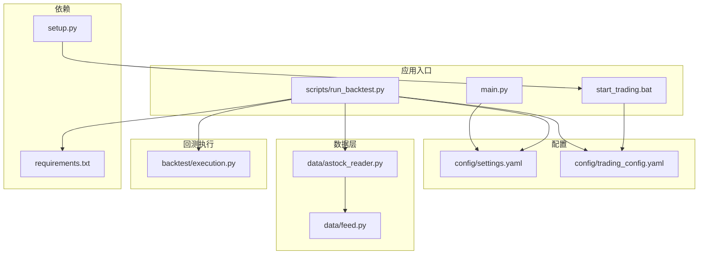
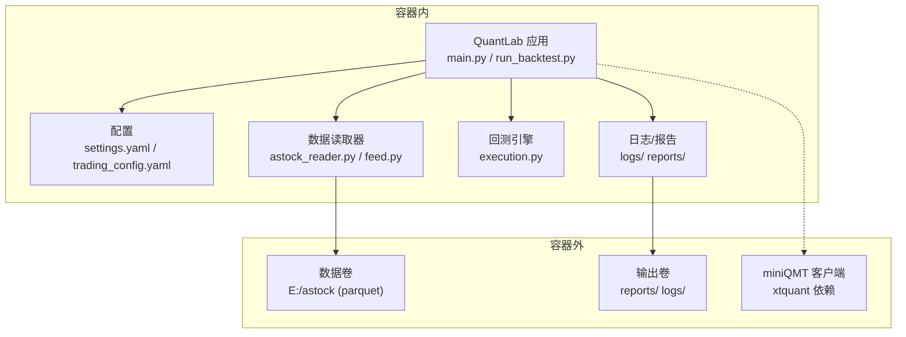
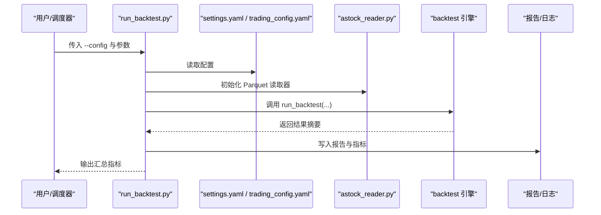
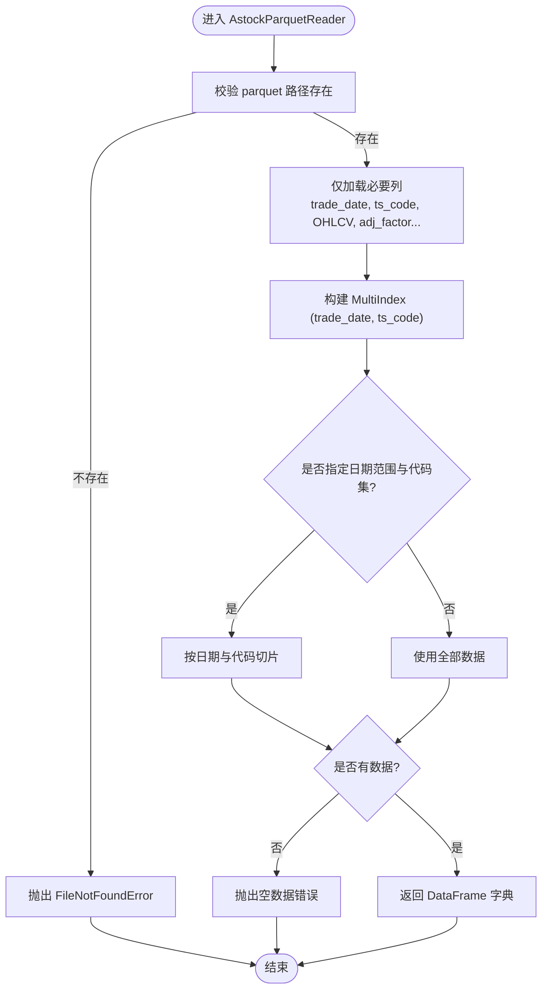
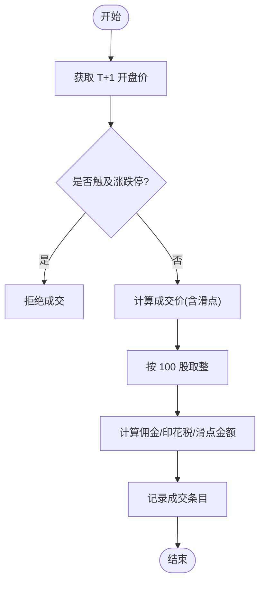
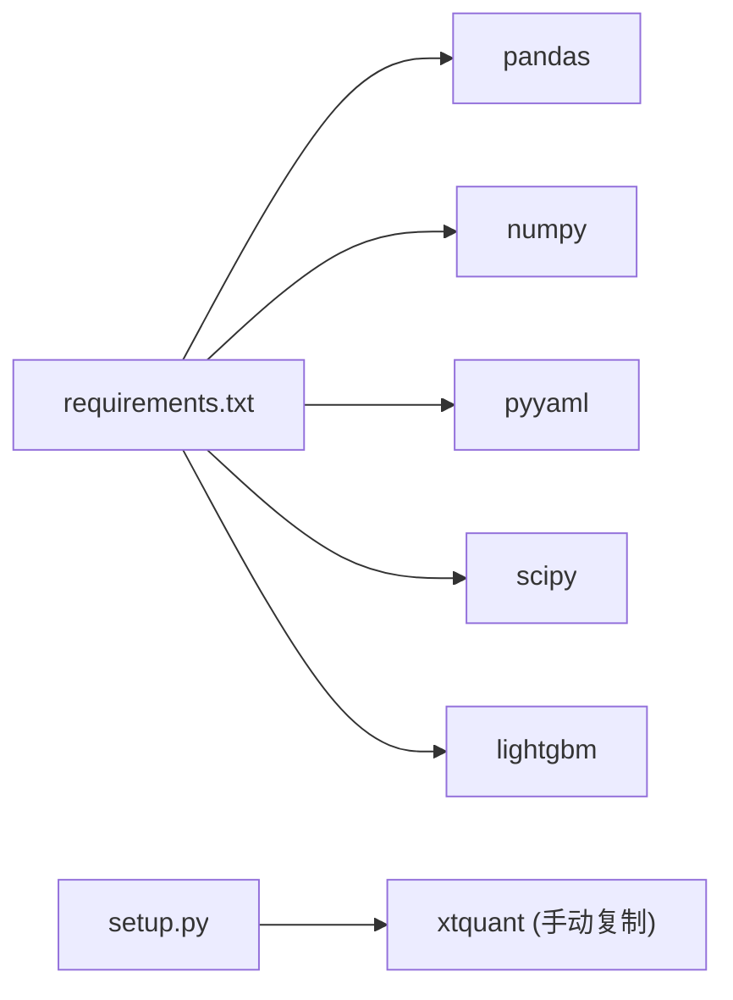

# 容器化部署

<cite>
**本文引用的文件**   
- [requirements.txt](file://requirements.txt)
- [setup.py](file://setup.py)
- [main.py](file://main.py)
- [config/settings.yaml](file://config/settings.yaml)
- [config/trading_config.yaml](file://config/trading_config.yaml)
- [scripts/run_backtest.py](file://scripts/run_backtest.py)
- [data/astock_reader.py](file://data/astock_reader.py)
- [data/feed.py](file://data/feed.py)
- [backtest/execution.py](file://backtest/execution.py)
- [start_trading.bat](file://start_trading.bat)
</cite>

## 目录
1. [简介](#简介)
2. [项目结构](#项目结构)
3. [核心组件](#核心组件)
4. [架构总览](#架构总览)
5. [详细组件分析](#详细组件分析)
6. [依赖关系分析](#依赖关系分析)
7. [性能考虑](#性能考虑)
8. [故障排查指南](#故障排查指南)
9. [结论](#结论)
10. [附录](#附录)

## 简介
本文件面向 QuantLab 的容器化与云原生部署，覆盖以下主题：
- Docker 镜像构建：基础镜像选择、依赖安装、应用打包、镜像优化
- 容器编排：Docker Compose 服务编排、依赖管理、环境变量注入
- Kubernetes 部署：Pod、Service、ConfigMap、持久化存储等
- 监控与日志：健康检查、资源监控、日志收集
- 安全加固：镜像扫描、最小权限、网络安全
- 性能优化：镜像体积、启动速度、资源限制与调优

QuantLab 是一个 A 股量化回测与实盘对接框架，核心依赖 pandas/numpy/pyyaml/scipy/lightgbm 等 Python 库，数据源以 parquet 为主（E:/astock），并通过 miniQMT/xtquant 进行实盘交易。

## 项目结构
从容器化视角，关键路径与职责如下：
- 应用入口与运行脚本
  - main.py：回测主入口（支持策略参数）
  - scripts/run_backtest.py：回测 CLI 入口（读取 YAML 配置、调用引擎）
  - start_trading.bat：Windows 本地启动脚本（非容器场景）
- 配置中心
  - config/settings.yaml：全局配置（数据源、回测、因子、日志、策略默认值）
  - config/trading_config.yaml：实盘配置（账号、风控、委托、调度、通知、数据路径）
- 数据层
  - data/astock_reader.py：parquet 只读读取器（对齐 DuckDBDailyReader 接口）
  - data/feed.py：统一数据源接口（astock/duckdb）
- 回测执行
  - backtest/execution.py：撮合与成交模型（涨跌停、滑点、手续费、手数约束）
- 环境依赖
  - requirements.txt：Python 依赖清单
  - setup.py：本地一键配置脚本（复制 xtquant、创建目录等）

**图表来源** 
- [main.py:1-104](file://main.py#L1-L104)
- [scripts/run_backtest.py:1-132](file://scripts/run_backtest.py#L1-L132)
- [config/settings.yaml:1-69](file://config/settings.yaml#L1-L69)
- [config/trading_config.yaml:1-62](file://config/trading_config.yaml#L1-L62)
- [data/astock_reader.py:1-94](file://data/astock_reader.py#L1-L94)
- [data/feed.py:1-41](file://data/feed.py#L1-L41)
- [backtest/execution.py:1-28](file://backtest/execution.py#L1-L28)
- [requirements.txt:1-29](file://requirements.txt#L1-L29)
- [setup.py:1-82](file://setup.py#L1-L82)

**章节来源**
- [main.py:1-104](file://main.py#L1-L104)
- [scripts/run_backtest.py:1-132](file://scripts/run_backtest.py#L1-L132)
- [config/settings.yaml:1-69](file://config/settings.yaml#L1-L69)
- [config/trading_config.yaml:1-62](file://config/trading_config.yaml#L1-L62)
- [data/astock_reader.py:1-94](file://data/astock_reader.py#L1-L94)
- [data/feed.py:1-41](file://data/feed.py#L1-L41)
- [backtest/execution.py:1-28](file://backtest/execution.py#L1-L28)
- [requirements.txt:1-29](file://requirements.txt#L1-L29)
- [setup.py:1-82](file://setup.py#L1-L82)

## 核心组件
- 回测入口与参数解析
  - main.py：加载 settings.yaml，按策略名路由到不同实现；命令行参数支持 --strategy/--start/--end
  - scripts/run_backtest.py：CLI 入口，解析 YAML 配置，构造 AstockParquetReader，调用 backtest.engine.run_backtest，输出报告
- 数据读取
  - data/astock_reader.py：只读读取 astock parquet，按 trade_date/ts_code MultiIndex 过滤，返回 OHLCV 等字段
  - data/feed.py：统一数据源抽象，当前支持 astock/duckdb
- 撮合与成交
  - backtest/execution.py：next_open 模型，处理涨跌停、滑点、佣金、印花税、A 股 100 手整数倍约束
- 配置系统
  - config/settings.yaml：全局回测、因子、日志、策略默认值
  - config/trading_config.yaml：实盘账号、风控阈值、委托策略、调度计划、通知、数据路径
- 依赖与环境
  - requirements.txt：Python 依赖版本约束
  - setup.py：本地环境准备（复制 xtquant、创建目录）

**章节来源**
- [main.py:21-104](file://main.py#L21-L104)
- [scripts/run_backtest.py:35-132](file://scripts/run_backtest.py#L35-L132)
- [data/astock_reader.py:25-94](file://data/astock_reader.py#L25-L94)
- [data/feed.py:17-41](file://data/feed.py#L17-L41)
- [backtest/execution.py:1-28](file://backtest/execution.py#L1-L28)
- [config/settings.yaml:1-69](file://config/settings.yaml#L1-L69)
- [config/trading_config.yaml:1-62](file://config/trading_config.yaml#L1-L62)
- [requirements.txt:1-29](file://requirements.txt#L1-L29)
- [setup.py:1-82](file://setup.py#L1-L82)

## 架构总览
下图展示容器内外的关键交互：应用通过配置文件驱动，数据层以只读方式访问外部数据卷（parquet），回测结果写入共享卷，实盘模式需连接 miniQMT（通常不在容器内）。

**图表来源** 
- [main.py:1-104](file://main.py#L1-L104)
- [scripts/run_backtest.py:1-132](file://scripts/run_backtest.py#L1-L132)
- [data/astock_reader.py:1-94](file://data/astock_reader.py#L1-L94)
- [data/feed.py:1-41](file://data/feed.py#L1-L41)
- [backtest/execution.py:1-28](file://backtest/execution.py#L1-L28)
- [config/settings.yaml:1-69](file://config/settings.yaml#L1-L69)
- [config/trading_config.yaml:1-62](file://config/trading_config.yaml#L1-L62)

## 详细组件分析

### Docker 镜像构建指南
- 基础镜像选择
  - 推荐基于官方 Python 镜像（如 python:3.11-slim），减少体积并保证兼容性
  - 若需要编译依赖（如某些科学计算包），可使用带 build 工具的镜像或在多阶段构建中完成
- 依赖安装
  - 使用 requirements.txt 固定版本，确保可重复构建
  - 将依赖安装与代码拷贝分层，提升缓存命中率
- 应用打包
  - 将项目根目录作为工作目录，保留相对路径一致性
  - 设置环境变量控制行为（如数据路径、日志级别、是否启用实盘）
- 镜像优化
  - 使用 .dockerignore 排除无关文件（如 logs、reports、测试数据）
  - 合并 RUN 指令，清理 apt/pip 缓存
  - 使用非 root 用户运行，降低安全风险
- 健康检查
  - 提供轻量健康检查命令（如 python -c "import yaml; print('OK')"）
- 示例步骤（概念性说明）
  - 构建阶段：安装依赖、拷贝代码
  - 运行阶段：暴露端口（如需）、挂载数据卷、设置环境变量、执行入口命令

[本节为通用指导，不直接分析具体文件]

### Docker Compose 编排方案
- 服务划分
  - app：QuantLab 应用（回测/策略运行）
  - data-sync：可选的数据同步服务（更新 astock parquet）
  - monitor：可选的监控/日志采集侧车
- 依赖管理
  - 使用 depends_on 与 healthcheck 确保数据就绪
- 环境变量
  - 通过 .env 或 compose 的 environment 注入配置（如数据路径、日志级别、策略开关）
- 数据卷
  - 将 E:/astock 映射为只读卷，避免容器内写操作
  - 将 reports/logs 映射为读写卷，便于结果导出
- 示例要点（概念性说明）
  - services.app.image、command、environment、volumes、depends_on、healthcheck

[本节为通用指导，不直接分析具体文件]

### Kubernetes 部署实践
- Pod
  - 定义容器镜像、资源请求/限制、环境变量、启动探针/存活探针
- Service
  - 如需对外暴露 API，使用 ClusterIP/NodePort/Ingress
- ConfigMap
  - 将 settings.yaml、trading_config.yaml 放入 ConfigMap，通过 volume mount 或环境变量注入
- Secret
  - 敏感信息（如账号、webhook URL）使用 Secret
- 持久化存储
  - 使用 PVC 挂载数据卷（astock parquet 只读），reports/logs 读写
- 示例要点（概念性说明）
  - Deployment、Service、ConfigMap、Secret、PVC、Probes、ResourceRequests/Limits

[本节为通用指导，不直接分析具体文件]

### 回测流程时序（容器内）

**图表来源** 
- [scripts/run_backtest.py:35-132](file://scripts/run_backtest.py#L35-L132)
- [config/settings.yaml:1-69](file://config/settings.yaml#L1-L69)
- [config/trading_config.yaml:1-62](file://config/trading_config.yaml#L1-L62)
- [data/astock_reader.py:25-94](file://data/astock_reader.py#L25-L94)

**章节来源**
- [scripts/run_backtest.py:35-132](file://scripts/run_backtest.py#L35-L132)

### 数据读取与校验流程

**图表来源** 
- [data/astock_reader.py:25-94](file://data/astock_reader.py#L25-L94)

**章节来源**
- [data/astock_reader.py:25-94](file://data/astock_reader.py#L25-L94)

### 撮合与成交逻辑（next_open 模型）
- 买入价：T+1 开盘价 × (1 + 滑点)
- 卖出价：T+1 开盘价 × (1 - 滑点)
- 涨跌停判定：根据板块规则（主板/双创/北交/ST）动态限制
- 手数约束：A 股 100 股整数倍
- 费用：佣金、印花税、滑点金额计入成交明细

**图表来源** 
- [backtest/execution.py:1-28](file://backtest/execution.py#L1-L28)

**章节来源**
- [backtest/execution.py:1-28](file://backtest/execution.py#L1-L28)

### 配置系统与变量注入
- settings.yaml：全局回测参数、因子预处理、日志、策略默认股票池
- trading_config.yaml：实盘账号、风控阈值、委托策略、调度计划、通知、数据路径
- 容器化建议
  - 将两个 YAML 放入 ConfigMap，按需覆盖
  - 通过环境变量覆盖关键路径（如 ASTOCK_PATH、CACHE_DIR、LOG_LEVEL）
  - 在运行时校验必填项（如 universe.csv、adjustment）

**章节来源**
- [config/settings.yaml:1-69](file://config/settings.yaml#L1-L69)
- [config/trading_config.yaml:1-62](file://config/trading_config.yaml#L1-L62)
- [scripts/run_backtest.py:64-78](file://scripts/run_backtest.py#L64-L78)

## 依赖关系分析
- Python 依赖
  - 核心：pandas>=2.0、numpy>=1.24、pyyaml>=6.0
  - 回测：scipy>=1.10
  - ML：lightgbm>=4.0（可选）
  - 可视化/数据源：streamlit、plotly、tushare、akshare（可选）
  - 实盘：xtquant（从 QMT 安装目录复制，非 pip 安装）
- 本地环境准备
  - setup.py：查找 xtquant 源路径、复制到 site-packages、验证导入、创建必要目录

**图表来源** 
- [requirements.txt:1-29](file://requirements.txt#L1-L29)
- [setup.py:15-61](file://setup.py#L15-L61)

**章节来源**
- [requirements.txt:1-29](file://requirements.txt#L1-L29)
- [setup.py:15-61](file://setup.py#L15-L61)

## 性能考虑
- 镜像体积优化
  - 使用 slim 基础镜像，多阶段构建分离编译依赖
  - 仅安装必要依赖，清理缓存
- 启动速度优化
  - 预加载常用模块（谨慎评估内存占用）
  - 使用健康检查缩短冷启动等待
- 数据读取优化
  - astock_reader.py 已仅加载必要列，减少内存与 I/O
  - 合理设置日期范围与代码集合，避免全量扫描
- 资源限制
  - 在 Compose/K8s 中设置 CPU/内存请求与上限
  - 针对大数据集回测，适当增加内存并限制并发
- 并行与批处理
  - 对独立策略或数据集进行并行回测（注意磁盘 I/O 与内存峰值）

[本节为通用指导，不直接分析具体文件]

## 故障排查指南
- 常见错误与定位
  - parquet 路径不存在：检查数据卷挂载与路径映射
  - 调整类型非法：确认 adjustment 为 raw/qfq/hfq
  - 未找到 universe.csv：检查配置中的 universe.csv 路径
  - xtquant 导入失败：确认本地已复制 xtquant 且路径正确
- 日志与报告
  - 查看 logs/ 与 reports/ 输出，核对指标与异常堆栈
- 快速自检
  - 使用最小配置运行一次回测，验证数据与依赖正常

**章节来源**
- [data/astock_reader.py:35-44](file://data/astock_reader.py#L35-L44)
- [scripts/run_backtest.py:64-78](file://scripts/run_backtest.py#L64-L78)
- [setup.py:54-61](file://setup.py#L54-L61)

## 结论
QuantLab 的容器化与云原生部署应以“只读数据、可配置、可观测、可安全”为核心原则：
- 使用标准 Python 镜像与 requirements.txt 锁定依赖
- 通过 ConfigMap/Secret 管理配置与敏感信息
- 将 astock parquet 以只读卷挂载，结果与日志通过卷导出
- 在 K8s 中设置健康检查与资源限制，结合日志与监控平台实现可观测性
- 遵循最小权限与安全扫描，保障生产稳定性

[本节为总结性内容，不直接分析具体文件]

## 附录
- 本地启动参考
  - Windows 下可通过 start_trading.bat 检查 Python/QMT、创建目录、启动实盘
- 数据更新
  - 使用 scripts/update_data.py 增量更新 astock parquet 与 CSV

**章节来源**
- [start_trading.bat:1-51](file://start_trading.bat#L1-L51)
- [scripts/update_data.py:1-49](file://scripts/update_data.py#L1-L49)