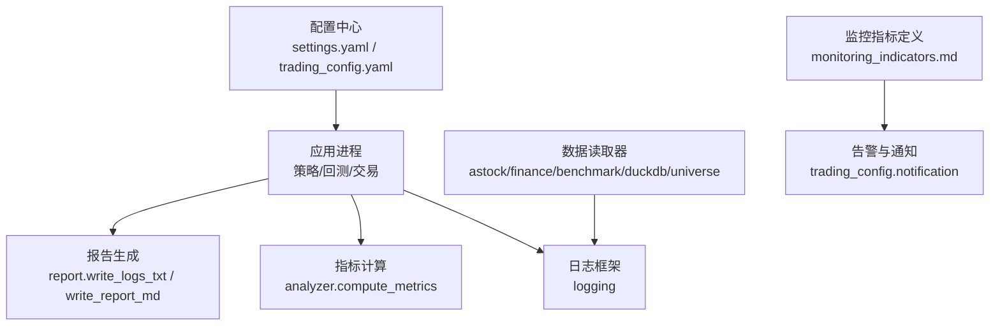
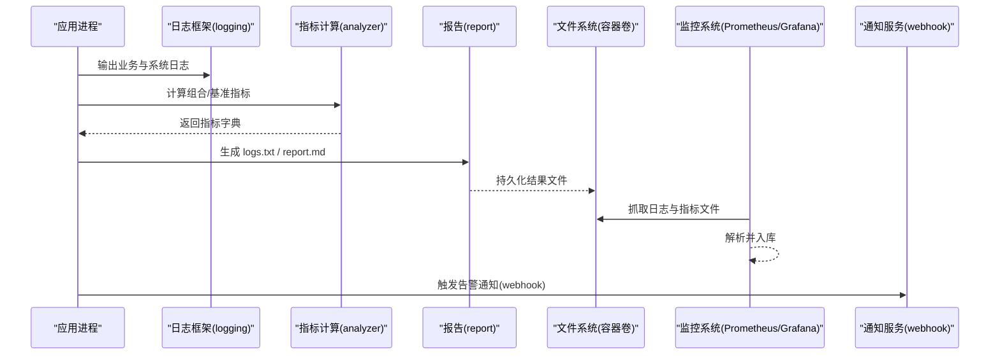
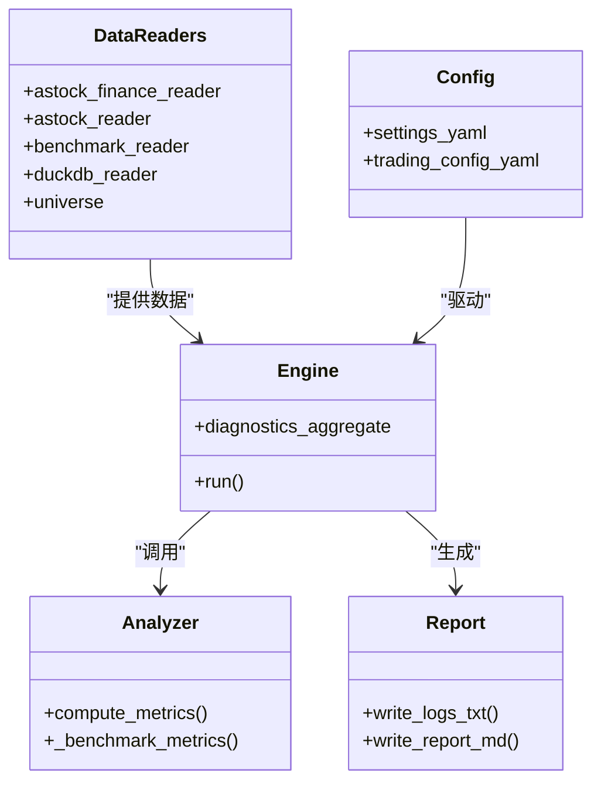

# 容器监控与日志

<cite>
**本文引用的文件**   
- [config/settings.yaml](file://config/settings.yaml)
- [config/trading_config.yaml](file://config/trading_config.yaml)
- [backtest/engine.py](file://backtest/engine.py)
- [backtest/analyzer.py](file://backtest/analyzer.py)
- [backtest/report.py](file://backtest/report.py)
- [data/astock_finance_reader.py](file://data/astock_finance_reader.py)
- [data/astock_reader.py](file://data/astock_reader.py)
- [data/benchmark_reader.py](file://data/benchmark_reader.py)
- [data/duckdb_reader.py](file://data/duckdb_reader.py)
- [data/universe.py](file://data/universe.py)
- [projects/verification/results/monitoring_indicators.md](file://projects/verification/results/monitoring_indicators.md)
- [scripts/test_passorder_with_monitor.py](file://scripts/test_passorder_with_monitor.py)
- [全局复利与踩坑日志.md](file://全局复利与踩坑日志.md)
</cite>

## 目录
1. [简介](#简介)
2. [项目结构](#项目结构)
3. [核心组件](#核心组件)
4. [架构总览](#架构总览)
5. [详细组件分析](#详细组件分析)
6. [依赖关系分析](#依赖关系分析)
7. [性能考虑](#性能考虑)
8. [故障排查指南](#故障排查指南)
9. [结论](#结论)
10. [附录](#附录)

## 简介
本文件面向 QuantLab 的“容器化部署”场景，提供一套可落地的监控与日志方案。内容覆盖：
- 容器健康检查（存活探针、就绪探针、自定义检查脚本）
- 资源监控指标（CPU、内存、磁盘IO、网络流量等）
- 日志收集与分析（输出格式、聚合工具、查询分析）
- 性能监控与优化（基准测试、瓶颈识别、调优策略）
- 告警与通知（阈值配置、规则设置、多渠道通知）
- 监控仪表板搭建（Grafana 关键指标展示与实时监控界面）

说明：仓库中未包含 Docker/Kubernetes 编排文件，但提供了日志与指标相关代码与配置，可作为构建容器监控体系的基础。

## 项目结构
QuantLab 在监控与日志方面的关键位置如下：
- 全局日志配置：logging 级别、目录、轮转大小与备份数量
- 回测引擎与报告：统一输出 logs.txt、report.md、summary.json 等结果文件
- 数据读取模块：广泛使用 logging 记录加载、警告与调试信息
- 实盘与通知配置：通知渠道开关、方法、webhook 地址等
- 监控指标定义文档：每日/每周/每月/季度监控指标与阈值

图表来源
- [backtest/engine.py:1-120](file://backtest/engine.py#L1-L120)
- [backtest/analyzer.py:78-175](file://backtest/analyzer.py#L78-L175)
- [backtest/report.py:78-147](file://backtest/report.py#L78-L147)
- [config/settings.yaml:30-36](file://config/settings.yaml#L30-L36)
- [config/trading_config.yaml:37-41](file://config/trading_config.yaml#L37-L41)
- [data/astock_finance_reader.py:1-60](file://data/astock_finance_reader.py#L1-L60)
- [data/astock_reader.py:1-30](file://data/astock_reader.py#L1-L30)
- [data/benchmark_reader.py:1-30](file://data/benchmark_reader.py#L1-L30)
- [data/duckdb_reader.py:1-80](file://data/duckdb_reader.py#L1-L80)
- [data/universe.py:1-60](file://data/universe.py#L1-L60)
- [projects/verification/results/monitoring_indicators.md:1-69](file://projects/verification/results/monitoring_indicators.md#L1-L69)

章节来源
- [config/settings.yaml:30-36](file://config/settings.yaml#L30-L36)
- [config/trading_config.yaml:37-41](file://config/trading_config.yaml#L37-L41)
- [backtest/report.py:78-147](file://backtest/report.py#L78-L147)
- [backtest/analyzer.py:78-175](file://backtest/analyzer.py#L78-L175)
- [projects/verification/results/monitoring_indicators.md:1-69](file://projects/verification/results/monitoring_indicators.md#L1-L69)

## 核心组件
- 日志框架与配置
  - 通过 settings.yaml 的 logging 节点控制级别、目录、文件大小与备份数量
  - 各模块使用 Python logging 输出结构化文本日志，便于外部采集
- 指标计算与诊断
  - analyzer.compute_metrics 输出组合收益、回撤、夏普、超额收益、信息比率、跟踪误差等
  - engine 汇总诊断信息（候选数、未成交订单、样本期警告等）
- 报告与日志聚合
  - report.write_logs_txt 写入 logs.txt，write_report_md 生成 report.md
  - 将警告块、日级日志、绩效摘要集中输出，便于容器内持久化与外部抓取
- 数据层日志
  - astock/finance/benchmark/duckdb/universe 等读取器均使用 logging 输出加载行数、去重、异常等
- 通知与告警
  - trading_config.yaml 的 notification 节点支持 wechat/dingtalk/email 及 webhook 配置

章节来源
- [config/settings.yaml:30-36](file://config/settings.yaml#L30-L36)
- [backtest/analyzer.py:96-175](file://backtest/analyzer.py#L96-L175)
- [backtest/engine.py:479-522](file://backtest/engine.py#L479-L522)
- [backtest/report.py:111-147](file://backtest/report.py#L111-L147)
- [data/astock_finance_reader.py:48-60](file://data/astock_finance_reader.py#L48-L60)
- [data/astock_reader.py:14-30](file://data/astock_reader.py#L14-L30)
- [data/benchmark_reader.py:13-30](file://data/benchmark_reader.py#L13-L30)
- [data/duckdb_reader.py:23-80](file://data/duckdb_reader.py#L23-L80)
- [data/universe.py:14-60](file://data/universe.py#L14-L60)
- [config/trading_config.yaml:37-41](file://config/trading_config.yaml#L37-L41)

## 架构总览
下图展示了从应用进程到日志与指标的流转路径，以及外部监控系统的对接点。

图表来源
- [backtest/engine.py:479-522](file://backtest/engine.py#L479-L522)
- [backtest/analyzer.py:96-175](file://backtest/analyzer.py#L96-L175)
- [backtest/report.py:111-147](file://backtest/report.py#L111-L147)
- [config/settings.yaml:30-36](file://config/settings.yaml#L30-L36)
- [config/trading_config.yaml:37-41](file://config/trading_config.yaml#L37-L41)

## 详细组件分析

### 健康检查与探针（存活/就绪/自定义）
- 存活探针（livenessProbe）
  - 目标：确保进程仍在运行且能响应基本请求
  - 建议实现：暴露一个轻量 HTTP 端点或执行一个快速命令（如读取状态文件），失败则重启容器
- 就绪探针（readinessProbe）
  - 目标：确认依赖就绪（数据源可用、数据库连接、QMT 会话建立）
  - 建议实现：校验关键配置文件、数据文件存在性、最小数据集可读；失败则不接收流量
- 自定义检查脚本
  - 结合 data 层读取器的日志与错误码，编写脚本检查：
    - astock/finance/benchmark 数据是否完整
    - duckdb 是否可读写
    - universe 是否加载成功
  - 将脚本作为探针命令或 HTTP 健康端点的后端逻辑

章节来源
- [data/astock_finance_reader.py:48-60](file://data/astock_finance_reader.py#L48-L60)
- [data/astock_reader.py:14-30](file://data/astock_reader.py#L14-L30)
- [data/benchmark_reader.py:13-30](file://data/benchmark_reader.py#L13-L30)
- [data/duckdb_reader.py:23-80](file://data/duckdb_reader.py#L23-L80)
- [data/universe.py:14-60](file://data/universe.py#L14-L60)

### 资源监控指标（CPU/内存/磁盘IO/网络）
- 采集方式
  - 容器运行时指标：通过 cgroup 或 kubelet 暴露 CPU、内存、磁盘IO、网络 I/O
  - 应用层指标：在 backtest/analyzer.py 中扩展导出组合净值、回撤、夏普、换手率等
- 指标落地
  - 将 metrics 字典定期写入文件（CSV/JSON），供 Prometheus Node Exporter 或 Filebeat 抓取
  - 结合 engine 的诊断信息（候选数、未成交订单、样本期警告）形成业务健康度指标

章节来源
- [backtest/analyzer.py:96-175](file://backtest/analyzer.py#L96-L175)
- [backtest/engine.py:479-522](file://backtest/engine.py#L479-L522)

### 日志收集与分析
- 输出格式
  - 使用 Python logging 输出结构化文本，便于外部采集
  - report.write_logs_txt 生成 logs.txt，write_report_md 生成 report.md，便于人类阅读与机器解析
- 聚合与存储
  - 容器内将日志落盘到固定目录（settings.yaml 的 logging.dir）
  - 外部通过 sidecar（如 Fluent Bit/Filebeat）采集日志并转发至 ELK/Loki
- 查询与分析
  - 基于关键字段（WARN/INFO/ERROR）、时间戳、模块名进行检索
  - 结合 monitoring_indicators.md 中的指标定义，关联业务事件与系统日志

章节来源
- [config/settings.yaml:30-36](file://config/settings.yaml#L30-L36)
- [backtest/report.py:111-147](file://backtest/report.py#L111-L147)
- [projects/verification/results/monitoring_indicators.md:1-69](file://projects/verification/results/monitoring_indicators.md#L1-L69)

### 性能监控与优化
- 基准测试
  - 利用 analyzer.compute_metrics 输出的年化收益、最大回撤、夏普、胜率等作为策略性能基线
- 瓶颈识别
  - 关注 data 层读取器的日志（加载行数、去重计数、wal 检测）定位 IO 与数据质量瓶颈
  - 关注 engine 的诊断项（候选总数/通过数、未成交订单）定位策略与撮合瓶颈
- 优化策略
  - 调整缓存与数据预取（settings.yaml 的 cache 配置）
  - 合理设置日志级别与轮转策略，降低 IO 压力
  - 对高频计算路径引入批处理或向量化

章节来源
- [backtest/analyzer.py:96-175](file://backtest/analyzer.py#L96-L175)
- [backtest/engine.py:479-522](file://backtest/engine.py#L479-L522)
- [data/duckdb_reader.py:23-80](file://data/duckdb_reader.py#L23-L80)
- [config/settings.yaml:16-19](file://config/settings.yaml#L16-L19)

### 告警与通知机制
- 阈值与规则
  - 参考 monitoring_indicators.md 的每日/每周/每月/季度阈值，映射为告警规则
  - 将策略指标（净值跌幅、回撤、换手率、信号质量）与系统指标（CPU/内存/磁盘IO）统一纳入告警平台
- 通知渠道
  - trading_config.yaml 的 notification 节点支持 wechat/dingtalk/email，可通过 webhook 推送
- 自动化处置
  - 针对高回撤阈值自动减仓/清仓（需与交易执行模块集成）

章节来源
- [projects/verification/results/monitoring_indicators.md:1-69](file://projects/verification/results/monitoring_indicators.md#L1-L69)
- [config/trading_config.yaml:37-41](file://config/trading_config.yaml#L37-L41)

### 监控仪表板搭建（Grafana）
- 数据源
  - 指标：Prometheus（系统与应用指标）
  - 日志：Loki（日志聚合）
- 关键面板
  - 系统资源：CPU、内存、磁盘IO、网络流量
  - 业务指标：净值曲线、回撤、夏普、换手率、未成交订单数
  - 日志面板：按模块与级别过滤的关键日志
- 实时界面
  - 使用变量与模板化查询，支持多策略/多实例切换
  - 将 alerts 与 panels 联动，点击告警跳转对应日志与指标

[本节为概念性说明，不直接分析具体文件]

## 依赖关系分析
- 模块耦合
  - engine 依赖 analyzer 计算指标，依赖 report 生成日志与报告
  - data 层读取器依赖 logging 输出加载与异常信息
  - 配置中心 settings.yaml 与 trading_config.yaml 驱动日志与通知行为
- 外部依赖
  - 文件系统（容器卷）用于持久化日志与指标
  - 监控系统（Prometheus/Grafana/Loki）用于采集与可视化

图表来源
- [backtest/engine.py:479-522](file://backtest/engine.py#L479-L522)
- [backtest/analyzer.py:78-175](file://backtest/analyzer.py#L78-L175)
- [backtest/report.py:78-147](file://backtest/report.py#L78-L147)
- [data/astock_finance_reader.py:48-60](file://data/astock_finance_reader.py#L48-L60)
- [data/astock_reader.py:14-30](file://data/astock_reader.py#L14-L30)
- [data/benchmark_reader.py:13-30](file://data/benchmark_reader.py#L13-L30)
- [data/duckdb_reader.py:23-80](file://data/duckdb_reader.py#L23-L80)
- [data/universe.py:14-60](file://data/universe.py#L14-L60)
- [config/settings.yaml:30-36](file://config/settings.yaml#L30-L36)
- [config/trading_config.yaml:37-41](file://config/trading_config.yaml#L37-L41)

章节来源
- [backtest/engine.py:479-522](file://backtest/engine.py#L479-L522)
- [backtest/analyzer.py:78-175](file://backtest/analyzer.py#L78-L175)
- [backtest/report.py:78-147](file://backtest/report.py#L78-L147)
- [config/settings.yaml:30-36](file://config/settings.yaml#L30-L36)
- [config/trading_config.yaml:37-41](file://config/trading_config.yaml#L37-L41)

## 性能考虑
- 日志级别与轮转
  - 生产环境建议 INFO/WARN，避免 DEBUG 造成 IO 压力
  - 合理设置 max_file_size 与 backup_count，防止日志膨胀
- 数据读取优化
  - 启用缓存与过期策略，减少重复 IO
  - 关注 .wal 检测与 dedup 计数，避免同步中的数据不一致
- 指标计算开销
  - 将 compute_metrics 的结果缓存与增量更新，避免全量重算
- 容器资源限制
  - 根据 CPU/内存峰值设置 requests/limits，避免 OOM 与 CPU Throttling

章节来源
- [config/settings.yaml:30-36](file://config/settings.yaml#L30-L36)
- [config/settings.yaml:16-19](file://config/settings.yaml#L16-L19)
- [backtest/analyzer.py:96-175](file://backtest/analyzer.py#L96-L175)
- [data/duckdb_reader.py:23-80](file://data/duckdb_reader.py#L23-L80)

## 故障排查指南
- 常见问题定位
  - 数据不可用：检查 astock/finance/benchmark 路径与权限，查看读取器日志
  - 指标缺失：确认 compute_metrics 输入数据完整性（equity_rows、trades、calendar）
  - 日志乱码：注意编码差异（GBK vs UTF-8），确保采集器正确解码
- 排查步骤
  - 查看 logs.txt 与 report.md 的警告块与日级日志
  - 核对 monitoring_indicators.md 的阈值与当前值
  - 使用 scripts/test_passorder_with_monitor.py 验证下单与监控链路
- 注意事项
  - QMT 策略日志文件名与编码问题，以内容中的日期为准
  - CMOS 日期错乱时，不要依赖文件名判断真实日期

章节来源
- [backtest/report.py:78-147](file://backtest/report.py#L78-L147)
- [projects/verification/results/monitoring_indicators.md:1-69](file://projects/verification/results/monitoring_indicators.md#L1-L69)
- [scripts/test_passorder_with_monitor.py](file://scripts/test_passorder_with_monitor.py)
- [全局复利与踩坑日志.md:147-168](file://全局复利与踩坑日志.md#L147-L168)

## 结论
QuantLab 已具备完善的日志与指标基础，适合在容器化环境中构建端到端的监控与告警体系。通过标准化日志输出、统一的指标计算与报告生成，配合外部监控系统（Prometheus/Grafana/Loki）可实现：
- 容器健康检查与自愈
- 资源与业务指标的统一采集与可视化
- 基于阈值的告警与多渠道通知
- 高效的日志聚合与问题定位

建议在后续迭代中补充：
- 容器编排文件（Docker/K8s）与健康探针配置
- 指标导出为 Prometheus 兼容格式
- 日志结构化（JSON）与字段规范化

## 附录
- 监控指标定义参考：每日/每周/每月/季度监控指标与阈值
- 日志与编码注意事项：QMT 策略日志编码与文件名可靠性
- 通知渠道配置：wechat/dingtalk/email 与 webhook 设置

[本节为概念性说明，不直接分析具体文件]