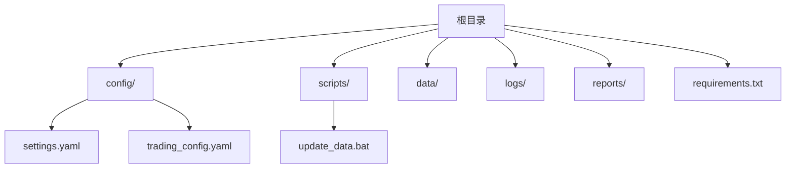
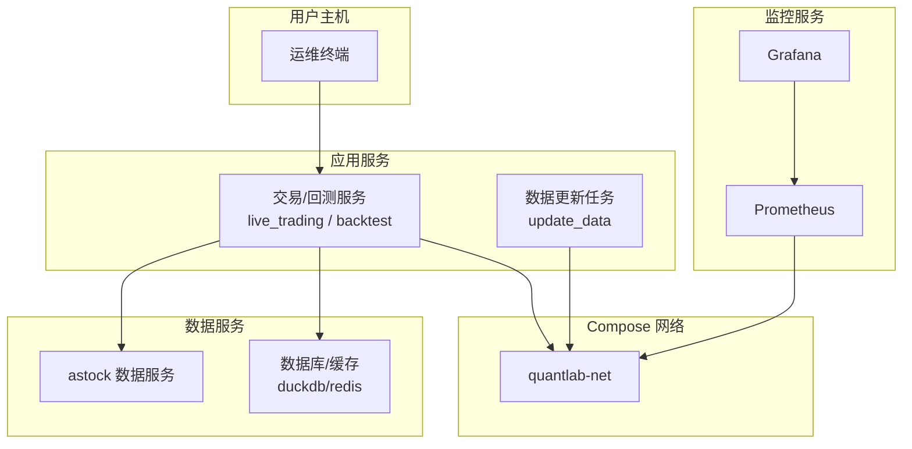
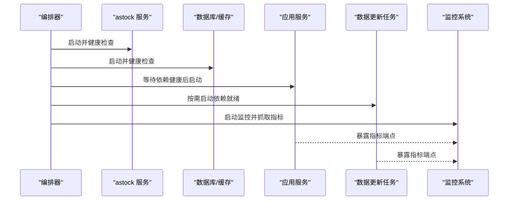
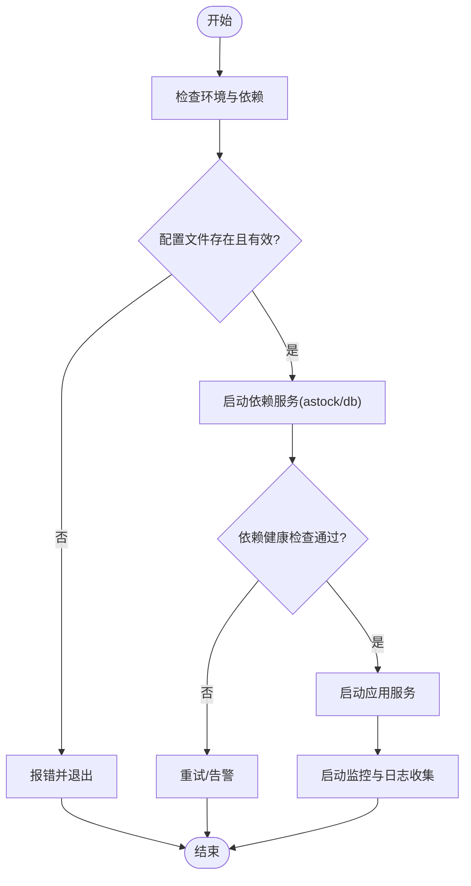

# 容器编排

<cite>
**本文引用的文件**   
- [config/settings.yaml](file://config/settings.yaml)
- [config/trading_config.yaml](file://config/trading_config.yaml)
- [start_trading.bat](file://start_trading.bat)
- [start_trading_qmt.bat](file://start_trading_qmt.bat)
- [scripts/update_data.bat](file://scripts/update_data.bat)
- [requirements.txt](file://requirements.txt)
</cite>

## 目录
1. [简介](#简介)
2. [项目结构](#项目结构)
3. [核心组件](#核心组件)
4. [架构总览](#架构总览)
5. [详细组件分析](#详细组件分析)
6. [依赖关系分析](#依赖关系分析)
7. [性能考虑](#性能考虑)
8. [故障排查指南](#故障排查指南)
9. [结论](#结论)
10. [附录](#附录)

## 简介
本文件面向 QuantLab 的容器化与编排，提供基于 Docker Compose 的多服务编排方案与实践指南。内容覆盖：多服务编排、网络配置、数据卷管理、环境变量传递、服务依赖与健康检查、配置管理最佳实践、容器生命周期管理（优雅关闭、滚动更新、回滚）、监控告警以及安全加固等。由于仓库中未包含现成的 docker-compose.yml，本文以仓库内现有脚本与配置文件为依据，给出可落地的编排蓝图与实施建议，帮助将本地批处理启动流程迁移到容器化环境。

## 项目结构
QuantLab 当前采用 Python 脚本 + YAML 配置的组织方式，关键路径包括：
- 全局与交易配置：config/settings.yaml、config/trading_config.yaml
- 启动脚本：start_trading.bat、start_trading_qmt.bat
- 数据更新脚本：scripts/update_data.bat
- 依赖清单：requirements.txt

图表来源
- [config/settings.yaml:1-69](file://config/settings.yaml#L1-L69)
- [config/trading_config.yaml:1-62](file://config/trading_config.yaml#L1-L62)
- [scripts/update_data.bat:1-15](file://scripts/update_data.bat#L1-L15)
- [requirements.txt:1-29](file://requirements.txt#L1-L29)

章节来源
- [config/settings.yaml:1-69](file://config/settings.yaml#L1-L69)
- [config/trading_config.yaml:1-62](file://config/trading_config.yaml#L1-L62)
- [scripts/update_data.bat:1-15](file://scripts/update_data.bat#L1-L15)
- [requirements.txt:1-29](file://requirements.txt#L1-L29)

## 核心组件
- 配置中心（YAML）
  - settings.yaml：全局设置（项目信息、数据源、缓存、回测参数、日志、因子处理、策略默认值、实盘开关）。
  - trading_config.yaml：实盘运行参数（账户、风控、委托、调度、通知、数据源、策略权重）。
- 启动器（批处理）
  - start_trading.bat：检查 Python/QMT、创建目录、校验配置、启动 live_trading.py。
  - start_trading_qmt.bat：使用 QMT 内置 Python 启动 live_trading.py，并自动拉起 QMT 客户端。
- 数据维护
  - scripts/update_data.bat：调用 update_data.py 进行数据更新。
- 依赖声明
  - requirements.txt：Python 依赖版本约束。

章节来源
- [config/settings.yaml:1-69](file://config/settings.yaml#L1-L69)
- [config/trading_config.yaml:1-62](file://config/trading_config.yaml#L1-L62)
- [start_trading.bat:1-51](file://start_trading.bat#L1-L51)
- [start_trading_qmt.bat:1-66](file://start_trading_qmt.bat#L1-L66)
- [scripts/update_data.bat:1-15](file://scripts/update_data.bat#L1-L15)
- [requirements.txt:1-29](file://requirements.txt#L1-L29)

## 架构总览
下图展示推荐的容器编排拓扑：应用容器（交易/回测）、数据容器（astock/duckdb）、监控容器（Prometheus/Grafana）、任务容器（数据更新），通过自定义网络互联，持久化数据通过卷挂载。

图表来源
- [config/settings.yaml:1-69](file://config/settings.yaml#L1-L69)
- [config/trading_config.yaml:1-62](file://config/trading_config.yaml#L1-L62)
- [scripts/update_data.bat:1-15](file://scripts/update_data.bat#L1-L15)

## 详细组件分析

### 服务编排设计（Docker Compose 蓝图）
- 服务划分
  - app：交易与回测主进程（读取 YAML 配置，连接 astock/DB，输出日志与报告）。
  - data_update：定时或按需执行的数据更新任务。
  - astock：行情与财务数据服务（按实际部署形态选择文件或轻量服务）。
  - db：数据库/缓存（如 duckdb、redis）。
  - prometheus、grafana：指标采集与可视化。
- 网络
  - 自定义桥接网络 quantlab-net，服务间通过服务名解析访问。
- 数据卷
  - /data/astock：astock 数据目录
  - /data/db：数据库文件
  - /data/logs：应用日志
  - /data/reports：回测与运行报告
- 环境变量
  - 通过 .env 或 compose env_file 注入敏感信息与运行时参数（如账号、路径、开关）。
- 依赖与健康检查
  - app 依赖 astock、db；data_update 依赖 astock、db；prometheus/grafana 独立。
  - 使用 healthcheck 确保依赖就绪后再启动上层服务。

章节来源
- [config/settings.yaml:1-69](file://config/settings.yaml#L1-L69)
- [config/trading_config.yaml:1-62](file://config/trading_config.yaml#L1-L62)

### 配置管理策略（YAML + 环境变量）
- 配置分离
  - 通用配置：settings.yaml（非敏感、环境差异小）。
  - 实盘配置：trading_config.yaml（含账号、路径、风控等，需加密或外部密钥管理）。
- 环境变量注入
  - 将易变路径、开关、阈值通过环境变量覆盖（例如数据路径、缓存开关、日志级别）。
- 配置中心集成（可选）
  - 在应用启动时从配置中心拉取动态配置，结合本地 YAML 作为基线。
- 最佳实践
  - 禁止在镜像中硬编码路径与密钥；使用只读卷挂载配置文件；对敏感字段做最小权限控制。

章节来源
- [config/settings.yaml:1-69](file://config/settings.yaml#L1-L69)
- [config/trading_config.yaml:1-62](file://config/trading_config.yaml#L1-L62)

### 容器生命周期管理（启动、优雅关闭、滚动更新、回滚）
- 启动顺序
  - 先启动数据服务（astock、db），再启动应用（app），最后启动监控（prometheus/grafana）。
- 健康检查
  - 为每个服务定义 healthcheck，失败则重试或重启。
- 优雅关闭
  - 应用捕获 SIGTERM，完成当前订单/结算后退出；超时强制终止。
- 滚动更新
  - 逐步替换实例，确保旧实例健康检查通过后切换流量。
- 回滚策略
  - 保留上一镜像标签，出现异常快速回滚至稳定版本。

章节来源
- [start_trading.bat:1-51](file://start_trading.bat#L1-L51)
- [start_trading_qmt.bat:1-66](file://start_trading_qmt.bat#L1-L66)

### 监控与告警（资源、指标、异常）
- 指标采集
  - 应用暴露 Prometheus 端点（内存、CPU、队列长度、订单成功率等）。
  - 系统级指标由 node_exporter 采集。
- 可视化与告警
  - Grafana 仪表盘展示关键指标；Prometheus 规则触发告警（磁盘、延迟、错误率）。
- 日志聚合
  - 统一收集容器日志，支持检索与告警联动。

章节来源
- [config/settings.yaml:1-69](file://config/settings.yaml#L1-L69)

### 安全加固（镜像、权限、网络）
- 镜像安全
  - 基础镜像精简（alpine/slim），定期扫描漏洞，固定依赖版本。
- 权限最小化
  - 非 root 运行，只读挂载配置文件，限制文件系统写入范围。
- 网络安全
  - 仅开放必要端口，服务间通信走内部网络，禁用不必要协议。
- 密钥管理
  - 使用 Secret 或外部密钥管理服务注入敏感信息。

章节来源
- [requirements.txt:1-29](file://requirements.txt#L1-L29)

## 依赖关系分析
- 服务依赖
  - app → astock、db
  - data_update → astock、db
  - prometheus/grafana 独立
- 启动顺序
  - 数据服务优先，应用次之，监控最后。
- 健康检查
  - 各服务健康探针保障依赖就绪。

图表来源
- [config/settings.yaml:1-69](file://config/settings.yaml#L1-L69)
- [config/trading_config.yaml:1-62](file://config/trading_config.yaml#L1-L62)

章节来源
- [config/settings.yaml:1-69](file://config/settings.yaml#L1-L69)
- [config/trading_config.yaml:1-62](file://config/trading_config.yaml#L1-L62)

## 性能考虑
- I/O 优化
  - 数据目录使用高性能存储；合理设置缓存过期与大小。
- 并发与资源
  - 根据 CPU/内存配额调整并行度；避免争用锁。
- 网络
  - 减少跨网段调用；就近获取数据。
- 日志与监控开销
  - 控制日志级别与采样率；异步上报指标。

[本节为通用指导，不直接分析具体文件]

## 故障排查指南
- 常见问题定位
  - 配置缺失或路径错误：检查 YAML 与挂载卷映射。
  - 依赖未就绪：查看健康检查状态与日志。
  - 权限问题：确认运行用户与文件权限。
  - 端口冲突：检查宿主机与服务端口占用。
- 诊断步骤
  - 进入容器查看日志与配置；验证网络连通性；逐步隔离依赖服务。
- 恢复策略
  - 回滚镜像、清理脏数据、重置健康检查阈值。

章节来源
- [start_trading.bat:1-51](file://start_trading.bat#L1-L51)
- [start_trading_qmt.bat:1-66](file://start_trading_qmt.bat#L1-L66)

## 结论
通过将 QuantLab 的脚本与配置迁移到容器化编排，可实现更稳定的依赖管理、灵活的配置注入、完善的监控与安全加固。建议优先落地数据服务与应用服务的健康检查与卷挂载，随后引入监控与自动化发布流程，逐步完善生产级能力。

[本节为总结性内容，不直接分析具体文件]

## 附录

### 启动流程参考（从批处理到容器）

图表来源
- [start_trading.bat:1-51](file://start_trading.bat#L1-L51)
- [start_trading_qmt.bat:1-66](file://start_trading_qmt.bat#L1-L66)

章节来源
- [start_trading.bat:1-51](file://start_trading.bat#L1-L51)
- [start_trading_qmt.bat:1-66](file://start_trading_qmt.bat#L1-L66)