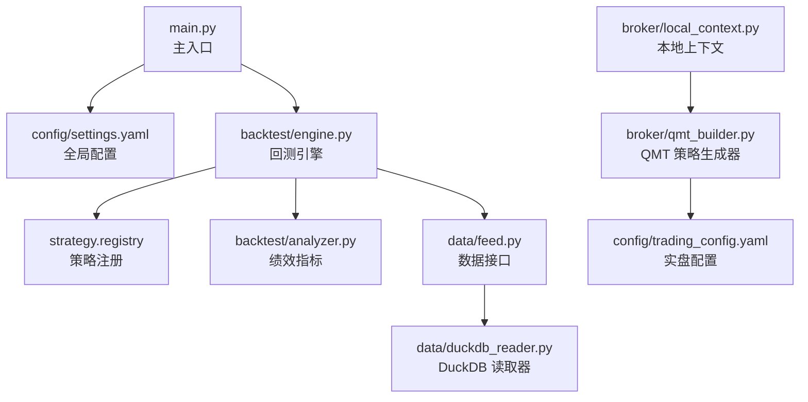
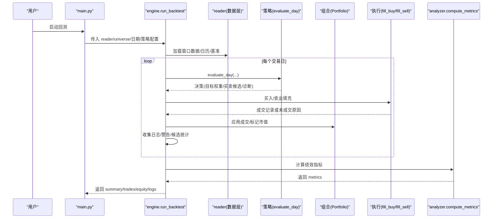
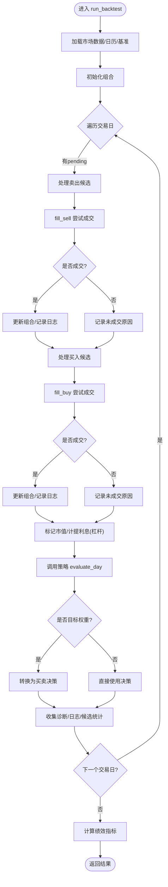
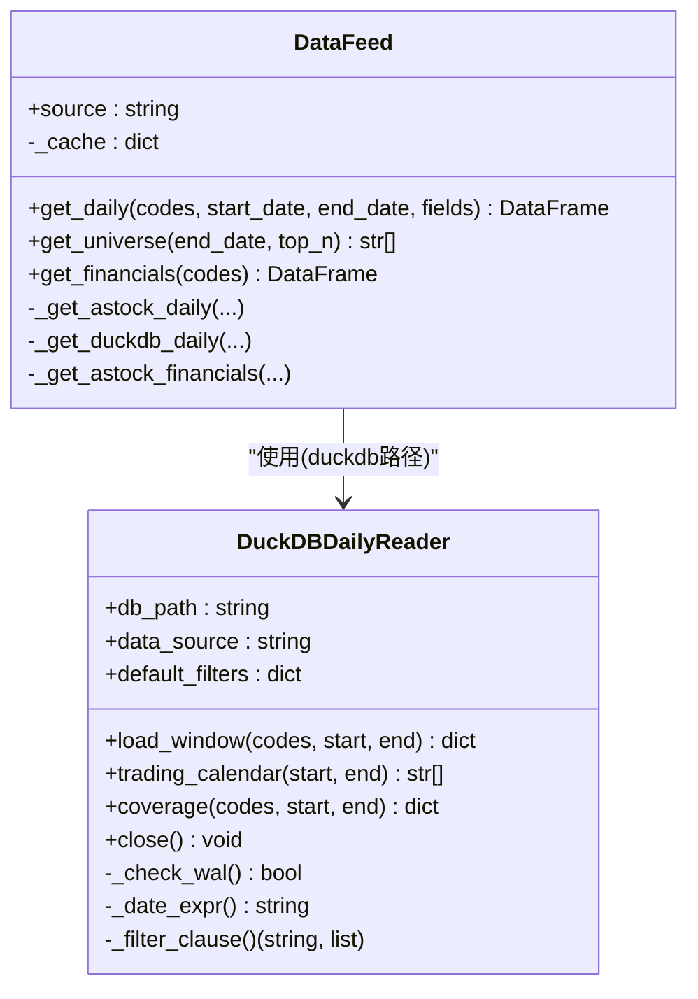
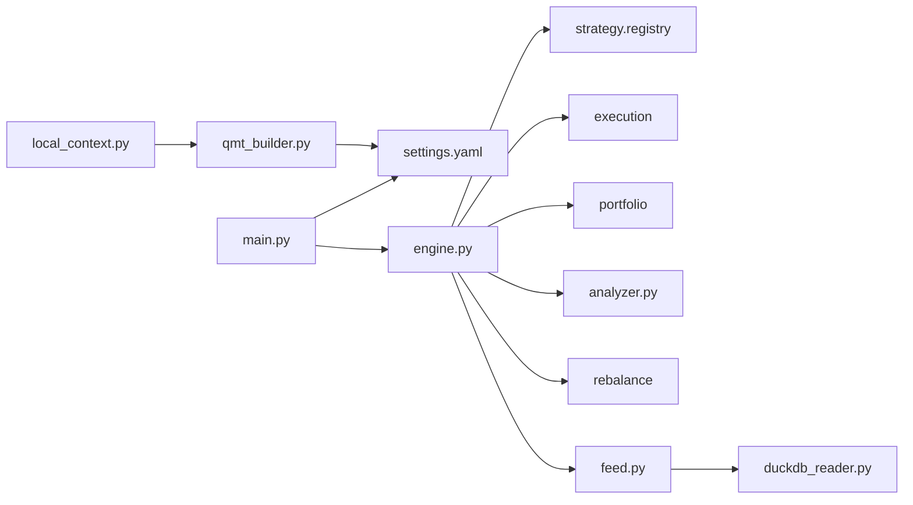

# 故障排查

<cite>
**本文引用的文件**   
- [main.py](file://main.py)
- [settings.yaml](file://config/settings.yaml)
- [trading_config.yaml](file://config/trading_config.yaml)
- [engine.py](file://backtest/engine.py)
- [analyzer.py](file://backtest/analyzer.py)
- [feed.py](file://data/feed.py)
- [duckdb_reader.py](file://data/duckdb_reader.py)
- [qmt_builder.py](file://broker/qmt_builder.py)
- [local_context.py](file://broker/local_context.py)
- [logs.txt](file://reports/20260803_204830_513b7f_atr_lowvol_fw/logs.txt)
- [test_connection_qmt.py](file://test_connection_qmt.py)
- [全局复利与踩坑日志.md](file://全局复利与踩坑日志.md)
</cite>

## 目录
1. [简介](#简介)
2. [项目结构](#项目结构)
3. [核心组件](#核心组件)
4. [架构总览](#架构总览)
5. [详细组件分析](#详细组件分析)
6. [依赖关系分析](#依赖关系分析)
7. [性能注意事项](#性能注意事项)
8. [故障排查指南](#故障排查指南)
9. [结论](#结论)
10. [附录](#附录)

## 简介
本文件面向 QuantLab 的运维与研发人员，提供系统化的故障排查手册。内容覆盖配置错误、数据错误、策略错误、执行错误的识别与修复；深入讲解性能瓶颈定位（CPU、内存、I/O）；给出日志分析方法（位置、关键信息、堆栈解读）；介绍内存泄漏检测思路（监控、GC 分析、定位技巧）；以及网络问题（QMT 连接、数据源连接失败、超时）和系统级问题（进程、端口、权限）的诊断流程。文档以仓库实际代码为依据，配合流程图与时序图帮助快速定位问题。

## 项目结构
QuantLab 采用“回测引擎 + 数据层 + 策略注册 + 实盘生成器”的分层架构：
- 入口与配置：主入口加载全局配置并调度回测或策略运行
- 回测引擎：每日循环驱动策略评估、成交模拟、组合更新与指标计算
- 数据层：统一数据接口与 DuckDB 读取器，屏蔽底层差异
- 策略层：扁平化策略注册与交易模型校验
- 实盘对接：QMT 策略生成器与本地上下文适配

**图表来源** 
- [main.py:21-34](file://main.py#L21-L34)
- [engine.py:237-260](file://backtest/engine.py#L237-L260)
- [feed.py:17-41](file://data/feed.py#L17-L41)
- [duckdb_reader.py:35-58](file://data/duckdb_reader.py#L35-L58)
- [qmt_builder.py:21-24](file://broker/qmt_builder.py#L21-L24)
- [trading_config.yaml:1-20](file://config/trading_config.yaml#L1-L20)

**章节来源**
- [main.py:21-34](file://main.py#L21-L34)
- [settings.yaml:1-69](file://config/settings.yaml#L1-L69)

## 核心组件
- 回测引擎：负责交易日循环、策略调用、成交模拟、组合记账、基准对齐与指标汇总
- 数据接口：统一 astock/DuckDB 数据获取，支持面板构建与财务数据拼接
- 指标计算：年化收益、最大回撤、夏普、胜率、持有天数、超额与跟踪误差等
- QMT 生成器：将策略逻辑打包为 GBK 编码的单文件策略，供 QMT 运行
- 本地上下文：在本地环境模拟 QMT 能力，缺失接口触发 fail-open 行为

**章节来源**
- [engine.py:237-322](file://backtest/engine.py#L237-L322)
- [analyzer.py:96-176](file://backtest/analyzer.py#L96-L176)
- [feed.py:17-41](file://data/feed.py#L17-L41)
- [duckdb_reader.py:90-132](file://data/duckdb_reader.py#L90-L132)
- [qmt_builder.py:33-71](file://broker/qmt_builder.py#L33-L71)
- [local_context.py:110-136](file://broker/local_context.py#L110-L136)

## 架构总览
下图展示从主入口到回测引擎、数据层、策略层与指标计算的完整调用链。

**图表来源** 
- [engine.py:324-443](file://backtest/engine.py#L324-L443)
- [engine.py:445-522](file://backtest/engine.py#L445-L522)
- [analyzer.py:96-176](file://backtest/analyzer.py#L96-L176)

## 详细组件分析

### 回测引擎（engine.py）
- 交易日循环：维护 pending 委托、逐日处理卖出与买入候选，记录未成交原因
- 基准对齐：按日历前向填充基准收盘价，断点或缺失时禁用 IR/excess
- 诊断聚合：累计 unique warnings、候选总数/通过数、未成交订单计数、策略特定指标均值
- 样本期告警：短样本或缺基准时输出提示

**图表来源** 
- [engine.py:324-443](file://backtest/engine.py#L324-L443)
- [engine.py:445-522](file://backtest/engine.py#L445-L522)

**章节来源**
- [engine.py:324-443](file://backtest/engine.py#L324-L443)
- [engine.py:445-522](file://backtest/engine.py#L445-L522)

### 数据层（feed.py / duckdb_reader.py）
- DataFeed：统一 astock 与 DuckDB 数据源，缓存 parquet 数据，构建 MultiIndex DataFrame
- DuckDBDailyReader：只读模式，按 data_source 选择 schema，WAL 检测，去重与过滤，返回统一列集

**图表来源** 
- [feed.py:17-41](file://data/feed.py#L17-L41)
- [feed.py:71-124](file://data/feed.py#L71-L124)
- [duckdb_reader.py:35-58](file://data/duckdb_reader.py#L35-L58)
- [duckdb_reader.py:90-132](file://data/duckdb_reader.py#L90-L132)

**章节来源**
- [feed.py:17-41](file://data/feed.py#L17-L41)
- [duckdb_reader.py:35-58](file://data/duckdb_reader.py#L35-L58)
- [duckdb_reader.py:90-132](file://data/duckdb_reader.py#L90-L132)

### 指标计算（analyzer.py）
- 年化因子：基于 252 交易日标准化
- 最大回撤：峰值追踪法
- 夏普比率：无风险利率为 0
- 配对交易：按时间顺序配对买卖，计算胜率与平均持有天数
- 基准对比：超额收益、信息比率、跟踪误差（需基准可用且长度匹配）

**章节来源**
- [analyzer.py:11-44](file://backtest/analyzer.py#L11-L44)
- [analyzer.py:46-94](file://backtest/analyzer.py#L46-L94)
- [analyzer.py:96-176](file://backtest/analyzer.py#L96-L176)

### QMT 策略生成器（qmt_builder.py）
- 从 settings.yaml 读取策略参数，组装 GBK 编码的 QMT 策略源码
- 包含生命周期 init/handlebar/exit、止损检查、调仓日判断、因子计算与下单

**章节来源**
- [qmt_builder.py:21-24](file://broker/qmt_builder.py#L21-L24)
- [qmt_builder.py:33-71](file://broker/qmt_builder.py#L33-L71)
- [qmt_builder.py:164-170](file://broker/qmt_builder.py#L164-L170)
- [qmt_builder.py:171-218](file://broker/qmt_builder.py#L171-L218)
- [qmt_builder.py:219-366](file://broker/qmt_builder.py#L219-L366)

### 本地上下文（local_context.py）
- 加载 QMT 策略源码（兼容 GBK 头但实际 UTF-8），临时写入并导入模块
- 对不支持的接口抛出异常，触发 fail-open 行为

**章节来源**
- [local_context.py:110-136](file://broker/local_context.py#L110-L136)
- [local_context.py:91-106](file://broker/local_context.py#L91-L106)

## 依赖关系分析
- main.py 加载 settings.yaml 并调度回测
- engine.py 依赖 strategy.registry、execution、portfolio、analyzer、rebalance
- feed.py 依赖 astock parquet 或 DuckDB 读取器
- qmt_builder.py 依赖 settings.yaml 与 numpy/pandas/yaml
- local_context.py 依赖 importlib 动态加载策略模块

**图表来源** 
- [main.py:21-34](file://main.py#L21-L34)
- [engine.py:20-26](file://backtest/engine.py#L20-L26)
- [feed.py:17-41](file://data/feed.py#L17-L41)
- [duckdb_reader.py:35-58](file://data/duckdb_reader.py#L35-L58)
- [qmt_builder.py:21-24](file://broker/qmt_builder.py#L21-L24)
- [local_context.py:110-136](file://broker/local_context.py#L110-L136)

**章节来源**
- [engine.py:20-26](file://backtest/engine.py#L20-L26)
- [feed.py:17-41](file://data/feed.py#L17-L41)
- [duckdb_reader.py:35-58](file://data/duckdb_reader.py#L35-L58)

## 性能注意事项
- CPU 使用率分析
  - 关注每日窗口切片与因子计算热点（evaluate_day 内部）
  - 使用 cProfile/py-spy 定位热点函数，减少不必要的 DataFrame 拷贝
- 内存占用监控
  - 观察 market_data 窗口大小与 cut_index 预计算带来的内存增长
  - 及时关闭 DuckDB 连接，避免 WAL 文件导致的额外开销
- I/O 性能优化
  - 使用 parquet 列裁剪与字段过滤，减少读取量
  - 合理设置 cache_dir 与 expire_days，避免重复 IO
- 基准数据对齐
  - 基准缺失或断点会导致 IR/excess 禁用，影响指标解读

[本节为通用指导，不直接分析具体文件]

## 故障排查指南

### 配置错误
- 症状
  - 回测无法启动或路径报错
  - 实盘配置未生效
- 常见原因
  - settings.yaml 中 data.astock.* 路径不存在或拼写错误
  - trading_config.yaml 中 account.path/session_id 与实际安装不一致
  - 策略名称与 registry 不匹配
- 解决步骤
  - 核对 settings.yaml 的 data 与 backtest 字段
  - 确认 trading_config.yaml 的 account.trading.risk.order.schedule 配置
  - 使用 main.py 的 --strategy 参数验证策略名

**章节来源**
- [settings.yaml:10-28](file://config/settings.yaml#L10-L28)
- [trading_config.yaml:1-20](file://config/trading_config.yaml#L1-L20)
- [main.py:95-104](file://main.py#L95-L104)

### 数据错误
- 症状
  - 空 universe 或 daily 数据为空
  - DuckDB 查询范围越界或 WAL 警告
- 常见原因
  - astock parquet 文件缺失或字段名不一致
  - DuckDB 数据库路径错误或 data_source 不匹配
  - 请求日期超出 coverage 范围
- 解决步骤
  - 检查 feed.py 的 ASTOCK_* 常量与文件存在性
  - 使用 duckdb_reader.coverage() 查看 min/max_date 与 n_codes
  - 确保 WAL 文件不存在或同步完成后重跑

**章节来源**
- [feed.py:71-76](file://data/feed.py#L71-L76)
- [duckdb_reader.py:90-98](file://data/duckdb_reader.py#L90-L98)
- [duckdb_reader.py:63-75](file://data/duckdb_reader.py#L63-L75)

### 策略错误
- 症状
  - evaluate_day 抛出异常或返回非法决策
  - target_weights 转换失败
- 常见原因
  - 策略未实现 ALLOWED_TRADING_MODELS
  - 因子计算出现 NaN/Inf 或字段缺失
  - 行业映射或基本面读取失败
- 解决步骤
  - 检查 strategy.registry 与策略模块命名
  - 在 engine.py 的 target_weights_to_decision 异常分支捕获并降级
  - 增加 fundamentals_reader 的 try/except 兜底

**章节来源**
- [engine.py:207-234](file://backtest/engine.py#L207-L234)
- [engine.py:421-433](file://backtest/engine.py#L421-L433)
- [engine.py:396-406](file://backtest/engine.py#L396-L406)

### 执行错误
- 症状
  - 大量 unfilled_order 日志，reason=below_min_lot
  - 持仓消失导致 position_gone
- 常见原因
  - 委托数量低于最小交易单位
  - 卖出时持仓已不存在（被其他逻辑平仓）
- 解决步骤
  - 调整 volume 计算逻辑，确保整手倍数
  - 在 pending 卖出前校验 pf.positions[code] 是否存在
  - 分析 logs.txt 中的 reason 分类统计

**章节来源**
- [engine.py:328-371](file://backtest/engine.py#L328-L371)
- [logs.txt:4708-4739](file://reports/20260803_204830_513b7f_atr_lowvol_fw/logs.txt#L4708-L4739)

### 日志分析方法
- 日志位置
  - 回测日志写入 reports/*/logs.txt
  - 控制台打印来自 engine 与 feed 的 log 语句
- 关键信息
  - [INFO] 填单成功：code/vol/price/amt
  - [ERROR] 未成交：reason=below_min_lot/position_gone
  - 诊断聚合：warnings_unique、unfilled_order_count、candidate_total_avg_per_day
- 堆栈解读
  - 优先定位 evaluate_day 与 target_weights_to_decision 的异常
  - 结合 analyzer 的 short sample 警告判断样本期不足

**章节来源**
- [engine.py:434-443](file://backtest/engine.py#L434-L443)
- [engine.py:490-522](file://backtest/engine.py#L490-L522)
- [logs.txt:5640-5659](file://reports/20260803_204830_513b7f_atr_lowvol_fw/logs.txt#L5640-L5659)

### 内存泄漏检测
- 监控手段
  - 使用 psutil/memory_profiler 跟踪 Python 进程 RSS
  - 观察 DuckDB 连接是否及时 close
- GC 分析
  - 启用 gc.set_debug(gc.DEBUG_LEAK) 定位未释放对象
  - 检查 DataFrame 视图与副本的引用计数
- 定位技巧
  - 在 evaluate_day 前后打点 memory_usage
  - 减少全局缓存 _cache 的生命周期，避免长期驻留

[本节为通用指导，不直接分析具体文件]

### 网络问题排查（QMT 连接）
- 症状
  - XtQuantTrader.connect 返回非 0
  - 订阅账户后资产查询为空
- 常见原因
  - QMT 路径或 session_id 配置错误
  - 账号未登录或权限不足
- 解决步骤
  - 使用 test_connection_qmt.py 进行连通性测试
  - 核对 trading_config.yaml 的 account.path/session_id/account.id
  - 检查防火墙与代理设置

**章节来源**
- [test_connection_qmt.py:10-53](file://test_connection_qmt.py#L10-L53)
- [trading_config.yaml:1-10](file://config/trading_config.yaml#L1-L10)

### 系统级故障排查
- 进程管理
  - 使用 tasklist/taskkill 或 ps/top 监控 Python 进程
  - 避免多实例同时访问同一 DuckDB 文件
- 端口冲突
  - QMT 本地服务端口被占用时重启 xttrader
- 权限问题
  - 确保对 E:/astock 与 E:/QuantLab/data/cache 有读写权限
  - 生成 GBK 策略文件时需具备写入目标目录权限

[本节为通用指导，不直接分析具体文件]

## 结论
QuantLab 的故障排查应围绕“配置—数据—策略—执行—日志—性能—网络—系统”八个维度展开。通过结构化日志与诊断聚合，可快速定位未成交与策略异常；借助数据层 WAL 检测与 coverage 校验，保障数据一致性；结合性能监控与内存分析，持续优化回测效率与稳定性。建议在生产部署前强制运行 checklist 与稳健性测试，确保集成层问题早发现早修复。

## 附录
- 常用命令
  - 启动回测：python main.py --strategy project_01
  - 生成 QMT 策略：python broker/qmt_builder.py
  - 连接测试：python test_connection_qmt.py
- 参考文档
  - 全局复利与踩坑日志：记录时间、编码、数据限制等实战经验

**章节来源**
- [main.py:95-104](file://main.py#L95-L104)
- [qmt_builder.py:382-386](file://broker/qmt_builder.py#L382-L386)
- [test_connection_qmt.py:10-53](file://test_connection_qmt.py#L10-L53)
- [全局复利与踩坑日志.md:109-130](file://全局复利与踩坑日志.md#L109-L130)