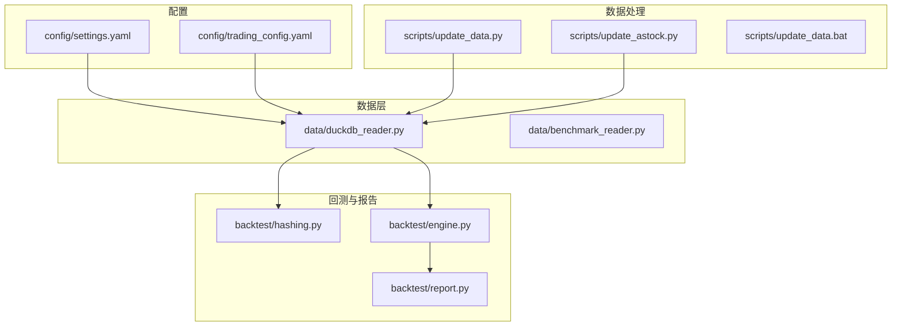
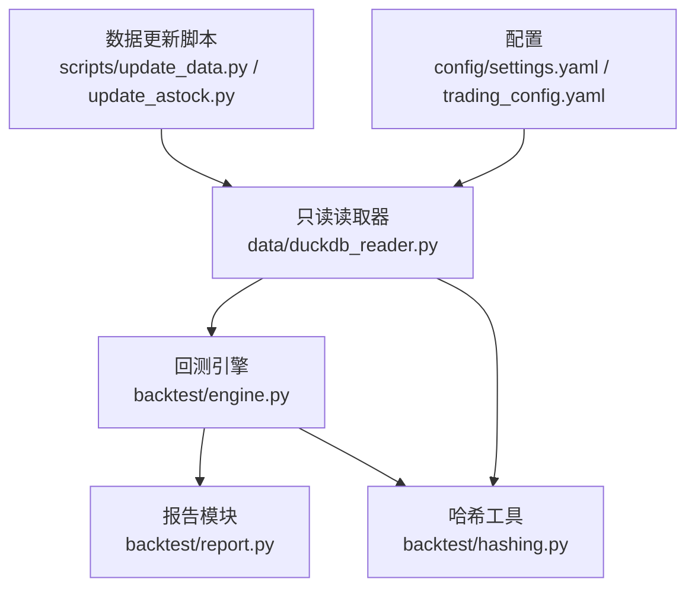
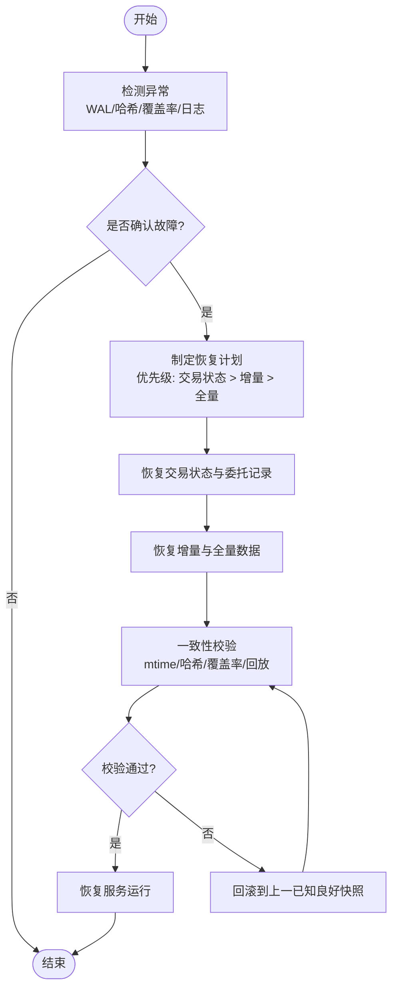
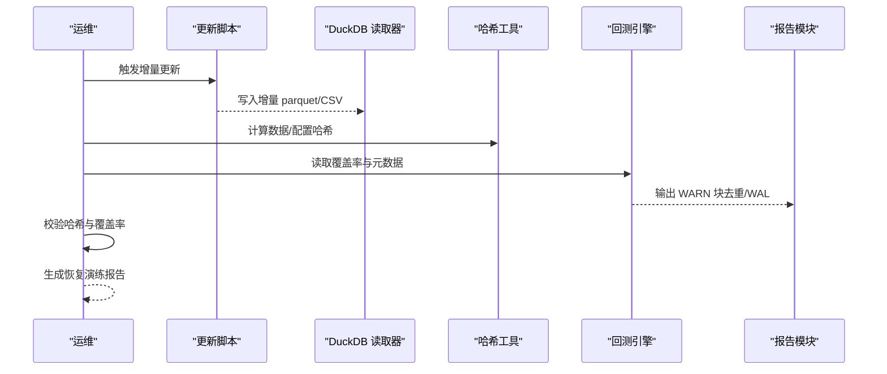
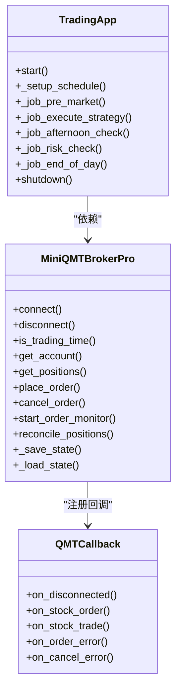
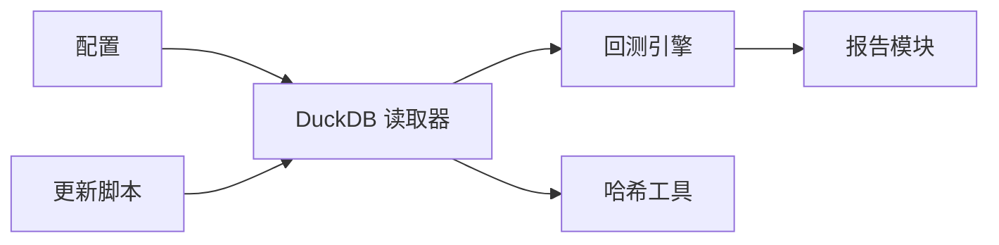

# 数据备份与恢复

<cite>
**本文引用的文件**   
- [settings.yaml](file://config/settings.yaml)
- [trading_config.yaml](file://config/trading_config.yaml)
- [duckdb_reader.py](file://data/duckdb_reader.py)
- [benchmark_reader.py](file://data/benchmark_reader.py)
- [hashing.py](file://backtest/hashing.py)
- [engine.py](file://backtest/engine.py)
- [report.py](file://backtest/report.py)
- [update_data.py](file://scripts/update_data.py)
- [update_astock.py](file://scripts/update_astock.py)
- [update_data.bat](file://scripts/update_data.bat)
- [start_trading.bat](file://start_trading.bat)
- [monitoring_indicators.md](file://projects/verification/results/monitoring_indicators.md)
- [logs.txt](file://reports/20260803_204830_513b7f_atr_lowvol_fw/logs.txt)
</cite>

## 目录
1. [引言](#引言)
2. [项目结构](#项目结构)
3. [核心组件](#核心组件)
4. [架构总览](#架构总览)
5. [详细组件分析](#详细组件分析)
6. [依赖关系分析](#依赖关系分析)
7. [性能考虑](#性能考虑)
8. [故障排查指南](#故障排查指南)
9. [结论](#结论)
10. [附录](#附录)

## 引言
本文件为 QuantLab 的数据备份与恢复提供系统化、可落地的方案，覆盖以下方面：
- 定期备份策略：全量、增量、差异备份的适用场景与配置方法
- 存储方案选型：本地、云、分布式存储及部署架构建议
- 灾难恢复流程：故障检测、恢复优先级、数据一致性验证
- 备份验证机制：完整性校验、恢复演练、性能基准
- 自动化运维：定时任务、监控告警、日志记录
- 归档与长期存储：冷热分层与生命周期管理

本方案基于仓库中现有数据读取、更新脚本、回测引擎与报告模块的能力进行设计，确保与既有系统无缝集成。

## 项目结构
QuantLab 的数据相关能力集中在 data、scripts、backtest、config 等目录：
- data：DuckDB 只读读取器、基准数据读取器
- scripts：数据更新脚本（parquet/CSV）、批处理脚本
- backtest：哈希计算、回测引擎、报告生成
- config：全局与实盘配置

图表来源 
- [settings.yaml:1-69](file://config/settings.yaml#L1-L69)
- [trading_config.yaml:1-62](file://config/trading_config.yaml#L1-L62)
- [duckdb_reader.py:1-215](file://data/duckdb_reader.py#L1-L215)
- [benchmark_reader.py:39-72](file://data/benchmark_reader.py#L39-L72)
- [update_data.py:1-135](file://scripts/update_data.py#L1-L135)
- [update_astock.py:151-178](file://scripts/update_astock.py#L151-L178)
- [update_data.bat:1-15](file://scripts/update_data.bat#L1-L15)
- [hashing.py:1-23](file://backtest/hashing.py#L1-L23)
- [engine.py:434-443](file://backtest/engine.py#L434-L443)
- [engine.py:554-578](file://backtest/engine.py#L554-L578)
- [report.py:78-108](file://backtest/report.py#L78-L108)

章节来源
- [settings.yaml:1-69](file://config/settings.yaml#L1-L69)
- [trading_config.yaml:1-62](file://config/trading_config.yaml#L1-L62)

## 核心组件
- DuckDB 只读读取器：统一封装 astock 行情数据的读取，支持 WAL 检测、去重统计、覆盖率检查
- 基准读取器：指数日线数据读取与时间序列加载
- 哈希工具：对数据、配置、股票池生成稳定哈希，用于版本化与一致性校验
- 回测引擎：汇总数据元信息、覆盖率、WAL 警告等，作为备份元数据的重要来源
- 报告模块：输出 WARN 块，包含数据去重、WAL 检测等关键质量信号
- 数据更新脚本：astock parquet 增量更新与 CSV 重建，是增量/差异备份的关键输入

章节来源
- [duckdb_reader.py:1-215](file://data/duckdb_reader.py#L1-L215)
- [benchmark_reader.py:39-72](file://data/benchmark_reader.py#L39-L72)
- [hashing.py:1-23](file://backtest/hashing.py#L1-L23)
- [engine.py:554-578](file://backtest/engine.py#L554-L578)
- [report.py:78-108](file://backtest/report.py#L78-L108)
- [update_data.py:1-135](file://scripts/update_data.py#L1-L135)

## 架构总览
下图展示备份与恢复在系统中的位置与交互：数据源通过更新脚本产出增量包；读取器以只读方式访问 DuckDB；回测引擎与报告模块消费数据并生成元数据与质量信号；备份策略基于这些元数据进行决策与执行。

图表来源 
- [update_data.py:1-135](file://scripts/update_data.py#L1-L135)
- [update_astock.py:151-178](file://scripts/update_astock.py#L151-L178)
- [duckdb_reader.py:1-215](file://data/duckdb_reader.py#L1-L215)
- [engine.py:554-578](file://backtest/engine.py#L554-L578)
- [hashing.py:1-23](file://backtest/hashing.py#L1-L23)
- [report.py:78-108](file://backtest/report.py#L78-L108)
- [settings.yaml:1-69](file://config/settings.yaml#L1-L69)
- [trading_config.yaml:1-62](file://config/trading_config.yaml#L1-L62)

## 详细组件分析

### 备份类型与适用场景
- 全量备份
  - 适用场景：初始构建、重大变更前后、周期性冷备
  - 触发条件：按周/月计划或数据源大版本升级
  - 实施要点：快照 DuckDB 主库与 WAL；同时备份 astock parquet 与 CSV 最新态；记录哈希与覆盖率元数据
- 增量备份
  - 适用场景：每日盘中/盘后增量同步
  - 触发条件：update_data.py 发现新日期或新 code 数据
  - 实施要点：仅备份增量包（增量 parquet）与对应交易日志；记录 db_mtime 与数据哈希变化
- 差异备份
  - 适用场景：快速恢复至最近一致点，减少恢复窗口
  - 触发条件：对比上次全量后的变更集
  - 实施要点：基于哈希与 mtime 判断变更范围，仅打包差异文件

章节来源
- [update_data.py:1-135](file://scripts/update_data.py#L1-L135)
- [duckdb_reader.py:59-75](file://data/duckdb_reader.py#L59-L75)
- [hashing.py:10-20](file://backtest/hashing.py#L10-L20)

### 存储方案与部署架构
- 本地存储
  - 优点：低延迟、易实现；适合单机或小规模团队
  - 风险：单点故障、容量受限
  - 建议：RAID + 外部磁盘阵列；定期复制到 NAS
- 云存储
  - 优点：弹性扩容、高可用、跨区域复制
  - 风险：网络抖动、成本波动
  - 建议：对象存储（如 OSS/S3）+ 版本控制；加密传输与静态加密
- 分布式存储
  - 优点：高吞吐、强一致副本、跨机房容灾
  - 风险：运维复杂度高
  - 建议：Ceph/MinIO 集群；结合快照与纠删码

章节来源
- [settings.yaml:10-19](file://config/settings.yaml#L10-L19)
- [trading_config.yaml:43-46](file://config/trading_config.yaml#L43-L46)

### 灾难恢复流程
- 故障检测
  - 指标：WAL 存在、数据哈希突变、覆盖率异常、日志错误激增
  - 手段：读取器 WAL 检测、引擎元数据、报告 WARN 块、日志扫描
- 恢复优先级
  - 第一优先：交易状态与委托记录（broker state）
  - 第二优先：当日增量数据与缓存
  - 第三优先：历史全量与增量集合
- 数据一致性验证
  - 校验：数据库 mtime、哈希比对、覆盖率与去重计数核对
  - 测试：回放最近交易日，比较回测结果与基线

章节来源
- [duckdb_reader.py:63-75](file://data/duckdb_reader.py#L63-L75)
- [engine.py:554-578](file://backtest/engine.py#L554-L578)
- [report.py:78-108](file://backtest/report.py#L78-L108)
- [logs.txt:5640-6852](file://reports/20260803_204830_513b7f_atr_lowvol_fw/logs.txt#L5640-L6852)

### 备份验证机制
- 完整性检查
  - 使用哈希工具对数据与配置生成指纹，比对备份与在线一致性
- 恢复测试
  - 在隔离环境恢复快照，运行回测与基准对比，确保结果一致
- 性能基准
  - 记录读取时延、查询吞吐、合并/去重耗时，评估备份粒度与压缩策略

图表来源 
- [update_data.py:1-135](file://scripts/update_data.py#L1-L135)
- [duckdb_reader.py:146-205](file://data/duckdb_reader.py#L146-L205)
- [hashing.py:1-23](file://backtest/hashing.py#L1-L23)
- [engine.py:554-578](file://backtest/engine.py#L554-L578)
- [report.py:78-108](file://backtest/report.py#L78-L108)

### 自动化配置与运维工具
- 定时任务
  - Windows：使用 .bat 调用 Python 脚本，配合任务计划程序
  - Linux：cron 调度 update_data.py 与备份脚本
- 监控告警
  - 指标：净值、回撤、持仓集中度、换手率、信号质量（见监控指标文档）
  - 渠道：企业微信/钉钉 webhook（已在交易配置中预留）
- 日志记录
  - 日志分级与滚动（settings.yaml 中 logging 配置）
  - 交易与订单日志（logs.txt），便于问题定位

图表来源 
- [start_trading.bat:1-51](file://start_trading.bat#L1-L51)
- [trading_config.yaml:30-41](file://config/trading_config.yaml#L30-L41)
- [monitoring_indicators.md:1-63](file://projects/verification/results/monitoring_indicators.md#L1-L63)

章节来源
- [update_data.bat:1-15](file://scripts/update_data.bat#L1-L15)
- [start_trading.bat:1-51](file://start_trading.bat#L1-L51)
- [monitoring_indicators.md:1-63](file://projects/verification/results/monitoring_indicators.md#L1-L63)

### 数据归档与长期存储规划
- 冷热分层
  - 热数据：近 N 日增量与缓存（cache_dir）
  - 温数据：月度快照与近期全量
  - 冷数据：历史全量与重要里程碑快照
- 生命周期管理
  - 自动清理过期缓存与临时文件（.gitignore 已忽略部分缓存）
  - 对象存储设置版本控制与保留策略
- 合规与审计
  - 保留关键日志与报告，满足审计回溯需求

章节来源
- [settings.yaml:16-19](file://config/settings.yaml#L16-L19)
- [.gitignore:11-14](file://.gitignore#L11-L14)

## 依赖关系分析
- DuckDB 读取器依赖配置中的 data_source 与路径；默认过滤 adjustment/source
- 回测引擎依赖读取器的覆盖率与元数据，以及哈希工具生成的指纹
- 报告模块依赖引擎输出的摘要，输出关键 WARN 项
- 更新脚本与 bat 驱动数据生产，形成增量/差异备份的基础

图表来源 
- [settings.yaml:10-19](file://config/settings.yaml#L10-L19)
- [trading_config.yaml:43-46](file://config/trading_config.yaml#L43-L46)
- [duckdb_reader.py:42-57](file://data/duckdb_reader.py#L42-L57)
- [engine.py:554-578](file://backtest/engine.py#L554-L578)
- [hashing.py:1-23](file://backtest/hashing.py#L1-L23)
- [report.py:78-108](file://backtest/report.py#L78-L108)

章节来源
- [duckdb_reader.py:42-57](file://data/duckdb_reader.py#L42-L57)
- [engine.py:554-578](file://backtest/engine.py#L554-L578)
- [report.py:78-108](file://backtest/report.py#L78-L108)

## 性能考虑
- 读取优化
  - 使用只读连接与索引列过滤，避免全表扫描
  - 合理选择 date 表达式与过滤条件，减少 QUALIFY 开销
- 备份效率
  - 增量优先，差异次之，全量周期化
  - 并行处理（ProcessPoolExecutor）提升批量更新速度
- 存储与网络
  - 压缩与分片策略平衡 I/O 与 CPU
  - 就近存储与 CDN 加速下载

[本节为通用指导，不直接分析具体文件]

## 故障排查指南
- WAL 同步冲突
  - 现象：检测到 .wal 文件，data_hash 不稳定
  - 处理：等待同步完成，重新运行回测并确认哈希一致
- 数据去重与覆盖率异常
  - 现象：dedup_count 非零、universe_coverage 缺失代码
  - 处理：检查上游数据源与去重逻辑，必要时重建 parquet
- 日志错误集中
  - 现象：logs.txt 中出现大量 unfilled_order 错误
  - 处理：核查最小交易单位、资金与滑点参数，调整下单逻辑

章节来源
- [duckdb_reader.py:63-75](file://data/duckdb_reader.py#L63-L75)
- [engine.py:554-578](file://backtest/engine.py#L554-L578)
- [report.py:78-108](file://backtest/report.py#L78-L108)
- [logs.txt:5640-6852](file://reports/20260803_204830_513b7f_atr_lowvol_fw/logs.txt#L5640-L6852)

## 结论
QuantLab 的数据备份与恢复应围绕“只读读取 + 增量更新 + 哈希校验 + 报告质量信号”的核心闭环展开。通过全量/增量/差异的组合策略、多存储层级与自动化运维，可实现高可用、可追溯、可验证的数据治理体系。建议在上线前完成恢复演练与性能基准，持续优化备份窗口与恢复目标。

[本节为总结性内容，不直接分析具体文件]

## 附录
- 常用命令
  - 数据更新：python scripts/update_data.py
  - 启动交易：start_trading.bat
  - 定时任务：Windows 任务计划程序或 cron
- 关键路径
  - 数据路径：E:/astock/daily/stock_daily.parquet
  - 缓存目录：E:/QuantLab/data/cache
  - 日志目录：E:/QuantLab/logs

章节来源
- [update_data.py:1-135](file://scripts/update_data.py#L1-L135)
- [start_trading.bat:1-51](file://start_trading.bat#L1-L51)
- [settings.yaml:31-35](file://config/settings.yaml#L31-L35)