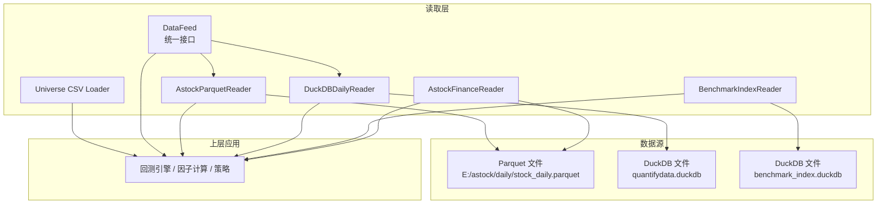
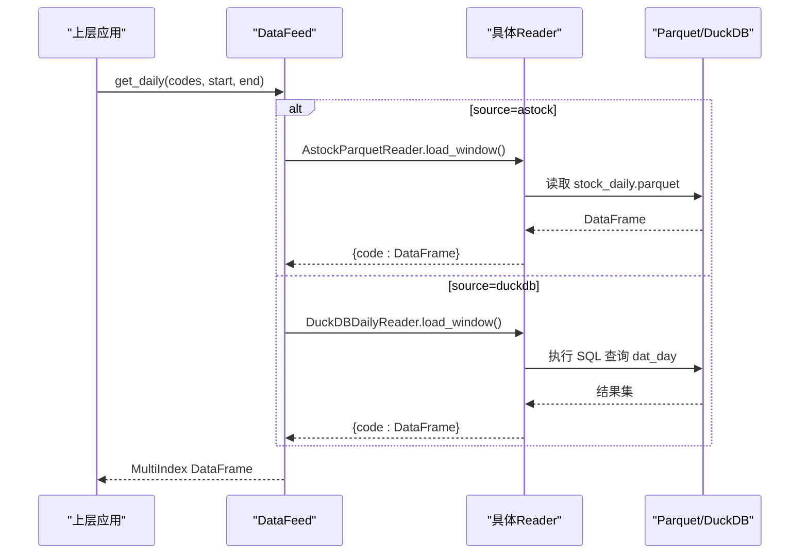
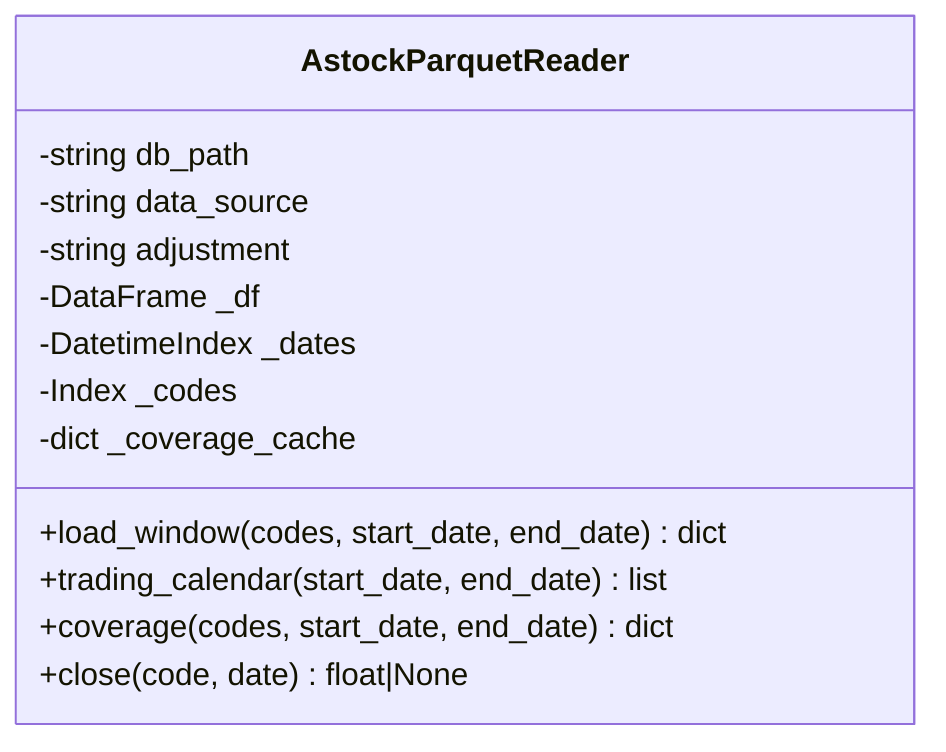
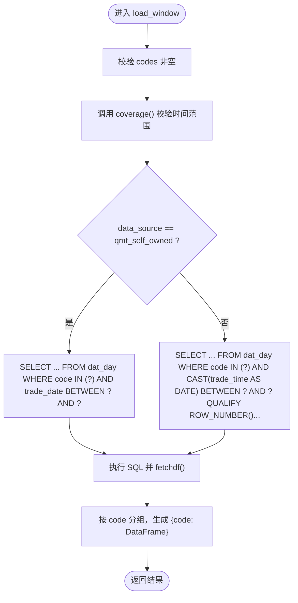
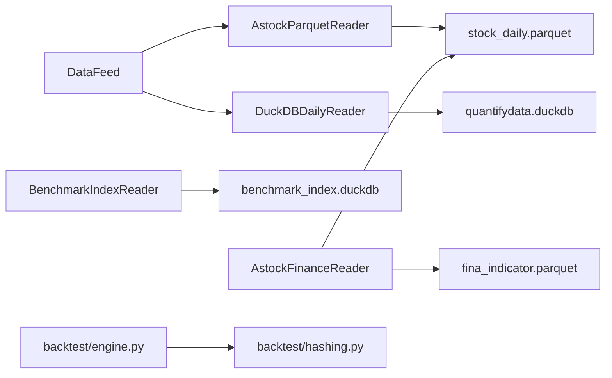

# 数据存储架构

<cite>
**本文引用的文件**   
- [data/duckdb_reader.py](file://data/duckdb_reader.py)
- [data/astock_reader.py](file://data/astock_reader.py)
- [data/feed.py](file://data/feed.py)
- [data/universe.py](file://data/universe.py)
- [data/astock_finance_reader.py](file://data/astock_finance_reader.py)
- [data/benchmark_reader.py](file://data/benchmark_reader.py)
- [scripts/update_data.py](file://scripts/update_data.py)
- [scripts/update_astock.py](file://scripts/update_astock.py)
- [config/settings.yaml](file://config/settings.yaml)
- [backtest/engine.py](file://backtest/engine.py)
- [backtest/hashing.py](file://backtest/hashing.py)
</cite>

## 目录
1. [简介](#简介)
2. [项目结构](#项目结构)
3. [核心组件](#核心组件)
4. [架构总览](#架构总览)
5. [详细组件分析](#详细组件分析)
6. [依赖关系分析](#依赖关系分析)
7. [性能与调优](#性能与调优)
8. [故障排查指南](#故障排查指南)
9. [结论](#结论)
10. [附录](#附录)

## 简介
本文件面向 QuantLab 的数据存储与读取体系，围绕 Parquet 文件格式与 DuckDB 数据库两大核心，系统阐述其在量化数据场景中的优势、使用方式与最佳实践。内容涵盖：
- Parquet 列式存储、压缩与 Schema 设计要点
- DuckDB 内存计算、向量化执行与并发访问特性
- 数据分区策略（按时间、按股票代码、复合分区）
- 索引设计与优化（主键、复合、部分索引思路）
- 存储性能调优（缓冲区、查询、批量操作）
- 数据迁移工具与版本兼容性考虑

## 项目结构
QuantLab 的数据层由“统一接口 + 多实现 Reader”构成：
- DataFeed 提供统一入口，支持 astock parquet 与 duckdb 两种后端
- AstockParquetReader 直接读取本地 Parquet 文件
- DuckDBDailyReader 通过只读连接访问 DuckDB 表
- BenchmarkIndexReader 独立读取基准指数 DuckDB
- AstockFinanceReader 提供 PIT 安全的财务指标与 PE 快照
- Universe CSV 加载器负责股票池校验与去重

图表来源
- [data/feed.py:17-124](file://data/feed.py#L17-L124)
- [data/astock_reader.py:25-116](file://data/astock_reader.py#L25-L116)
- [data/duckdb_reader.py:35-132](file://data/duckdb_reader.py#L35-L132)
- [data/benchmark_reader.py:21-72](file://data/benchmark_reader.py#L21-L72)
- [data/astock_finance_reader.py:26-191](file://data/astock_finance_reader.py#L26-L191)
- [data/universe.py:27-61](file://data/universe.py#L27-L61)

章节来源
- [data/feed.py:17-124](file://data/feed.py#L17-L124)
- [config/settings.yaml:10-19](file://config/settings.yaml#L10-L19)

## 核心组件
- DataFeed：统一数据源抽象，内部根据 source 切换 astock 或 duckdb 路径；提供 get_daily、get_universe、get_financials 等能力
- AstockParquetReader：只读 Parquet 读取，构造 MultiIndex 以 trade_date/ts_code 为键，支持 raw/qfq/hfq 调整
- DuckDBDailyReader：只读 DuckDB 连接，支持 v0.2/v0.3 两套 schema，默认过滤 adjustment/source，输出统一列
- BenchmarkIndexReader：独立读取 benchmark_index.duckdb 的 index_daily 表，返回日期序列
- AstockFinanceReader：PIT 安全读取财务指标与每日 PE 快照，避免未来函数
- Universe CSV Loader：校验代码格式、去重、启用标记处理

章节来源
- [data/feed.py:17-124](file://data/feed.py#L17-L124)
- [data/astock_reader.py:25-116](file://data/astock_reader.py#L25-L116)
- [data/duckdb_reader.py:35-132](file://data/duckdb_reader.py#L35-L132)
- [data/benchmark_reader.py:21-72](file://data/benchmark_reader.py#L21-L72)
- [data/astock_finance_reader.py:26-191](file://data/astock_finance_reader.py#L26-L191)
- [data/universe.py:27-61](file://data/universe.py#L27-L61)

## 架构总览
整体采用“统一接口 + 多实现 Reader”的分层设计，上层无需关心底层是 Parquet 还是 DuckDB。关键流程如下：

图表来源
- [data/feed.py:28-124](file://data/feed.py#L28-L124)
- [data/astock_reader.py:71-116](file://data/astock_reader.py#L71-L116)
- [data/duckdb_reader.py:90-132](file://data/duckdb_reader.py#L90-L132)

## 详细组件分析

### Parquet 读取与使用（AstockParquetReader）
- 列裁剪：仅读取回测所需列，降低内存占用
- 索引构建：将 trade_date/ts_code 作为 MultiIndex，便于按时间与代码筛选
- 复权处理：raw/qfq/hfq 三种模式，基于 adj_factor 对价格列进行缩放
- 覆盖度与交易日历：提供 coverage/trading_calendar 方法，便于范围校验与缺失检测

图表来源
- [data/astock_reader.py:25-116](file://data/astock_reader.py#L25-L116)

章节来源
- [data/astock_reader.py:25-116](file://data/astock_reader.py#L25-L116)

### DuckDB 读取与双 Schema 兼容（DuckDBDailyReader）
- 只读连接：read_only=True，禁止写与 ATTACH
- 双 Schema：jince_zhisuan（v0.2，trade_time 时间戳，需 QUALIFY 去重）与 qmt_self_owned（v0.3，trade_date DATE，唯一性由上游保证）
- 默认过滤：qmt_self_owned 默认 adjustment='hfq' 且 source='xtquant'
- WAL 检测：若存在 .wal 文件，提示同步中，影响 data_hash 稳定性

图表来源
- [data/duckdb_reader.py:90-132](file://data/duckdb_reader.py#L90-L132)

章节来源
- [data/duckdb_reader.py:35-132](file://data/duckdb_reader.py#L35-L132)

### 基准指数读取（BenchmarkIndexReader）
- 独立 reader，避免与 dat_day schema 混淆
- 返回 (date_str, close_float) 升序列表，便于基准曲线构建

章节来源
- [data/benchmark_reader.py:21-72](file://data/benchmark_reader.py#L21-L72)

### 财务数据与 PIT 安全（AstockFinanceReader）
- 财务指标：fina_indicator.parquet，按公告日 ann_date/f_ann_date <= asof_date 可见，取最大 end_date
- 每日 PE：stock_daily.parquet 包含 pe/pe_ttm，天然反前瞻
- 评分便捷：get_fundamentals_for_scoring 聚合 PE 字段供打分

章节来源
- [data/astock_finance_reader.py:26-191](file://data/astock_finance_reader.py#L26-L191)

### 统一接口（DataFeed）
- 根据 source 选择 astock 或 duckdb 路径
- get_universe 基于成交额排序选取股票池
- get_panel 兼容旧接口，组装面板数据与财务填充

章节来源
- [data/feed.py:17-124](file://data/feed.py#L17-L124)

### 股票池校验（Universe CSV Loader）
- 首列必须为 code，正则校验 SZ/SH 后缀
- enabled 字段容错处理，重复 code 保留首次
- 空集合抛出异常

章节来源
- [data/universe.py:27-61](file://data/universe.py#L27-L61)

## 依赖关系分析
- DataFeed 依赖 AstockParquetReader 与 DuckDBDailyReader，二者实现相同接口
- AstockFinanceReader 依赖 stock_daily.parquet 与 fina_indicator.parquet
- BenchmarkIndexReader 独立于 dat_day 表，读取 index_daily
- backtest/engine.py 集成 data_hash、universe_hash、data_coverage 等信息用于可复现性
- backtest/hashing.py 提供统一的哈希计算工具

图表来源
- [data/feed.py:17-124](file://data/feed.py#L17-L124)
- [data/astock_reader.py:25-116](file://data/astock_reader.py#L25-L116)
- [data/duckdb_reader.py:35-132](file://data/duckdb_reader.py#L35-L132)
- [data/astock_finance_reader.py:26-191](file://data/astock_finance_reader.py#L26-L191)
- [data/benchmark_reader.py:21-72](file://data/benchmark_reader.py#L21-L72)
- [backtest/engine.py:554-578](file://backtest/engine.py#L554-L578)
- [backtest/hashing.py:1-23](file://backtest/hashing.py#L1-L23)

章节来源
- [backtest/engine.py:554-578](file://backtest/engine.py#L554-L578)
- [backtest/hashing.py:1-23](file://backtest/hashing.py#L1-L23)

## 性能与调优

### Parquet 文件格式的优势与使用场景
- 列式存储：按列物理组织，适合 OLAP 分析与因子计算中常见的列投影与聚合
- 压缩算法：内置多种压缩（如 Snappy、ZSTD），结合列类型统计可实现高压缩比
- Schema 设计：建议显式声明列类型与可选字段，减少元数据开销；在读取时做列裁剪以降低 I/O 与内存
- 适用场景：历史行情、财务指标快照、基准指数序列等静态或增量更新的数据集

### DuckDB 的设计理念与高级特性
- 内存计算：查询直接在内存中执行，避免频繁磁盘 IO
- 向量化执行：按列向量运算，提升 CPU 缓存命中率与吞吐
- 并发访问：只读模式下多个进程/线程可并发读取同一 DuckDB 文件
- 适用场景：大规模历史数据的快速切片、窗口聚合、跨表关联

### 数据分区策略（最佳实践）
- 按时间分区：将数据按年/月切分，便于增量更新与范围扫描
- 按股票代码分区：当单文件过大时可按 code 拆分，提高并行读取效率
- 复合分区：time+code 组合，兼顾时间窗口与标的维度筛选
- 注意：当前实现以单一 stock_daily.parquet 为主，如需扩展可按上述策略拆分

### 索引设计与优化
- 主键索引：在 DuckDB 中可通过约束或外部索引加速唯一性查询
- 复合索引：针对常用查询条件（如 code+trade_date）建立复合索引
- 部分索引：对活跃子集（如特定 source/adjustment）建立部分索引，减少索引体积
- 在 Parquet 层面：利用列顺序与排序（如按 trade_date/ts_code 排序）提升扫描效率

### 存储性能调优指南
- 缓冲区配置：合理设置 Python 进程内存上限与 Pandas 缓冲大小，避免 OOM
- 查询优化：优先使用列裁剪、范围过滤与预过滤（default_filters）
- 批量操作：合并多次写入为一次原子替换（见 update_astock.py 的 atomic_write）
- 缓存策略：启用 DataFeed.cache 目录与过期策略，减少重复 I/O

章节来源
- [data/astock_reader.py:47-66](file://data/astock_reader.py#L47-L66)
- [data/duckdb_reader.py:54-57](file://data/duckdb_reader.py#L54-L57)
- [config/settings.yaml:16-19](file://config/settings.yaml#L16-L19)
- [scripts/update_astock.py:42-49](file://scripts/update_astock.py#L42-L49)

## 故障排查指南
- WAL 警告：DuckDBDailyReader 检测到 .wal 文件时提示同步中，可能导致 data_hash 不稳定，应等待同步完成再运行
- 文件缺失：若 Parquet/DuckDB 文件不存在，会抛出 FileNotFoundError，需在调用方降级处理
- 范围越界：load_window 会校验请求区间是否在 coverage 范围内，越界将抛异常
- 数据缺失：coverage.universe_coverage 可识别缺失 code，便于补数或跳过

章节来源
- [data/duckdb_reader.py:63-75](file://data/duckdb_reader.py#L63-L75)
- [data/astock_reader.py:77-91](file://data/astock_reader.py#L77-L91)
- [data/duckdb_reader.py:90-98](file://data/duckdb_reader.py#L90-L98)
- [data/astock_reader.py:128-161](file://data/astock_reader.py#L128-L161)

## 结论
QuantLab 的数据存储架构以“统一接口 + 多实现 Reader”为核心，结合 Parquet 的列式高效存储与 DuckDB 的内存向量化执行，实现了高性能、可扩展、易维护的量化数据管线。通过合理的分区与索引策略、严格的 WAL 与覆盖度检查、以及完善的迁移与哈希机制，保障了数据一致性与回测可复现性。

## 附录

### 数据迁移工具使用方法
- scripts/update_data.py：一键更新 astock parquet 与衍生 CSV，支持增量合并与去重
- scripts/update_astock.py：按周期/增量包合并，原子写入避免中间态损坏

章节来源
- [scripts/update_data.py:1-135](file://scripts/update_data.py#L1-L135)
- [scripts/update_astock.py:42-118](file://scripts/update_astock.py#L42-L118)

### 版本兼容性考虑
- DuckDB 双 Schema：jince_zhisuan（v0.2）与 qmt_self_owned（v0.3）通过 data_source 显式切换
- Parquet 列名与索引：AstockParquetReader 兼容既有 MultiIndex 与列名差异
- 哈希与元数据：engine.py 记录 data_hash、universe_hash、data_coverage 等，确保不同版本间可追溯

章节来源
- [data/duckdb_reader.py:4-20](file://data/duckdb_reader.py#L4-L20)
- [data/astock_reader.py:57-66](file://data/astock_reader.py#L57-L66)
- [backtest/engine.py:554-578](file://backtest/engine.py#L554-L578)