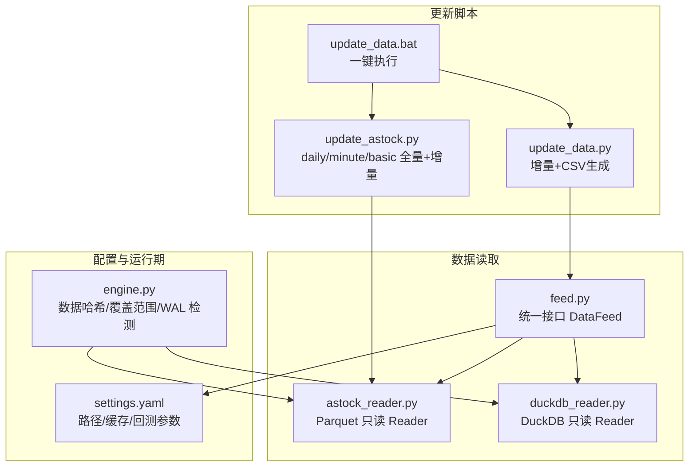
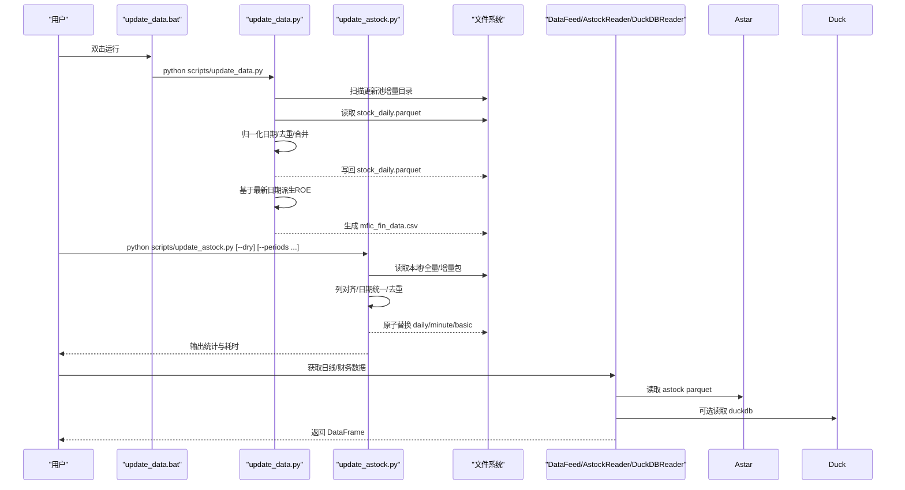
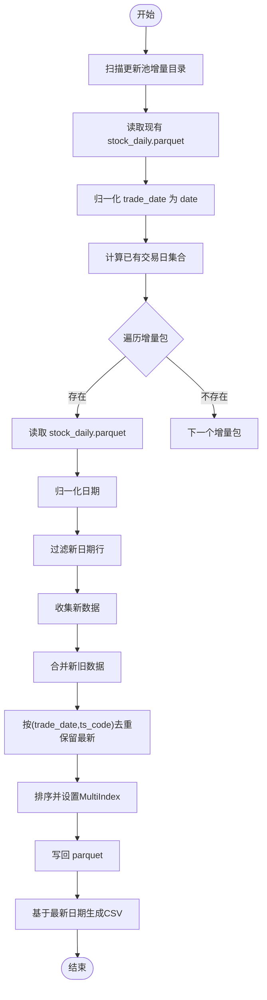
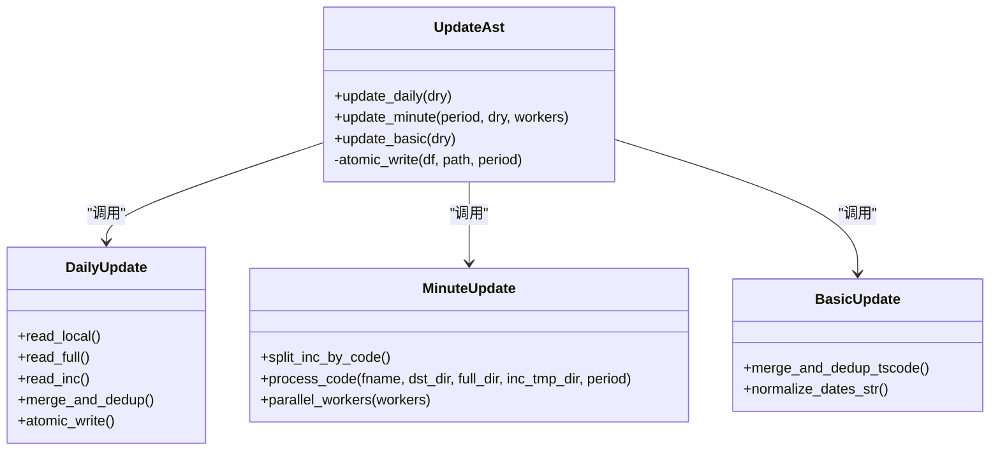
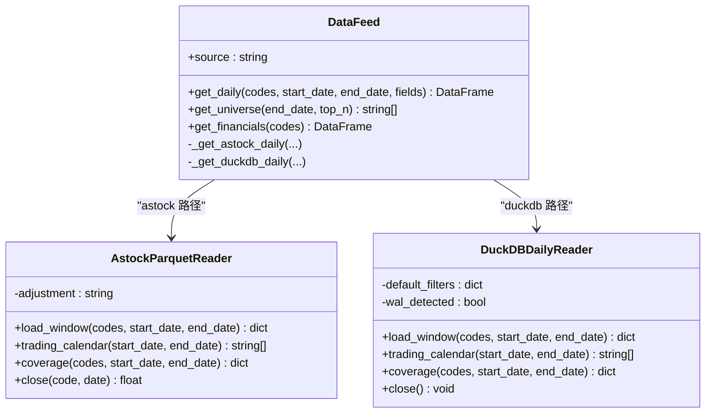
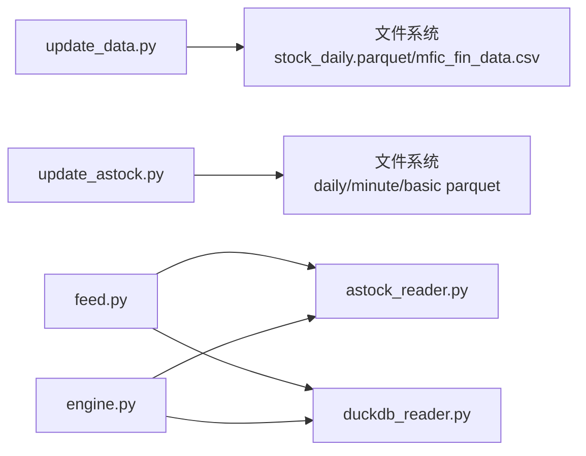

# 数据更新机制

<cite>
**本文引用的文件**   
- [scripts/update_data.py](file://scripts/update_data.py)
- [scripts/update_astock.py](file://scripts/update_astock.py)
- [scripts/update_data.bat](file://scripts/update_data.bat)
- [data/feed.py](file://data/feed.py)
- [data/astock_reader.py](file://data/astock_reader.py)
- [data/duckdb_reader.py](file://data/duckdb_reader.py)
- [config/settings.yaml](file://config/settings.yaml)
- [backtest/engine.py](file://backtest/engine.py)
</cite>

## 目录
1. [简介](#简介)
2. [项目结构](#项目结构)
3. [核心组件](#核心组件)
4. [架构总览](#架构总览)
5. [详细组件分析](#详细组件分析)
6. [依赖关系分析](#依赖关系分析)
7. [性能与存储优化](#性能与存储优化)
8. [故障排查指南](#故障排查指南)
9. [结论](#结论)
10. [附录：最佳实践与自动化建议](#附录最佳实践与自动化建议)

## 简介
本文件系统化阐述 QuantLab 的数据更新机制，覆盖增量更新策略、全量更新流程、自动化脚本使用、最佳实践与故障排查。重点包括：
- 增量更新：如何识别增量目录、检测新日期、合并新数据并去重
- 全量更新：数据源扫描、格式标准化、重复数据处理、原子写入
- 自动化：命令行参数、批处理文件配置、错误处理与日志
- 最佳实践：更新频率、存储空间管理、性能优化技巧
- 故障排查：常见错误诊断、数据一致性检查、回滚策略

## 项目结构
与数据更新相关的核心文件分布如下：
- 增量与全量更新脚本：scripts/update_data.py、scripts/update_astock.py
- 批处理入口：scripts/update_data.bat
- 数据读取接口与读者：data/feed.py、data/astock_reader.py、data/duckdb_reader.py
- 全局配置：config/settings.yaml
- 数据一致性记录（哈希、覆盖范围等）：backtest/engine.py

图表来源
- [scripts/update_data.py:1-135](file://scripts/update_data.py#L1-L135)
- [scripts/update_astock.py:1-219](file://scripts/update_astock.py#L1-L219)
- [scripts/update_data.bat:1-15](file://scripts/update_data.bat#L1-L15)
- [data/feed.py:1-197](file://data/feed.py#L1-L197)
- [data/astock_reader.py:1-192](file://data/astock_reader.py#L1-L192)
- [data/duckdb_reader.py:1-215](file://data/duckdb_reader.py#L1-L215)
- [config/settings.yaml:1-69](file://config/settings.yaml#L1-L69)
- [backtest/engine.py:554-578](file://backtest/engine.py#L554-L578)

章节来源
- [scripts/update_data.py:1-135](file://scripts/update_data.py#L1-L135)
- [scripts/update_astock.py:1-219](file://scripts/update_astock.py#L1-L219)
- [scripts/update_data.bat:1-15](file://scripts/update_data.bat#L1-L15)
- [data/feed.py:1-197](file://data/feed.py#L1-L197)
- [data/astock_reader.py:1-192](file://data/astock_reader.py#L1-L192)
- [data/duckdb_reader.py:1-215](file://data/duckdb_reader.py#L1-L215)
- [config/settings.yaml:1-69](file://config/settings.yaml#L1-L69)
- [backtest/engine.py:554-578](file://backtest/engine.py#L554-L578)

## 核心组件
- 增量更新器（update_data.py）
  - 扫描“行情数据更新池”中名称含“增量”的目录，定位 stock_daily.parquet
  - 读取现有 astock parquet，归一化日期类型，计算已有交易日集合
  - 对每个增量包提取“新日期”，拼接为新数据，合并后按 (trade_date, ts_code) 去重保留最新
  - 输出新的 parquet；随后基于最新日期的字段派生 ROE 并生成 CSV（GBK 编码）
- 全量/增量综合更新器（update_astock.py）
  - daily：本地(<2026-01-01) + 全量包(2026年某段) + 增量包，统一列与日期类型，去重后原子替换
  - minute：按周期逐 code 拆分增量包，合并本地(<2026) + 全量 + 增量，保持 MultiIndex，原子替换
  - basic：按 ts_code 去重合并基础信息，日期列统一为字符串 YYYYMMDD
  - 支持 --dry 模式仅统计不落盘；支持 --periods 指定分钟周期；支持 --workers 并行
- 数据读取接口（feed.py / astock_reader.py / duckdb_reader.py）
  - DataFeed 提供统一 get_daily/get_universe/get_financials 接口，内部根据 source 选择 astock 或 duckdb 路径
  - AstockParquetReader 以只读方式加载 parquet，构造 (trade_date, ts_code) MultiIndex，支持 qfq/hfq 调整
  - DuckDBDailyReader 支持两种 schema，默认 read_only，WAL 检测与覆盖范围统计
- 配置与运行期校验（settings.yaml / engine.py）
  - settings.yaml 定义数据源路径、缓存开关、回测时间窗等
  - engine.py 记录 data_hash、coverage、WAL 检测等信息用于一致性追踪

章节来源
- [scripts/update_data.py:20-82](file://scripts/update_data.py#L20-L82)
- [scripts/update_astock.py:42-92](file://scripts/update_astock.py#L42-L92)
- [scripts/update_astock.py:95-178](file://scripts/update_astock.py#L95-L178)
- [scripts/update_astock.py:181-199](file://scripts/update_astock.py#L181-L199)
- [data/feed.py:17-134](file://data/feed.py#L17-L134)
- [data/astock_reader.py:25-116](file://data/astock_reader.py#L25-L116)
- [data/duckdb_reader.py:35-132](file://data/duckdb_reader.py#L35-L132)
- [config/settings.yaml:10-20](file://config/settings.yaml#L10-L20)
- [backtest/engine.py:554-578](file://backtest/engine.py#L554-L578)

## 架构总览
数据更新从“增量/全量包”到“本地 parquet/CSV”的端到端流程如下：

图表来源
- [scripts/update_data.bat:1-15](file://scripts/update_data.bat#L1-L15)
- [scripts/update_data.py:26-82](file://scripts/update_data.py#L26-L82)
- [scripts/update_astock.py:52-92](file://scripts/update_astock.py#L52-L92)
- [data/feed.py:28-104](file://data/feed.py#L28-L104)
- [data/astock_reader.py:71-116](file://data/astock_reader.py#L71-L116)
- [data/duckdb_reader.py:90-132](file://data/duckdb_reader.py#L90-L132)

## 详细组件分析

### 增量更新器（update_data.py）
- 增量目录识别
  - 遍历更新池根目录，筛选包含“增量”字样的子目录
  - 要求子目录内存在 stock_daily.parquet
- 新日期检测与合并
  - 读取现有 parquet，归一化 trade_date 为 date 类型
  - 计算已有交易日集合，过滤出增量包中的新日期行
  - 拼接所有新数据，合并到旧数据，按 (trade_date, ts_code) 去重保留最新
  - 设置 MultiIndex 并写回 parquet
- CSV 再生成
  - 读取最新交易日的股票快照，计算 ROE=pb/pe_ttm*100
  - 输出 GBK 编码 CSV，过滤缺失值与市值范围

图表来源
- [scripts/update_data.py:26-82](file://scripts/update_data.py#L26-L82)
- [scripts/update_data.py:85-115](file://scripts/update_data.py#L85-L115)

章节来源
- [scripts/update_data.py:26-82](file://scripts/update_data.py#L26-L82)
- [scripts/update_data.py:85-115](file://scripts/update_data.py#L85-L115)

### 全量/增量综合更新器（update_astock.py）
- daily 更新
  - 读取本地(<2026-01-01)、全量包(2026年某段)、增量包
  - 统一列与日期类型，追加额外列（如 data_source），concat 后去重
  - 原子写入（先写 .tmp_update，再 os.replace）
- minute 更新
  - 按周期处理，将增量包按 ts_code 拆分为临时文件
  - 仅处理更新池覆盖的 code，合并本地(<2026)+全量+增量，保持 MultiIndex
  - 支持多进程并行 workers
- basic 更新
  - 合并本地与增量基础信息，按 ts_code 去重，日期列统一为字符串
- 安全与可观测性
  - 全部先写临时文件，验证成功后原子替换
  - 支持 --dry 模式仅统计不落盘
  - 打印耗时与行数统计

图表来源
- [scripts/update_astock.py:42-92](file://scripts/update_astock.py#L42-L92)
- [scripts/update_astock.py:95-178](file://scripts/update_astock.py#L95-L178)
- [scripts/update_astock.py:181-199](file://scripts/update_astock.py#L181-L199)

章节来源
- [scripts/update_astock.py:52-92](file://scripts/update_astock.py#L52-L92)
- [scripts/update_astock.py:95-178](file://scripts/update_astock.py#L95-L178)
- [scripts/update_astock.py:181-199](file://scripts/update_astock.py#L181-L199)

### 数据读取接口与读者（feed.py / astock_reader.py / duckdb_reader.py）
- DataFeed
  - 统一接口 get_daily/get_universe/get_financials
  - 内部根据 source 选择 astock 或 duckdb 路径
  - 返回 MultiIndex DataFrame（date, code）
- AstockParquetReader
  - 只读读取 parquet，按需列读取降低内存占用
  - 构建 (trade_date, ts_code) MultiIndex，兼容历史格式
  - 支持 qfq/hfq 价格调整
- DuckDBDailyReader
  - 支持 jince_zhisuan 与 qmt_self_owned 两种 schema
  - 默认 read_only，WAL 检测并发同步风险
  - 提供 load_window/trading_calendar/coverage/close 方法

图表来源
- [data/feed.py:17-134](file://data/feed.py#L17-L134)
- [data/astock_reader.py:25-116](file://data/astock_reader.py#L25-L116)
- [data/duckdb_reader.py:35-132](file://data/duckdb_reader.py#L35-L132)

章节来源
- [data/feed.py:28-104](file://data/feed.py#L28-L104)
- [data/astock_reader.py:71-116](file://data/astock_reader.py#L71-L116)
- [data/duckdb_reader.py:90-132](file://data/duckdb_reader.py#L90-L132)

### 批处理与自动化（update_data.bat）
- 作用：切换工作目录并执行 update_data.py
- 特点：简单封装，便于双击运行；适合日常增量更新

章节来源
- [scripts/update_data.bat:1-15](file://scripts/update_data.bat#L1-L15)

## 依赖关系分析
- 更新脚本依赖文件系统路径与 Parquet/CSV 读写
- 数据读取依赖 astock parquet 或 duckdb 数据库
- 运行期引擎记录数据哈希与覆盖范围，辅助一致性校验

图表来源
- [scripts/update_data.py:15-17](file://scripts/update_data.py#L15-L17)
- [scripts/update_astock.py:26-33](file://scripts/update_astock.py#L26-L33)
- [data/feed.py:10-14](file://data/feed.py#L10-L14)
- [data/astock_reader.py:21-22](file://data/astock_reader.py#L21-L22)
- [data/duckdb_reader.py:30-32](file://data/duckdb_reader.py#L30-L32)
- [backtest/engine.py:554-578](file://backtest/engine.py#L554-L578)

章节来源
- [scripts/update_data.py:15-17](file://scripts/update_data.py#L15-L17)
- [scripts/update_astock.py:26-33](file://scripts/update_astock.py#L26-L33)
- [data/feed.py:10-14](file://data/feed.py#L10-L14)
- [data/astock_reader.py:21-22](file://data/astock_reader.py#L21-L22)
- [data/duckdb_reader.py:30-32](file://data/duckdb_reader.py#L30-L32)
- [backtest/engine.py:554-578](file://backtest/engine.py#L554-L578)

## 性能与存储优化
- 增量更新
  - 通过日期集合差集快速识别新数据，避免全表扫描
  - 合并后按 (trade_date, ts_code) 去重，减少冗余
- 全量更新
  - 仅读取必要列（astock reader 按需列读取），降低内存占用
  - minute 更新按 code 拆分增量包，子进程只传路径，避免大数据序列化
  - 原子写入避免部分写入导致的数据损坏
- 存储
  - parquet 压缩与列裁剪提升 I/O 效率
  - CSV 仅用于特定下游消费（如 QMT 池），控制编码与字段集
- 缓存
  - settings.yaml 启用缓存目录与过期策略，减少重复读取

章节来源
- [data/astock_reader.py:47-56](file://data/astock_reader.py#L47-L56)
- [scripts/update_astock.py:132-142](file://scripts/update_astock.py#L132-L142)
- [config/settings.yaml:16-19](file://config/settings.yaml#L16-L19)

## 故障排查指南
- 常见问题
  - 文件路径不存在：astock parquet 或 duckdb 文件未找到
  - WAL 并发同步：duckdb 检测到 .wal 文件，提示数据可能不稳定
  - 日期格式不一致：trade_date 类型不统一导致过滤失败
  - 去重冲突：相同 (trade_date, ts_code) 或 (trade_date, trade_time) 的多条记录
- 诊断步骤
  - 使用 --dry 模式统计影响范围，确认落盘前结果正确
  - 检查 coverage 信息（min_date/max_date/n_codes/dedup_count）
  - 查看 engine.py 记录的 data_hash、data_mtime、wal_detected 等
- 回滚策略
  - 原子写入保证失败时原文件不被破坏
  - 必要时恢复备份的 parquet 或 duckdb 快照

章节来源
- [data/duckdb_reader.py:63-75](file://data/duckdb_reader.py#L63-L75)
- [scripts/update_astock.py:42-49](file://scripts/update_astock.py#L42-L49)
- [backtest/engine.py:554-578](file://backtest/engine.py#L554-L578)

## 结论
QuantLab 的数据更新机制通过“增量优先、全量兜底”的策略，结合原子写入与严格去重，确保数据一致性与完整性。统一的读取接口屏蔽底层差异，配合运行期一致性记录，形成闭环的质量保障。建议在生产环境中采用定时任务驱动更新，并结合监控与告警机制，确保数据及时、准确可用。

## 附录：最佳实践与自动化建议
- 更新频率
  - 日线：每日收盘后执行增量更新
  - 分钟线：按周期批量更新，避开高频写入时段
  - 基础信息：低频更新，变更触发即可
- 存储空间管理
  - 定期清理临时文件与过时增量包
  - 合理设置缓存过期时间，避免磁盘膨胀
- 性能优化
  - 使用 --workers 并行处理分钟线
  - 按需列读取与分区查询，减少内存与 I/O
- 自动化脚本
  - 使用 update_data.bat 进行一键增量更新
  - 使用 update_astock.py 进行全量/增量综合更新，支持 --dry 预检
- 错误处理
  - 捕获异常并记录日志，便于问题定位
  - 利用 WAL 检测与 data_hash 变化判断数据稳定性

章节来源
- [scripts/update_data.bat:1-15](file://scripts/update_data.bat#L1-L15)
- [scripts/update_astock.py:201-214](file://scripts/update_astock.py#L201-L214)
- [config/settings.yaml:16-19](file://config/settings.yaml#L16-L19)
- [backtest/engine.py:554-578](file://backtest/engine.py#L554-L578)