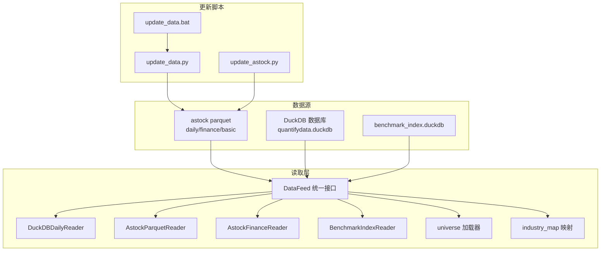
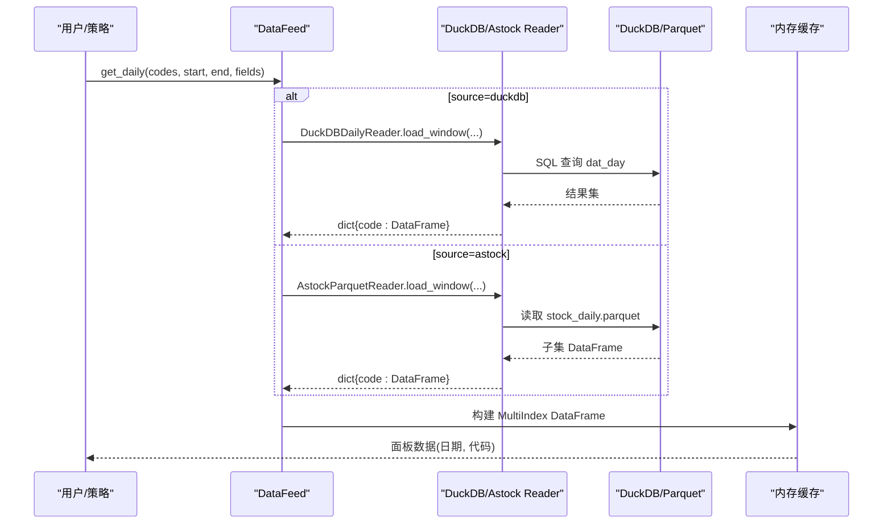
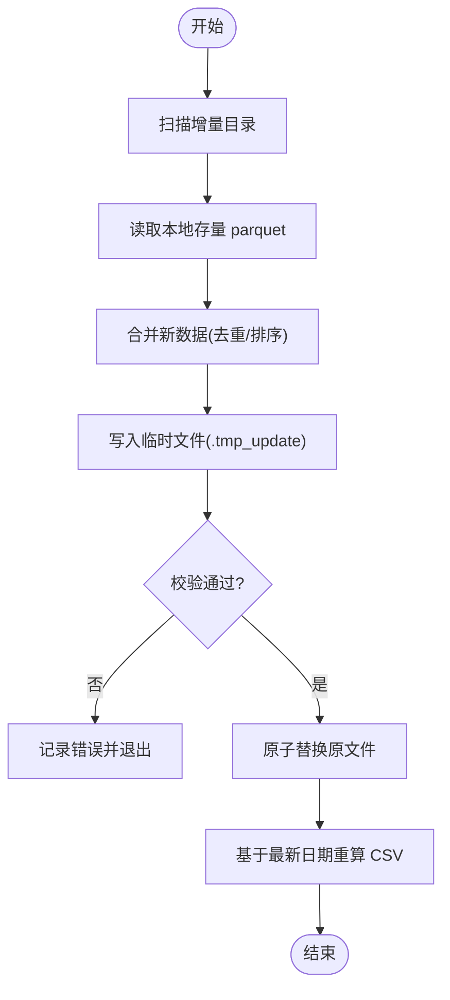
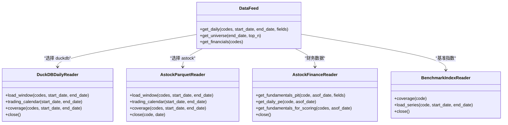

# 数据管理

<cite>
**本文引用的文件**   
- [data/duckdb_reader.py](file://data/duckdb_reader.py)
- [data/feed.py](file://data/feed.py)
- [scripts/update_data.py](file://scripts/update_data.py)
- [scripts/update_astock.py](file://scripts/update_astock.py)
- [data/astock_reader.py](file://data/astock_reader.py)
- [data/astock_finance_reader.py](file://data/astock_finance_reader.py)
- [data/benchmark_reader.py](file://data/benchmark_reader.py)
- [data/universe.py](file://data/universe.py)
- [data/industry_map.py](file://data/industry_map.py)
- [backtest/hashing.py](file://backtest/hashing.py)
- [scripts/update_data.bat](file://scripts/update_data.bat)
</cite>

## 目录
1. [引言](#引言)
2. [项目结构](#项目结构)
3. [核心组件](#核心组件)
4. [架构总览](#架构总览)
5. [详细组件分析](#详细组件分析)
6. [依赖关系分析](#依赖关系分析)
7. [性能与存储优化](#性能与存储优化)
8. [数据质量控制](#数据质量控制)
9. [备份与恢复](#备份与恢复)
10. [数据迁移工具](#数据迁移工具)
11. [故障排查指南](#故障排查指南)
12. [结论](#结论)

## 引言
本章节面向 QuantLab 的数据管理子系统，系统性阐述数据更新机制（增量/全量）、数据存储架构（Parquet、DuckDB、分区策略）、数据质量控制（完整性校验、异常值处理、缺失值填充）、备份与恢复、数据迁移工具以及访问优化（缓存、索引、查询调优）。文档以仓库现有实现为依据，提供可操作的实践建议与可视化图示，帮助读者快速理解并高效使用。

## 项目结构
QuantLab 的数据相关代码集中在 data 与 scripts 两个目录：
- data：统一数据读取接口、不同数据源的 Reader 实现（DuckDB、Parquet、基准指数等）
- scripts：数据更新脚本（一键增量更新、按周期合并、CSV 重算等）

图表来源
- [data/feed.py:1-197](file://data/feed.py#L1-L197)
- [data/duckdb_reader.py:1-215](file://data/duckdb_reader.py#L1-L215)
- [data/astock_reader.py:1-192](file://data/astock_reader.py#L1-L192)
- [data/astock_finance_reader.py:1-200](file://data/astock_finance_reader.py#L1-L200)
- [data/benchmark_reader.py:1-73](file://data/benchmark_reader.py#L1-L73)
- [data/universe.py:1-62](file://data/universe.py#L1-L62)
- [data/industry_map.py:1-41](file://data/industry_map.py#L1-L41)
- [scripts/update_data.py:1-135](file://scripts/update_data.py#L1-L135)
- [scripts/update_astock.py:1-219](file://scripts/update_astock.py#L1-L219)
- [scripts/update_data.bat:1-15](file://scripts/update_data.bat#L1-L15)

章节来源
- [data/feed.py:1-197](file://data/feed.py#L1-L197)
- [scripts/update_data.py:1-135](file://scripts/update_data.py#L1-L135)
- [scripts/update_astock.py:1-219](file://scripts/update_astock.py#L1-L219)

## 核心组件
- DataFeed：统一数据入口，支持 astock 与 duckdb 两种后端，屏蔽差异，返回一致的 MultiIndex DataFrame。
- DuckDBDailyReader：只读 DuckDB 日线读取器，支持多 schema（jince_zhisuan/qmt_self_owned），内置去重与 WAL 检测。
- AstockParquetReader：只读 Parquet 日线读取器，支持复权（raw/qfq/hfq），输出对齐 DuckDB 接口。
- AstockFinanceReader：PIT 安全的财务指标读取器，基于公告日过滤避免前视偏差。
- BenchmarkIndexReader：独立读取基准指数序列的 DuckDB 读取器。
- universe 加载器：CSV 股票池校验与去重，确保编码与格式合规。
- industry_map：行业映射缓存，加速行业叠加逻辑。

章节来源
- [data/feed.py:1-197](file://data/feed.py#L1-L197)
- [data/duckdb_reader.py:1-215](file://data/duckdb_reader.py#L1-L215)
- [data/astock_reader.py:1-192](file://data/astock_reader.py#L1-L192)
- [data/astock_finance_reader.py:1-200](file://data/astock_finance_reader.py#L1-L200)
- [data/benchmark_reader.py:1-73](file://data/benchmark_reader.py#L1-L73)
- [data/universe.py:1-62](file://data/universe.py#L1-L62)
- [data/industry_map.py:1-41](file://data/industry_map.py#L1-L41)

## 架构总览
下图展示从数据源到上层回测/研究的数据流与控制流，强调“只读”、“一致性”和“可追溯”。

图表来源
- [data/feed.py:1-197](file://data/feed.py#L1-L197)
- [data/duckdb_reader.py:1-215](file://data/duckdb_reader.py#L1-L215)
- [data/astock_reader.py:1-192](file://data/astock_reader.py#L1-L192)

## 详细组件分析

### 数据更新机制（增量/全量/自动化）
- 一键增量更新（update_data.py）
  - 扫描“增量包”目录，识别包含“增量”字样的文件夹，读取其中的 stock_daily.parquet。
  - 与本地存量 parquet 合并，按 trade_date/ts_code 去重取最新，排序后写回。
  - 同时基于最新交易日重新生成 CSV（用于 QMT 等下游系统）。
- 复杂增量/全量合并（update_astock.py）
  - daily：本地历史(<2026-01-01) + 全量包(2026年某段) + 增量包(某段)，统一列与日期类型，去重后原子替换。
  - minute：按周期与 code 拆分增量包，逐 code 合并本地+全量+增量，支持并行进程提升吞吐。
  - basic：按 ts_code 去重合并基础信息。
  - 安全写入：先写 .tmp_update 临时文件，验证成功后 os.replace 原子替换，避免损坏。
- 批处理入口（update_data.bat）
  - Windows 批处理调用 update_data.py，便于定时任务或手动执行。

图表来源
- [scripts/update_data.py:1-135](file://scripts/update_data.py#L1-L135)
- [scripts/update_astock.py:1-219](file://scripts/update_astock.py#L1-L219)
- [scripts/update_data.bat:1-15](file://scripts/update_data.bat#L1-L15)

章节来源
- [scripts/update_data.py:1-135](file://scripts/update_data.py#L1-L135)
- [scripts/update_astock.py:1-219](file://scripts/update_astock.py#L1-L219)
- [scripts/update_data.bat:1-15](file://scripts/update_data.bat#L1-L15)

### 数据存储架构（Parquet/DuckDB/分区）
- Parquet（astock）
  - 日线 stock_daily.parquet：MultiIndex (trade_date, ts_code)，字段包含 OHLCV、市值、估值、换手率等。
  - 财务 fina_indicator.parquet：季度财务指标，结合公告日实现 PIT 安全。
  - 基础 stock_basic.parquet：行业、上市/退市日期等静态信息。
  - 读取优化：仅读取必要列，降低内存占用；按索引切片过滤。
- DuckDB（量化数据库）
  - quantifydata.duckdb：dat_day 表，支持两种 schema（jince_zhisuan/qmt_self_owned），默认只读模式。
  - benchmark_index.duckdb：index_daily 表，独立维护基准指数序列。
  - 去重与覆盖：对同日双时间戳使用 ROW_NUMBER 去重；qmt_self_owned 路径保证唯一键。
  - WAL 检测：金策智算同步时存在 .wal 文件，提示数据哈希不稳定风险。
- 分区策略
  - astock minute：按周期与 code 分文件组织，便于并行处理与按需加载。
  - DuckDB：按 trade_date 范围过滤，减少扫描范围；必要时可按 source/adjustment 过滤。

章节来源
- [data/astock_reader.py:1-192](file://data/astock_reader.py#L1-L192)
- [data/astock_finance_reader.py:1-200](file://data/astock_finance_reader.py#L1-L200)
- [data/duckdb_reader.py:1-215](file://data/duckdb_reader.py#L1-L215)
- [data/benchmark_reader.py:1-73](file://data/benchmark_reader.py#L1-L73)
- [data/industry_map.py:1-41](file://data/industry_map.py#L1-L41)

### 数据质量控制（完整性/异常值/缺失值）
- 完整性检查
  - coverage() 方法返回最小/最大日期、股票数、去重行数、WAL 状态等元数据，便于监控数据覆盖度。
  - universe 加载器强制首列为 code，正则校验股票代码格式，丢弃无效行并记录警告。
- 异常值处理
  - 增量合并时对重复键（trade_date/ts_code 或 trade_date/trade_time）保留最新值，避免脏数据污染。
  - 分钟级数据按 code 拆分合并，降低跨码干扰。
- 缺失值填充
  - 财务数据采用 ffill（向前填充）补齐非交易日缺失，保持时序连续性。
  - 读取器在字段缺失时返回空字典或 None，由上层决定填充策略。

章节来源
- [data/duckdb_reader.py:1-215](file://data/duckdb_reader.py#L1-L215)
- [data/universe.py:1-62](file://data/universe.py#L1-L62)
- [data/astock_finance_reader.py:1-200](file://data/astock_finance_reader.py#L1-L200)
- [data/feed.py:1-197](file://data/feed.py#L1-L197)

### 数据访问优化（缓存/索引/查询）
- 内存缓存
  - AstockParquetReader 将所需列载入内存，构造 MultiIndex 后按索引切片，避免重复 IO。
  - industry_map 全局缓存行业映射，避免重复读取 parquet。
- 索引优化
  - Parquet 使用 (trade_date, ts_code) 作为索引，加速区间过滤与分组聚合。
  - DuckDB 查询中按 trade_date BETWEEN 过滤，减少扫描范围；必要时按 source/adjustment 过滤。
- 查询性能调优
  - 仅读取必要列，降低内存与带宽消耗。
  - 批量 codes 使用 IN (...) 占位符，减少多次往返。
  - 对于 jince_zhisuan 路径，使用 QUALIFY ROW_NUMBER 去重，避免重复计算。

章节来源
- [data/astock_reader.py:1-192](file://data/astock_reader.py#L1-L192)
- [data/industry_map.py:1-41](file://data/industry_map.py#L1-L41)
- [data/duckdb_reader.py:1-215](file://data/duckdb_reader.py#L1-L215)

### 数据一致性追踪（哈希）
- backtest/hashing.py 提供数据哈希计算，结合 db_mtime、调整因子、请求区间、实际覆盖范围、去重计数、股票池哈希等，确保回测可复现与数据变更可追溯。

章节来源
- [backtest/hashing.py:1-23](file://backtest/hashing.py#L1-L23)

## 依赖关系分析
- DataFeed 依赖具体 Reader 实现，屏蔽底层差异，向上层暴露统一 API。
- Reader 之间无直接耦合，但共享一致的方法签名（load_window/trading_calendar/coverage/close），便于替换与扩展。
- 更新脚本与数据源强耦合（路径、文件名、列名），需保持一致性。

图表来源
- [data/feed.py:1-197](file://data/feed.py#L1-L197)
- [data/duckdb_reader.py:1-215](file://data/duckdb_reader.py#L1-L215)
- [data/astock_reader.py:1-192](file://data/astock_reader.py#L1-L192)
- [data/astock_finance_reader.py:1-200](file://data/astock_finance_reader.py#L1-L200)
- [data/benchmark_reader.py:1-73](file://data/benchmark_reader.py#L1-L73)

## 性能与存储优化
- Parquet 列裁剪：仅读取必要列，显著降低内存占用与 IO 成本。
- 索引与分区：按 (trade_date, ts_code) 构建索引，分钟级按周期与 code 分文件，利于并行与局部更新。
- DuckDB 只读模式：避免并发写冲突，提高查询稳定性；WAL 检测防止同步期间数据不一致。
- 批量查询：IN (...) 占位符与 BETWEEN 过滤减少网络与解析开销。
- 内存缓存：行业映射与财务数据缓存，避免重复读取。

[本节为通用指导，不直接分析具体文件]

## 数据质量控制
- 完整性校验
  - coverage() 提供数据范围、股票数量、去重统计，便于监控与告警。
  - universe 加载器严格校验 code 格式与启用状态，丢弃非法行并记录日志。
- 异常值处理
  - 增量合并去重策略（保留最新）避免重复与脏数据。
  - 分钟级数据按 code 拆分合并，降低跨码污染。
- 缺失值填充
  - 财务数据 ffill 补齐非交易日，保持时序连续。
  - 读取器对缺失字段返回 None/空字典，由上层决定填充策略。

章节来源
- [data/duckdb_reader.py:1-215](file://data/duckdb_reader.py#L1-L215)
- [data/universe.py:1-62](file://data/universe.py#L1-L62)
- [data/astock_finance_reader.py:1-200](file://data/astock_finance_reader.py#L1-L200)

## 备份与恢复
- 定期备份策略
  - 每日增量更新后，建议对 stock_daily.parquet、fina_indicator.parquet、stock_basic.parquet 进行快照备份。
  - DuckDB 文件（quantifydata.duckdb、benchmark_index.duckdb）应纳入备份计划，注意 WAL 文件同步。
- 增量备份
  - 利用 update_astock.py 的原子替换特性，备份时可捕获 .tmp_update 临时文件，确保一致性。
  - 分钟级数据按周期与 code 分文件，便于增量备份与细粒度恢复。
- 灾难恢复流程
  - 从最近一次完整备份恢复基础文件，再应用增量备份（按日期顺序）。
  - 恢复后运行 coverage() 校验数据范围与股票数量，确保一致性。
  - 若发现 WAL 文件，等待同步完成后再恢复，避免数据不一致。

[本节为通用指导，不直接分析具体文件]

## 数据迁移工具
- 版本升级
  - update_astock.py 支持本地历史与全量包/增量包的合并，适用于年度或大版本升级。
  - 通过 --dry 参数预演合并结果，确认无误后再落盘。
- 格式转换
  - update_data.py 将 Parquet 转换为 CSV（GBK 编码），适配 QMT 等下游系统。
  - 字段对齐与类型统一（如 trade_date 标准化为 date）。
- 跨平台迁移
  - Parquet 与 DuckDB 均为跨平台格式，迁移时注意路径与编码（UTF-8/GBK）差异。
  - universe CSV 支持 UTF-8 BOM，兼容不同编辑器导出。

章节来源
- [scripts/update_astock.py:1-219](file://scripts/update_astock.py#L1-L219)
- [scripts/update_data.py:1-135](file://scripts/update_data.py#L1-L135)
- [data/universe.py:1-62](file://data/universe.py#L1-L62)

## 故障排查指南
- 常见问题
  - DuckDB WAL 警告：检测到 quantifydata.duckdb.wal，表示上游同步进行中，数据哈希不稳定，建议同步完成后重跑。
  - 数据覆盖不足：coverage() 返回的最小/最大日期与请求区间不匹配，检查增量包是否完整。
  - 股票池为空：universe 加载器校验失败或无有效行，检查 CSV 格式与编码。
- 定位步骤
  - 使用 coverage() 检查数据范围与股票数量。
  - 查看日志中的警告与错误信息（如 invalid code、duplicate code）。
  - 对 update_astock.py 使用 --dry 预演，确认合并结果。
- 恢复措施
  - 清理 .tmp_update 临时文件，重新执行更新脚本。
  - 等待 DuckDB 同步完成，移除 WAL 文件后重试。
  - 修正 universe CSV 格式，确保首列为 code 且格式正确。

章节来源
- [data/duckdb_reader.py:1-215](file://data/duckdb_reader.py#L1-L215)
- [data/universe.py:1-62](file://data/universe.py#L1-L62)
- [scripts/update_astock.py:1-219](file://scripts/update_astock.py#L1-L219)

## 结论
QuantLab 的数据管理子系统以“只读、一致性、可追溯”为核心原则，构建了高效的增量/全量更新机制与灵活的存储架构（Parquet/DuckDB）。通过严格的校验与清洗流程，保障数据质量；借助缓存、索引与分区优化，提升访问性能。配套的备份恢复与迁移工具，使系统在版本升级与跨平台迁移中保持稳定可靠。建议在生产环境中结合定时任务与监控告警，持续优化数据流水线与性能表现。