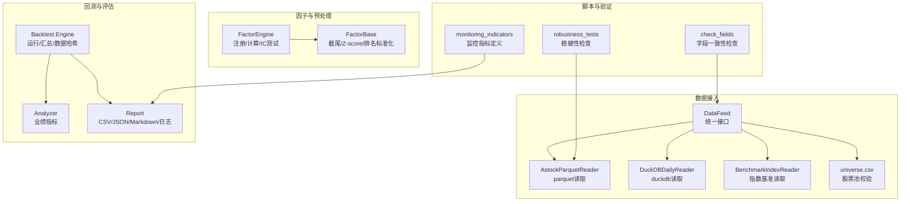
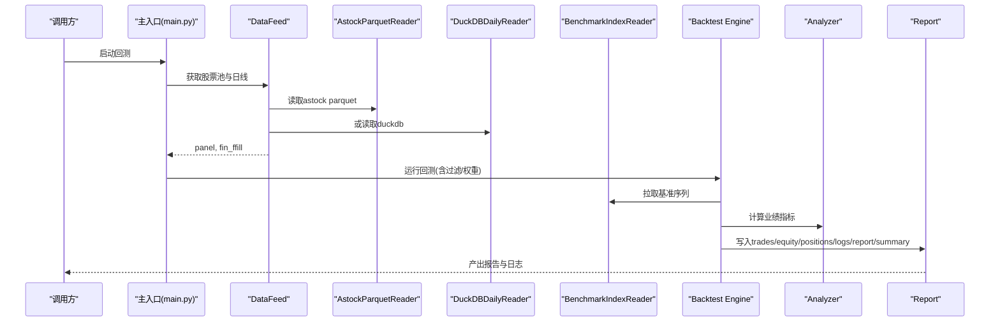
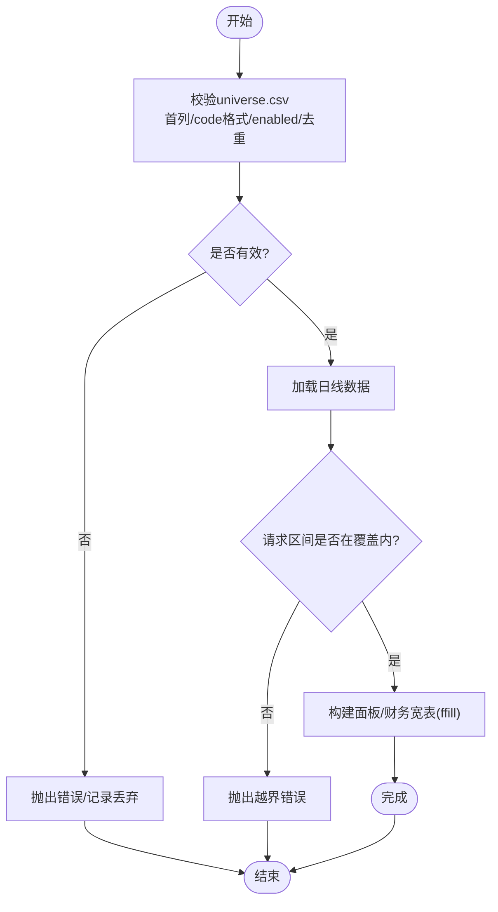
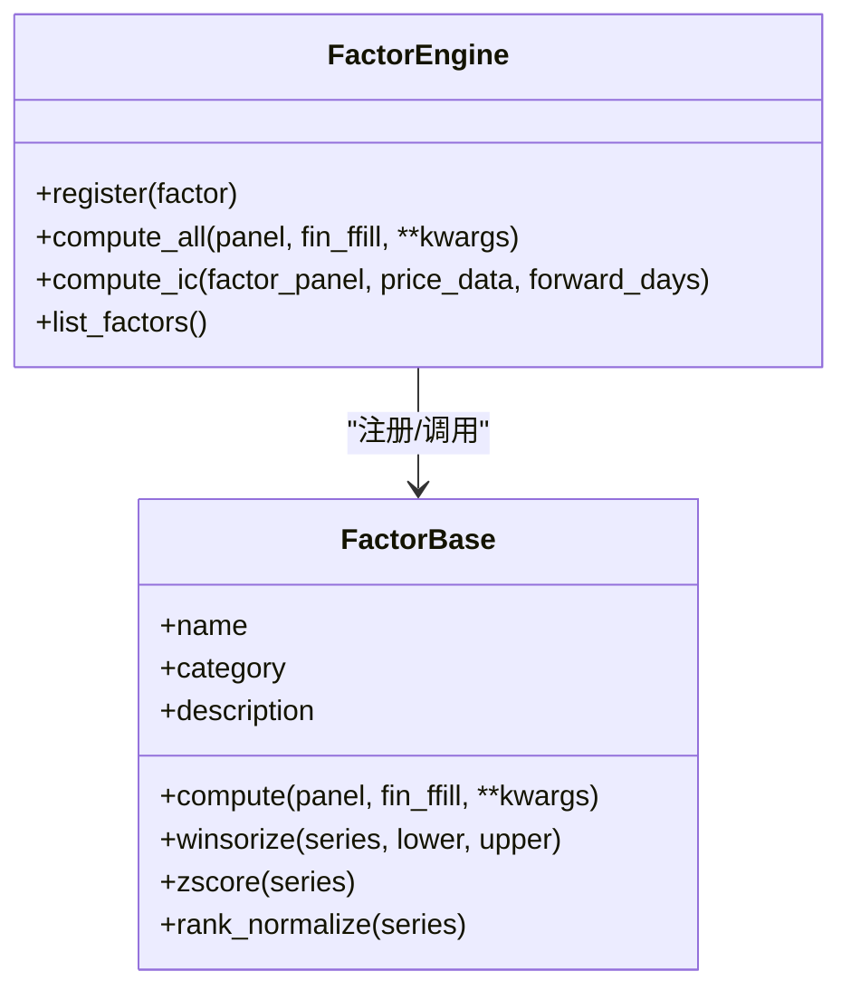
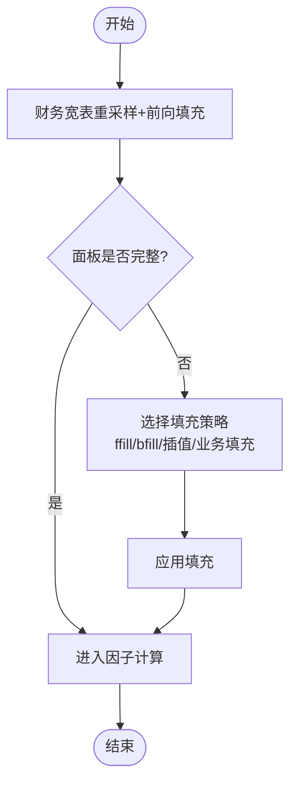
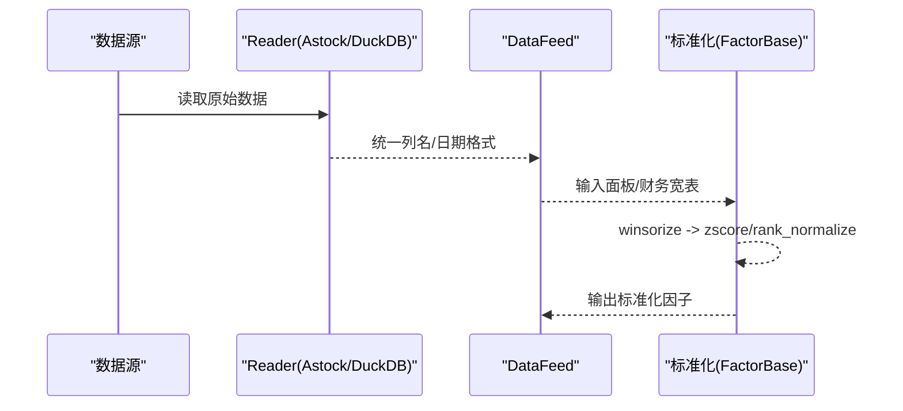
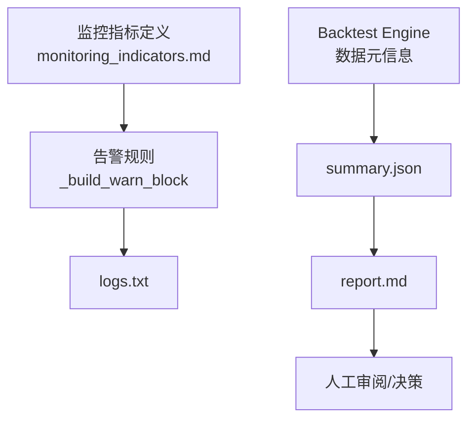
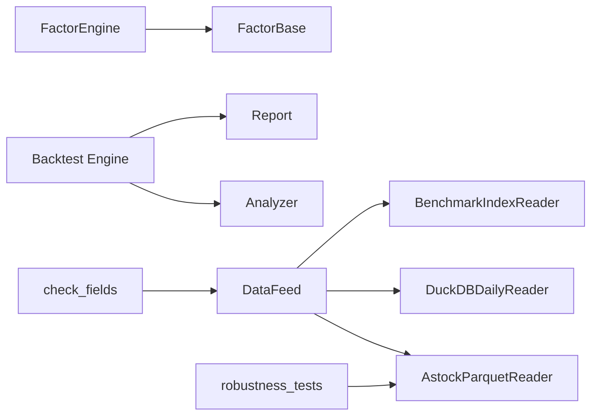

# 数据质量控制

<cite>
**本文引用的文件**   
- [main.py](file://main.py)
- [data/feed.py](file://data/feed.py)
- [data/astock_reader.py](file://data/astock_reader.py)
- [data/duckdb_reader.py](file://data/duckdb_reader.py)
- [data/benchmark_reader.py](file://data/benchmark_reader.py)
- [data/universe.py](file://data/universe.py)
- [factors/base.py](file://factors/base.py)
- [factors/engine.py](file://factors/engine.py)
- [backtest/engine.py](file://backtest/engine.py)
- [backtest/analyzer.py](file://backtest/analyzer.py)
- [backtest/report.py](file://backtest/report.py)
- [scripts/check_fields.py](file://scripts/check_fields.py)
- [projects/verification/robustness_tests.py](file://projects/verification/robustness_tests.py)
- [projects/verification/results/monitoring_indicators.md](file://projects/verification/results/monitoring_indicators.md)
</cite>

## 目录
1. [引言](#引言)
2. [项目结构](#项目结构)
3. [核心组件](#核心组件)
4. [架构总览](#架构总览)
5. [详细组件分析](#详细组件分析)
6. [依赖关系分析](#依赖关系分析)
7. [性能考虑](#性能考虑)
8. [故障排查指南](#故障排查指南)
9. [结论](#结论)
10. [附录](#附录)

## 引言
本文件面向 QuantLab 的数据质量控制（DQ）体系，围绕以下目标展开：
- 数据完整性检查机制：必填字段验证、数据类型校验、范围检查等规则定义与落地。
- 异常值处理：统计异常检测、业务规则验证、人工审核流程。
- 缺失值填充策略：前向/后向填充、插值方法、业务逻辑填充。
- 数据标准化流程：格式统一、编码转换、单位换算等预处理步骤。
- 数据质量监控工具：质量指标定义、异常告警机制、质量报告生成。
- 最佳实践与常见问题解决方案。

## 项目结构
QuantLab 的数据质量控制贯穿“数据接入—清洗—因子计算—回测—报告”全链路，关键模块如下：
- 数据接入层：统一接口 DataFeed、AstockParquetReader、DuckDBDailyReader、BenchmarkIndexReader、Universe CSV 加载器。
- 因子与预处理：FactorBase（截尾、Z-score、排序标准化）、FactorEngine（注册与批量计算）。
- 回测与评估：engine（运行与汇总）、analyzer（业绩指标）、report（结果输出与日志/报告）。
- 脚本与验证：check_fields（字段一致性）、robustness_tests（幸存者偏差等健壮性检查）、monitoring_indicators（监控指标定义）。

**图表来源** 
- [data/feed.py:17-135](file://data/feed.py#L17-L135)
- [data/astock_reader.py:25-116](file://data/astock_reader.py#L25-L116)
- [data/duckdb_reader.py:35-132](file://data/duckdb_reader.py#L35-L132)
- [data/benchmark_reader.py:21-73](file://data/benchmark_reader.py#L21-L73)
- [data/universe.py:27-61](file://data/universe.py#L27-L61)
- [factors/base.py:9-51](file://factors/base.py#L9-L51)
- [factors/engine.py:9-86](file://factors/engine.py#L9-L86)
- [backtest/engine.py:434-578](file://backtest/engine.py#L434-L578)
- [backtest/analyzer.py:96-176](file://backtest/analyzer.py#L96-L176)
- [backtest/report.py:245-264](file://backtest/report.py#L245-L264)
- [scripts/check_fields.py:1-32](file://scripts/check_fields.py#L1-L32)
- [projects/verification/robustness_tests.py:192-218](file://projects/verification/robustness_tests.py#L192-L218)
- [projects/verification/results/monitoring_indicators.md:1-63](file://projects/verification/results/monitoring_indicators.md#L1-L63)

**章节来源**
- [main.py:21-92](file://main.py#L21-L92)
- [data/feed.py:17-135](file://data/feed.py#L17-L135)
- [data/astock_reader.py:25-116](file://data/astock_reader.py#L25-L116)
- [data/duckdb_reader.py:35-132](file://data/duckdb_reader.py#L35-L132)
- [data/benchmark_reader.py:21-73](file://data/benchmark_reader.py#L21-L73)
- [data/universe.py:27-61](file://data/universe.py#L27-L61)
- [factors/base.py:9-51](file://factors/base.py#L9-L51)
- [factors/engine.py:9-86](file://factors/engine.py#L9-L86)
- [backtest/engine.py:434-578](file://backtest/engine.py#L434-L578)
- [backtest/analyzer.py:96-176](file://backtest/analyzer.py#L96-L176)
- [backtest/report.py:245-264](file://backtest/report.py#L245-L264)
- [scripts/check_fields.py:1-32](file://scripts/check_fields.py#L1-L32)
- [projects/verification/robustness_tests.py:192-218](file://projects/verification/robustness_tests.py#L192-L218)
- [projects/verification/results/monitoring_indicators.md:1-63](file://projects/verification/results/monitoring_indicators.md#L1-L63)

## 核心组件
- 数据源统一接口 DataFeed：封装 astock parquet 与 duckdb 两种读取路径，提供 get_daily/get_universe/get_financials 等能力，并在构建面板时进行列映射与财务宽表重采样（ffill）。
- AstockParquetReader/DuckDBDailyReader：只读 reader，实现 load_window/trading_calendar/coverage/close 等契约；前者按 trade_date/ts_code 构造 MultiIndex，后者按 data_source 选择 schema 并去重。
- BenchmarkIndexReader：独立读取基准序列，返回 (date, close) 列表，用于回测期收益对齐。
- Universe CSV 加载器：严格校验首列 code、正则匹配代码格式、enabled 布尔解析、去重与空集校验。
- FactorBase/FactorEngine：提供 winsorize/zscore/rank_normalize 等标准化与截尾方法；引擎负责注册与批量计算，失败记录打印。
- Backtest Engine/Analyzer/Report：汇总数据覆盖、去重计数、WAL 检测、样本期警告、基准可用性；计算夏普、最大回撤、胜率等；输出 trades/equity_curve/positions/logs/report.md/summary.json。

**章节来源**
- [data/feed.py:17-135](file://data/feed.py#L17-L135)
- [data/astock_reader.py:25-116](file://data/astock_reader.py#L25-L116)
- [data/duckdb_reader.py:35-132](file://data/duckdb_reader.py#L35-L132)
- [data/benchmark_reader.py:21-73](file://data/benchmark_reader.py#L21-L73)
- [data/universe.py:27-61](file://data/universe.py#L27-L61)
- [factors/base.py:9-51](file://factors/base.py#L9-L51)
- [factors/engine.py:9-86](file://factors/engine.py#L9-L86)
- [backtest/engine.py:434-578](file://backtest/engine.py#L434-L578)
- [backtest/analyzer.py:96-176](file://backtest/analyzer.py#L96-L176)
- [backtest/report.py:245-264](file://backtest/report.py#L245-L264)

## 架构总览
下图展示从数据接入到报告输出的端到端流程，以及质量控制点在何处介入。

**图表来源** 
- [main.py:28-92](file://main.py#L28-L92)
- [data/feed.py:137-181](file://data/feed.py#L137-L181)
- [data/astock_reader.py:71-116](file://data/astock_reader.py#L71-L116)
- [data/duckdb_reader.py:90-132](file://data/duckdb_reader.py#L90-L132)
- [data/benchmark_reader.py:52-63](file://data/benchmark_reader.py#L52-L63)
- [backtest/engine.py:434-578](file://backtest/engine.py#L434-L578)
- [backtest/analyzer.py:96-176](file://backtest/analyzer.py#L96-L176)
- [backtest/report.py:245-264](file://backtest/report.py#L245-L264)

## 详细组件分析

### 数据完整性检查机制
- 必填字段与类型校验
  - universe.csv：首列必须为 code，使用正则校验代码格式；enabled 支持多种 false 表示；重复 code 仅保留首次出现；空集合抛错。
  - astock parquet：要求存在 trade_date/ts_code 列以构建 MultiIndex；否则抛错。
  - duckdb：data_source 必须显式指定；对不支持的值抛错；日期表达式根据 data_source 切换。
- 范围检查
  - DuckDB/Astock 的 load_window 均会校验请求区间是否在数据覆盖范围内，越界抛错。
  - coverage() 返回 min/max date、n_codes、去重计数等元信息，便于上层判断。
- 基准可用性
  - BenchmarkIndexReader 在文件不存在时抛 FileNotFoundError，由调用方降级处理。

**图表来源** 
- [data/universe.py:27-61](file://data/universe.py#L27-L61)
- [data/astock_reader.py:60-66](file://data/astock_reader.py#L60-L66)
- [data/duckdb_reader.py:42-48](file://data/duckdb_reader.py#L42-L48)
- [data/duckdb_reader.py:90-97](file://data/duckdb_reader.py#L90-L97)
- [data/astock_reader.py:71-91](file://data/astock_reader.py#L71-L91)
- [data/feed.py:137-181](file://data/feed.py#L137-L181)

**章节来源**
- [data/universe.py:27-61](file://data/universe.py#L27-L61)
- [data/astock_reader.py:60-66](file://data/astock_reader.py#L60-L66)
- [data/duckdb_reader.py:42-48](file://data/duckdb_reader.py#L42-L48)
- [data/duckdb_reader.py:90-97](file://data/duckdb_reader.py#L90-L97)
- [data/astock_reader.py:71-91](file://data/astock_reader.py#L71-L91)
- [data/feed.py:137-181](file://data/feed.py#L137-L181)

### 异常值处理方法
- 统计异常检测
  - 因子层面提供百分位截尾（winsorize），默认上下分位数可配置。
  - IC 测试流程中对因子序列先做截尾再做标准化，降低极端值影响。
- 业务规则验证
  - 回测阶段通过 coverage/dedup_count/WAL 检测等元信息识别潜在数据问题。
  - 基准序列若存在断点或起点价格为 0，则禁用超额/IR 等指标并给出说明。
- 人工审核流程
  - robustness_tests 中的幸存者偏差检查，统计每日股票数变化与退市标记，必要时人工复核。
  - report.md 中集中展示 WARN 块（短样本、基准不可用、去重、WAL 同步等），供人工审阅。

**图表来源** 
- [factors/base.py:9-51](file://factors/base.py#L9-L51)
- [factors/engine.py:9-86](file://factors/engine.py#L9-L86)

**章节来源**
- [factors/base.py:30-51](file://factors/base.py#L30-L51)
- [projects/Project_01_多因子IC小盘Alpha/research/multi_factor_ic/ic_test.py:78-120](file://projects/Project_01_多因子IC小盘Alpha/research/multi_factor_ic/ic_test.py#L78-L120)
- [backtest/engine.py:445-481](file://backtest/engine.py#L445-L481)
- [projects/verification/robustness_tests.py:192-218](file://projects/verification/robustness_tests.py#L192-L218)
- [backtest/report.py:78-108](file://backtest/report.py#L78-L108)

### 缺失值填充策略
- 前向填充（ffill）
  - 财务宽表在构建时按交易日重采样并使用 ffill，保证时间序列连续性。
- 后向填充（bfill）
  - 当前代码库未直接实现 bfill；可在上层按需扩展。
- 插值方法
  - 当前未内置线性/样条插值；建议在因子计算前对单序列进行插值（如 pd.Series.interpolate）。
- 业务逻辑填充
  - 基准序列缺失时，回测引擎将对应日期的基准收益置为空，并在报告中提示基准不可用。
  - 因子计算失败时，记录日志并跳过该因子当日计算，避免污染整体结果。

**图表来源** 
- [data/feed.py:166-181](file://data/feed.py#L166-L181)
- [backtest/engine.py:445-481](file://backtest/engine.py#L445-L481)

**章节来源**
- [data/feed.py:166-181](file://data/feed.py#L166-L181)
- [backtest/engine.py:445-481](file://backtest/engine.py#L445-L481)

### 数据标准化流程
- 格式统一
  - AstockParquetReader 输出列名与顺序与 DuckDBDailyReader 一致（date, open, high, low, close, vol, amount 等），屏蔽底层差异。
  - universe.csv 强制 UTF-8 BOM 兼容，首列 code 校验。
- 编码转换
  - 日期字符串统一为 YYYY-MM-DD；部分场景转换为 datetime 对象进行比较与排序。
- 单位换算
  - 复权处理：AstockParquetReader 支持 raw/qfq/hfq 三种复权方式，基于 adj_factor 调整价格列。
  - 因子标准化：提供 zscore 与 rank_normalize，配合 winsorize 控制极端值。

**图表来源** 
- [data/astock_reader.py:98-116](file://data/astock_reader.py#L98-L116)
- [data/duckdb_reader.py:103-132](file://data/duckdb_reader.py#L103-L132)
- [data/universe.py:27-61](file://data/universe.py#L27-L61)
- [factors/base.py:30-51](file://factors/base.py#L30-L51)

**章节来源**
- [data/astock_reader.py:98-116](file://data/astock_reader.py#L98-L116)
- [data/duckdb_reader.py:103-132](file://data/duckdb_reader.py#L103-L132)
- [data/universe.py:27-61](file://data/universe.py#L27-L61)
- [factors/base.py:30-51](file://factors/base.py#L30-L51)

### 数据质量监控工具
- 质量指标定义
  - monitoring_indicators.md 定义了净值、回撤、持仓集中度、换手率、信号质量、归因、容量、策略有效性等指标及阈值。
- 异常告警机制
  - backtest/report.py 的 _build_warn_block 聚合短样本、基准不可用、数据去重、WAL 同步等警告，写入 logs.txt。
  - backtest/engine.py 汇总 WAL 检测、去重计数、覆盖率、数据哈希等元信息，便于追踪。
- 质量报告生成
  - report.py 输出 trades.csv、equity_curve.csv、positions.csv、logs.txt、report.md、summary.json，包含关键日志摘录与数据元信息。

**图表来源** 
- [projects/verification/results/monitoring_indicators.md:1-63](file://projects/verification/results/monitoring_indicators.md#L1-L63)
- [backtest/report.py:78-108](file://backtest/report.py#L78-L108)
- [backtest/engine.py:524-578](file://backtest/engine.py#L524-L578)
- [backtest/report.py:245-264](file://backtest/report.py#L245-L264)

**章节来源**
- [projects/verification/results/monitoring_indicators.md:1-63](file://projects/verification/results/monitoring_indicators.md#L1-L63)
- [backtest/report.py:78-108](file://backtest/report.py#L78-L108)
- [backtest/engine.py:524-578](file://backtest/engine.py#L524-L578)
- [backtest/report.py:245-264](file://backtest/report.py#L245-L264)

### 数据清洗最佳实践
- 在数据接入层尽早校验：universe.csv 格式、代码正则、去重；parquet/duckdb 覆盖范围与去重计数。
- 在因子计算前进行标准化：winsorize → zscore/rank_normalize，确保数值稳定。
- 在回测阶段记录数据元信息与警告：WAL 检测、基准可用性、短样本期等，形成可审计轨迹。
- 定期执行稳健性检查：幸存者偏差、退市标记、交易日历连续性等。

**章节来源**
- [data/universe.py:27-61](file://data/universe.py#L27-L61)
- [data/astock_reader.py:71-91](file://data/astock_reader.py#L71-L91)
- [data/duckdb_reader.py:90-97](file://data/duckdb_reader.py#L90-L97)
- [factors/base.py:30-51](file://factors/base.py#L30-L51)
- [backtest/engine.py:524-578](file://backtest/engine.py#L524-L578)
- [projects/verification/robustness_tests.py:192-218](file://projects/verification/robustness_tests.py#L192-L218)

### 常见问题解决方案
- 字段不一致
  - 使用 scripts/check_fields.py 对比策略所需财务字段与 CSV 列，定位缺失/多余字段。
- 基准不可用
  - 当基准文件缺失或序列存在断点时，回测自动禁用 IR/excess，并在报告中提示原因。
- 数据同步冲突
  - DuckDB 检测到 .wal 文件时发出警告，建议等待同步完成后重跑以保证数据哈希稳定。
- 幸存者偏差
  - 通过 robustness_tests 检查每日股票数量变化与退市标记，必要时人工复核。

**章节来源**
- [scripts/check_fields.py:1-32](file://scripts/check_fields.py#L1-L32)
- [data/benchmark_reader.py:21-73](file://data/benchmark_reader.py#L21-L73)
- [backtest/engine.py:445-481](file://backtest/engine.py#L445-L481)
- [data/duckdb_reader.py:63-75](file://data/duckdb_reader.py#L63-L75)
- [projects/verification/robustness_tests.py:192-218](file://projects/verification/robustness_tests.py#L192-L218)

## 依赖关系分析
- 数据接入层依赖：
  - DataFeed 依赖 AstockParquetReader/DuckDBDailyReader/BenchmarkIndexReader。
  - AstockParquetReader 依赖 pyarrow.parquet 与 pandas；DuckDBDailyReader 依赖 duckdb。
- 因子层依赖：
  - FactorEngine 依赖 FactorBase 提供的标准化方法。
- 回测层依赖：
  - engine 依赖 analyzer（业绩指标）与 report（产物输出）。
- 脚本与验证：
  - check_fields 依赖 pandas；robustness_tests 依赖 parquet 读取与索引操作。

**图表来源** 
- [data/feed.py:17-135](file://data/feed.py#L17-L135)
- [data/astock_reader.py:25-116](file://data/astock_reader.py#L25-L116)
- [data/duckdb_reader.py:35-132](file://data/duckdb_reader.py#L35-L132)
- [data/benchmark_reader.py:21-73](file://data/benchmark_reader.py#L21-L73)
- [factors/engine.py:9-86](file://factors/engine.py#L9-L86)
- [factors/base.py:9-51](file://factors/base.py#L9-L51)
- [backtest/engine.py:434-578](file://backtest/engine.py#L434-L578)
- [backtest/analyzer.py:96-176](file://backtest/analyzer.py#L96-L176)
- [backtest/report.py:245-264](file://backtest/report.py#L245-L264)
- [scripts/check_fields.py:1-32](file://scripts/check_fields.py#L1-L32)
- [projects/verification/robustness_tests.py:192-218](file://projects/verification/robustness_tests.py#L192-L218)

**章节来源**
- [data/feed.py:17-135](file://data/feed.py#L17-L135)
- [data/astock_reader.py:25-116](file://data/astock_reader.py#L25-L116)
- [data/duckdb_reader.py:35-132](file://data/duckdb_reader.py#L35-L132)
- [data/benchmark_reader.py:21-73](file://data/benchmark_reader.py#L21-L73)
- [factors/engine.py:9-86](file://factors/engine.py#L9-L86)
- [factors/base.py:9-51](file://factors/base.py#L9-L51)
- [backtest/engine.py:434-578](file://backtest/engine.py#L434-L578)
- [backtest/analyzer.py:96-176](file://backtest/analyzer.py#L96-L176)
- [backtest/report.py:245-264](file://backtest/report.py#L245-L264)
- [scripts/check_fields.py:1-32](file://scripts/check_fields.py#L1-L32)
- [projects/verification/robustness_tests.py:192-218](file://projects/verification/robustness_tests.py#L192-L218)

## 性能考虑
- 只读 reader 与最小列读取：AstockParquetReader 仅读取回测所需列，降低内存占用。
- 去重与覆盖统计：DuckDBDailyReader 在 coverage 中统计去重计数与行数，减少重复计算。
- 基准序列对齐：benchmark_returns 仅在可用时计算，避免无效运算。
- 报告与日志：结构化输出，便于快速定位问题，减少调试成本。

[本节为通用指导，不直接分析具体文件]

## 故障排查指南
- 数据源路径/权限问题
  - astock parquet 或 duckdb 文件不存在时抛出 FileNotFoundError，检查路径与权限。
- 数据覆盖不足
  - load_window 越界抛错，核对请求区间与 coverage 的 min/max date。
- 基准不可用
  - 基准文件缺失或序列断点导致 benchmark_available=false，查看 logs.txt 与 report.md 的 WARN 块。
- WAL 同步冲突
  - 检测到 .wal 文件时发出警告，等待同步完成后重跑。
- 因子计算失败
  - FactorEngine 捕获异常并打印失败信息，检查输入面板与财务宽表字段。

**章节来源**
- [data/astock_reader.py:40-41](file://data/astock_reader.py#L40-L41)
- [data/duckdb_reader.py:47-48](file://data/duckdb_reader.py#L47-L48)
- [data/duckdb_reader.py:90-97](file://data/duckdb_reader.py#L90-L97)
- [data/benchmark_reader.py:28-29](file://data/benchmark_reader.py#L28-L29)
- [backtest/engine.py:445-481](file://backtest/engine.py#L445-L481)
- [data/duckdb_reader.py:63-75](file://data/duckdb_reader.py#L63-L75)
- [factors/engine.py:28-32](file://factors/engine.py#L28-L32)

## 结论
QuantLab 的数据质量控制贯穿数据接入、因子计算、回测与报告全流程，具备严格的字段与范围校验、完善的异常值处理与标准化手段、清晰的监控告警与报告输出。通过只读 reader、去重统计、WAL 检测与基准可用性判断，系统在保证数据一致性与可复现性的同时，提供了良好的可观测性与可审计性。建议在生产环境中持续完善缺失值填充策略（bfill/插值）与更细粒度的业务规则校验，进一步提升数据质量与策略稳健性。

[本节为总结性内容，不直接分析具体文件]

## 附录
- 监控指标参考：详见 projects/verification/results/monitoring_indicators.md，涵盖每日/每周/每月/季度监控项与阈值。
- 字段一致性检查：scripts/check_fields.py 可用于策略所需财务字段与 CSV 列的比对。
- 稳健性检查：projects/verification/robustness_tests.py 提供幸存者偏差等检查用例。

**章节来源**
- [projects/verification/results/monitoring_indicators.md:1-63](file://projects/verification/results/monitoring_indicators.md#L1-L63)
- [scripts/check_fields.py:1-32](file://scripts/check_fields.py#L1-L32)
- [projects/verification/robustness_tests.py:192-218](file://projects/verification/robustness_tests.py#L192-L218)