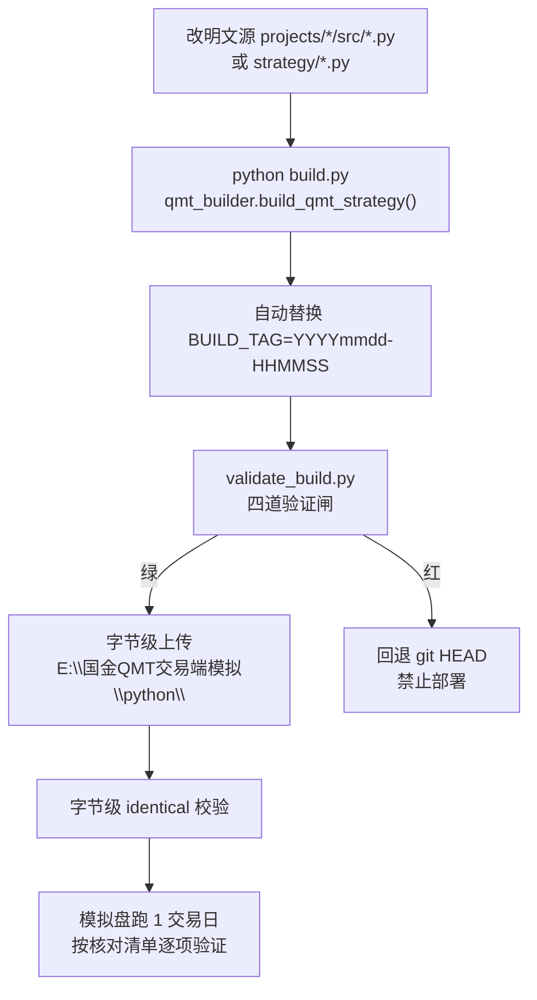
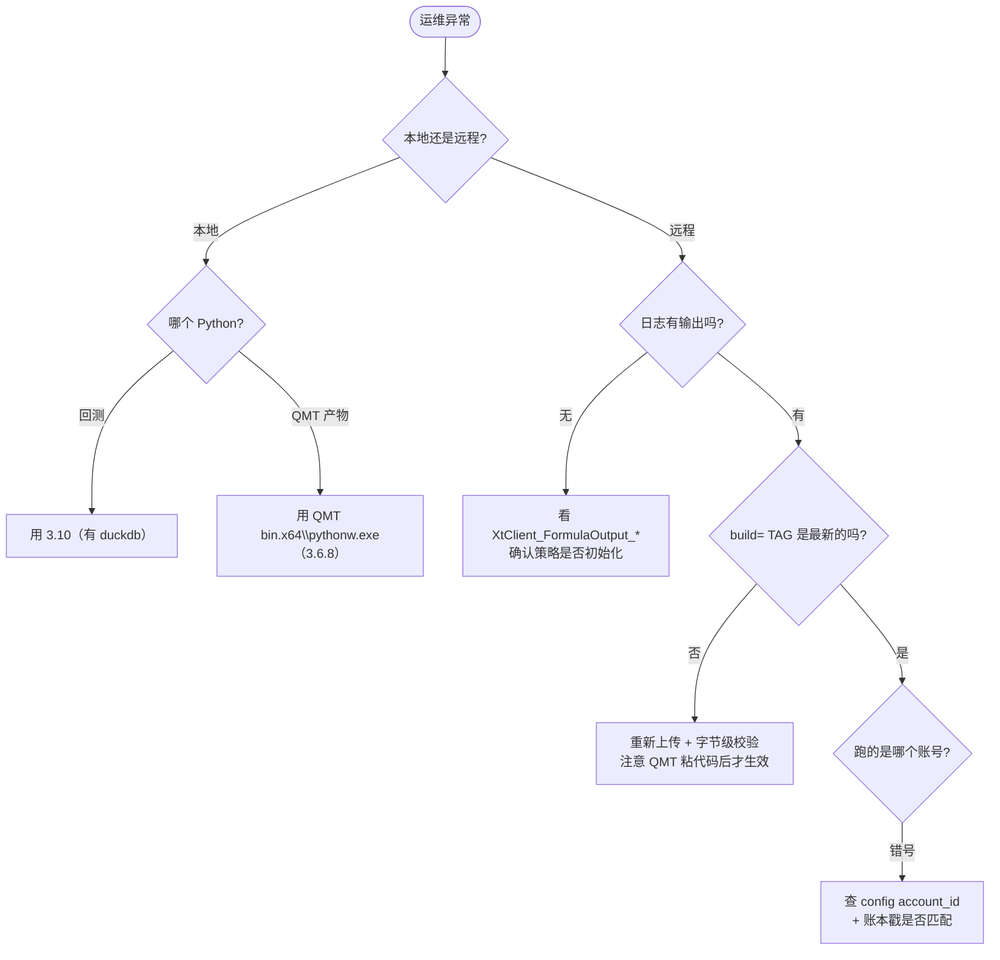

# 环境搭建与部署配置

<cite>
**本文档引用的文件**
- [全局控制台.md](file://全局控制台.md) — 工作区定位、开发环境、交易费率
- [AGENTS.md](file://AGENTS.md) — 全局红线与构建纪律
- [实盘配置指南.md](file://实盘配置指南.md)
- [快速启动.md](file://快速启动.md)
- [资金分配总表与约束.md](file://资金分配总表与约束.md)
- [config/capital_allocation.yaml](file://config/capital_allocation.yaml)
- [projects/Project_16_LightGBM股票大师/qmt_config.py](file://projects/Project_16_LightGBM股票大师/qmt_config.py) — 费率口径源
</cite>

## 目录
1. [引言](#引言)
2. [环境矩阵](#环境矩阵)
3. [工作区布局](#工作区布局)
4. [数据源运维](#数据源运维)
5. [QMT 构建与发布流程](#qmt-构建与发布流程)
6. [实盘运行调度与监控](#实盘运行调度与监控)
7. [配置管理与资金分配](#配置管理与资金分配)
8. [交易费率口径](#交易费率口径)
9. [故障排查与运维经验](#故障排查与运维经验)
10. [章节来源](#章节来源)

## 引言

QuantLab 横跨三套 Python 环境与四块盘，部署链路从「研究代码」到「QMT 单文件产物」再到「远程模拟端」。本文档是运维侧的唯一入口。

## 环境矩阵

| 用途 | Python | 路径 / 说明 |
|---|---|---|
| **研究** | 3.11 | 因子研究、数据分析 |
| **回测工厂** | **3.10** | `C:\Users\Administrator\AppData\Local\Programs\Python\Python310`（**有 duckdb**） |
| **QMT 生产** | **3.6.8** | `E:\国金QMT交易端模拟\bin.x64\pythonw.exe`（**不是 python 目录**） |
| 通用回测 | 3.13 / pandas 3.0 | 验证套件已适配（需去掉 `.date()` 比较） |

**QMT 环境自带**：numpy / pandas / xtquant。**唯一缺 pyyaml** → 任何第三方 import 必须 try/except fallback。

**新设备部署最小集**：

1. 必拷 `strategy_main.py`（GBK，**二进制拷**）+ config。
2. 完全不用拷 core/adapters 等源目录。
3. 历史 K 线需在 QMT 客户端**补全 ≥120 交易日**，否则会出现「外部池无股票通过技术信号」（不是 bug，是数据不足）。

## 工作区布局

| 区域 | 路径 | 定位 |
|---|---|---|
| **开发中枢** | `D:\QuantLab` | 因子研究 / 回测 / 风控 / QMT 构建 / 验证 |
| 生产工程 | `D:\QuantLab`（各项目 `build/`） | 实盘策略构建产物 |
| **第一数据源** | `E:/astock/` | 买断离线 parquet：日线 + 1/5/15min（2009 起）+ 财务全量（2005 起） |
| 实时补充 | `qmt_self_owned`（`F:/backtest_workspace/data/duckdb/`） | 最新交易日数据，需 QMT 在线；1min 仅近 1 年 |
| 文件通信 | `D:/QMT_POOL/` | 运行时文件交换（selected / holdings / nav / sector_heat 等） |
| **配置统一目录** | `D:/QMT_POOL/config/` | ATR/V2/P13 三策略 config 统一读取路径（2026-08 迁移） |
| 知识库 | `F:\天翼云盘同步盘\Obsidian\量化知识库` | 长期沉淀（`knowledge_base` 为 NTFS junction） |
| 回测资产 | `F:\backtest_workspace\` | 回测数据 / 结果 / 池快照 |
| QMT 模拟端 | `E:\国金QMT交易端模拟` | 账号 `70180771`，Python 3.6.8 |

> ⚠️ **路径纪律**：所有治理文档以 **`D:\QuantLab`** 为准。历史文档中的 `E:\QuantLab` 已失效（E 盘不存在该目录），回测引擎 6 项修复之一就是把路径统一到 D:。

> ⚠️ **`knowledge_base` 是 NTFS junction**，target 为 `F:\天翼云盘同步盘\Obsidian\量化知识库`。**不要 git add / rm -rf / 纳入打包构建**。中文路径在 cmd/Python stdout 显示乱码是终端 codepage 不匹配，不是路径错。

## 数据源运维

### 数据源优先级

| 源 | 状态 | 说明 |
|---|---|---|
| `E:/astock/` | ✅ **第一数据源** | 5793 只，日线 + 1/5/15min（2009 起）+ 财务（2005 起），买断离线不依赖客户端 |
| `qmt_self_owned`（DuckDB） | ✅ 实时补充 | 最新交易日；1min 仅近 1 年 |
| `huicexitong` | ⛔ 已停更（2026-04-03） | 仅作交叉验证 |
| `jince_zhisuan` | 🟡 备用 | — |
| gpsj | 🟡 交叉验证用 | ⚠️ `is_st` 语义与 astock 相反，见下 |

> **配置纪律**：必须**显式声明 `data_source`**，不做 auto detector。看到 yaml 里 `source: jince_zhisuan` 要警觉（历史遗留）。

**astock 额外字段**：`is_st` / `listed_days` / `up_limit` / `down_limit`（ST 与新股过滤、精确涨跌停判断）。

### 关键数据语义

| 项 | 事实 |
|---|---|
| `adj_factor` | 是**后复权因子**（以上市首日为基准）。前复权价 = 原始价 × (adj_factor / 最新 adj_factor) |
| 回测复权口径 | **用 hfq（当日 adj_factor，PIT 安全）；qfq 才 look-ahead**（需未来数据做归一） |
| `circ_mv` | 单位是**万元**，30 亿 = 300000 |
| 日期类型 | astock parquet 日期是 `datetime.date`；pandas 3.0 下与 `datetime64` 比较需去掉 `.date()` |
| `suspend_type` | 停牌类型字段 |
| 财务 PIT | 用 **`ann_date` / `f_ann_date`** 对齐行情，**不能用 `end_date`**（否则用未来财务数据） |

> ⚠️ **gpsj `is_st` 语义反转（2026-08-27 发现，待修）**：astock `is_st`=1 是 ST、0 正常；**gpsj 的 `"ST"` 列相反：0=该股是 ST、1=正常**。`data/gpsj_reader.py::_COL_MAP` 直接透传未反转 → 凡用 gpsj_reader 的 is_st 做 ST 过滤，结果**反转**（正常股被当 ST 剔、ST 股被放行）。
> 排查：600 只面板 is_st 分布 gpsj=`1:131240 / 0:6352`，与 astock `0:131914 / 1:5678` 几乎镜像。

### 通达信筹码（历史遗留）

- `COST(N)`：累积成交量达 N% 时的价格（线性插值），1min bar 代表价 `(O+H+L+C)/4 × vol` 前复权，250 日 lookback → 与通达信 MAE 1-2%。
- **SCR 是系统技术指标不是公式函数，算法未公开**，知识库所有 SCR 公式互相不一致，只能方向近似。
- WINNER：通达信用换手率衰减的移动成本分布，简单直方图在长牛股差异巨大。
- `COST_ratio(C95/C5)` 是比值不受复权漂移影响，**可长期复用**。

## QMT 构建与发布流程



**纪律**：

1. **QMT 部署文件是平台编码不能手改** → 必须用构建脚本重建/上传。
2. 上传前确认 build 是否覆盖了 QMT 端的本地改动（比对 mtime）。
3. 策略代码粘到 QMT 终端运行后会**自动加密成密文 `STRATEGY.py`**，本地改代码必须**重新粘**才生效。
4. 上传后必须做**字节级 identical 校验**。
5. 部署后核对日志出现新 `build=` TAG。

**验证四道闸**：静态（GBK / 首行 `# coding=gbk` / `ast.parse(feature_version=(3,6))` / 无 f-string）—— 关键标记（策略名 / 账号 / BUILD_TAG / 风控阈值）—— 腐蚀（`?` 乱码计数）—— 功能（模块 exec + 单测）。

> 💀 **事故档案**：2026-08-19 审计发现 Fix4 build 编码腐蚀 4168 个 `?`（`沪深A股`→`????A??`、`买入/卖出`→`????`），**从未真正部署远程**却一直以为已上线。此外修复脚本曾因 `open("w")` + GBK 异常把 ATR build 截断为 0 字节。→ 已改为**原子写入** + pyc 校验 + 字节级校验。

## 实盘运行调度与监控

### 计划任务清单

| 任务 | 频率 | 内容 |
|---|---|---|
| `QuantLab_FactorHealth_Monitor` | 每周五 19:30 | 因子 IC 健康度扫描，产物 `research_audit/factor_health_报告.md` |
| `P13_529_signal_daily` | 周一至周五 15:40 | 529 信号日更 CSV（`research/gen_529_signal_daily.py`） |
| P16 `run_scheduled.ps1` daily | 每日 16:30 / 16:45 | `xtdata_update → merge_live_features → deploy_predict → reconcile_trades → verify_model_panel_sync` |
| P16 `paper_forward_daily` | 每日 16:45 | V2.0 g2 前向候选累积至 `paper_forward_live.csv` |
| P16 retrain | 周一 17:00 | `refresh_panel_v3 → train_optuna --model-tag _retrain_*` |
| `Quant_AstockKit_Update` | 周一至周五 17:30 | astock_kit 在线补充数据（a-stock-data）每日一版落地 `data/astock_kit_data/<YYYYMMDD>/`（两融/股东户数/大宗/解禁/龙虎榜/涨停池/行业+板块资金流/新闻+热点/研报），`scripts/update_astock_kit.py` + `scripts/run_astock_kit_update.ps1`（miniqmt venv python 3.11） |

> ⚠️ **P16 调度环境坑（2026-08-28 修复）**：`run_scheduled.ps1` 需在 `$ErrorActionPreference` 后注入 `$env:PYTHONIOENCODING = "utf-8"`，一次覆盖全部 Python 子脚本。否则打印 ✅ 等字符时 stdout GBK `UnicodeEncodeError` → exit=1，reconcile 的「持仓不一致需人工核查」实为**编码崩溃假警报**。

**运维检查项**：

- 每次改调度后确认 `LastTaskResult=0`（`0x800710E0` 为调度环境一次性失败，可重试）。
- 新增路径后确认**旧任务没有仍指向旧路径**（曾出现 16:30 数据更新跑旧路径、新路径增量停在 8/25，导致前向验证样本停更 2 天）。

### 日志位置

| 类型 | 路径 | 编码 |
|---|---|---|
| 业务日志（策略 print） | `XtClient_FormulaOutput_YYYYMMDD.log` | **UTF-8** |
| 引擎层 INFO | `XtClient_Formula_*.log`（不含业务 print） | — |
| 远程实盘 | `\\192.168.31.131\国金qmt交易端模拟\userdata\log` | — |

> CMOS 日期错乱时 `strategy_log_*.txt` 文件名不可信（可能显示 202311xx），看内容里 `today=`（行情时间）才是真实日期。

## 配置管理与资金分配

### 三级配置级联

```
config/settings.yaml（全局：数据源/回测窗/佣金滑点/因子预处理/默认股票池）
        ↓
config/trading_config.yaml（实盘：账号/初始资金/风控阈值/调度/通知）
        ↓
projects/*/config/*.yaml（项目级：调仓频率/top_n/因子权重）
```

### 资金分配（硬规则）

**单一事实源**：`config/capital_allocation.yaml`（实际在 `D:/QMT_POOL/config/`）。校验器 `scripts/check_capital_allocation.py`。

| 策略 key | 锁定本金 | 最大持仓 | 账号 |
|---|---:|---:|---|
| `atr_lowvol_equalweight` | 100,000 | 8 | `70180771` |
| `value_smallcap_v2` | 100,000 | 80 | `70180771` |
| `huang529_breakout` | 100,000 | 12 | `70180771` |
| Project_16（策略真实口径） | 100,472 | 2 | `67014907` |
| **合计（70180771）** | **300,000** | — | ≤ 账户总资产 10,000,000 |

**三条硬规则**：

1. 每个策略锁定独立 `capital_base`，绝不抢占他人资金/持仓。
2. **`Σ capital_base ≤ 账户实际总资产`**。
3. 改了必须跑校验器，退出码 0 才许部署。

> **账户总额**需在国金 QMT 客户端「查询 → 资金股份 → 总资产」查后填入 `capital_allocation.yaml`（2026-08-05 填报 1000 万）。

### 双账号（2026-08-25 确认）

| 账号 | 用途 | 通道 |
|---|---|---|
| `67014907` | Project_16 LightGBM（**仍在用**） | miniQMT / xtquant |
| `70180771` | ATR低波 / 价值小盘V2 / 黄氏529 | 纯 QMT 端 |

> ⚠️ 「67014907 已停用」的说法**已被推翻**。引用错号会废单。

### 持票账本 account_id 戳

三大 QMT 策略 + P16 均已实现：加载时校验 `account_id` 戳，缺戳或不匹配 → **自动备份旧档**（`.bak_acct_<旧戳>_<时间戳>`）+ **空仓起步**（fail-safe）。

> 起因（T-20260824-001）：远程 config 的 `account_id` 未随迁号同步 → 八笔买入零成交、账本 8 只幻影持仓、季度键被锁死整季不再建仓。

## 交易费率口径

> **全项目统一口径**（回测 / 纸面 / 持仓盈亏同费率），来源 `projects/Project_16_LightGBM股票大师/qmt_config.py` 第 33-38 行，2026-08-27 登记。

| 项目 | 费率 | 说明 |
|---|---|---|
| 佣金 | 万 2（0.02%）**双边** | 单笔最低 5 元 |
| 印花税 | 万 5（0.05%）**仅卖出** | — |
| 过户费 | 万 0.1（0.001%）**仅沪市** | 60 开头双边收，深市（00/30）不收 |

**示例**（单笔约 5 万）：买入沪市 ≈ 10.5 元（佣金 10 + 过户费 0.5）；卖出沪市 ≈ 35.5 元（佣金 10 + 印花税 25 + 过户费 0.5）。

## 故障排查与运维经验

### 决策树



### 高频运维坑

| 现象 | 根因 / 处置 |
|---|---|
| 数据停在 N 天前 | 增量管道跑到了旧路径（新路径 `data_live/incremental_daily.parquet`），检查计划任务指向 |
| 定时任务 exit=1 但无业务错误 | `PYTHONIOENCODING` 缺失导致 GBK 编码崩溃 |
| 选股结果多日不变 | 面板/快照停更；检查 `verify_model_panel_sync.py` 与 deploy 是否读增量快照 |
| 部署后行为没变 | QMT 端代码已加密，需**重新粘贴**；或 build 未通过字节级校验 |
| 中文变 `?` | 编码腐蚀，回退 git HEAD，禁止部署 |
| 账户总额校验失败 | 重新查 QMT 客户端总资产并更新 `capital_allocation.yaml` |
| 清仓脚本报缺 xtquant | 必须用 QMT 自带解释器：`& 'E:\国金QMT交易端模拟\bin.x64\pythonw.exe' <script> --execute` |

### 备份与回滚纪律

| 资产 | 备份约定 |
|---|---|
| 策略 build | git HEAD 为准 + `.bak_<时间戳>` |
| 持票账本 | 自动 `.bak_acct_<旧戳>_<时间戳>` |
| 模型（P16） | `versions/models/lgb_model_v3_pre_promote_<时间戳>.txt`，正式模型设只读 |
| 面板（P16） | `versions/panels_bak_<日期>/` |
| 共享数据层改动 | 改动前先备份 + 清存量用法（曾发生 `data/astock_reader.py` 被未登记 diff 静默改造，影响全仓 20+ 脚本口径） |

## 章节来源

- [全局控制台.md:17-40](file://全局控制台.md#L17-L40)
- [全局控制台.md:360-400](file://全局控制台.md#L360-L400)
- [AGENTS.md:92-160](file://AGENTS.md#L92-L160)
- [实盘配置指南.md](file://实盘配置指南.md)
- [资金分配总表与约束.md](file://资金分配总表与约束.md)
