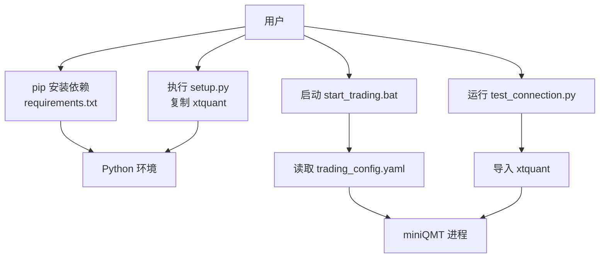
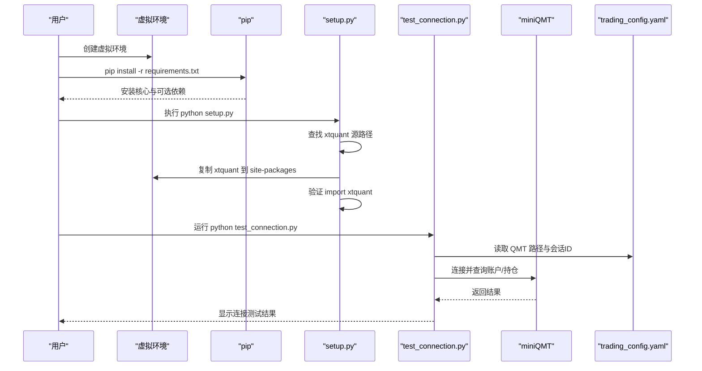
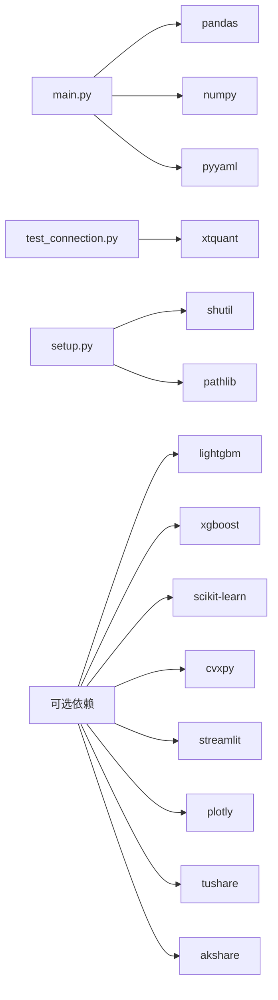

# 依赖安装

<cite>
**本文引用的文件**   
- [setup.py](file://setup.py)
- [requirements.txt](file://requirements.txt)
- [main.py](file://main.py)
- [start_trading.bat](file://start_trading.bat)
- [test_connection.py](file://test_connection.py)
- [trading_config.yaml](file://config/trading_config.yaml)
- [快速启动.md](file://快速启动.md)
- [实盘配置指南.md](file://实盘配置指南.md)
</cite>

## 目录
1. [简介](#简介)
2. [项目结构](#项目结构)
3. [核心组件](#核心组件)
4. [架构总览](#架构总览)
5. [详细组件分析](#详细组件分析)
6. [依赖关系分析](#依赖关系分析)
7. [性能与兼容性注意事项](#性能与兼容性注意事项)
8. [故障排除指南](#故障排除指南)
9. [结论](#结论)
10. [附录](#附录)

## 简介
本文件面向 QuantLab 的依赖安装与环境搭建，覆盖以下目标：
- 使用 pip 完成 Python 依赖安装（含虚拟环境创建、依赖包安装、版本冲突解决）
- 使用 setup.py 一键配置脚本进行 xtquant 库的安装与验证
- 说明 xtquant 的特殊安装要求（从 QMT 安装目录复制、路径配置）
- 介绍可选依赖包（可视化、数据库驱动、数据源等）的安装方式
- 提供常见安装问题的解决方案与排障流程

## 项目结构
QuantLab 的依赖管理由以下关键文件协同完成：
- requirements.txt：声明核心与可选依赖
- setup.py：一键配置脚本，负责查找并复制 xtquant、验证导入、创建必要目录
- start_trading.bat：启动脚本，检查运行环境与配置文件
- test_connection.py：连接测试脚本，验证 xtquant 与 miniQMT 连通性
- config/trading_config.yaml：实盘相关配置（账号、路径、会话ID等）
- main.py：回测入口，展示项目对 pandas、numpy、pyyaml 等核心依赖的使用

图表来源
- [requirements.txt:1-29](file://requirements.txt#L1-L29)
- [setup.py:1-82](file://setup.py#L1-L82)
- [start_trading.bat:1-51](file://start_trading.bat#L1-L51)
- [test_connection.py:1-96](file://test_connection.py#L1-L96)
- [trading_config.yaml:1-62](file://config/trading_config.yaml#L1-L62)

章节来源
- [requirements.txt:1-29](file://requirements.txt#L1-L29)
- [setup.py:1-82](file://setup.py#L1-L82)
- [start_trading.bat:1-51](file://start_trading.bat#L1-L51)
- [test_connection.py:1-96](file://test_connection.py#L1-L96)
- [trading_config.yaml:1-62](file://config/trading_config.yaml#L1-L62)
- [main.py:1-104](file://main.py#L1-L104)

## 核心组件
- 依赖清单与分类
  - 核心依赖：pandas、numpy、pyyaml
  - 回测依赖：scipy
  - 机器学习依赖：lightgbm（xgboost、scikit-learn 已注释为可选）
  - 组合优化（可选）：cvxpy
  - 可视化（可选）：streamlit、plotly
  - 数据源（可选）：tushare、akshare
  - QMT 实盘：xtquant（需从 QMT 安装目录复制，不在 pip 仓库中）

- 一键配置脚本（setup.py）职责
  - 自动查找 xtquant 源路径（支持多个常见路径）
  - 将 xtquant 复制到系统 Python 的 site-packages
  - 验证 xtquant 可导入（import xttrader, xtdata）
  - 创建日志与数据缓存目录

- 启动与测试
  - start_trading.bat：检查 Python、QMT 进程、配置文件，然后启动交易主程序
  - test_connection.py：检查 xtquant、QMT 路径、尝试连接并查询账户/持仓

章节来源
- [requirements.txt:1-29](file://requirements.txt#L1-L29)
- [setup.py:1-82](file://setup.py#L1-L82)
- [start_trading.bat:1-51](file://start_trading.bat#L1-L51)
- [test_connection.py:1-96](file://test_connection.py#L1-L96)

## 架构总览
下图展示了依赖安装与实盘启动的整体流程，包括 pip 安装、xtquant 复制、配置校验与连接测试。

图表来源
- [requirements.txt:1-29](file://requirements.txt#L1-L29)
- [setup.py:1-82](file://setup.py#L1-L82)
- [test_connection.py:1-96](file://test_connection.py#L1-L96)
- [trading_config.yaml:1-62](file://config/trading_config.yaml#L1-L62)

## 详细组件分析

### pip 安装流程（虚拟环境、依赖安装、版本冲突）
- 推荐步骤
  - 创建隔离的虚拟环境（避免全局污染）
  - 激活虚拟环境后，执行 pip 安装
  - 若出现版本冲突，优先锁定核心依赖版本（如 pandas、numpy、pyyaml），再按需启用可选依赖
- 依赖分类与安装建议
  - 必装：pandas、numpy、pyyaml、scipy
  - 可选：lightgbm、cvxpy、streamlit、plotly、tushare、akshare
  - 特殊：xtquant 不通过 pip 安装，需从 QMT 安装目录复制

- 版本冲突解决策略
  - 先安装核心依赖，再安装 ML/优化/可视化等可选依赖
  - 遇到编译失败或 ABI 不匹配时，优先升级 pip/setuptools/wheel
  - 针对 numpy/pandas 的版本对齐，参考 requirements.txt 中的最低版本约束

章节来源
- [requirements.txt:1-29](file://requirements.txt#L1-L29)

### setup.py 一键配置脚本使用方法与参数
- 功能概述
  - 自动定位 xtquant 源路径（支持多路径）
  - 将 xtquant 复制到当前 Python 环境的 site-packages
  - 验证 xtquant 模块可导入
  - 创建 logs、data、data/cache 目录
- 使用方式
  - 在命令行进入项目根目录，执行 python setup.py
  - 根据提示确认是否覆盖已有 xtquant 目录
- 注意
  - 该脚本会直接操作文件系统，建议在管理员权限下运行
  - 若未找到 xtquant 源路径，请手动指定 QMT 安装路径

章节来源
- [setup.py:1-82](file://setup.py#L1-L82)

### xtquant 库的特殊安装要求
- 为什么不能 pip 安装
  - xtquant 是 QMT 客户端内置库，不在 PyPI 上发布
- 安装方法
  - 方案A：使用 setup.py 自动复制（推荐）
  - 方案B：手动复制（适用于高级用户）
    - 从 QMT 安装目录的 site-packages 复制 xtquant 到当前 Python 的 site-packages
- 路径配置
  - 确保 trading_config.yaml 中的 account.path 指向正确的 QMT 路径
  - 使用 test_connection.py 验证连接与账户信息

章节来源
- [setup.py:1-82](file://setup.py#L1-L82)
- [trading_config.yaml:1-62](file://config/trading_config.yaml#L1-L62)
- [test_connection.py:1-96](file://test_connection.py#L1-L96)
- [快速启动.md:1-67](file://快速启动.md#L1-L67)
- [实盘配置指南.md:1-81](file://实盘配置指南.md#L1-L81)

### 可选依赖包的安装
- 可视化库
  - streamlit、plotly（用于交互式可视化与仪表盘）
- 数据库驱动
  - DuckDB（项目中存在 duckdb_reader.py，可按需安装）
- 数据源
  - tushare、akshare（用于获取行情与财务数据）
- 机器学习与优化
  - lightgbm、xgboost、scikit-learn、cvxpy（按需求启用）

章节来源
- [requirements.txt:1-29](file://requirements.txt#L1-L29)

### 启动与测试流程
- 启动脚本（start_trading.bat）
  - 检查 Python 是否可用
  - 检测 miniQMT 进程是否运行
  - 检查配置文件是否存在
  - 启动 live_trading.py（需确保该文件存在）
- 连接测试（test_connection.py）
  - 检查 xtquant 是否可导入
  - 读取 trading_config.yaml 中的 QMT 路径与会话ID
  - 尝试连接 miniQMT 并查询账户/持仓

章节来源
- [start_trading.bat:1-51](file://start_trading.bat#L1-L51)
- [test_connection.py:1-96](file://test_connection.py#L1-L96)
- [trading_config.yaml:1-62](file://config/trading_config.yaml#L1-L62)

## 依赖关系分析
- 核心依赖链
  - main.py 使用 pandas、numpy、pyyaml
  - test_connection.py 依赖 xtquant（来自 QMT）
  - setup.py 依赖 shutil、pathlib（标准库）
- 可选依赖链
  - 可视化：streamlit、plotly
  - 数据源：tushare、akshare
  - 机器学习：lightgbm、xgboost、scikit-learn
  - 优化：cvxpy

图表来源
- [main.py:1-104](file://main.py#L1-L104)
- [test_connection.py:1-96](file://test_connection.py#L1-L96)
- [setup.py:1-82](file://setup.py#L1-L82)
- [requirements.txt:1-29](file://requirements.txt#L1-L29)

章节来源
- [main.py:1-104](file://main.py#L1-L104)
- [test_connection.py:1-96](file://test_connection.py#L1-L96)
- [setup.py:1-82](file://setup.py#L1-L82)
- [requirements.txt:1-29](file://requirements.txt#L1-L29)

## 性能与兼容性注意事项
- Python 版本
  - 研究环境建议使用较新的 Python（如 3.11+），以兼容最新依赖
  - QMT 生产环境需保持 Python 3.6.8 兼容（见 AGENTS.md 规则）
- 依赖版本对齐
  - pandas、numpy、pyyaml 的版本需相互兼容
  - scipy、lightgbm 等科学计算库对底层 C/C++ 编译器有要求
- 编译与二进制依赖
  - 某些库需要预编译 wheel，若安装失败可尝试升级 pip/setuptools/wheel
  - 网络问题或镜像源不可用时，切换国内镜像源加速安装

[本节为通用指导，不直接分析具体文件]

## 故障排除指南
- 常见问题与解决方案
  - ImportError: No module named 'xtquant'
    - 确认已通过 setup.py 或手动复制将 xtquant 放入 site-packages
    - 检查 Python 环境是否正确（虚拟环境 vs 系统 Python）
  - 连接失败（错误码非零）
    - 确认 miniQMT 已启动并登录
    - 检查 trading_config.yaml 中的 account.path 与 session_id
  - 配置文件不存在
    - 确保 config/trading_config.yaml 存在且路径正确
  - Python 未加入 PATH
    - 在 start_trading.bat 中检测到 Python 不可用，需将 Python 加入系统 PATH

- 诊断步骤
  - 运行 test_connection.py 查看具体错误信息
  - 检查 logs 与 data 目录是否被创建
  - 确认 QMT 进程正在运行

章节来源
- [test_connection.py:1-96](file://test_connection.py#L1-L96)
- [start_trading.bat:1-51](file://start_trading.bat#L1-L51)
- [trading_config.yaml:1-62](file://config/trading_config.yaml#L1-L62)

## 结论
通过本指南，您可以：
- 使用 pip 安装核心与可选依赖，构建稳定的 Python 环境
- 利用 setup.py 一键完成 xtquant 的安装与验证
- 正确配置 trading_config.yaml 并启动实盘交易系统
- 通过 test_connection.py 快速诊断连接问题
- 按需启用可视化、数据源、机器学习等扩展依赖

[本节为总结，不直接分析具体文件]

## 附录
- 快速启动命令参考
  - 复制 xtquant：参考“快速启动.md”中的 PowerShell 命令
  - 启动 QMT：双击 XtMiniQmt.exe 并登录账号
  - 测试连接：python test_connection.py
  - 启动实盘：start_trading.bat

章节来源
- [快速启动.md:1-67](file://快速启动.md#L1-L67)
- [实盘配置指南.md:1-81](file://实盘配置指南.md#L1-L81)