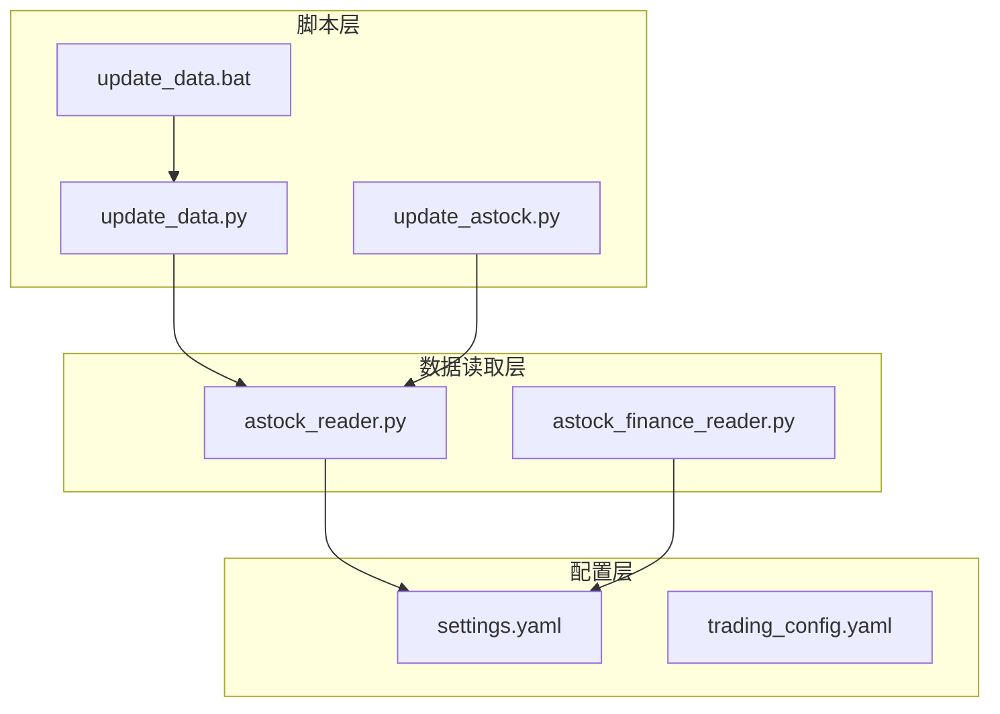
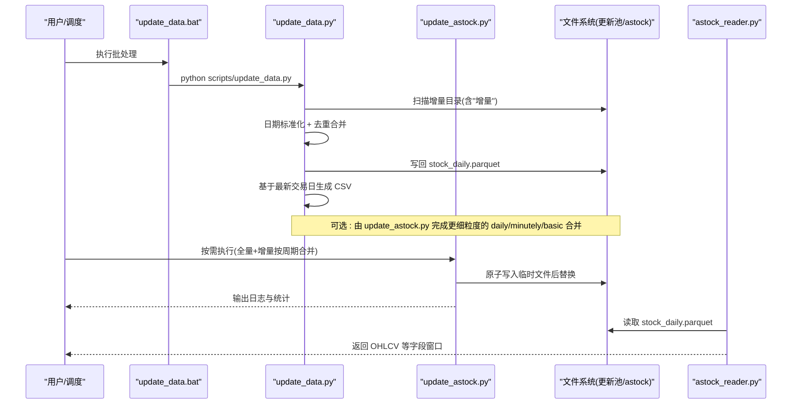
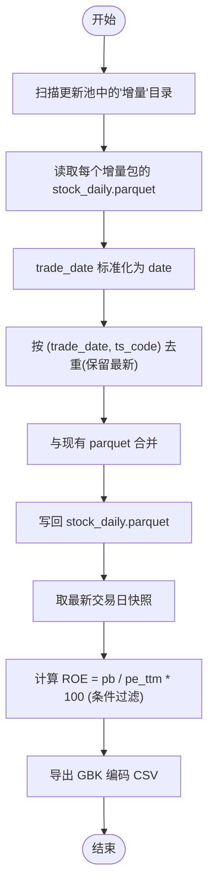
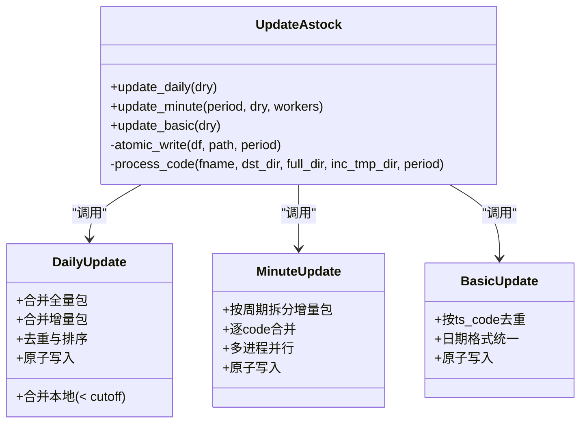
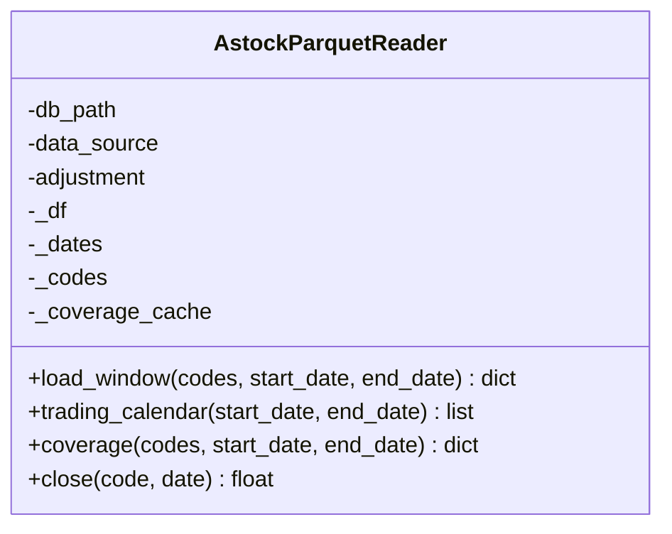
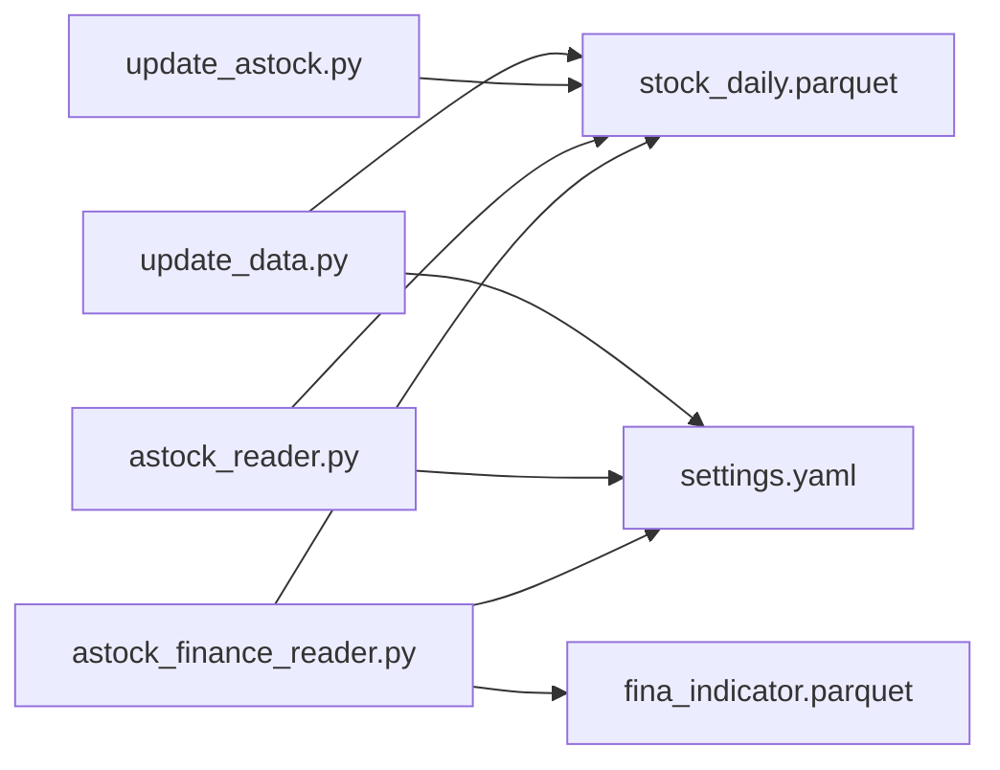

# A股数据准备

<cite>
**本文引用的文件**   
- [scripts/update_data.py](file://scripts/update_data.py)
- [scripts/update_astock.py](file://scripts/update_astock.py)
- [scripts/update_data.bat](file://scripts/update_data.bat)
- [data/astock_reader.py](file://data/astock_reader.py)
- [data/astock_finance_reader.py](file://data/astock_finance_reader.py)
- [config/settings.yaml](file://config/settings.yaml)
- [config/trading_config.yaml](file://config/trading_config.yaml)
</cite>

## 目录
1. [简介](#简介)
2. [项目结构](#项目结构)
3. [核心组件](#核心组件)
4. [架构总览](#架构总览)
5. [详细组件分析](#详细组件分析)
6. [依赖关系分析](#依赖关系分析)
7. [性能考虑](#性能考虑)
8. [故障排查指南](#故障排查指南)
9. [结论](#结论)
10. [附录](#附录)

## 简介
本文件面向 QuantLab 的 A 股数据准备流程，重点说明 astock 数据的下载与增量更新、格式转换（CSV → Parquet）、数据质量检查与清理、增量更新策略与断点续传机制，并给出 update_data.py 脚本的使用方法与注意事项。文档同时覆盖相关读取器与配置，帮助读者从“数据源”到“回测/实盘可用数据”的全链路理解。

## 项目结构
与 A 股数据准备相关的核心位置：
- 脚本层：scripts/update_data.py、scripts/update_astock.py、scripts/update_data.bat
- 数据读取层：data/astock_reader.py、data/astock_finance_reader.py
- 配置层：config/settings.yaml、config/trading_config.yaml

图表来源
- [scripts/update_data.py:1-135](file://scripts/update_data.py#L1-L135)
- [scripts/update_astock.py:1-219](file://scripts/update_astock.py#L1-L219)
- [data/astock_reader.py:1-192](file://data/astock_reader.py#L1-L192)
- [data/astock_finance_reader.py:1-200](file://data/astock_finance_reader.py#L1-L200)
- [config/settings.yaml:1-69](file://config/settings.yaml#L1-L69)
- [config/trading_config.yaml:1-62](file://config/trading_config.yaml#L1-L62)

章节来源
- [scripts/update_data.py:1-135](file://scripts/update_data.py#L1-L135)
- [scripts/update_astock.py:1-219](file://scripts/update_astock.py#L1-L219)
- [data/astock_reader.py:1-192](file://data/astock_reader.py#L1-L192)
- [data/astock_finance_reader.py:1-200](file://data/astock_finance_reader.py#L1-L200)
- [config/settings.yaml:1-69](file://config/settings.yaml#L1-L69)
- [config/trading_config.yaml:1-62](file://config/trading_config.yaml#L1-L62)

## 核心组件
- 增量更新与合并（daily/minutely/basic）：update_astock.py
- 一键更新与 CSV 重生成：update_data.py
- 日频数据读取与对齐：astock_reader.py
- 财务指标 PIT 读取：astock_finance_reader.py
- 全局与交易配置：settings.yaml、trading_config.yaml

章节来源
- [scripts/update_astock.py:1-219](file://scripts/update_astock.py#L1-L219)
- [scripts/update_data.py:1-135](file://scripts/update_data.py#L1-L135)
- [data/astock_reader.py:1-192](file://data/astock_reader.py#L1-L192)
- [data/astock_finance_reader.py:1-200](file://data/astock_finance_reader.py#L1-L200)
- [config/settings.yaml:1-69](file://config/settings.yaml#L1-L69)
- [config/trading_config.yaml:1-62](file://config/trading_config.yaml#L1-L62)

## 架构总览
整体数据流从“行情数据更新池”的增量包出发，经本地合并写入 astock 目录的 parquet 文件，再由读取器为回测/策略提供统一接口；同时可按最新交易日快照生成 QMT 所需的 CSV 文件。

图表来源
- [scripts/update_data.py:1-135](file://scripts/update_data.py#L1-L135)
- [scripts/update_astock.py:1-219](file://scripts/update_astock.py#L1-L219)
- [data/astock_reader.py:1-192](file://data/astock_reader.py#L1-L192)

## 详细组件分析

### update_data.py：一键更新与 CSV 重生成
- 功能要点
  - 自动发现“行情数据更新池”下包含“增量”字段的目录，读取其中的 stock_daily.parquet
  - 对 trade_date 进行标准化（统一为 date），按 (trade_date, ts_code) 去重保留最新
  - 将合并后的结果写回 E:/astock/daily/stock_daily.parquet
  - 基于最新交易日快照，计算 ROE=pb/pe_ttm*100（在 pe>0 且 pb>0 时），过滤缺失值后导出为 GBK 编码 CSV
- 增量目录结构要求
  - 根目录：E:/量化/行情数据更新池
  - 子目录名需包含“增量”，且子目录下存在 stock_daily.parquet
- 错误处理
  - 单个增量包读取异常会被捕获并打印前缀信息，不影响其他包处理
- 使用方式
  - 直接运行：python scripts/update_data.py
  - 可通过 update_data.bat 双击执行

图表来源
- [scripts/update_data.py:20-82](file://scripts/update_data.py#L20-L82)
- [scripts/update_data.py:85-115](file://scripts/update_data.py#L85-L115)

章节来源
- [scripts/update_data.py:1-135](file://scripts/update_data.py#L1-L135)
- [scripts/update_data.bat:1-15](file://scripts/update_data.bat#L1-L15)

### update_astock.py：细粒度增量更新（daily/minutely/basic）
- 功能要点
  - daily：合并本地(< cutoff)、全量包(2026 年)、增量包，统一列与日期类型，去重后原子写入
  - minutely：按周期逐 code 拆分增量包，支持多进程并行，保持 MultiIndex(trade_date, trade_time)
  - basic：按 ts_code 去重，统一 list_date/delist_date 为 YYYYMMDD 字符串
  - 原子写入：先写 .tmp_update，成功后 os.replace 替换原文件，保证一致性
- 断点续传
  - 通过“仅处理更新池覆盖的 code”和“本地已有 code 不动”的策略实现天然断点续传
  - 支持 --dry 只统计不落盘，便于验证
- 使用方式
  - 正常执行：python scripts/update_astock.py
  - 只统计：python scripts/update_astock.py --dry
  - 指定周期与并发：--periods 1min 5min ... --workers N

图表来源
- [scripts/update_astock.py:42-92](file://scripts/update_astock.py#L42-L92)
- [scripts/update_astock.py:95-178](file://scripts/update_astock.py#L95-L178)
- [scripts/update_astock.py:181-199](file://scripts/update_astock.py#L181-L199)

章节来源
- [scripts/update_astock.py:1-219](file://scripts/update_astock.py#L1-L219)

### astock_reader.py：日频数据读取器
- 功能要点
  - 以 MultiIndex(trade_date, ts_code) 形式加载 stock_daily.parquet
  - 提供 load_window、trading_calendar、coverage、close 四个方法，与 DuckDBDailyReader 兼容
  - 支持 raw/qfq/hfq 复权（基于 adj_factor）
  - 仅读取必要列以降低内存占用
- 数据格式
  - 输入：tushare 格式的 ts_code（如 "000001.SZ"）
  - 输出：date/open/high/low/close/vol/amount 等字段，适配回测引擎

图表来源
- [data/astock_reader.py:25-69](file://data/astock_reader.py#L25-L69)
- [data/astock_reader.py:71-116](file://data/astock_reader.py#L71-L116)
- [data/astock_reader.py:118-161](file://data/astock_reader.py#L118-L161)
- [data/astock_reader.py:163-185](file://data/astock_reader.py#L163-L185)

章节来源
- [data/astock_reader.py:1-192](file://data/astock_reader.py#L1-L192)

### astock_finance_reader.py：PIT 财务数据读取
- 功能要点
  - 从 fina_indicator.parquet 获取季度财务指标，按公告日 ann_date/f_ann_date <= asof_date 可见性规则选择最新 end_date 的记录
  - 从 stock_daily.parquet 获取每日 PE 快照，自然避免未来函数
  - 提供 get_fundamentals_pit、get_daily_pe、get_fundamentals_for_scoring 等方法
- 适用场景
  - 因子构建、评分、回测中需要严格 PIT 口径的场景

章节来源
- [data/astock_finance_reader.py:1-200](file://data/astock_finance_reader.py#L1-L200)

### 配置项与路径
- settings.yaml
  - data.source 指定主数据源为 astock
  - data.astock.daily_path/finance_path/basic_path 指向 astock 各目录
  - backtest 时间范围、基准、手续费滑点等
- trading_config.yaml
  - data.source 与 astock_path 用于实盘数据定位
  - 策略参数、风控参数、委托与通知配置

章节来源
- [config/settings.yaml:1-69](file://config/settings.yaml#L1-L69)
- [config/trading_config.yaml:1-62](file://config/trading_config.yaml#L1-L62)

## 依赖关系分析
- 脚本与读取器的耦合
  - update_data.py 与 update_astock.py 负责数据落盘；astock_reader.py 仅读不写
  - astock_finance_reader.py 依赖 daily 与 finance 两个 parquet 源
- 外部依赖
  - pandas/pyarrow 读写 parquet
  - 文件系统路径约定（更新池、astock、QMT_POOL）

图表来源
- [scripts/update_data.py:1-135](file://scripts/update_data.py#L1-L135)
- [scripts/update_astock.py:1-219](file://scripts/update_astock.py#L1-L219)
- [data/astock_reader.py:1-192](file://data/astock_reader.py#L1-L192)
- [data/astock_finance_reader.py:1-200](file://data/astock_finance_reader.py#L1-L200)
- [config/settings.yaml:1-69](file://config/settings.yaml#L1-L69)

章节来源
- [scripts/update_data.py:1-135](file://scripts/update_data.py#L1-L135)
- [scripts/update_astock.py:1-219](file://scripts/update_astock.py#L1-L219)
- [data/astock_reader.py:1-192](file://data/astock_reader.py#L1-L192)
- [data/astock_finance_reader.py:1-200](file://data/astock_finance_reader.py#L1-L200)
- [config/settings.yaml:1-69](file://config/settings.yaml#L1-L69)

## 性能考虑
- 列裁剪：astock_reader.py 仅读取必要列，降低内存占用
- 索引优化：parquet 使用 MultiIndex(trade_date, ts_code)，加速区间查询
- 原子写入：update_astock.py 使用临时文件 + os.replace，避免部分写入导致损坏
- 并行处理：minute 更新支持 ProcessPoolExecutor 多进程
- 增量策略：仅处理更新池覆盖的 code，减少不必要 I/O

[本节为通用性能建议，不直接分析具体文件]

## 故障排查指南
- 常见问题
  - 找不到 astock parquet：检查 settings.yaml 或硬编码路径是否正确
  - 增量目录未识别：确保目录名包含“增量”，且包含 stock_daily.parquet
  - 重复数据：确认去重键为 (trade_date, ts_code) 或 (trade_date, trade_time)
  - 编码问题：CSV 导出使用 GBK，注意下游工具编码设置
- 调试手段
  - 使用 update_astock.py --dry 仅统计不落盘，验证合并逻辑
  - 查看脚本输出日志，定位异常包与错误信息
  - 校验 coverage 信息（最小/最大日期、股票数）

章节来源
- [scripts/update_data.py:20-82](file://scripts/update_data.py#L20-L82)
- [scripts/update_astock.py:42-92](file://scripts/update_astock.py#L42-L92)
- [data/astock_reader.py:128-161](file://data/astock_reader.py#L128-L161)

## 结论
QuantLab 的 A 股数据准备通过“更新池增量包 → 本地合并 → parquet 存储 → 读取器统一接口”的链路，实现了高效、安全、可追溯的数据更新与消费。update_data.py 适合快速增量与 CSV 快照生成；update_astock.py 提供更细粒度的 daily/minutely/basic 合并能力，支持断点续传与原子写入。配合 astock_reader.py 与 astock_finance_reader.py，可满足回测与实盘的多种数据需求。

[本节为总结性内容，不直接分析具体文件]

## 附录

### update_data.py 使用要点
- 前置条件
  - 已存在 E:/astock/daily/stock_daily.parquet
  - 更新池目录 E:/量化/行情数据更新池 下存在包含“增量”的子目录，且子目录含 stock_daily.parquet
- 执行方式
  - 命令行：python scripts/update_data.py
  - 批处理：双击 scripts/update_data.bat
- 核心行为
  - 自动发现增量目录、标准化日期、去重合并、写回 parquet
  - 基于最新交易日生成 CSV（GBK 编码），包含 ts_code/pb/pe_ttm/circ_mv/amount/roe 等字段

章节来源
- [scripts/update_data.py:1-135](file://scripts/update_data.py#L1-L135)
- [scripts/update_data.bat:1-15](file://scripts/update_data.bat#L1-L15)

### 数据格式与字段说明
- 日频 parquet（stock_daily.parquet）
  - 索引：trade_date、ts_code
  - 常用字段：open/high/low/close/vol/amount/adj_factor/circ_mv/pe_ttm/pb/ps_ttm/dv_ttm/turnover_rate/is_st
- CSV（mfic_fin_data.csv）
  - 字段：ts_code/pb/pe_ttm/circ_mv/amount/roe
  - 编码：GBK
  - 过滤：去除 pb 或 circ_mv 缺失的行

章节来源
- [data/astock_reader.py:47-69](file://data/astock_reader.py#L47-L69)
- [scripts/update_data.py:85-115](file://scripts/update_data.py#L85-L115)

### 增量更新与断点续传
- 增量目录命名：必须包含“增量”
- 断点续传：update_astock.py 仅处理更新池覆盖的 code，本地已有 code 不动；支持 --dry 预检
- 原子写入：所有落盘均先写临时文件，成功后替换，避免损坏

章节来源
- [scripts/update_astock.py:95-178](file://scripts/update_astock.py#L95-L178)
- [scripts/update_astock.py:42-50](file://scripts/update_astock.py#L42-L50)

### 数据质量检查与清理
- 去重键
  - daily：(trade_date, ts_code)
  - minute：(trade_date, trade_time)
  - basic：ts_code
- 日期标准化
  - trade_date 统一为 date 类型
  - basic 的 list_date/delist_date 统一为 YYYYMMDD 字符串
- 缺失值处理
  - CSV 导出前 dropna(subset=['pb', 'circ_mv'])
  - 读取器在 close/window 中处理空值与 KeyError

章节来源
- [scripts/update_data.py:20-82](file://scripts/update_data.py#L20-L82)
- [scripts/update_astock.py:181-199](file://scripts/update_astock.py#L181-L199)
- [data/astock_reader.py:163-185](file://data/astock_reader.py#L163-L185)